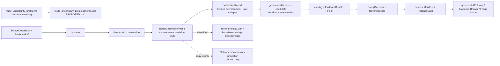

<!-- [KFM_META_BLOCK_V2]
doc_id: kfm://doc/contracts-domains-roads-rail-trade-route-uncertainty-profile
title: Route Uncertainty Profile Contract — Roads / Rail / Trade Routes
type: semantic-contract
version: v0.2
status: draft; PROPOSED; schema-stub-confirmed; slug-CONFLICTED; uncertainty-carrier; NEEDS VERIFICATION before promotion
owners:
  - OWNER_TBD — Roads/Rail/Trade Routes domain steward
  - OWNER_TBD — Historic/trade-routes steward
  - OWNER_TBD — Archaeology/Cultural Heritage steward
  - OWNER_TBD — Policy steward
  - OWNER_TBD — Contracts steward
  - OWNER_TBD — Source steward
  - OWNER_TBD — Evidence steward
  - OWNER_TBD — Schema steward
  - OWNER_TBD — Release steward
  - OWNER_TBD — Docs steward
created: NEEDS VERIFICATION — scaffold existed before v0.2 expansion
updated: 2026-06-23
policy_label: public-scaffold; contracts; roads-rail-trade; route-uncertainty-profile; uncertainty-surface; historic-overprecision-denial; source-role-aware; temporal-scope-aware; evidence-bound; generalized-public-geometry; sensitivity-aware; steward-review-default-when-cultural; route-membership-aware; release-gated; rollback-aware; not-route-truth; not-geometry-truth; not-policy-decision; not-redaction-receipt; not-publication-authority
tags: [kfm, contracts, roads-rail-trade, route-uncertainty-profile, UncertaintySurface, HistoricRouteClaim, TradeRouteCorridor, RouteMembership, CorridorRoute, RoadSegment, RailSegment, EvidenceBundle, RedactionReceipt, AggregationReceipt, PolicyDecision, ReviewRecord, ReleaseManifest, RollbackCard, EvidenceDrawer, FocusMode]
related:
  - ./README.md
  - ./historic_route_claim.md
  - ./trade_route_corridor.md
  - ./route_membership.md
  - ./corridor_route.md
  - ./road_segment.md
  - ./rail_segment.md
  - ./route_event.md
  - ./status_event.md
  - ./restriction_event.md
  - ./access_restriction.md
  - ./movement_story_node.md
  - ./domain_observation.md
  - ./domain_feature_identity.md
  - ./domain_validation_report.md
  - ./domain_layer_descriptor.md
  - ../roads/README.md
  - ../../../docs/domains/roads-rail-trade/README.md
  - ../../../docs/domains/roads-rail-trade/HISTORIC_ROUTES.md
  - ../../../docs/domains/roads-rail-trade/FILE_SYSTEM_PLAN.md
  - ../../../docs/domains/roads-rail-trade/VERIFICATION_BACKLOG.md
  - ../../../docs/domains/roads-rail-trade/OBJECT_FAMILIES.md
  - ../../../docs/domains/roads-rail-trade/IDENTITY_MODEL.md
  - ../../../docs/domains/roads-rail-trade/DATA_LIFECYCLE.md
  - ../../../docs/domains/roads-rail-trade/sublanes/roads.md
  - ../../../docs/domains/roads-rail-trade/sublanes/trade-routes.md
  - ../../../docs/domains/roads-rail-trade/GRAPH_PROJECTIONS.md
  - ../../../docs/domains/roads-rail-trade/MAP_UI_CONTRACTS.md
  - ../../../docs/runbooks/roads-rail-trade/PROMOTION_RUNBOOK.md
  - ../../../docs/runbooks/roads-rail-trade/ROLLBACK_RUNBOOK.md
  - ../../../schemas/contracts/v1/domains/roads-rail-trade/route_uncertainty_profile.schema.json
  - ../../../policy/domains/roads-rail-trade/
  - ../../../fixtures/domains/roads-rail-trade/route_uncertainty_profile/
  - ../../../tests/domains/roads-rail-trade/
  - ../../../release/candidates/roads-rail-trade/
notes:
  - "Expanded from a PROPOSED scaffold at contracts/domains/roads-rail-trade/route_uncertainty_profile.md."
  - "A paired schema at schemas/contracts/v1/domains/roads-rail-trade/route_uncertainty_profile.schema.json was found, but it is a PROPOSED permissive stub with empty properties and additionalProperties true. Field realization remains PROPOSED."
  - "Historic Routes doctrine treats uncertainty as first-class and states that the doctrinal carrier is UncertaintySurface while RouteUncertaintyProfile is a PROPOSED lane realization requiring schema/ADR reconciliation."
  - "The verification backlog requires historic-overprecision denial, public generalization receipts, cultural-corridor steward review, and source-role/legal-status denial before sensitive or uncertain route material is released."
  - "This contract defines source-scoped route-uncertainty meaning. It does not prove route identity, route membership, route geometry, legal designation, safe travel, cultural truth, graph confidence, map truth, policy approval, redaction receipt, or publication approval."
  - "The Roads / Rail / Trade Routes docs record a slug conflict between roads-rail-trade and transport for contract/schema homes. This file preserves the observed requested path and does not resolve the ADR question."
[/KFM_META_BLOCK_V2] -->

<a id="top"></a>

# Route Uncertainty Profile Contract — Roads / Rail / Trade Routes

> Semantic contract for `route_uncertainty_profile`: the evidence-bound uncertainty carrier that records how much confidence, precision, ambiguity, source-role limitation, temporal ambiguity, and public-generalization requirement attaches to a route, route claim, corridor, membership, or rendered route view — without becoming route truth, geometry truth, cultural truth, graph truth, policy approval, redaction receipt, or publication approval.

<p>
  
  
  
  
  
  
  
</p>

`contracts/domains/roads-rail-trade/route_uncertainty_profile.md`

## Quick jumps

[Status](#status) · [Meaning](#meaning) · [Repo fit](#repo-fit) · [Schema posture](#schema-posture) · [Accepted uses](#accepted-uses) · [Exclusions](#exclusions) · [Recommended fields](#recommended-fields) · [Invariants](#invariants) · [Uncertainty profile families](#uncertainty-profile-families) · [Source-role and time rules](#source-role-and-time-rules) · [Sensitivity and publication posture](#sensitivity-and-publication-posture) · [Lifecycle](#lifecycle) · [Validation](#validation) · [Rollback](#rollback) · [Evidence basis](#evidence-basis) · [Open questions](#open-questions)

---

## Status

> [!IMPORTANT]
> **Status:** `draft` / semantic contract  
> **Owner:** `OWNER_TBD`  
> **Contract path:** `contracts/domains/roads-rail-trade/route_uncertainty_profile.md`  
> **Schema path:** `schemas/contracts/v1/domains/roads-rail-trade/route_uncertainty_profile.schema.json` — **found as PROPOSED permissive stub**  
> **Truth posture:** target path, prior scaffold, and paired schema stub are confirmed from current repo evidence. The schema currently declares `additionalProperties: true` and no properties, so field realization, validator behavior, fixture coverage, policy behavior, public DTO behavior, Evidence Drawer behavior, graph behavior, release manifests, and runtime behavior remain **NEEDS VERIFICATION**.

> [!CAUTION]
> This contract defines route-uncertainty-profile meaning only. It does **not** prove a route exists, where it precisely ran, that a membership is correct, that a route is legally designated, that public geometry is safe to expose, that cultural sensitivity has been reviewed, or that a map/API/AI surface may publish the route.

---

## Meaning

`route_uncertainty_profile` records the uncertainty posture attached to a route-shaped claim or route-derived surface.

It may represent uncertainty about:

- whether a `HistoricRouteClaim` is adequately supported;
- how precisely a route, corridor, trail, road, rail line, freight corridor, or trade corridor can be located;
- whether a `RouteMembership` attaches a particular `Road Segment`, `Rail Segment`, crossing, ferry, bridge, river crossing, facility, or historic claim to a `CorridorRoute`;
- which source roles support the claim and whether they are authority, observation, context, model, candidate, administrative, aggregate, or synthetic;
- whether public display must be generalized, redacted, staged, denied, or held for steward review;
- whether graph projections, movement-story nodes, Evidence Drawer cards, Focus Mode summaries, or map layers may cite the route without creating false precision.

This contract owns the **uncertainty profile meaning** for Roads / Rail / Trade route-like objects. It tells maintainers how to represent bounded confidence, positional precision, source-role limits, temporal ambiguity, caveats, and generalization requirements. It does not own the route/corridor entity, member object identity, evidence bundle, policy decision, review record, redaction/generalization receipt, graph projection, map rendering, or release decision.

---

## Repo fit

| Responsibility | Path or root | Relationship |
|---|---|---|
| Parent contract lane | `./README.md` | Defines this folder as semantic contracts only. |
| Historic route claim | `./historic_route_claim.md` | Primary route-claim consumer; uncertainty prevents false precision. |
| Trade route corridor | `./trade_route_corridor.md` | Generalized corridor context may require uncertainty and steward review. |
| Route membership | `./route_membership.md` | Membership may carry confidence, ambiguity, and temporal uncertainty. |
| Corridor route | `./corridor_route.md` | Route/corridor entity may reference uncertainty profile without becoming uncertainty itself. |
| Segments and crossings | `./road_segment.md`, `./rail_segment.md`, `./crossing.md`, `./bridge.md`, `./ferry.md`, `./river_crossing.md` | Member/source objects keep their own identity; uncertainty profile describes the route relation or interpretation. |
| Events/restrictions/status | `./route_event.md`, `./status_event.md`, `./restriction_event.md`, `./access_restriction.md` | Events can modify confidence or temporal scope but remain separate objects. |
| Movement story node | `./movement_story_node.md` | Narrative must cite uncertainty instead of converting uncertainty to confidence. |
| Domain docs | `../../../docs/domains/roads-rail-trade/HISTORIC_ROUTES.md`, `../../../docs/domains/roads-rail-trade/VERIFICATION_BACKLOG.md` | Define uncertainty-first, overprecision denial, and verification backlog posture. |
| Schema stub | `../../../schemas/contracts/v1/domains/roads-rail-trade/route_uncertainty_profile.schema.json` | Existing permissive stub; field realization remains PROPOSED. |
| Policy | `../../../policy/domains/roads-rail-trade/` or ADR-selected alternate | Allow/deny/restrict/abstain decisions, especially for overprecision and cultural sensitivity. |
| Receipts | Redaction/Aggregation/Generalization receipt families | Separate proof of public-safe transformation; not owned by this contract. |
| Release/rollback | `../../../release/candidates/roads-rail-trade/` and release roots | Promotion, release, correction, rollback, and derivative invalidation. |

---

## Schema posture

A paired schema was found at:

```text
schemas/contracts/v1/domains/roads-rail-trade/route_uncertainty_profile.schema.json
```

Current schema posture from current repo evidence:

| Schema property | Current value | Meaning |
|---|---|---|
| `$schema` | JSON Schema draft 2020-12 | CONFIRMED stub metadata. |
| `$id` | `kfm://schemas/contracts/v1/domains/roads-rail-trade/route_uncertainty_profile.schema.json` | CONFIRMED schema identifier in stub. |
| `title` | `Route Uncertainty Profile` | CONFIRMED title. |
| `description` | PROPOSED scaffold from docs inventory | Confirms scaffold status only. |
| `type` | `object` | Permissive object container. |
| `additionalProperties` | `true` | Does not constrain field shape. |
| `properties` | `{}` | No machine-checkable fields yet. |
| `x-kfm.status` | `PROPOSED` | Confirms schema is not mature. |

> [!WARNING]
> Because the schema is currently a permissive stub, every field below is **PROPOSED** semantic guidance. Do not treat it as machine-enforced until schema properties, validator behavior, fixtures, policy tests, receipt links, public DTO behavior, and runtime behavior are verified.

---

## Accepted uses

| Use | Allowed? | Rule |
|---|---:|---|
| Recording route/corridor alignment uncertainty | Yes | Must cite source role, evidence, temporal scope, and positional precision limit. |
| Supporting historic-overprecision denial | Yes | Profile should describe why precision must be generalized, redacted, held, or denied. |
| Supporting public uncertainty display | Conditional | Requires EvidenceBundle, PolicyDecision, ReviewRecord, release state, and public-safe wording. |
| Supporting RouteMembership confidence/caveats | Conditional | Membership remains separate; uncertainty profile only describes confidence and limits. |
| Supporting TradeRouteCorridor / Indigenous corridor review | Conditional | Steward/cultural/sovereignty review and generalized geometry are default where applicable. |
| Supporting graph or Focus Mode caveats | Conditional | Derived graph and narrative must cite uncertainty and remain downstream. |
| Replacing EvidenceBundle, PolicyDecision, ReviewRecord, RedactionReceipt, or ReleaseManifest | No | Those are separate authority/proof objects. |
| Laundering an uncertain route into survey-grade geometry | No | Fails closed under historic-overprecision/source-role-collapse rules. |

---

## Exclusions

`route_uncertainty_profile` must not be used as:

| Misuse | Required outcome |
|---|---|
| Route truth | Use `CorridorRoute`, `HistoricRouteClaim`, `TradeRouteCorridor`, and EvidenceBundle-backed route records. |
| Segment or membership identity | Use `Road Segment`, `Rail Segment`, and `RouteMembership` contracts. |
| Geometry truth | Geometry refs are bounded by uncertainty; they do not prove precise alignment. |
| Policy approval | Use `PolicyDecision` and review artifacts. |
| Redaction/generalization proof | Use RedactionReceipt, AggregationReceipt, or GeneralizationReceipt family. |
| Cultural or Indigenous corridor truth | Use Archaeology/Cultural Heritage and steward/sovereignty review. |
| Legal route designation or public access | `ABSTAIN`; uncertainty profile cannot certify legal status. |
| Graph confidence as truth | Graph confidence remains derived and must cite evidence. |
| Public API/map payload by itself | Use governed API/released artifacts only. |
| Publication approval | ReleaseManifest, ReviewRecord, PolicyDecision, correction path, and RollbackCard remain separate. |

---

## Recommended fields

The following fields are **PROPOSED** until the paired schema is made restrictive and validated.

| Field | Meaning |
|---|---|
| `id` | Canonical route-uncertainty-profile identifier. |
| `version` | Contract/object version. |
| `spec_hash` | Deterministic hash over normalized profile content. |
| `domain` | Expected value: `roads-rail-trade` unless ADR selects another slug. |
| `profile_kind` | Historic alignment, route membership, trade corridor, freight corridor, graph projection, public layer, Focus Mode, candidate, or source-specific profile type. |
| `subject_ref` | Route, claim, membership, segment, corridor, graph, layer, or story node this uncertainty profile describes. |
| `subject_family` | Object family of the subject: HistoricRouteClaim, TradeRouteCorridor, RouteMembership, CorridorRoute, RoadSegment, RailSegment, NetworkEdge, etc. |
| `uncertainty_statement` | Human-readable uncertainty summary for reviewers and Evidence Drawer users. |
| `uncertainty_basis` | Source limitation, conflicting sources, temporal ambiguity, geometry ambiguity, cultural sensitivity, modeled inference, candidate state, or source-role limitation. |
| `source_refs` | SourceDescriptor/source registry refs contributing to uncertainty. |
| `source_role_summary` | Preserved source-role posture of supporting evidence. |
| `evidence_refs` | EvidenceRefs or EvidenceBundle refs. |
| `confidence_label` | Low, medium, high, unknown, conflicting, candidate, source-limited, or project-approved enum once schema defines it. |
| `precision_label` | Survey-grade, generalized, corridor-band, county-level, narrative-only, redacted, unknown, or denied. |
| `precision_statement` | Text explaining the finest precision the evidence can support. |
| `geometry_uncertainty_ref` | UncertaintySurface / uncertainty geometry / band / envelope ref. |
| `public_geometry_rule` | Generalize, redact, stage, deny, or display-as-released rule. |
| `generalization_ref` | AggregationReceipt / GeneralizationReceipt ref where geometry is generalized. |
| `redaction_ref` | RedactionReceipt ref where detail is suppressed. |
| `policy_decision_ref` | PolicyDecision governing uncertainty handling or publication. |
| `review_ref` | ReviewRecord, steward review, cultural review, or sovereignty review ref. |
| `valid_time` | Time interval the uncertainty assessment applies to. |
| `source_time` | Time of supporting sources. |
| `assessment_time` | Time the uncertainty profile was assessed. |
| `release_time` | KFM governed release time, if released. |
| `supersedes_ref` | Prior uncertainty profile superseded by this one. |
| `superseded_by_ref` | Later profile replacing this one. |
| `map_display_caveat` | Public-safe caveat for map/Evidence Drawer/Focus Mode display. |
| `rollback_ref` | RollbackCard or rollback target. |
| `limitations` | Caveats: uncertainty profile only; not route truth, geometry truth, policy decision, receipt, or release authority. |

---

## Invariants

1. **Uncertainty is first-class.** KFM records uncertainty as data, not as hidden prose or a weak footnote.
2. **Uncertainty does not create truth.** A profile explains limits; it does not prove a route, geometry, membership, source, cultural claim, or legal status.
3. **No false precision.** Public route geometry must never imply precision beyond evidence support.
4. **Source role is preserved.** Context, candidate, model, administrative, and synthetic sources do not gain authority through profile wording.
5. **Uncertainty is not a receipt.** Redaction/generalization receipts prove transformations; uncertainty profiles explain evidentiary limits.
6. **Policy remains separate.** PolicyDecision determines allow/deny/restrict/abstain; the uncertainty profile informs but does not decide.
7. **Cultural sensitivity fails closed.** Indigenous, treaty, oral-history, cultural, archaeological, and sovereignty-sensitive routes default to steward review and generalized public geometry.
8. **Graph is downstream.** Graph confidence, route-history projection, and Focus Mode narrative must cite uncertainty and cannot replace EvidenceBundle.
9. **Publication requires gates.** Public display requires EvidenceBundle, PolicyDecision, ReviewRecord, transformation receipts where applicable, ReleaseManifest, correction path, and RollbackCard.

---

## Uncertainty profile families

| Profile family | Meaning | Special guardrail |
|---|---|---|
| `historic_alignment_uncertainty` | Uncertainty about historic route alignment or corridor position. | Historic-overprecision denial applies. |
| `route_membership_uncertainty` | Uncertainty about whether a member belongs to a route/corridor. | Membership remains a separate associative claim. |
| `trade_corridor_uncertainty` | Uncertainty about generalized trade or mobility corridor context. | Cultural/sovereignty review may be required. |
| `indigenous_or_cultural_corridor_uncertainty` | Uncertainty/sensitivity around Indigenous, treaty, oral-history, or cultural corridor evidence. | Steward review and generalized public geometry by default. |
| `source_conflict_uncertainty` | Sources disagree about alignment, time, route name, or membership. | Preserve disagreement; do not pick a winner without review. |
| `temporal_uncertainty` | Uncertainty about valid time, source time, or event sequence. | Keep source/valid/retrieval/release times distinct. |
| `geometry_precision_uncertainty` | Source geometry is coarse, generalized, digitized, modeled, or derived. | Public geometry must not exceed supported precision. |
| `graph_projection_uncertainty` | Uncertainty carried into derived NetworkEdge, NetworkNode, or route-history projection. | Graph remains derived and rollbackable. |
| `candidate_profile` | OCR/model/map-label/connector proposes uncertainty profile for review. | Review-only; no public release without evidence/policy gates. |
| `released_public_profile` | Profile included in released Evidence Drawer / Focus Mode / map context. | Requires release manifest and rollback target. |

---

## Source-role and time rules

Route-uncertainty profiles must carry source role and time as core meaning.

| Rule | Requirement |
|---|---|
| Source role is fixed at admission | Promotion never turns OSM/GNIS, map labels, OCR hits, local histories, model outputs, or administrative compilations into route authority. |
| Uncertainty assessment has its own time | Assessment time, source time, valid time, retrieval time, release time, and correction time are separate. |
| Public precision is bounded | Public display must be no more precise than the source/evidence can support. |
| Modern geometry cannot loan precision | Joining a historic/candidate claim to modern road/rail geometry must not manufacture precision. |
| Membership uncertainty is distinct from membership | A profile may describe a membership's confidence; it is not the RouteMembership object. |
| Cross-lane evidence stays cited | Archaeology/Cultural Heritage, Hydrology, Hazards, People/Land, Settlements/Infrastructure, and legal/source evidence are cited through governed refs, not absorbed. |
| Release time is explicit | Public display must cite release artifact and rollback target. |

---

## Sensitivity and publication posture

| Surface | Default posture | Required support before public exposure |
|---|---|---|
| Modern road/rail uncertainty caveat | Public-safe when evidence/release supports | EvidenceBundle, source-role statement, ReleaseManifest, rollback target. |
| Historic route alignment uncertainty | Generalized and uncertainty-forward | UncertaintySurface/Profile, historic-overprecision validation, review, release. |
| Trade-route corridor uncertainty | Generalized and steward-aware | Source-role evidence, policy, review, release, rollback. |
| Indigenous / treaty / oral-history / cultural corridor uncertainty | Steward review and generalized public geometry | Cultural/sovereignty review, PolicyDecision, RedactionReceipt/AggregationReceipt, ReviewRecord, ReleaseManifest. |
| Graph projection uncertainty | Derived and cited | EvidenceBundle lineage, derivation receipt, graph rollback. |
| Candidate/model uncertainty profile | Review-only | No public surface until evidence closure and policy/release gates pass. |

---

## Lifecycle



Contracts describe meaning. They do not move data, validate schemas, execute source reconciliation, create policy decisions, emit transformation receipts, close evidence, perform review, publish artifacts, render maps, prove route geometry, or authorize AI answers.

---

## Validation

Before this contract is treated as mature, maintainers should verify:

- [ ] the ADR-selected contract/schema slug and whether this file should remain under `contracts/domains/roads-rail-trade/` or migrate to `contracts/transport/`;
- [ ] whether `RouteUncertaintyProfile` is the lane-specific realization of `UncertaintySurface`, or a separate contract that references `UncertaintySurface`;
- [ ] paired schema becomes restrictive and includes subject refs, uncertainty basis, confidence/precision labels, source role, evidence refs, geometry uncertainty refs, public geometry rule, receipts, policy, review, release, and rollback refs;
- [ ] fixtures cover historic alignment uncertainty, route-membership uncertainty, trade-corridor uncertainty, cultural/Indigenous corridor uncertainty, source-conflict uncertainty, temporal uncertainty, geometry-precision uncertainty, graph-projection uncertainty, candidate profiles, and released public profiles;
- [ ] tests enforce historic-overprecision denial and reject precision laundering through modern road/rail geometry;
- [ ] tests preserve source role and prevent OSM/GNIS, map labels, local histories, OCR/model candidates, or administrative compilations from becoming route authority;
- [ ] policy tests require steward/cultural/sovereignty review for sensitive corridor uncertainty and generalized public geometry where required;
- [ ] public DTOs and Evidence Drawer / Focus Mode payloads display uncertainty and caveats without implying survey precision;
- [ ] rollback invalidates derived route geometry, graph projections, layer descriptors, Evidence Drawer payloads, Focus Mode states, movement story nodes, exports, caches, and AI summaries that cited the withdrawn profile.

---

## Rollback

Rollback or correction is required when this contract:

- claims mature route-uncertainty schema, validators, policy, fixtures, tests, source registry, lifecycle data, release, API, UI, graph, or runtime behavior exists without proof;
- hides the `roads-rail-trade` vs `transport` slug conflict;
- treats uncertainty profile as route truth, geometry truth, membership truth, cultural truth, legal designation, public access status, graph truth, or publication approval;
- lets uncertainty wording launder weak/context/model evidence into stronger route authority;
- publishes route geometry at a precision greater than the evidence supports;
- skips required steward review, cultural/sovereignty review, redaction/generalization receipt, release manifest, or rollback target;
- fails to invalidate downstream maps, graph views, Focus Mode states, exports, or AI summaries after uncertainty profile correction or withdrawal.

Rollback target: revert this file to prior scaffold blob SHA `69bdaba7194f7bd494a216c61b62e976d1437dbd`, record drift if authority boundaries were affected, and invalidate downstream derivatives that cited the weakened route-uncertainty-profile contract.

---

## Evidence basis

| Evidence | Status | Supports | Limit |
|---|---|---|---|
| Prior `contracts/domains/roads-rail-trade/route_uncertainty_profile.md` | `CONFIRMED` | Target file existed as a PROPOSED scaffold and listed `MISSING_OR_PLANNED_FILES.md` plus `VERIFICATION_BACKLOG.md`. | Scaffold did not define authoritative semantic contract content. |
| `schemas/contracts/v1/domains/roads-rail-trade/route_uncertainty_profile.schema.json` | `CONFIRMED stub / PROPOSED field realization` | Paired schema exists, but has empty `properties` and `additionalProperties: true`. | Does not enforce fields, validators, policy, fixtures, or runtime behavior. |
| `docs/domains/roads-rail-trade/HISTORIC_ROUTES.md` | `CONFIRMED doctrine / PROPOSED implementation` | Treats uncertainty as first-class, requires UncertaintySurface, notes RouteUncertaintyProfile as PROPOSED lane realization, and defines historic-overprecision denial posture. | Does not prove schema/validator/test implementation. |
| `docs/domains/roads-rail-trade/VERIFICATION_BACKLOG.md` | `CONFIRMED backlog / NEEDS VERIFICATION items` | Requires cultural-corridor policy, historic-overprecision denial, and public generalization receipt verification. | Backlog items are unresolved until implementation evidence lands. |
| `docs/domains/roads-rail-trade/DATA_LIFECYCLE.md` | `CONFIRMED doctrine / PROPOSED implementation` | Defines lifecycle gates, quarantine for historic overprecision, receipts, graph projections as derived, and public service through governed APIs/manifests. | Does not prove runtime, API, release, validator, or test maturity. |
| `docs/domains/roads-rail-trade/sublanes/roads.md` | `CONFIRMED terms / PROPOSED field realization` | Confirms route/segment/membership separation and source-role anti-collapse. | Roads-focused; not the full uncertainty schema. |
| `docs/domains/roads-rail-trade/sublanes/trade-routes.md` | `CONFIRMED terms / PROPOSED field realization` | Confirms historic/trade route claim-not-fact posture, cross-period RouteMembership, steward review, and generalized geometry posture. | Does not prove schema/validator/test implementation. |
| Uploaded authoring prompt v2 | `CONFIRMED user-supplied guidance` | Requires evidence-grounded, visually polished, implementation-honest Markdown with verification and rollback posture. | Authoring guidance, not implementation proof. |

---

## Open questions

| ID | Question | Status |
|---|---|---|
| OQ-RRT-RUP-01 | Should `route_uncertainty_profile.md` remain at `contracts/domains/roads-rail-trade/` or migrate to `contracts/transport/` after slug ADR resolution? | OPEN / ADR NEEDED |
| OQ-RRT-RUP-02 | Is `RouteUncertaintyProfile` the lane-specific realization of `UncertaintySurface`, or a separate profile that references an `UncertaintySurface` object? | OPEN / SCHEMA + ADR REVIEW |
| OQ-RRT-RUP-03 | Which confidence, precision, uncertainty-basis, public-geometry-rule, and sensitivity enums are canonical? | OPEN / SCHEMA REVIEW |
| OQ-RRT-RUP-04 | Which transformation receipts prove public generalization/redaction, and where do they live? | OPEN / RECEIPT REVIEW |
| OQ-RRT-RUP-05 | How should Evidence Drawer, Focus Mode, and map layers word uncertainty without implying false route precision? | OPEN / UI + POLICY REVIEW |
| OQ-RRT-RUP-06 | How should rollback invalidate route geometry, graph projections, maps, Focus Mode states, exports, and AI summaries that cited a corrected uncertainty profile? | OPEN / RELEASE REVIEW |

<p align="right"><a href="#top">Back to top</a></p>
