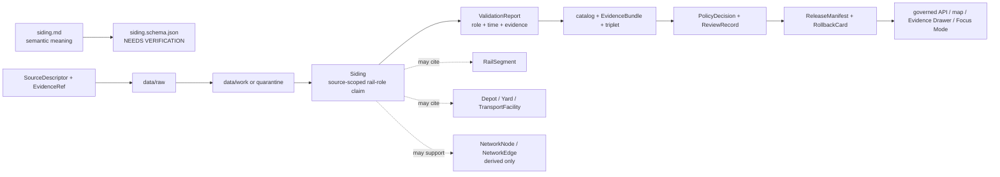

<!-- [KFM_META_BLOCK_V2]
doc_id: kfm://doc/contracts-domains-roads-rail-trade-siding
title: Siding Contract — Roads / Rail / Trade Routes
type: semantic-contract
version: v0.2
status: draft; PROPOSED; schema-missing; slug-CONFLICTED; rail-facility-role; NEEDS VERIFICATION before promotion
owners:
  - OWNER_TBD — Roads/Rail/Trade Routes domain steward
  - OWNER_TBD — Rail steward
  - OWNER_TBD — Settlements/Infrastructure steward
  - OWNER_TBD — Contracts steward
  - OWNER_TBD — Source steward
  - OWNER_TBD — Evidence steward
  - OWNER_TBD — Schema steward
  - OWNER_TBD — Policy steward
  - OWNER_TBD — Release steward
  - OWNER_TBD — Docs steward
created: NEEDS VERIFICATION — scaffold existed before v0.2 expansion
updated: 2026-06-23
policy_label: public; contracts; roads-rail-trade; siding; rail-siding; rail-facility-role; transport-side-claim; source-role-aware; temporal-scope-aware; evidence-bound; settlements-infrastructure-boundary-aware; rail-segment-adjacent; operator-status-aware; graph-projection-aware; release-gated; rollback-aware; not-property-title; not-structural-inspection; not-live-service-status; not-switching-instruction; not-operational-authority; not-publication-authority
tags: [kfm, contracts, roads-rail-trade, siding, rail-siding, rail, rail-segment, depot, yard, transport-facility, corridor-route, route-membership, operator-assignment, operator-status, status-event, route-event, access-restriction, restriction-event, settlement, infrastructure-identity, network-node, network-edge, source-role, valid-time, EvidenceBundle, PolicyDecision, ReviewRecord, ReleaseManifest, RollbackCard]
related:
  - ./README.md
  - ./rail_segment.md
  - ./depot.md
  - ./yard.md
  - ./transport_facility.md
  - ./corridor_route.md
  - ./route_membership.md
  - ./operator_assignment.md
  - ./operator_status.md
  - ./route_event.md
  - ./status_event.md
  - ./access_restriction.md
  - ./restriction_event.md
  - ./crossing.md
  - ./bridge.md
  - ./river_crossing.md
  - ./network_node.md
  - ./network_edge.md
  - ./movement_story_node.md
  - ./domain_observation.md
  - ./domain_feature_identity.md
  - ./domain_validation_report.md
  - ./domain_layer_descriptor.md
  - ../roads/README.md
  - ../../../docs/domains/roads-rail-trade/README.md
  - ../../../docs/domains/roads-rail-trade/CANONICAL_PATHS.md
  - ../../../docs/domains/roads-rail-trade/OBJECT_FAMILIES.md
  - ../../../docs/domains/roads-rail-trade/IDENTITY_MODEL.md
  - ../../../docs/domains/roads-rail-trade/DATA_LIFECYCLE.md
  - ../../../docs/domains/roads-rail-trade/SOURCES.md
  - ../../../docs/domains/roads-rail-trade/sublanes/rail.md
  - ../../../docs/domains/roads-rail-trade/GRAPH_PROJECTIONS.md
  - ../../../docs/domains/roads-rail-trade/MAP_UI_CONTRACTS.md
  - ../../../docs/runbooks/roads-rail-trade/PROMOTION_RUNBOOK.md
  - ../../../docs/runbooks/roads-rail-trade/ROLLBACK_RUNBOOK.md
  - ../../../schemas/contracts/v1/domains/roads-rail-trade/siding.schema.json
  - ../../../policy/domains/roads-rail-trade/
  - ../../../fixtures/domains/roads-rail-trade/siding/
  - ../../../tests/domains/roads-rail-trade/
  - ../../../release/candidates/roads-rail-trade/
notes:
  - "Expanded from a PROPOSED scaffold at contracts/domains/roads-rail-trade/siding.md."
  - "A paired schema at schemas/contracts/v1/domains/roads-rail-trade/siding.schema.json was not found in this task. Field realization remains PROPOSED."
  - "The parent domain names Siding as a Roads / Rail / Trade Routes object, while rail sublane doctrine warns that depot/siding/yard facility canonical identity remains settlement/infrastructure-owned."
  - "The Depot contract already uses the same boundary pattern: the Roads/Rail/Trade file defines the rail-network role claim, not full place, building, title, structural, legal-entity, operator, or live-service authority."
  - "This contract defines source-scoped siding meaning. It does not prove rail-segment identity, facility canonical identity, property title, switching permission, current service, operator control, legal access, graph truth, map truth, or publication approval."
  - "The Roads / Rail / Trade Routes docs record a slug conflict between roads-rail-trade and transport for contract/schema homes. This file preserves the observed requested path and does not resolve the ADR question."
[/KFM_META_BLOCK_V2] -->

<a id="top"></a>

# Siding Contract — Roads / Rail / Trade Routes

> Semantic contract for `siding`: the transport-side claim that a rail-associated track, facility relation, place, operating point, passing track, industry track, storage track, spur-like siding, depot-adjacent track, yard-adjacent track, or historic rail feature functioned as a siding in rail movement evidence — without becoming rail-segment truth, settlement/infrastructure canonical identity, property title, switch authority, current service authority, live operating instruction, graph truth, map truth, or publication approval.

<p>
  
  
  
  
  
  
  
</p>

`contracts/domains/roads-rail-trade/siding.md`

## Quick jumps

[Status](#status) · [Meaning](#meaning) · [Repo fit](#repo-fit) · [Schema posture](#schema-posture) · [Accepted uses](#accepted-uses) · [Exclusions](#exclusions) · [Recommended fields](#recommended-fields) · [Invariants](#invariants) · [Siding claim families](#siding-claim-families) · [Source-role and time rules](#source-role-and-time-rules) · [Lifecycle](#lifecycle) · [Validation](#validation) · [Rollback](#rollback) · [Evidence basis](#evidence-basis) · [Open questions](#open-questions)

---

## Status

> [!IMPORTANT]
> **Status:** `draft` / semantic contract  
> **Owner:** `OWNER_TBD`  
> **Contract path:** `contracts/domains/roads-rail-trade/siding.md`  
> **Schema path:** `schemas/contracts/v1/domains/roads-rail-trade/siding.schema.json` — **not found in this task**  
> **Truth posture:** the target path and prior scaffold are confirmed from current repo evidence. `Siding` is confirmed as a Roads / Rail / Trade Routes object term in the domain README and as a rail sublane in-scope rail-network facility type whose identity remains settlement/infrastructure-owned. Exact schema fields, validator behavior, fixture coverage, policy behavior, source-registry behavior, release manifests, emitted proofs, public API behavior, map rendering, graph behavior, and runtime behavior remain **NEEDS VERIFICATION**.

> [!CAUTION]
> This contract defines siding meaning only. It does **not** certify track ownership, property title, switch permission, train handling authority, active service, structural condition, yard/depot identity, current operating railroad authority, public access, emergency status, map/API behavior, or publication approval.

---

## Meaning

`siding` records the semantic meaning of a rail-associated siding claim inside Roads / Rail / Trade Routes.

It may represent that a source asserts a siding:

- functioned as a passing siding, storage siding, house track, team track, industry siding, depot siding, yard lead, set-out track, spur-like service track, interchange-related siding, or historic siding;
- was associated with a `Rail Segment`, `CorridorRoute`, `RouteMembership`, `Depot`, `Yard`, `TransportFacility`, `OperatorAssignment`, `OperatorStatus`, `RouteEvent`, `StatusEvent`, `AccessRestriction`, `NetworkNode`, or released map/Focus Mode view;
- had a source-scoped name, railroad/operator relation, timetable relation, station/agency-point relation, line/branch relation, map relation, historic period, or siding-site claim;
- may contribute to a released graph projection only as a governed, evidence-cited, release-gated derivative;
- may cite settlement, infrastructure, land, parcel, building, railroad, operating, historical, or preservation evidence without absorbing those domains' authority.

The siding contract owns the **rail-network role claim**: how a track or facility-adjacent rail feature functioned as a siding in rail movement, route evidence, operator evidence, and historical transport context. The canonical place/facility identity usually belongs to `settlements-infrastructure`. Property, parcel, deed, right-of-way, or ownership truth belongs to People/Land or the relevant source authority. Operational permission, switching instructions, service status, and dispatching/safety claims require separate authoritative and policy-reviewed records.

---

## Repo fit

| Responsibility | Path or root | Relationship |
|---|---|---|
| Parent contract lane | `./README.md` | Defines this folder as semantic contracts only. |
| Rail segment companion | `./rail_segment.md` | Siding may cite rail-alignment evidence; it does not replace rail segment identity. |
| Related rail facility contracts | `./depot.md`, `./yard.md`, `./transport_facility.md` | Adjacent rail role/facility meanings; canonical place/facility identity remains separate. |
| Route/corridor contracts | `./corridor_route.md`, `./route_membership.md` | Siding may participate in a route/corridor context without becoming route membership. |
| Operator/status/event contracts | `./operator_assignment.md`, `./operator_status.md`, `./route_event.md`, `./status_event.md`, `./access_restriction.md`, `./restriction_event.md` | Operator, status, route, restriction, and event semantics remain separate. |
| Crossing and bridge contracts | `./crossing.md`, `./bridge.md`, `./river_crossing.md` | Siding may be near or connected to crossing/bridge evidence without absorbing those meanings. |
| Graph contracts | `./network_node.md`, `./network_edge.md` | Derived topology; graph output must cite siding evidence. |
| Parent doctrine | `../../../docs/domains/roads-rail-trade/README.md` | Domain scope and object roster. |
| Rail sublane dossier | `../../../docs/domains/roads-rail-trade/sublanes/rail.md` | Rail-specific realization and explicit non-ownership of depot/siding/yard facility canonical identity. |
| Object families | `../../../docs/domains/roads-rail-trade/OBJECT_FAMILIES.md` | Broader object-family spine and deterministic identity posture; Siding appears in the domain roster/rail sublane rather than the fourteen-family table. |
| Schemas | `../../../schemas/contracts/v1/domains/roads-rail-trade/` or ADR-selected alternate | Machine shape; paired schema missing in this task. |
| Policy | `../../../policy/domains/roads-rail-trade/` or ADR-selected alternate | Allow/deny/restrict/abstain decisions. |
| Fixtures/tests | `../../../fixtures/domains/roads-rail-trade/`, `../../../tests/domains/roads-rail-trade/` | Behavior proof; not contract prose. |
| Release/rollback | `../../../release/candidates/roads-rail-trade/` and release roots | Promotion, release, correction, and rollback. |

---

## Schema posture

A direct paired schema was checked at:

```text
schemas/contracts/v1/domains/roads-rail-trade/siding.schema.json
```

That file was **not found** in this task.

> [!WARNING]
> Because no paired schema was confirmed, every field below is **PROPOSED** semantic guidance. Do not treat it as machine-enforced until schema, fixtures, validator, source registry records, policy tests, release checks, governed API behavior, map behavior, graph behavior, and runtime behavior are verified.

---

## Accepted uses

| Use | Allowed? | Rule |
|---|---:|---|
| Recording a source-scoped siding role claim | Yes | Must preserve source role, time scope, identity, evidence, and limitations. |
| Associating a siding with rail segments or route membership | Yes | Use refs; do not embed rail-segment or route-membership truth in the siding. |
| Associating a siding with depot, yard, station, or facility context | Conditional | Facility/place identity remains separate and may be settlement/infrastructure-owned. |
| Supporting operator/status/event context | Conditional | Operator/status/event semantics remain separate and valid-time scoped. |
| Supporting graph projections | Conditional | Network nodes/edges are derived and rollbackable. |
| Supporting public map/Focus Mode display | Conditional | Requires EvidenceBundle, PolicyDecision, ReviewRecord, ReleaseManifest, correction path, and RollbackCard. |
| Proving active service, switching authority, legal access, ownership, or safety | No | Requires separate authoritative evidence and policy review; often should abstain or deny. |
| Acting as live railroad operating instruction | No | KFM is not operational railroad authority under this contract. |

---

## Exclusions

`siding` must not be used as:

| Misuse | Required outcome |
|---|---|
| Rail Segment replacement | Use `rail_segment.md` for track-centerline/alignment evidence. |
| Depot/Yard/TransportFacility canonical identity | Use the relevant facility contracts and Settlements/Infrastructure ownership boundary. |
| Property title or right-of-way proof | `ABSTAIN`; cite People/Land/legal authority if policy-cleared. |
| Active service or train operation proof | Use OperatorStatus, StatusEvent, source authority, and release gates. |
| Switching instruction, dispatching rule, or safety advice | `DENY`; outside KFM public documentation scope. |
| Operator legal-entity truth | Use People/Land or legal/corporate source authority. |
| Public access authority | `ABSTAIN`; siding relation does not confer legal access. |
| Graph canonical truth | Network nodes/edges are derived; EvidenceBundle and siding records outrank projections. |
| Public API/map payload by itself | Use governed API/released artifacts only. |
| Publication approval | ReleaseManifest, ReviewRecord, PolicyDecision, correction path, and RollbackCard remain separate. |

---

## Recommended fields

The following fields are **PROPOSED** until a schema is added and validated.

| Field | Meaning |
|---|---|
| `id` | Canonical siding identifier. |
| `version` | Contract/object version. |
| `spec_hash` | Deterministic hash over normalized siding role-claim content. |
| `domain` | Expected value: `roads-rail-trade` unless ADR selects another slug. |
| `siding_name` | Source-stated or normalized siding label, if any. |
| `siding_type` | Passing siding, storage siding, house track, team track, industry siding, depot siding, yard lead, interchange siding, historic siding, candidate, or source-specific type. |
| `siding_statement` | Source-scoped siding statement being preserved. |
| `source_ref` | SourceDescriptor/source registry reference. |
| `source_role` | Accepted source role; must be preserved from admission through publication. |
| `source_native_id` | Source-native siding, station, line, facility, timetable, map, roster, or asset ID. |
| `evidence_refs` | EvidenceRefs or EvidenceBundle refs. |
| `rail_segment_refs` | Rail Segment refs associated with the siding. |
| `route_membership_refs` | RouteMembership refs, if siding participates in route/corridor context. |
| `corridor_route_refs` | CorridorRoute refs associated with siding context. |
| `depot_ref` | Depot ref, if depot-adjacent relation exists. |
| `yard_ref` | Yard ref, if yard-adjacent relation exists. |
| `transport_facility_ref` | TransportFacility or Settlements/Infrastructure ref, if separately materialized. |
| `operator_assignment_refs` | OperatorAssignment refs, if separately supported. |
| `operator_status_refs` | OperatorStatus refs, if separately supported. |
| `status_event_refs` | StatusEvent refs, if service/condition changes are separately supported. |
| `restriction_refs` | AccessRestriction or RestrictionEvent refs, if separately supported. |
| `geometry_ref` | Geometry reference or generalized geometry ref. Not sufficient identity by itself. |
| `precision_statement` | Statement of supported positional precision and source limitations. |
| `valid_time` | Interval during which the source asserts the siding relation applies. |
| `source_time` | Source creation, publication, map, timetable, roster, filing, or update time. |
| `retrieval_time` | KFM retrieval/freeze time. |
| `release_time` | KFM governed release time, if released. |
| `network_node_refs` | Derived NetworkNode refs, if materialized. |
| `network_edge_refs` | Derived NetworkEdge refs, if materialized. |
| `sensitivity_label` | Sensitivity/policy tier inherited from source, location, facility, and operational context. |
| `policy_decision_ref` | PolicyDecision governing use or publication. |
| `review_ref` | ReviewRecord or steward review ref. |
| `release_manifest_ref` | ReleaseManifest for public/semi-public exposure. |
| `rollback_ref` | RollbackCard or rollback target. |
| `limitations` | Caveats: siding role claim only; not rail segment identity, facility identity, property title, switching authority, active service, graph truth, or release authority. |

---

## Invariants

1. **Siding is a rail-role claim.** It records a source-scoped siding function or relation, not the whole physical, legal, or operational object.
2. **Rail Segment is separate.** Siding may cite rail alignment or track evidence, but rail-segment identity remains in `rail_segment.md`.
3. **Facility identity is separate.** Depot, yard, station, facility, settlement, building, parcel, and infrastructure identity remain outside this contract where applicable.
4. **Operator/status is separate.** Operator assignment, operator status, service state, restriction, route event, and status event semantics remain separate records.
5. **Legal and safety authority is out of scope.** Siding evidence does not confer switching permission, public access, legal routing, operational authority, or safety guidance.
6. **Source role is preserved.** Timetables, maps, railroad rosters, inventories, local histories, OCR hits, and model outputs do not collapse into one authority posture.
7. **Graph is derived.** Network nodes/edges may derive from siding evidence but do not replace it.
8. **Publication requires gates.** Public display requires EvidenceBundle, PolicyDecision, ReviewRecord, ReleaseManifest, correction path, and RollbackCard.

---

## Siding claim families

| Claim family | Meaning | Special guardrail |
|---|---|---|
| `passing_siding_claim` | Source asserts siding used for meet/pass movement or operational passing context. | Not current operating authority or dispatching instruction. |
| `storage_siding_claim` | Source asserts storage or set-out siding function. | Not proof of active use or ownership. |
| `industry_siding_claim` | Source asserts industry/customer/service siding. | Customer, property, and legal identity remain separate. |
| `depot_siding_claim` | Source associates siding with depot/station context. | Depot identity remains separate and often settlement/infrastructure-owned. |
| `yard_adjacent_siding_claim` | Source associates siding with yard/terminal context. | Yard/facility identity remains separate. |
| `historic_siding_claim` | Historical source asserts past siding location/function. | Preserve uncertainty and avoid current-service wording. |
| `candidate_siding` | OCR, map label, model, graph, or connector proposes siding. | Candidate until reviewed; no public truth without evidence/policy gates. |
| `released_public_siding` | Siding included in a governed public rail/facility layer. | Requires release manifest and rollback target. |

---

## Source-role and time rules

Siding records must carry source role and time as core meaning.

| Rule | Requirement |
|---|---|
| Source role is fixed at admission | Promotion never turns a map label, OCR hit, timetable mention, railroad roster, local history note, or model output into current operational truth. |
| Siding valid time is distinct | The period asserted by the source, source publication/update time, KFM retrieval time, review time, release time, and correction time are separate. |
| Current-looking label is not current service | A siding name or line on a map does not prove active service, switching authority, public access, or safety. |
| Facility ref is not ownership transfer | A depot/yard/facility ref supports context but does not move facility identity into Roads/Rail/Trade. |
| Cross-lane evidence stays cited | Settlements/Infrastructure, People/Land, Hazards, Hydrology, Archaeology/Cultural Heritage, and legal/operator sources are cited through governed refs, not absorbed. |
| Release time is explicit | Public display must cite the release artifact and rollback target. |

---

## Lifecycle



Contracts describe meaning. They do not move data, validate schemas, execute source reconciliation, make policy decisions, close evidence, perform review, publish artifacts, render maps, prove operational authority, or authorize AI answers.

---

## Validation

Before this contract is treated as mature, maintainers should verify:

- [ ] the ADR-selected contract/schema slug and whether this file should remain under `contracts/domains/roads-rail-trade/` or migrate to `contracts/transport/`;
- [ ] paired schema exists and includes siding type, source role, source-native ID, geometry refs, precision statement, time axes, rail-segment refs, depot/yard/facility refs, operator/status/restriction refs, evidence, policy, review, release, and rollback refs;
- [ ] fixtures cover passing sidings, storage sidings, industry sidings, depot sidings, yard-adjacent sidings, historic sidings, candidate sidings, and released public sidings;
- [ ] tests prevent siding records from proving rail segment identity, depot/yard/facility identity, property title, active service, switching authority, legal access, safety, or operator legal identity;
- [ ] tests preserve source role and time distinctions across timetables, maps, rosters, inventories, local histories, OCR/model candidates, and historical sources;
- [ ] tests prevent geometry-only identity collapse and require deterministic `spec_hash` posture;
- [ ] tests prove graph projections derive from siding evidence and rollback/rebuild without rewriting siding truth;
- [ ] public DTOs and map/Focus Mode payloads require EvidenceBundle, PolicyDecision, ReviewRecord, ReleaseManifest, correction path, and RollbackCard;
- [ ] rollback invalidates derived layer descriptors, graph projections, API payloads, exports, Focus Mode states, movement story nodes, caches, and AI summaries that cited the siding.

---

## Rollback

Rollback or correction is required when this contract:

- claims siding schema, policy, fixtures, tests, source registry, lifecycle data, release, API, UI, graph, operator-status, or runtime behavior exists without proof;
- hides the `roads-rail-trade` vs `transport` slug conflict;
- treats siding evidence as rail-segment truth, facility identity, legal access, switching authority, active service, safety advice, property title, graph truth, or publication approval;
- lets a timetable note, map label, OCR hit, local history note, railroad roster, or modeled output become stronger authority without evidence and review;
- collapses siding, rail segment, depot, yard, transport facility, operator assignment/status, access restriction, route membership, or graph node/edge into one object;
- publishes or renders unsupported sidings through maps, graph views, Focus Mode, exports, or AI narrative.

Rollback target: revert this file to prior scaffold blob SHA `2951634bb61e3e1d837bc5b6d6beb2c9c6a1e7b9`, record drift if authority boundaries were affected, and invalidate downstream derivatives that cited the weakened siding contract.

---

## Evidence basis

| Evidence | Status | Supports | Limit |
|---|---|---|---|
| Prior `contracts/domains/roads-rail-trade/siding.md` | `CONFIRMED` | Target file existed as a PROPOSED scaffold. | Scaffold did not define authoritative semantic contract content. |
| `schemas/contracts/v1/domains/roads-rail-trade/siding.schema.json` lookup | `CONFIRMED not found in this task` | Justifies `schema-missing` and PROPOSED field posture. | Does not rule out alternate schema homes such as `transport/`. |
| `docs/domains/roads-rail-trade/README.md` | `CONFIRMED term / PROPOSED field realization` | Names Siding as a Rail siding object and confirms cross-lane non-ownership rules. | Field-level schema, validators, and runtime behavior remain NEEDS VERIFICATION. |
| `docs/domains/roads-rail-trade/sublanes/rail.md` | `CONFIRMED doctrine / PROPOSED rail-specific realization` | Names Depot, Siding, Yard as rail-network facility types whose canonical identity remains settlement/infrastructure-owned; separates operator/status/restriction/graph surfaces. | Does not prove schema, validator, runtime, or public API maturity. |
| `contracts/domains/roads-rail-trade/depot.md` | `CONFIRMED sibling contract` | Provides adjacent rail-role/facility-boundary pattern and separation from settlement/infrastructure identity, property title, live service, graph truth, and publication approval. | Depot-specific; does not define Siding schema. |
| `contracts/domains/roads-rail-trade/yard.md` | `CONFIRMED sibling scaffold` | Confirms adjacent planned rail-facility contract path. | Scaffold only; does not define Siding or Yard schema. |
| `docs/domains/roads-rail-trade/OBJECT_FAMILIES.md` | `CONFIRMED object-family spine / PROPOSED field realization` | Gives deterministic identity posture for the broader transport object-family spine. | Siding is confirmed in README/rail sublane, but not enumerated in the fourteen-family table. |
| Uploaded authoring prompt v2 | `CONFIRMED user-supplied guidance` | Requires evidence-grounded, visually polished, implementation-honest Markdown with verification and rollback posture. | Authoring guidance, not implementation proof. |

---

## Open questions

| ID | Question | Status |
|---|---|---|
| OQ-RRT-SID-01 | Should `siding.md` remain at `contracts/domains/roads-rail-trade/` or migrate to `contracts/transport/` after slug ADR resolution? | OPEN / ADR NEEDED |
| OQ-RRT-SID-02 | Which siding types, source roles, geometry refs, facility refs, and operator/status refs are canonical across current, historic, depot-adjacent, yard-adjacent, and industry siding contexts? | OPEN / SCHEMA REVIEW |
| OQ-RRT-SID-03 | What evidence threshold distinguishes a siding role claim from a rail segment, yard, spur, industry track, or facility identity? | OPEN / DOMAIN REVIEW |
| OQ-RRT-SID-04 | Which siding details should be public, generalized, restricted, or review-only due to infrastructure, safety, property, or operational sensitivity? | OPEN / POLICY REVIEW |
| OQ-RRT-SID-05 | How should graph nodes/edges cite sidings without becoming a second canonical rail-network store? | OPEN / GRAPH REVIEW |
| OQ-RRT-SID-06 | How should rollback invalidate maps, graph views, Focus Mode, exports, and AI summaries that cited a withdrawn siding? | OPEN / RELEASE REVIEW |

<p align="right"><a href="#top">Back to top</a></p>
