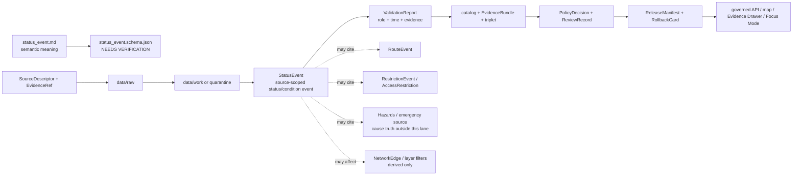

<!-- [KFM_META_BLOCK_V2]
doc_id: kfm://doc/contracts-domains-roads-rail-trade-status-event
title: Status Event Contract — Roads / Rail / Trade Routes
type: semantic-contract
version: v0.2
status: draft; PROPOSED; schema-missing; slug-CONFLICTED; event-form; NEEDS VERIFICATION before promotion
owners:
  - OWNER_TBD — Roads/Rail/Trade Routes domain steward
  - OWNER_TBD — Roads steward
  - OWNER_TBD — Rail steward
  - OWNER_TBD — Hazards steward
  - OWNER_TBD — Settlements/Infrastructure steward
  - OWNER_TBD — Contracts steward
  - OWNER_TBD — Source steward
  - OWNER_TBD — Evidence steward
  - OWNER_TBD — Schema steward
  - OWNER_TBD — Policy steward
  - OWNER_TBD — Release steward
  - OWNER_TBD — Docs steward
created: NEEDS VERIFICATION — scaffold existed before v0.2 expansion
updated: 2026-06-23
policy_label: public; contracts; roads-rail-trade; status-event; condition-change-event; time-bound-event; source-role-aware; temporal-scope-aware; evidence-bound; route-event-adjacent; restriction-event-adjacent; operator-status-adjacent; hazard-boundary-aware; legal-status-boundary-aware; release-gated; rollback-aware; not-live-status-feed; not-emergency-authority; not-routing-advice; not-legal-advice; not-publication-authority
tags: [kfm, contracts, roads-rail-trade, status-event, StatusEvent, route-event, restriction-event, access-restriction, operator-status, operator-assignment, road-segment, rail-segment, corridor-route, route-membership, crossing, bridge, ferry, river-crossing, depot, siding, yard, transport-facility, source-role, valid-time, EvidenceBundle, PolicyDecision, ReviewRecord, ReleaseManifest, RollbackCard, spec_hash]
related:
  - ./README.md
  - ./route_event.md
  - ./restriction_event.md
  - ./access_restriction.md
  - ./operator_status.md
  - ./operator_assignment.md
  - ./road_segment.md
  - ./rail_segment.md
  - ./corridor_route.md
  - ./route_membership.md
  - ./freight_corridor.md
  - ./historic_route_claim.md
  - ./trade_route_corridor.md
  - ./crossing.md
  - ./bridge.md
  - ./ferry.md
  - ./river_crossing.md
  - ./transport_facility.md
  - ./depot.md
  - ./siding.md
  - ./yard.md
  - ./network_node.md
  - ./network_edge.md
  - ./movement_story_node.md
  - ./domain_observation.md
  - ./domain_feature_identity.md
  - ./domain_validation_report.md
  - ./domain_layer_descriptor.md
  - ../roads/README.md
  - ../../../docs/domains/roads-rail-trade/README.md
  - ../../../docs/domains/roads-rail-trade/CANONICAL_PATHS.md
  - ../../../docs/domains/roads-rail-trade/OBJECT_FAMILIES.md
  - ../../../docs/domains/roads-rail-trade/IDENTITY_MODEL.md
  - ../../../docs/domains/roads-rail-trade/DATA_LIFECYCLE.md
  - ../../../docs/domains/roads-rail-trade/sublanes/roads.md
  - ../../../docs/domains/roads-rail-trade/sublanes/rail.md
  - ../../../docs/domains/roads-rail-trade/sublanes/trade-routes.md
  - ../../../docs/domains/roads-rail-trade/GRAPH_PROJECTIONS.md
  - ../../../docs/domains/roads-rail-trade/MAP_UI_CONTRACTS.md
  - ../../../docs/runbooks/roads-rail-trade/PROMOTION_RUNBOOK.md
  - ../../../docs/runbooks/roads-rail-trade/ROLLBACK_RUNBOOK.md
  - ../../../schemas/contracts/v1/domains/roads-rail-trade/status_event.schema.json
  - ../../../policy/domains/roads-rail-trade/
  - ../../../fixtures/domains/roads-rail-trade/status_event/
  - ../../../tests/domains/roads-rail-trade/
  - ../../../release/candidates/roads-rail-trade/
notes:
  - "Expanded from a PROPOSED scaffold at contracts/domains/roads-rail-trade/status_event.md."
  - "A paired schema at schemas/contracts/v1/domains/roads-rail-trade/status_event.schema.json was not found in this task. Field realization remains PROPOSED."
  - "Object-family doctrine names StatusEvent as a status/condition change event for a segment or facility, with source id + object role + temporal scope + normalized digest as the PROPOSED identity basis."
  - "The roads sublane describes StatusEvent as a PROPOSED realization of Route Event for operational state changes and keeps route, membership, segment, restriction, legal status, and source-role authority separate."
  - "The rail sublane includes Route Event / Status Event for rail incidents, outages, and service interruptions where sources permit, while hazard event truth and operator legal-entity facts remain outside the rail lane."
  - "This contract defines source-scoped status-event meaning. It does not prove live status, emergency condition, legal access, route availability, operator legal identity, hazard cause, graph truth, map truth, or publication approval."
  - "The Roads / Rail / Trade Routes docs record a slug conflict between roads-rail-trade and transport for contract/schema homes. This file preserves the observed requested path and does not resolve the ADR question."
[/KFM_META_BLOCK_V2] -->

<a id="top"></a>

# Status Event Contract — Roads / Rail / Trade Routes

> Semantic contract for `status_event`: the source-scoped, time-bound assertion that the status or condition of a road segment, rail segment, route, corridor, crossing, bridge, ferry, river crossing, depot, siding, yard, transport facility, route membership, operator relation, or access/restriction context changed, applied, was observed, or ended — without becoming live status, legal access authority, emergency alerting, route availability truth, hazard truth, graph truth, map truth, or publication approval.

<p>
  
  
  
  
  
  
  
</p>

`contracts/domains/roads-rail-trade/status_event.md`

## Quick jumps

[Status](#status) · [Meaning](#meaning) · [Repo fit](#repo-fit) · [Schema posture](#schema-posture) · [Accepted uses](#accepted-uses) · [Exclusions](#exclusions) · [Recommended fields](#recommended-fields) · [Invariants](#invariants) · [Status event families](#status-event-families) · [Source-role and time rules](#source-role-and-time-rules) · [Lifecycle](#lifecycle) · [Validation](#validation) · [Rollback](#rollback) · [Evidence basis](#evidence-basis) · [Open questions](#open-questions)

---

## Status

> [!IMPORTANT]
> **Status:** `draft` / semantic contract  
> **Owner:** `OWNER_TBD`  
> **Contract path:** `contracts/domains/roads-rail-trade/status_event.md`  
> **Schema path:** `schemas/contracts/v1/domains/roads-rail-trade/status_event.schema.json` — **not found in this task**  
> **Truth posture:** target path and prior scaffold are confirmed from current repo evidence. `StatusEvent` is confirmed in the object-family dossier as a status/condition change event for a segment or facility. Roads and rail sublane docs describe it as a PROPOSED lane-specific realization adjacent to Route Event, Operator Status, and RestrictionEvent. Exact schema fields, validator behavior, fixture coverage, source registry behavior, route/status/restriction behavior, legal-status behavior, hazard integration, policy behavior, release manifests, public API behavior, map rendering, graph behavior, and runtime behavior remain **NEEDS VERIFICATION**.

> [!CAUTION]
> This contract defines status-event meaning only. It does **not** provide live open/closed status, emergency detour advice, evacuation alerts, railroad operating authority, legal access certification, route availability, safety advice, hazard-cause truth, map/API behavior, or publication approval.

---

## Meaning

`status_event` records a source-scoped event assertion about status or condition changing through time.

It may represent that a source says a status or condition:

- began, ended, changed, was observed, was scheduled, was superseded, was rescinded, was confirmed, or applied during a valid time window;
- affected a `Road Segment`, `Rail Segment`, `CorridorRoute`, `RouteMembership`, `Crossing`, `Bridge`, `Ferry`, `River Crossing`, `Depot`, `Siding`, `Yard`, or `TransportFacility`;
- was associated with `RouteEvent`, `RestrictionEvent`, `AccessRestriction`, `OperatorStatus`, or `OperatorAssignment` records without replacing those records;
- represented a road/rail condition such as open, closed, restricted, interrupted, out-of-service, under construction, inactive, abandoned, seasonal, candidate, or source-specific status;
- affected a derived `NetworkNode`, `NetworkEdge`, map layer, Evidence Drawer view, Focus Mode explanation, export, or `MovementStoryNode` only after governance gates pass.

The status event contract owns the **event-form status/condition assertion**: what source says changed, applied, or was observed about a status/condition, with source role, affected object, time scope, evidence refs, policy posture, review state, release state, and rollback target. It does not own route identity, route membership, standing restriction semantics, operator legal identity, live feed state, hazard cause, legal access, graph topology, map rendering, or public release authority.

---

## Repo fit

| Responsibility | Path or root | Relationship |
|---|---|---|
| Parent contract lane | `./README.md` | Defines this folder as semantic contracts only. |
| Route event companion | `./route_event.md` | Route designation/redesignation/decommissioning events remain broader route-change events. |
| Restriction event companion | `./restriction_event.md` | Restriction/closure/limit events remain distinct from status/condition events. |
| Operator status companion | `./operator_status.md` | Operator-related status assertions may cite StatusEvent but remain separate. |
| Access restriction companion | `./access_restriction.md` | Standing restriction surface; status event may cite or be affected by it. |
| Segment contracts | `./road_segment.md`, `./rail_segment.md` | Status events may attach to segments; they do not define segment truth. |
| Route/corridor contracts | `./corridor_route.md`, `./route_membership.md`, `./freight_corridor.md` | Status events may attach to route/corridor context without becoming route identity or membership. |
| Facility/crossing contracts | `./crossing.md`, `./bridge.md`, `./ferry.md`, `./river_crossing.md`, `./transport_facility.md`, `./depot.md`, `./siding.md`, `./yard.md` | Status events may cite these, but each keeps its own semantics and owning-domain boundary. |
| Graph contracts | `./network_node.md`, `./network_edge.md` | Graph projections may consume status events but remain derived and rollbackable. |
| Movement story node | `./movement_story_node.md` | Narrative may cite status events but remains evidence-subordinate. |
| Object families | `../../../docs/domains/roads-rail-trade/OBJECT_FAMILIES.md` | Names StatusEvent and its PROPOSED identity basis. |
| Roads sublane | `../../../docs/domains/roads-rail-trade/sublanes/roads.md` | Describes StatusEvent as PROPOSED realization of Route Event for operational state changes. |
| Rail sublane | `../../../docs/domains/roads-rail-trade/sublanes/rail.md` | Places Route Event / Status Event in rail incidents, outages, and service interruptions where sources permit. |
| Schemas | `../../../schemas/contracts/v1/domains/roads-rail-trade/` or ADR-selected alternate | Machine shape; paired schema missing in this task. |
| Policy | `../../../policy/domains/roads-rail-trade/` or ADR-selected alternate | Allow/deny/restrict/abstain decisions and safety/legal boundaries. |
| Fixtures/tests | `../../../fixtures/domains/roads-rail-trade/`, `../../../tests/domains/roads-rail-trade/` | Behavior proof; not contract prose. |
| Release/rollback | `../../../release/candidates/roads-rail-trade/` and release roots | Promotion, release, correction, rollback, and derivative invalidation. |

---

## Schema posture

A direct paired schema was checked at:

```text
schemas/contracts/v1/domains/roads-rail-trade/status_event.schema.json
```

That file was **not found** in this task.

> [!WARNING]
> Because no paired schema was confirmed, every field below is **PROPOSED** semantic guidance. Do not treat it as machine-enforced until schema, fixtures, validator, policy tests, source registry records, release checks, governed API behavior, graph behavior, map behavior, and runtime behavior are verified.

---

## Accepted uses

| Use | Allowed? | Rule |
|---|---:|---|
| Recording a sourced status/condition change event | Yes | Must preserve source role, affected object, event type, valid time, source time, evidence, and limitations. |
| Explaining road/rail condition history | Yes | Must stay time-scoped and source-scoped; no live/safety strengthening without support. |
| Linking to OperatorStatus | Conditional | OperatorStatus remains the status assertion surface; StatusEvent may describe change/observation. |
| Linking to RouteEvent or RestrictionEvent | Conditional | Event surfaces remain separate and must not collapse. |
| Supporting Focus Mode or Evidence Drawer | Conditional | Requires EvidenceBundle, PolicyDecision, ReviewRecord, ReleaseManifest, correction path, and RollbackCard. |
| Supporting graph or route-history projections | Conditional | Downstream only; graph views must cite status-event evidence and remain rollbackable. |
| Certifying current open/closed state, emergency condition, route availability, legal access, or safety | No | Requires separate authoritative source and policy/release support; default to ABSTAIN or DENY when insufficient. |
| Acting as live feed, navigation, detour, railroad dispatch, emergency, or safety advice | No | KFM is not live routing, emergency, or operating authority under this contract. |

---

## Exclusions

`status_event` must not be used as:

| Misuse | Required outcome |
|---|---|
| RouteEvent replacement | Use `route_event.md` for designation/redesignation/decommissioning and broader route-change events. |
| RestrictionEvent replacement | Use `restriction_event.md` for closure, limit, embargo, permit, and restriction-change events. |
| OperatorStatus replacement | Use `operator_status.md` for source-scoped operator-related status assertions. |
| Road/Rail Segment replacement | Segment identity remains in segment contracts. |
| Legal access or route availability certification | `ABSTAIN` unless authoritative legal/source support and release posture exist. |
| Live route status or detour advice | `DENY`; use separately governed live/safety systems if ever approved. |
| Hazard event truth | Cite Hazards or authoritative source lane; do not absorb hazard cause/status. |
| Operator legal-entity or ownership proof | Use OperatorAssignment/OperatorStatus and legal/entity refs. |
| Graph canonical truth | Network projections are derived and rollbackable. |
| Public API/map payload by itself | Use governed API/released artifacts only. |
| Publication approval | ReleaseManifest, ReviewRecord, PolicyDecision, correction path, and RollbackCard remain separate. |

---

## Recommended fields

The following fields are **PROPOSED** until a schema is added and validated.

| Field | Meaning |
|---|---|
| `id` | Canonical status-event identifier. |
| `version` | Contract/object version. |
| `spec_hash` | Deterministic hash over normalized status-event content. |
| `domain` | Expected value: `roads-rail-trade` unless ADR selects another slug. |
| `event_type` | Opened, closed, restricted, interrupted, resumed, out-of-service, in-service, under-construction, abandoned, seasonal, outage, incident, candidate event, or source-specific type. |
| `event_role` | Begins, ends, changes, observes, schedules, confirms, supersedes, rescinds, or proposes a status/condition. |
| `event_statement` | Source-scoped event statement being preserved. |
| `status_type` | Source-stated status or normalized status enum once schema defines it. |
| `affected_object_ref` | Segment, route, corridor, crossing, bridge, ferry, facility, operator status, restriction, or event object ref receiving the event. |
| `affected_object_family` | Object family affected by the event. |
| `source_ref` | SourceDescriptor/source registry reference. |
| `source_role` | Accepted source role; must be preserved from admission through publication. |
| `source_native_id` | Source-native event, status, route, facility, segment, map, inventory, bulletin, feed, or filing ID. |
| `evidence_refs` | EvidenceRefs or EvidenceBundle refs. |
| `valid_time` | Interval during which the status event is asserted to apply. |
| `event_time` | Time the event happened or is said to happen, if distinct from valid interval. |
| `source_time` | Source creation, publication, feed, roster, filing, bulletin, map, or update time. |
| `retrieval_time` | KFM retrieval/freeze time. |
| `release_time` | KFM governed release time, if released. |
| `supersedes_ref` | Prior status event superseded by this record, if any. |
| `superseded_by_ref` | Later status event replacing this one, if any. |
| `route_event_ref` | RouteEvent ref, if a broader route-change event exists. |
| `restriction_event_ref` | RestrictionEvent ref, if a restriction/closure/limit event exists. |
| `operator_status_ref` | OperatorStatus ref, if event is operator-status-linked. |
| `operator_assignment_ref` | OperatorAssignment ref, if assignment relation is relevant. |
| `hazard_ref` | Hazard/cause/event ref, if cited from owning lane. |
| `network_effect_ref` | Derived graph effect ref, if graph projection uses this event. |
| `sensitivity_label` | Sensitivity/policy tier inherited from source, affected object, and event context. |
| `policy_decision_ref` | PolicyDecision governing use or publication. |
| `review_ref` | ReviewRecord or steward review ref. |
| `release_manifest_ref` | ReleaseManifest for public/semi-public exposure. |
| `rollback_ref` | RollbackCard or rollback target. |
| `limitations` | Caveats: status event only; not live status, legal access, emergency alert, hazard truth, safety advice, graph truth, or release authority. |

---

## Invariants

1. **Status event is time-bound.** It records a sourced change/assertion about status or condition, not all operational truth about the object.
2. **Event is not live status.** A status event does not become a current feed, emergency alert, railroad operating instruction, detour, or safety advisory.
3. **Route and restriction events stay separate.** RouteEvent and RestrictionEvent preserve their own event semantics and may cite or be cited by StatusEvent.
4. **Operator status stays separate.** OperatorStatus may cite status events, but status events do not replace operator-related status assertions.
5. **Hazard causes stay separate.** Flood, fire, smoke, crash, outage cause, or emergency truth belongs to Hazards or authoritative source lanes.
6. **Legal/permit advice is out of scope.** Status events may cite legal sources, but KFM does not issue legal, trucking, rail-operating, permit, or safety guidance.
7. **Source role is preserved.** Feed entries, administrative compilations, bulletins, maps, rosters, user reports, OCR hits, and models do not collapse into one authority posture.
8. **Graph is derived.** Network effects may derive from status events, but graph filters do not become the event or evidence.
9. **Publication requires gates.** Public display requires EvidenceBundle, PolicyDecision, ReviewRecord, ReleaseManifest, correction path, and RollbackCard.

---

## Status event families

| Event family | Meaning | Special guardrail |
|---|---|---|
| `open_or_closed_status_event` | Source asserts open/closed status began, changed, applied, or ended. | Not live status or route advice by itself. |
| `construction_or_work_zone_status_event` | Source asserts construction, work-zone, maintenance, or staged condition. | Not safety or detour advice; cite source and caveat. |
| `rail_outage_or_service_status_event` | Source asserts rail outage, interruption, service resumption, or out-of-service condition. | Not railroad operating authority or live service proof. |
| `facility_status_event` | Source asserts status of depot, siding, yard, station, crossing, bridge, ferry, or facility context. | Facility identity remains separate and may be settlement/infrastructure-owned. |
| `operator_linked_status_event` | Status change is connected to operator status, assignment, jurisdiction, or control. | Operator legal entity and ownership remain separate. |
| `restriction_linked_status_event` | Status is connected to closure, embargo, weight/height, clearance, permitting, or seasonal limits. | RestrictionEvent/AccessRestriction owns restriction semantics. |
| `hazard_linked_status_event` | Status is associated with flood, fire, smoke, storm, crash, or other hazard. | Hazard truth remains with Hazards/source authority. |
| `candidate_status_event` | OCR, feed prefilter, model, map, or connector proposes a status event. | Candidate until reviewed; no public truth without evidence/policy gates. |
| `supersession_status_event` | Event supersedes or is superseded by another status event. | Preserve supersession lineage and rollback impact. |

---

## Source-role and time rules

Status-event records must carry source role and time as core meaning.

| Rule | Requirement |
|---|---|
| Source role is fixed at admission | Promotion never turns a feed prefilter, map label, OCR hit, user report, administrative list, or model output into authoritative live status truth. |
| Event time is not release time | Event time, valid interval, source publication/update time, KFM retrieval time, review time, and release time are separate. |
| Current-looking data is not current advice | A fresh source record can support evidence, but it does not make KFM a live routing, rail-dispatching, or emergency system. |
| Status event is distinct from restriction event | Status events may describe open/closed/condition state; restriction records carry closure/limit/permit semantics. |
| Cross-lane evidence stays cited | Hazards, legal/title, People/Land, Settlements/Infrastructure, Hydrology, and agency feeds are cited through governed refs, not absorbed. |
| Release time is explicit | Public display must cite the release artifact and rollback target. |

---

## Lifecycle



Contracts describe meaning. They do not move data, validate schemas, execute source ingestion, make policy decisions, close evidence, perform review, publish artifacts, render maps, provide live status, issue permits, certify route safety, author hazard truth, or authorize AI answers.

---

## Validation

Before this contract is treated as mature, maintainers should verify:

- [ ] the ADR-selected contract/schema slug and whether this file should remain under `contracts/domains/roads-rail-trade/` or migrate to `contracts/transport/`;
- [ ] paired schema exists and includes event type, event role, status type, affected object ref, source role, time axes, evidence, policy, review, release, and rollback refs;
- [ ] fixtures cover open/closed status, construction/work-zone status, rail outage/service status, facility status, operator-linked status, restriction-linked status, hazard-linked status, candidate status, and supersession events;
- [ ] tests prevent status events from becoming live routing, emergency alerting, legal access, permit advice, safety advice, hazard truth, current service authority, or operator legal-entity proof;
- [ ] tests preserve source role and time distinctions across feeds, bulletins, rosters, administrative compilations, maps, OCR/model candidates, user reports, and historical sources;
- [ ] tests prevent events from replacing RouteEvent, RestrictionEvent, AccessRestriction, OperatorStatus, segment identity, route membership, facility identity, hazard events, or EvidenceBundle;
- [ ] graph tests prove status effects remain derived and rollbackable;
- [ ] public DTOs and map/Focus Mode payloads require EvidenceBundle, PolicyDecision, ReviewRecord, ReleaseManifest, correction path, and RollbackCard;
- [ ] rollback invalidates derived layer descriptors, graph filters, API payloads, exports, Focus Mode states, movement story nodes, caches, and AI summaries that cited the event.

---

## Rollback

Rollback or correction is required when this contract:

- claims status-event schema, policy, fixtures, tests, source registry, lifecycle data, release, API, UI, graph, live-feed, legal, hazard, or runtime behavior exists without proof;
- hides the `roads-rail-trade` vs `transport` slug conflict;
- treats a status event as live status feed, emergency alert, legal access status, permit advice, safety advice, hazard truth, route availability, operator legal-entity proof, or publication approval;
- lets an administrative list, feed prefilter, map label, OCR hit, user report, history note, or model output become authoritative status truth without evidence and review;
- collapses status event, route event, restriction event, access restriction, operator status, hazard cause, segment identity, facility identity, route membership, or graph effect into one object;
- publishes or renders unsupported status events through maps, graph filters, Focus Mode, exports, or AI narrative.

Rollback target: revert this file to prior scaffold blob SHA `9cf4b5862ea1dd8e210d88fb40b8373e0a758d66`, record drift if authority boundaries were affected, and invalidate downstream derivatives that cited the weakened status-event contract.

---

## Evidence basis

| Evidence | Status | Supports | Limit |
|---|---|---|---|
| Prior `contracts/domains/roads-rail-trade/status_event.md` | `CONFIRMED` | Target file existed as a PROPOSED scaffold. | Scaffold did not define authoritative semantic contract content. |
| `schemas/contracts/v1/domains/roads-rail-trade/status_event.schema.json` lookup | `CONFIRMED not found in this task` | Justifies `schema-missing` and PROPOSED field posture. | Does not rule out alternate schema homes such as `transport/`. |
| `docs/domains/roads-rail-trade/OBJECT_FAMILIES.md` | `CONFIRMED term / PROPOSED field realization` | Names `StatusEvent` as a status/condition change event for a segment or facility and gives PROPOSED deterministic identity basis. | Field-level schema, validators, and runtime behavior remain NEEDS VERIFICATION. |
| `docs/domains/roads-rail-trade/sublanes/roads.md` | `CONFIRMED doctrine / PROPOSED road-specific realization` | Describes StatusEvent as PROPOSED realization of Route Event for operational state changes and separates route/membership/segment/legal-source authority. | Does not prove StatusEvent schema, validator, runtime, or public API maturity. |
| `docs/domains/roads-rail-trade/sublanes/rail.md` | `CONFIRMED doctrine / PROPOSED rail-specific realization` | Places Route Event / Status Event with rail incidents, outages, and service interruptions while leaving hazard and legal-entity truth outside this lane. | Does not prove schema, validator, runtime, or public API maturity. |
| `contracts/domains/roads-rail-trade/route_event.md` | `CONFIRMED sibling contract` | Provides adjacent broader route-change event boundary and marks StatusEvent as adjacent event realization. | Route-event-specific; does not define StatusEvent schema. |
| `contracts/domains/roads-rail-trade/restriction_event.md` | `CONFIRMED sibling contract` | Provides adjacent restriction-event boundary and event-form pattern. | Restriction-specific; does not define StatusEvent schema. |
| `contracts/domains/roads-rail-trade/operator_status.md` | `CONFIRMED sibling contract` | Provides companion operator-status boundary: status assertion remains separate from status-event change record. | Operator-status-specific; does not define StatusEvent schema. |
| Uploaded authoring prompt v2 | `CONFIRMED user-supplied guidance` | Requires evidence-grounded, visually polished, implementation-honest Markdown with verification and rollback posture. | Authoring guidance, not implementation proof. |

---

## Open questions

| ID | Question | Status |
|---|---|---|
| OQ-RRT-SE-01 | Should `status_event.md` remain at `contracts/domains/roads-rail-trade/` or migrate to `contracts/transport/` after slug ADR resolution? | OPEN / ADR NEEDED |
| OQ-RRT-SE-02 | Which event types, status labels, and event roles are canonical across road, rail, freight, facility, bridge, crossing, and historic contexts? | OPEN / SCHEMA REVIEW |
| OQ-RRT-SE-03 | How should `StatusEvent` relate to `RouteEvent`, `RestrictionEvent`, `OperatorStatus`, and `AccessRestriction` without collapsing event semantics? | OPEN / DOMAIN REVIEW |
| OQ-RRT-SE-04 | Which source families can support public status events, and which remain candidate/review-only due to cadence, rights, legal authority, or safety risk? | OPEN / SOURCE + POLICY REVIEW |
| OQ-RRT-SE-05 | How should public-safe wording prevent status events from being mistaken for live alerts, legal access, current service, or safety advice? | OPEN / UI + POLICY REVIEW |
| OQ-RRT-SE-06 | How should rollback invalidate graph filters, maps, Focus Mode states, exports, and AI summaries that cited a withdrawn status event? | OPEN / RELEASE REVIEW |

<p align="right"><a href="#top">Back to top</a></p>
