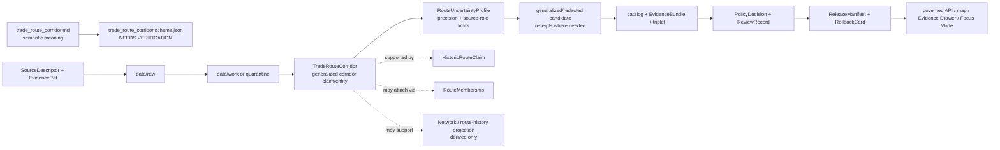

<!-- [KFM_META_BLOCK_V2]
doc_id: kfm://doc/contracts-domains-roads-rail-trade-trade-route-corridor
title: Trade Route Corridor Contract — Roads / Rail / Trade Routes
type: semantic-contract
version: v0.2
status: draft; PROPOSED; schema-missing; slug-CONFLICTED; high-sensitivity; generalized-corridor; NEEDS VERIFICATION before promotion
owners:
  - OWNER_TBD — Roads/Rail/Trade Routes domain steward
  - OWNER_TBD — Historic/trade-routes steward
  - OWNER_TBD — Archaeology/Cultural Heritage steward
  - OWNER_TBD — Sovereignty/cultural-sensitivity reviewer
  - OWNER_TBD — Contracts steward
  - OWNER_TBD — Source steward
  - OWNER_TBD — Evidence steward
  - OWNER_TBD — Schema steward
  - OWNER_TBD — Policy steward
  - OWNER_TBD — Release steward
  - OWNER_TBD — Docs steward
created: NEEDS VERIFICATION — scaffold existed before v0.2 expansion
updated: 2026-06-23
policy_label: public-scaffold; contracts; roads-rail-trade; trade-route-corridor; trade-routes; mobility-corridor; historic-route; indigenous-corridor; cultural-corridor; generalized-public-geometry; source-role-aware; temporal-scope-aware; uncertainty-aware; evidence-bound; sensitivity-first; steward-review-default; redaction-required-when-sensitive; route-membership-aware; graph-projection-aware; release-gated; rollback-aware; not-precise-alignment-truth; not-archaeology-truth; not-cultural-truth; not-sovereignty-decision; not-land-title; not-publication-authority
tags: [kfm, contracts, roads-rail-trade, trade-route-corridor, TradeRouteCorridor, historic-route, historic-route-claim, corridor-route, route-membership, route-uncertainty-profile, movement-story-node, road-segment, rail-segment, crossing, river-crossing, ferry, network-node, network-edge, cultural-heritage, sovereignty-review, source-role, valid-time, EvidenceBundle, PolicyDecision, ReviewRecord, RedactionReceipt, AggregationReceipt, ReleaseManifest, RollbackCard]
related:
  - ./README.md
  - ./historic_route_claim.md
  - ./route_uncertainty_profile.md
  - ./corridor_route.md
  - ./route_membership.md
  - ./movement_story_node.md
  - ./road_segment.md
  - ./rail_segment.md
  - ./crossing.md
  - ./bridge.md
  - ./ferry.md
  - ./river_crossing.md
  - ./route_event.md
  - ./status_event.md
  - ./restriction_event.md
  - ./access_restriction.md
  - ./network_node.md
  - ./network_edge.md
  - ./domain_observation.md
  - ./domain_feature_identity.md
  - ./domain_validation_report.md
  - ./domain_layer_descriptor.md
  - ../roads/README.md
  - ../../../docs/domains/roads-rail-trade/README.md
  - ../../../docs/domains/roads-rail-trade/HISTORIC_ROUTES.md
  - ../../../docs/domains/roads-rail-trade/CANONICAL_PATHS.md
  - ../../../docs/domains/roads-rail-trade/OBJECT_FAMILIES.md
  - ../../../docs/domains/roads-rail-trade/IDENTITY_MODEL.md
  - ../../../docs/domains/roads-rail-trade/DATA_LIFECYCLE.md
  - ../../../docs/domains/roads-rail-trade/SOURCES.md
  - ../../../docs/domains/roads-rail-trade/VERIFICATION_BACKLOG.md
  - ../../../docs/domains/roads-rail-trade/sublanes/trade-routes.md
  - ../../../docs/domains/roads-rail-trade/sublanes/roads.md
  - ../../../docs/domains/roads-rail-trade/GRAPH_PROJECTIONS.md
  - ../../../docs/domains/roads-rail-trade/MAP_UI_CONTRACTS.md
  - ../../../docs/runbooks/roads-rail-trade/PROMOTION_RUNBOOK.md
  - ../../../docs/runbooks/roads-rail-trade/ROLLBACK_RUNBOOK.md
  - ../../../schemas/contracts/v1/domains/roads-rail-trade/trade_route_corridor.schema.json
  - ../../../policy/domains/roads-rail-trade/
  - ../../../fixtures/domains/roads-rail-trade/trade_route_corridor/
  - ../../../tests/domains/roads-rail-trade/
  - ../../../release/candidates/roads-rail-trade/
notes:
  - "Expanded from a PROPOSED scaffold at contracts/domains/roads-rail-trade/trade_route_corridor.md."
  - "A paired schema at schemas/contracts/v1/domains/roads-rail-trade/trade_route_corridor.schema.json was not found in this task. Field realization remains PROPOSED."
  - "Object-family doctrine names TradeRouteCorridor as a generalized historic trade-route corridor, with source id + object role + temporal scope + normalized digest as the PROPOSED identity basis."
  - "The trade-routes sublane names TradeRouteCorridor as a trade / mobility corridor entity that may include Indigenous corridors under cultural-heritage governance; public geometry defaults to generalized output when cultural, Indigenous, treaty, oral-history, historic, or sensitive corridor evidence is involved."
  - "The companion Historic Route Claim contract keeps claims distinct from corridor entities and requires evidence, uncertainty, policy, review, redaction/generalization, release, correction, and rollback support before public exposure."
  - "This contract defines source-scoped generalized corridor meaning. It does not author archaeology/cultural truth, sovereignty decisions, precise alignment truth, land/title facts, public access, graph truth, map truth, or publication approval."
  - "The Roads / Rail / Trade Routes docs record a slug conflict between roads-rail-trade and transport for contract/schema homes. This file preserves the observed requested path and does not resolve the ADR question."
[/KFM_META_BLOCK_V2] -->

<a id="top"></a>

# Trade Route Corridor Contract — Roads / Rail / Trade Routes

> Semantic contract for `trade_route_corridor`: the source-scoped, generalized, uncertainty-aware corridor entity representing a historic trade, mobility, exchange, migration, trail, travel, Indigenous, treaty, oral-history, or cultural movement corridor — without becoming precise alignment truth, archaeological/cultural truth, sovereignty decision, land/title authority, legal public-access status, graph truth, map truth, or publication approval.

<p>
  
  
  
  
  
  
  
</p>

`contracts/domains/roads-rail-trade/trade_route_corridor.md`

## Quick jumps

[Status](#status) · [Meaning](#meaning) · [Repo fit](#repo-fit) · [Schema posture](#schema-posture) · [Accepted uses](#accepted-uses) · [Exclusions](#exclusions) · [Recommended fields](#recommended-fields) · [Invariants](#invariants) · [Trade route corridor families](#trade-route-corridor-families) · [Source-role, uncertainty, and time rules](#source-role-uncertainty-and-time-rules) · [Sensitivity and publication posture](#sensitivity-and-publication-posture) · [Lifecycle](#lifecycle) · [Validation](#validation) · [Rollback](#rollback) · [Evidence basis](#evidence-basis) · [Open questions](#open-questions)

---

## Status

> [!IMPORTANT]
> **Status:** `draft` / semantic contract  
> **Owner:** `OWNER_TBD`  
> **Contract path:** `contracts/domains/roads-rail-trade/trade_route_corridor.md`  
> **Schema path:** `schemas/contracts/v1/domains/roads-rail-trade/trade_route_corridor.schema.json` — **not found in this task**  
> **Truth posture:** target path and prior scaffold are confirmed from current repo evidence. `TradeRouteCorridor` is confirmed as a Roads / Rail / Trade Routes object-family term and as a trade / mobility corridor entity in the trade-routes sublane. Exact schema fields, validator behavior, fixture coverage, cultural/steward review behavior, policy behavior, source registry behavior, release manifests, emitted receipts, public API behavior, map rendering, graph behavior, and runtime behavior remain **NEEDS VERIFICATION**.

> [!CAUTION]
> This contract defines a **generalized corridor entity**, not a precise route line. It does **not** authorize exact historic/cultural corridor geometry, archaeological site exposure, cultural truth, sovereignty decisions, land/title facts, modern legal route designation, public access, graph truth, map/API behavior, or publication approval.

---

## Meaning

`trade_route_corridor` records the semantic meaning of a generalized trade or mobility corridor in Roads / Rail / Trade Routes.

It may represent that a source, reviewed claim set, interpreted corridor, or public-safe derivative suggests a broad corridor of movement, exchange, travel, trade, communication, migration, military route, stage/mail route, cattle trail, Indigenous mobility, treaty corridor, oral-history corridor, or other historic movement relation.

A trade route corridor may carry:

- source-scoped corridor name, label, description, region, period, route family, or interpretation;
- generalized corridor geometry, uncertainty band, bounding envelope, narrative-only location, or redacted public representation;
- links to `HistoricRouteClaim`, `RouteUncertaintyProfile`, `CorridorRoute`, `RouteMembership`, `MovementStoryNode`, `Road Segment`, `Rail Segment`, `Crossing`, `River Crossing`, `Ferry`, `NetworkNode`, or `NetworkEdge` records;
- evidence and review references that preserve source role, rights, sensitivity, temporal scope, uncertainty, and release state;
- public-safe display caveats for maps, Evidence Drawer, Focus Mode, exports, and AI summaries.

The trade route corridor contract owns the **transport-side generalized corridor relation**: how KFM preserves a corridor-shaped interpretation without overclaiming exact geometry or cultural truth. It does not own archaeological site identity, Indigenous/cultural truth, sovereignty review outcome, exact coordinates, land/title claims, modern route legal status, public access, graph canonical truth, or public release authority.

---

## Repo fit

| Responsibility | Path or root | Relationship |
|---|---|---|
| Parent contract lane | `./README.md` | Defines this folder as semantic contracts only. |
| Historic route claim | `./historic_route_claim.md` | Claim-level evidence; a corridor may be synthesized from claims but does not prove each claim. |
| Uncertainty profile | `./route_uncertainty_profile.md` | Carries uncertainty, precision, caveats, and public generalization posture. |
| Corridor route | `./corridor_route.md` | Route/corridor entity semantics; TradeRouteCorridor is the historic/trade mobility specialization. |
| Route membership | `./route_membership.md` | Cross-period membership relations remain separate and time-scoped. |
| Movement story node | `./movement_story_node.md` | Narrative/Focus Mode node may cite corridor evidence; generated narrative remains downstream. |
| Segments and crossings | `./road_segment.md`, `./rail_segment.md`, `./crossing.md`, `./bridge.md`, `./ferry.md`, `./river_crossing.md` | Modern or historic support evidence; these do not become corridor truth by proximity. |
| Events/status/restrictions | `./route_event.md`, `./status_event.md`, `./restriction_event.md`, `./access_restriction.md` | Time-bound changes or limits may cite corridor context but remain separate. |
| Graph contracts | `./network_node.md`, `./network_edge.md` | Derived topology; graph output must cite corridor/claim EvidenceBundle refs. |
| Trade-routes sublane dossier | `../../../docs/domains/roads-rail-trade/sublanes/trade-routes.md` | Highest-sensitivity historic/trade-corridor posture and explicit non-ownership rules. |
| Data lifecycle | `../../../docs/domains/roads-rail-trade/DATA_LIFECYCLE.md` | Historic overprecision denial, generalized geometry, RedactionReceipt, ReviewRecord, and release gates. |
| Schemas | `../../../schemas/contracts/v1/domains/roads-rail-trade/` or ADR-selected alternate | Machine shape; paired schema missing in this task. |
| Policy | `../../../policy/domains/roads-rail-trade/` or ADR-selected alternate | Allow/deny/restrict/abstain decisions, especially for cultural, archaeological, sovereignty-sensitive, rights-uncertain, and location-sensitive claims. |
| Fixtures/tests | `../../../fixtures/domains/roads-rail-trade/`, `../../../tests/domains/roads-rail-trade/` | Behavior proof; not contract prose. |
| Release/rollback | `../../../release/candidates/roads-rail-trade/` and release roots | Promotion, release, correction, and rollback. |

---

## Schema posture

A direct paired schema was checked at:

```text
schemas/contracts/v1/domains/roads-rail-trade/trade_route_corridor.schema.json
```

That file was **not found** in this task.

> [!WARNING]
> Because no paired schema was confirmed, every field below is **PROPOSED** semantic guidance. Do not treat it as machine-enforced until schema, fixtures, validator, source registry records, policy tests, cultural/steward review checks, release checks, governed API behavior, map behavior, graph behavior, and runtime behavior are verified.

---

## Accepted uses

| Use | Allowed? | Rule |
|---|---:|---|
| Recording a generalized historic trade/mobility corridor | Yes | Must preserve source role, temporal scope, uncertainty, evidence, sensitivity, review, and limitations. |
| Synthesizing multiple HistoricRouteClaims into a reviewed corridor | Conditional | Each claim remains inspectable; synthesis must cite EvidenceBundle and uncertainty refs. |
| Public map / Focus Mode generalized corridor display | Conditional | Requires PolicyDecision, ReviewRecord, Redaction/Aggregation/Generalization receipts where applicable, ReleaseManifest, and RollbackCard. |
| Carrying Indigenous, treaty, oral-history, or cultural corridor context | Conditional | Requires cultural/sovereignty/steward review and generalized or redacted public posture by default. |
| Supporting RouteMembership or MovementStoryNode | Conditional | Membership and narrative remain separate and evidence-subordinate. |
| Supporting graph projections | Conditional | Graph projections are derived; they must not become corridor truth. |
| Publishing exact sensitive route geometry | Usually no | Default to generalized, staged, redacted, or denied unless policy/review explicitly supports release. |
| Certifying archaeological, cultural, sovereignty, land/title, or legal-access truth | No | Those belong to owning lanes and review processes. |

---

## Exclusions

`trade_route_corridor` must not be used as:

| Misuse | Required outcome |
|---|---|
| Precise alignment truth | Use uncertainty profiles and generalized public geometry; exact linework is not implied. |
| HistoricRouteClaim replacement | Keep source-scoped claims separate and cite them. |
| Archaeology/cultural truth | Use Archaeology/Cultural Heritage and steward review; do not author cultural truth here. |
| Sovereignty decision | Sovereignty/cultural authority is not produced by this contract. |
| Land/title or right-of-way proof | `ABSTAIN`; cite People/Land/legal authority if policy-cleared. |
| Modern legal route designation or public access | `ABSTAIN`; corridor context is not legal access. |
| Safe travel, routing, or navigation advice | `DENY`; corridor history is not route advice. |
| Graph canonical truth | Network nodes/edges are derived and rollbackable. |
| Public API/map payload by itself | Use governed API/released artifacts only. |
| Publication approval | ReleaseManifest, ReviewRecord, PolicyDecision, correction path, and RollbackCard remain separate. |

---

## Recommended fields

The following fields are **PROPOSED** until a schema is added and validated.

| Field | Meaning |
|---|---|
| `id` | Canonical trade-route-corridor identifier. |
| `version` | Contract/object version. |
| `spec_hash` | Deterministic hash over normalized corridor content. |
| `domain` | Expected value: `roads-rail-trade` unless ADR selects another slug. |
| `corridor_name` | Source-stated, reviewed, or public-safe corridor label. |
| `corridor_type` | Trade, mobility, Indigenous, treaty, oral-history, cattle trail, military road, emigrant route, stage/mail, freight, mixed, candidate, or source-specific corridor type. |
| `corridor_statement` | Source-scoped or review-scoped corridor statement being preserved. |
| `source_refs` | SourceDescriptor/source registry refs contributing to the corridor. |
| `source_role_summary` | Preserved source-role posture of contributing evidence. |
| `historic_route_claim_refs` | HistoricRouteClaim refs used to support or bound the corridor. |
| `route_uncertainty_profile_ref` | RouteUncertaintyProfile / UncertaintySurface ref for caveats and precision limits. |
| `route_membership_refs` | RouteMembership refs, if features are attached to the corridor. |
| `movement_story_node_refs` | MovementStoryNode refs for narrative/use-case contexts. |
| `evidence_refs` | EvidenceRefs or EvidenceBundle refs. |
| `corridor_geometry_ref` | Generalized/redacted/narrative geometry ref; not precise alignment truth. |
| `public_geometry_rule` | Generalize, redact, stage, deny, or display-as-released rule. |
| `generalization_ref` | AggregationReceipt / GeneralizationReceipt ref where public geometry is generalized. |
| `redaction_ref` | RedactionReceipt ref where sensitive detail is suppressed. |
| `precision_statement` | Statement of supported public precision and source limitations. |
| `uncertainty_statement` | Human-readable uncertainty summary. |
| `valid_time` | Time interval the corridor claim/interpretation applies to. |
| `source_time` | Time of supporting sources. |
| `assessment_time` | Time the corridor profile was assessed or reviewed. |
| `release_time` | KFM governed release time, if released. |
| `sensitivity_label` | Sensitivity/policy tier inherited from source, route, cultural, archaeological, sovereignty, or location context. |
| `policy_decision_ref` | PolicyDecision governing use or publication. |
| `review_ref` | ReviewRecord, steward review, cultural review, sovereignty review, or rights-holder review ref. |
| `release_manifest_ref` | ReleaseManifest for public/semi-public exposure. |
| `rollback_ref` | RollbackCard or rollback target. |
| `limitations` | Caveats: generalized corridor only; not precise alignment truth, cultural truth, sovereignty decision, land/title, public access, graph truth, or release authority. |

---

## Invariants

1. **Corridor is not coordinate.** A trade route corridor expresses a bounded, generalized mobility interpretation, not survey-grade alignment.
2. **Claim remains inspectable.** A corridor derived from HistoricRouteClaim records must preserve each supporting claim and EvidenceBundle lineage.
3. **Uncertainty is first-class.** RouteUncertaintyProfile / UncertaintySurface posture travels with the corridor and public geometry.
4. **Cultural sensitivity fails closed.** Indigenous, treaty, oral-history, cultural, archaeological, and sovereignty-sensitive corridors default to steward review and generalized or redacted public geometry.
5. **Source role is preserved.** GNIS, OSM, modern geometry, map labels, administrative compilations, treaty compilations, oral histories, archives, and model output do not collapse into one authority posture.
6. **Receipts remain separate.** Redaction, aggregation, generalization, review, policy, release, and rollback proof objects are referenced, not absorbed.
7. **Graph is derived.** Network and route-history projections may consume corridor evidence but do not replace it.
8. **AI is downstream.** MovementStoryNode, Focus Mode, and AI summaries may explain a corridor only with evidence, uncertainty, policy, and release state visible.
9. **Publication requires gates.** Public display requires EvidenceBundle, PolicyDecision, ReviewRecord, transformation receipts where applicable, ReleaseManifest, correction path, and RollbackCard.

---

## Trade route corridor families

| Corridor family | Meaning | Special guardrail |
|---|---|---|
| `generalized_trade_corridor` | Broad corridor of exchange, travel, communication, or trade. | Public geometry remains generalized and caveated. |
| `indigenous_mobility_corridor` | Corridor tied to Indigenous mobility, oral history, treaty, or cultural geography. | Steward/sovereignty/cultural review required by default. |
| `historic_transport_corridor` | Historical movement corridor tied to trails, military roads, stage/mail, cattle routes, or emigrant routes. | Preserve claim-not-fact and uncertainty posture. |
| `cross_period_route_corridor` | Corridor that links historic and modern road/rail contexts across time. | Modern geometry must not launder historic precision. |
| `trade_network_context_corridor` | Corridor used as context for trade-network interpretation. | Network is interpretive and downstream of evidence. |
| `candidate_trade_corridor` | OCR, map label, model, source cluster, or connector proposes corridor. | Candidate until reviewed; no public truth without evidence/policy gates. |
| `released_public_corridor` | Corridor included in governed public layer, Evidence Drawer, or Focus Mode. | Requires ReleaseManifest, receipts as needed, and rollback target. |

---

## Source-role, uncertainty, and time rules

Trade-route-corridor records must carry source role, uncertainty, and time as core meaning.

| Rule | Requirement |
|---|---|
| Source role is fixed at admission | Promotion never turns GNIS, OSM, modern geometry, map labels, OCR hits, local-history notes, or model output into historic/cultural route authority. |
| Cultural source role is not transferable | Oral-history, treaty, Indigenous, archival, and cultural-heritage evidence requires owning-lane/steward review before public use. |
| Corridor valid time is distinct | Historical period, source time, assessment time, retrieval time, release time, and correction time remain separate. |
| Generalized geometry is not lesser evidence | Public generalization is a policy/safety transform, not a claim that the underlying evidence is vague. |
| Modern roads/rails cannot loan precision | Joining historic corridors to modern geometry must not manufacture exact alignment. |
| Membership remains separate | RouteMembership records attach features to a corridor; corridor identity does not absorb membership. |
| Cross-lane evidence stays cited | Archaeology/Cultural Heritage, People/Land, Hydrology, Hazards, Settlements/Infrastructure, and legal/source evidence are cited through governed refs, not absorbed. |
| Release time is explicit | Public display must cite release artifact and rollback target. |

---

## Sensitivity and publication posture

| Surface | Default posture | Required support before public exposure |
|---|---|---|
| General historic/trade corridor | Generalized and uncertainty-forward | EvidenceBundle, RouteUncertaintyProfile, PolicyDecision, ReviewRecord, ReleaseManifest, RollbackCard. |
| Indigenous / treaty / oral-history / cultural corridor | Steward review and generalized/redacted public geometry | Cultural/sovereignty review, PolicyDecision, RedactionReceipt/AggregationReceipt where needed, ReviewRecord, ReleaseManifest. |
| Corridor synthesized from many claims | Evidence-led and inspectable | Claim refs, EvidenceBundle lineage, uncertainty profile, review, release. |
| Corridor tied to archaeology or sensitive sites | Default deny/hold/generalize | Owning-domain review, redaction, staged access, release decision. |
| Candidate/model corridor | Review-only | No public surface until evidence closure and policy/release gates pass. |
| Graph-derived corridor view | Derived and cited | Graph derivation lineage, EvidenceBundle refs, release manifest, rollback path. |

---

## Lifecycle



Contracts describe meaning. They do not move data, validate schemas, execute source reconciliation, create policy decisions, emit transformation receipts, close evidence, perform review, publish artifacts, render maps, prove precise route geometry, or authorize AI answers.

---

## Validation

Before this contract is treated as mature, maintainers should verify:

- [ ] the ADR-selected contract/schema slug and whether this file should remain under `contracts/domains/roads-rail-trade/` or migrate to `contracts/transport/`;
- [ ] paired schema exists and includes corridor type, source refs, source-role summary, claim refs, uncertainty profile refs, route membership refs, public geometry rule, receipts, policy, review, release, and rollback refs;
- [ ] fixtures cover generalized trade corridors, Indigenous mobility corridors, historic transport corridors, cross-period route corridors, trade-network context corridors, candidate corridors, and released public corridors;
- [ ] tests enforce historic-overprecision denial and prevent precise corridor geometry where evidence or policy does not support it;
- [ ] tests prevent GNIS/OSM/modern road or rail context from becoming historic/cultural corridor authority;
- [ ] tests require steward/cultural/sovereignty review for sensitive corridor claims and generalized public geometry where required;
- [ ] tests prevent TradeRouteCorridor from replacing HistoricRouteClaim, RouteMembership, CorridorRoute, RouteUncertaintyProfile, EvidenceBundle, PolicyDecision, RedactionReceipt, ReviewRecord, or ReleaseManifest;
- [ ] public DTOs and Evidence Drawer / Focus Mode payloads display uncertainty and caveats without implying survey precision;
- [ ] rollback invalidates derived route geometry, graph projections, layer descriptors, Evidence Drawer payloads, Focus Mode states, movement story nodes, exports, caches, and AI summaries that cited the withdrawn corridor.

---

## Rollback

Rollback or correction is required when this contract:

- claims mature trade-route-corridor schema, validators, policy, fixtures, tests, source registry, lifecycle data, release, API, UI, graph, cultural review, or runtime behavior exists without proof;
- hides the `roads-rail-trade` vs `transport` slug conflict;
- treats TradeRouteCorridor as precise route truth, geometry truth, cultural truth, sovereignty decision, legal designation, public access status, graph truth, or publication approval;
- lets modern roads/rails, OSM/GNIS, map labels, OCR hits, local histories, or model output launder weak/context evidence into stronger corridor authority;
- publishes corridor geometry at a precision greater than the evidence and policy support;
- skips required steward review, cultural/sovereignty review, redaction/generalization receipt, release manifest, or rollback target;
- fails to invalidate downstream maps, graph views, Focus Mode states, exports, or AI summaries after corridor correction or withdrawal.

Rollback target: revert this file to prior scaffold blob SHA `13dcdb861b80d511f278479814f6f385146bd1e3`, record drift if authority boundaries were affected, and invalidate downstream derivatives that cited the weakened trade-route-corridor contract.

---

## Evidence basis

| Evidence | Status | Supports | Limit |
|---|---|---|---|
| Prior `contracts/domains/roads-rail-trade/trade_route_corridor.md` | `CONFIRMED` | Target file existed as a PROPOSED scaffold. | Scaffold did not define authoritative semantic contract content. |
| `schemas/contracts/v1/domains/roads-rail-trade/trade_route_corridor.schema.json` lookup | `CONFIRMED not found in this task` | Justifies `schema-missing` and PROPOSED field posture. | Does not rule out alternate schema homes such as `transport/`. |
| `docs/domains/roads-rail-trade/OBJECT_FAMILIES.md` | `CONFIRMED term / PROPOSED field realization` | Names `TradeRouteCorridor` as a generalized historic trade-route corridor and gives PROPOSED deterministic identity basis. | Field-level schema, validators, and runtime behavior remain NEEDS VERIFICATION. |
| `docs/domains/roads-rail-trade/sublanes/trade-routes.md` | `CONFIRMED doctrine / PROPOSED implementation` | Names TradeRouteCorridor as a trade / mobility corridor entity, possibly including Indigenous corridors under cultural-heritage governance, and states a claim is not a fact and a corridor is not a coordinate. | Does not prove schema/validator/test implementation. |
| `contracts/domains/roads-rail-trade/historic_route_claim.md` | `CONFIRMED sibling contract` | Provides claim-not-fact and steward-review boundary pattern for historic/cultural route evidence. | Claim-specific; does not define TradeRouteCorridor schema. |
| `contracts/domains/roads-rail-trade/route_uncertainty_profile.md` | `CONFIRMED sibling contract` | Provides uncertainty, overprecision, and public-generalization boundary for route-like surfaces. | Profile-specific; does not define TradeRouteCorridor schema. |
| `docs/domains/roads-rail-trade/DATA_LIFECYCLE.md` | `CONFIRMED doctrine / PROPOSED implementation` | Defines lifecycle, quarantine for historic overprecision, receipts, graph projections as derived, and public service through governed APIs/manifests. | Does not prove runtime, API, release, validator, or test maturity. |
| Uploaded authoring prompt v2 | `CONFIRMED user-supplied guidance` | Requires evidence-grounded, visually polished, implementation-honest Markdown with verification and rollback posture. | Authoring guidance, not implementation proof. |

---

## Open questions

| ID | Question | Status |
|---|---|---|
| OQ-RRT-TRC-01 | Should `trade_route_corridor.md` remain at `contracts/domains/roads-rail-trade/` or migrate to `contracts/transport/` after slug ADR resolution? | OPEN / ADR NEEDED |
| OQ-RRT-TRC-02 | Which corridor types, source-role summaries, uncertainty refs, public-geometry rules, and receipt refs are canonical? | OPEN / SCHEMA REVIEW |
| OQ-RRT-TRC-03 | How should `TradeRouteCorridor` relate to `HistoricRouteClaim`, `CorridorRoute`, `RouteMembership`, and `RouteUncertaintyProfile` without collapsing claim, entity, relationship, and uncertainty semantics? | OPEN / DOMAIN REVIEW |
| OQ-RRT-TRC-04 | Which cultural, Indigenous, treaty, oral-history, archaeological, or sovereignty-sensitive corridors require named steward or rights-holder review before public geometry exists? | OPEN / POLICY REVIEW |
| OQ-RRT-TRC-05 | How should Evidence Drawer, Focus Mode, and map layers word corridor uncertainty without implying exact historic alignment? | OPEN / UI + POLICY REVIEW |
| OQ-RRT-TRC-06 | How should rollback invalidate route geometry, graph projections, maps, Focus Mode states, exports, and AI summaries that cited a corrected or withdrawn corridor? | OPEN / RELEASE REVIEW |

<p align="right"><a href="#top">Back to top</a></p>
