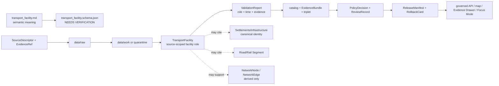

<!-- [KFM_META_BLOCK_V2]
doc_id: kfm://doc/contracts-domains-roads-rail-trade-transport-facility
title: Transport Facility Contract — Roads / Rail / Trade Routes
type: semantic-contract
version: v0.2
status: draft; PROPOSED; schema-missing; slug-CONFLICTED; facility-role; NEEDS VERIFICATION before promotion
owners:
  - OWNER_TBD — Roads/Rail/Trade Routes domain steward
  - OWNER_TBD — Roads steward
  - OWNER_TBD — Rail steward
  - OWNER_TBD — Settlements/Infrastructure steward
  - OWNER_TBD — Contracts steward
  - OWNER_TBD — Source steward
  - OWNER_TBD — Evidence steward
  - OWNER_TBD — Schema steward
  - OWNER_TBD — Policy steward
  - OWNER_TBD — Release steward
  - OWNER_TBD — Docs steward
created: NEEDS VERIFICATION — scaffold existed before v0.2 expansion
updated: 2026-06-23
policy_label: public; contracts; roads-rail-trade; transport-facility; facility-role; road-aligned-facility; rail-aligned-facility; source-role-aware; temporal-scope-aware; evidence-bound; settlements-infrastructure-boundary-aware; operator-status-aware; graph-projection-aware; sensitivity-aware; release-gated; rollback-aware; not-canonical-place-identity; not-property-title; not-structural-inspection; not-live-service-status; not-legal-access; not-operational-authority; not-publication-authority
tags: [kfm, contracts, roads-rail-trade, transport-facility, depot, siding, yard, station, weigh-station, rest-area, port-of-entry, terminal, interchange, facility-role, road-segment, rail-segment, crossing, bridge, ferry, river-crossing, corridor-route, route-membership, operator-assignment, operator-status, status-event, access-restriction, restriction-event, network-node, network-edge, source-role, valid-time, EvidenceBundle, PolicyDecision, ReviewRecord, ReleaseManifest, RollbackCard]
related:
  - ./README.md
  - ./road_segment.md
  - ./rail_segment.md
  - ./crossing.md
  - ./bridge.md
  - ./ferry.md
  - ./river_crossing.md
  - ./depot.md
  - ./siding.md
  - ./yard.md
  - ./corridor_route.md
  - ./route_membership.md
  - ./operator_assignment.md
  - ./operator_status.md
  - ./route_event.md
  - ./status_event.md
  - ./access_restriction.md
  - ./restriction_event.md
  - ./network_node.md
  - ./network_edge.md
  - ./movement_story_node.md
  - ./domain_observation.md
  - ./domain_feature_identity.md
  - ./domain_validation_report.md
  - ./domain_layer_descriptor.md
  - ../roads/README.md
  - ../../../docs/domains/roads-rail-trade/README.md
  - ../../../docs/domains/roads-rail-trade/CANONICAL_PATHS.md
  - ../../../docs/domains/roads-rail-trade/OBJECT_FAMILIES.md
  - ../../../docs/domains/roads-rail-trade/IDENTITY_MODEL.md
  - ../../../docs/domains/roads-rail-trade/DATA_LIFECYCLE.md
  - ../../../docs/domains/roads-rail-trade/SOURCES.md
  - ../../../docs/domains/roads-rail-trade/sublanes/roads.md
  - ../../../docs/domains/roads-rail-trade/sublanes/rail.md
  - ../../../docs/domains/roads-rail-trade/GRAPH_PROJECTIONS.md
  - ../../../docs/domains/roads-rail-trade/MAP_UI_CONTRACTS.md
  - ../../../docs/runbooks/roads-rail-trade/PROMOTION_RUNBOOK.md
  - ../../../docs/runbooks/roads-rail-trade/ROLLBACK_RUNBOOK.md
  - ../../../schemas/contracts/v1/domains/roads-rail-trade/transport_facility.schema.json
  - ../../../policy/domains/roads-rail-trade/
  - ../../../fixtures/domains/roads-rail-trade/transport_facility/
  - ../../../tests/domains/roads-rail-trade/
  - ../../../release/candidates/roads-rail-trade/
notes:
  - "Expanded from a PROPOSED scaffold at contracts/domains/roads-rail-trade/transport_facility.md."
  - "A paired schema at schemas/contracts/v1/domains/roads-rail-trade/transport_facility.schema.json was not found in this task. Field realization remains PROPOSED."
  - "Object-family doctrine names TransportFacility as a facility such as depot, station, yard, or roster entry, with source id + object role + temporal scope + normalized digest as the PROPOSED identity basis."
  - "The roads sublane defines road-aligned TransportFacility as a road-traffic-role object while facilities with primary settlement identity remain settlement-owned."
  - "The rail sublane includes Depot, Siding, and Yard as rail-network facility types whose identity remains settlement/infrastructure-owned and whose rail lane meaning is a role relation."
  - "This contract defines source-scoped transport-facility role meaning. It does not prove canonical place/facility identity, structural condition, property title, legal access, operator legal identity, live service, graph truth, map truth, or publication approval."
  - "The Roads / Rail / Trade Routes docs record a slug conflict between roads-rail-trade and transport for contract/schema homes. This file preserves the observed requested path and does not resolve the ADR question."
[/KFM_META_BLOCK_V2] -->

<a id="top"></a>

# Transport Facility Contract — Roads / Rail / Trade Routes

> Semantic contract for `transport_facility`: the source-scoped role claim that a facility, place, site, stop, station, depot, siding, yard, rest area, weigh station, port-of-entry, terminal, interchange, crossing-adjacent site, or roster entry functioned in a road, rail, freight, or route-corridor context — without becoming canonical place/facility identity, property title, structural inspection, legal access, live service, operator legal identity, graph truth, map truth, or publication approval.

<p>
  
  
  
  
  
  
  
</p>

`contracts/domains/roads-rail-trade/transport_facility.md`

## Quick jumps

[Status](#status) · [Meaning](#meaning) · [Repo fit](#repo-fit) · [Schema posture](#schema-posture) · [Accepted uses](#accepted-uses) · [Exclusions](#exclusions) · [Recommended fields](#recommended-fields) · [Invariants](#invariants) · [Transport facility families](#transport-facility-families) · [Source-role and time rules](#source-role-and-time-rules) · [Lifecycle](#lifecycle) · [Validation](#validation) · [Rollback](#rollback) · [Evidence basis](#evidence-basis) · [Open questions](#open-questions)

---

## Status

> [!IMPORTANT]
> **Status:** `draft` / semantic contract  
> **Owner:** `OWNER_TBD`  
> **Contract path:** `contracts/domains/roads-rail-trade/transport_facility.md`  
> **Schema path:** `schemas/contracts/v1/domains/roads-rail-trade/transport_facility.schema.json` — **not found in this task**  
> **Truth posture:** target path and prior scaffold are confirmed from current repo evidence. `TransportFacility` is confirmed in the Roads / Rail / Trade Routes object-family spine as a facility such as depot, station, yard, or roster entry. Roads and rail sublane docs confirm road-aligned and rail-aligned facility-role meanings while preserving settlement/infrastructure ownership for canonical facility identity. Exact schema fields, validator behavior, fixture coverage, policy behavior, source registry behavior, release manifests, emitted proofs, public API behavior, map rendering, graph behavior, and runtime behavior remain **NEEDS VERIFICATION**.

> [!CAUTION]
> This contract defines transport-facility role meaning only. It does **not** certify canonical place identity, building identity, structural condition, preservation status, property ownership, title, legal access, active service, passenger/freight service, operating authority, emergency status, map/API behavior, or publication approval.

---

## Meaning

`transport_facility` records the semantic meaning of a facility as used in Roads / Rail / Trade Routes evidence.

It may represent that a source asserts a facility:

- functioned as a depot, station, yard, siding-related facility, terminal, interchange, rest area, weigh station, port-of-entry, freight point, roster entry, service point, inspection point, crossing-adjacent facility, route node, or historic transport facility;
- was associated with a `Road Segment`, `Rail Segment`, `CorridorRoute`, `RouteMembership`, `Crossing`, `Bridge`, `Ferry`, `River Crossing`, `Depot`, `Siding`, `Yard`, `OperatorAssignment`, `OperatorStatus`, `RouteEvent`, `StatusEvent`, `AccessRestriction`, `RestrictionEvent`, `NetworkNode`, or released map/Focus Mode view;
- had a source-scoped name, role, facility class, operator/agency relation, route relation, line relation, station/roster relation, map relation, historical period, or facility-site claim;
- may contribute to a released graph projection only as a governed, evidence-cited, release-gated derivative;
- may cite settlement, infrastructure, land, parcel, building, operator, historical, preservation, or hazard evidence without absorbing those domains' authority.

The transport facility contract owns the **transport-role claim**: how a source says a place/facility functioned in road, rail, freight, route, crossing, or movement evidence. The canonical place/building/infrastructure identity usually belongs to `settlements-infrastructure`. Property, parcel, deed, right-of-way, ownership, and operator legal-entity facts belong to People/Land or the relevant legal/source authority. Live service, safety, inspection, closure, operating, and emergency claims require separate authoritative and policy-reviewed records.

---

## Repo fit

| Responsibility | Path or root | Relationship |
|---|---|---|
| Parent contract lane | `./README.md` | Defines this folder as semantic contracts only. |
| Segment contracts | `./road_segment.md`, `./rail_segment.md` | Facility may attach to road/rail evidence without becoming segment identity. |
| Facility specializations | `./depot.md`, `./siding.md`, `./yard.md` | Rail-specific facility-role contracts; canonical identity remains outside this lane where applicable. |
| Crossing contracts | `./crossing.md`, `./bridge.md`, `./ferry.md`, `./river_crossing.md` | Facility may be adjacent to or support crossing evidence without absorbing crossing/hydrology/asset truth. |
| Route/corridor contracts | `./corridor_route.md`, `./route_membership.md`, `./freight_corridor.md`, `./trade_route_corridor.md` | Facility may participate in a route/corridor context while membership and corridor truth remain separate. |
| Operator/status/restriction contracts | `./operator_assignment.md`, `./operator_status.md`, `./route_event.md`, `./status_event.md`, `./access_restriction.md`, `./restriction_event.md` | Operator, status, route, service, restriction, and event semantics remain separate. |
| Graph contracts | `./network_node.md`, `./network_edge.md` | Derived topology; graph output must cite facility evidence. |
| Parent doctrine | `../../../docs/domains/roads-rail-trade/README.md` | Domain scope and object roster. |
| Object families | `../../../docs/domains/roads-rail-trade/OBJECT_FAMILIES.md` | Names TransportFacility and its PROPOSED identity basis. |
| Roads sublane | `../../../docs/domains/roads-rail-trade/sublanes/roads.md` | Road-aligned facility role and explicit non-ownership of settlement/infrastructure canonical identity. |
| Rail sublane | `../../../docs/domains/roads-rail-trade/sublanes/rail.md` | Rail-network facility roles and explicit non-ownership of depot/station/facility canonical identity. |
| Schemas | `../../../schemas/contracts/v1/domains/roads-rail-trade/` or ADR-selected alternate | Machine shape; paired schema missing in this task. |
| Policy | `../../../policy/domains/roads-rail-trade/` or ADR-selected alternate | Allow/deny/restrict/abstain decisions. |
| Fixtures/tests | `../../../fixtures/domains/roads-rail-trade/`, `../../../tests/domains/roads-rail-trade/` | Behavior proof; not contract prose. |
| Release/rollback | `../../../release/candidates/roads-rail-trade/` and release roots | Promotion, release, correction, and rollback. |

---

## Schema posture

A direct paired schema was checked at:

```text
schemas/contracts/v1/domains/roads-rail-trade/transport_facility.schema.json
```

That file was **not found** in this task.

> [!WARNING]
> Because no paired schema was confirmed, every field below is **PROPOSED** semantic guidance. Do not treat it as machine-enforced until schema, fixtures, validator, source registry records, policy tests, release checks, governed API behavior, map behavior, graph behavior, and runtime behavior are verified.

---

## Accepted uses

| Use | Allowed? | Rule |
|---|---:|---|
| Recording a source-scoped transport facility role | Yes | Must preserve source role, time scope, identity refs, evidence, and limitations. |
| Associating a facility with road/rail segments or route membership | Yes | Use refs; do not embed segment or membership truth in the facility. |
| Associating a facility with depot/siding/yard/crossing context | Conditional | Specialized roles remain separate and canonical place/facility identity may be settlement/infrastructure-owned. |
| Supporting operator/status/event context | Conditional | Operator/status/event semantics remain separate and valid-time scoped. |
| Supporting graph projections | Conditional | Network nodes/edges are derived and rollbackable. |
| Supporting public map/Focus Mode display | Conditional | Requires EvidenceBundle, PolicyDecision, ReviewRecord, ReleaseManifest, correction path, and RollbackCard. |
| Proving active service, legal access, property title, structural condition, ownership, or safety | No | Requires separate authoritative evidence and policy review; often should abstain or deny. |
| Acting as live operating, inspection, emergency, permitting, or safety instruction | No | KFM is not operational or emergency authority under this contract. |

---

## Exclusions

`transport_facility` must not be used as:

| Misuse | Required outcome |
|---|---|
| Canonical settlement/infrastructure identity | Cite Settlements/Infrastructure or owning-domain facility identity. |
| Building, asset, structure, inspection, or preservation truth | Use owning infrastructure/preservation/source authority. |
| Property title, parcel, right-of-way, or ownership proof | `ABSTAIN`; cite People/Land/legal authority if policy-cleared. |
| Active passenger/freight/service status | Use OperatorStatus, StatusEvent, source authority, and release gates. |
| Operational instruction, dispatching rule, routing, or safety advice | `DENY`; outside this public contract scope. |
| Operator legal-entity truth | Use People/Land or legal/corporate source authority. |
| Public access authority | `ABSTAIN`; facility role does not confer legal access. |
| Graph canonical truth | Network nodes/edges are derived; EvidenceBundle and facility records outrank projections. |
| Public API/map payload by itself | Use governed API/released artifacts only. |
| Publication approval | ReleaseManifest, ReviewRecord, PolicyDecision, correction path, and RollbackCard remain separate. |

---

## Recommended fields

The following fields are **PROPOSED** until a schema is added and validated.

| Field | Meaning |
|---|---|
| `id` | Canonical transport-facility role identifier. |
| `version` | Contract/object version. |
| `spec_hash` | Deterministic hash over normalized facility role-claim content. |
| `domain` | Expected value: `roads-rail-trade` unless ADR selects another slug. |
| `facility_name` | Source-stated or normalized facility label, if any. |
| `facility_type` | Depot, station, yard, siding-related facility, terminal, rest area, weigh station, port-of-entry, freight point, roster entry, interchange, crossing facility, historic facility, candidate, or source-specific type. |
| `facility_role` | Road role, rail role, freight role, route node, inspection point, service point, interchange point, historic role, or source-specific role. |
| `facility_statement` | Source-scoped facility role statement being preserved. |
| `source_ref` | SourceDescriptor/source registry reference. |
| `source_role` | Accepted source role; must be preserved from admission through publication. |
| `source_native_id` | Source-native facility, station, depot, yard, roster, map, route, crossing, inspection, or asset ID. |
| `evidence_refs` | EvidenceRefs or EvidenceBundle refs. |
| `settlement_infrastructure_ref` | Settlements/Infrastructure canonical identity ref, if separately materialized. |
| `road_segment_refs` | Road Segment refs associated with the facility. |
| `rail_segment_refs` | Rail Segment refs associated with the facility. |
| `route_membership_refs` | RouteMembership refs, if facility participates in route/corridor context. |
| `corridor_route_refs` | CorridorRoute refs associated with facility context. |
| `crossing_refs` | Crossing, Bridge, Ferry, or RiverCrossing refs, if relevant. |
| `depot_ref` | Depot ref, if depot role is separately materialized. |
| `siding_ref` | Siding ref, if siding role is separately materialized. |
| `yard_ref` | Yard ref, if yard role is separately materialized. |
| `operator_assignment_refs` | OperatorAssignment refs, if separately supported. |
| `operator_status_refs` | OperatorStatus refs, if separately supported. |
| `status_event_refs` | StatusEvent refs, if service/condition changes are separately supported. |
| `restriction_refs` | AccessRestriction or RestrictionEvent refs, if separately supported. |
| `geometry_ref` | Geometry reference or generalized geometry ref. Not sufficient identity by itself. |
| `precision_statement` | Statement of supported positional precision and source limitations. |
| `valid_time` | Interval during which the source asserts the facility role applies. |
| `source_time` | Source creation, publication, map, timetable, roster, inventory, filing, or update time. |
| `retrieval_time` | KFM retrieval/freeze time. |
| `release_time` | KFM governed release time, if released. |
| `network_node_refs` | Derived NetworkNode refs, if materialized. |
| `network_edge_refs` | Derived NetworkEdge refs, if materialized. |
| `sensitivity_label` | Sensitivity/policy tier inherited from source, location, facility, infrastructure, and operational context. |
| `policy_decision_ref` | PolicyDecision governing use or publication. |
| `review_ref` | ReviewRecord or steward review ref. |
| `release_manifest_ref` | ReleaseManifest for public/semi-public exposure. |
| `rollback_ref` | RollbackCard or rollback target. |
| `limitations` | Caveats: transport-facility role claim only; not canonical identity, property title, structural condition, live service, legal access, graph truth, or release authority. |

---

## Invariants

1. **TransportFacility is a role claim.** It records how a source uses a facility in transport evidence, not the full physical, legal, or operational facility truth.
2. **Canonical identity is separate.** Settlement, building, infrastructure asset, station, yard, terminal, parcel, and place identity remain in owning domains where applicable.
3. **Segments are separate.** Facility may cite road/rail linework, but segment identity remains in segment contracts.
4. **Specializations are separate.** Depot, Siding, Yard, Crossing, Bridge, Ferry, and RiverCrossing may specialize or relate to a facility without collapsing into it.
5. **Operator/status is separate.** Operator assignment, operator status, service state, restriction, route event, and status event semantics remain separate records.
6. **Legal and safety authority is out of scope.** Facility evidence does not confer public access, route legality, operating permission, inspection status, emergency status, or safety guidance.
7. **Source role is preserved.** Timetables, inventories, maps, rosters, inspection lists, user reports, OCR hits, and model outputs do not collapse into one authority posture.
8. **Graph is derived.** Network nodes/edges may derive from facility evidence but do not replace it.
9. **Publication requires gates.** Public display requires EvidenceBundle, PolicyDecision, ReviewRecord, ReleaseManifest, correction path, and RollbackCard.

---

## Transport facility families

| Facility family | Meaning | Special guardrail |
|---|---|---|
| `road_aligned_facility` | Facility whose road-traffic role is dominant: weigh station, rest area, port-of-entry, interchange-side facility, or road terminal. | Not legal access, active status, inspection, or enforcement authority by itself. |
| `rail_aligned_facility` | Facility whose rail-network role is dominant: depot, station, yard, siding-related site, terminal, or freight point. | Canonical place/facility identity remains settlement/infrastructure-owned where applicable. |
| `freight_or_logistics_facility` | Facility used in freight corridor or trade/logistics context. | Commodity flow and operating status remain separately evidenced. |
| `crossing_adjacent_facility` | Facility associated with crossing, bridge, ferry, river crossing, interchange, or inspection point. | Crossing/bridge/ferry/hydrology/asset truth remains separate. |
| `historic_transport_facility` | Historic facility claim tied to older road, rail, stage, freight, or trade-route evidence. | Preserve uncertainty and avoid current-service wording. |
| `candidate_facility` | OCR, map label, model, graph, or connector proposes facility role. | Candidate until reviewed; no public truth without evidence/policy gates. |
| `released_public_facility` | Facility included in a governed public transport/facility layer. | Requires release manifest and rollback target. |

---

## Source-role and time rules

Transport-facility records must carry source role and time as core meaning.

| Rule | Requirement |
|---|---|
| Source role is fixed at admission | Promotion never turns a map label, OCR hit, timetable mention, inventory row, local history note, roster entry, or model output into full facility authority. |
| Facility valid time is distinct | The period asserted by the source, source publication/update time, KFM retrieval time, review time, release time, and correction time are separate. |
| Current-looking label is not current service | A facility name or point on a map does not prove active service, public access, operating authority, structural condition, or safety. |
| Owning-domain ref is not ownership transfer | A settlement/infrastructure ref supports context but does not move canonical facility identity into Roads/Rail/Trade. |
| Cross-lane evidence stays cited | Settlements/Infrastructure, People/Land, Hazards, Hydrology, Archaeology/Cultural Heritage, and legal/operator sources are cited through governed refs, not absorbed. |
| Release time is explicit | Public display must cite the release artifact and rollback target. |

---

## Lifecycle



Contracts describe meaning. They do not move data, validate schemas, execute source reconciliation, make policy decisions, close evidence, perform review, publish artifacts, render maps, prove facility ownership, prove active service, provide inspection/safety status, or authorize AI answers.

---

## Validation

Before this contract is treated as mature, maintainers should verify:

- [ ] the ADR-selected contract/schema slug and whether this file should remain under `contracts/domains/roads-rail-trade/` or migrate to `contracts/transport/`;
- [ ] paired schema exists and includes facility type, facility role, source role, source-native ID, geometry refs, precision statement, time axes, settlement/infrastructure refs, road/rail segment refs, crossing refs, specialized facility refs, operator/status/restriction refs, evidence, policy, review, release, and rollback refs;
- [ ] fixtures cover road-aligned facilities, rail-aligned facilities, freight/logistics facilities, crossing-adjacent facilities, historic transport facilities, candidate facilities, and released public facilities;
- [ ] tests prevent transport-facility records from proving canonical facility identity, property title, structural condition, active service, legal access, safety, operator legal identity, hazard truth, or hydrology truth;
- [ ] tests preserve source role and time distinctions across timetables, inventories, maps, rosters, inspection lists, local histories, OCR/model candidates, and historical sources;
- [ ] tests prevent geometry-only identity collapse and require deterministic `spec_hash` posture;
- [ ] tests prove graph projections derive from facility evidence and rollback/rebuild without rewriting facility truth;
- [ ] public DTOs and map/Focus Mode payloads require EvidenceBundle, PolicyDecision, ReviewRecord, ReleaseManifest, correction path, and RollbackCard;
- [ ] rollback invalidates derived layer descriptors, graph projections, API payloads, exports, Focus Mode states, movement story nodes, caches, and AI summaries that cited the facility.

---

## Rollback

Rollback or correction is required when this contract:

- claims transport-facility schema, policy, fixtures, tests, source registry, lifecycle data, release, API, UI, graph, operator-status, or runtime behavior exists without proof;
- hides the `roads-rail-trade` vs `transport` slug conflict;
- treats facility-role evidence as canonical facility identity, property title, structural condition, active service, safety advice, public access, operator legal identity, graph truth, or publication approval;
- lets an inventory row, map label, OCR hit, local history note, roster entry, inspection list, or modeled output become stronger authority without evidence and review;
- collapses transport facility, road/rail segment, depot, siding, yard, crossing, bridge, ferry, river crossing, operator assignment/status, access restriction, route membership, settlement/infrastructure identity, or graph node/edge into one object;
- publishes or renders unsupported facilities through maps, graph views, Focus Mode, exports, or AI narrative.

Rollback target: revert this file to prior scaffold blob SHA `74d99757799e9dfb4245fa05a2af355e067c88d2`, record drift if authority boundaries were affected, and invalidate downstream derivatives that cited the weakened transport-facility contract.

---

## Evidence basis

| Evidence | Status | Supports | Limit |
|---|---|---|---|
| Prior `contracts/domains/roads-rail-trade/transport_facility.md` | `CONFIRMED` | Target file existed as a PROPOSED scaffold. | Scaffold did not define authoritative semantic contract content. |
| `schemas/contracts/v1/domains/roads-rail-trade/transport_facility.schema.json` lookup | `CONFIRMED not found in this task` | Justifies `schema-missing` and PROPOSED field posture. | Does not rule out alternate schema homes such as `transport/`. |
| `docs/domains/roads-rail-trade/OBJECT_FAMILIES.md` | `CONFIRMED term / PROPOSED field realization` | Names `TransportFacility` as a facility such as depot, station, yard, or roster entry and gives PROPOSED deterministic identity basis. | Field-level schema, validators, and runtime behavior remain NEEDS VERIFICATION. |
| `docs/domains/roads-rail-trade/sublanes/roads.md` | `CONFIRMED doctrine / PROPOSED road-specific realization` | Names road-aligned TransportFacility and says facilities with primary settlement identity remain settlement-owned. | Does not prove TransportFacility schema, validator, runtime, or public API maturity. |
| `docs/domains/roads-rail-trade/sublanes/rail.md` | `CONFIRMED doctrine / PROPOSED rail-specific realization` | Names rail facility types and states depot/station/facility canonical identity remains Settlements/Infrastructure-owned. | Does not prove schema, validator, runtime, or public API maturity. |
| `contracts/domains/roads-rail-trade/depot.md` | `CONFIRMED sibling contract` | Provides adjacent rail-role/facility-boundary pattern and separation from settlement/infrastructure identity, property title, live service, graph truth, and publication approval. | Depot-specific; does not define TransportFacility schema. |
| `contracts/domains/roads-rail-trade/siding.md` | `CONFIRMED sibling contract` | Provides adjacent siding/facility role pattern and separation from rail-segment identity, facility identity, active service, graph truth, and publication approval. | Siding-specific; does not define TransportFacility schema. |
| Uploaded authoring prompt v2 | `CONFIRMED user-supplied guidance` | Requires evidence-grounded, visually polished, implementation-honest Markdown with verification and rollback posture. | Authoring guidance, not implementation proof. |

---

## Open questions

| ID | Question | Status |
|---|---|---|
| OQ-RRT-TF-01 | Should `transport_facility.md` remain at `contracts/domains/roads-rail-trade/` or migrate to `contracts/transport/` after slug ADR resolution? | OPEN / ADR NEEDED |
| OQ-RRT-TF-02 | Which facility types, roles, source roles, geometry refs, settlement/infrastructure refs, and operator/status refs are canonical across road, rail, freight, crossing, and historic contexts? | OPEN / SCHEMA REVIEW |
| OQ-RRT-TF-03 | What evidence threshold distinguishes a transport-facility role claim from canonical facility/place identity? | OPEN / DOMAIN REVIEW |
| OQ-RRT-TF-04 | Which facility details should be public, generalized, restricted, or review-only due to infrastructure, safety, property, operational, or cultural sensitivity? | OPEN / POLICY REVIEW |
| OQ-RRT-TF-05 | How should graph nodes/edges cite transport facilities without becoming a second canonical facility store? | OPEN / GRAPH REVIEW |
| OQ-RRT-TF-06 | How should rollback invalidate maps, graph views, Focus Mode, exports, and AI summaries that cited a withdrawn facility? | OPEN / RELEASE REVIEW |

<p align="right"><a href="#top">Back to top</a></p>
