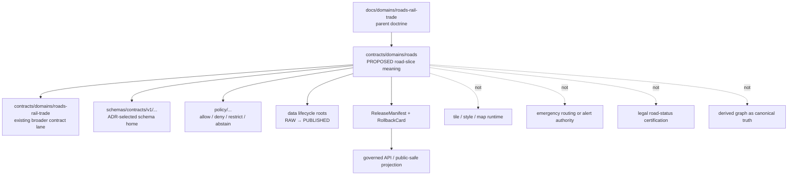

<!-- [KFM_META_BLOCK_V2]
doc_id: kfm://doc/contracts-domains-roads-readme
title: Roads Contracts README
 type: readme
version: v0.1
status: draft; compatibility-orientation; PROPOSED; NEEDS VERIFICATION before promotion
owners:
  - OWNER_TBD — Roads/Rail/Trade Routes domain steward
  - OWNER_TBD — Roads sublane steward
  - OWNER_TBD — Contracts steward
  - OWNER_TBD — Source steward
  - OWNER_TBD — Evidence steward
  - OWNER_TBD — Schema steward
  - OWNER_TBD — Policy steward
  - OWNER_TBD — Release steward
  - OWNER_TBD — Docs steward
created: NEEDS VERIFICATION — placeholder existed before v0.1 expansion
updated: 2026-06-23
policy_label: public; contracts; roads; compatibility-slice; roads-rail-trade; source-role-aware; evidence-bound; release-gated; rollback-aware; not-canonical-domain-authority; not-schema-home; not-policy-home; not-data-home; not-publication-authority
tags: [kfm, contracts, roads, roads-rail-trade, transport, road-segment, corridor-route, route-membership, crossing, bridge, ferry, restriction-event, status-event, operator-assignment, network-edge, EvidenceBundle, PolicyDecision, ReleaseManifest, RollbackCard]
related:
  - ../roads-rail-trade/README.md
  - ../../../docs/domains/roads-rail-trade/README.md
  - ../../../docs/domains/roads-rail-trade/CANONICAL_PATHS.md
  - ../../../docs/domains/roads-rail-trade/OBJECT_FAMILIES.md
  - ../../../docs/domains/roads-rail-trade/sublanes/roads.md
  - ../../../docs/domains/roads-rail-trade/IDENTITY_MODEL.md
  - ../../../docs/domains/roads-rail-trade/SOURCES.md
  - ../../../docs/domains/roads-rail-trade/MAP_UI_CONTRACTS.md
  - ../../../docs/runbooks/roads-rail-trade/PROMOTION_RUNBOOK.md
  - ../../../docs/runbooks/roads-rail-trade/ROLLBACK_RUNBOOK.md
  - ../../../schemas/contracts/v1/domains/roads-rail-trade/
  - ../../../policy/domains/roads-rail-trade/
  - ../../../fixtures/domains/roads-rail-trade/
  - ../../../tests/domains/roads-rail-trade/
  - ../../../release/candidates/roads-rail-trade/
notes:
  - "Expanded from a one-character placeholder at contracts/domains/roads/README.md."
  - "Current governing docs describe the main lane as roads-rail-trade and document a contract/schema slug conflict involving roads-rail-trade, transport, and older roads-rail references."
  - "This README treats contracts/domains/roads/ as a PROPOSED compatibility/orientation slice for road-specific semantic contracts only. It does not settle the domain slug ADR and does not create a new canonical domain authority."
  - "Public routing, legal road status, emergency closures, hazards, infrastructure ownership, and map rendering remain governed by their own evidence, policy, release, and rollback artifacts."
[/KFM_META_BLOCK_V2] -->

<a id="top"></a>

# Roads Contracts

Road-specific semantic-contract orientation for `contracts/domains/roads/`, treated as a **PROPOSED compatibility slice** under the broader Roads / Rail / Trade Routes lane — not as a new canonical domain root.

<p>
  
  
  
  
  
  
  
</p>

> [!IMPORTANT]
> **Status:** `draft` / `PROPOSED` compatibility orientation  
> **Path:** `contracts/domains/roads/README.md`  
> **Owner:** `OWNER_TBD`  
> **Placement posture:** the broader lane is documented as `roads-rail-trade`; this `roads/` contract folder exists in the repo but should not be treated as canonical authority until a domain-slug ADR or migration note accepts it.  
> **Truth posture:** contract docs define meaning only. Schemas, policies, fixtures, tests, source registries, release manifests, public APIs, map rendering, and runtime behavior remain **NEEDS VERIFICATION** unless cited separately.

> [!CAUTION]
> Do not let this `roads/` folder split authority away from `roads-rail-trade`, `transport`, or any future ADR-selected contract/schema home. This folder may orient road-specific contracts; it must not become a parallel source registry, schema home, policy home, data lifecycle root, release root, or public publication path.

## Quick jumps

[Scope](#scope) · [Repo fit](#repo-fit) · [Accepted inputs](#accepted-inputs) · [Exclusions](#exclusions) · [Road object families](#road-object-families) · [Authority boundaries](#authority-boundaries) · [Lifecycle](#lifecycle) · [Validation](#validation) · [Rollback](#rollback) · [Evidence basis](#evidence-basis) · [Open questions](#open-questions)

---

## Scope

`contracts/domains/roads/` is a road-specific semantic-contract orientation surface. It may describe road-mode object meanings and contract boundaries for maintainers who are working on the roads slice of the broader Roads / Rail / Trade Routes lane.

In scope:

- road-segment semantic contracts;
- road-aligned route membership and corridor-route contracts;
- road-aligned crossing, bridge, ferry, and river-crossing contract references;
- road restriction, status, operator, access, and transport-facility contract references;
- road-mode network-node/network-edge contract references;
- road-specific validation, release, and rollback obligations that are already grounded in the broader lane.

Out of scope:

- canonical lane slug decisions;
- JSON Schemas and machine validation shapes;
- policy rules and source activation;
- data lifecycle artifacts;
- released tiles, layers, APIs, public UI, or Focus Mode runtime behavior;
- emergency alerting, legal road-status certification, engineering/safety advice, or live routing authority.

---

## Repo fit

| Responsibility | Correct root or current evidence | This README's boundary |
|---|---|---|
| Broad domain doctrine | `docs/domains/roads-rail-trade/` | Governs the Roads / Rail / Trade Routes lane. |
| Road-slice doctrine | `docs/domains/roads-rail-trade/sublanes/roads.md` | PROPOSED roads sublane guidance. |
| Current broad contract lane | `contracts/domains/roads-rail-trade/` | Existing scaffolded contract home in repo evidence. |
| This road slice | `contracts/domains/roads/` | PROPOSED compatibility/orientation folder; not a canonical split. |
| Machine schemas | `schemas/contracts/v1/domains/roads-rail-trade/` or ADR-selected alternate | Shape enforcement; not owned here. |
| Policy | `policy/domains/roads-rail-trade/` or ADR-selected alternate | Allow/deny/restrict/abstain decisions; not owned here. |
| Fixtures/tests | `fixtures/domains/roads-rail-trade/`, `tests/domains/roads-rail-trade/` or ADR-selected alternate | Proof of behavior; not owned here. |
| Data lifecycle | `data/raw`, `data/work`, `data/quarantine`, `data/processed`, `data/catalog`, `data/published` lane segments | Source and release artifacts; not contract docs. |
| Release/rollback | `release/candidates/roads-rail-trade/` and release roots | Promotion, release, correction, rollback. |

> [!WARNING]
> The current docs show a slug conflict for contract/schema homes. Until an ADR resolves it, do not create additional road contract/schema roots casually. If `contracts/domains/roads/` is retained, it should be documented as a compatibility slice or migrated to the selected canonical lane.

---

## Accepted inputs

Roads contract docs here may define or reference semantics for:

| Input family | Accepted when | Guardrail |
|---|---|---|
| Road Segment | The doc defines meaning, identity, evidence posture, source-role discipline, or lifecycle expectations. | Segment evidence is not route designation, legal status, or routing truth by itself. |
| CorridorRoute | The doc distinguishes the route entity from its underlying segments. | A route is not a segment; membership is separate. |
| RouteMembership | The doc describes sourced, time-scoped membership between a road segment and a route. | Membership must preserve source role and valid time. |
| Crossing / Bridge / Ferry / River Crossing | The doc describes the road-side relation. | Hydrology, settlements/infrastructure, and rail may own companion truth. |
| RestrictionEvent / StatusEvent | The doc describes time-scoped road restrictions or status assertions. | Not emergency/live-alert authority unless separately governed. |
| OperatorAssignment | The doc describes sourced operator/jurisdiction assertions. | OpenStreetMap/GNIS-style context must not become legal operator truth. |
| Network Node / Network Edge | The doc describes derived graph objects. | Derived graph projections do not replace canonical records. |
| Layer / public projection references | The doc describes obligations only. | ReleaseManifest, PolicyDecision, EvidenceBundle, and rollback remain separate. |

---

## Exclusions

| Do not put here | Correct home | Why |
|---|---|---|
| JSON Schema files | `schemas/contracts/v1/...` selected by ADR | Schemas own machine shape. |
| Policy bundles | `policy/...` selected by ADR | Policy owns finite decisions. |
| Source descriptors | `data/registry/sources/...` | Source role, cadence, rights, and caveats stay auditable. |
| Raw KDOT/OSM/GNIS/HPMS/WZDx/source downloads | `data/raw/...` / lifecycle roots | Contracts do not store source data. |
| Normalized road datasets | `data/processed/...` | Processed evidence is lifecycle data, not contract prose. |
| Tiles, PMTiles, GeoJSON, GeoParquet, styles, or map views | release/data/map/UI roots | Delivery surfaces are downstream. |
| Emergency routing or closure advice | hazards/roads governed release/API paths | KFM must not imply real-time safety authority without specific evidence and policy. |
| Legal road-status certification | authoritative road agency/legal source context | KFM records evidence; it does not issue legal status opinions. |
| Infrastructure asset identity | settlements-infrastructure or relevant asset domain | Roads owns the road-side relationship, not every asset truth. |

---

## Road object families

| Object family | Meaning in this slice | Boundary |
|---|---|---|
| `Road Segment` | Road-edge evidence or released derivative constrained by source role, geometry, time, evidence, and release state. | Not route designation, legal status, or routing truth by itself. |
| `CorridorRoute` | A route/designation entity distinct from its segments. | Not collapsed into any one segment. |
| `RouteMembership` | A sourced, time-scoped assertion that a segment belongs to a corridor/route. | Not equivalent to segment identity. |
| `Network Node` / `Network Edge` | Derived graph/topology projection. | Derived graph does not replace canonical evidence. |
| `Crossing` / `Bridge` / `Ferry` / `River Crossing` | Road-side crossing relation. | Hydrology/infrastructure/rail companion claims remain separate. |
| `RestrictionEvent` | Time-scoped access, closure, weight, height, seasonal, or permit restriction assertion. | Not live emergency alert unless governed as such. |
| `StatusEvent` | Operational or construction-status assertion. | Source role and valid time required. |
| `OperatorAssignment` | Time-bound operator/jurisdiction assertion. | Requires authoritative or role-appropriate source. |
| `TransportFacility` | Road-aligned facility such as rest area, weigh station, port-of-entry road side, or access facility. | Settlement/infrastructure identity may own the asset. |

---

## Authority boundaries



---

## Lifecycle

Road contracts must preserve the KFM lifecycle membrane:

```text
RAW -> WORK / QUARANTINE -> PROCESSED -> CATALOG / TRIPLET -> PUBLISHED
```

Promotion is a governed state transition. A road source row, geometry line, route name, graph edge, layer, or map popup does not become public truth by being present in this folder.

---

## Validation

Before this folder is treated as a promoted contract lane, maintainers should verify:

- [ ] whether `contracts/domains/roads/` is accepted, an alias, or drift;
- [ ] whether road contracts belong under `contracts/domains/roads-rail-trade/`, `contracts/transport/`, `contracts/domains/roads/`, or another ADR-selected home;
- [ ] every road contract has a paired schema or a clearly marked schema gap;
- [ ] source-role rules prevent OSM/GNIS/context sources from becoming legal status/operator authority;
- [ ] route, segment, and membership are separate objects;
- [ ] derived network graph objects do not replace source evidence;
- [ ] restriction/status events include valid time, source role, and release posture;
- [ ] public projections have EvidenceBundle, PolicyDecision, ReviewRecord, ReleaseManifest, correction path, and RollbackCard where required;
- [ ] rollback invalidates derived layers, graph edges, cached APIs, exports, and AI summaries.

---

## Rollback

Rollback or migration is required when this folder:

- creates a parallel canonical road domain without ADR support;
- weakens source-role, evidence, policy, release, or rollback requirements;
- treats a map layer, graph projection, route name, or source row as canonical truth;
- implies emergency routing, legal road status, closure safety, or infrastructure ownership without authoritative evidence and policy;
- bypasses the broader Roads / Rail / Trade Routes lane or an ADR-selected `transport`/`roads-rail-trade` contract home.

Rollback target: restore this README to a compatibility note, move road-specific contract docs into the ADR-selected home, and update links from parent Roads / Rail / Trade Routes docs.

---

## Evidence basis

| Evidence | Supports | Limit |
|---|---|---|
| `contracts/domains/roads/README.md` placeholder | Target file existed and was only a one-character placeholder. | Does not prove accepted lane authority. |
| `docs/domains/roads-rail-trade/README.md` | Parent domain scope, object families, lifecycle, and documented slug divergence. | Contract/schema path divergence remains open. |
| `docs/domains/roads-rail-trade/CANONICAL_PATHS.md` | Domain Placement Law, slug conflict, and warnings not to fabricate hybrid paths. | It is draft and records conflict rather than final ADR. |
| `docs/domains/roads-rail-trade/sublanes/roads.md` | Roads sublane scope, source-role anti-collapse, road object families. | Sublane structure and term are PROPOSED / NEEDS VERIFICATION. |
| `docs/domains/roads-rail-trade/OBJECT_FAMILIES.md` | Road/rail/trade object-family roster and route/segment/member separation. | Some paths and object realizations remain PROPOSED. |
| `contracts/domains/roads-rail-trade/README.md` | Existing broad contract folder presence. | It is a generic greenfield scaffold and overbroad about authority. |

---

## Open questions

| ID | Question | Status |
|---|---|---|
| OQ-ROADS-CONTRACTS-01 | Is `contracts/domains/roads/` an accepted compatibility slice, a temporary placeholder, or drift? | OPEN / ADR NEEDED |
| OQ-ROADS-CONTRACTS-02 | Should road-specific contracts live here, under `contracts/domains/roads-rail-trade/`, under `contracts/transport/`, or under an ADR-selected alias? | OPEN / ADR NEEDED |
| OQ-ROADS-CONTRACTS-03 | Which road object contracts should be created first: `road_segment`, `route_membership`, `corridor_route`, `restriction_event`, `status_event`, or `operator_assignment`? | OPEN |
| OQ-ROADS-CONTRACTS-04 | Which sources are authoritative for route designation, operator/jurisdiction, restrictions, and road status? | OPEN / SOURCE STEWARD REVIEW |
| OQ-ROADS-CONTRACTS-05 | What public-safe layer/Focus Mode surfaces may use roads data without implying live routing or emergency safety advice? | OPEN / POLICY REVIEW |

[Back to top](#top)
