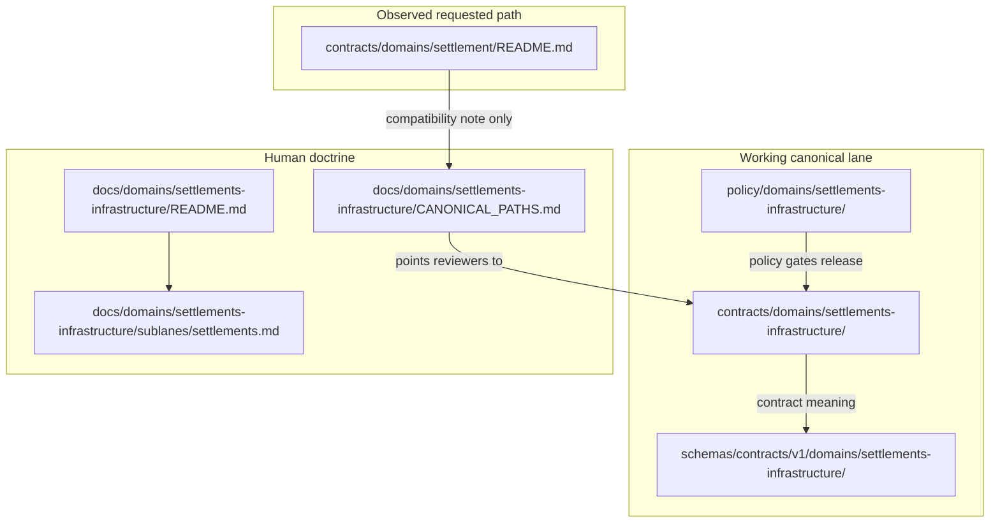

<!-- [KFM_META_BLOCK_V2]
doc_id: kfm://doc/contracts-domains-settlement-readme
title: Settlement Contract Lane README — Compatibility / Variance Surface
type: readme; contract-lane-readme; compatibility-note
version: v0.2
status: draft; CONFLICTED; compatibility-surface; NEEDS VERIFICATION before promotion
owners:
  - OWNER_TBD — Settlements/Infrastructure domain steward
  - OWNER_TBD — Contracts steward
  - OWNER_TBD — Schema steward
  - OWNER_TBD — Policy steward
  - OWNER_TBD — Docs steward
created: NEEDS VERIFICATION — empty file existed before v0.2 expansion
updated: 2026-06-23
policy_label: public; contracts; settlement; compatibility; conflicted-slug; settlements-infrastructure; no-parallel-authority; adr-needed; release-gated
tags: [kfm, contracts, settlement, settlements-infrastructure, compatibility, domain-placement, contracts-root, semantic-contracts, schemas, policy, ADR, EvidenceBundle, ReviewRecord, ReleaseManifest, RollbackCard]
related:
  - ../README.md
  - ../../README.md
  - ../settlements-infrastructure/README.md
  - ../../../docs/domains/settlements-infrastructure/README.md
  - ../../../docs/domains/settlements-infrastructure/CANONICAL_PATHS.md
  - ../../../docs/domains/settlements-infrastructure/sublanes/settlements.md
  - ../../../docs/architecture/domain-placement-law.md
  - ../../../docs/doctrine/directory-rules.md
  - ../../../schemas/contracts/v1/domains/settlement/README.md
  - ../../../schemas/contracts/v1/domains/settlements-infrastructure/
  - ../../../policy/domains/settlements-infrastructure/
notes:
  - "Expanded from an empty README at contracts/domains/settlement/README.md."
  - "This path is treated as a compatibility / variance surface, not as the canonical Settlements/Infrastructure contract home."
  - "Canonical-path doctrine identifies the domain segment as settlements-infrastructure and records settlement/ as a conflicted variant requiring ADR resolution."
  - "contracts/ defines semantic meaning; schemas define machine shape; policy defines admissibility/release decisions."
  - "Do not add new canonical settlement contracts here unless an ADR resolves the slug/path variance."
[/KFM_META_BLOCK_V2] -->

# Settlement Contract Lane README — Compatibility / Variance Surface

> Orientation README for `contracts/domains/settlement/`: a **CONFLICTED compatibility surface** for settlement-related contract references while KFM resolves the `settlement` vs `settlements-infrastructure` path variance. Canonical Settlements/Infrastructure contract work should use the ADR-approved domain lane, currently documented as `contracts/domains/settlements-infrastructure/` unless and until an ADR says otherwise.

  
  
  
  
  
  

**Status:** draft / compatibility surface  
**Owners:** `OWNER_TBD — Settlements/Infrastructure domain steward`, `OWNER_TBD — Contracts steward`, `OWNER_TBD — Docs steward`  
**Path:** `contracts/domains/settlement/README.md`  
**Canonical target lane:** `contracts/domains/settlements-infrastructure/` — **NEEDS VERIFICATION / ADR-sensitive**  
**Truth posture:** this file exists in the repo; its canonical authority is **CONFLICTED** because settlement-related path forms differ across KFM doctrine and lineage materials.

## Quick jumps

[Purpose](#purpose) · [Status and authority](#status-and-authority) · [Repo fit](#repo-fit) · [Accepted inputs](#accepted-inputs) · [Exclusions](#exclusions) · [Placement map](#placement-map) · [Object-family boundary](#object-family-boundary) · [Maintainer rules](#maintainer-rules) · [Validation](#validation) · [Rollback](#rollback) · [Evidence basis](#evidence-basis) · [Open questions](#open-questions)

---

## Purpose

`contracts/domains/settlement/` is a **guarded compatibility lane**. It exists to prevent a singular `settlement` path from becoming a silent parallel authority while KFM resolves settlement-domain path variance.

This README does three things:

1. marks the current path as **CONFLICTED / NEEDS VERIFICATION**;
2. points maintainers toward the canonical working lane, `settlements-infrastructure`, where current doctrine places the combined Settlements/Infrastructure domain;
3. states that semantic contracts, schemas, policy, fixtures, tests, release records, and lifecycle data must stay in their proper responsibility roots.

> [!IMPORTANT]
> This README does **not** promote `contracts/domains/settlement/` to the canonical contract home. It is a warning sign and navigation aid until an ADR resolves the naming/path conflict.

---

## Status and authority

| Question | Answer | Truth label |
|---|---|---|
| Does this README path exist? | Yes: `contracts/domains/settlement/README.md`. | **CONFIRMED** |
| Was there strong content here before this update? | No. The file existed as an empty file. | **CONFIRMED** |
| Is `contracts/` the semantic-contract responsibility root? | Yes. `contracts/` says contracts define object meaning and schemas define shape. | **CONFIRMED** |
| Is `settlements-infrastructure` the current canonical domain segment in architecture/path docs? | Yes in the inspected path doctrine. | **CONFIRMED doctrine / NEEDS VERIFICATION in implementation** |
| Is `settlement` a clean canonical replacement? | No. It is a conflicted variance surface, not a resolved authority home. | **CONFLICTED** |
| Should new canonical contract files be added here? | No, not without ADR resolution. | **DENY by default** |

---

## Repo fit

| Responsibility | Correct home | How this README relates |
|---|---|---|
| Human domain doctrine | `docs/domains/settlements-infrastructure/` | Explains settlement + infrastructure domain scope. |
| Settlement sublane doctrine | `docs/domains/settlements-infrastructure/sublanes/settlements.md` | Explains place/community identity subset. |
| Canonical contract lane | `contracts/domains/settlements-infrastructure/` | Current working contract lane per inspected path doctrine; still needs maturity verification. |
| This compatibility path | `contracts/domains/settlement/` | Conflict marker and navigation surface only. |
| Machine schemas | `schemas/contracts/v1/domains/settlements-infrastructure/` or ADR-selected equivalent | Do not create schema authority here. |
| Policy | `policy/domains/settlements-infrastructure/` or ADR-selected equivalent | Admissibility/release decisions stay out of contracts. |
| Data lifecycle | `data/raw|work|quarantine|processed|catalog|published/...` | Contract docs never contain lifecycle data. |
| Release decisions | `release/` / `release/candidates/...` | Publication is a governed state transition, not README text. |

---

## Accepted inputs

Only these belong in `contracts/domains/settlement/` while the path remains conflicted:

- this README as a compatibility / variance warning;
- a future ADR pointer if maintainers decide this path must stay for compatibility;
- temporary migration notes that explicitly route canonical work to the ADR-approved lane;
- deprecation notes or redirect stubs if a cleanup migration removes this path later.

Any such file must preserve the same posture: **this path is not a place to create new canonical object-family contracts until the conflict is resolved.**

---

## Exclusions

| Do not put this here | Use instead |
|---|---|
| `Settlement`, `Municipality`, `CensusPlace`, `Townsite`, `GhostTown`, `Fort`, `Mission`, or `ReservationCommunity` semantic contracts | `contracts/domains/settlements-infrastructure/` unless ADR selects another path |
| Infrastructure contracts such as `InfrastructureAsset`, `NetworkNode`, `Facility`, `ServiceArea`, `Operator`, `ConditionObservation`, `Dependency` | `contracts/domains/settlements-infrastructure/` unless ADR selects another path |
| JSON Schemas | `schemas/contracts/v1/domains/settlements-infrastructure/` or ADR-selected schema home |
| Sensitivity, release, redaction, or admissibility rules | `policy/domains/settlements-infrastructure/` or ADR-selected policy home |
| Fixtures, validator examples, or tests | `fixtures/domains/settlements-infrastructure/`, `tests/domains/settlements-infrastructure/` |
| RAW / WORK / QUARANTINE / PROCESSED / CATALOG / PUBLISHED data | `data/<phase>/settlements-infrastructure/` or ADR-selected lifecycle lane |
| Release manifests, rollback cards, or correction notices | `release/` and release-candidate roots |
| Transport-route truth, depot as rail role, road/rail corridor truth | `roads-rail-trade` domain lanes |
| Living-person, parcel, title, ownership, or DNA truth | `people-dna-land` domain lanes |
| Archaeological/sacred/cultural-site truth | `archaeology` domain lanes and policy review |

> [!WARNING]
> Adding canonical contracts under both `contracts/domains/settlement/` and `contracts/domains/settlements-infrastructure/` would create parallel semantic authority. That is a governance risk and should be treated as ADR-class drift.

---

## Placement map

The diagram is intentionally conservative: the observed path points to the canonical-path decision surface instead of pretending to be the canonical contract lane.

---

## Object-family boundary

The settlement half of the combined Settlements/Infrastructure lane includes these place/community identity families:

| Object family | Belongs to | Boundary |
|---|---|---|
| `Settlement` | Settlements/Infrastructure — settlements sublane | Generic place-of-occupation identity. |
| `Municipality` | Settlements/Infrastructure — settlements sublane | Legal incorporated place; not the same as census or historic identity. |
| `CensusPlace` | Settlements/Infrastructure — settlements sublane | Statistical place identity; not necessarily legal municipality. |
| `Townsite` | Settlements/Infrastructure — settlements sublane | Platted/founding place claim; not necessarily continuing settlement. |
| `GhostTown` | Settlements/Infrastructure — settlements sublane | Historic settlement identity with uncertainty/sensitivity care. |
| `Fort` | Settlements/Infrastructure — settlements sublane | Military-post identity; may be historic/cultural-adjacent. |
| `Mission` | Settlements/Infrastructure — settlements sublane | Religious mission station; may require cultural/historic review. |
| `ReservationCommunity` | Settlements/Infrastructure with sovereignty/cultural review | Publication and sensitivity decisions require owning-policy review. |

Infrastructure-side object families, such as `Infrastructure Asset`, `Facility`, `Service Area`, `Operator`, `Condition Observation`, and `Dependency`, remain in the same combined domain but are not settlement-place identity objects.

---

## Maintainer rules

1. **Do not add canonical contracts here by default.** Use the canonical Settlements/Infrastructure contract lane unless an ADR resolves otherwise.
2. **Do not create matching schemas here.** Schema-home variance must be resolved once, not copied into multiple roots.
3. **Do not weaken the trust membrane.** Contract prose does not publish data, authorize API access, or close evidence.
4. **Do not flatten place identities.** Settlement, municipality, census place, townsite, fort, mission, ghost town, and reservation community may coexist with different source roles and valid times.
5. **Do not absorb adjacent domains.** Transport routes, hydrology, hazards, land/title, people/living-person data, and archaeology/cultural heritage remain in their owning lanes.
6. **Do not publish sensitive detail by implication.** Reservation-community, historic-townsite, cultural, archaeological, infrastructure, or living-person-adjacent joins require fail-closed policy posture.

---

## Validation

Before promoting anything beyond this README, maintainers should verify:

- [ ] whether `contracts/domains/settlement/` should be deleted, retained as a redirect, or promoted by ADR;
- [ ] whether `contracts/domains/settlements-infrastructure/` remains the canonical contract lane;
- [ ] whether any schema paths exist under `schemas/contracts/v1/domains/settlement/` and whether they are drift;
- [ ] whether code, docs, tests, fixtures, or release manifests reference the singular `settlement` path;
- [ ] whether a migration note or ADR should redirect singular `settlement` references to `settlements-infrastructure`;
- [ ] whether no object-family contract exists in both singular and canonical lanes;
- [ ] whether public API, map, graph, Focus Mode, and AI surfaces resolve only through released governed interfaces.

---

## Rollback

Rollback is required if this README is used to justify a parallel contract authority or if it hides the path conflict.

Rollback target: revert `contracts/domains/settlement/README.md` to the prior empty blob `8b137891791fe96927ad78e64b0aad7bded08bdc`, then record the drift in the appropriate register or ADR queue if singular-path references still exist.

---

## Evidence basis

| Evidence | Status | Supports | Limits |
|---|---|---|---|
| Prior `contracts/domains/settlement/README.md` | `CONFIRMED` | File existed and was empty before this update. | Does not prove the path is canonical. |
| `contracts/README.md` | `CONFIRMED` | Contracts define semantic meaning; schemas define object shape; policy/data do not belong in contracts. | Does not resolve settlement slug conflict. |
| `contracts/domains/README.md` | `CONFIRMED` | Domain-specific contract objects live under `contracts/domains/`; cross-domain objects live elsewhere. | Does not identify the settlement slug. |
| `docs/domains/settlements-infrastructure/README.md` | `CONFIRMED doctrine / PROPOSED implementation` | Defines combined Settlements/Infrastructure domain scope and object families; keeps object meaning, schema, policy, data, and release decisions in separate roots. | Some implementation paths in that doc remain marked NEEDS VERIFICATION. |
| `docs/domains/settlements-infrastructure/CANONICAL_PATHS.md` | `CONFIRMED path doctrine / CONFLICTED variance` | Identifies `settlements-infrastructure` as canonical working segment and records `settlement` as a conflicted Atlas/path variance requiring ADR resolution. | Does not by itself migrate files or delete the singular path. |
| `docs/domains/settlements-infrastructure/sublanes/settlements.md` | `CONFIRMED doctrine / PROPOSED sublane application` | Defines settlement-place object subset and non-ownership boundaries. | Sublane layer and field realization remain PROPOSED / NEEDS VERIFICATION where noted. |
| `docs/architecture/domain-placement-law.md` | `CONFIRMED derived doctrine / PROPOSED path presence` | States domain segments live inside responsibility roots and not as repo root folders; names `settlements-infrastructure` as domain segment. | It is derived from Directory Rules and does not supersede them. |
| Uploaded KFM authoring prompt v2 | `CONFIRMED user-supplied guidance` | Requires evidence-first, visually polished, implementation-honest Markdown with no parallel authority. | Authoring guidance, not repository implementation proof. |

---

## Open questions

| ID | Question | Status |
|---|---|---|
| OQ-SETTLE-CONTRACTS-01 | Should `contracts/domains/settlement/` be retained as a compatibility redirect, migrated into `contracts/domains/settlements-infrastructure/`, or removed after references are updated? | OPEN / ADR NEEDED |
| OQ-SETTLE-CONTRACTS-02 | Which existing references point to singular `settlement` contract/schema paths? | OPEN / REPO SEARCH NEEDED |
| OQ-SETTLE-CONTRACTS-03 | Should singular `settlement` be reserved only for the settlement-place sublane while the full domain remains `settlements-infrastructure`? | OPEN / DOMAIN REVIEW |
| OQ-SETTLE-CONTRACTS-04 | What migration receipt should record any eventual path cleanup? | OPEN / RELEASE + DOCS REVIEW |

<a href="#top">Back to top</a>

