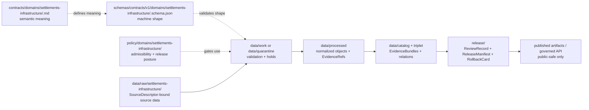

<!-- [KFM_META_BLOCK_V2]
doc_id: kfm://doc/contracts-domains-settlements-infrastructure-readme
title: Settlements / Infrastructure Contract Lane README
type: readme; contract-lane-readme
version: v0.2
status: draft; experimental; canonical-working-lane; slug-CONFLICTED-with-singular-settlement; NEEDS VERIFICATION before promotion
owners:
  - OWNER_TBD — Settlements/Infrastructure domain steward
  - OWNER_TBD — Settlements sublane steward
  - OWNER_TBD — Infrastructure sublane steward
  - OWNER_TBD — Contracts steward
  - OWNER_TBD — Schema steward
  - OWNER_TBD — Policy steward
  - OWNER_TBD — Docs steward
created: NEEDS VERIFICATION — scaffold existed before v0.2 expansion
updated: 2026-06-23
policy_label: public; contracts; settlements-infrastructure; semantic-contracts; domain-lane; no-parallel-authority; source-role-aware; lifecycle-aware; sensitivity-aware; release-gated; rollback-aware
tags: [kfm, contracts, settlements-infrastructure, settlements, infrastructure, semantic-contracts, domain-placement, SourceDescriptor, EvidenceBundle, PolicyDecision, ReviewRecord, ReleaseManifest, RollbackCard]
related:
  - ../README.md
  - ../../README.md
  - ../settlement/README.md
  - ../../../docs/domains/settlements-infrastructure/README.md
  - ../../../docs/domains/settlements-infrastructure/CANONICAL_PATHS.md
  - ../../../docs/domains/settlements-infrastructure/sublanes/settlements.md
  - ../../../docs/domains/settlements-infrastructure/sublanes/infrastructure.md
  - ../../../docs/architecture/domain-placement-law.md
  - ../../../docs/doctrine/directory-rules.md
  - ../../../schemas/contracts/v1/domains/settlements-infrastructure/README.md
  - ../../../policy/domains/settlements-infrastructure/README.md
notes:
  - "Expanded from a greenfield scaffold at contracts/domains/settlements-infrastructure/README.md."
  - "This file defines the contracts responsibility lane only: human-readable semantic meaning for Settlements/Infrastructure object families."
  - "Schemas, policy, tests, fixtures, packages, pipelines, registries, lifecycle data, release manifests, and source data remain in their own responsibility roots."
  - "The singular contracts/domains/settlement/ path is treated as a compatibility / variance surface, not the canonical lane, unless an ADR resolves otherwise."
  - "Implementation maturity remains NEEDS VERIFICATION where schemas, validators, fixtures, policy tests, released artifacts, public APIs, or runtime behavior were not inspected."
[/KFM_META_BLOCK_V2] -->

<a id="top"></a>

# Settlements / Infrastructure Contract Lane README

> Contract-lane README for `contracts/domains/settlements-infrastructure/`: the human-readable semantic contract home for Settlements/Infrastructure object families. Contracts say **what objects mean**; schemas say **what they look like**; policy says **whether and how they may be used or released**.

<p>
  
  
  
  
  
  
</p>

**Status:** experimental / draft  
**Owners:** `OWNER_TBD — Settlements/Infrastructure domain steward`, `OWNER_TBD — Contracts steward`, `OWNER_TBD — Docs steward`  
**Path:** `contracts/domains/settlements-infrastructure/README.md`  
**Authority class:** semantic-contract lane README  
**Truth posture:** current file presence is **CONFIRMED**; schema, policy, validator, fixture, release, public API, graph, map, and runtime behavior remain **NEEDS VERIFICATION** unless cited elsewhere.

## Quick jumps

[Scope](#scope) · [Status and authority](#status-and-authority) · [Repo fit](#repo-fit) · [Accepted inputs](#accepted-inputs) · [Exclusions](#exclusions) · [Directory map](#directory-map) · [Object-family lanes](#object-family-lanes) · [Contract authoring rules](#contract-authoring-rules) · [Lifecycle boundary](#lifecycle-boundary) · [Validation](#validation) · [Rollback](#rollback) · [Evidence basis](#evidence-basis) · [Open questions](#open-questions)

---

## Scope

This folder is the **contracts responsibility-root lane** for the combined Settlements/Infrastructure domain.

It may host Markdown semantic contracts for object families such as settlements, municipalities, census places, townsites, ghost towns, forts, missions, reservation communities, infrastructure assets, networks, facilities, service areas, operators, condition observations, and dependencies.

It must not host schemas, policy, fixtures, tests, packages, pipelines, registries, source data, lifecycle data, release decisions, or public artifacts. Those belong in their own responsibility roots.

> [!IMPORTANT]
> A contract is a meaning surface. It can define what `Settlement`, `Facility`, or `Dependency` means inside KFM, but it does not validate JSON, admit a source, release a public layer, publish a map, or authorize an AI answer.

---

## Status and authority

| Question | Answer | Truth label |
|---|---|---|
| Does this README path exist? | Yes: `contracts/domains/settlements-infrastructure/README.md`. | **CONFIRMED** |
| Was the prior file complete? | No. It was a short greenfield scaffold and incorrectly implied non-contract materials belonged in this root. | **CONFIRMED / corrected** |
| Is `contracts/` the semantic meaning root? | Yes. The root README states contracts define object meaning and pair with schemas for shape. | **CONFIRMED** |
| Is this the current working canonical lane? | Yes, based on inspected path doctrine using `settlements-infrastructure`. | **CONFIRMED doctrine / NEEDS VERIFICATION in implementation** |
| Is singular `contracts/domains/settlement/` canonical? | No. It is treated as a compatibility / variance surface pending ADR. | **CONFLICTED** |
| Are object-level contracts, schemas, validators, fixtures, policy tests, and released APIs mature? | Not proven in this task. | **NEEDS VERIFICATION** |

---

## Repo fit

| Responsibility | Path | Role |
|---|---|---|
| Contract lane | `contracts/domains/settlements-infrastructure/` | Human-readable semantic meaning for domain objects. |
| Domain contract index | `contracts/domains/README.md` | Explains that domain-specific contracts live under `contracts/domains/`. |
| Contracts root | `contracts/README.md` | Defines contract root authority and separation from schemas/policy/data. |
| Compatibility variant | `contracts/domains/settlement/README.md` | Guarded warning page for singular `settlement` path variance. |
| Domain doctrine | `docs/domains/settlements-infrastructure/README.md` | Human-facing domain explanation, scope, source families, boundaries, lifecycle, and outputs. |
| Canonical paths | `docs/domains/settlements-infrastructure/CANONICAL_PATHS.md` | Path registry and slug-variance decision surface. |
| Settlements sublane | `docs/domains/settlements-infrastructure/sublanes/settlements.md` | Place/community identity object families. |
| Infrastructure sublane | `docs/domains/settlements-infrastructure/sublanes/infrastructure.md` | Infrastructure assets, networks, facilities, service areas, operators, condition observations, dependencies. |
| Schema lane | `schemas/contracts/v1/domains/settlements-infrastructure/` | JSON Schema / machine shape; not contract prose. |
| Policy lane | `policy/domains/settlements-infrastructure/` | Admissibility, sensitivity, release, deny/abstain behavior. |
| Tests and fixtures | `tests/domains/settlements-infrastructure/`, `fixtures/domains/settlements-infrastructure/` | Behavior proof and validation samples. |
| Data lifecycle | `data/raw|work|quarantine|processed|catalog|published/...` | Lifecycle data and released products; never stored in contracts. |
| Release | `release/` and `release/candidates/settlements-infrastructure/` | Promotion, release manifests, correction notices, rollback cards. |

---

## Accepted inputs

Files in this folder may be:

- directory-level README and maintainer guidance;
- object-family semantic contracts such as `settlement.md`, `municipality.md`, `census_place.md`, `townsite.md`, `ghost_town.md`, `fort.md`, `mission.md`, `reservation_community.md`, `infrastructure_asset.md`, `network_node.md`, `network_segment.md`, `facility.md`, `service_area.md`, `operator.md`, `condition_observation.md`, or `dependency.md` — **PROPOSED filenames until created and schema-aligned**;
- contract indexes, compatibility notes, or migration notes that preserve source-role, sensitivity, release, correction, and rollback boundaries;
- ADR pointers that explain contract/schema/policy naming variance.

Every contract here should answer:

1. What does the object mean in KFM?
2. What evidence and source-role posture can support it?
3. What does it explicitly **not** prove?
4. Which schema, policy, fixture, test, release, and rollback surfaces must remain separate?

---

## Exclusions

| Do not put this here | Correct responsibility root |
|---|---|
| JSON Schema or JSON-LD shape | `schemas/contracts/v1/domains/settlements-infrastructure/` or ADR-selected equivalent |
| Policy decisions, sensitivity tiers, redaction rules, allow/deny/abstain logic | `policy/domains/settlements-infrastructure/` or cross-cutting policy roots |
| Fixtures and validation examples | `fixtures/domains/settlements-infrastructure/` |
| Tests and validators | `tests/domains/settlements-infrastructure/`, `tools/validators/` |
| Packages, domain code, adapters, generated SDKs | `packages/domains/settlements-infrastructure/` or ADR-selected package lane |
| Pipelines and pipeline specs | `pipelines/domains/settlements-infrastructure/`, `pipeline_specs/settlements-infrastructure/` |
| Source registry records | `data/registry/sources/` or ADR-selected registry lane |
| RAW / WORK / QUARANTINE / PROCESSED / CATALOG / PUBLISHED data | `data/<phase>/settlements-infrastructure/` |
| Release manifests, rollback cards, correction notices | `release/` roots |
| Public map/API artifacts | released artifact roots and governed API surfaces |
| Transport route truth | `roads-rail-trade` lanes |
| Living-person, parcel, title, ownership, DNA truth | `people-dna-land` lanes |
| Archaeological/sacred/cultural-site truth | `archaeology` lanes and policy review |

> [!WARNING]
> This README intentionally corrects the prior scaffold wording that placed “docs, contracts, schemas, policies, fixtures, tests, packages, pipelines, registries, or data lifecycle artifacts” inside `contracts/`. In KFM, responsibility roots do not collapse into a domain folder.

---

## Directory map

The confirmed current file in this lane is this README. Object-level files below are **PROPOSED** until created, reviewed, and paired with schemas/policy/tests.

```text
contracts/domains/settlements-infrastructure/
├── README.md                         # CONFIRMED — this contract-lane README
├── settlement.md                     # PROPOSED — place/community umbrella contract
├── municipality.md                   # PROPOSED — incorporated legal place contract
├── census_place.md                   # PROPOSED — census/statistical place contract
├── townsite.md                       # PROPOSED — platted/historic townsite contract
├── ghost_town.md                     # PROPOSED — historic/abandoned settlement contract
├── fort.md                           # PROPOSED — military post/place identity contract
├── mission.md                        # PROPOSED — religious mission station contract
├── reservation_community.md          # PROPOSED — sovereignty/cultural-review-sensitive contract
├── infrastructure_asset.md           # PROPOSED — physical asset identity contract
├── network_node.md                   # PROPOSED — infrastructure network node contract
├── network_segment.md                # PROPOSED — infrastructure network segment contract
├── facility.md                       # PROPOSED — operational complex/facility contract
├── service_area.md                   # PROPOSED — served footprint contract
├── operator.md                       # PROPOSED — infrastructure operator role contract
├── condition_observation.md          # PROPOSED — inspection/status observation contract
└── dependency.md                     # PROPOSED — asset/facility/network dependency contract
```

---

## Object-family lanes

### Settlements sublane — place/community identity

| Object family | Contract posture | Boundary |
|---|---|---|
| `Settlement` | **PROPOSED contract file** | Generic place-of-occupation identity; do not collapse legal, census, and historic identities. |
| `Municipality` | **PROPOSED contract file** | Legal incorporated place; not the same as census place or settlement status panel. |
| `CensusPlace` | **PROPOSED contract file** | Statistical identity; not legal incorporation. |
| `Townsite` | **PROPOSED contract file** | Platted or founding claim; not necessarily continuing settlement. |
| `GhostTown` | **PROPOSED contract file** | Historic settlement identity with uncertainty and possible archaeology sensitivity. |
| `Fort` | **PROPOSED contract file** | Military-post identity; may be cultural/historic-adjacent. |
| `Mission` | **PROPOSED contract file** | Religious mission station; may require cultural/historic review. |
| `ReservationCommunity` | **PROPOSED contract file** | Sovereignty/cultural-review-sensitive; fail-closed publication posture. |

### Infrastructure sublane — assets, systems, operators, condition, dependencies

| Object family | Contract posture | Boundary |
|---|---|---|
| `InfrastructureAsset` | **PROPOSED contract file** | Physical asset identity; not transport route truth or parcel/title proof. |
| `NetworkNode` | **PROPOSED contract file** | Infrastructure network node; not a transport graph node unless explicitly cross-referenced. |
| `NetworkSegment` | **PROPOSED contract file** | Infrastructure segment; not a road/rail segment. |
| `Facility` | **PROPOSED contract file** | Operational complex; may be sensitive and operator-linked. |
| `ServiceArea` | **PROPOSED contract file** | Served footprint; time-scoped and often generalized. |
| `Operator` | **PROPOSED contract file** | Asset/facility/system operator role; legal entity facts require owning evidence. |
| `ConditionObservation` | **PROPOSED contract file** | Time-scoped condition/inspection/status observation; not emergency or safety advice. |
| `Dependency` | **PROPOSED contract file** | Directed reliance relation; sensitive dependencies may be restricted or denied. |

---

## Contract authoring rules

Every object-family contract in this lane should include:

- KFM Meta Block v2;
- source-role and EvidenceBundle requirements;
- deterministic identity posture where practical;
- distinct time axes: source time, observed time, valid time, retrieval time, release time, correction time;
- accepted uses and explicit exclusions;
- sensitivity, rights, policy, review, release, correction, and rollback boundaries;
- links to paired schema, policy, fixtures, tests, and release surfaces;
- a validation checklist that does not claim tests exist unless verified;
- rollback target guidance.

Contracts must not claim that schemas, validators, fixtures, policy tests, source registries, public APIs, map renderers, graph projections, or release artifacts exist unless current repo evidence proves them.

---

## Lifecycle boundary



Publication is a governed state transition, not a file move. This contract lane can guide meaning, but it cannot publish content by itself.

---

## Validation

Before treating this folder as mature, maintainers should verify:

- [ ] `contracts/domains/settlements-infrastructure/` remains the ADR-approved canonical contract lane;
- [ ] `contracts/domains/settlement/` has no canonical object contracts and remains a compatibility/variance surface or is migrated/removed;
- [ ] every contract file has a paired schema or explicitly records schema-missing posture;
- [ ] every schema is paired with fixtures and validator/test coverage;
- [ ] policy files define deny/restrict/abstain behavior for critical infrastructure, operator-sensitive details, precise facilities, dependencies, reservation-community material, and archaeology/cultural adjacencies;
- [ ] public DTOs, maps, Focus Mode, exports, and AI summaries use only governed APIs and released artifacts;
- [ ] release manifests and rollback cards exist before public or semi-public exposure;
- [ ] cross-domain references do not overwrite transport, hydrology, hazards, people/land, archaeology, or cultural-heritage authority.

---

## Rollback

Rollback is required if this README causes maintainers to place schemas, policy, data, tests, pipelines, release manifests, or source records inside `contracts/`, or if it hides the `settlement` vs `settlements-infrastructure` path conflict.

Rollback target: revert `contracts/domains/settlements-infrastructure/README.md` to prior scaffold blob `914eba35821f631e04ea78b569fa5fb846fcc677`, then record any remaining singular/canonical lane conflict in the ADR or drift backlog.

---

## Evidence basis

| Evidence | Status | Supports | Limits |
|---|---|---|---|
| Prior `contracts/domains/settlements-infrastructure/README.md` | `CONFIRMED` | Existing scaffold and SHA; showed contract-lane path existed. | Scaffold was thin and over-broad about what belongs in `contracts/`. |
| `contracts/README.md` | `CONFIRMED` | Contracts define semantic meaning; schemas define shape; policy/data do not belong in contracts. | Does not enumerate every domain object. |
| `contracts/domains/README.md` | `CONFIRMED` | Domain-specific contract objects live under `contracts/domains/`. | Does not resolve settlement slug variance. |
| `docs/domains/settlements-infrastructure/README.md` | `CONFIRMED doctrine / PROPOSED implementation` | Defines combined domain scope, object families, source families, non-ownership boundaries, and lifecycle posture. | Some paths and implementation maturity remain NEEDS VERIFICATION. |
| `docs/domains/settlements-infrastructure/CANONICAL_PATHS.md` | `CONFIRMED path doctrine / CONFLICTED variance` | Identifies `settlements-infrastructure` as current working segment and records singular `settlement` variance. | Does not itself migrate files or prove all lane files exist. |
| `docs/domains/settlements-infrastructure/sublanes/settlements.md` | `CONFIRMED doctrine / PROPOSED sublane application` | Defines settlement-place object subset and non-ownership boundaries. | Sublane structure and field realization remain partly PROPOSED. |
| `docs/domains/settlements-infrastructure/sublanes/infrastructure.md` | `CONFIRMED doctrine / PROPOSED field realization` | Defines infrastructure object subset, non-ownership boundaries, source-role anti-collapse, and sensitivity posture. | Does not prove contract/schema/test implementation. |
| `schemas/contracts/v1/domains/settlements-infrastructure/README.md` | `CONFIRMED scaffold` | Confirms schema-lane README exists. | It is still a broad scaffold and should not be read as field-level schema maturity. |
| `policy/domains/settlements-infrastructure/README.md` | `CONFIRMED scaffold` | Confirms policy-lane README exists. | It is still a broad scaffold and should not be read as policy maturity. |
| Uploaded KFM authoring prompt v2 | `CONFIRMED user-supplied guidance` | Requires evidence-first, implementation-honest, visually polished Markdown with rollback and no parallel authority. | Authoring guidance, not implementation proof. |

---

## Open questions

| ID | Question | Status |
|---|---|---|
| OQ-SI-CONTRACTS-01 | Should singular `contracts/domains/settlement/` be retained as a compatibility redirect, reserved for sublane-specific aliases, or removed after migration? | OPEN / ADR NEEDED |
| OQ-SI-CONTRACTS-02 | Which object-family contract files already exist or should be generated first? | OPEN / REPO SEARCH + STEWARD PRIORITY |
| OQ-SI-CONTRACTS-03 | Which schema path is authoritative if legacy sources still reference `schemas/contracts/v1/settlement/` or `schemas/contracts/v1/domains/settlement/`? | OPEN / ADR NEEDED |
| OQ-SI-CONTRACTS-04 | Which critical-infrastructure, dependency, operator, reservation-community, archaeology-adjacent, and living-person-adjacent contract fields require default deny or generalization? | OPEN / POLICY REVIEW |
| OQ-SI-CONTRACTS-05 | Which public map/API/Focus Mode surfaces should consume released Settlements/Infrastructure contracts first? | OPEN / RELEASE REVIEW |

<p align="right"><a href="#top">Back to top</a></p>
