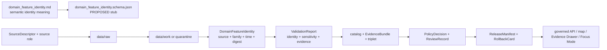

<!-- [KFM_META_BLOCK_V2]
doc_id: kfm://doc/contracts-domains-settlements-infrastructure-domain-feature-identity
title: Settlements / Infrastructure Domain Feature Identity Contract
type: semantic-contract
version: v0.2
status: draft; PROPOSED; schema-stub-confirmed; canonical-working-lane; slug-CONFLICTED-with-singular-settlement; NEEDS VERIFICATION before promotion
owners:
  - OWNER_TBD — Settlements/Infrastructure domain steward
  - OWNER_TBD — Settlements-side identity steward
  - OWNER_TBD — Infrastructure-side identity steward
  - OWNER_TBD — Contracts steward
  - OWNER_TBD — Source steward
  - OWNER_TBD — Evidence steward
  - OWNER_TBD — Schema steward
  - OWNER_TBD — Policy steward
  - OWNER_TBD — Release steward
  - OWNER_TBD — Docs steward
created: NEEDS VERIFICATION — scaffold existed before v0.2 expansion
updated: 2026-06-23
policy_label: public; contracts; settlements-infrastructure; domain-feature-identity; identity-envelope; deterministic-identity; source-role-aware; temporal-scope-aware; evidence-bound; sensitivity-aware; infrastructure-sensitive; reservation-community-sensitive; no-parallel-authority; release-gated; rollback-aware; not-object-payload; not-schema-enforcement; not-policy-decision; not-publication-authority
tags: [kfm, contracts, settlements-infrastructure, domain-feature-identity, identity, deterministic-id, spec-hash, source-role, temporal-scope, settlement, municipality, census-place, townsite, ghost-town, fort, mission, reservation-community, infrastructure-asset, network-node, network-segment, facility, service-area, operator, condition-observation, dependency, EvidenceBundle, PolicyDecision, ReviewRecord, ReleaseManifest, RollbackCard]
related:
  - ./README.md
  - ../settlement/README.md
  - ../../../docs/domains/settlements-infrastructure/README.md
  - ../../../docs/domains/settlements-infrastructure/CANONICAL_PATHS.md
  - ../../../docs/domains/settlements-infrastructure/sublanes/settlements.md
  - ../../../docs/domains/settlements-infrastructure/sublanes/infrastructure.md
  - ../../../schemas/contracts/v1/domains/settlements-infrastructure/domain_feature_identity.schema.json
  - ../../../schemas/contracts/v1/domains/settlements-infrastructure/README.md
  - ../../../policy/domains/settlements-infrastructure/README.md
  - ../../../fixtures/domains/settlements-infrastructure/domain_feature_identity/
  - ../../../tests/domains/settlements-infrastructure/
  - ../../../release/candidates/settlements-infrastructure/
notes:
  - "Expanded from a PROPOSED greenfield scaffold at contracts/domains/settlements-infrastructure/domain_feature_identity.md."
  - "The paired schema exists, but it is still a permissive PROPOSED stub requiring only id and allowing additional properties. Field enforcement remains NEEDS VERIFICATION."
  - "This contract defines identity-envelope meaning for Settlements/Infrastructure objects; it is not the object payload, schema enforcement, policy decision, release manifest, public API, graph node, map layer, or AI answer."
  - "The domain README names sixteen object families and proposes source id + object role + temporal scope + normalized digest as the identity basis."
  - "Settlement-side identities and infrastructure-side identities share one bounded context but must not collapse legal/census/historic/community identities into asset/facility/operator/dependency identities."
  - "The singular contracts/domains/settlement path remains a compatibility / variance surface, not a canonical replacement, unless an ADR resolves otherwise."
[/KFM_META_BLOCK_V2] -->

<a id="top"></a>

# Settlements / Infrastructure Domain Feature Identity

> Semantic contract for `domain_feature_identity`: the source-scoped identity envelope that names, scopes, versions, and links a Settlements/Infrastructure feature across object family, source role, temporal scope, spatial support, evidence, sensitivity, correction lineage, and rollback context.

<p>
  
  
  
  
  
  
  
</p>

`contracts/domains/settlements-infrastructure/domain_feature_identity.md`

## Quick jumps

[Status](#status) · [Meaning](#meaning) · [Repo fit](#repo-fit) · [Schema posture](#schema-posture) · [Accepted uses](#accepted-uses) · [Exclusions](#exclusions) · [Recommended semantics](#recommended-semantics) · [Identity recipe](#identity-recipe) · [Object-family coverage](#object-family-coverage) · [Invariants](#invariants) · [Lifecycle](#lifecycle) · [Validation](#validation) · [Rollback](#rollback) · [Evidence basis](#evidence-basis) · [Open questions](#open-questions)

---

## Status

> [!IMPORTANT]
> **Status:** `draft` / semantic contract  
> **Contract path:** `contracts/domains/settlements-infrastructure/domain_feature_identity.md`  
> **Schema path:** `schemas/contracts/v1/domains/settlements-infrastructure/domain_feature_identity.schema.json`  
> **Truth posture:** target path, prior scaffold, paired schema metadata, current contract-lane README, and domain object-family doctrine are **CONFIRMED** from current repo evidence. Field-level schema enforcement, validator implementation, fixtures, policy behavior, source registry behavior, release workflow, public API behavior, graph behavior, map rendering, and runtime behavior remain **NEEDS VERIFICATION**.

> [!CAUTION]
> This contract defines identity meaning only. It does **not** authorize public release, prove a settlement or asset claim, expose sensitive infrastructure details, decide policy, validate JSON, replace object-family contracts, emit EvidenceBundles, or create a public map/API/AI surface.

---

## Meaning

`DomainFeatureIdentity` is the Settlements/Infrastructure identity-support object for governed settlement-place, community, infrastructure, facility, network, operator, condition, and dependency records.

It exists to answer:

- Which Settlements/Infrastructure object family is being identified?
- Which source and source role contributed the identity assertion?
- Which source-native identifier, place name, asset key, network key, facility key, operator key, or record key is being carried forward?
- Which temporal axes are identity-significant and must not be collapsed?
- Which spatial or service-area support is part of the identity, and is it safe to expose?
- Which normalized digest or `spec_hash` pins the represented content?
- Which EvidenceRef, source descriptor, policy decision, review record, correction notice, and rollback context applies?

It is an identity-envelope object. It is **not** the feature payload itself. Object meaning stays in object-family contracts such as future `settlement.md`, `municipality.md`, `infrastructure_asset.md`, `facility.md`, `operator.md`, `condition_observation.md`, or `dependency.md` contracts.

---

## Repo fit

The Settlements/Infrastructure contract README defines this folder as the contracts responsibility-root lane: human-readable semantic meaning only. Schemas, policy, fixtures, tests, packages, pipelines, lifecycle data, release manifests, and source data remain in their own responsibility roots.

| Responsibility | Settlements/Infrastructure lane path | This contract's role |
|---|---|---|
| Semantic identity meaning | `contracts/domains/settlements-infrastructure/domain_feature_identity.md` | Owned here. |
| Contract-lane orientation | `contracts/domains/settlements-infrastructure/README.md` | Governs folder role and exclusions. |
| Compatibility / variance warning | `contracts/domains/settlement/README.md` | Singular path is not canonical authority unless ADR resolves otherwise. |
| Machine schema shape | `schemas/contracts/v1/domains/settlements-infrastructure/domain_feature_identity.schema.json` | Linked only; currently stub-confirmed. |
| Domain doctrine | `docs/domains/settlements-infrastructure/README.md` | Lists object families and domain boundaries. |
| Settlements-side object families | `docs/domains/settlements-infrastructure/sublanes/settlements.md` | Place/community identity doctrine and non-ownership. |
| Infrastructure-side object families | `docs/domains/settlements-infrastructure/sublanes/infrastructure.md` | Asset/network/facility/operator/condition/dependency doctrine and sensitivity posture. |
| Policy lane | `policy/domains/settlements-infrastructure/` | Required admissibility, sensitivity, release, deny/abstain behavior. |
| Evidence/proof support | `fixtures/domains/settlements-infrastructure/`, `tests/domains/settlements-infrastructure/`, EvidenceBundle/proof roots | Required before consequential use. |
| Release/correction/rollback | `release/` and `release/candidates/settlements-infrastructure/` | Required downstream governance. |

This split prevents an identity contract from quietly becoming a schema, source registry, policy file, infrastructure disclosure, public truth store, release manifest, or graph/public API payload.

---

## Schema posture

The paired schema currently exists as a **PROPOSED stub**.

| Schema fact | Current evidence |
|---|---|
| Schema file path | `schemas/contracts/v1/domains/settlements-infrastructure/domain_feature_identity.schema.json` |
| Schema title | `domain_feature_identity` |
| Declared properties | `spec_hash`, `id`, `version` |
| Required fields | `id` only |
| Additional properties | `true` |
| Fixture root | `fixtures/domains/settlements-infrastructure/domain_feature_identity/` in schema metadata |
| Validator path | `tools/validators/domains/settlements-infrastructure/validate_domain_feature_identity.py` in schema metadata |
| Policy path | `policy/domains/settlements-infrastructure/` in schema metadata |

Because the schema is not field-complete, this contract defines **semantic expectations** for future schema, fixtures, validators, policy tests, and release checks. It does not claim the current schema enforces those expectations.

---

## Accepted uses

| Use | Allowed? | Rule |
|---|---:|---|
| Carrying stable Settlements/Infrastructure feature identity | Yes | Must preserve object family, source, source role, source-native key, temporal scope, support scope, digest, and lineage context. |
| Distinguishing settlement-place identities | Yes | Must not collapse Settlement, Municipality, CensusPlace, Townsite, GhostTown, Fort, Mission, or ReservationCommunity into one object. |
| Distinguishing infrastructure identities | Yes | Must not collapse InfrastructureAsset, NetworkNode, NetworkSegment, Facility, ServiceArea, Operator, ConditionObservation, or Dependency. |
| Supporting dedupe, merge, supersession, or non-regression checks | Yes | Must preserve source role, object family, time, sensitivity, and correction context. |
| Linking object-family records to evidence and source records | Yes | Evidence and source references must resolve before consequential claims. |
| Supporting correction and rollback lineage | Yes | Identity changes must remain auditable and invalidate derivatives where needed. |
| Publishing a public settlement/infrastructure claim | No | Release requires separate evidence, policy, review, redaction/generalization where needed, and release support. |
| Acting as the feature payload | No | Object-family contracts and schemas own object meaning and shape. |
| Acting as schema enforcement | No | `.schema.json` files own shape. |
| Acting as policy decision | No | Policy homes decide allow/deny/restrict/abstain. |

---

## Exclusions

| Does not belong in `DomainFeatureIdentity` | Correct home |
|---|---|
| Full settlement, municipality, census, townsite, ghost-town, fort, mission, or reservation-community payload | Object-family contracts and schemas. |
| Full asset, network, facility, service area, operator, condition observation, or dependency payload | Object-family contracts and schemas. |
| Source descriptor, license, cadence, rights, or source activation decision | Source registry and source-governance roots. |
| EvidenceBundle content | Evidence/proof roots. |
| JSON Schema shape | `schemas/contracts/v1/domains/settlements-infrastructure/domain_feature_identity.schema.json`. |
| Validator implementation | `tools/validators/domains/settlements-infrastructure/validate_domain_feature_identity.py` after verification. |
| PolicyDecision, ReviewRecord, RedactionReceipt, AggregationReceipt, ReleaseManifest, CorrectionNotice, RollbackCard | Their own governance/release/correction homes. |
| Exact critical infrastructure detail, vulnerability, dependency chain, private utility detail, or security-sensitive geometry | Policy/restricted data roots; not in public contract prose. |
| Living-person, DNA, parcel/title, ownership, residence, or migration data | People / DNA / Land lanes. |
| Archaeological, sacred-site, or cultural-site coordinates | Archaeology / Cultural Heritage lanes and policy review. |
| Public UI/API payload or Focus Mode content | Governed app/API/UI/focus-mode roots. |

> [!WARNING]
> Do not use example identity values that reveal exact restricted infrastructure locations, dependency chains, operator vulnerabilities, private facility details, reservation-community sensitive context, archaeology-adjacent detail, living-person joins, parcel/title joins, or redaction transform parameters.

---

## Recommended semantics

The current schema requires only `id`. The following fields are **PROPOSED** semantic expectations for a reviewed schema and fixture suite.

| Field | Meaning |
|---|---|
| `id` | Canonical Settlements/Infrastructure feature identity. |
| `version` | Contract/object identity version. |
| `spec_hash` | Deterministic content hash or integrity pin. |
| `object_family` | One of the domain object families, such as `Settlement`, `Municipality`, `InfrastructureAsset`, `Facility`, `Operator`, or `Dependency`. |
| `feature_role` | Identity role within the object family: legal place, census place, historic place, asset, network node, service area, operator, observation, dependency, etc. |
| `source_id` | SourceDescriptor/source identity that contributed the feature. |
| `source_role` | Canonical source role for the assertion. |
| `source_native_id` | Source-native key, feature id, facility id, place id, asset id, inspection id, operator id, or record id where available. |
| `normalized_name_key` | Normalized place/facility/operator/asset name key where identity depends on name. |
| `support_geometry_ref` | Geometry, boundary, point, parcel context, service area, asset geometry, or generalized support reference. |
| `sensitivity_tier` | Release/sensitivity posture when relevant. |
| `public_geometry_policy` | Whether and how public geometry may be derived. |
| `temporal_scope` | Observed, valid, source, retrieval, release, and correction time roles where material. |
| `source_record_digest` | Digest of canonicalized source-native record content. |
| `normalized_digest` | Canonicalized digest of identity-defining content. |
| `evidence_ref` | EvidenceRef or EvidenceBundle ref required before consequential use. |
| `policy_decision_ref` | PolicyDecision ref for use/publication where material. |
| `review_ref` | ReviewRecord or steward review ref. |
| `release_manifest_ref` | ReleaseManifest ref for public or semi-public exposure. |
| `correction_ref` | CorrectionNotice or supersession ref. |
| `rollback_ref` | RollbackCard or rollback target. |

---

## Identity recipe

A reviewed identity recipe should include at least:

```text
identity_basis = normalize(
  domain_segment,
  object_family,
  feature_role,
  source_id,
  source_role,
  source_native_id OR normalized_name_key,
  temporal_scope,
  support_scope,
  source_record_digest
)

spec_hash = hash(identity_basis)
```

The exact hashing algorithm, canonicalization procedure, namespace format, and collision policy are **NEEDS VERIFICATION** until the schema, validator, fixtures, and ADR-backed identity standard are inspected or created.

---

## Object-family coverage

### Place and community identity families

| Family | Identity risk | Required guardrail |
|---|---|---|
| `Settlement` | Umbrella object may blur legal, census, and historic identities. | Preserve object family, source role, and temporal scope. |
| `Municipality` | Legal status may be mistaken for census/place identity. | Require legal/admin evidence and valid-time discipline. |
| `CensusPlace` | Statistical identity may be mistaken for incorporation. | Preserve source role and census vintage. |
| `Townsite` | Founding/plat claim may be mistaken for continuing settlement. | Preserve historical source and valid-time scope. |
| `GhostTown` | Historic place may expose archaeology/cultural/private-land adjacency. | Use uncertainty, steward review, and public generalization where needed. |
| `Fort` | Historic military identity may overlap archaeology/cultural heritage. | Preserve cross-lane refs and sensitivity posture. |
| `Mission` | Religious/cultural context may be sensitive. | Require cultural/historic review where applicable. |
| `ReservationCommunity` | Sovereignty/cultural/living-person adjacency risk. | Fail closed; require steward/policy review before public exposure. |

### Infrastructure identity families

| Family | Identity risk | Required guardrail |
|---|---|---|
| `InfrastructureAsset` | Asset identity can reveal sensitive infrastructure. | Preserve sensitivity tier and public geometry policy. |
| `NetworkNode` | Network topology may reveal dependency/security risk. | Default restrict/deny for critical details. |
| `NetworkSegment` | Connecting segment may expose critical networks. | Generalize or restrict where needed. |
| `Facility` | Facility identity may expose operational complexes. | Separate public role from restricted asset detail. |
| `ServiceArea` | Served footprint may reveal dependency/exposure. | Time-scope and generalize as required. |
| `Operator` | Operator role may blur legal entity/person/privacy data. | Preserve source role and People/Land boundaries. |
| `ConditionObservation` | Inspection/status/vulnerability is high sensitivity. | Default T4-style deny/restrict where doctrine requires. |
| `Dependency` | Directed reliance relation can expose critical fragility. | Fail closed for sensitive dependencies. |

---

## Invariants

1. **Identity is not payload.** `DomainFeatureIdentity` names and scopes a feature; it does not carry the full feature body.
2. **Identity is not geometry alone.** Coordinates, boundaries, or service areas are support context, not sufficient identity by themselves.
3. **Object family is identity-significant.** Municipality, CensusPlace, Townsite, and Settlement are not interchangeable; InfrastructureAsset and Facility are not interchangeable.
4. **Source role is identity-significant.** Regulatory, observed, modeled, aggregate, administrative, candidate, and synthetic source roles must not collapse.
5. **Time axes remain separate.** Source time, observed time, valid time, retrieval time, release time, correction time, and supersession time remain distinct where material.
6. **Sensitivity travels with identity.** Public-safe identities must not leak restricted infrastructure, dependency, reservation-community, archaeology-adjacent, private-land, or living-person detail.
7. **Evidence must resolve.** Consequential use requires EvidenceRef/EvidenceBundle resolution.
8. **Release is separate.** Identity support does not publish anything without PolicyDecision, ReviewRecord, ReleaseManifest, and RollbackCard where applicable.
9. **No parallel authority.** The singular `settlement` path remains a compatibility surface unless an ADR resolves otherwise.

---

## Lifecycle



Contracts describe meaning. They do not move data, enforce schema shape, execute source ingestion, decide policy, emit release artifacts, render maps, or authorize AI answers.

---

## Validation

Before this contract is treated as mature, maintainers should verify:

- [ ] the schema becomes restrictive enough to enforce identity fields beyond `id`;
- [ ] the validator at `tools/validators/domains/settlements-infrastructure/validate_domain_feature_identity.py` exists and matches schema/contract intent;
- [ ] fixtures cover all sixteen domain object families;
- [ ] fixtures cover legal/census/historic identity splits for settlement-side families;
- [ ] fixtures cover infrastructure asset, network, facility, operator, condition, and dependency sensitivity splits;
- [ ] tests prevent geometry-only, name-only, and source-native-id-only identity collapse;
- [ ] tests preserve source-role and time-axis distinctions;
- [ ] tests enforce fail-closed handling for critical infrastructure, dependency, condition/vulnerability, reservation-community, archaeology-adjacent, and living-person-adjacent identities;
- [ ] public DTOs and map/Focus Mode payloads use only governed APIs and released artifacts;
- [ ] rollback invalidates downstream maps, graph projections, exports, Focus Mode states, caches, and AI summaries that cited the withdrawn identity.

---

## Rollback

Rollback is required if this contract:

- claims schema, validator, fixture, policy, release, API, graph, map, or runtime behavior exists without proof;
- treats identity as payload, geometry truth, policy decision, source authority, release approval, or public-safe disclosure;
- collapses distinct place identities or infrastructure identities into one convenience object;
- exposes restricted infrastructure, dependency, operator, condition, reservation-community, archaeology-adjacent, parcel/title, or living-person information through examples or public wording;
- treats the singular `settlement` path as canonical authority without ADR support.

Rollback target: revert `contracts/domains/settlements-infrastructure/domain_feature_identity.md` to prior scaffold blob `c4fe7881d4f2bfd68796bbd58191478c87fc943f`, record drift if authority boundaries were affected, and invalidate downstream derivatives that relied on weakened identity semantics.

---

## Evidence basis

| Evidence | Status | Supports | Limits |
|---|---|---|---|
| Prior `contracts/domains/settlements-infrastructure/domain_feature_identity.md` | `CONFIRMED` | Target file existed as a PROPOSED scaffold. | Scaffold did not define authoritative semantic contract content. |
| `schemas/contracts/v1/domains/settlements-infrastructure/domain_feature_identity.schema.json` | `CONFIRMED stub / PROPOSED field realization` | Paired schema exists with `id`, `version`, `spec_hash`, `id` required, `additionalProperties: true`, fixture root, validator path, and policy path metadata. | Does not prove field-complete schema, validator implementation, fixtures, tests, policy, runtime, or release maturity. |
| `contracts/domains/settlements-infrastructure/README.md` | `CONFIRMED contract-lane rule` | Defines contracts as semantic meaning only and separates schemas, policy, fixtures, tests, data, release, public API, graph, and runtime behavior. | Does not define this object’s full field shape. |
| `docs/domains/settlements-infrastructure/README.md` | `CONFIRMED doctrine / PROPOSED implementation` | Names sixteen object families and proposes source id + object role + temporal scope + normalized digest as identity basis. | Does not prove schema/validator/test implementation. |
| `docs/domains/settlements-infrastructure/sublanes/settlements.md` | `CONFIRMED doctrine / PROPOSED sublane application` | Defines settlements-side object families and warns that place identities remain plural and source-roled. | Sublane structure and field realization remain partly PROPOSED. |
| `docs/domains/settlements-infrastructure/sublanes/infrastructure.md` | `CONFIRMED doctrine / PROPOSED field realization` | Defines infrastructure-side object families and strict sensitivity posture for critical infrastructure, condition, vulnerability, and dependencies. | Does not prove contract/schema/test implementation. |
| `contracts/domains/fauna/domain_feature_identity.md` | `CONFIRMED sibling pattern` | Provides an existing domain-feature-identity contract pattern using schema-stub posture, identity recipe, invariants, validation, and rollback. | Fauna-specific; adapted only as a documentation pattern. |
| Uploaded KFM authoring prompt v2 | `CONFIRMED user-supplied guidance` | Requires evidence-first, implementation-honest, visually polished Markdown with no hidden uncertainty and rollback posture. | Authoring guidance, not implementation proof. |

---

## Open questions

| ID | Question | Status |
|---|---|---|
| OQ-SI-DFI-01 | Which namespace and ID format should Settlements/Infrastructure feature identities use? | OPEN / ADR NEEDED |
| OQ-SI-DFI-02 | Which fields are identity-significant per object family? | OPEN / SCHEMA REVIEW |
| OQ-SI-DFI-03 | Which hashing/canonicalization algorithm should produce `spec_hash`? | OPEN / IDENTITY STANDARD REVIEW |
| OQ-SI-DFI-04 | How should singular `settlement` compatibility references migrate without breaking history? | OPEN / ADR + MIGRATION REVIEW |
| OQ-SI-DFI-05 | Which public geometry policies apply to infrastructure, dependency, reservation-community, and archaeology-adjacent identities? | OPEN / POLICY REVIEW |
| OQ-SI-DFI-06 | How should identity rollback invalidate graph, map, Focus Mode, public API, export, and AI-summary derivatives? | OPEN / RELEASE REVIEW |

<p align="right"><a href="#top">Back to top</a></p>
