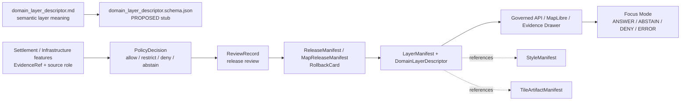

<!-- [KFM_META_BLOCK_V2]
doc_id: kfm://doc/contracts-domains-settlements-infrastructure-domain-layer-descriptor
title: Settlements / Infrastructure Domain Layer Descriptor Contract
type: semantic-contract
version: v0.2
status: draft; PROPOSED; schema-stub-confirmed; validator-missing; canonical-working-lane; slug-CONFLICTED-with-singular-settlement; NEEDS VERIFICATION before promotion
owners:
  - OWNER_TBD — Settlements/Infrastructure domain steward
  - OWNER_TBD — Settlements-side steward
  - OWNER_TBD — Infrastructure-side steward
  - OWNER_TBD — Map/UI steward
  - OWNER_TBD — Contracts steward
  - OWNER_TBD — Source steward
  - OWNER_TBD — Evidence steward
  - OWNER_TBD — Schema steward
  - OWNER_TBD — Policy steward
  - OWNER_TBD — Release steward
  - OWNER_TBD — Docs steward
created: NEEDS VERIFICATION — scaffold existed before v0.2 expansion
updated: 2026-06-23
policy_label: public; contracts; settlements-infrastructure; domain-layer-descriptor; layer-manifest-profile; map-ui; evidence-drawer; focus-mode; source-role-aware; temporal-scope-aware; evidence-bound; policy-aware; infrastructure-sensitive; reservation-community-sensitive; release-gated; rollback-aware; not-feature-truth; not-style-authority; not-tile-authority; not-renderer-authority; not-publication-authority
tags: [kfm, contracts, settlements-infrastructure, domain-layer-descriptor, LayerManifest, MapReleaseManifest, StyleManifest, TileArtifactManifest, EvidenceDrawerPayload, MapContextEnvelope, FocusMode, EvidenceBundle, PolicyDecision, ReviewRecord, ReleaseManifest, RollbackCard, Settlement, Municipality, CensusPlace, Townsite, GhostTown, Fort, Mission, ReservationCommunity, InfrastructureAsset, NetworkNode, NetworkSegment, Facility, ServiceArea, Operator, ConditionObservation, Dependency, MapLibre]
related:
  - ./README.md
  - ./domain_feature_identity.md
  - ../settlement/README.md
  - ../../../docs/domains/settlements-infrastructure/README.md
  - ../../../docs/domains/settlements-infrastructure/CANONICAL_PATHS.md
  - ../../../docs/domains/settlements-infrastructure/MAP_UI_CONTRACTS.md
  - ../../../docs/domains/settlements-infrastructure/sublanes/settlements.md
  - ../../../docs/domains/settlements-infrastructure/sublanes/infrastructure.md
  - ../../../schemas/contracts/v1/domains/settlements-infrastructure/domain_layer_descriptor.schema.json
  - ../../../schemas/contracts/v1/domains/settlements-infrastructure/README.md
  - ../../../policy/domains/settlements-infrastructure/README.md
  - ../../../fixtures/domains/settlements-infrastructure/domain_layer_descriptor/
  - ../../../tests/domains/settlements-infrastructure/
  - ../../../release/candidates/settlements-infrastructure/
notes:
  - "Expanded from a PROPOSED greenfield scaffold at contracts/domains/settlements-infrastructure/domain_layer_descriptor.md."
  - "The paired schema exists, but it is still a permissive PROPOSED stub requiring only id and allowing additional properties. Field enforcement remains NEEDS VERIFICATION."
  - "The schema names a validator path at tools/validators/domains/settlements-infrastructure/validate_domain_layer_descriptor.py; that validator was not found in this task. Validator behavior remains NEEDS VERIFICATION."
  - "This contract defines domain-specific meaning for Settlements/Infrastructure layer descriptors. It does not define MapLibre styling, tile build shape, renderer behavior, governed API routes, feature truth, graph truth, release approval, or public publication authority."
  - "Critical infrastructure detail, dependency chains, condition/vulnerability information, reservation-community context, archaeology-adjacent data, and living-person-adjacent joins must fail closed or be generalized/redacted unless evidence and policy allow release."
  - "The singular contracts/domains/settlement path remains a compatibility / variance surface, not a canonical replacement, unless an ADR resolves otherwise."
[/KFM_META_BLOCK_V2] -->

<a id="top"></a>

# Settlements / Infrastructure Domain Layer Descriptor

> Semantic contract for `domain_layer_descriptor`: the domain-specific descriptor that binds a Settlements/Infrastructure map layer to released or release-candidate evidence, object-family meaning, source role, sensitivity posture, temporal scope, policy decision, Evidence Drawer behavior, Focus Mode context, correction lineage, and rollback path — without becoming feature truth, style authority, tile authority, renderer authority, graph truth, or publication approval.

<p>
  
  
  
  
  
  
  
</p>

`contracts/domains/settlements-infrastructure/domain_layer_descriptor.md`

## Quick jumps

[Status](#status) · [Meaning](#meaning) · [Repo fit](#repo-fit) · [Schema posture](#schema-posture) · [Accepted uses](#accepted-uses) · [Exclusions](#exclusions) · [Recommended fields](#recommended-fields) · [Layer descriptor envelope](#layer-descriptor-envelope) · [Layer families](#layer-families) · [Trust states and finite outcomes](#trust-states-and-finite-outcomes) · [Sensitivity rules](#sensitivity-rules) · [Invariants](#invariants) · [Lifecycle](#lifecycle) · [Validation](#validation) · [Rollback](#rollback) · [Evidence basis](#evidence-basis) · [Open questions](#open-questions)

---

## Status

> [!IMPORTANT]
> **Status:** `draft` / semantic contract  
> **Owner:** `OWNER_TBD`  
> **Contract path:** `contracts/domains/settlements-infrastructure/domain_layer_descriptor.md`  
> **Schema path:** `schemas/contracts/v1/domains/settlements-infrastructure/domain_layer_descriptor.schema.json` — **confirmed as a stub in this task**  
> **Validator path named by schema:** `tools/validators/domains/settlements-infrastructure/validate_domain_layer_descriptor.py` — **not found in this task**  
> **Truth posture:** target path, prior scaffold, paired schema stub, contract-lane README, domain README, settlements/infrastructure object-family docs, and map/UI doctrine are confirmed from current repo evidence. Field-level meaning is expanded here as **PROPOSED semantic guidance**. Validator behavior, fixture coverage, policy behavior, release manifests, emitted proofs, governed API routes, public API behavior, map rendering, graph behavior, and runtime behavior remain **NEEDS VERIFICATION**.

> [!CAUTION]
> This contract defines layer descriptor meaning only. It does **not** prove a layer exists, publish a tile, define a MapLibre style, approve public exposure, certify graph correctness, authorize a governed API route, or allow the UI to read RAW, WORK, QUARANTINE, PROCESSED, canonical/internal stores, or direct model output.

---

## Meaning

`domain_layer_descriptor` records the semantic profile of a Settlements/Infrastructure layer after it has been selected for governed release consideration.

It may describe:

- the object families represented by a layer: settlements, municipalities, census places, townsites, ghost towns, forts, missions, reservation communities, infrastructure assets, networks, facilities, service areas, operators, condition observations, or dependencies;
- the layer's relationship to `LayerManifest`, `MapReleaseManifest`, `StyleManifest`, `TileArtifactManifest`, `EvidenceDrawerPayload`, `MapContextEnvelope`, `FocusModeRequest`, and `FocusModeResponse` records;
- which `EvidenceRef` or feature identifier resolves feature clicks into an Evidence Drawer payload and EvidenceBundle;
- which source-role, sensitivity, time, review, release, trust-state, and rollback obligations must be visible to governed API, map, Evidence Drawer, Focus Mode, exports, and AI summaries;
- what the UI may answer, abstain from, deny, or report as error when evidence, rights, sensitivity, policy, or release state is insufficient.

This contract owns the **domain-specific meaning** of a Settlements/Infrastructure layer descriptor. It does not own cross-cutting map schemas, style syntax, tile production, renderer behavior, public API routing, publication decisions, graph canonical truth, AI answers, or release manifests.

---

## Repo fit

| Responsibility | Path or root | Relationship |
|---|---|---|
| Parent contract lane | `./README.md` | Defines this folder as semantic contracts only. |
| Identity contract | `./domain_feature_identity.md` | Feature identity must remain source-role, family, time, evidence, and sensitivity aware. |
| Compatibility / variance path | `../settlement/README.md` | Singular `settlement` path is a warning surface, not canonical authority unless ADR resolves otherwise. |
| Domain doctrine | `../../../docs/domains/settlements-infrastructure/README.md` | Names domain object families, boundaries, and lifecycle posture. |
| Map/UI doctrine | `../../../docs/domains/settlements-infrastructure/MAP_UI_CONTRACTS.md` | Defines governed map/UI contract surface, finite outcomes, Evidence Drawer, Focus Mode, and sensitivity defaults. |
| Settlements-side families | `../../../docs/domains/settlements-infrastructure/sublanes/settlements.md` | Place/community object-family meaning and non-ownership rules. |
| Infrastructure-side families | `../../../docs/domains/settlements-infrastructure/sublanes/infrastructure.md` | Asset/network/facility/operator/condition/dependency meaning and strict sensitivity posture. |
| Paired schema stub | `../../../schemas/contracts/v1/domains/settlements-infrastructure/domain_layer_descriptor.schema.json` | Machine-shape placeholder; confirmed stub, not mature enforcement. |
| Cross-cutting map schemas | `../../../schemas/contracts/v1/map/`, `../../../schemas/contracts/v1/ui/`, `../../../schemas/contracts/v1/ai/` | Shape homes for manifests, drawer payloads, context envelopes, and AI receipts; not owned here. |
| Policy | `../../../policy/domains/settlements-infrastructure/` and sensitivity-policy roots | Allow/deny/restrict/abstain decisions. |
| Fixtures/tests | `../../../fixtures/domains/settlements-infrastructure/`, `../../../tests/domains/settlements-infrastructure/` | Behavior proof; not contract prose. |
| Release/rollback | `../../../release/candidates/settlements-infrastructure/` and release roots | Promotion, release, correction, rollback, and derivative invalidation. |

---

## Schema posture

A paired schema stub was found at:

```text
schemas/contracts/v1/domains/settlements-infrastructure/domain_layer_descriptor.schema.json
```

The stub currently:

- declares the title `domain_layer_descriptor`;
- points back to this contract document;
- names fixtures, validator, and policy roots;
- exposes `spec_hash`, `id`, and `version` properties;
- requires only `id`;
- leaves `additionalProperties` as `true`.

> [!WARNING]
> Because the schema is a placeholder stub and the named validator was not found in this task, every field below remains **PROPOSED** semantic guidance until schema, validator, fixtures, tests, policy checks, release checks, and runtime behavior are verified.

---

## Accepted uses

| Use | Allowed? | Rule |
|---|---:|---|
| Profiling a released or release-candidate Settlements/Infrastructure layer | Yes | Must bind layer identity to evidence, source role, sensitivity, policy, release, time, and rollback posture. |
| Connecting a layer to `LayerManifest` and `MapReleaseManifest` | Yes | Descriptor is domain-specific meaning; manifest objects remain separate. |
| Defining Evidence Drawer obligations | Yes | Must name the evidence resolution posture and expected EvidenceBundle behavior. |
| Carrying public geometry rules | Conditional | Must preserve redaction/generalization decisions and never imply raw or restricted precision. |
| Supporting Focus Mode | Conditional | Focus Mode may consume only released/governed context and EvidenceBundle refs. |
| Supporting derived graph or network displays | Conditional | Graph/network display is downstream and must not replace canonical evidence. |
| Rendering critical infrastructure, dependencies, condition/vulnerability, or operator-sensitive detail | Usually denied/restricted | Requires explicit PolicyDecision, review, redaction/generalization, and release support. |
| Publishing or proving settlement/infrastructure feature truth | No | Object-family contracts, EvidenceBundles, PolicyDecision, ReviewRecord, and ReleaseManifest remain separate. |

---

## Exclusions

| This descriptor does not own | Correct home |
|---|---|
| Semantic meaning of settlement/infrastructure objects | Object-family contracts under `contracts/domains/settlements-infrastructure/`. |
| JSON Schema shape | `schemas/contracts/v1/domains/settlements-infrastructure/domain_layer_descriptor.schema.json` and cross-cutting map/UI schemas. |
| MapLibre style syntax or style authority | Style manifests and renderer/style roots. |
| PMTiles/MVT/COG/tile artifact production | TileArtifactManifest and artifact production/release roots. |
| Source descriptors, cadence, rights, and source activation | Source registry and source-governance roots. |
| PolicyDecision, ReviewRecord, RedactionReceipt, AggregationReceipt, ReleaseManifest, RollbackCard | Their own governance/release/correction homes. |
| RAW, WORK, QUARANTINE, PROCESSED, or canonical/internal store access | Lifecycle roots behind governed APIs. |
| Emergency alerting, infrastructure safety, vulnerability disclosure, utility dependency exposure | Owning safety/policy/emergency/security lanes; KFM public UI must deny or abstain when unsupported. |
| AI answer authority | AI receipts and Focus Mode responses remain evidence-subordinate. |

---

## Recommended fields

The following fields are **PROPOSED** until the paired schema is made restrictive and validated.

| Field | Meaning |
|---|---|
| `id` | Canonical layer descriptor identifier. |
| `version` | Contract/object version. |
| `spec_hash` | Deterministic hash over normalized descriptor content. |
| `domain` | Expected value: `settlements-infrastructure` unless an ADR changes it. |
| `layer_key` | Stable domain-specific layer key. |
| `layer_title` | Human-readable layer title shown in governed UI. |
| `layer_family` | Settlement, municipality, census place, historic place, reservation community, infrastructure asset, network, facility, service area, operator, condition, dependency, aggregate, or mixed layer family. |
| `feature_families` | Object families included in the layer. |
| `feature_identity_ref` | Link to `DomainFeatureIdentity` contract/object family behavior. |
| `source_role_summary` | Source-role posture of features represented in the layer. |
| `evidence_ref_field` | Field that resolves to EvidenceRef/EvidenceBundle on click/query. |
| `policy_decision_ref` | PolicyDecision governing rendering/public exposure. |
| `review_ref` | ReviewRecord or steward review required before release. |
| `release_manifest_ref` | ReleaseManifest or MapReleaseManifest ref. |
| `rollback_ref` | RollbackCard or rollback target. |
| `public_geometry_rule` | Exact, generalized, aggregated, redacted, hidden, or denied geometry behavior. |
| `sensitivity_summary` | Sensitivity tier and public-safe caveat summary. |
| `time_window` | Temporal extent or default time filter. |
| `style_manifest_ref` | StyleManifest ref, if released. |
| `tile_artifact_manifest_ref` | TileArtifactManifest ref, if tiled. |
| `map_context_envelope_ref` | MapContextEnvelope behavior/profile ref. |
| `evidence_drawer_profile` | Fields and obligations needed for Evidence Drawer display. |
| `focus_mode_profile` | Focus Mode use profile and finite-outcome posture. |
| `finite_outcomes` | Allowed outcomes: `ANSWER`, `ABSTAIN`, `DENY`, `ERROR`. |
| `cache_invalidation_ref` | Cache invalidation receipt or release-side reference. |
| `limitations` | Caveats: descriptor only; not feature truth, not style/tile authority, not release approval. |

---

## Layer descriptor envelope

A reviewed layer descriptor should be an envelope around released or release-candidate domain features, not a substitute for them.

```text
layer_descriptor = {
  domain,
  layer_key,
  feature_families,
  evidence_resolution,
  source_role_summary,
  sensitivity_summary,
  policy_decision_ref,
  review_ref,
  release_manifest_ref,
  rollback_ref,
  public_geometry_rule,
  finite_outcomes
}
```

The exact serialized shape is **NEEDS VERIFICATION** until the schema and validator are field-complete.

---

## Layer families

| Layer family | Meaning | Guardrail |
|---|---|---|
| `settlement_place_layer` | Settlement, municipality, census place, townsite, ghost town, fort, mission, or reservation-community features. | Keep legal, census, historic, and cultural identities distinct. |
| `public_settlement_context_layer` | Public-safe settlement context for maps and Focus Mode. | Must not expose living-person joins, parcel/title joins, archaeology-adjacent coordinates, or unsupported status. |
| `reservation_community_layer` | Reservation-community context. | Requires sovereignty/cultural/living-person sensitivity review; default restrict/generalize. |
| `infrastructure_asset_layer` | Infrastructure assets and facilities. | Critical-asset details, condition, vulnerability, and dependency data default restrict/deny. |
| `service_area_layer` | Service areas or served footprints. | Generalize where dependency, utility, security, or privacy risk exists. |
| `operator_layer` | Operator or agency role context. | Operator role is not legal entity truth or vulnerability disclosure. |
| `condition_observation_layer` | Condition, inspection, or status observations. | Not safety advice, emergency alerting, or vulnerability release. |
| `dependency_layer` | Infrastructure dependency relationships. | High-sensitivity by default; public rendering usually denied or heavily generalized. |
| `aggregate_public_layer` | Aggregated counts or generalized domain summaries. | Must cite aggregation/generalization receipts and avoid re-identification. |
| `review_only_layer` | Internal/review layer not public. | Must not be exposed through public clients. |

---

## Trust states and finite outcomes

Layer descriptors should preserve finite-outcome behavior for governed UI and AI surfaces.

| State | UI/AI posture | Required behavior |
|---|---|---|
| `released_public` | Display / answer with citations | EvidenceBundle, PolicyDecision, ReleaseManifest, and rollback target must resolve. |
| `released_generalized` | Display generalized geometry and caveats | Redaction/generalization/aggregation receipt should be visible. |
| `restricted_review` | Hide public detail / route to review | Public clients must not expose restricted feature detail. |
| `candidate_unreleased` | No public display | UI must deny or abstain; internal review only. |
| `policy_denied` | DENY | Explain policy posture without leaking restricted detail. |
| `insufficient_evidence` | ABSTAIN | Cite missing evidence or unresolved EvidenceBundle. |
| `error_state` | ERROR | Report failure without inventing feature truth. |

---

## Sensitivity rules

| Domain surface | Default public posture | Reason |
|---|---|---|
| Incorporated municipalities and census places | Usually public if source/release supports | Public administrative/statistical source posture is common, but vintage and source role still matter. |
| Historic townsites, ghost towns, forts, missions | Generalized or review where archaeology/cultural/private-land adjacency exists | Avoid sensitive-location and cultural-site exposure. |
| Reservation communities | Review / generalized by default | Sovereignty, cultural sensitivity, and living-person adjacency may be material. |
| Critical infrastructure assets | Restricted or denied by default | Exact asset detail can create security risk. |
| Condition observations and vulnerabilities | Denied/restricted by default | Inspection, condition, and vulnerability detail can be sensitive. |
| Dependencies and service-area fragility | Denied/restricted or generalized | Dependency chains can reveal critical exposure. |
| Aggregated public summaries | Conditional | Must avoid re-identification and cite receipts. |

---

## Invariants

1. **Layer descriptor is not feature truth.** It describes how a layer may represent features; it does not prove the features.
2. **Release state is mandatory.** Public display requires released artifacts and rollback targets.
3. **Evidence resolves before claims.** Feature clicks and Focus Mode answers must resolve EvidenceRef/EvidenceBundle or abstain/deny.
4. **Policy is separate.** Layer descriptors cite PolicyDecision; they do not decide policy.
5. **Sensitivity travels with the layer.** Public geometry and visible attributes must respect the most restrictive relevant feature/source/policy posture.
6. **No RAW/WORK/QUARANTINE public path.** Public UI must use governed APIs and released artifacts only.
7. **Graph and tiles are downstream.** Graph projections, tiles, and styles are delivery surfaces, not sovereign truth.
8. **AI is evidence-subordinate.** Focus Mode can explain only what released evidence and policy permit.
9. **Singular `settlement` remains conflicted.** Do not route canonical layer descriptors through the singular compatibility path without ADR.

---

## Lifecycle



Contracts describe meaning. They do not move data, validate schema shape, render maps, build tiles, create styles, release artifacts, or authorize AI answers.

---

## Validation

Before this contract is treated as mature, maintainers should verify:

- [ ] paired schema becomes restrictive enough to enforce layer descriptor fields beyond `id`;
- [ ] validator exists at `tools/validators/domains/settlements-infrastructure/validate_domain_layer_descriptor.py` and matches schema/contract intent;
- [ ] fixtures cover settlement-place layers, reservation-community layers, infrastructure-asset layers, service-area layers, operator layers, condition-observation layers, dependency layers, aggregate layers, review-only layers, and denied layers;
- [ ] tests prevent layer descriptors from becoming feature truth, style authority, tile authority, policy decision, release manifest, graph truth, or public API route;
- [ ] tests prevent public UI from reading RAW, WORK, QUARANTINE, PROCESSED, canonical/internal stores, or direct model output;
- [ ] tests enforce fail-closed behavior for critical infrastructure, dependency, condition/vulnerability, reservation-community, archaeology-adjacent, parcel/title, and living-person-adjacent surfaces;
- [ ] map/Evidence Drawer/Focus Mode payloads resolve EvidenceBundle or return finite outcomes;
- [ ] rollback invalidates tiles, style refs, layer descriptors, cache entries, graph projections, Focus Mode states, exports, and AI summaries that cited the withdrawn layer.

---

## Rollback

Rollback is required if this contract:

- claims schema, validator, fixture, policy, release, API, map, graph, tile, style, Focus Mode, or runtime behavior exists without proof;
- treats layer descriptors as feature truth, policy approval, release approval, graph truth, style authority, tile authority, or public API implementation;
- permits public UI to bypass governed APIs and released artifacts;
- exposes restricted infrastructure, dependencies, condition/vulnerability, reservation-community, archaeology-adjacent, parcel/title, or living-person information through examples or public wording;
- treats the singular `settlement` path as canonical authority without ADR support.

Rollback target: revert `contracts/domains/settlements-infrastructure/domain_layer_descriptor.md` to prior scaffold blob `5b5dd38669be4e4ba017a3d7ce81545170385638`, record drift if authority boundaries were affected, and invalidate downstream derivatives that relied on weakened layer-descriptor semantics.

---

## Evidence basis

| Evidence | Status | Supports | Limits |
|---|---|---|---|
| Prior `contracts/domains/settlements-infrastructure/domain_layer_descriptor.md` | `CONFIRMED` | Target file existed as a PROPOSED scaffold. | Scaffold did not define authoritative semantic contract content. |
| `schemas/contracts/v1/domains/settlements-infrastructure/domain_layer_descriptor.schema.json` | `CONFIRMED stub / PROPOSED field realization` | Paired schema exists with `id`, `version`, `spec_hash`, `id` required, `additionalProperties: true`, fixture root, validator path, and policy path metadata. | Does not prove field-complete schema, validator implementation, fixtures, tests, policy, runtime, or release maturity. |
| `contracts/domains/settlements-infrastructure/README.md` | `CONFIRMED contract-lane rule` | Defines contracts as semantic meaning only and separates schemas, policy, fixtures, tests, data, release, public API, graph, and runtime behavior. | Does not define this object’s full field shape. |
| `contracts/domains/settlements-infrastructure/domain_feature_identity.md` | `CONFIRMED sibling contract` | Defines identity-envelope posture and source-role/family/time/evidence/sensitivity boundaries. | Identity-specific; adapted only where relevant. |
| `docs/domains/settlements-infrastructure/README.md` | `CONFIRMED doctrine / PROPOSED implementation` | Names sixteen object families and identity/lifecycle posture. | Does not prove layer descriptor runtime behavior. |
| `docs/domains/settlements-infrastructure/MAP_UI_CONTRACTS.md` | `CONFIRMED doctrine / PROPOSED implementation` | Defines map/UI contract surface, finite outcomes, Evidence Drawer, Focus Mode, LayerManifest/MapReleaseManifest posture, and critical-infrastructure sensitivity. | Document itself notes repo state and paths need verification. |
| `docs/domains/settlements-infrastructure/sublanes/settlements.md` | `CONFIRMED doctrine / PROPOSED sublane application` | Defines settlement-side object families and cross-lane non-ownership. | Sublane structure and field realization remain partly PROPOSED. |
| `docs/domains/settlements-infrastructure/sublanes/infrastructure.md` | `CONFIRMED doctrine / PROPOSED field realization` | Defines infrastructure-side object families and strict sensitivity posture for critical infrastructure, condition, vulnerability, and dependencies. | Does not prove contract/schema/test implementation. |
| `contracts/domains/roads-rail-trade/domain_layer_descriptor.md` | `CONFIRMED sibling pattern` | Provides a mature domain-layer-descriptor contract pattern using schema-stub/validator-missing posture, map/UI boundaries, finite outcomes, validation, and rollback. | Roads/Rail-specific; adapted only as a documentation pattern. |
| Uploaded KFM authoring prompt v2 | `CONFIRMED user-supplied guidance` | Requires evidence-first, implementation-honest, visually polished Markdown with no hidden uncertainty and rollback posture. | Authoring guidance, not implementation proof. |

---

## Open questions

| ID | Question | Status |
|---|---|---|
| OQ-SI-DLD-01 | Which namespace and ID format should Settlements/Infrastructure layer descriptors use? | OPEN / ADR NEEDED |
| OQ-SI-DLD-02 | Which fields are required to bind a layer to EvidenceBundle, PolicyDecision, ReviewRecord, ReleaseManifest, StyleManifest, TileArtifactManifest, and RollbackCard? | OPEN / SCHEMA REVIEW |
| OQ-SI-DLD-03 | How should public geometry rules differ across settlement-place, reservation-community, infrastructure-asset, condition-observation, service-area, and dependency layers? | OPEN / POLICY REVIEW |
| OQ-SI-DLD-04 | Which map/UI finite outcomes should be encoded directly in the descriptor versus inherited from cross-cutting Map/UI contracts? | OPEN / MAP/UI REVIEW |
| OQ-SI-DLD-05 | How should singular `settlement` compatibility references migrate without breaking existing layer references? | OPEN / ADR + MIGRATION REVIEW |
| OQ-SI-DLD-06 | How should rollback invalidate tile artifacts, style refs, graph projections, Focus Mode states, public API caches, exports, and AI summaries that cited a withdrawn layer? | OPEN / RELEASE REVIEW |

<p align="right"><a href="#top">Back to top</a></p>
