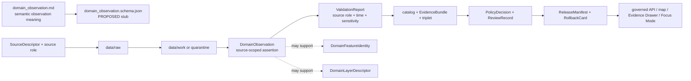

<!-- [KFM_META_BLOCK_V2]
doc_id: kfm://doc/contracts-domains-settlements-infrastructure-domain-observation
title: Settlements / Infrastructure Domain Observation Contract
type: semantic-contract
version: v0.2
status: draft; PROPOSED; schema-stub-confirmed; validator-missing; canonical-working-lane; slug-CONFLICTED-with-singular-settlement; NEEDS VERIFICATION before promotion
owners:
  - OWNER_TBD — Settlements/Infrastructure domain steward
  - OWNER_TBD — Settlements-side observation steward
  - OWNER_TBD — Infrastructure-side observation steward
  - OWNER_TBD — Contracts steward
  - OWNER_TBD — Source steward
  - OWNER_TBD — Evidence steward
  - OWNER_TBD — Schema steward
  - OWNER_TBD — Policy steward
  - OWNER_TBD — Release steward
  - OWNER_TBD — Docs steward
created: NEEDS VERIFICATION — scaffold existed before v0.2 expansion
updated: 2026-06-23
policy_label: public; contracts; settlements-infrastructure; domain-observation; source-scoped-observation; assertion-bound; source-role-aware; temporal-scope-aware; evidence-bound; sensitivity-aware; infrastructure-sensitive; condition-observation-aware; dependency-sensitive; reservation-community-sensitive; review-gated; release-gated; rollback-aware; not-feature-identity; not-source-truth; not-condition-truth-by-itself; not-policy-decision; not-publication-authority
tags: [kfm, contracts, settlements-infrastructure, domain-observation, observation, assertion, source-role, temporal-scope, settlement, municipality, census-place, townsite, ghost-town, fort, mission, reservation-community, infrastructure-asset, network-node, network-segment, facility, service-area, operator, condition-observation, dependency, domain-feature-identity, domain-layer-descriptor, SourceDescriptor, EvidenceRef, EvidenceBundle, ValidationReport, PolicyDecision, ReviewRecord, ReleaseManifest, RollbackCard]
related:
  - ./README.md
  - ./domain_feature_identity.md
  - ./domain_layer_descriptor.md
  - ../settlement/README.md
  - ../../../docs/domains/settlements-infrastructure/README.md
  - ../../../docs/domains/settlements-infrastructure/CANONICAL_PATHS.md
  - ../../../docs/domains/settlements-infrastructure/MAP_UI_CONTRACTS.md
  - ../../../docs/domains/settlements-infrastructure/sublanes/settlements.md
  - ../../../docs/domains/settlements-infrastructure/sublanes/infrastructure.md
  - ../../../schemas/contracts/v1/domains/settlements-infrastructure/domain_observation.schema.json
  - ../../../schemas/contracts/v1/domains/settlements-infrastructure/README.md
  - ../../../policy/domains/settlements-infrastructure/README.md
  - ../../../fixtures/domains/settlements-infrastructure/domain_observation/
  - ../../../tests/domains/settlements-infrastructure/
  - ../../../release/candidates/settlements-infrastructure/
notes:
  - "Expanded from a PROPOSED greenfield scaffold at contracts/domains/settlements-infrastructure/domain_observation.md."
  - "The paired schema exists, but it is still a permissive PROPOSED stub requiring only id and allowing additional properties. Field enforcement remains NEEDS VERIFICATION."
  - "The schema names a validator path at tools/validators/domains/settlements-infrastructure/validate_domain_observation.py; that validator was not found in this task. Validator behavior remains NEEDS VERIFICATION."
  - "This contract defines source-scoped observation meaning for Settlements/Infrastructure. It is not feature identity, source truth, condition truth, policy decision, release manifest, public API, graph output, map layer, or AI answer."
  - "Critical infrastructure detail, condition/vulnerability observations, dependency observations, operator-sensitive observations, reservation-community context, archaeology-adjacent data, and living-person-adjacent joins must fail closed or be generalized/redacted unless evidence and policy allow release."
  - "The singular contracts/domains/settlement path remains a compatibility / variance surface, not a canonical replacement, unless an ADR resolves otherwise."
[/KFM_META_BLOCK_V2] -->

<a id="top"></a>

# Settlements / Infrastructure Domain Observation

> Semantic contract for `domain_observation`: the source-scoped observation or assertion record that says a Settlements/Infrastructure source observed, recorded, asserted, inferred, modeled, inspected, enumerated, mapped, or reported something about a settlement, municipality, census place, townsite, ghost town, fort, mission, reservation community, infrastructure asset, network, facility, service area, operator, condition, or dependency — without becoming feature identity, source truth, condition truth, vulnerability disclosure, map truth, AI truth, or publication approval.

<p>
  
  
  
  
  
  
  
  
</p>

`contracts/domains/settlements-infrastructure/domain_observation.md`

## Quick jumps

[Status](#status) · [Meaning](#meaning) · [Repo fit](#repo-fit) · [Schema posture](#schema-posture) · [Accepted uses](#accepted-uses) · [Exclusions](#exclusions) · [Recommended fields](#recommended-fields) · [Observation envelope](#observation-envelope) · [Observation families](#observation-families) · [Source-role and time rules](#source-role-and-time-rules) · [Sensitivity rules](#sensitivity-rules) · [Invariants](#invariants) · [Lifecycle](#lifecycle) · [Validation](#validation) · [Rollback](#rollback) · [Evidence basis](#evidence-basis) · [Open questions](#open-questions)

---

## Status

> [!IMPORTANT]
> **Status:** `draft` / semantic contract  
> **Owner:** `OWNER_TBD`  
> **Contract path:** `contracts/domains/settlements-infrastructure/domain_observation.md`  
> **Schema path:** `schemas/contracts/v1/domains/settlements-infrastructure/domain_observation.schema.json` — **confirmed as a stub in this task**  
> **Validator path named by schema:** `tools/validators/domains/settlements-infrastructure/validate_domain_observation.py` — **not found in this task**  
> **Truth posture:** target path, prior scaffold, paired schema stub, contract-lane README, sibling identity/layer contracts, domain README, settlement/infrastructure object-family docs, and map/UI doctrine are confirmed from current repo evidence. Field-level meaning is expanded here as **PROPOSED semantic guidance**. Validator behavior, fixture coverage, policy behavior, source registry behavior, release manifests, emitted proofs, governed API routes, public API behavior, graph behavior, map rendering, and runtime behavior remain **NEEDS VERIFICATION**.

> [!CAUTION]
> This contract defines observation meaning only. It does **not** prove the observation is correct, merge identities, certify geometry, decide municipal/legal status, publish infrastructure condition, expose dependency chains, approve public release, validate a graph projection, authorize a live feed, or allow the UI/AI layer to bypass EvidenceBundle, policy, review, release, or rollback gates.

---

## Meaning

`domain_observation` records a source-scoped observation or assertion in the Settlements/Infrastructure lane.

It may represent that a source:

- observed, reported, enumerated, digitized, modeled, inspected, mapped, or asserted a settlement-place, community, boundary, status, infrastructure asset, network node, network segment, facility, service area, operator, condition observation, dependency, or public-safe derivative;
- contributed evidence toward a `domain_feature_identity` record without becoming that identity;
- produced a time-bound assertion such as a census enumeration, municipal status note, plat reference, gazetteer entry, facility inventory row, operator listing, inspection note, condition reading, service-area boundary, dependency note, candidate connector output, or map-label assertion;
- supplied context for EvidenceBundle construction, catalog/triplet projection, release-candidate layer, Evidence Drawer payload, Focus Mode answer, or public-safe aggregate;
- required quarantine, redaction, generalization, steward review, policy denial, or abstention before public exposure.

This contract owns the **meaning of the observation record**: who or what source made the assertion, what was asserted, under what source role, at what time, with what method, evidence, uncertainty, sensitivity, policy posture, review state, and rollback path. It does not own feature identity, object-specific semantics, source authority, legal truth, infrastructure truth, condition truth, dependency truth, graph truth, release approval, UI rendering, or AI narrative.

---

## Repo fit

| Responsibility | Path or root | Relationship |
|---|---|---|
| Parent contract lane | `./README.md` | Defines this folder as semantic contracts only. |
| Feature identity companion | `./domain_feature_identity.md` | Identity envelope; observations may support identity but must not replace it. |
| Layer descriptor companion | `./domain_layer_descriptor.md` | Public/release-candidate layer meaning; observations feed evidence, not display authority. |
| Compatibility / variance path | `../settlement/README.md` | Singular `settlement` path is a warning surface, not canonical authority unless ADR resolves otherwise. |
| Domain doctrine | `../../../docs/domains/settlements-infrastructure/README.md` | Names object families, source-role posture, lifecycle, and responsibility-root split. |
| Map/UI doctrine | `../../../docs/domains/settlements-infrastructure/MAP_UI_CONTRACTS.md` | Defines governed map/UI surfaces, finite outcomes, Evidence Drawer, Focus Mode, and sensitivity defaults. |
| Settlements-side families | `../../../docs/domains/settlements-infrastructure/sublanes/settlements.md` | Place/community observations and non-ownership rules. |
| Infrastructure-side families | `../../../docs/domains/settlements-infrastructure/sublanes/infrastructure.md` | Asset/network/facility/operator/condition/dependency observations and strict sensitivity posture. |
| Paired schema stub | `../../../schemas/contracts/v1/domains/settlements-infrastructure/domain_observation.schema.json` | Machine-shape placeholder; confirmed stub, not mature enforcement. |
| Policy | `../../../policy/domains/settlements-infrastructure/` and sensitivity-policy roots | Allow/deny/restrict/abstain decisions. |
| Fixtures/tests | `../../../fixtures/domains/settlements-infrastructure/`, `../../../tests/domains/settlements-infrastructure/` | Behavior proof; not contract prose. |
| Release/rollback | `../../../release/candidates/settlements-infrastructure/` and release roots | Promotion, release, correction, rollback, and derivative invalidation. |

---

## Schema posture

A paired schema stub was found at:

```text
schemas/contracts/v1/domains/settlements-infrastructure/domain_observation.schema.json
```

The stub currently:

- declares the title `domain_observation`;
- points back to this contract document;
- names fixtures, validator, and policy roots;
- exposes `spec_hash`, `id`, and `version` properties;
- requires only `id`;
- leaves `additionalProperties` as `true`.

> [!WARNING]
> Because the schema is a placeholder stub and the named validator was not found in this task, every field below remains **PROPOSED** semantic guidance until schema, validator, fixtures, tests, policy checks, release checks, and runtime behavior are verified.

---

## Accepted uses

| Use | Allowed? | Rule |
|---|---:|---|
| Capturing a source-scoped settlement or infrastructure observation/assertion | Yes | Must preserve source, source role, asserted content, time, method, evidence, and limitations. |
| Supporting feature identity | Yes | Observation may support `domain_feature_identity`, but cannot replace deterministic identity logic. |
| Supporting EvidenceBundle construction | Yes | Observation should carry EvidenceRef/EvidenceBundle refs and provenance. |
| Supporting condition observation or dependency records | Conditional | DomainObservation may support those objects; it must not expose restricted condition/vulnerability/dependency detail by itself. |
| Recording candidate/model/OCR/map-label assertions | Conditional | Must remain candidate/modeled/context until reviewed; no public authority by display tone. |
| Supporting release-candidate layers | Conditional | Requires layer descriptor, policy, review, release, and rollback refs. |
| Supporting public map or Focus Mode display | Conditional | Requires PolicyDecision, ReviewRecord, ReleaseManifest, EvidenceBundle resolution, correction path, and RollbackCard. |
| Proving legal municipal status, active facility status, operator authority, infrastructure condition, vulnerability, dependency, or public access | No | Requires object-specific evidence, policy, review, and release support; default to abstain/deny when insufficient. |

---

## Exclusions

`domain_observation` must not be used as:

| Misuse | Required outcome |
|---|---|
| Feature identity | Use `domain_feature_identity`; observation may support identity but is not identity. |
| Source truth | Cite source role, EvidenceBundle, and review; observation is an assertion record. |
| Object-family payload | Use object-family contracts/schemas for Settlement, Municipality, InfrastructureAsset, Facility, Operator, ConditionObservation, Dependency, etc. |
| Municipal/legal status proof | Use authoritative legal/admin evidence, valid-time discipline, policy, review, and release gates. |
| Critical-infrastructure disclosure | Deny, restrict, redact, or generalize unless policy/review explicitly allows public release. |
| Condition/vulnerability truth | Use ConditionObservation semantics and policy gates; do not expose sensitive status through observation wording. |
| Dependency-chain truth | Use Dependency semantics and fail-closed policy; do not publish dependency chains through observation examples. |
| Living-person, parcel/title, residence, DNA, or ownership claim | Use People/DNA/Land lanes and fail-closed policies. |
| Archaeological/cultural-site claim | Use Archaeology/Cultural Heritage lanes and steward review. |
| Layer or public map authority | Use `domain_layer_descriptor` plus released artifacts and governed APIs. |
| AI answer authority | Focus Mode output remains evidence-subordinate and finite-outcome constrained. |

---

## Recommended fields

The following fields are **PROPOSED** until the paired schema is made restrictive and validated.

| Field | Meaning |
|---|---|
| `id` | Canonical observation identifier. |
| `version` | Contract/object version. |
| `spec_hash` | Deterministic hash over normalized observation content. |
| `domain` | Expected value: `settlements-infrastructure` unless an ADR changes it. |
| `observation_type` | Enumeration, gazetteer entry, legal/admin assertion, historic note, facility inventory, inspection note, condition reading, operator listing, service-area assertion, dependency assertion, map label, OCR/model candidate, aggregate, or source-specific type. |
| `object_family` | Settlement, Municipality, CensusPlace, Townsite, GhostTown, Fort, Mission, ReservationCommunity, InfrastructureAsset, NetworkNode, NetworkSegment, Facility, ServiceArea, Operator, ConditionObservation, or Dependency. |
| `observed_subject_ref` | Ref to the feature, candidate, source-native record, identity envelope, or object-family record being observed. |
| `source_ref` | SourceDescriptor/source registry reference. |
| `source_role` | Source role preserved from admission through publication. |
| `source_native_id` | Source-native record/feature/inspection/facility/operator/place key where available. |
| `observation_statement` | Human-readable assertion made by the source or derived process. |
| `method` | Survey, census, legal filing, inventory, inspection, map digitization, OCR, model inference, connector, steward review, or source-specific method. |
| `evidence_refs` | EvidenceRefs or EvidenceBundle refs supporting the observation. |
| `confidence_label` | Candidate, context, corroborating, primary, contested, unknown, or project-approved enum once schema defines it. |
| `uncertainty_statement` | Caveat about positional, temporal, source-role, method, or interpretation uncertainty. |
| `observed_time` | Time the observation was made or represented. |
| `source_time` | Time the source was created, published, updated, inspected, enumerated, or filed. |
| `valid_time` | Time interval the observation is asserted to apply to. |
| `retrieval_time` | KFM retrieval/freeze time. |
| `review_time` | Review or steward evaluation time, if applicable. |
| `release_time` | KFM governed release time, if released. |
| `feature_identity_ref` | DomainFeatureIdentity ref, if observation supports an identity envelope. |
| `layer_descriptor_ref` | DomainLayerDescriptor ref, if observation supports a layer. |
| `policy_decision_ref` | PolicyDecision governing use or publication. |
| `review_ref` | ReviewRecord or steward review ref. |
| `release_manifest_ref` | ReleaseManifest for public/semi-public exposure. |
| `rollback_ref` | RollbackCard or rollback target. |
| `sensitivity_label` | Sensitivity/policy tier inherited from source, subject, location, method, condition, dependency, operator, or community context. |
| `limitations` | Caveats: observation only; not identity, not proof, not policy, not release, not map truth, not AI authority. |

---

## Observation envelope

A reviewed observation should bind the assertion to source role, time, evidence, sensitivity, and downstream governance.

```text
observation_envelope = {
  domain,
  observation_type,
  object_family,
  source_ref,
  source_role,
  observed_subject_ref,
  observation_statement,
  method,
  observed_time,
  source_time,
  valid_time,
  evidence_refs,
  sensitivity_label,
  policy_decision_ref,
  review_ref,
  release_manifest_ref,
  rollback_ref
}
```

The exact serialized shape is **NEEDS VERIFICATION** until the schema and validator are field-complete.

---

## Observation families

| Observation family | Meaning | Guardrail |
|---|---|---|
| `place_identity_observation` | Source observes a settlement, municipality, census place, townsite, ghost town, fort, mission, or reservation community. | Do not collapse legal, census, historic, and cultural identities. |
| `boundary_or_status_observation` | Source asserts place boundary, status, incorporation, census vintage, plat status, or historical status. | Must preserve source and valid time; not legal proof by itself. |
| `historic_place_observation` | Source records historical townsite, ghost town, fort, mission, or cultural/community context. | Generalize or review where archaeology/cultural/private-land adjacency exists. |
| `reservation_community_observation` | Source records reservation-community or sovereignty/cultural context. | Review/restrict by default; avoid living-person and cultural leakage. |
| `asset_inventory_observation` | Source records infrastructure asset or facility inventory. | Exact critical-asset detail may be restricted or denied. |
| `network_observation` | Source records network node/segment/service-area relation. | Network topology and dependency exposure may be sensitive. |
| `operator_observation` | Source records operator or agency relation. | Operator role is not legal entity truth or vulnerability disclosure. |
| `condition_observation_support` | Source records inspection/status/condition support. | Not safety advice or public vulnerability release. |
| `dependency_observation_support` | Source records reliance/dependency relation. | High-sensitivity by default; public rendering usually denied or generalized. |
| `candidate_model_observation` | OCR, model, connector, map label, or generated process proposes an observation. | Candidate until reviewed; no public truth by tone. |
| `released_public_observation` | Observation appears in a governed public/released surface. | Requires EvidenceBundle, PolicyDecision, ReviewRecord, ReleaseManifest, and RollbackCard. |

---

## Source-role and time rules

Observation records must carry source role and time as core meaning.

| Rule | Requirement |
|---|---|
| Source role is fixed at admission | Promotion never turns a map label, OCR hit, inventory row, inspection note, model output, or administrative aggregate into stronger authority without review. |
| Observation time is not valid time | Observed time, source time, valid time, retrieval time, review time, release time, and correction time remain separate. |
| Candidate evidence stays candidate | Connector/model/OCR/map-label observations remain candidate/context until evidence and review promote them. |
| Observation is distinct from identity | It may support DomainFeatureIdentity but cannot become identity by itself. |
| Observation is distinct from release | Public release requires policy/review/release objects, not just a clean observation. |
| Cross-lane evidence stays cited | Transport, hydrology, hazards, people/land, archaeology/cultural heritage, and legal/source evidence are cited through governed refs, not absorbed. |

---

## Sensitivity rules

| Surface | Default posture | Reason |
|---|---|---|
| Public census/municipal/gazetteer observation | Usually public if source/release supports | Still needs source role, vintage, EvidenceBundle, and release state. |
| Historic townsite, fort, mission, or ghost-town observation | Generalized or review where sensitive | Archaeology/cultural/private-land adjacency may be material. |
| Reservation-community observation | Review / generalized by default | Sovereignty, cultural sensitivity, and living-person adjacency may apply. |
| Infrastructure asset or facility inventory observation | Restricted or denied by default when critical | Exact assets can create security risk. |
| Condition/inspection/vulnerability observation | Denied/restricted by default | Can expose weakness or unsafe public inference. |
| Dependency observation | Denied/restricted or generalized | Dependency chains reveal fragility. |
| Candidate/model/OCR observation | Review only | Generation or extraction does not close evidence. |

---

## Invariants

1. **Observation is assertion, not proof.** It records what a source or process asserted; truth requires evidence, review, and source-role handling.
2. **Observation is not identity.** It may support a feature identity but cannot replace deterministic identity logic.
3. **Observation is not payload.** Object-family records own object-specific meaning and shape.
4. **Observation is not release.** Public use requires PolicyDecision, ReviewRecord, ReleaseManifest, correction path, and rollback target.
5. **Source role is preserved.** Primary, corroborating, context, candidate, aggregate, administrative, model, OCR, and synthetic observations do not collapse.
6. **Time axes stay separate.** Observed, source, valid, retrieval, review, release, correction, and supersession times remain distinct where material.
7. **Sensitivity travels with the observation.** Critical infrastructure, dependency, condition/vulnerability, reservation-community, cultural, archaeology-adjacent, living-person-adjacent, and parcel/title-adjacent observations fail closed unless policy allows release.
8. **Graph, map, and AI remain downstream.** They may cite observations but cannot replace them.
9. **Singular `settlement` remains conflicted.** Do not route canonical observations through the singular compatibility path without ADR.

---

## Lifecycle



Contracts describe meaning. They do not move data, enforce schema shape, execute source ingestion, decide policy, emit release artifacts, render maps, or authorize AI answers.

---

## Validation

Before this contract is treated as mature, maintainers should verify:

- [ ] paired schema becomes restrictive enough to enforce observation fields beyond `id`;
- [ ] validator exists at `tools/validators/domains/settlements-infrastructure/validate_domain_observation.py` and matches schema/contract intent;
- [ ] fixtures cover all sixteen domain object families;
- [ ] fixtures cover source-role distinctions: primary, corroborating, context, candidate, aggregate, administrative, OCR/model, and synthetic;
- [ ] fixtures cover time-axis distinctions: observed, source, valid, retrieval, review, release, correction, supersession;
- [ ] tests prevent observation records from becoming feature identity, feature payload, condition truth, dependency truth, legal proof, policy decision, release manifest, map truth, graph truth, or AI authority;
- [ ] tests enforce fail-closed handling for critical infrastructure, dependency, condition/vulnerability, reservation-community, archaeology-adjacent, parcel/title, and living-person-adjacent observations;
- [ ] public DTOs and map/Focus Mode payloads resolve EvidenceBundle or return finite outcomes;
- [ ] rollback invalidates downstream maps, graph projections, layer descriptors, exports, Focus Mode states, caches, and AI summaries that cited the withdrawn observation.

---

## Rollback

Rollback is required if this contract:

- claims schema, validator, fixture, policy, release, API, graph, map, or runtime behavior exists without proof;
- treats observation as identity, payload, source truth, condition truth, dependency truth, policy decision, release approval, public map truth, or AI authority;
- exposes restricted infrastructure, condition/vulnerability, dependency, operator-sensitive, reservation-community, archaeology-adjacent, parcel/title, or living-person information through examples or public wording;
- normalizes direct UI access to RAW, WORK, QUARANTINE, PROCESSED, canonical/internal stores, or direct model output;
- treats the singular `settlement` path as canonical authority without ADR support.

Rollback target: revert `contracts/domains/settlements-infrastructure/domain_observation.md` to prior scaffold blob `1d3f69c814d4ba21dd5e1fd511e75a20a27c784b`, record drift if authority boundaries were affected, and invalidate downstream derivatives that relied on weakened observation semantics.

---

## Evidence basis

| Evidence | Status | Supports | Limits |
|---|---|---|---|
| Prior `contracts/domains/settlements-infrastructure/domain_observation.md` | `CONFIRMED` | Target file existed as a PROPOSED scaffold. | Scaffold did not define authoritative semantic contract content. |
| `schemas/contracts/v1/domains/settlements-infrastructure/domain_observation.schema.json` | `CONFIRMED stub / PROPOSED field realization` | Paired schema exists with `id`, `version`, `spec_hash`, `id` required, `additionalProperties: true`, fixture root, validator path, and policy path metadata. | Does not prove field-complete schema, validator implementation, fixtures, tests, policy, runtime, or release maturity. |
| `contracts/domains/settlements-infrastructure/domain_feature_identity.md` | `CONFIRMED sibling contract` | Defines identity-envelope posture and states observations may support, but not replace, identity. | Identity-specific; not a full observation schema. |
| `contracts/domains/settlements-infrastructure/domain_layer_descriptor.md` | `CONFIRMED sibling contract` | Defines layer descriptor posture and public-map/Focus Mode downstream boundaries. | Layer-specific; not a full observation schema. |
| `docs/domains/settlements-infrastructure/README.md` | `CONFIRMED doctrine / PROPOSED implementation` | Names sixteen object families, responsibility-root split, identity basis, lifecycle, and sensitivity defaults. | Does not prove observation runtime behavior. |
| `docs/domains/settlements-infrastructure/sublanes/settlements.md` | `CONFIRMED doctrine / PROPOSED sublane application` | Defines settlement-side object families and cross-lane non-ownership. | Sublane structure and field realization remain partly PROPOSED. |
| `docs/domains/settlements-infrastructure/sublanes/infrastructure.md` | `CONFIRMED doctrine / PROPOSED field realization` | Defines infrastructure-side object families and strict sensitivity posture for critical infrastructure, condition, vulnerability, and dependencies. | Does not prove contract/schema/test implementation. |
| `contracts/domains/roads-rail-trade/domain_observation.md` | `CONFIRMED sibling pattern` | Provides a mature domain-observation contract pattern using schema-stub/validator-missing posture, observation envelope, invariants, validation, and rollback. | Roads/Rail-specific; adapted only as a documentation pattern. |
| Uploaded KFM authoring prompt v2 | `CONFIRMED user-supplied guidance` | Requires evidence-first, implementation-honest, visually polished Markdown with no hidden uncertainty and rollback posture. | Authoring guidance, not implementation proof. |

---

## Open questions

| ID | Question | Status |
|---|---|---|
| OQ-SI-DOBS-01 | Which namespace and ID format should Settlements/Infrastructure observations use? | OPEN / ADR NEEDED |
| OQ-SI-DOBS-02 | Which observation types and source-role enums are canonical across settlement-place and infrastructure-side families? | OPEN / SCHEMA REVIEW |
| OQ-SI-DOBS-03 | Should `ConditionObservation` be represented as an object-family payload only, or can DomainObservation carry non-public supporting condition assertions? | OPEN / POLICY + SCHEMA REVIEW |
| OQ-SI-DOBS-04 | Which public geometry and attribute rules apply to observations about reservation communities, historic townsites, critical assets, service areas, dependencies, and condition/vulnerability? | OPEN / POLICY REVIEW |
| OQ-SI-DOBS-05 | Which map/UI finite outcomes should be triggered by missing EvidenceBundle, restricted sensitivity, or candidate-only observation support? | OPEN / MAP/UI REVIEW |
| OQ-SI-DOBS-06 | How should rollback invalidate identities, layers, graph projections, Focus Mode states, public API caches, exports, and AI summaries that cited a withdrawn observation? | OPEN / RELEASE REVIEW |

<p align="right"><a href="#top">Back to top</a></p>
