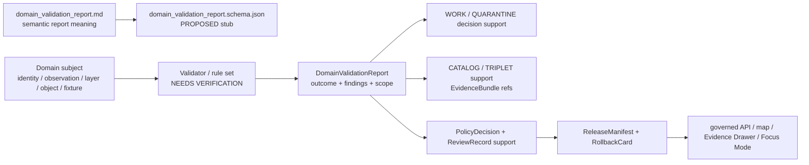

<!-- [KFM_META_BLOCK_V2]
doc_id: kfm://doc/contracts-domains-settlements-infrastructure-domain-validation-report
title: Settlements / Infrastructure Domain Validation Report Contract
type: semantic-contract
version: v0.2
status: draft; PROPOSED; schema-stub-confirmed; validator-missing; canonical-working-lane; slug-CONFLICTED-with-singular-settlement; NEEDS VERIFICATION before promotion
owners:
  - OWNER_TBD — Settlements/Infrastructure domain steward
  - OWNER_TBD — Settlements-side validation steward
  - OWNER_TBD — Infrastructure-side validation steward
  - OWNER_TBD — Contracts steward
  - OWNER_TBD — Source steward
  - OWNER_TBD — Evidence steward
  - OWNER_TBD — Schema steward
  - OWNER_TBD — Policy steward
  - OWNER_TBD — Release steward
  - OWNER_TBD — Docs steward
created: NEEDS VERIFICATION — scaffold existed before v0.2 expansion
updated: 2026-06-23
policy_label: public; contracts; settlements-infrastructure; domain-validation-report; validation-report; check-result; source-role-aware; temporal-scope-aware; evidence-bound; policy-aware; sensitivity-aware; infrastructure-sensitive; condition-observation-aware; dependency-sensitive; reservation-community-sensitive; release-gated; rollback-aware; not-validator-implementation; not-policy-decision; not-release-approval; not-feature-truth; not-publication-authority
tags: [kfm, contracts, settlements-infrastructure, domain-validation-report, ValidationReport, validation, check-result, source-role, temporal-scope, evidence, settlement, municipality, census-place, townsite, ghost-town, fort, mission, reservation-community, infrastructure-asset, network-node, network-segment, facility, service-area, operator, condition-observation, dependency, domain-feature-identity, domain-observation, domain-layer-descriptor, SourceDescriptor, EvidenceRef, EvidenceBundle, PolicyDecision, ReviewRecord, ReleaseManifest, RollbackCard]
related:
  - ./README.md
  - ./domain_feature_identity.md
  - ./domain_observation.md
  - ./domain_layer_descriptor.md
  - ../settlement/README.md
  - ../../../docs/domains/settlements-infrastructure/README.md
  - ../../../docs/domains/settlements-infrastructure/CANONICAL_PATHS.md
  - ../../../docs/domains/settlements-infrastructure/MAP_UI_CONTRACTS.md
  - ../../../docs/domains/settlements-infrastructure/sublanes/settlements.md
  - ../../../docs/domains/settlements-infrastructure/sublanes/infrastructure.md
  - ../../../schemas/contracts/v1/domains/settlements-infrastructure/domain_validation_report.schema.json
  - ../../../schemas/contracts/v1/domains/settlements-infrastructure/README.md
  - ../../../policy/domains/settlements-infrastructure/README.md
  - ../../../fixtures/domains/settlements-infrastructure/domain_validation_report/
  - ../../../tests/domains/settlements-infrastructure/
  - ../../../release/candidates/settlements-infrastructure/
notes:
  - "Expanded from a PROPOSED greenfield scaffold at contracts/domains/settlements-infrastructure/domain_validation_report.md."
  - "The paired schema exists, but it is still a permissive PROPOSED stub requiring only id and allowing additional properties. Field enforcement remains NEEDS VERIFICATION."
  - "The schema names a validator path at tools/validators/domains/settlements-infrastructure/validate_domain_validation_report.py; that validator was not found in this task. Validator behavior remains NEEDS VERIFICATION."
  - "This contract defines semantic meaning for domain validation reports. It is not the validator implementation, not a policy decision, not a release manifest, not feature truth, not map truth, not graph truth, and not an AI answer."
  - "Validation reports may support promotion and release review, but they do not publish or approve public exposure by themselves."
  - "Critical infrastructure, condition/vulnerability, dependency, operator-sensitive, reservation-community, archaeology-adjacent, and living-person-adjacent validation outcomes must fail closed unless policy/review explicitly supports release."
  - "The singular contracts/domains/settlement path remains a compatibility / variance surface, not a canonical replacement, unless an ADR resolves otherwise."
[/KFM_META_BLOCK_V2] -->

<a id="top"></a>

# Settlements / Infrastructure Domain Validation Report

> Semantic contract for `domain_validation_report`: the source-scoped, check-scoped validation report that records how a Settlements/Infrastructure object, observation, identity envelope, layer descriptor, release candidate, fixture, or derived artifact passed, failed, warned, abstained, or was held for review — without becoming feature truth, validator implementation, policy decision, review approval, release approval, public map authority, graph truth, or AI authority.

<p>
  
  
  
  
  
  
  
  
</p>

`contracts/domains/settlements-infrastructure/domain_validation_report.md`

## Quick jumps

[Status](#status) · [Meaning](#meaning) · [Repo fit](#repo-fit) · [Schema posture](#schema-posture) · [Accepted uses](#accepted-uses) · [Exclusions](#exclusions) · [Recommended fields](#recommended-fields) · [Validation report envelope](#validation-report-envelope) · [Validation families](#validation-families) · [Outcome semantics](#outcome-semantics) · [Sensitivity rules](#sensitivity-rules) · [Invariants](#invariants) · [Lifecycle](#lifecycle) · [Validation](#validation) · [Rollback](#rollback) · [Evidence basis](#evidence-basis) · [Open questions](#open-questions)

---

## Status

> [!IMPORTANT]
> **Status:** `draft` / semantic contract  
> **Owner:** `OWNER_TBD`  
> **Contract path:** `contracts/domains/settlements-infrastructure/domain_validation_report.md`  
> **Schema path:** `schemas/contracts/v1/domains/settlements-infrastructure/domain_validation_report.schema.json` — **confirmed as a stub in this task**  
> **Validator path named by schema:** `tools/validators/domains/settlements-infrastructure/validate_domain_validation_report.py` — **not found in this task**  
> **Truth posture:** target path, prior scaffold, paired schema stub, contract-lane README, sibling identity/observation/layer contracts, domain README, and settlement/infrastructure object-family docs are confirmed from current repo evidence. Field-level meaning is expanded here as **PROPOSED semantic guidance**. Validator behavior, fixture coverage, policy behavior, source registry behavior, validation runtime, release manifests, emitted proofs, governed API routes, public API behavior, graph behavior, map rendering, and runtime behavior remain **NEEDS VERIFICATION**.

> [!CAUTION]
> This contract defines validation-report meaning only. It does **not** prove the subject is true, implement the validator, decide policy, approve release, expose restricted details, certify public safety, publish a layer, validate a graph as canonical, or authorize AI to answer without EvidenceBundle, policy, review, release, and rollback gates.

---

## Meaning

`domain_validation_report` records a validation result for a Settlements/Infrastructure subject.

It may represent a check over:

- a `DomainFeatureIdentity` envelope, including object family, source role, temporal scope, deterministic digest, evidence refs, and sensitivity posture;
- a `DomainObservation`, including source-scoped assertion, method, source role, time axes, evidence, uncertainty, and review posture;
- a `DomainLayerDescriptor`, including release-candidate layer metadata, public geometry rule, finite outcomes, Evidence Drawer behavior, Focus Mode posture, and rollback targets;
- an object-family record such as `Settlement`, `Municipality`, `CensusPlace`, `Townsite`, `GhostTown`, `Fort`, `Mission`, `ReservationCommunity`, `InfrastructureAsset`, `NetworkNode`, `NetworkSegment`, `Facility`, `ServiceArea`, `Operator`, `ConditionObservation`, or `Dependency`;
- a fixture, schema candidate, source-admission candidate, policy preflight, release-candidate artifact, graph projection, map layer, export, or AI-consumable context package.

This contract owns the **meaning of the validation report record**: what was checked, by what rule set, at what time, against which evidence and policy posture, with which outcome, warnings, failures, abstentions, review requirements, and rollback implications. It does not own the implementation of checks, feature identity, object payloads, observations, policy decisions, review decisions, release manifests, public API behavior, map rendering, graph truth, or AI output.

---

## Repo fit

| Responsibility | Path or root | Relationship |
|---|---|---|
| Parent contract lane | `./README.md` | Defines this folder as semantic contracts only. |
| Feature identity companion | `./domain_feature_identity.md` | Validation reports may check identity, but do not become identity. |
| Observation companion | `./domain_observation.md` | Validation reports may check observations, but do not become source truth. |
| Layer descriptor companion | `./domain_layer_descriptor.md` | Validation reports may check release-candidate layers, but do not approve release. |
| Compatibility / variance path | `../settlement/README.md` | Singular `settlement` path is a warning surface, not canonical authority unless ADR resolves otherwise. |
| Domain doctrine | `../../../docs/domains/settlements-infrastructure/README.md` | Names object families, source-role posture, lifecycle, sensitivity defaults, and responsibility-root split. |
| Settlements-side families | `../../../docs/domains/settlements-infrastructure/sublanes/settlements.md` | Place/community object-family meaning and non-ownership rules. |
| Infrastructure-side families | `../../../docs/domains/settlements-infrastructure/sublanes/infrastructure.md` | Asset/network/facility/operator/condition/dependency meaning and strict sensitivity posture. |
| Paired schema stub | `../../../schemas/contracts/v1/domains/settlements-infrastructure/domain_validation_report.schema.json` | Machine-shape placeholder; confirmed stub, not mature enforcement. |
| Policy | `../../../policy/domains/settlements-infrastructure/` and sensitivity-policy roots | Allow/deny/restrict/abstain decisions; validation can cite but not decide. |
| Fixtures/tests | `../../../fixtures/domains/settlements-infrastructure/`, `../../../tests/domains/settlements-infrastructure/` | Behavior proof; not contract prose. |
| Validator implementation | `../../../tools/validators/domains/settlements-infrastructure/validate_domain_validation_report.py` | Named by schema but not found in this task. |
| Release/rollback | `../../../release/candidates/settlements-infrastructure/` and release roots | Promotion, release, correction, rollback, and derivative invalidation. |

---

## Schema posture

A paired schema stub was found at:

```text
schemas/contracts/v1/domains/settlements-infrastructure/domain_validation_report.schema.json
```

The stub currently:

- declares the title `domain_validation_report`;
- points back to this contract document;
- names fixtures, validator, and policy roots;
- exposes `spec_hash`, `id`, and `version` properties;
- requires only `id`;
- leaves `additionalProperties` as `true`.

> [!WARNING]
> Because the schema is a placeholder stub and the named validator was not found in this task, every field below remains **PROPOSED** semantic guidance until schema, validator, fixtures, tests, policy checks, release checks, emitted reports, and runtime behavior are verified.

---

## Accepted uses

| Use | Allowed? | Rule |
|---|---:|---|
| Recording a validation result for a domain object, observation, identity, or layer descriptor | Yes | Must preserve target ref, rule set, evidence basis, source role, time, outcome, and limitations. |
| Supporting promotion from WORK/QUARANTINE to PROCESSED/CATALOG | Conditional | Report can support promotion review but does not perform promotion by itself. |
| Supporting policy or release review | Conditional | Report may cite policy checks and warnings; PolicyDecision and ReviewRecord remain separate. |
| Supporting fixture/test traceability | Conditional | May record what fixture or test profile was checked, without claiming CI/test maturity unless verified. |
| Supporting public map/Focus Mode readiness checks | Conditional | Requires EvidenceBundle, PolicyDecision, ReviewRecord, ReleaseManifest, correction path, and RollbackCard before public exposure. |
| Recording failures, warnings, abstentions, and holds | Yes | Must be inspectable and must not hide unresolved sensitivity, rights, evidence, or source-role gaps. |
| Proving feature truth, condition truth, dependency truth, public safety, legal status, or publication approval | No | Validation is a check result, not sovereign truth or release authority. |
| Exposing restricted infrastructure, dependency, condition/vulnerability, or reservation-community detail through findings | No by default | Fail closed; redact/generalize findings unless policy/review allows visibility. |

---

## Exclusions

`domain_validation_report` must not be used as:

| Misuse | Required outcome |
|---|---|
| Validator implementation | Use tools/tests/CI after verification; this contract only defines report meaning. |
| Schema enforcement | Use the paired schema and validator. |
| Feature identity | Use `domain_feature_identity`; report may validate identity but is not identity. |
| Source truth or observation truth | Use `domain_observation`, EvidenceBundle, source role, and review. |
| Object-family payload | Use object-family contracts/schemas. |
| Policy decision | Use `PolicyDecision`; validation may inform but not decide. |
| Review approval | Use `ReviewRecord`; validation may inform but not approve. |
| Release approval | Use `ReleaseManifest`; validation may inform but not publish. |
| Critical-infrastructure disclosure | Redact, restrict, or deny details unless policy/review allows. |
| Public map/API/AI authority | Use governed APIs, released artifacts, EvidenceBundle resolution, and finite outcomes. |

---

## Recommended fields

The following fields are **PROPOSED** until the paired schema is made restrictive and validated.

| Field | Meaning |
|---|---|
| `id` | Canonical validation-report identifier. |
| `version` | Contract/object version. |
| `spec_hash` | Deterministic hash over normalized report content. |
| `domain` | Expected value: `settlements-infrastructure` unless an ADR changes it. |
| `report_type` | Schema validation, evidence validation, source-role validation, identity validation, observation validation, layer validation, sensitivity validation, policy preflight, release preflight, fixture validation, or source-specific type. |
| `subject_ref` | Ref to the object, observation, identity, layer descriptor, fixture, release candidate, source candidate, graph projection, or artifact being checked. |
| `subject_family` | Target family: Settlement, InfrastructureAsset, DomainObservation, DomainFeatureIdentity, DomainLayerDescriptor, etc. |
| `rule_set_ref` | Ref or identifier for the validation rule set/profile. |
| `schema_ref` | Schema ref, if schema validation was performed. |
| `validator_ref` | Validator/tool ref, if implementation exists and was used. |
| `source_refs` | SourceDescriptor/source registry refs involved in the validation. |
| `source_role_summary` | Source-role posture of the validated subject. |
| `evidence_refs` | EvidenceRefs or EvidenceBundle refs checked by the report. |
| `policy_decision_ref` | PolicyDecision ref if a policy preflight or policy decision exists. |
| `review_ref` | ReviewRecord ref if review occurred. |
| `release_manifest_ref` | ReleaseManifest ref if this report is linked to release readiness. |
| `rollback_ref` | RollbackCard or rollback target. |
| `outcome` | `PASS`, `WARN`, `FAIL`, `ABSTAIN`, `DENY`, `ERROR`, or `HOLD_FOR_REVIEW`. |
| `finding_summary` | Human-readable summary of major findings without leaking restricted detail. |
| `finding_refs` | Structured finding refs or finding IDs. |
| `error_refs` | Error refs, if process failed. |
| `warning_refs` | Warning refs, if non-blocking issues exist. |
| `blocker_refs` | Blocking issue refs. |
| `sensitivity_label` | Sensitivity/policy tier inherited from subject, source, findings, and release context. |
| `public_finding_rule` | Whether findings may be public, generalized, redacted, review-only, or denied. |
| `checked_time` | Time validation was run. |
| `source_time` | Source record time when relevant. |
| `valid_time` | Validity interval of the subject being checked, if relevant. |
| `release_time` | Release time, if the report is attached to a release. |
| `limitations` | Caveats: validation report only; not truth, not policy, not release, not map/graph/AI authority. |

---

## Validation report envelope

A reviewed validation report should bind a target, rule set, evidence, outcome, and release consequences.

```text
validation_report = {
  domain,
  report_type,
  subject_ref,
  subject_family,
  rule_set_ref,
  schema_ref,
  validator_ref,
  evidence_refs,
  source_role_summary,
  outcome,
  finding_summary,
  sensitivity_label,
  public_finding_rule,
  checked_time,
  policy_decision_ref,
  review_ref,
  release_manifest_ref,
  rollback_ref
}
```

The exact serialized shape is **NEEDS VERIFICATION** until the schema and validator are field-complete.

---

## Validation families

| Report family | Meaning | Guardrail |
|---|---|---|
| `schema_validation_report` | Checks machine shape against schema. | Does not prove source truth or release approval. |
| `identity_validation_report` | Checks source/family/time/digest identity posture. | Does not become identity. |
| `observation_validation_report` | Checks source-scoped observation assertions. | Does not prove the observation is correct. |
| `evidence_validation_report` | Checks EvidenceRef/EvidenceBundle resolution and provenance completeness. | Does not replace EvidenceBundle. |
| `source_role_validation_report` | Checks source role, rights, cadence, and authority limits. | Does not activate or approve a source by itself. |
| `sensitivity_validation_report` | Checks sensitivity, redaction, generalization, and disclosure risks. | Findings may themselves be restricted. |
| `layer_validation_report` | Checks DomainLayerDescriptor or map/release-candidate layer readiness. | Does not publish a layer. |
| `release_preflight_report` | Checks readiness before ReviewRecord / ReleaseManifest. | Release approval remains separate. |
| `fixture_validation_report` | Checks fixture coverage or example conformance. | Does not prove runtime/CI coverage unless linked to verified tests. |
| `rollback_impact_report` | Checks derivatives that must be invalidated after correction/withdrawal. | Does not perform rollback. |

---

## Outcome semantics

| Outcome | Meaning | Consequence |
|---|---|---|
| `PASS` | Checked rule set passed under the stated evidence and scope. | May support review, not automatic promotion or release. |
| `WARN` | Non-blocking issue or caution exists. | Requires visible caveat and possible review. |
| `FAIL` | Blocking validation issue exists. | Do not promote/release until corrected or explicitly waived by governed review. |
| `ABSTAIN` | Validation cannot determine because evidence/support is insufficient. | Do not strengthen claim; route to evidence/source/review backlog. |
| `DENY` | Policy/sensitivity/safety posture forbids the action under current conditions. | Do not publish or expose; preserve audit-safe reason. |
| `ERROR` | Validation process failed. | Do not infer subject quality; fix process/tooling. |
| `HOLD_FOR_REVIEW` | Steward, cultural, infrastructure, security, rights, or release review required. | Keep out of public path until review resolves. |

---

## Sensitivity rules

| Surface | Default validation-report visibility | Reason |
|---|---|---|
| Public census/municipal/gazetteer validation | Usually public summary if source/release supports | Still needs source role, vintage, EvidenceBundle, and release state. |
| Historic townsite, fort, mission, or ghost-town validation | Generalized or review where sensitive | Findings may reveal archaeology/cultural/private-land adjacency. |
| Reservation-community validation | Review / generalized by default | Sovereignty, cultural sensitivity, and living-person adjacency may apply. |
| Infrastructure asset/facility validation | Restricted or denied where critical | Findings may reveal asset existence, exact detail, or weak controls. |
| Condition/vulnerability validation | Denied/restricted by default | Validation findings can expose weaknesses or unsafe public inference. |
| Dependency validation | Denied/restricted or generalized | Findings may reveal dependency chains and fragility. |
| Candidate/model/OCR validation | Review only unless released | Validation may show extraction uncertainty or unsupported source role. |

---

## Invariants

1. **Validation report is not truth.** It records a check result under a rule set; it does not make the subject true.
2. **Validation report is not the validator.** Tooling, tests, schemas, and CI remain separate implementation surfaces.
3. **Validation report is not release approval.** PolicyDecision, ReviewRecord, ReleaseManifest, and RollbackCard remain separate.
4. **Validation report must preserve scope.** Rule set, subject ref, evidence refs, source role, checked time, and limitations must remain visible.
5. **Failures and abstentions are first-class.** They must not be hidden or rewritten as weak passes.
6. **Sensitivity travels with findings.** Validation findings can be more sensitive than the original record and may require redaction or denial.
7. **Runtime claims require proof.** Do not claim CI, validator, fixture, API, map, graph, or release behavior without current evidence.
8. **Public clients use governed surfaces.** A validation report cannot authorize direct access to RAW, WORK, QUARANTINE, PROCESSED, canonical/internal stores, or direct model output.
9. **Singular `settlement` remains conflicted.** Do not route canonical reports through the singular compatibility path without ADR.

---

## Lifecycle



Contracts describe meaning. They do not move data, enforce schema shape, run validators, decide policy, emit release artifacts, render maps, or authorize AI answers.

---

## Validation

Before this contract is treated as mature, maintainers should verify:

- [ ] paired schema becomes restrictive enough to enforce report fields beyond `id`;
- [ ] validator exists at `tools/validators/domains/settlements-infrastructure/validate_domain_validation_report.py` and matches schema/contract intent;
- [ ] fixtures cover all relevant report families and outcomes;
- [ ] tests cover `PASS`, `WARN`, `FAIL`, `ABSTAIN`, `DENY`, `ERROR`, and `HOLD_FOR_REVIEW`;
- [ ] tests prevent validation reports from becoming truth, identity, observation, policy decision, review approval, release manifest, map truth, graph truth, or AI authority;
- [ ] tests enforce fail-closed handling for critical infrastructure, dependency, condition/vulnerability, reservation-community, archaeology-adjacent, parcel/title, and living-person-adjacent findings;
- [ ] public DTOs and map/Focus Mode payloads never expose restricted validation findings;
- [ ] rollback invalidates downstream maps, graph projections, layer descriptors, release candidates, exports, Focus Mode states, caches, and AI summaries that relied on the withdrawn report.

---

## Rollback

Rollback is required if this contract:

- claims schema, validator, fixture, test, policy, release, API, graph, map, or runtime behavior exists without proof;
- treats validation reports as feature truth, source truth, policy decision, release approval, public map truth, graph truth, validator implementation, or AI authority;
- hides failures, warnings, abstentions, denials, review holds, or errors;
- exposes restricted infrastructure, condition/vulnerability, dependency, operator-sensitive, reservation-community, archaeology-adjacent, parcel/title, or living-person information through examples or public wording;
- normalizes direct UI access to RAW, WORK, QUARANTINE, PROCESSED, canonical/internal stores, or direct model output;
- treats the singular `settlement` path as canonical authority without ADR support.

Rollback target: revert `contracts/domains/settlements-infrastructure/domain_validation_report.md` to prior scaffold blob `0269abe7780dab91eb25827602ef97b78f550a6c`, record drift if authority boundaries were affected, and invalidate downstream derivatives that relied on weakened validation-report semantics.

---

## Evidence basis

| Evidence | Status | Supports | Limits |
|---|---|---|---|
| Prior `contracts/domains/settlements-infrastructure/domain_validation_report.md` | `CONFIRMED` | Target file existed as a PROPOSED scaffold. | Scaffold did not define authoritative semantic contract content. |
| `schemas/contracts/v1/domains/settlements-infrastructure/domain_validation_report.schema.json` | `CONFIRMED stub / PROPOSED field realization` | Paired schema exists with `id`, `version`, `spec_hash`, `id` required, `additionalProperties: true`, fixture root, validator path, and policy path metadata. | Does not prove field-complete schema, validator implementation, fixtures, tests, policy, runtime, or release maturity. |
| `contracts/domains/settlements-infrastructure/README.md` | `CONFIRMED contract-lane rule` | Defines contracts as semantic meaning only and separates schemas, policy, fixtures, tests, data, release, public API, graph, and runtime behavior. | Does not define this object’s full field shape. |
| `contracts/domains/settlements-infrastructure/domain_feature_identity.md` | `CONFIRMED sibling contract` | Defines identity-envelope posture and the rule that reports may check identity without becoming identity. | Identity-specific; not a full validation-report schema. |
| `contracts/domains/settlements-infrastructure/domain_observation.md` | `CONFIRMED sibling contract` | Defines observation-as-assertion posture; validation reports may check observations without becoming source truth. | Observation-specific; not a full validation-report schema. |
| `contracts/domains/settlements-infrastructure/domain_layer_descriptor.md` | `CONFIRMED sibling contract` | Defines layer descriptor posture and downstream map/Focus Mode boundaries. | Layer-specific; not a full validation-report schema. |
| `docs/domains/settlements-infrastructure/README.md` | `CONFIRMED doctrine / PROPOSED implementation` | Names sixteen object families, responsibility-root split, identity basis, lifecycle, and sensitivity defaults. | Does not prove validation runtime behavior. |
| `docs/domains/settlements-infrastructure/sublanes/settlements.md` | `CONFIRMED doctrine / PROPOSED sublane application` | Defines settlement-side object families and cross-lane non-ownership. | Sublane structure and field realization remain partly PROPOSED. |
| `docs/domains/settlements-infrastructure/sublanes/infrastructure.md` | `CONFIRMED doctrine / PROPOSED field realization` | Defines infrastructure-side object families and strict sensitivity posture for critical infrastructure, condition, vulnerability, and dependencies. | Does not prove contract/schema/test implementation. |
| Uploaded KFM authoring prompt v2 | `CONFIRMED user-supplied guidance` | Requires evidence-first, implementation-honest, visually polished Markdown with no hidden uncertainty and rollback posture. | Authoring guidance, not implementation proof. |

---

## Open questions

| ID | Question | Status |
|---|---|---|
| OQ-SI-DVR-01 | Which namespace and ID format should Settlements/Infrastructure validation reports use? | OPEN / ADR NEEDED |
| OQ-SI-DVR-02 | Which report families, outcomes, rule-set refs, and finding structures are canonical? | OPEN / SCHEMA REVIEW |
| OQ-SI-DVR-03 | Should validation reports be public-safe objects, internal-only artifacts, or dual-surface objects with redacted public summaries? | OPEN / POLICY REVIEW |
| OQ-SI-DVR-04 | Which validation findings must be denied or restricted because they reveal critical infrastructure, vulnerabilities, dependencies, reservation-community, archaeology-adjacent, parcel/title, or living-person-adjacent information? | OPEN / POLICY REVIEW |
| OQ-SI-DVR-05 | How should public map/UI finite outcomes consume validation reports without exposing sensitive findings? | OPEN / MAP/UI REVIEW |
| OQ-SI-DVR-06 | How should rollback invalidate identities, observations, layers, graph projections, release candidates, Focus Mode states, public API caches, exports, and AI summaries that cited a withdrawn validation report? | OPEN / RELEASE REVIEW |

<p align="right"><a href="#top">Back to top</a></p>
