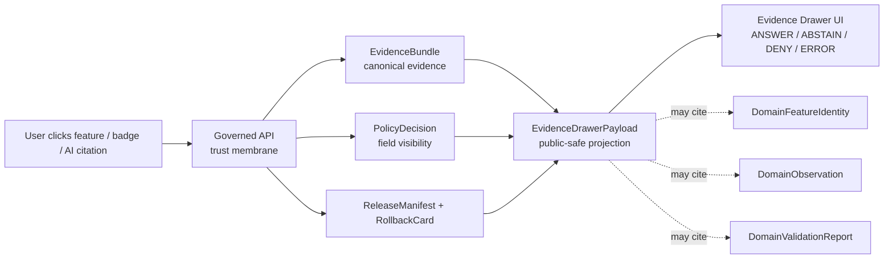

<!-- [KFM_META_BLOCK_V2]
doc_id: kfm://doc/contracts-domains-settlements-infrastructure-evidence-drawer-payload
title: Settlements / Infrastructure Evidence Drawer Payload Contract
type: semantic-contract; domain-projection-profile
version: v0.2
status: draft; PROPOSED; domain-schema-missing; ui-schema-stub-confirmed; cross-cutting-ui-authority-separate; canonical-working-lane; slug-CONFLICTED-with-singular-settlement; NEEDS VERIFICATION before promotion
owners:
  - OWNER_TBD — Settlements/Infrastructure domain steward
  - OWNER_TBD — Map/UI steward
  - OWNER_TBD — Evidence steward
  - OWNER_TBD — Policy steward
  - OWNER_TBD — Contracts steward
  - OWNER_TBD — Schema steward
  - OWNER_TBD — Release steward
  - OWNER_TBD — Docs steward
created: NEEDS VERIFICATION — scaffold existed before v0.2 expansion
updated: 2026-06-23
policy_label: public; contracts; settlements-infrastructure; evidence-drawer-payload; domain-projection-profile; ui-projection; evidence-bound; source-role-aware; temporal-scope-aware; policy-aware; sensitivity-aware; infrastructure-sensitive; condition-observation-aware; dependency-sensitive; reservation-community-sensitive; finite-outcome-aware; release-gated; rollback-aware; not-evidencebundle; not-ui-schema-authority; not-policy-engine; not-feature-truth; not-publication-authority
tags: [kfm, contracts, settlements-infrastructure, evidence-drawer-payload, EvidenceDrawerPayload, EvidenceBundle, EvidenceRef, PolicyDecision, ReviewRecord, ReleaseManifest, RollbackCard, DomainFeatureIdentity, DomainObservation, DomainLayerDescriptor, DomainValidationReport, MapContextEnvelope, FocusMode, Settlement, Municipality, CensusPlace, Townsite, GhostTown, Fort, Mission, ReservationCommunity, InfrastructureAsset, NetworkNode, NetworkSegment, Facility, ServiceArea, Operator, ConditionObservation, Dependency]
related:
  - ./README.md
  - ./domain_feature_identity.md
  - ./domain_observation.md
  - ./domain_layer_descriptor.md
  - ./domain_validation_report.md
  - ../settlement/README.md
  - ../../ui/evidence_drawer_payload.md
  - ../../../docs/architecture/evidence-drawer.md
  - ../../../docs/architecture/ui/EVIDENCE_DRAWER.md
  - ../../../docs/domains/settlements-infrastructure/API_CONTRACTS.md
  - ../../../docs/domains/settlements-infrastructure/MAP_UI_CONTRACTS.md
  - ../../../docs/domains/settlements-infrastructure/README.md
  - ../../../docs/domains/settlements-infrastructure/CANONICAL_PATHS.md
  - ../../../docs/domains/settlements-infrastructure/sublanes/settlements.md
  - ../../../docs/domains/settlements-infrastructure/sublanes/infrastructure.md
  - ../../../schemas/contracts/v1/ui/evidence_drawer_payload.schema.json
  - ../../../schemas/contracts/v1/domains/settlements-infrastructure/evidence-drawer-payload.schema.json
  - ../../../policy/domains/settlements-infrastructure/
  - ../../../policy/ui/
  - ../../../fixtures/domains/settlements-infrastructure/evidence-drawer-payload/
  - ../../../tests/domains/settlements-infrastructure/
  - ../../../release/candidates/settlements-infrastructure/
notes:
  - "Expanded from a PROPOSED scaffold at contracts/domains/settlements-infrastructure/evidence-drawer-payload.md."
  - "A domain-local schema at schemas/contracts/v1/domains/settlements-infrastructure/evidence-drawer-payload.schema.json was not found in this task. Domain field realization remains PROPOSED."
  - "The cross-cutting UI contract at contracts/ui/evidence_drawer_payload.md and schema at schemas/contracts/v1/ui/evidence_drawer_payload.schema.json exist, but both are greenfield PROPOSED stubs. This file must not become a parallel UI authority."
  - "Architecture doctrine defines Evidence Drawer as a governed UI projection of EvidenceBundle, never the truth source, popup substitute, verification badge, AI answer, or policy engine."
  - "Settlements/Infrastructure API doctrine names Evidence Drawer Payload as one of the governed surfaces and requires ANSWER / ABSTAIN / DENY / ERROR outcomes."
  - "Sensitive infrastructure, dependency, operator-sensitive, reservation-community, archaeology-adjacent, and living-person-adjacent drawer content must fail closed or be generalized/redacted unless evidence and policy allow release."
  - "The singular contracts/domains/settlement path remains a compatibility / variance surface, not a canonical replacement, unless an ADR resolves otherwise."
[/KFM_META_BLOCK_V2] -->

<a id="top"></a>

# Settlements / Infrastructure Evidence Drawer Payload

> Semantic contract for `evidence-drawer-payload`: the Settlements/Infrastructure domain projection profile for showing a clicked feature, badge, layer claim, validation state, or AI-cited claim in the Evidence Drawer — without becoming the canonical `EvidenceBundle`, the cross-cutting UI schema, a policy engine, a popup substitute, a release approval, map truth, graph truth, or AI truth.

<p>
  
  
  
  
  
  
  
  
</p>

`contracts/domains/settlements-infrastructure/evidence-drawer-payload.md`

## Quick jumps

[Status](#status) · [Meaning](#meaning) · [Repo fit](#repo-fit) · [Schema posture](#schema-posture) · [Accepted uses](#accepted-uses) · [Exclusions](#exclusions) · [Recommended fields](#recommended-fields) · [Drawer projection envelope](#drawer-projection-envelope) · [Drawer content families](#drawer-content-families) · [Finite outcomes](#finite-outcomes) · [Sensitivity rules](#sensitivity-rules) · [Invariants](#invariants) · [Lifecycle](#lifecycle) · [Validation](#validation) · [Rollback](#rollback) · [Evidence basis](#evidence-basis) · [Open questions](#open-questions)

---

## Status

> [!IMPORTANT]
> **Status:** `draft` / semantic contract / domain projection profile  
> **Owner:** `OWNER_TBD`  
> **Contract path:** `contracts/domains/settlements-infrastructure/evidence-drawer-payload.md`  
> **Domain schema path checked:** `schemas/contracts/v1/domains/settlements-infrastructure/evidence-drawer-payload.schema.json` — **not found in this task**  
> **Cross-cutting UI contract:** `contracts/ui/evidence_drawer_payload.md` — **confirmed scaffold**  
> **Cross-cutting UI schema:** `schemas/contracts/v1/ui/evidence_drawer_payload.schema.json` — **confirmed PROPOSED stub**  
> **Truth posture:** target path, prior scaffold, cross-cutting UI scaffold/schema stub, architecture doctrine, Settlements/Infrastructure API doctrine, sibling identity/observation/layer/validation contracts, and contract-lane README are confirmed from current repo evidence. Domain-specific field realization, validator behavior, fixture coverage, policy behavior, release manifests, governed API routes, public API behavior, map rendering, graph behavior, and runtime behavior remain **NEEDS VERIFICATION**.

> [!CAUTION]
> This contract defines a Settlements/Infrastructure drawer projection profile only. It does **not** make the drawer the source of truth, replace `EvidenceBundle`, define the cross-cutting UI schema, recompute policy, expose restricted fields, approve release, or authorize a public client to read internal lifecycle stores or direct model output.

---

## Meaning

`evidence-drawer-payload` is the domain-specific projection of Settlements/Infrastructure evidence into the Evidence Drawer.

It may represent the public-safe drawer view for:

- a clicked `Settlement`, `Municipality`, `CensusPlace`, `Townsite`, `GhostTown`, `Fort`, `Mission`, or `ReservationCommunity` feature;
- a clicked `InfrastructureAsset`, `NetworkNode`, `NetworkSegment`, `Facility`, `ServiceArea`, `Operator`, `ConditionObservation`, or `Dependency` feature;
- a layer badge, validation badge, policy badge, source-role badge, trust-state badge, correction badge, or release-state badge;
- a Focus Mode claim that cites a Settlements/Infrastructure feature or layer;
- a public-safe aggregate, generalized, redacted, denied, or abstained drawer state.

The drawer payload is a **governed projection**. It renders what a released `EvidenceBundle`, `PolicyDecision`, `ReviewRecord`, `ReleaseManifest`, correction record, and `RollbackCard` allow the user to inspect. It does not compute new truth, new policy, new geometry, new sensitivity classification, new AI language, or new release state.

---

## Repo fit

| Responsibility | Path or root | Relationship |
|---|---|---|
| Parent contract lane | `./README.md` | Defines this folder as semantic contracts only. |
| Feature identity companion | `./domain_feature_identity.md` | Drawer subject identity must remain source-role/family/time/evidence/sensitivity aware. |
| Observation companion | `./domain_observation.md` | Drawer may show observation support, but observations remain assertions, not proof. |
| Layer descriptor companion | `./domain_layer_descriptor.md` | Drawer payload is downstream of released or release-candidate layer meaning. |
| Validation report companion | `./domain_validation_report.md` | Drawer may show validation summary, but validation is not release approval. |
| Cross-cutting UI payload contract | `../../ui/evidence_drawer_payload.md` | Generic UI payload meaning; currently a scaffold and should remain cross-cutting authority. |
| Architecture doctrine | `../../../docs/architecture/evidence-drawer.md` | Defines Evidence Drawer as projection of EvidenceBundle and finite-outcome trust surface. |
| Domain API doctrine | `../../../docs/domains/settlements-infrastructure/API_CONTRACTS.md` | Names Evidence Drawer Payload as one of the governed API surfaces. |
| Map/UI doctrine | `../../../docs/domains/settlements-infrastructure/MAP_UI_CONTRACTS.md` | Domain map/UI obligations, sensitivity, finite outcomes, Evidence Drawer, Focus Mode. |
| Cross-cutting UI schema | `../../../schemas/contracts/v1/ui/evidence_drawer_payload.schema.json` | Generic machine-shape stub; not mature field enforcement. |
| Domain schema | `../../../schemas/contracts/v1/domains/settlements-infrastructure/evidence-drawer-payload.schema.json` | Not found in this task; do not infer field enforcement. |
| Policy | `../../../policy/domains/settlements-infrastructure/`, `../../../policy/ui/` | Allow/deny/restrict/abstain decisions and drawer projection filtering. |
| Release/rollback | `../../../release/candidates/settlements-infrastructure/` and release roots | Publication, correction, and rollback authority. |

---

## Schema posture

Two schema surfaces matter here:

| Surface | Status | Meaning |
|---|---|---|
| `schemas/contracts/v1/domains/settlements-infrastructure/evidence-drawer-payload.schema.json` | **Not found in this task** | No domain-local machine shape was confirmed. |
| `schemas/contracts/v1/ui/evidence_drawer_payload.schema.json` | **CONFIRMED PROPOSED stub** | Cross-cutting UI schema exists, but it only defines `spec_hash`, `id`, `version`, requires `id`, and allows `additionalProperties`. |

> [!WARNING]
> Because the cross-cutting schema is only a stub and no domain-local schema was confirmed, every field below remains **PROPOSED** semantic guidance until schema, validators, fixtures, policy tests, release checks, and runtime behavior are verified.

---

## Accepted uses

| Use | Allowed? | Rule |
|---|---:|---|
| Projecting a resolved EvidenceBundle into a Settlements/Infrastructure drawer view | Yes | EvidenceBundle remains canonical; drawer only renders the permitted projection. |
| Showing source role, citation state, policy state, release state, and correction state | Yes | Must preserve finite outcome and not hide broken lineage. |
| Showing public-safe feature facts | Conditional | Requires EvidenceBundle, PolicyDecision, ReviewRecord, ReleaseManifest, and rollback target. |
| Showing validation summaries | Conditional | Must cite validation report and avoid exposing restricted findings. |
| Showing denied or abstained states | Yes | DENY/ABSTAIN are valid drawer outcomes and should be user-visible. |
| Supporting Focus Mode citation inspection | Conditional | AI-cited claims must resolve to evidence and policy posture; AI remains downstream. |
| Showing sensitive infrastructure, dependency, condition, or reservation-community detail | Usually no | Default deny/restrict/generalize unless policy/review explicitly allows. |
| Replacing popup, layer descriptor, EvidenceBundle, policy engine, release manifest, or AI answer | No | Those surfaces remain separate. |

---

## Exclusions

`evidence-drawer-payload` must not be used as:

| Misuse | Required outcome |
|---|---|
| Canonical evidence | Use `EvidenceBundle`; the drawer is a projection. |
| Cross-cutting UI schema authority | Use `contracts/ui/evidence_drawer_payload.md` and `schemas/contracts/v1/ui/evidence_drawer_payload.schema.json` after maturity. |
| Popup substitute | Popups may tease; the drawer proves with evidence. |
| Policy engine | Use `PolicyDecision` and policy roots. |
| Release approval | Use `ReviewRecord`, `ReleaseManifest`, and RollbackCard. |
| Feature identity | Use `domain_feature_identity`. |
| Observation truth | Use `domain_observation` plus EvidenceBundle and source role. |
| Layer truth | Use `domain_layer_descriptor` and released artifacts. |
| Validation proof of truth | Use `domain_validation_report`, but remember check result is not approval. |
| Public map/API payload by itself | Use governed API and released artifacts. |
| AI answer authority | Focus Mode answers remain evidence-subordinate and receipt-backed. |

---

## Recommended fields

The following fields are **PROPOSED** until schemas and validators are made restrictive and validated.

| Field | Meaning |
|---|---|
| `id` | Canonical drawer payload identifier. |
| `version` | Contract/object version. |
| `spec_hash` | Deterministic hash over normalized drawer payload content. |
| `domain` | Expected value: `settlements-infrastructure`. |
| `outcome` | `ANSWER`, `ABSTAIN`, `DENY`, or `ERROR`. |
| `reason_code` | Machine-readable reason for non-ANSWER or degraded states. |
| `subject_ref` | Feature, layer, badge, claim, validation report, or Focus Mode claim being inspected. |
| `subject_family` | Object family or surface family represented in the drawer. |
| `evidence_bundle_ref` | Resolved EvidenceBundle reference. Required for consequential `ANSWER`. |
| `evidence_refs` | EvidenceRef list used in the drawer projection. |
| `source_role_summary` | Source-role posture displayed to user. |
| `citation_validation_ref` | CitationValidationReport or domain validation report ref, if available. |
| `policy_decision_ref` | PolicyDecision governing what can be shown. |
| `review_ref` | ReviewRecord or steward review ref. |
| `release_manifest_ref` | ReleaseManifest or MapReleaseManifest ref. |
| `rollback_ref` | RollbackCard or rollback target. |
| `correction_refs` | Correction or supersession refs. |
| `trust_state` | Released, stale, degraded, corrected, superseded, denied, restricted, or unavailable state. |
| `public_summary` | Public-safe summary text. |
| `claim_rows` | Public-safe claim/evidence rows. |
| `source_rows` | Public-safe source/citation rows. |
| `time_scope` | Source, observed, valid, retrieval, release, correction times kept distinct. |
| `sensitivity_summary` | Sensitivity label and public-safe caveat. |
| `redaction_summary` | Redaction/generalization/aggregation posture without exposing restricted detail. |
| `field_visibility_profile` | Which fields are visible, redacted, generalized, or denied. |
| `focus_mode_trace_ref` | AIReceipt or Focus Mode response ref, if opened from AI claim. |
| `limitations` | Caveats: drawer projection only; not evidence root, not policy engine, not release approval. |

---

## Drawer projection envelope

A reviewed domain payload should be an envelope around released evidence and policy-filtered display fields.

```text
evidence_drawer_payload = {
  domain,
  outcome,
  reason_code,
  subject_ref,
  subject_family,
  evidence_bundle_ref,
  source_role_summary,
  policy_decision_ref,
  review_ref,
  release_manifest_ref,
  rollback_ref,
  trust_state,
  public_summary,
  claim_rows,
  source_rows,
  time_scope,
  sensitivity_summary,
  field_visibility_profile
}
```

The exact serialized shape is **NEEDS VERIFICATION** until the UI schema, domain profile, validators, fixtures, and governed API route are field-complete.

---

## Drawer content families

| Drawer family | Meaning | Guardrail |
|---|---|---|
| `settlement_place_drawer` | Drawer for settlement, municipality, census place, townsite, ghost town, fort, mission, or reservation community. | Keep legal, census, historic, cultural, and community identities distinct. |
| `reservation_community_drawer` | Drawer for reservation-community context. | Sovereignty/cultural/living-person sensitivity defaults to review/generalization. |
| `infrastructure_asset_drawer` | Drawer for infrastructure asset or facility context. | Sensitive details are denied, restricted, or generalized by policy. |
| `service_area_drawer` | Drawer for served footprint or area. | Generalize or deny dependency-sensitive areas. |
| `operator_drawer` | Drawer for operator or agency role context. | Operator role is not legal entity truth or sensitive disclosure. |
| `condition_observation_drawer` | Drawer for condition/status/inspection support. | Not safety advice or unrestricted condition disclosure. |
| `dependency_drawer` | Drawer for infrastructure dependency relation. | High-sensitivity by default; public details usually denied/generalized. |
| `validation_drawer` | Drawer opened from validation or trust badge. | Validation is check result, not release approval. |
| `focus_mode_citation_drawer` | Drawer opened from AI-cited statement. | AI remains downstream; drawer shows evidence/policy, not model confidence. |
| `denied_or_abstained_drawer` | Drawer state for DENY/ABSTAIN outcomes. | Explain safe reason without leaking restricted detail. |

---

## Finite outcomes

| Outcome | Drawer behavior |
|---|---|
| `ANSWER` | Render public-safe summary, claims, citations, source role, time scope, policy, release, correction, and rollback state. |
| `ABSTAIN` | Show unresolved EvidenceBundle, broken EvidenceRef, missing citation validation, stale/corrected support, or insufficient evidence without inventing explanation. |
| `DENY` | Show policy-safe denial reason and redaction/generalization posture without leaking restricted detail. |
| `ERROR` | Show process/tooling failure without implying evidence quality or claim truth. |

---

## Sensitivity rules

| Surface | Default drawer posture | Reason |
|---|---|---|
| Public census/municipal/gazetteer feature | Public-safe if released | Still requires source role, vintage, EvidenceBundle, release state, and correction state. |
| Historic townsite, ghost town, fort, mission | Generalized or reviewed where sensitive | Archaeology/cultural/private-land adjacency may apply. |
| Reservation community | Review/generalized by default | Sovereignty, cultural sensitivity, and living-person adjacency may apply. |
| Infrastructure asset or facility | Restricted or denied when sensitive | Public drawer fields must reflect policy-reviewed exposure limits. |
| Condition/inspection/status observation | Restricted by default where sensitive | Drawer must not convert internal conditions into public advice. |
| Dependency relation or service fragility | Denied/restricted or generalized | Dependencies can reveal sensitive exposure. |
| AI-cited claim | Evidence-bound and finite-outcome-constrained | Model language never outranks EvidenceBundle or policy. |

---

## Invariants

1. **Drawer is projection, not truth.** `EvidenceBundle` outranks the drawer payload.
2. **Drawer cannot recover failed evidence.** Missing EvidenceBundle, broken EvidenceRef, failed citation validation, or stale/corrected support resolves to ABSTAIN/ERROR/DENY, not invented ANSWER.
3. **Drawer is not a policy engine.** It renders policy-filtered fields and policy outcomes; it does not recompute policy.
4. **Drawer is not release approval.** ReviewRecord, ReleaseManifest, and RollbackCard remain separate and required for public display.
5. **Popup is not substitute.** Consequential claims must open drawer evidence, not rely on popup text.
6. **Sensitivity filters happen before delivery.** Restricted fields should not be merely hidden in UI; they must be withheld/generalized/redacted upstream.
7. **Time axes remain visible.** Source, observed, valid, retrieval, release, and correction times must not collapse.
8. **Public client never reads internal lifecycle stores.** Drawer payload comes from governed API/released artifacts only.
9. **Domain file is not cross-cutting UI authority.** This file profiles Settlements/Infrastructure content; generic UI payload shape belongs in UI contracts/schema.

---

## Lifecycle



Contracts describe meaning. They do not move data, validate schema shape, implement the governed API, render UI, compute policy, publish artifacts, or authorize AI answers.

---

## Validation

Before this contract is treated as mature, maintainers should verify:

- [ ] whether this domain file should remain as a Settlements/Infrastructure projection profile or be replaced by links to `contracts/ui/evidence_drawer_payload.md` plus domain-layer descriptors;
- [ ] whether a domain-local schema should exist, or whether only the cross-cutting UI schema should own machine shape;
- [ ] cross-cutting UI schema becomes restrictive enough to enforce finite outcome, EvidenceBundle ref, policy refs, release refs, trust state, time scope, and field visibility;
- [ ] validators exist for the UI payload and any domain-specific profile checks;
- [ ] fixtures cover settlement-place, reservation-community, infrastructure-asset, service-area, operator, condition-observation, dependency, validation, Focus Mode, ABSTAIN, DENY, and ERROR drawers;
- [ ] tests prevent the drawer from reading internal lifecycle stores, graph internals, or direct model output;
- [ ] tests prevent restricted fields from being delivered and merely hidden by UI logic;
- [ ] public DTOs and map/Focus Mode payloads resolve EvidenceBundle or return finite outcomes;
- [ ] rollback invalidates drawer payloads, API caches, layer descriptors, tile/style refs where needed, Focus Mode states, exports, and AI summaries that cited withdrawn evidence.

---

## Rollback

Rollback is required if this contract:

- claims schema, validator, fixture, policy, release, API, map, UI, graph, Focus Mode, or runtime behavior exists without proof;
- creates a parallel EvidenceDrawerPayload authority that conflicts with `contracts/ui/evidence_drawer_payload.md` or `schemas/contracts/v1/ui/evidence_drawer_payload.schema.json`;
- treats the drawer as EvidenceBundle, policy engine, release approval, popup substitute, feature truth, map truth, graph truth, or AI authority;
- exposes restricted infrastructure, condition, dependency, operator-sensitive, reservation-community, archaeology-adjacent, parcel/title, or living-person information through examples or public wording;
- normalizes direct UI access to internal lifecycle stores, graph internals, or direct model output;
- treats the singular `settlement` path as canonical authority without ADR support.

Rollback target: revert `contracts/domains/settlements-infrastructure/evidence-drawer-payload.md` to prior scaffold blob `b23055455f9386e2c297e4361de0ef346eb0baf2`, record drift if authority boundaries were affected, and invalidate downstream derivatives that relied on weakened drawer-payload semantics.

---

## Evidence basis

| Evidence | Status | Supports | Limits |
|---|---|---|---|
| Prior `contracts/domains/settlements-infrastructure/evidence-drawer-payload.md` | `CONFIRMED` | Target file existed as a PROPOSED scaffold sourced from the expansion backlog. | Scaffold did not define authoritative semantic contract content. |
| Domain-local schema lookup | `CONFIRMED not found in this task` | Justifies domain-schema-missing posture. | Does not rule out alternate schema names or future ADR-selected homes. |
| `contracts/ui/evidence_drawer_payload.md` | `CONFIRMED scaffold` | Confirms cross-cutting UI contract home exists. | It is a greenfield scaffold and does not define mature field semantics. |
| `schemas/contracts/v1/ui/evidence_drawer_payload.schema.json` | `CONFIRMED stub / PROPOSED field realization` | Confirms cross-cutting UI schema exists with `id`, `version`, `spec_hash`, `id` required, `additionalProperties: true`, fixture root, validator path, and policy path metadata. | Does not prove field-complete schema, validator implementation, fixtures, tests, policy, runtime, or release maturity. |
| `docs/architecture/evidence-drawer.md` | `CONFIRMED doctrine / PROPOSED implementation` | Defines Evidence Drawer as UI projection of EvidenceBundle, finite-outcome trust surface, not truth/popup/policy/AI substitute. | Some paths and route names in that doc are explicitly PROPOSED. |
| `docs/domains/settlements-infrastructure/API_CONTRACTS.md` | `CONFIRMED doctrine / PROPOSED implementation` | Names Evidence Drawer Payload as governed surface and describes returned object, outcomes, and ABSTAIN cases. | Exact route names, package paths, and DTO field shapes are PROPOSED. |
| `contracts/domains/settlements-infrastructure/domain_feature_identity.md` | `CONFIRMED sibling contract` | Feature identity context for drawer subjects. | Identity-specific; not drawer payload schema. |
| `contracts/domains/settlements-infrastructure/domain_observation.md` | `CONFIRMED sibling contract` | Observation-as-assertion posture for drawer evidence rows. | Observation-specific; not drawer payload schema. |
| `contracts/domains/settlements-infrastructure/domain_layer_descriptor.md` | `CONFIRMED sibling contract` | Layer descriptor and map/UI downstream boundaries. | Layer-specific; not drawer payload schema. |
| `contracts/domains/settlements-infrastructure/domain_validation_report.md` | `CONFIRMED sibling contract` | Validation report as check result, not approval. | Validation-specific; not drawer payload schema. |
| Uploaded KFM authoring prompt v2 | `CONFIRMED user-supplied guidance` | Requires evidence-first, implementation-honest, visually polished Markdown with no hidden uncertainty and rollback posture. | Authoring guidance, not implementation proof. |

---

## Open questions

| ID | Question | Status |
|---|---|---|
| OQ-SI-EDP-01 | Should this domain file remain a Settlements/Infrastructure projection profile, or should all EvidenceDrawerPayload semantics live only under `contracts/ui/`? | OPEN / ADR OR UI REVIEW |
| OQ-SI-EDP-02 | Should a domain-local schema exist, or should the cross-cutting UI schema own machine shape with domain-specific policy/profile fixtures? | OPEN / SCHEMA REVIEW |
| OQ-SI-EDP-03 | Which drawer fields are allowed for reservation-community, sensitive infrastructure, dependency, condition, and operator-sensitive surfaces? | OPEN / POLICY REVIEW |
| OQ-SI-EDP-04 | Which trust states and reason codes are canonical across Evidence Drawer, Layer Descriptor, Focus Mode, and governed API envelopes? | OPEN / MAP/UI REVIEW |
| OQ-SI-EDP-05 | How should drawer rollback invalidate API caches, map state, Focus Mode citations, exports, and AI summaries after evidence correction? | OPEN / RELEASE REVIEW |
| OQ-SI-EDP-06 | How should singular `settlement` compatibility references migrate without breaking Evidence Drawer routes or cached payloads? | OPEN / ADR + MIGRATION REVIEW |

<p align="right"><a href="#top">Back to top</a></p>
