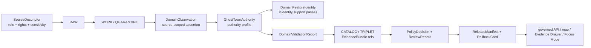

<!-- [KFM_META_BLOCK_V2]
doc_id: kfm://doc/contracts-domains-settlements-infrastructure-ghost-town-authority
title: Ghost Town Authority Contract — Settlements / Infrastructure
type: semantic-contract
version: v0.2
status: draft; PROPOSED; schema-missing; canonical-working-lane; slug-CONFLICTED-with-singular-settlement; sensitivity-aware; NEEDS VERIFICATION before promotion
owners:
  - OWNER_TBD — Settlements/Infrastructure domain steward
  - OWNER_TBD — Settlements-side steward
  - OWNER_TBD — Source steward
  - OWNER_TBD — Evidence steward
  - OWNER_TBD — Policy steward
  - OWNER_TBD — Contracts steward
  - OWNER_TBD — Schema steward
  - OWNER_TBD — Release steward
  - OWNER_TBD — Docs steward
created: NEEDS VERIFICATION — scaffold existed before v0.2 expansion
updated: 2026-06-23
policy_label: public; contracts; settlements-infrastructure; ghost-town-authority; ghost-town; source-authority; authority-profile; evidence-bound; source-role-aware; temporal-scope-aware; sensitivity-aware; archaeology-adjacent-aware; private-land-adjacent-aware; living-person-adjacent-aware; release-gated; rollback-aware; not-archaeology-truth; not-land-title; not-current-access; not-exact-sensitive-location-authority; not-publication-authority
tags: [kfm, contracts, settlements-infrastructure, ghost-town-authority, GhostTown, Settlement, Townsite, Fort, Mission, Municipality, CensusPlace, source-authority, SourceDescriptor, source-role, EvidenceRef, EvidenceBundle, DomainFeatureIdentity, DomainObservation, DomainValidationReport, EvidenceDrawerPayload, PolicyDecision, ReviewRecord, ReleaseManifest, RollbackCard]
related:
  - ./README.md
  - ./domain_feature_identity.md
  - ./domain_observation.md
  - ./domain_validation_report.md
  - ./evidence-drawer-payload.md
  - ../settlement/README.md
  - ../../../docs/domains/settlements-infrastructure/README.md
  - ../../../docs/domains/settlements-infrastructure/CANONICAL_PATHS.md
  - ../../../docs/domains/settlements-infrastructure/SOURCE_REGISTRY.md
  - ../../../docs/domains/settlements-infrastructure/sublanes/settlements.md
  - ../../../docs/domains/settlements-infrastructure/sublanes/infrastructure.md
  - ../../../schemas/contracts/v1/domains/settlements-infrastructure/ghost-town-authority.schema.json
  - ../../../policy/domains/settlements-infrastructure/
  - ../../../fixtures/domains/settlements-infrastructure/ghost-town-authority/
  - ../../../tests/domains/settlements-infrastructure/
  - ../../../release/candidates/settlements-infrastructure/
notes:
  - "Expanded from a PROPOSED scaffold at contracts/domains/settlements-infrastructure/ghost-town-authority.md."
  - "A paired schema at schemas/contracts/v1/domains/settlements-infrastructure/ghost-town-authority.schema.json was not found in this task. Field realization remains PROPOSED."
  - "Settlements sublane doctrine names GhostTown as a settlement whose evidentiary trail has shifted from active records to historical / archaeological sources. This contract profiles authority and source-role posture; it does not author archaeology, land/title, living-person, transport, hydrology, or hazard truth."
  - "The source registry defines source admission and authority control as separate from bibliography, with role, rights, cadence, sensitivity, and release posture required before source material shapes public claims."
  - "The singular contracts/domains/settlement path remains a compatibility / variance surface, not a canonical replacement, unless an ADR resolves otherwise."
[/KFM_META_BLOCK_V2] -->

<a id="top"></a>

# Ghost Town Authority Contract — Settlements / Infrastructure

> Semantic contract for `ghost-town-authority`: the source-role and authority profile used to decide what kind of evidence may support a `GhostTown` identity, status, location support, historical statement, public map row, Evidence Drawer claim, or Focus Mode explanation — without becoming archaeology truth, land/title proof, living-person evidence, current access guidance, exact sensitive-location authority, map truth, graph truth, or publication approval.

<p>
  
  
  
  
  
  
  
</p>

`contracts/domains/settlements-infrastructure/ghost-town-authority.md`

## Quick jumps

[Status](#status) · [Meaning](#meaning) · [Repo fit](#repo-fit) · [Schema posture](#schema-posture) · [Accepted uses](#accepted-uses) · [Exclusions](#exclusions) · [Recommended fields](#recommended-fields) · [Authority model](#authority-model) · [Source-role rules](#source-role-rules) · [Sensitivity and publication posture](#sensitivity-and-publication-posture) · [Invariants](#invariants) · [Lifecycle](#lifecycle) · [Validation](#validation) · [Rollback](#rollback) · [Evidence basis](#evidence-basis) · [Open questions](#open-questions)

---

## Status

> [!IMPORTANT]
> **Status:** `draft` / semantic contract  
> **Owner:** `OWNER_TBD`  
> **Contract path:** `contracts/domains/settlements-infrastructure/ghost-town-authority.md`  
> **Schema path checked:** `schemas/contracts/v1/domains/settlements-infrastructure/ghost-town-authority.schema.json` — **not found in this task**  
> **Truth posture:** target path, prior scaffold, contract-lane README, settlements sublane doctrine, parent domain doctrine, and source registry posture are confirmed from current repo evidence. Field-level shape, validator behavior, fixture coverage, policy behavior, source registry records, release manifests, governed API routes, public API behavior, map rendering, graph behavior, and runtime behavior remain **NEEDS VERIFICATION**.

> [!CAUTION]
> This contract defines source authority posture for ghost-town claims. It does **not** prove a ghost town exists, expose exact sensitive location support, decide public access, certify ownership or land status, author archaeology/cultural-site claims, publish a map layer, or approve AI answers.

---

## Meaning

`ghost-town-authority` defines how KFM should describe and rank the evidence posture behind a `GhostTown` claim.

It may govern claims such as:

- a named settlement is historically described as abandoned, depopulated, vanished, relocated, incorporated into another place, or remembered primarily through historical sources;
- a `Settlement`, `Townsite`, `Municipality`, `CensusPlace`, `Fort`, or `Mission` identity may also have a `GhostTown` status or period;
- a source provides a name, alias, historical period, county context, route context, map label, public-safe generalized location, archival citation, historical account, or evidence limitation;
- a public UI, Evidence Drawer, or Focus Mode answer needs to explain why KFM treats the claim as primary, corroborating, contextual, candidate, contested, uncertain, or not publishable.

The contract owns the **authority profile**, not the ghost-town feature payload. A later or companion `ghost_town.md` contract may define the object-family meaning. This contract answers: *What source-role posture is strong enough for a given kind of ghost-town claim, and what must remain caveated, quarantined, generalized, or withheld?*

---

## Repo fit

| Responsibility | Path or root | Relationship |
|---|---|---|
| Parent contract lane | `./README.md` | Defines this folder as semantic contracts only. |
| Feature identity companion | `./domain_feature_identity.md` | Carries deterministic identity envelope; authority profile may inform source-role posture. |
| Observation companion | `./domain_observation.md` | Ghost-town authority profiles may validate or caveat source-scoped observations. |
| Validation companion | `./domain_validation_report.md` | Validation reports can check authority profile requirements; they do not approve publication. |
| Evidence Drawer profile | `./evidence-drawer-payload.md` | Drawer may show authority posture after evidence and policy filtering. |
| Compatibility / variance path | `../settlement/README.md` | Singular `settlement` path is a warning surface, not canonical authority unless ADR resolves otherwise. |
| Settlements doctrine | `../../../docs/domains/settlements-infrastructure/sublanes/settlements.md` | Defines `GhostTown` as a settlement-side object family and names non-ownership boundaries. |
| Source registry doctrine | `../../../docs/domains/settlements-infrastructure/SOURCE_REGISTRY.md` | Defines source admission, role, rights, sensitivity, cadence, and release posture. |
| Paired schema | `../../../schemas/contracts/v1/domains/settlements-infrastructure/ghost-town-authority.schema.json` | Not found in this task; do not infer field enforcement. |
| Policy | `../../../policy/domains/settlements-infrastructure/` and cross-domain sensitivity policy roots | Allow/deny/restrict/abstain behavior for sensitive or unsupported claims. |
| Release/rollback | `../../../release/candidates/settlements-infrastructure/` and release roots | Publication, correction, and rollback authority. |

---

## Schema posture

A direct paired schema was checked at:

```text
schemas/contracts/v1/domains/settlements-infrastructure/ghost-town-authority.schema.json
```

That file was **not found** in this task.

> [!WARNING]
> Because no paired schema was confirmed, every field below is **PROPOSED** semantic guidance. Do not treat it as machine-enforced until schema, fixtures, validators, policy tests, release checks, governed API behavior, and runtime behavior are verified.

---

## Accepted uses

| Use | Allowed? | Rule |
|---|---:|---|
| Profiling source authority for a ghost-town claim | Yes | Preserve source role, source type, rights, time scope, evidence refs, and limitations. |
| Explaining why a claim is primary, corroborating, contextual, candidate, contested, or uncertain | Yes | Must cite EvidenceBundle or abstain from authoritative wording. |
| Supporting DomainFeatureIdentity or DomainObservation validation | Conditional | Authority profile supports checks; it does not become identity or observation truth. |
| Supporting public-safe Evidence Drawer language | Conditional | Requires policy-filtered public summary and release posture. |
| Supporting generalized public map display | Conditional | Requires release manifest, rollback target, and public geometry rule. |
| Handling sensitive or archaeology-adjacent records | Conditional | Default to review, generalization, restriction, or abstention. |
| Certifying ownership, access, site status, archaeological significance, or exact sensitive location | No | Belongs to owning lanes and policy/review surfaces. |
| Treating local narrative, map label, model output, or OCR hit as authoritative by itself | No | Keep as contextual/candidate unless stronger evidence and review support it. |

---

## Exclusions

`ghost-town-authority` must not be used as:

| Misuse | Required outcome |
|---|---|
| GhostTown feature payload | Use an object-family contract/schema when created. |
| Canonical EvidenceBundle | Use evidence/proof roots. |
| Archaeology or cultural-site truth | Use Archaeology/Cultural Heritage lanes and steward review. |
| Land/title, parcel, ownership, or access proof | Use People/Land/legal-source lanes and policy review. |
| Living-person or residence-history evidence | Use People/DNA/Land lanes and fail-closed posture. |
| Transport-route, hydrology, or hazard truth | Use owning lanes; ghost-town authority may cite them only as context. |
| Public map or exact coordinate release | Use PolicyDecision, ReviewRecord, ReleaseManifest, public geometry rules, and rollback support. |
| AI answer authority | Focus Mode remains evidence-subordinate and finite-outcome constrained. |

---

## Recommended fields

The following fields are **PROPOSED** until a paired schema is added and validated.

| Field | Meaning |
|---|---|
| `id` | Canonical ghost-town-authority profile identifier. |
| `version` | Contract/object version. |
| `spec_hash` | Deterministic hash over normalized authority profile content. |
| `domain` | Expected value: `settlements-infrastructure`. |
| `subject_ref` | GhostTown, Settlement, Townsite, Municipality, CensusPlace, Fort, Mission, or candidate identity ref. |
| `authority_profile_type` | Primary, corroborating, contextual, candidate, contested, deprecated, superseded, or review-only profile. |
| `source_ref` | SourceDescriptor/source registry reference. |
| `source_role` | Accepted source role used for the claim. |
| `source_family` | Gazetteer, census, legal/admin, map, archival, local history, field/steward record, derived/model/OCR candidate, or source-specific family. |
| `claim_scope` | Identity, name/alias, period, status, county context, generalized location, relationship, or public-safe summary. |
| `evidence_refs` | EvidenceRefs or EvidenceBundle refs. |
| `observed_time` | Time the source observation was made, if known. |
| `source_time` | Source creation/publication/update time. |
| `valid_time` | Historical period or claim validity interval. |
| `retrieval_time` | KFM retrieval/freeze time. |
| `review_ref` | Steward review, cultural review, source review, or domain review ref. |
| `policy_decision_ref` | PolicyDecision for use/publication. |
| `release_manifest_ref` | ReleaseManifest or MapReleaseManifest ref. |
| `rollback_ref` | RollbackCard or rollback target. |
| `public_geometry_rule` | Exact, generalized, county-level, narrative-only, hidden, or denied geometry posture. |
| `sensitivity_label` | Sensitivity/policy tier inherited from source, location, cultural, land, archaeology, or living-person adjacency. |
| `authority_summary` | Public-safe explanation of why the evidence supports, limits, contests, or withholds the claim. |
| `limitations` | Caveats: authority profile only; not full truth, not access, not title, not archaeology, not release. |

---

## Authority model

| Authority profile | Meaning | Public wording guardrail |
|---|---|---|
| `primary_source_supported` | Source has direct administrative, archival, or original-source support for the scoped claim. | Say what the source supports; do not broaden beyond scope. |
| `corroborated_historical` | Multiple source families support the claim. | Preserve each source role and time scope. |
| `contextual_only` | Source provides context but not enough for the claim. | Use contextual language and avoid authoritative labels. |
| `candidate_extracted` | OCR, model, connector, map label, or incomplete source suggests the claim. | Candidate only; no public authoritative label without review. |
| `contested_or_conflicting` | Sources disagree or cannot be reconciled yet. | Show conflict or abstain; do not pick a winner by tone. |
| `sensitive_review_required` | The claim intersects a sensitive surface or location context. | Restrict/generalize/abstain until review and policy resolve. |
| `deprecated_or_superseded` | A prior claim was corrected or replaced. | Show correction lineage and rollback state. |

---

## Source-role rules

| Rule | Requirement |
|---|---|
| Source role is never collapsed | Gazetteers, census records, maps, legal records, local histories, archival records, models, and OCR outputs keep distinct authority. |
| Name support is not existence proof | A named place in a list/map can support a name or candidate, not automatically a full GhostTown claim. |
| Historic status needs time | Abandoned, vanished, relocated, depopulated, or remembered-as-historic statements must carry source time and valid/historical period when available. |
| Location support is scoped | Public geometry may be generalized or withheld even when evidence exists. |
| Cross-lane context stays contextual | Transport routes, water, hazards, land records, and archaeology context do not become ghost-town authority unless the owning lane supports a cited relation. |
| Public claims require evidence resolution | If EvidenceRef cannot resolve to EvidenceBundle, the correct outcome is ABSTAIN or DENY, not fluent explanation. |

---

## Sensitivity and publication posture

| Surface | Default posture | Reason |
|---|---|---|
| Public name or county-level historical label | Usually public if evidence and release support it | Low-risk when not tied to sensitive detail. |
| Precise or site-like location support | Review / generalize by default | May intersect cultural, archaeology, land, or private-site concerns. |
| Archaeology-adjacent or cultural-site-adjacent context | Review / restrict by default | Owning-lane steward review may be required. |
| Land, title, ownership, or access context | Abstain unless owning evidence and policy allow | Ghost-town authority does not certify access or ownership. |
| Living-person, residence, or family-history joins | Deny/restrict unless owning lane explicitly clears | Privacy-sensitive and outside this contract. |
| Candidate/model/OCR support | Review only | Generated or extracted evidence cannot become public truth by tone. |

---

## Invariants

1. **Authority profile is not feature truth.** It describes the evidence posture behind a claim; it does not prove the claim by itself.
2. **GhostTown remains settlement-side.** It may cite archaeology, roads, hydrology, hazards, or land sources, but it does not absorb their authority.
3. **Source role is first-class.** A map label, local history, census record, archival source, or candidate extraction each carries a different authority posture.
4. **Time matters.** Historical period, source date, observed date, retrieval date, review date, release date, and correction date must not collapse.
5. **Sensitive detail fails closed.** Exact sensitive location, land/access, cultural, archaeology-adjacent, and living-person-adjacent claims require review and policy support.
6. **Evidence must resolve.** Consequential public claims require EvidenceRef to resolve to EvidenceBundle.
7. **Publication is separate.** ReviewRecord, PolicyDecision, ReleaseManifest, and RollbackCard remain separate and required for release. 
8. **AI remains downstream.** Focus Mode may explain released evidence but cannot elevate authority posture.
9. **Singular `settlement` remains conflicted.** Do not route canonical ghost-town authority work through the singular compatibility path without ADR.

---

## Lifecycle



Contracts describe meaning. They do not move data, validate schema shape, execute source ingestion, decide policy, publish artifacts, render maps, or authorize AI answers.

---

## Validation

Before this contract is treated as mature, maintainers should verify:

- [ ] whether `ghost-town-authority` should remain a separate contract or become a section of a future `ghost_town.md` object-family contract;
- [ ] paired schema exists and includes source role, authority profile type, claim scope, evidence refs, time axes, public geometry rule, sensitivity label, review, release, and rollback refs;
- [ ] fixtures cover primary-source-supported, corroborated, contextual-only, candidate, contested, sensitive-review, and superseded profiles;
- [ ] tests prevent candidate/source-context claims from becoming public authoritative labels without evidence and review;
- [ ] tests prevent sensitive location, land/title, archaeology-adjacent, cultural, or living-person-adjacent detail from leaking through public examples or drawer text;
- [ ] tests require EvidenceBundle resolution before public ANSWER outcomes;
- [ ] map/Evidence Drawer/Focus Mode payloads return finite outcomes: `ANSWER`, `ABSTAIN`, `DENY`, or `ERROR`;
- [ ] rollback invalidates maps, drawer payloads, Focus Mode citations, exports, caches, and AI summaries that cited a withdrawn authority profile.

---

## Rollback

Rollback is required if this contract:

- claims schema, validator, fixture, test, policy, release, API, map, graph, or runtime behavior exists without proof;
- treats source authority profile as full GhostTown truth, archaeology truth, land/title truth, public access guidance, exact sensitive location approval, release approval, or AI authority;
- hides source-role conflicts, candidate status, uncertainty, review needs, or supersession;
- exposes sensitive details through examples, public wording, or implied coordinates;
- normalizes direct UI access to internal lifecycle stores or direct model output;
- treats the singular `settlement` path as canonical authority without ADR support.

Rollback target: revert `contracts/domains/settlements-infrastructure/ghost-town-authority.md` to prior scaffold blob `4f9ffcb17f5f2844089b767e11e31623efd42c58`, record drift if authority boundaries were affected, and invalidate downstream derivatives that relied on weakened ghost-town authority semantics.

---

## Evidence basis

| Evidence | Status | Supports | Limits |
|---|---|---|---|
| Prior `contracts/domains/settlements-infrastructure/ghost-town-authority.md` | `CONFIRMED` | Target file existed as a PROPOSED scaffold sourced from the expansion backlog. | Scaffold did not define authoritative semantic contract content. |
| Paired schema lookup | `CONFIRMED not found in this task` | Justifies schema-missing posture. | Does not rule out alternate schema names or future ADR-selected homes. |
| `contracts/domains/settlements-infrastructure/README.md` | `CONFIRMED contract-lane rule` | Defines this folder as semantic meaning only and points schemas, policy, tests, data, release, and public artifacts to separate roots. | Does not define ghost-town authority fields. |
| `docs/domains/settlements-infrastructure/sublanes/settlements.md` | `CONFIRMED doctrine / PROPOSED sublane application` | Defines `GhostTown` as a settlement-side object family and lists explicit non-ownership boundaries for infrastructure, transport, hydrology, hazards, people/land, archaeology, and receipts. | Does not prove schema/validator/test implementation. |
| `docs/domains/settlements-infrastructure/README.md` | `CONFIRMED doctrine / PROPOSED implementation` | Confirms `GhostTown` among sixteen domain object families and source/temporal identity posture. | Does not prove object-level contract maturity. |
| `docs/domains/settlements-infrastructure/SOURCE_REGISTRY.md` | `CONFIRMED source-governance doctrine / PROPOSED implementation` | Defines source registry as source admission and authority-control surface with role, rights, cadence, sensitivity, activation, and release posture. | Does not prove operational source registry records exist. |
| Uploaded KFM authoring prompt v2 | `CONFIRMED user-supplied guidance` | Requires evidence-first, implementation-honest, visually polished Markdown with visible verification and rollback posture. | Authoring guidance, not implementation proof. |

---

## Open questions

| ID | Question | Status |
|---|---|---|
| OQ-SI-GTA-01 | Should `ghost-town-authority.md` remain standalone or merge into a future `ghost_town.md` contract? | OPEN / DOMAIN REVIEW |
| OQ-SI-GTA-02 | Which source families and roles are sufficient for name, existence, status, county context, and public-safe location claims? | OPEN / SOURCE REVIEW |
| OQ-SI-GTA-03 | Which public geometry rules apply to ghost-town claims by default? | OPEN / POLICY REVIEW |
| OQ-SI-GTA-04 | How should contested or superseded ghost-town claims appear in Evidence Drawer and Focus Mode? | OPEN / MAP/UI REVIEW |
| OQ-SI-GTA-05 | How should rollback invalidate map labels, drawer payloads, Focus Mode claims, exports, and AI summaries after authority correction? | OPEN / RELEASE REVIEW |
| OQ-SI-GTA-06 | How should singular `settlement` compatibility references migrate without breaking ghost-town contract links? | OPEN / ADR + MIGRATION REVIEW |

<p align="right"><a href="#top">Back to top</a></p>
