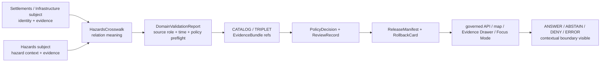

<!-- [KFM_META_BLOCK_V2]
doc_id: kfm://doc/contracts-domains-settlements-infrastructure-hazards-crosswalk
title: Hazards Crosswalk Contract — Settlements / Infrastructure
type: semantic-contract; cross-domain-crosswalk
version: v0.2
status: draft; PROPOSED; schema-missing; canonical-working-lane; slug-CONFLICTED-with-singular-settlement; contextual-only; NEEDS VERIFICATION before promotion
owners:
  - OWNER_TBD — Settlements/Infrastructure domain steward
  - OWNER_TBD — Hazards domain steward
  - OWNER_TBD — Map/UI steward
  - OWNER_TBD — Contracts steward
  - OWNER_TBD — Evidence steward
  - OWNER_TBD — Schema steward
  - OWNER_TBD — Policy steward
  - OWNER_TBD — Release steward
  - OWNER_TBD — Docs steward
created: NEEDS VERIFICATION — scaffold existed before v0.2 expansion
updated: 2026-06-23
policy_label: public; contracts; settlements-infrastructure; hazards-crosswalk; cross-domain; contextual-relation; evidence-bound; source-role-aware; temporal-scope-aware; policy-aware; sensitivity-aware; release-gated; rollback-aware; not-hazard-truth; not-settlement-truth; not-current-warning; not-regulatory-determination; not-publication-authority
tags: [kfm, contracts, settlements-infrastructure, hazards-crosswalk, hazards, crosswalk, contextual-relation, ExposureSummary, ImpactArea, ResilienceSummary, HazardEvent, HazardObservation, WarningContext, AdvisoryContext, DisasterDeclaration, FloodContext, HazardTimeline, Settlement, Municipality, CensusPlace, Townsite, GhostTown, Fort, Mission, ReservationCommunity, InfrastructureAsset, Facility, ServiceArea, EvidenceBundle, PolicyDecision, ReviewRecord, ReleaseManifest, RollbackCard]
related:
  - ./README.md
  - ./domain_feature_identity.md
  - ./domain_observation.md
  - ./domain_layer_descriptor.md
  - ./domain_validation_report.md
  - ./evidence-drawer-payload.md
  - ../settlement/README.md
  - ../../../docs/domains/settlements-infrastructure/README.md
  - ../../../docs/domains/settlements-infrastructure/CANONICAL_PATHS.md
  - ../../../docs/domains/settlements-infrastructure/MAP_UI_CONTRACTS.md
  - ../../../docs/domains/settlements-infrastructure/sublanes/settlements.md
  - ../../../docs/domains/settlements-infrastructure/sublanes/infrastructure.md
  - ../../../docs/domains/hazards/README.md
  - ../../../docs/domains/hazards/PUBLICATION_AND_BOUNDARY.md
  - ../../../contracts/domains/hazards/domain_layer_descriptor.md
  - ../../../schemas/contracts/v1/domains/settlements-infrastructure/hazards-crosswalk.schema.json
  - ../../../schemas/contracts/v1/domains/hazards/
  - ../../../policy/domains/settlements-infrastructure/
  - ../../../policy/domains/hazards/
  - ../../../fixtures/domains/settlements-infrastructure/hazards-crosswalk/
  - ../../../tests/domains/settlements-infrastructure/
  - ../../../release/candidates/settlements-infrastructure/
notes:
  - "Expanded from a PROPOSED scaffold at contracts/domains/settlements-infrastructure/hazards-crosswalk.md."
  - "A paired schema at schemas/contracts/v1/domains/settlements-infrastructure/hazards-crosswalk.schema.json was not found in this task. Field realization remains PROPOSED."
  - "Hazards doctrine owns hazard records and the boundary for hazard publication; Settlements/Infrastructure owns settlement and infrastructure identity. This file defines relation meaning only."
  - "This contract is contextual and historical/planning oriented. It does not create current-warning, emergency, regulatory, feature-truth, map-truth, graph-truth, or publication authority."
  - "The singular contracts/domains/settlement path remains a compatibility / variance surface, not a canonical replacement, unless an ADR resolves otherwise."
[/KFM_META_BLOCK_V2] -->

<a id="top"></a>

# Hazards Crosswalk Contract — Settlements / Infrastructure

> Semantic contract for `hazards-crosswalk`: the governed cross-domain relation that lets Settlements/Infrastructure features cite Hazards records as contextual evidence while preserving domain ownership, source role, temporal scope, policy posture, release state, correction lineage, and rollback targets.

<p>
  
  
  
  
  
  
  
</p>

`contracts/domains/settlements-infrastructure/hazards-crosswalk.md`

## Quick jumps

[Status](#status) · [Meaning](#meaning) · [Repo fit](#repo-fit) · [Schema posture](#schema-posture) · [Accepted uses](#accepted-uses) · [Exclusions](#exclusions) · [Recommended fields](#recommended-fields) · [Crosswalk model](#crosswalk-model) · [Relation families](#relation-families) · [Source-role and time rules](#source-role-and-time-rules) · [Publication posture](#publication-posture) · [Invariants](#invariants) · [Lifecycle](#lifecycle) · [Validation](#validation) · [Rollback](#rollback) · [Evidence basis](#evidence-basis) · [Open questions](#open-questions)

---

## Status

> [!IMPORTANT]
> **Status:** `draft` / semantic contract / cross-domain crosswalk  
> **Owner:** `OWNER_TBD`  
> **Contract path:** `contracts/domains/settlements-infrastructure/hazards-crosswalk.md`  
> **Schema path checked:** `schemas/contracts/v1/domains/settlements-infrastructure/hazards-crosswalk.schema.json` — **not found in this task**  
> **Truth posture:** target path, prior scaffold, Settlements/Infrastructure contract-lane README, Settlements/Infrastructure domain doctrine, Hazards domain doctrine, Hazards publication-boundary doctrine, and Hazards layer-descriptor pattern are confirmed from current repo evidence. Field-level shape, validator behavior, fixture coverage, policy behavior, source registry records, release manifests, governed API routes, public API behavior, map rendering, graph behavior, and runtime behavior remain **NEEDS VERIFICATION**.

> [!CAUTION]
> This contract defines relation meaning only. It does **not** create current warning authority, regulatory determination, settlement truth, infrastructure truth, hazard truth, public map approval, or AI answer authority.

---

## Meaning

`hazards-crosswalk` records a bounded relation between a Settlements/Infrastructure subject and a Hazards-domain object.

It may relate a settlement, municipality, census place, historic place, reservation community, asset, facility, service area, operator, condition observation, or dependency to Hazards context such as:

- `HazardEvent`
- `HazardObservation`
- `WarningContext`
- `AdvisoryContext`
- `DisasterDeclaration`
- `FloodContext`
- `ExposureSummary`
- `ResilienceSummary`
- `HazardTimeline`
- `ImpactArea`

The crosswalk answers:

- which Settlements/Infrastructure subject is related to which Hazards record;
- what kind of contextual relation is being asserted;
- which source role, time role, evidence, policy, review, release, and rollback states control the relation;
- what public wording or display must **not** imply.

This contract owns the **cross-domain relation meaning** only. Hazards owns hazard objects and hazard-publication boundaries. Settlements/Infrastructure owns settlement and infrastructure identity. EvidenceBundle, PolicyDecision, ReviewRecord, ReleaseManifest, correction, and rollback remain separate governance surfaces.

---

## Repo fit

| Responsibility | Path or root | Relationship |
|---|---|---|
| Parent contract lane | `./README.md` | Defines this folder as semantic contracts only. |
| Identity companion | `./domain_feature_identity.md` | Crosswalk subject identity must remain source-role/family/time/evidence aware. |
| Observation companion | `./domain_observation.md` | Observations may support a crosswalk but do not become hazard truth. |
| Layer descriptor companion | `./domain_layer_descriptor.md` | Crosswalk may be used by a layer descriptor, but layer release remains separate. |
| Validation companion | `./domain_validation_report.md` | Validation can check crosswalk support; it is not approval. |
| Evidence Drawer profile | `./evidence-drawer-payload.md` | Drawer may show the relation after evidence and policy filtering. |
| Hazards domain doctrine | `../../../docs/domains/hazards/README.md` | Defines Hazards object families, non-ownership, source-role discipline, and publication posture. |
| Hazards publication boundary | `../../../docs/domains/hazards/PUBLICATION_AND_BOUNDARY.md` | Defines publishable hazard context and what KFM must not become. |
| Hazards layer descriptor | `../../../contracts/domains/hazards/domain_layer_descriptor.md` | Sibling contract pattern for safe Hazards layer delivery. |
| Paired schema | `../../../schemas/contracts/v1/domains/settlements-infrastructure/hazards-crosswalk.schema.json` | Not found in this task; do not infer field enforcement. |
| Policy | `../../../policy/domains/settlements-infrastructure/`, `../../../policy/domains/hazards/` | Allow/deny/restrict/abstain and release controls. |
| Release/rollback | `../../../release/candidates/settlements-infrastructure/`, `../../../release/candidates/hazards/`, release roots | Release, correction, rollback, and derivative invalidation. |

---

## Schema posture

A direct paired schema was checked at:

```text
schemas/contracts/v1/domains/settlements-infrastructure/hazards-crosswalk.schema.json
```

That file was **not found** in this task.

> [!WARNING]
> Because no paired schema was confirmed, every field below is **PROPOSED** semantic guidance. Do not treat it as machine-enforced until schema, fixtures, validators, policy tests, release checks, governed API behavior, and runtime behavior are verified.

---

## Accepted uses

| Use | Allowed? | Rule |
|---|---:|---|
| Linking a Settlements/Infrastructure feature to Hazards context | Yes | Must cite both subject refs and hazard refs with evidence, source role, and time scope. |
| Supporting exposure or impact-area context | Conditional | Must preserve that Hazards owns hazard-side semantics and Settlements/Infrastructure owns subject identity. |
| Supporting resilience or planning summaries | Conditional | Must use bounded-confidence wording and evidence links. |
| Supporting public map or Evidence Drawer context | Conditional | Requires governed release, policy, review, public geometry rule, and rollback target. |
| Supporting Focus Mode explanation | Conditional | AI must cite evidence and preserve finite outcomes. |
| Showing historical warning/advisory context | Conditional | Must be historical/contextual and time-scoped, not current authority. |
| Certifying current conditions, safety, regulatory determination, or public access | No | Return `ABSTAIN`, `DENY`, or `ERROR` depending on evidence and policy posture. |
| Replacing either domain's objects | No | Use each domain's contracts, schemas, and EvidenceBundles. |

---

## Exclusions

`hazards-crosswalk` must not be used as:

| Misuse | Required outcome |
|---|---|
| Current warning authority | Use Hazards-owned release posture and official-source context rules. |
| Hazard event truth | Use Hazards-domain objects and EvidenceBundles. |
| Settlement or infrastructure feature truth | Use Settlements/Infrastructure object-family contracts and EvidenceBundles. |
| Regulatory determination | Use official-source evidence and policy-reviewed wording. |
| Public access or safe-route guidance | `DENY` or `ABSTAIN`; outside this contract. |
| Feature condition or dependency disclosure | Require policy/review and public-safe filtering. |
| Publication approval | Use PolicyDecision, ReviewRecord, ReleaseManifest, correction path, and RollbackCard. |
| AI answer authority | Focus Mode remains evidence-subordinate and finite-outcome constrained. |

---

## Recommended fields

The following fields are **PROPOSED** until a paired schema is added and validated.

| Field | Meaning |
|---|---|
| `id` | Canonical hazards-crosswalk relation identifier. |
| `version` | Contract/object version. |
| `spec_hash` | Deterministic hash over normalized relation content. |
| `domain` | Expected value: `settlements-infrastructure`. |
| `crosswalk_type` | Exposure, impact-area, declaration-context, hazard-timeline, flood-context, warning-context, resilience, review-only, denied, or source-specific type. |
| `settlement_infrastructure_subject_ref` | DomainFeatureIdentity or object-family ref for the Settlements/Infrastructure subject. |
| `settlement_infrastructure_family` | Settlement, Municipality, CensusPlace, GhostTown, Facility, ServiceArea, InfrastructureAsset, Dependency, etc. |
| `hazards_subject_ref` | Hazards-domain object ref. |
| `hazards_family` | HazardEvent, HazardObservation, WarningContext, FloodContext, ExposureSummary, ImpactArea, etc. |
| `relation_statement` | Human-readable scoped relation statement. |
| `relation_method` | Spatial join, temporal join, administrative join, source cross-reference, model output, aggregate rollup, manual review, or source-specific method. |
| `source_refs` | SourceDescriptor refs from both sides where needed. |
| `evidence_refs` | EvidenceRefs or EvidenceBundle refs. |
| `source_role_summary` | Source-role posture across domains. |
| `temporal_scope` | Source time, observed time, valid time, issue time, expiry time, retrieval time, release time, correction time. |
| `public_geometry_rule` | Exact, generalized, aggregate, hidden, denied, or review-only posture. |
| `contextual_boundary` | Required statement that the relation is context only and not a current-authority surface. |
| `freshness_or_expiry_state` | Fresh, stale, expired, historical, unknown, or not applicable. |
| `sensitivity_label` | Sensitivity/policy tier inherited from both domains. |
| `policy_decision_ref` | PolicyDecision governing use/publication. |
| `review_ref` | ReviewRecord or steward review ref. |
| `release_manifest_ref` | ReleaseManifest or MapReleaseManifest ref. |
| `rollback_ref` | RollbackCard or rollback target. |
| `limitations` | Caveats: crosswalk only; not hazard truth, not release approval. |

---

## Crosswalk model

A reviewed crosswalk should bind one Settlements/Infrastructure subject to one or more Hazards refs while preserving ownership boundaries.

```text
hazards_crosswalk = {
  domain,
  crosswalk_type,
  settlement_infrastructure_subject_ref,
  hazards_subject_ref,
  relation_method,
  source_role_summary,
  evidence_refs,
  temporal_scope,
  contextual_boundary,
  policy_decision_ref,
  review_ref,
  release_manifest_ref,
  rollback_ref
}
```

The exact serialized shape is **NEEDS VERIFICATION** until the schema and validators are field-complete.

---

## Relation families

| Relation family | Meaning | Guardrail |
|---|---|---|
| `exposure_context` | Subject is included in an exposure summary or planning context. | Exposure is context, not authority. |
| `impact_area_context` | Subject intersects or relates to an impact-area record. | ImpactArea is Hazards-owned and release-gated. |
| `declaration_context` | Subject relates to a declaration or administrative context. | Administrative context is not settlement truth. |
| `flood_context` | Subject relates to FloodContext. | Preserve version, source role, and caveats. |
| `warning_or_advisory_history` | Subject relates to a warning/advisory/watch context. | Historical/context only; preserve issue/expiry. |
| `hazard_timeline_context` | Subject appears in a hazard timeline. | Temporal roles must stay visible. |
| `resilience_summary_context` | Subject participates in a resilience or planning summary. | Bounded-confidence and aggregation caveats required. |
| `review_only_context` | Relation is held for steward/policy review. | Not public until release gates pass. |
| `denied_context` | Relation cannot be exposed under current policy/evidence. | Show safe denial reason only, if surfaced at all. |

---

## Source-role and time rules

| Rule | Requirement |
|---|---|
| Domain ownership stays explicit | Hazards owns hazard records; Settlements/Infrastructure owns subject identity. |
| Source role never collapses | Observed, modeled, regulatory, administrative, aggregate, candidate, contextual, and synthetic support remain distinct. |
| Warning context is time-scoped | Any warning/advisory/watch material must preserve issue/expiry and historical/contextual posture. |
| Time axes remain separate | Hazard event time, observation time, warning issue/expiry, declaration effective/closed dates, subject valid time, retrieval time, release time, and correction time must not collapse. |
| Candidate joins stay candidate | Spatial overlap, OCR, model, map label, or connector suggestion does not create public truth. |
| Public claims require EvidenceBundle resolution | If evidence cannot resolve, return ABSTAIN, DENY, or ERROR; do not invent the relation. |

---

## Publication posture

| Surface | Default posture | Reason |
|---|---|---|
| Historical hazard relation to public settlement feature | Public-safe if released | Still needs source role, time scope, EvidenceBundle, and release state. |
| Hazard relation to sensitive subject detail | Restrict, generalize, or deny by default | Crosswalk can expose protected context. |
| Warning/advisory/watch context | Historical/context only | Must not imply current authority. |
| Flood/regulatory context | Version-pinned and caveated | Context is not automatically event or forecast truth. |
| Exposure/resilience summary | Aggregate/public-safe only | Summary must not overstate confidence. |
| Candidate/model relation | Review only | Automated relation does not close evidence. |

---

## Invariants

1. **Crosswalk is not ownership transfer.** Each domain keeps its own truth authority.
2. **Context is not current authority.** Hazard context must not become a current warning, directive, or regulatory determination.
3. **Evidence outranks relation.** A crosswalk cannot strengthen weak or unresolved evidence.
4. **Time is part of meaning.** Issue/expiry/effective/observed/valid/release/correction times must stay distinct where material.
5. **Public geometry is policy-filtered.** Sensitive relations may require aggregation, generalization, review-only status, or denial.
6. **Release is separate.** A valid relation does not publish anything without PolicyDecision, ReviewRecord, ReleaseManifest, and RollbackCard where required.
7. **AI is downstream.** Focus Mode may explain only released evidence and policy-permitted context.
8. **No direct internal-store reads.** Public clients use governed APIs and released artifacts only.
9. **Singular `settlement` remains conflicted.** Do not route canonical crosswalks through the singular compatibility path without ADR.

---

## Lifecycle



Contracts describe meaning. They do not move data, validate schema shape, execute joins, decide policy, publish artifacts, render maps, or authorize AI answers.

---

## Validation

Before this contract is treated as mature, maintainers should verify:

- [ ] whether this crosswalk needs a paired schema or should be represented through existing relation/triplet schemas;
- [ ] schema includes subject refs for both domains, relation family, source-role summary, time axes, contextual boundary, policy/review/release/rollback refs, and public geometry rule;
- [ ] fixtures cover exposure, impact-area, declaration, flood, warning/advisory history, timeline, resilience, review-only, denied, and stale/expired contexts;
- [ ] tests prevent crosswalks from becoming hazard truth, settlement/infrastructure truth, current warning authority, regulatory determination, public-access guidance, or publication approval;
- [ ] tests enforce ABSTAIN/DENY/ERROR when evidence, source role, sensitivity, freshness, or release state is unresolved;
- [ ] rollback invalidates layer descriptors, drawer payloads, Focus Mode citations, exports, caches, graph projections, and AI summaries that cited a withdrawn crosswalk.

---

## Rollback

Rollback is required if this contract:

- claims schema, validator, fixture, test, policy, release, API, map, graph, or runtime behavior exists without proof;
- treats hazard crosswalks as hazard-event truth, current warning authority, regulatory determination, settlement/infrastructure truth, public access guidance, release approval, or AI authority;
- hides issue/expiry/stale state or contextual posture;
- exposes sensitive relations through examples, public wording, map layers, or drawer text;
- normalizes direct UI access to internal lifecycle stores or direct model output;
- treats the singular `settlement` path as canonical authority without ADR support.

Rollback target: revert `contracts/domains/settlements-infrastructure/hazards-crosswalk.md` to prior scaffold blob `6812953dd4f7edad2d2d7a5f2645b3c37ce1abbe`, record drift if authority boundaries were affected, and invalidate downstream derivatives that relied on weakened hazards-crosswalk semantics.

---

## Evidence basis

| Evidence | Status | Supports | Limits |
|---|---|---|---|
| Prior `contracts/domains/settlements-infrastructure/hazards-crosswalk.md` | `CONFIRMED` | Target file existed as a PROPOSED scaffold sourced from the expansion backlog. | Scaffold did not define authoritative semantic contract content. |
| Paired schema lookup | `CONFIRMED not found in this task` | Justifies schema-missing posture. | Does not rule out alternate schema names or future ADR-selected homes. |
| `contracts/domains/settlements-infrastructure/README.md` | `CONFIRMED contract-lane rule` | Defines this folder as semantic meaning only and points schemas, policy, tests, data, release, and public artifacts to separate roots. | Does not define hazards-crosswalk fields. |
| `docs/domains/settlements-infrastructure/README.md` | `CONFIRMED doctrine / PROPOSED implementation` | Confirms Settlements/Infrastructure object families, lifecycle, and source/temporal identity posture. | Does not prove crosswalk schema/validator/test implementation. |
| `docs/domains/hazards/README.md` | `CONFIRMED hazards doctrine / PROPOSED implementation` | Defines Hazards mission, object families, non-ownership of settlement/infrastructure truth, and publication boundary. | Does not prove crosswalk implementation. |
| `docs/domains/hazards/PUBLICATION_AND_BOUNDARY.md` | `CONFIRMED hazards publication doctrine / PROPOSED implementation` | Defines publishable hazard context, deny-by-default promotion gate, governed publication path, and release requirements. | Does not prove enforcement exists. |
| `contracts/domains/hazards/domain_layer_descriptor.md` | `CONFIRMED sibling pattern` | Provides Hazards delivery-support contract pattern with contextual display obligations and source-role/time posture. | Hazards-specific; adapted only where relevant. |
| Uploaded KFM authoring prompt v2 | `CONFIRMED user-supplied guidance` | Requires evidence-first, implementation-honest, visually polished Markdown with visible verification and rollback posture. | Authoring guidance, not implementation proof. |

---

## Open questions

| ID | Question | Status |
|---|---|---|
| OQ-SI-HAZ-XW-01 | Should `hazards-crosswalk.md` be a standalone contract, a relation schema, or a section of a broader cross-domain relation contract? | OPEN / DOMAIN + SCHEMA REVIEW |
| OQ-SI-HAZ-XW-02 | Which Hazards object families may be linked to which Settlements/Infrastructure object families? | OPEN / CROSS-DOMAIN REVIEW |
| OQ-SI-HAZ-XW-03 | Which fields are required to preserve warning/advisory issue/expiry, stale state, and contextual posture? | OPEN / HAZARDS REVIEW |
| OQ-SI-HAZ-XW-04 | Which relation families must default to aggregation, generalization, review-only status, or denial? | OPEN / POLICY REVIEW |
| OQ-SI-HAZ-XW-05 | How should Evidence Drawer and Focus Mode present hazard crosswalks without implying current public action? | OPEN / MAP/UI REVIEW |
| OQ-SI-HAZ-XW-06 | How should rollback invalidate map labels, drawer payloads, Focus Mode claims, exports, caches, and AI summaries after a crosswalk correction? | OPEN / RELEASE REVIEW |

<p align="right"><a href="#top">Back to top</a></p>
