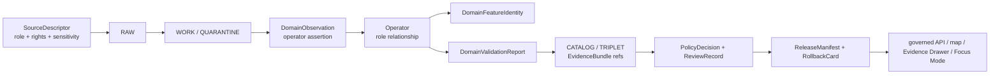

<!-- [KFM_META_BLOCK_V2]
doc_id: kfm://doc/contracts-domains-settlements-infrastructure-operator
title: Operator Contract — Settlements / Infrastructure
type: semantic-contract
version: v0.2
status: draft; PROPOSED; schema-missing; canonical-working-lane; slug-CONFLICTED-with-singular-settlement; NEEDS VERIFICATION before promotion
owners:
  - OWNER_TBD — Settlements/Infrastructure domain steward
  - OWNER_TBD — Infrastructure-side steward
  - OWNER_TBD — Source steward
  - OWNER_TBD — Evidence steward
  - OWNER_TBD — Policy steward
  - OWNER_TBD — Contracts steward
  - OWNER_TBD — Schema steward
  - OWNER_TBD — Release steward
  - OWNER_TBD — Docs steward
created: NEEDS VERIFICATION — scaffold existed before v0.2 expansion
updated: 2026-06-23
policy_label: public; contracts; settlements-infrastructure; operator; infrastructure-side; source-role-aware; temporal-scope-aware; evidence-bound; policy-aware; sensitivity-aware; operator-sensitive; release-gated; rollback-aware; not-legal-entity-truth; not-ownership-proof; not-public-access; not-contact-directory; not-publication-authority
tags: [kfm, contracts, settlements-infrastructure, operator, InfrastructureAsset, NetworkNode, NetworkSegment, Facility, ServiceArea, ConditionObservation, Dependency, SourceDescriptor, EvidenceRef, EvidenceBundle, DomainFeatureIdentity, DomainObservation, DomainValidationReport, EvidenceDrawerPayload, PolicyDecision, ReviewRecord, ReleaseManifest, RollbackCard]
related:
  - ./README.md
  - ./domain_feature_identity.md
  - ./domain_observation.md
  - ./domain_layer_descriptor.md
  - ./domain_validation_report.md
  - ./evidence-drawer-payload.md
  - ./facility.md
  - ./service_area.md
  - ./infrastructure_asset.md
  - ./dependency.md
  - ../settlement/README.md
  - ../../../docs/domains/settlements-infrastructure/README.md
  - ../../../docs/domains/settlements-infrastructure/CANONICAL_PATHS.md
  - ../../../docs/domains/settlements-infrastructure/sublanes/infrastructure.md
  - ../../../docs/domains/settlements-infrastructure/sublanes/settlements.md
  - ../../../schemas/contracts/v1/domains/settlements-infrastructure/operator.schema.json
  - ../../../policy/domains/settlements-infrastructure/
  - ../../../fixtures/domains/settlements-infrastructure/operator/
  - ../../../tests/domains/settlements-infrastructure/
  - ../../../release/candidates/settlements-infrastructure/
notes:
  - "Expanded from a PROPOSED scaffold at contracts/domains/settlements-infrastructure/operator.md."
  - "A paired schema at schemas/contracts/v1/domains/settlements-infrastructure/operator.schema.json was not found in this task. Field realization remains PROPOSED."
  - "Infrastructure-side doctrine defines Operator as the public, private, or tribal entity that owns or operates assets, networks, or facilities. This contract narrows that into an operator-role object, not full legal-entity, ownership, title, contact-directory, or public-access truth."
  - "Operator claims may be sensitive when joined to facilities, assets, service areas, condition observations, dependencies, or private/living-person context; public use requires policy, review, release, and rollback support."
  - "The singular contracts/domains/settlement path remains a compatibility / variance surface, not a canonical replacement, unless an ADR resolves otherwise."
[/KFM_META_BLOCK_V2] -->

<a id="top"></a>

# Operator Contract — Settlements / Infrastructure

> Semantic contract for `Operator`: the infrastructure-side role object that links a public, private, tribal, municipal, agency, utility, or other accountable operator to an infrastructure asset, network, facility, service area, condition observation, or dependency — without becoming legal-entity truth, ownership proof, contact-directory data, public-access guidance, policy decision, map truth, graph truth, or publication approval.

<p>
  
  
  
  
  
  
  
</p>

`contracts/domains/settlements-infrastructure/operator.md`

## Quick jumps

[Status](#status) · [Meaning](#meaning) · [Repo fit](#repo-fit) · [Schema posture](#schema-posture) · [Accepted uses](#accepted-uses) · [Exclusions](#exclusions) · [Recommended fields](#recommended-fields) · [Operator role model](#operator-role-model) · [Source-role and time rules](#source-role-and-time-rules) · [Sensitivity and publication posture](#sensitivity-and-publication-posture) · [Invariants](#invariants) · [Lifecycle](#lifecycle) · [Validation](#validation) · [Rollback](#rollback) · [Evidence basis](#evidence-basis) · [Open questions](#open-questions)

---

## Status

> [!IMPORTANT]
> **Status:** `draft` / semantic contract  
> **Owner:** `OWNER_TBD`  
> **Contract path:** `contracts/domains/settlements-infrastructure/operator.md`  
> **Schema path checked:** `schemas/contracts/v1/domains/settlements-infrastructure/operator.schema.json` — **not found in this task**  
> **Truth posture:** target path, prior scaffold, contract-lane README, parent domain doctrine, and infrastructure-side object-family dossier are confirmed from current repo evidence. Field-level shape, validator behavior, fixture coverage, policy behavior, source registry records, release manifests, governed API routes, public API behavior, map rendering, graph behavior, and runtime behavior remain **NEEDS VERIFICATION**.

> [!CAUTION]
> This contract defines operator-role meaning only. It does **not** prove ownership, legal status, regulatory authority, contact details, public access, service guarantees, infrastructure condition, dependency exposure, public map release, or AI answer authority.

---

## Meaning

`Operator` is the role-bearing object that records who or what source says is responsible for owning, operating, managing, maintaining, administering, or otherwise being associated with a Settlements/Infrastructure subject.

It may relate an operator to:

- `InfrastructureAsset`
- `NetworkNode`
- `NetworkSegment`
- `Facility`
- `ServiceArea`
- `ConditionObservation`
- `Dependency`
- related settlement-side context such as `Municipality`, `ReservationCommunity`, or another public entity where the source supports that role

The object answers:

- What operator role is asserted?
- Which source asserted the role, and under what source role?
- Which asset, facility, service area, or network is in scope?
- What time interval does the role apply to?
- What evidence supports it?
- What policy and release restrictions apply before public display?
- What must be corrected or rolled back if the role is superseded?

This contract owns the **operator role meaning**. It does not own the full legal entity record, ownership/title proof, licensing status, procurement history, staff/person records, contact directory, direct facility details, or public service guarantees.

---

## Repo fit

| Responsibility | Path or root | Relationship |
|---|---|---|
| Parent contract lane | `./README.md` | Defines this folder as semantic contracts only. |
| Feature identity companion | `./domain_feature_identity.md` | Operator identity must remain source-role/family/time/evidence/sensitivity aware. |
| Observation companion | `./domain_observation.md` | Operator observations may support this object but do not become role truth by themselves. |
| Validation companion | `./domain_validation_report.md` | Validation can check operator role support; it is not approval. |
| Evidence Drawer profile | `./evidence-drawer-payload.md` | Drawer may show public-safe operator posture after evidence/policy filtering. |
| Compatibility / variance path | `../settlement/README.md` | Singular `settlement` path is a warning surface, not canonical authority unless ADR resolves otherwise. |
| Infrastructure-side dossier | `../../../docs/domains/settlements-infrastructure/sublanes/infrastructure.md` | Defines infrastructure-side object families, including Operator. |
| Parent domain doctrine | `../../../docs/domains/settlements-infrastructure/README.md` | Names Operator as one of sixteen domain object families and preserves source/time discipline. |
| Paired schema | `../../../schemas/contracts/v1/domains/settlements-infrastructure/operator.schema.json` | Not found in this task; do not infer field enforcement. |
| Policy | `../../../policy/domains/settlements-infrastructure/` and sensitivity-policy roots | Allow/deny/restrict/abstain behavior for operator-related publication. |
| Release/rollback | `../../../release/candidates/settlements-infrastructure/` and release roots | Publication, correction, and rollback authority. |

---

## Schema posture

A direct paired schema was checked at:

```text
schemas/contracts/v1/domains/settlements-infrastructure/operator.schema.json
```

That file was **not found** in this task.

> [!WARNING]
> Because no paired schema was confirmed, every field below is **PROPOSED** semantic guidance. Do not treat it as machine-enforced until schema, fixtures, validators, policy tests, release checks, governed API behavior, and runtime behavior are verified.

---

## Accepted uses

| Use | Allowed? | Rule |
|---|---:|---|
| Recording a source-scoped operator role | Yes | Must preserve source, source role, subject ref, role type, time scope, evidence refs, and limitations. |
| Linking an operator to an asset, network, facility, or service area | Yes | Link must be evidence-bound and time-scoped. |
| Distinguishing owner, operator, maintainer, administrator, provider, and related roles | Yes | Role type must not collapse into generic “responsible party.” |
| Supporting Evidence Drawer or Focus Mode context | Conditional | Requires EvidenceBundle, policy, review, release state, and public-safe field filtering. |
| Supporting service-area or dependency interpretation | Conditional | Must preserve sensitivity posture and not overstate service guarantees. |
| Proving legal identity, ownership, title, license, contact details, or public access | No | Requires owning legal/source lanes and review; this contract is role meaning only. |
| Exposing sensitive operational joins | No by default | Restrict/generalize/deny unless policy and release allow public display. |

---

## Exclusions

`Operator` must not be used as:

| Misuse | Required outcome |
|---|---|
| Legal entity registry | Use legal/entity/source-governance roots when available. |
| Ownership or title proof | Use People/Land/legal-source lanes and policy review. |
| Contact directory | Do not store or publish person/contact details here. |
| Public access or service guarantee | Use official source context and policy-reviewed wording, or abstain. |
| Asset/facility payload | Use `InfrastructureAsset` or `Facility` object contracts/schemas. |
| Condition or status proof | Use `ConditionObservation` semantics and evidence/policy gates. |
| Dependency disclosure | Use `Dependency` semantics and fail-closed policy posture. |
| Policy decision | Use PolicyDecision and policy roots. |
| Release approval | Use ReviewRecord, ReleaseManifest, and RollbackCard. |
| AI answer authority | Focus Mode remains evidence-subordinate and finite-outcome constrained. |

---

## Recommended fields

The following fields are **PROPOSED** until a paired schema is added and validated.

| Field | Meaning |
|---|---|
| `id` | Canonical Operator role identifier. |
| `version` | Contract/object version. |
| `spec_hash` | Deterministic hash over normalized operator-role content. |
| `domain` | Expected value: `settlements-infrastructure`. |
| `operator_name` | Source-supported operator display name or normalized name key. |
| `operator_role_type` | Owner, operator, maintainer, manager, administrator, provider, authority, contractor, candidate, former, or source-specific role. |
| `operator_category` | Public, municipal, tribal, private, cooperative, state, federal, nonprofit, regional, unknown, or source-specific category. |
| `subject_ref` | Asset, facility, network, segment, node, service area, condition observation, dependency, or settlement-side context ref. |
| `subject_family` | InfrastructureAsset, Facility, ServiceArea, NetworkNode, NetworkSegment, Dependency, etc. |
| `source_ref` | SourceDescriptor/source registry reference. |
| `source_role` | Accepted source role for the role assertion. |
| `source_native_id` | Source-native operator, facility, asset, or registry key where available. |
| `role_statement` | Human-readable scoped statement of the asserted role. |
| `observed_time` | Time the role was observed/recorded. |
| `source_time` | Source creation/publication/update time. |
| `valid_time` | Interval the role applies to, if known. |
| `retrieval_time` | KFM retrieval/freeze time. |
| `evidence_refs` | EvidenceRefs or EvidenceBundle refs. |
| `confidence_label` | Candidate, contextual, corroborated, primary, contested, superseded, unknown, or review-only once schema defines enums. |
| `policy_decision_ref` | PolicyDecision governing use/publication. |
| `review_ref` | ReviewRecord or steward review ref. |
| `release_manifest_ref` | ReleaseManifest or MapReleaseManifest ref. |
| `rollback_ref` | RollbackCard or rollback target. |
| `public_visibility_rule` | Public, summarized, generalized, review-only, restricted, denied, or source-specific. |
| `sensitivity_label` | Sensitivity/policy tier inherited from role, subject, source, location, dependency, condition, or people/land adjacency. |
| `limitations` | Caveats: operator role only; not legal entity, not ownership proof, not contact directory, not release approval. |

---

## Operator role model

| Role profile | Meaning | Guardrail |
|---|---|---|
| `owner_role` | Source asserts ownership or ownership-like responsibility. | Do not treat as legal/title proof without owning evidence. |
| `operator_role` | Source asserts operation or control of a facility, asset, system, or service area. | Role is time-scoped and source-scoped. |
| `maintainer_role` | Source asserts maintenance responsibility. | Do not infer ownership or service guarantees. |
| `administrator_role` | Source asserts administrative or jurisdictional role. | Administrative role is not asset condition or service truth. |
| `provider_role` | Source asserts service provision. | Must not overstate availability, quality, or current service. |
| `former_role` | Source asserts a past operator relationship. | Valid-time and supersession are required. |
| `candidate_role` | OCR, model, connector, map label, or incomplete source suggests a role. | Candidate only until reviewed. |
| `contested_role` | Sources conflict or cannot be reconciled. | Surface conflict or abstain; do not pick a winner by tone. |

---

## Source-role and time rules

| Rule | Requirement |
|---|---|
| Source role is never collapsed | Operator self-reports, regulator records, inventories, maps, audits, local records, and model/OCR outputs keep distinct authority. |
| Operator role is not legal proof | A role assertion may support context; it does not prove legal identity, ownership, or title by itself. |
| Valid time is required where material | Current, former, candidate, superseded, and historical roles must not collapse. |
| Role and subject are separate | Operator identity does not become asset/facility identity; it links to those objects. |
| Sensitive joins are policy-filtered | Public display must respect the most restrictive subject, source, role, and relation posture. |
| Public claims require EvidenceBundle resolution | If EvidenceRef cannot resolve to EvidenceBundle, the correct outcome is ABSTAIN, DENY, or ERROR. |

---

## Sensitivity and publication posture

| Surface | Default posture | Reason |
|---|---|---|
| Public municipal or agency operator name | Public-safe if evidence and release support it | Source role, valid time, and release state still matter. |
| Private or mixed operator role | Review / summarize where needed | Role may intersect rights, business, facility, or service context. |
| Tribal or sovereignty-linked operator role | Review / summarize by default | Sovereignty and cultural context may require steward review. |
| Operator tied to sensitive asset, condition, dependency, or service-area detail | Restrict, generalize, or deny by default | Role relation may reveal sensitive context. |
| Candidate/model/OCR operator relation | Review only | Generated or extracted support does not close evidence. |
| Contact/person detail | Deny from this contract | Living-person/contact data belongs elsewhere and requires strict controls. |

---

## Invariants

1. **Operator is a role object, not a full legal entity.** It describes a relationship asserted by a source.
2. **Operator is not ownership proof.** Ownership/title/legal status require owning evidence and review.
3. **Operator is not the asset.** Assets, facilities, service areas, networks, conditions, and dependencies stay in their own object families.
4. **Source role is first-class.** Administrative, observed, regulatory, aggregate, candidate, modeled, and synthetic support must not collapse.
5. **Time axes remain separate.** Source time, observed time, valid time, retrieval time, release time, correction time, and supersession time remain distinct where material.
6. **Sensitivity travels with role joins.** Public display must reflect the most restrictive relevant evidence/policy posture.
7. **Evidence must resolve.** Consequential public claims require EvidenceRef to resolve to EvidenceBundle.
8. **Release is separate.** A valid operator role does not publish anything without PolicyDecision, ReviewRecord, ReleaseManifest, and RollbackCard where required.
9. **AI remains downstream.** Focus Mode may explain released operator context but cannot elevate authority posture.
10. **Singular `settlement` remains conflicted.** Do not route canonical operator work through the singular compatibility path without ADR.

---

## Lifecycle



Contracts describe meaning. They do not move data, validate schema shape, execute source ingestion, decide policy, publish artifacts, render maps, or authorize AI answers.

---

## Validation

Before this contract is treated as mature, maintainers should verify:

- [ ] paired schema exists and includes operator role type, subject refs, source role, source-native IDs, evidence refs, time axes, sensitivity label, policy/review/release/rollback refs, and public visibility rule;
- [ ] fixtures cover owner, operator, maintainer, administrator, provider, former, candidate, contested, tribal/sovereignty-linked, private, and public roles;
- [ ] tests prevent operator roles from becoming ownership proof, legal entity truth, contact directory, public-access guidance, condition truth, dependency disclosure, release approval, or AI authority;
- [ ] tests preserve source-role and time-axis distinctions;
- [ ] tests enforce ABSTAIN/DENY/ERROR when evidence, source role, sensitivity, valid time, or release state is unresolved;
- [ ] public map, Evidence Drawer, Focus Mode, exports, and AI summaries use only released/governed operator projections;
- [ ] rollback invalidates linked identities, observations, layers, drawer payloads, exports, caches, graph projections, and AI summaries that cited a withdrawn operator role.

---

## Rollback

Rollback is required if this contract:

- claims schema, validator, fixture, test, policy, release, API, map, graph, or runtime behavior exists without proof;
- treats operator roles as legal-entity truth, ownership proof, contact-directory data, public-access guidance, condition truth, dependency disclosure, release approval, or AI authority;
- hides source-role conflict, candidate status, valid-time limits, supersession, or correction lineage;
- exposes sensitive operator joins through examples, public wording, map layers, or drawer text;
- normalizes direct UI access to internal lifecycle stores or direct model output;
- treats the singular `settlement` path as canonical authority without ADR support.

Rollback target: revert `contracts/domains/settlements-infrastructure/operator.md` to prior scaffold blob `167db332bb28784b8d8e0c5c03ad820a4aadc501`, record drift if authority boundaries were affected, and invalidate downstream derivatives that relied on weakened operator semantics.

---

## Evidence basis

| Evidence | Status | Supports | Limits |
|---|---|---|---|
| Prior `contracts/domains/settlements-infrastructure/operator.md` | `CONFIRMED` | Target file existed as a PROPOSED scaffold sourced from the expansion backlog. | Scaffold did not define authoritative semantic contract content. |
| Paired schema lookup | `CONFIRMED not found in this task` | Justifies schema-missing posture. | Does not rule out alternate schema names or future ADR-selected homes. |
| `contracts/domains/settlements-infrastructure/README.md` | `CONFIRMED contract-lane rule` | Defines this folder as semantic meaning only and points schemas, policy, tests, data, release, and public artifacts to separate roots. | Does not define Operator fields. |
| `docs/domains/settlements-infrastructure/README.md` | `CONFIRMED doctrine / PROPOSED implementation` | Names `Operator` as one of sixteen domain object families and preserves source/time posture. | Does not prove object-level schema/validator/test implementation. |
| `docs/domains/settlements-infrastructure/sublanes/infrastructure.md` | `CONFIRMED doctrine / PROPOSED field realization` | Defines Operator as the public, private, or tribal entity that owns or operates assets, networks, or facilities, and describes infrastructure-side non-ownership boundaries. | Dossier uses some terms that remain PROPOSED/CONFLICTED and does not prove enforcement. |
| Uploaded KFM authoring prompt v2 | `CONFIRMED user-supplied guidance` | Requires evidence-first, implementation-honest, visually polished Markdown with visible verification and rollback posture. | Authoring guidance, not implementation proof. |

---

## Open questions

| ID | Question | Status |
|---|---|---|
| OQ-SI-OP-01 | Should Operator be modeled as an object-family record, a role edge, or both? | OPEN / DOMAIN + SCHEMA REVIEW |
| OQ-SI-OP-02 | Which operator role enum is canonical across facilities, assets, networks, service areas, and dependencies? | OPEN / SCHEMA REVIEW |
| OQ-SI-OP-03 | Which source families are sufficient for current operator, former operator, owner, maintainer, provider, and administrator roles? | OPEN / SOURCE REVIEW |
| OQ-SI-OP-04 | Which operator joins require default generalization, review-only handling, or denial? | OPEN / POLICY REVIEW |
| OQ-SI-OP-05 | How should Evidence Drawer and Focus Mode present operator roles without implying legal ownership, public access, or service guarantees? | OPEN / MAP/UI REVIEW |
| OQ-SI-OP-06 | How should rollback invalidate maps, drawer payloads, Focus Mode claims, exports, caches, graph projections, and AI summaries after an operator-role correction? | OPEN / RELEASE REVIEW |

<p align="right"><a href="#top">Back to top</a></p>
