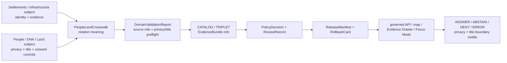

<!-- [KFM_META_BLOCK_V2]
doc_id: kfm://doc/contracts-domains-settlements-infrastructure-people-land-crosswalk
title: People / Land Crosswalk Contract — Settlements / Infrastructure
type: semantic-contract; cross-domain-crosswalk
version: v0.2
status: draft; PROPOSED; schema-missing; canonical-working-lane; slug-CONFLICTED-with-singular-settlement; privacy-first; NEEDS VERIFICATION before promotion
owners:
  - OWNER_TBD — Settlements/Infrastructure domain steward
  - OWNER_TBD — People/DNA/Land domain steward
  - OWNER_TBD — Living-person privacy steward
  - OWNER_TBD — Land/title assertion steward
  - OWNER_TBD — Consent steward
  - OWNER_TBD — Contracts steward
  - OWNER_TBD — Evidence steward
  - OWNER_TBD — Schema steward
  - OWNER_TBD — Policy steward
  - OWNER_TBD — Release steward
  - OWNER_TBD — Docs steward
created: NEEDS VERIFICATION — scaffold existed before v0.2 expansion
updated: 2026-06-23
policy_label: restricted-review; contracts; settlements-infrastructure; people-land-crosswalk; cross-domain; contextual-relation; living-person-aware; title-sensitive; parcel-context-sensitive; consent-aware; evidence-bound; source-role-aware; temporal-scope-aware; policy-aware; release-gated; rollback-aware; not-person-truth; not-title-opinion; not-ownership-proof; not-parcel-boundary; not-consent-store; not-publication-authority
tags: [kfm, contracts, settlements-infrastructure, people-dna-land, people-land-crosswalk, crosswalk, contextual-relation, Settlement, Municipality, CensusPlace, Townsite, GhostTown, Fort, Mission, ReservationCommunity, InfrastructureAsset, Facility, ServiceArea, Operator, PersonAssertion, ResidenceEvent, LandOwnershipAssertion, OwnershipInterval, LandInstrument, AssessorRecord, TaxRecord, LandParcel, LegalDescription, ParcelVersion, ConsentGrant, RevocationReceipt, EvidenceBundle, PolicyDecision, ReviewRecord, ReleaseManifest, RollbackCard]
related:
  - ./README.md
  - ./domain_feature_identity.md
  - ./domain_observation.md
  - ./domain_layer_descriptor.md
  - ./domain_validation_report.md
  - ./evidence-drawer-payload.md
  - ./operator.md
  - ../settlement/README.md
  - ../../../contracts/domains/people-dna-land/README.md
  - ../../../contracts/domains/people-dna-land/LandInstrument.md
  - ../../../docs/domains/settlements-infrastructure/README.md
  - ../../../docs/domains/settlements-infrastructure/CANONICAL_PATHS.md
  - ../../../docs/domains/settlements-infrastructure/sublanes/settlements.md
  - ../../../docs/domains/settlements-infrastructure/sublanes/infrastructure.md
  - ../../../docs/domains/people-dna-land/LAND_OWNERSHIP.md
  - ../../../docs/domains/people-dna-land/SENSITIVITY.md
  - ../../../docs/domains/people-dna-land/CONSENT_MODEL.md
  - ../../../schemas/contracts/v1/domains/settlements-infrastructure/people-land-crosswalk.schema.json
  - ../../../schemas/contracts/v1/domains/people-dna-land/
  - ../../../policy/domains/settlements-infrastructure/
  - ../../../policy/domains/people-dna-land/
  - ../../../fixtures/domains/settlements-infrastructure/people-land-crosswalk/
  - ../../../tests/domains/settlements-infrastructure/
  - ../../../release/candidates/settlements-infrastructure/
  - ../../../release/candidates/people-dna-land/
notes:
  - "Expanded from a PROPOSED scaffold at contracts/domains/settlements-infrastructure/people-land-crosswalk.md."
  - "A paired schema at schemas/contracts/v1/domains/settlements-infrastructure/people-land-crosswalk.schema.json was not found in this task. Field realization remains PROPOSED."
  - "People/DNA/Land doctrine treats living-person, DNA/genomic, private person-parcel, and land/title surfaces as high-risk and fail-closed. This crosswalk preserves that boundary."
  - "Land doctrine states that KFM records evidence and does not issue title opinions; assessor/tax records are not title truth and parcel geometry is not a title boundary."
  - "This contract defines contextual cross-domain relation meaning. It does not author person truth, title truth, ownership proof, parcel-boundary truth, consent records, map truth, graph truth, policy decision, or publication approval."
  - "The singular contracts/domains/settlement path remains a compatibility / variance surface, not a canonical replacement, unless an ADR resolves otherwise."
[/KFM_META_BLOCK_V2] -->

<a id="top"></a>

# People / Land Crosswalk Contract — Settlements / Infrastructure

> Semantic contract for `people-land-crosswalk`: the governed cross-domain relation that lets Settlements/Infrastructure features cite People/DNA/Land records as contextual evidence while preserving privacy, consent, title, source-role, temporal-scope, policy, release, correction, and rollback boundaries.

<p>
  
  
  
  
  
  
  
  
</p>

`contracts/domains/settlements-infrastructure/people-land-crosswalk.md`

## Quick jumps

[Status](#status) · [Meaning](#meaning) · [Repo fit](#repo-fit) · [Schema posture](#schema-posture) · [Accepted uses](#accepted-uses) · [Exclusions](#exclusions) · [Recommended fields](#recommended-fields) · [Crosswalk model](#crosswalk-model) · [Relation families](#relation-families) · [Source-role and time rules](#source-role-and-time-rules) · [Privacy and publication posture](#privacy-and-publication-posture) · [Invariants](#invariants) · [Lifecycle](#lifecycle) · [Validation](#validation) · [Rollback](#rollback) · [Evidence basis](#evidence-basis) · [Open questions](#open-questions)

---

## Status

> [!IMPORTANT]
> **Status:** `draft` / semantic contract / cross-domain crosswalk  
> **Owner:** `OWNER_TBD`  
> **Contract path:** `contracts/domains/settlements-infrastructure/people-land-crosswalk.md`  
> **Schema path checked:** `schemas/contracts/v1/domains/settlements-infrastructure/people-land-crosswalk.schema.json` — **not found in this task**  
> **Truth posture:** target path, prior scaffold, Settlements/Infrastructure contract-lane README, People/DNA/Land contract-lane README, People/DNA/Land land-ownership model, People/DNA/Land boundary/sensitivity doctrine, and Settlements/Infrastructure parent-domain doctrine are confirmed from current repo evidence. Field-level shape, validator behavior, fixture coverage, policy behavior, consent behavior, source registry records, release manifests, governed API routes, public API behavior, map rendering, graph behavior, and runtime behavior remain **NEEDS VERIFICATION**.

> [!CAUTION]
> This contract defines crosswalk meaning only. It does **not** create person truth, living-person disclosure, DNA evidence, title opinion, ownership proof, parcel-boundary proof, consent record, public map approval, or AI answer authority.

---

## Meaning

`people-land-crosswalk` records a bounded relation between a Settlements/Infrastructure subject and a People/DNA/Land object or governance record.

It may relate a settlement, municipality, census place, historic place, reservation community, facility, service area, operator, or other Settlements/Infrastructure feature to People/DNA/Land context such as:

- `PersonAssertion`
- `ResidenceEvent`
- `MigrationEvent`
- `LandOwnershipAssertion`
- `OwnershipInterval`
- `LandInstrument`
- `AssessorRecord`
- `TaxRecord`
- `LandParcel`
- `LegalDescription`
- `ParcelVersion`
- `ConsentGrant`
- `RevocationReceipt`

The crosswalk answers:

- which Settlements/Infrastructure feature is being related to which People/DNA/Land record;
- what kind of contextual relation is being asserted;
- which lane owns the underlying truth and release controls;
- which source role, time role, evidence, consent, policy, review, release, and rollback states control the relation;
- what public wording or display must not imply.

This contract owns only the **cross-domain relation meaning**. People/DNA/Land owns person, genealogy, DNA, consent, land, ownership, title-sensitive, parcel, and private-join controls. Settlements/Infrastructure owns settlement and infrastructure identity. EvidenceBundle, PolicyDecision, ConsentGrant, RevocationReceipt, ReviewRecord, ReleaseManifest, correction, and rollback remain separate governance surfaces.

---

## Repo fit

| Responsibility | Path or root | Relationship |
|---|---|---|
| Parent contract lane | `./README.md` | Defines this folder as semantic contracts only. |
| Identity companion | `./domain_feature_identity.md` | Crosswalk subject identity must remain source-role/family/time/evidence aware. |
| Observation companion | `./domain_observation.md` | Observations may support a crosswalk but do not become person or title truth. |
| Layer descriptor companion | `./domain_layer_descriptor.md` | Crosswalk may be used by a layer descriptor, but layer release remains separate. |
| Validation companion | `./domain_validation_report.md` | Validation can check crosswalk support; it is not approval. |
| Evidence Drawer profile | `./evidence-drawer-payload.md` | Drawer may show the relation only after evidence, privacy, consent, and policy filtering. |
| People/DNA/Land contract lane | `../../../contracts/domains/people-dna-land/README.md` | Defines People/DNA/Land semantic contracts and high-risk boundaries. |
| People/Land land model | `../../../docs/domains/people-dna-land/LAND_OWNERSHIP.md` | Defines land instruments, ownership intervals, assessor-not-title, and parcel-geometry-not-title-boundary rules. |
| People/Land boundary doc | `../../../docs/domains/people-dna-land/SENSITIVITY.md` | Defines cross-lane edges, living-person fail-closed posture, private person-parcel deny-default, and boundary invariants. |
| Paired schema | `../../../schemas/contracts/v1/domains/settlements-infrastructure/people-land-crosswalk.schema.json` | Not found in this task; do not infer field enforcement. |
| People/DNA/Land schemas | `../../../schemas/contracts/v1/domains/people-dna-land/` | Expected shape home for People/DNA/Land records; maturity must be verified per file. |
| Policy | `../../../policy/domains/settlements-infrastructure/`, `../../../policy/domains/people-dna-land/` | Allow/deny/restrict/abstain, privacy, consent, title-sensitive, and release controls. |
| Release/rollback | `../../../release/candidates/settlements-infrastructure/`, `../../../release/candidates/people-dna-land/`, release roots | Release, correction, rollback, and derivative invalidation. |

---

## Schema posture

A direct paired schema was checked at:

```text
schemas/contracts/v1/domains/settlements-infrastructure/people-land-crosswalk.schema.json
```

That file was **not found** in this task.

> [!WARNING]
> Because no paired schema was confirmed, every field below is **PROPOSED** semantic guidance. Do not treat it as machine-enforced until schema, fixtures, validators, policy tests, consent checks, release checks, governed API behavior, and runtime behavior are verified.

---

## Accepted uses

| Use | Allowed? | Rule |
|---|---:|---|
| Linking a Settlements/Infrastructure feature to public-safe People/Land context | Conditional | Must cite both subject refs and People/Land refs with evidence, source role, time scope, and policy posture. |
| Supporting historical settlement membership or residence context | Conditional | Living-person fields fail closed; public wording must be source-scoped and time-scoped. |
| Linking a settlement or facility to land-instrument context | Conditional | KFM records evidence; it does not issue title opinions or certify ownership. |
| Linking a settlement-place context to parcel or legal-description context | Conditional | Parcel geometry is not title boundary; public geometry is policy-filtered. |
| Showing public-safe aggregate context | Conditional | Only aggregate or redacted forms may cross when person/private joins are not cleared. |
| Supporting Evidence Drawer or Focus Mode explanation | Conditional | Requires EvidenceBundle, policy, release, consent where required, and finite outcomes. |
| Certifying person identity, title, ownership, parcel boundary, DNA, consent, current residence, or legal access | No | Use People/DNA/Land owning objects and governance; return ABSTAIN/DENY/ERROR when unsupported. |
| Replacing either domain's objects | No | Use each domain's contracts, schemas, EvidenceBundles, and policy gates. |

---

## Exclusions

`people-land-crosswalk` must not be used as:

| Misuse | Required outcome |
|---|---|
| Person truth or identity adjudication | Use People/DNA/Land objects and review; crosswalk is context only. |
| Living-person disclosure surface | Deny/restrict unless owning policy and consent/release gates allow. |
| DNA evidence or DNA-derived relationship surface | Use People/DNA/Land DNA contracts and restricted governance only. |
| Title opinion or ownership proof | KFM records evidence; it does not certify title. |
| Assessor/tax-as-title shortcut | Deny; assessor and tax records are administrative context, never title truth. |
| Parcel-geometry-as-boundary shortcut | Deny; parcel geometry is representation, not title boundary. |
| Consent store | Use consent-governance roots; crosswalk may cite consent but not store it. |
| Public access guidance | Abstain or deny unless official, released, policy-cleared evidence supports a public-safe statement. |
| Settlement or infrastructure feature truth | Use Settlements/Infrastructure object-family contracts and EvidenceBundles. |
| Publication approval | Use PolicyDecision, ReviewRecord, ReleaseManifest, correction path, and RollbackCard. |
| AI answer authority | Focus Mode remains evidence-subordinate and finite-outcome constrained. |

---

## Recommended fields

The following fields are **PROPOSED** until a paired schema is added and validated.

| Field | Meaning |
|---|---|
| `id` | Canonical people-land-crosswalk relation identifier. |
| `version` | Contract/object version. |
| `spec_hash` | Deterministic hash over normalized relation content. |
| `domain` | Expected value: `settlements-infrastructure`. |
| `crosswalk_type` | Residence-context, settlement-membership-context, land-instrument-context, parcel-context, legal-description-context, aggregate-context, review-only, denied, or source-specific type. |
| `settlement_infrastructure_subject_ref` | DomainFeatureIdentity or object-family ref for the Settlements/Infrastructure subject. |
| `settlement_infrastructure_family` | Settlement, Municipality, CensusPlace, Townsite, GhostTown, ReservationCommunity, Facility, ServiceArea, Operator, etc. |
| `people_land_subject_ref` | People/DNA/Land object or governance ref. |
| `people_land_family` | PersonAssertion, ResidenceEvent, LandOwnershipAssertion, OwnershipInterval, LandInstrument, AssessorRecord, TaxRecord, LandParcel, LegalDescription, ParcelVersion, ConsentGrant, etc. |
| `relation_statement` | Human-readable scoped relation statement. |
| `relation_method` | Source cross-reference, temporal join, administrative join, instrument citation, parcel-context join, aggregate rollup, manual review, or source-specific method. |
| `source_refs` | SourceDescriptor refs from both sides where needed. |
| `evidence_refs` | EvidenceRefs or EvidenceBundle refs. |
| `source_role_summary` | Source-role posture across domains. |
| `temporal_scope` | Source time, observed time, valid time, recording time, retrieval time, release time, correction time. |
| `privacy_boundary` | Public, aggregate-only, redacted, review-only, denied, or consent-gated posture. |
| `title_boundary` | Evidence-only, not-title, instrument-supported, administrative-only, geometry-only-denied, or review-required posture. |
| `consent_ref` | ConsentGrant or RevocationReceipt ref where required. |
| `public_geometry_rule` | Exact, generalized, aggregate, hidden, denied, or review-only posture. |
| `sensitivity_label` | Sensitivity/policy tier inherited from both domains. |
| `policy_decision_ref` | PolicyDecision governing use/publication. |
| `review_ref` | ReviewRecord or steward review ref. |
| `release_manifest_ref` | ReleaseManifest or MapReleaseManifest ref. |
| `rollback_ref` | RollbackCard or rollback target. |
| `limitations` | Caveats: crosswalk only; not person truth, not title, not release approval. |

---

## Crosswalk model

A reviewed crosswalk should bind one Settlements/Infrastructure subject to one or more People/DNA/Land refs while preserving ownership boundaries.

```text
people_land_crosswalk = {
  domain,
  crosswalk_type,
  settlement_infrastructure_subject_ref,
  people_land_subject_ref,
  relation_method,
  source_role_summary,
  evidence_refs,
  temporal_scope,
  privacy_boundary,
  title_boundary,
  consent_ref,
  policy_decision_ref,
  review_ref,
  release_manifest_ref,
  rollback_ref
}
```

The exact serialized shape is **NEEDS VERIFICATION** until the schema and validators are field-complete.

---

## Relation families

| Relation family | Meaning | Guardrail |
|---|---|---|
| `residence_context` | Settlement context relates to a residence or life-event assertion. | Living-person fields fail closed; historical/public-safe wording only after release gates. |
| `settlement_membership_context` | A person or group assertion is tied to settlement membership context. | Source-scoped and time-scoped; not identity adjudication. |
| `land_instrument_context` | Settlement/facility/place context relates to a land instrument. | Instrument evidence is not a title opinion. |
| `parcel_context` | Settlement/facility/service area relates to parcel or parcel version context. | Parcel geometry is not title boundary; private person-parcel joins are denied by default. |
| `legal_description_context` | Settlement context relates to a legal description. | LegalDescription is evidence context, not public access guidance. |
| `assessor_or_tax_context` | A place or facility is associated with assessor/tax context. | Administrative context only; never title truth. |
| `aggregate_context` | Public-safe aggregate connects People/Land to settlement context. | Only aggregate/redacted data may cross where private detail is not cleared. |
| `consent_gated_context` | Relation requires consent governance before rendering. | Consent is cited, not stored, and revocation must be honored. |
| `review_only_context` | Relation is held for steward/policy review. | Not public until review/release gates pass. |
| `denied_context` | Relation cannot be exposed under current evidence/policy. | Show safe denial reason only, if surfaced at all. |

---

## Source-role and time rules

| Rule | Requirement |
|---|---|
| Domain ownership stays explicit | People/DNA/Land owns person, DNA, consent, title-sensitive, parcel, and land-ownership controls; Settlements/Infrastructure owns settlement/infrastructure identity. |
| Source role never collapses | Administrative, observed, recorded, candidate, aggregate, modeled, and synthetic support remain distinct. |
| Assessor/tax is not title | Assessor or tax context may support administrative context only. |
| Parcel geometry is not title boundary | Parcel geometry may support spatial context only, not a title boundary. |
| Consent is render-time governance where required | Crosswalks may cite consent refs but must not render gated content without valid consent and release support. |
| Time axes remain separate | Source time, observed time, valid time, recording time, retrieval time, release time, correction time, and revocation time must not collapse. |
| Candidate joins stay candidate | Spatial overlap, OCR, model, map label, or connector suggestion does not create public truth. |
| Public claims require EvidenceBundle resolution | If evidence cannot resolve, return ABSTAIN, DENY, or ERROR; do not invent the relation. |

---

## Privacy and publication posture

| Surface | Default posture | Reason |
|---|---|---|
| Historical aggregate population or public-safe group context | Public-safe if released | Aggregation and source role must remain visible. |
| Residence or person-linked settlement context | Deny/restrict by default when living-person or private detail is possible | Living-person fields fail closed. |
| Private person-parcel join | Deny by default | Boundary doctrine names this as a high-risk join. |
| Land instrument context | Evidence-only and caveated | KFM records instruments; it does not issue title conclusions. |
| Assessor/tax context | Administrative-only and caveated | Not title truth. |
| Parcel geometry context | Representation-only and caveated | Not title boundary. |
| Consent-gated relation | Hidden/denied unless consent and release gates pass | Consent may be revoked and must remain auditable. |
| Candidate/model relation | Review only | Automated relation does not close evidence. |

---

## Invariants

1. **Crosswalk is not ownership transfer.** Each domain keeps its own truth authority.
2. **Context flows; control does not.** Cross-domain context never weakens People/DNA/Land privacy, consent, title, DNA, or parcel controls.
3. **Living-person fields fail closed.** Public rendering is denied unless policy, consent where required, review, release, and rollback support allow it.
4. **Private person-parcel joins are denied by default.** Do not make them public by routing through Settlements/Infrastructure.
5. **Assessor/tax records are not title truth.** Administrative source role must remain visible.
6. **Parcel geometry is not title boundary.** Spatial context does not become legal boundary proof.
7. **Evidence outranks relation.** A crosswalk cannot strengthen weak or unresolved evidence.
8. **Release is separate.** A valid relation does not publish anything without PolicyDecision, ReviewRecord, ReleaseManifest, and RollbackCard where required.
9. **AI is downstream.** Focus Mode may explain only released evidence and policy-permitted context.
10. **No direct internal-store reads.** Public clients use governed APIs and released artifacts only.
11. **Singular `settlement` remains conflicted.** Do not route canonical crosswalks through the singular compatibility path without ADR.

---

## Lifecycle



Contracts describe meaning. They do not move data, validate schema shape, execute joins, decide policy, publish artifacts, render maps, store consent, or authorize AI answers.

---

## Validation

Before this contract is treated as mature, maintainers should verify:

- [ ] whether this crosswalk needs a paired schema or should be represented through existing relation/triplet schemas;
- [ ] schema includes subject refs for both domains, relation family, source-role summary, time axes, privacy boundary, title boundary, consent refs where required, policy/review/release/rollback refs, and public geometry rule;
- [ ] fixtures cover residence context, settlement membership context, land instrument context, parcel context, legal-description context, assessor/tax context, aggregate context, consent-gated context, review-only context, and denied context;
- [ ] tests prevent crosswalks from becoming person truth, living-person disclosure, DNA evidence, title opinion, ownership proof, parcel-boundary proof, public-access guidance, or publication approval;
- [ ] tests enforce ABSTAIN/DENY/ERROR when evidence, source role, privacy, consent, title posture, or release state is unresolved;
- [ ] rollback invalidates layer descriptors, drawer payloads, Focus Mode citations, exports, caches, graph projections, and AI summaries that cited a withdrawn crosswalk.

---

## Rollback

Rollback is required if this contract:

- claims schema, validator, fixture, test, policy, consent, release, API, map, graph, or runtime behavior exists without proof;
- treats People/Land crosswalks as person truth, living-person release, DNA evidence, title opinion, ownership proof, parcel-boundary proof, public access guidance, release approval, or AI authority;
- weakens assessor/tax-not-title, parcel-geometry-not-boundary, consent, or private person-parcel deny-default controls;
- hides source-role conflict, candidate status, valid-time limits, revocation, supersession, or correction lineage;
- exposes sensitive relations through examples, public wording, map layers, or drawer text;
- normalizes direct UI access to internal lifecycle stores or direct model output;
- treats the singular `settlement` path as canonical authority without ADR support.

Rollback target: revert `contracts/domains/settlements-infrastructure/people-land-crosswalk.md` to prior scaffold blob `db7399ff100ac4ff580d49bf1eabf7efdc4d2249`, record drift if authority boundaries were affected, and invalidate downstream derivatives that relied on weakened people-land-crosswalk semantics.

---

## Evidence basis

| Evidence | Status | Supports | Limits |
|---|---|---|---|
| Prior `contracts/domains/settlements-infrastructure/people-land-crosswalk.md` | `CONFIRMED` | Target file existed as a PROPOSED scaffold sourced from the expansion backlog. | Scaffold did not define authoritative semantic contract content. |
| Paired schema lookup | `CONFIRMED not found in this task` | Justifies schema-missing posture. | Does not rule out alternate schema names or future ADR-selected homes. |
| `contracts/domains/settlements-infrastructure/README.md` | `CONFIRMED contract-lane rule` | Defines this folder as semantic meaning only and points schemas, policy, tests, data, release, and public artifacts to separate roots. | Does not define people-land-crosswalk fields. |
| `contracts/domains/people-dna-land/README.md` | `CONFIRMED People/DNA/Land contract-lane rule` | Defines People/DNA/Land semantic contracts and high-risk privacy, DNA, consent, title, and land boundaries. | Does not prove this crosswalk implementation. |
| `docs/domains/people-dna-land/LAND_OWNERSHIP.md` | `CONFIRMED land/title doctrine / PROPOSED implementation` | States KFM records evidence, not title; assessor/tax records are not title truth; parcel geometry is not title boundary. | Does not prove runtime enforcement. |
| `docs/domains/people-dna-land/SENSITIVITY.md` | `CONFIRMED boundary doctrine / PROPOSED implementation` | Defines directional cross-lane edges, living-person fail-closed posture, private person-parcel deny-default, source-role preservation, and governed API boundary. | Does not prove policy/test implementation. |
| `docs/domains/settlements-infrastructure/README.md` | `CONFIRMED doctrine / PROPOSED implementation` | Confirms Settlements/Infrastructure object families and source/time posture. | Does not prove crosswalk schema/validator/test implementation. |
| Uploaded KFM authoring prompt v2 | `CONFIRMED user-supplied guidance` | Requires evidence-first, implementation-honest, visually polished Markdown with visible verification and rollback posture. | Authoring guidance, not implementation proof. |

---

## Open questions

| ID | Question | Status |
|---|---|---|
| OQ-SI-PL-XW-01 | Should `people-land-crosswalk.md` be a standalone contract, a relation schema, or a section of a broader cross-domain relation contract? | OPEN / DOMAIN + SCHEMA REVIEW |
| OQ-SI-PL-XW-02 | Which People/DNA/Land object families may be linked to which Settlements/Infrastructure object families? | OPEN / CROSS-DOMAIN REVIEW |
| OQ-SI-PL-XW-03 | Which fields are required to preserve consent, revocation, private person-parcel denial, assessor/tax-not-title, and parcel-geometry-not-boundary posture? | OPEN / POLICY + SCHEMA REVIEW |
| OQ-SI-PL-XW-04 | Which relation families must default to aggregation, generalization, review-only status, or denial? | OPEN / POLICY REVIEW |
| OQ-SI-PL-XW-05 | How should Evidence Drawer and Focus Mode present People/Land crosswalks without implying title, ownership, identity, or public-access conclusions? | OPEN / MAP/UI REVIEW |
| OQ-SI-PL-XW-06 | How should rollback invalidate map labels, drawer payloads, Focus Mode claims, exports, caches, and AI summaries after a crosswalk correction? | OPEN / RELEASE REVIEW |

<p align="right"><a href="#top">Back to top</a></p>
