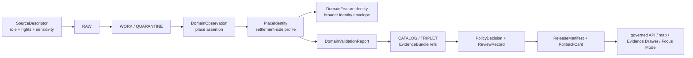

<!-- [KFM_META_BLOCK_V2]
doc_id: kfm://doc/contracts-domains-settlements-infrastructure-place-identity
title: Place Identity Contract — Settlements / Infrastructure
type: semantic-contract
version: v0.2
status: draft; PROPOSED; schema-missing; canonical-working-lane; slug-CONFLICTED-with-singular-settlement; settlements-sublane; NEEDS VERIFICATION before promotion
owners:
  - OWNER_TBD — Settlements/Infrastructure domain steward
  - OWNER_TBD — Settlements sublane steward
  - OWNER_TBD — Source steward
  - OWNER_TBD — Evidence steward
  - OWNER_TBD — Policy steward
  - OWNER_TBD — Contracts steward
  - OWNER_TBD — Schema steward
  - OWNER_TBD — Release steward
  - OWNER_TBD — Docs steward
created: NEEDS VERIFICATION — scaffold existed before v0.2 expansion
updated: 2026-06-23
policy_label: public; contracts; settlements-infrastructure; place-identity; settlements-sublane; source-role-aware; temporal-scope-aware; evidence-bound; policy-aware; sensitivity-aware; reservation-community-sensitive; archaeology-adjacent-aware; release-gated; rollback-aware; not-legal-status-by-itself; not-people-land-truth; not-infrastructure-asset-truth; not-transport-truth; not-hydrology-truth; not-hazards-truth; not-publication-authority
tags: [kfm, contracts, settlements-infrastructure, place-identity, settlement, municipality, census-place, townsite, ghost-town, fort, mission, reservation-community, DomainFeatureIdentity, DomainObservation, DomainLayerDescriptor, DomainValidationReport, EvidenceDrawerPayload, SourceDescriptor, EvidenceRef, EvidenceBundle, PolicyDecision, ReviewRecord, ReleaseManifest, RollbackCard]
related:
  - ./README.md
  - ./domain_feature_identity.md
  - ./domain_observation.md
  - ./domain_layer_descriptor.md
  - ./domain_validation_report.md
  - ./evidence-drawer-payload.md
  - ./ghost-town-authority.md
  - ./people-land-crosswalk.md
  - ./hydrology-crosswalk.md
  - ./hazards-crosswalk.md
  - ../settlement/README.md
  - ../../../docs/domains/settlements-infrastructure/README.md
  - ../../../docs/domains/settlements-infrastructure/CANONICAL_PATHS.md
  - ../../../docs/domains/settlements-infrastructure/sublanes/settlements.md
  - ../../../docs/domains/settlements-infrastructure/sublanes/infrastructure.md
  - ../../../schemas/contracts/v1/domains/settlements-infrastructure/place-identity.schema.json
  - ../../../policy/domains/settlements-infrastructure/
  - ../../../fixtures/domains/settlements-infrastructure/place-identity/
  - ../../../tests/domains/settlements-infrastructure/
  - ../../../release/candidates/settlements-infrastructure/
notes:
  - "Expanded from a PROPOSED scaffold at contracts/domains/settlements-infrastructure/place-identity.md."
  - "A paired schema at schemas/contracts/v1/domains/settlements-infrastructure/place-identity.schema.json was not found in this task. Field realization remains PROPOSED."
  - "Settlements sublane doctrine defines the place/community identity subset as Settlement, Municipality, CensusPlace, Townsite, GhostTown, Fort, Mission, and ReservationCommunity. This contract profiles place identity meaning for that subset."
  - "This contract does not author infrastructure asset truth, transport route truth, hydrology truth, hazards truth, people/land truth, archaeology/cultural-site truth, policy decisions, or release approval."
  - "The sibling DomainFeatureIdentity contract remains the broader identity-envelope contract for all Settlements/Infrastructure object families; this file narrows the place/community identity vocabulary and guardrails."
  - "The singular contracts/domains/settlement path remains a compatibility / variance surface, not a canonical replacement, unless an ADR resolves otherwise."
[/KFM_META_BLOCK_V2] -->

<a id="top"></a>

# Place Identity Contract — Settlements / Infrastructure

> Semantic contract for `place-identity`: the settlements-side identity profile for named places and communities — `Settlement`, `Municipality`, `CensusPlace`, `Townsite`, `GhostTown`, `Fort`, `Mission`, and `ReservationCommunity` — without collapsing legal, census, historic, military, religious, reservation-community, people/land, infrastructure, transport, hydrology, hazards, archaeology, policy, release, map, graph, or AI authority.

<p>
  
  
  
  
  
  
  
</p>

`contracts/domains/settlements-infrastructure/place-identity.md`

## Quick jumps

[Status](#status) · [Meaning](#meaning) · [Repo fit](#repo-fit) · [Schema posture](#schema-posture) · [Accepted uses](#accepted-uses) · [Exclusions](#exclusions) · [Recommended fields](#recommended-fields) · [Place identity model](#place-identity-model) · [Identity families](#identity-families) · [Source-role and time rules](#source-role-and-time-rules) · [Sensitivity and publication posture](#sensitivity-and-publication-posture) · [Invariants](#invariants) · [Lifecycle](#lifecycle) · [Validation](#validation) · [Rollback](#rollback) · [Evidence basis](#evidence-basis) · [Open questions](#open-questions)

---

## Status

> [!IMPORTANT]
> **Status:** `draft` / semantic contract  
> **Owner:** `OWNER_TBD`  
> **Contract path:** `contracts/domains/settlements-infrastructure/place-identity.md`  
> **Schema path checked:** `schemas/contracts/v1/domains/settlements-infrastructure/place-identity.schema.json` — **not found in this task**  
> **Truth posture:** target path, prior scaffold, contract-lane README, parent domain doctrine, settlements sublane doctrine, and sibling `domain_feature_identity.md` contract are confirmed from current repo evidence. Field-level shape, validator behavior, fixture coverage, policy behavior, source registry records, release manifests, governed API routes, public API behavior, map rendering, graph behavior, and runtime behavior remain **NEEDS VERIFICATION**.

> [!CAUTION]
> This contract defines place identity meaning only. It does **not** prove a place exists, certify municipal legal status, define census authority, publish exact sensitive geometry, create infrastructure asset truth, expose people/land joins, author archaeology/cultural-site truth, decide policy, publish a map layer, or authorize an AI answer.

---

## Meaning

`place-identity` defines the semantic profile for identifying named places and communities inside the settlements sublane.

It may describe identity support for:

- `Settlement`
- `Municipality`
- `CensusPlace`
- `Townsite`
- `GhostTown`
- `Fort`
- `Mission`
- `ReservationCommunity`

The contract answers:

- Which place/community identity family is being asserted?
- Which source and source role supports the identity?
- Which names, aliases, source-native IDs, administrative labels, or historical labels are in scope?
- Which temporal axes matter for the identity?
- Which geometry or spatial support is public-safe, generalized, source-scoped, or withheld?
- Which cross-lane context may be cited without transferring authority?
- Which EvidenceBundle, policy, review, release, correction, and rollback refs govern public use?

`place-identity` is narrower than `domain_feature_identity`: it profiles the place/community subset. `domain_feature_identity` remains the broader identity envelope for all Settlements/Infrastructure objects, including infrastructure-side assets, networks, facilities, service areas, operators, condition observations, and dependencies.

---

## Repo fit

| Responsibility | Path or root | Relationship |
|---|---|---|
| Parent contract lane | `./README.md` | Defines this folder as semantic contracts only. |
| Broad identity envelope | `./domain_feature_identity.md` | Applies to all Settlements/Infrastructure object families; this contract narrows the place/community identity vocabulary. |
| Observation companion | `./domain_observation.md` | Place observations may support identity but do not become identity truth by themselves. |
| Layer descriptor companion | `./domain_layer_descriptor.md` | Place identity can support public/release-candidate layers after policy/release gates. |
| Validation companion | `./domain_validation_report.md` | Validation can check place identity support; it is not approval. |
| Evidence Drawer profile | `./evidence-drawer-payload.md` | Drawer may show public-safe identity support after evidence and policy filtering. |
| Compatibility / variance path | `../settlement/README.md` | Singular `settlement` path is a warning surface, not canonical authority unless ADR resolves otherwise. |
| Parent domain doctrine | `../../../docs/domains/settlements-infrastructure/README.md` | Names all sixteen object families and identity posture. |
| Settlements sublane doctrine | `../../../docs/domains/settlements-infrastructure/sublanes/settlements.md` | Defines place/community identity object families and non-ownership boundaries. |
| Infrastructure sublane doctrine | `../../../docs/domains/settlements-infrastructure/sublanes/infrastructure.md` | Owns infrastructure-side object families; place identity must not absorb them. |
| Paired schema | `../../../schemas/contracts/v1/domains/settlements-infrastructure/place-identity.schema.json` | Not found in this task; do not infer field enforcement. |
| Policy | `../../../policy/domains/settlements-infrastructure/` | Allow/deny/restrict/abstain and release controls. |
| Release/rollback | `../../../release/candidates/settlements-infrastructure/` and release roots | Release, correction, rollback, and derivative invalidation. |

---

## Schema posture

A direct paired schema was checked at:

```text
schemas/contracts/v1/domains/settlements-infrastructure/place-identity.schema.json
```

That file was **not found** in this task.

> [!WARNING]
> Because no paired schema was confirmed, every field below is **PROPOSED** semantic guidance. Do not treat it as machine-enforced until schema, fixtures, validators, policy tests, release checks, governed API behavior, and runtime behavior are verified.

---

## Accepted uses

| Use | Allowed? | Rule |
|---|---:|---|
| Defining place/community identity semantics | Yes | Applies to settlement-side identity families only. |
| Supporting deterministic identity recipes for place records | Conditional | Must preserve source role, object family, temporal scope, normalized digest, and EvidenceBundle support. |
| Distinguishing legal, census, historic, military, religious, and reservation-community identities | Yes | Do not collapse co-existing identities by display name alone. |
| Supporting map layer, Evidence Drawer, or Focus Mode context | Conditional | Requires EvidenceBundle, PolicyDecision, ReviewRecord, ReleaseManifest, and rollback support. |
| Recording aliases or source-native identifiers | Yes | Must remain source-scoped and time-scoped. |
| Representing exact public geometry | Conditional | Must be release-supported and policy-safe; otherwise generalize, withhold, or abstain. |
| Proving legal municipal status, census status, title/ownership, public access, cultural-site status, infrastructure asset state, or hazard/water truth | No | Use owning lanes and evidence; this contract is place identity meaning only. |

---

## Exclusions

`place-identity` must not be used as:

| Misuse | Required outcome |
|---|---|
| Complete object payload | Use object-family contracts/schemas when created. |
| Broad domain identity envelope for all families | Use `domain_feature_identity`. |
| Municipal legal-status proof | Use authoritative legal/admin evidence, status-event semantics, policy/review/release. |
| Census authority proof | Use CensusPlace source evidence and vintage-specific source role. |
| Infrastructure asset/facility truth | Use infrastructure-side object contracts. |
| Person/residence/land/title truth | Use People/DNA/Land owning lane and privacy/title controls. |
| Archaeology/cultural-site truth | Use Archaeology/Cultural Heritage owning lane and steward review. |
| Transport, hydrology, hazards, or frontier-matrix truth | Use those owning lanes as context only. |
| Public map/API payload | Use governed API, layer descriptors, EvidenceBundle, policy, review, release, and rollback. |
| AI answer authority | Focus Mode remains evidence-subordinate and finite-outcome constrained. |

---

## Recommended fields

The following fields are **PROPOSED** until a paired schema is added and validated.

| Field | Meaning |
|---|---|
| `id` | Canonical place-identity profile identifier. |
| `version` | Contract/object version. |
| `spec_hash` | Deterministic hash over normalized identity profile content. |
| `domain` | Expected value: `settlements-infrastructure`. |
| `identity_family` | Settlement, Municipality, CensusPlace, Townsite, GhostTown, Fort, Mission, or ReservationCommunity. |
| `display_name` | Public-safe display name after source/policy filtering. |
| `normalized_name_key` | Normalized name used for candidate matching and hashing. |
| `source_native_id` | Source-native identifier or record key. |
| `alias_set` | Source-scoped aliases, spellings, former names, or alternate labels. |
| `parent_context_ref` | County, jurisdiction, reservation, mission network, fort context, or other contextual relation ref. |
| `source_ref` | SourceDescriptor/source registry reference. |
| `source_role` | Accepted source role for the identity assertion. |
| `evidence_refs` | EvidenceRefs or EvidenceBundle refs. |
| `observed_time` | Time the source observation was made, if known. |
| `source_time` | Source creation/publication/update time. |
| `valid_time` | Interval the identity applies to, if known. |
| `retrieval_time` | KFM retrieval/freeze time. |
| `release_time` | KFM release time, if released. |
| `spatial_support_ref` | Source-scoped geometry, generalized geometry, centroid, boundary, or location-support ref. |
| `public_geometry_rule` | Exact, generalized, county-level, narrative-only, hidden, denied, or review-only posture. |
| `sensitivity_label` | Sensitivity/policy tier inherited from identity family, source, geometry, cultural context, or people/land adjacency. |
| `policy_decision_ref` | PolicyDecision governing use/publication. |
| `review_ref` | ReviewRecord or steward review ref. |
| `release_manifest_ref` | ReleaseManifest or MapReleaseManifest ref. |
| `rollback_ref` | RollbackCard or rollback target. |
| `limitations` | Caveats: place identity only; not legal proof, not full object payload, not release approval. |

---

## Place identity model

A reviewed place identity profile should bind a place-family assertion to source role, time, evidence, and public-safe spatial support.

```text
place_identity = {
  domain,
  identity_family,
  display_name,
  normalized_name_key,
  source_ref,
  source_role,
  source_native_id,
  alias_set,
  evidence_refs,
  valid_time,
  spatial_support_ref,
  public_geometry_rule,
  sensitivity_label,
  policy_decision_ref,
  review_ref,
  release_manifest_ref,
  rollback_ref
}
```

The exact serialized shape is **NEEDS VERIFICATION** until the schema and validators are field-complete.

---

## Identity families

| Identity family | Meaning | Guardrail |
|---|---|---|
| `Settlement` | Generic place-of-occupation identity when a more specific family is not supported or when umbrella identity is needed. | Do not collapse legal, census, historic, or community identities into one object. |
| `Municipality` | Legal incorporated entity or local-governance place identity. | Requires source-scoped legal/admin evidence and valid time. |
| `CensusPlace` | Census-defined or census-enumerated place identity. | Statistical identity is distinct from municipal legal identity. |
| `Townsite` | Platted or founded town-site identity. | Origin/founding claim is not continuing settlement status by itself. |
| `GhostTown` | Historic/abandoned/depopulated/remembered settlement identity. | Use ghost-town authority and sensitivity review where needed. |
| `Fort` | Military post identity. | Fort identity is not automatically municipality, townsite, or current facility identity. |
| `Mission` | Religious mission station identity. | Cultural/community adjacency requires careful source-role and review posture. |
| `ReservationCommunity` | Community on reservation or trust-land context. | Sovereignty, cultural sensitivity, and living-person adjacency require review and policy support. |

---

## Source-role and time rules

| Rule | Requirement |
|---|---|
| Family is part of identity | A place can be a Settlement, Municipality, CensusPlace, and historical Fort/Townsite at once; families must not collapse. |
| Display name is not identity | Same or similar names require source-native ID, family, time, parent context, and evidence. |
| Legal status is time-scoped | Municipality and incorporation/status claims must preserve source and valid time. |
| Census vintage is time-scoped | CensusPlace identity must preserve census vintage and source role. |
| Historical identity is source-scoped | Townsite, GhostTown, Fort, and Mission claims must preserve source and interpretation limits. |
| Reservation-community context is review-aware | Do not publish sensitive or sovereignty-linked context without policy/review/release support. |
| Geometry is support, not truth by itself | Place geometry must remain source-scoped and public-geometry-rule filtered. |
| Public claims require EvidenceBundle resolution | If EvidenceRef cannot resolve to EvidenceBundle, return ABSTAIN, DENY, or ERROR. |

---

## Sensitivity and publication posture

| Surface | Default posture | Reason |
|---|---|---|
| Public municipality or census place name | Public-safe if evidence and release support it | Still requires source, vintage, valid time, and correction state. |
| Historic townsite / ghost town / fort / mission identity | Public-safe summary, review where sensitive | Cultural, private-land, archaeology-adjacent, or interpretive risks may apply. |
| Reservation-community identity | Review / summarized by default | Sovereignty, cultural context, and living-person adjacency may apply. |
| Exact or site-like geometry | Generalize, review, or deny when sensitive | Geometry can expose sensitive or unsupported claims. |
| People/land-linked place context | Deny/restrict by default where private detail may appear | People/DNA/Land controls remain owning authority. |
| Candidate/model/OCR place identity | Review only | Automated support does not close evidence. |

---

## Invariants

1. **Place identity is not all identity.** It profiles settlement-side place/community families only; use `domain_feature_identity` for the broader envelope.
2. **Family distinctions matter.** `Settlement`, `Municipality`, `CensusPlace`, `Townsite`, `GhostTown`, `Fort`, `Mission`, and `ReservationCommunity` are not interchangeable labels.
3. **Name is not identity.** A shared or repeated name does not merge identities without source, family, time, and evidence support.
4. **Geometry is not authority by itself.** Coordinates, boundaries, centroids, and polygons are spatial support, not sovereign truth.
5. **Cross-lane context stays contextual.** Transport, hydrology, hazards, people/land, archaeology, agriculture, and frontier-matrix facts remain owned by their lanes.
6. **Sensitivity travels with identity.** Reservation-community, historic/cultural, people/land-adjacent, and sensitive-geometry surfaces require policy/review/release support.
7. **Evidence must resolve.** Consequential public claims require EvidenceRef to resolve to EvidenceBundle.
8. **Release is separate.** A valid identity profile does not publish anything without PolicyDecision, ReviewRecord, ReleaseManifest, and RollbackCard where required.
9. **AI remains downstream.** Focus Mode may explain released identity context but cannot elevate authority posture.
10. **Singular `settlement` remains conflicted.** Do not route canonical place identity work through the singular compatibility path without ADR.

---

## Lifecycle



Contracts describe meaning. They do not move data, validate schema shape, execute source ingestion, decide policy, publish artifacts, render maps, or authorize AI answers.

---

## Validation

Before this contract is treated as mature, maintainers should verify:

- [ ] whether `place-identity.md` should have a paired schema or remain a semantic profile under `domain_feature_identity`;
- [ ] paired schema exists and includes identity family, display name, normalized key, source ref, source role, source-native ID, evidence refs, time axes, public geometry rule, sensitivity label, policy/review/release/rollback refs, and limitations;
- [ ] fixtures cover Settlement, Municipality, CensusPlace, Townsite, GhostTown, Fort, Mission, ReservationCommunity, aliases, same-name conflicts, historical supersession, and candidate identities;
- [ ] tests prevent place identity profiles from becoming legal-status proof, census proof, archaeology truth, people/land truth, infrastructure truth, map truth, release approval, or AI authority;
- [ ] tests preserve source-role and time-axis distinctions;
- [ ] tests enforce ABSTAIN/DENY/ERROR when evidence, source role, sensitivity, valid time, geometry posture, or release state is unresolved;
- [ ] public map, Evidence Drawer, Focus Mode, exports, and AI summaries use only released/governed place-identity projections;
- [ ] rollback invalidates linked observations, identities, layers, drawer payloads, exports, caches, graph projections, and AI summaries that cited a withdrawn place identity profile.

---

## Rollback

Rollback is required if this contract:

- claims schema, validator, fixture, test, policy, release, API, map, graph, or runtime behavior exists without proof;
- treats place identity as legal-status proof, census-status proof, archaeology truth, people/land truth, infrastructure truth, transport truth, hydrology truth, hazards truth, release approval, or AI authority;
- collapses Settlement, Municipality, CensusPlace, Townsite, GhostTown, Fort, Mission, and ReservationCommunity into display-name-only identity;
- hides source-role conflict, candidate status, valid-time limits, supersession, sensitivity, or correction lineage;
- exposes sensitive geometry or cross-lane relations through examples, public wording, map layers, or drawer text;
- normalizes direct UI access to internal lifecycle stores or direct model output;
- treats the singular `settlement` path as canonical authority without ADR support.

Rollback target: revert `contracts/domains/settlements-infrastructure/place-identity.md` to prior scaffold blob `9cc6a6d5d16f2c41439172289d366e078feda62e`, record drift if authority boundaries were affected, and invalidate downstream derivatives that relied on weakened place-identity semantics.

---

## Evidence basis

| Evidence | Status | Supports | Limits |
|---|---|---|---|
| Prior `contracts/domains/settlements-infrastructure/place-identity.md` | `CONFIRMED` | Target file existed as a PROPOSED scaffold sourced from the expansion backlog. | Scaffold did not define authoritative semantic contract content. |
| Paired schema lookup | `CONFIRMED not found in this task` | Justifies schema-missing posture. | Does not rule out alternate schema names or future ADR-selected homes. |
| `contracts/domains/settlements-infrastructure/README.md` | `CONFIRMED contract-lane rule` | Defines this folder as semantic meaning only and points schemas, policy, tests, data, release, and public artifacts to separate roots. | Does not define PlaceIdentity fields. |
| `contracts/domains/settlements-infrastructure/domain_feature_identity.md` | `CONFIRMED sibling contract` | Defines the broader identity-envelope contract for all Settlements/Infrastructure object families. | It is broader than place identity and uses a stub-confirmed schema. |
| `docs/domains/settlements-infrastructure/README.md` | `CONFIRMED doctrine / PROPOSED implementation` | Confirms sixteen object families and identity rule of source id + object role + temporal scope + normalized digest. | Does not prove object-level schema/validator/test implementation. |
| `docs/domains/settlements-infrastructure/sublanes/settlements.md` | `CONFIRMED doctrine / PROPOSED sublane application` | Defines the settlements-side place/community object families and non-ownership boundaries. | Dossier uses some PROPOSED sublane structure and does not prove enforcement. |
| Uploaded KFM authoring prompt v2 | `CONFIRMED user-supplied guidance` | Requires evidence-first, implementation-honest, visually polished Markdown with visible verification and rollback posture. | Authoring guidance, not implementation proof. |

---

## Open questions

| ID | Question | Status |
|---|---|---|
| OQ-SI-PI-01 | Should `place-identity.md` remain separate, or should it become a section/profile inside `domain_feature_identity.md`? | OPEN / DOMAIN + SCHEMA REVIEW |
| OQ-SI-PI-02 | Which identity-family enum is canonical for Settlement, Municipality, CensusPlace, Townsite, GhostTown, Fort, Mission, and ReservationCommunity? | OPEN / SCHEMA REVIEW |
| OQ-SI-PI-03 | Which source families are sufficient for legal, census, historic, mission, fort, ghost-town, and reservation-community identity claims? | OPEN / SOURCE REVIEW |
| OQ-SI-PI-04 | Which place identity cases require default generalization, review-only handling, or denial? | OPEN / POLICY REVIEW |
| OQ-SI-PI-05 | How should Evidence Drawer and Focus Mode present co-existing identities without collapsing family/time/source roles? | OPEN / MAP/UI REVIEW |
| OQ-SI-PI-06 | How should rollback invalidate maps, drawer payloads, Focus Mode claims, exports, caches, graph projections, and AI summaries after place-identity correction? | OPEN / RELEASE REVIEW |

<p align="right"><a href="#top">Back to top</a></p>
