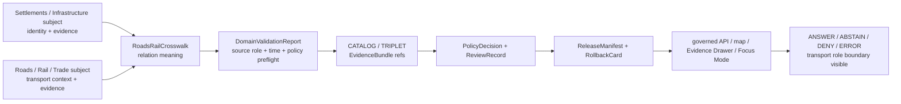

<!-- [KFM_META_BLOCK_V2]
doc_id: kfm://doc/contracts-domains-settlements-infrastructure-roads-rail-crosswalk
title: Roads / Rail Crosswalk Contract — Settlements / Infrastructure
type: semantic-contract; cross-domain-crosswalk
version: v0.2
status: draft; PROPOSED; schema-missing; canonical-working-lane; slug-CONFLICTED-with-singular-settlement; transport-slug-CONFLICTED; contextual-only; NEEDS VERIFICATION before promotion
owners:
  - OWNER_TBD — Settlements/Infrastructure domain steward
  - OWNER_TBD — Roads/Rail/Trade Routes domain steward
  - OWNER_TBD — Map/UI steward
  - OWNER_TBD — Contracts steward
  - OWNER_TBD — Evidence steward
  - OWNER_TBD — Schema steward
  - OWNER_TBD — Policy steward
  - OWNER_TBD — Release steward
  - OWNER_TBD — Docs steward
created: NEEDS VERIFICATION — scaffold existed before v0.2 expansion
updated: 2026-06-23
policy_label: public; contracts; settlements-infrastructure; roads-rail-crosswalk; cross-domain; contextual-relation; route-context; rail-context; trade-route-context; evidence-bound; source-role-aware; temporal-scope-aware; policy-aware; sensitivity-aware; release-gated; rollback-aware; not-route-truth; not-place-truth; not-operator-truth; not-navigation-guidance; not-publication-authority
tags: [kfm, contracts, settlements-infrastructure, roads-rail-trade, roads-rail-crosswalk, transport, crosswalk, contextual-relation, RoadSegment, RailSegment, CorridorRoute, RouteMembership, HistoricRouteClaim, TradeRouteCorridor, Depot, Siding, Yard, Crossing, Bridge, Ferry, RiverCrossing, TransportFacility, RouteEvent, StatusEvent, RestrictionEvent, OperatorAssignment, NetworkNode, NetworkEdge, MovementStoryNode, Settlement, Municipality, CensusPlace, Townsite, GhostTown, Fort, Mission, ReservationCommunity, InfrastructureAsset, Facility, ServiceArea, Operator, EvidenceBundle, PolicyDecision, ReviewRecord, ReleaseManifest, RollbackCard]
related:
  - ./README.md
  - ./domain_feature_identity.md
  - ./domain_observation.md
  - ./domain_layer_descriptor.md
  - ./domain_validation_report.md
  - ./evidence-drawer-payload.md
  - ./place-identity.md
  - ./operator.md
  - ./hydrology-crosswalk.md
  - ./hazards-crosswalk.md
  - ./people-land-crosswalk.md
  - ../settlement/README.md
  - ../../../docs/domains/settlements-infrastructure/README.md
  - ../../../docs/domains/settlements-infrastructure/CANONICAL_PATHS.md
  - ../../../docs/domains/settlements-infrastructure/sublanes/settlements.md
  - ../../../docs/domains/settlements-infrastructure/sublanes/infrastructure.md
  - ../../../docs/domains/roads-rail-trade/README.md
  - ../../../docs/domains/roads-rail-trade/OBJECT_FAMILIES.md
  - ../../../docs/domains/roads-rail-trade/sublanes/roads.md
  - ../../../docs/domains/roads-rail-trade/sublanes/rail.md
  - ../../../docs/domains/roads-rail-trade/sublanes/trade-routes.md
  - ../../../contracts/domains/roads-rail-trade/road_segment.md
  - ../../../contracts/domains/roads-rail-trade/rail_segment.md
  - ../../../contracts/domains/roads-rail-trade/corridor_route.md
  - ../../../contracts/domains/roads-rail-trade/route_membership.md
  - ../../../contracts/domains/roads-rail-trade/trade_route_corridor.md
  - ../../../contracts/domains/roads-rail-trade/historic_route_claim.md
  - ../../../contracts/domains/roads-rail-trade/transport_facility.md
  - ../../../schemas/contracts/v1/domains/settlements-infrastructure/roads-rail-crosswalk.schema.json
  - ../../../schemas/contracts/v1/domains/roads-rail-trade/
  - ../../../schemas/contracts/v1/transport/
  - ../../../policy/domains/settlements-infrastructure/
  - ../../../policy/domains/roads-rail-trade/
  - ../../../fixtures/domains/settlements-infrastructure/roads-rail-crosswalk/
  - ../../../tests/domains/settlements-infrastructure/
  - ../../../release/candidates/settlements-infrastructure/
notes:
  - "Expanded from a PROPOSED scaffold at contracts/domains/settlements-infrastructure/roads-rail-crosswalk.md."
  - "A paired schema at schemas/contracts/v1/domains/settlements-infrastructure/roads-rail-crosswalk.schema.json was not found in this task. Field realization remains PROPOSED."
  - "Roads/Rail/Trade doctrine owns road, rail, route, corridor, crossing, transport-facility, event, operator-assignment, network, and movement-story evidence. Settlements/Infrastructure owns settlement, place, facility, asset, service-area, operator-role, and infrastructure identity."
  - "Roads/Rail/Trade docs currently record a slug divergence: docs and most responsibility roots use roads-rail-trade, while Atlas/Encyclopedia doctrine says schema/contract homes use transport/. This crosswalk must not create a third authority path."
  - "This contract defines cross-domain relation meaning. It does not author route truth, place truth, facility truth, operator legal truth, navigation guidance, map truth, graph truth, policy decision, or publication approval."
  - "The singular contracts/domains/settlement path remains a compatibility / variance surface, not a canonical replacement, unless an ADR resolves otherwise."
[/KFM_META_BLOCK_V2] -->

<a id="top"></a>

# Roads / Rail Crosswalk Contract — Settlements / Infrastructure

> Semantic contract for `roads-rail-crosswalk`: the governed cross-domain relation that lets Settlements/Infrastructure features cite Roads/Rail/Trade records as contextual evidence while preserving domain ownership, source role, temporal scope, policy posture, release state, correction lineage, and rollback targets.

<p>
  
  
  
  
  
  
  
</p>

`contracts/domains/settlements-infrastructure/roads-rail-crosswalk.md`

## Quick jumps

[Status](#status) · [Meaning](#meaning) · [Repo fit](#repo-fit) · [Schema posture](#schema-posture) · [Accepted uses](#accepted-uses) · [Exclusions](#exclusions) · [Recommended fields](#recommended-fields) · [Crosswalk model](#crosswalk-model) · [Relation families](#relation-families) · [Source-role and time rules](#source-role-and-time-rules) · [Publication posture](#publication-posture) · [Invariants](#invariants) · [Lifecycle](#lifecycle) · [Validation](#validation) · [Rollback](#rollback) · [Evidence basis](#evidence-basis) · [Open questions](#open-questions)

---

## Status

> [!IMPORTANT]
> **Status:** `draft` / semantic contract / cross-domain crosswalk  
> **Owner:** `OWNER_TBD`  
> **Contract path:** `contracts/domains/settlements-infrastructure/roads-rail-crosswalk.md`  
> **Schema path checked:** `schemas/contracts/v1/domains/settlements-infrastructure/roads-rail-crosswalk.schema.json` — **not found in this task**  
> **Truth posture:** target path, prior scaffold, Settlements/Infrastructure contract-lane README, Settlements/Infrastructure domain doctrine, Roads/Rail/Trade domain doctrine, Roads/Rail object-family doctrine, and roads/rail/trade-route sublane docs are confirmed from current repo evidence. Field-level shape, validator behavior, fixture coverage, policy behavior, source registry records, release manifests, governed API routes, public API behavior, map rendering, graph behavior, and runtime behavior remain **NEEDS VERIFICATION**.

> [!CAUTION]
> This contract defines relation meaning only. It does **not** create road/rail/trade route truth, settlement truth, infrastructure truth, operator legal truth, navigation guidance, public map approval, graph authority, or AI answer authority.

---

## Meaning

`roads-rail-crosswalk` records a bounded relation between a Settlements/Infrastructure subject and a Roads/Rail/Trade object.

It may relate a settlement, municipality, census place, historic place, reservation community, infrastructure asset, facility, service area, operator, condition observation, or dependency to transport context such as:

- `RoadSegment`
- `RailSegment`
- `CorridorRoute`
- `RouteMembership`
- `HistoricRouteClaim`
- `TradeRouteCorridor`
- `Depot`
- `Siding`
- `Yard`
- `Crossing`
- `Bridge`
- `Ferry`
- `RiverCrossing`
- `TransportFacility`
- `RouteEvent`
- `StatusEvent`
- `RestrictionEvent`
- `OperatorAssignment`
- `NetworkNode`
- `NetworkEdge`
- `MovementStoryNode`

The crosswalk answers:

- which Settlements/Infrastructure subject is related to which transport record;
- what kind of relation is being asserted;
- which lane owns each side of the truth;
- which source role, time role, evidence, policy, review, release, and rollback states control public use;
- what public wording or display must not imply.

This contract owns only the **cross-domain relation meaning**. Roads/Rail/Trade owns road, rail, route, corridor, crossing, event, route-membership, transport-facility, network, and movement-story evidence. Settlements/Infrastructure owns settlement, place, facility, asset, service-area, operator-role, and infrastructure identity. EvidenceBundle, PolicyDecision, ReviewRecord, ReleaseManifest, correction, and rollback remain separate governance surfaces.

---

## Repo fit

| Responsibility | Path or root | Relationship |
|---|---|---|
| Parent contract lane | `./README.md` | Defines this folder as semantic contracts only. |
| Identity companion | `./domain_feature_identity.md` | Crosswalk subject identity must remain source-role/family/time/evidence aware. |
| Place identity companion | `./place-identity.md` | Crosswalk may relate settlements, ghost towns, forts, missions, and reservation communities to routes without collapsing identity. |
| Observation companion | `./domain_observation.md` | Observations may support a crosswalk but do not become transport truth. |
| Layer descriptor companion | `./domain_layer_descriptor.md` | Crosswalk may be used by a layer descriptor, but layer release remains separate. |
| Validation companion | `./domain_validation_report.md` | Validation can check crosswalk support; it is not approval. |
| Evidence Drawer profile | `./evidence-drawer-payload.md` | Drawer may show the relation after evidence and policy filtering. |
| Roads/Rail domain doctrine | `../../../docs/domains/roads-rail-trade/README.md` | Defines Roads/Rail/Trade scope, object families, non-ownership, and slug divergence. |
| Roads/Rail object families | `../../../docs/domains/roads-rail-trade/OBJECT_FAMILIES.md` | Defines object-family graph, identity rule, source-role, and temporal handling. |
| Roads sublane | `../../../docs/domains/roads-rail-trade/sublanes/roads.md` | Road-side objects and non-ownership boundaries. |
| Rail sublane | `../../../docs/domains/roads-rail-trade/sublanes/rail.md` | Rail-side objects and non-ownership boundaries. |
| Trade routes sublane | `../../../docs/domains/roads-rail-trade/sublanes/trade-routes.md` | Historic/trade route claims and sensitivity posture. |
| Paired schema | `../../../schemas/contracts/v1/domains/settlements-infrastructure/roads-rail-crosswalk.schema.json` | Not found in this task; do not infer field enforcement. |
| Transport schema/contract variance | `../../../schemas/contracts/v1/domains/roads-rail-trade/` and `../../../schemas/contracts/v1/transport/` | Existing docs record a slug conflict/divergence; this crosswalk must not create a third authority. |
| Policy | `../../../policy/domains/settlements-infrastructure/`, `../../../policy/domains/roads-rail-trade/` | Allow/deny/restrict/abstain and release controls. |
| Release/rollback | `../../../release/candidates/settlements-infrastructure/`, `../../../release/candidates/roads-rail-trade/`, release roots | Release, correction, rollback, and derivative invalidation. |

---

## Schema posture

A direct paired schema was checked at:

```text
schemas/contracts/v1/domains/settlements-infrastructure/roads-rail-crosswalk.schema.json
```

That file was **not found** in this task.

> [!WARNING]
> Because no paired schema was confirmed, every field below is **PROPOSED** semantic guidance. Do not treat it as machine-enforced until schema, fixtures, validators, policy tests, release checks, governed API behavior, and runtime behavior are verified.

---

## Accepted uses

| Use | Allowed? | Rule |
|---|---:|---|
| Linking a settlement/place feature to a road, rail, route, or corridor context | Yes | Must cite both subject refs and transport refs with evidence, source role, and time scope. |
| Linking a facility, asset, service area, or operator role to a transport facility or route relation | Conditional | Must preserve which lane owns the facility/asset identity and which lane owns the transport role. |
| Supporting depot/station/crossing/bridge/ferry/river-crossing context | Conditional | Must keep structural/place identity, road/rail role, hydrology context, and route membership separate. |
| Supporting historic route or trade corridor context | Conditional | Claim/interpretive status, source role, sensitivity, and generalization posture must remain visible. |
| Supporting public map, Evidence Drawer, or Focus Mode context | Conditional | Requires governed release, policy, review, public geometry rule, EvidenceBundle resolution, and rollback target. |
| Certifying navigation, public access, current service, legal route designation, operator legal identity, or ownership | No | Return `ABSTAIN`, `DENY`, or `ERROR` depending on evidence and policy posture. |
| Replacing either domain's objects | No | Use each domain's contracts, schemas, EvidenceBundles, and policy gates. |

---

## Exclusions

`roads-rail-crosswalk` must not be used as:

| Misuse | Required outcome |
|---|---|
| Road, rail, route, or corridor truth | Use Roads/Rail/Trade contracts and EvidenceBundles. |
| Settlement or infrastructure feature truth | Use Settlements/Infrastructure object-family contracts and EvidenceBundles. |
| Navigation, routing, detour, or public-access guidance | `ABSTAIN` or `DENY`; outside this contract. |
| Legal route designation proof | Use authoritative transport source evidence and policy-reviewed wording. |
| Operator legal identity or ownership proof | Use owning People/Land/legal-source lanes and operator-role boundaries. |
| Depot/facility identity shortcut | Use Settlements/Infrastructure `Facility`, `InfrastructureAsset`, or place identity contracts. |
| Historic/cultural route truth | Use Roads/Rail/Trade route claims plus cultural/archaeology review where applicable. |
| Hydrology or hazards truth | Use hydrology/hazards owning lanes via governed crosswalks. |
| Publication approval | Use PolicyDecision, ReviewRecord, ReleaseManifest, correction path, and RollbackCard. |
| AI answer authority | Focus Mode remains evidence-subordinate and finite-outcome constrained. |

---

## Recommended fields

The following fields are **PROPOSED** until a paired schema is added and validated.

| Field | Meaning |
|---|---|
| `id` | Canonical roads-rail-crosswalk relation identifier. |
| `version` | Contract/object version. |
| `spec_hash` | Deterministic hash over normalized relation content. |
| `domain` | Expected value: `settlements-infrastructure`. |
| `crosswalk_type` | Road-context, rail-context, depot-context, crossing-context, bridge-context, ferry-context, river-crossing-context, route-membership-context, corridor-context, historic-route-context, trade-route-context, movement-story-context, review-only, denied, or source-specific type. |
| `settlement_infrastructure_subject_ref` | DomainFeatureIdentity or object-family ref for the Settlements/Infrastructure subject. |
| `settlement_infrastructure_family` | Settlement, Municipality, CensusPlace, Townsite, GhostTown, Fort, Mission, ReservationCommunity, InfrastructureAsset, Facility, ServiceArea, Operator, etc. |
| `transport_subject_ref` | Roads/Rail/Trade object ref. |
| `transport_family` | RoadSegment, RailSegment, Depot, Crossing, CorridorRoute, RouteMembership, HistoricRouteClaim, TradeRouteCorridor, etc. |
| `relation_statement` | Human-readable scoped relation statement. |
| `relation_method` | Source cross-reference, spatial join, temporal join, route membership, facility-role join, historical claim link, graph projection ref, manual review, or source-specific method. |
| `source_refs` | SourceDescriptor refs from both sides where needed. |
| `evidence_refs` | EvidenceRefs or EvidenceBundle refs. |
| `source_role_summary` | Source-role posture across domains. |
| `temporal_scope` | Source time, observed time, valid time, route-event time, retrieval time, release time, correction time. |
| `public_geometry_rule` | Exact, generalized, aggregate, hidden, denied, or review-only posture. |
| `transport_role_boundary` | Required statement distinguishing route, segment, corridor, facility-role, event, graph, and historic-claim support. |
| `freshness_or_vintage_state` | Fresh, stale, historical, version-pinned, contested, unknown, or not applicable. |
| `sensitivity_label` | Sensitivity/policy tier inherited from both domains. |
| `policy_decision_ref` | PolicyDecision governing use/publication. |
| `review_ref` | ReviewRecord or steward review ref. |
| `release_manifest_ref` | ReleaseManifest or MapReleaseManifest ref. |
| `rollback_ref` | RollbackCard or rollback target. |
| `limitations` | Caveats: crosswalk only; not route truth, not place truth, not release approval. |

---

## Crosswalk model

A reviewed crosswalk should bind one Settlements/Infrastructure subject to one or more Roads/Rail/Trade refs while preserving ownership boundaries.

```text
roads_rail_crosswalk = {
  domain,
  crosswalk_type,
  settlement_infrastructure_subject_ref,
  transport_subject_ref,
  relation_method,
  source_role_summary,
  evidence_refs,
  temporal_scope,
  transport_role_boundary,
  policy_decision_ref,
  review_ref,
  release_manifest_ref,
  rollback_ref
}
```

The exact serialized shape is **NEEDS VERIFICATION** until the schema and validators are field-complete.

---

## Relation families

| Relation family | Meaning | Guardrail |
|---|---|---|
| `road_context` | Place/facility/service area relates to a road segment, corridor, route membership, or road-side facility relation. | Road evidence is context, not place truth or navigation guidance. |
| `rail_context` | Place/facility/service area relates to a rail segment, depot, siding, yard, crossing, operator assignment, or rail corridor. | Rail-side role is transport-owned; depot/facility identity may remain settlement/infrastructure-owned. |
| `depot_or_station_context` | Settlement/facility identity relates to a depot/station transport role. | Keep place/facility identity and rail-network role separate. |
| `crossing_context` | Settlement/infrastructure subject relates to crossing, bridge, ferry, or river-crossing transport evidence. | Hydrology and asset identity remain separate where applicable. |
| `route_membership_context` | Subject participates in or is near a corridor/route membership. | Membership is a sourced temporal claim, not a segment or place itself. |
| `historic_route_context` | Subject relates to HistoricRouteClaim or TradeRouteCorridor. | Historic/cultural claims remain claim-based and review-aware. |
| `movement_story_context` | Subject supports a MovementStoryNode. | Narrative is downstream of evidence and cannot replace source truth. |
| `graph_context` | Subject participates in derived NetworkNode/NetworkEdge context. | Graph projection is derived and must not become canonical truth. |
| `review_only_context` | Relation is held for steward/policy review. | Not public until release gates pass. |
| `denied_context` | Relation cannot be exposed under current policy/evidence. | Show safe denial reason only, if surfaced at all. |

---

## Source-role and time rules

| Rule | Requirement |
|---|---|
| Domain ownership stays explicit | Roads/Rail/Trade owns transport records; Settlements/Infrastructure owns place, facility, asset, service-area, and operator-role identity. |
| Source role never collapses | Observed, regulatory, administrative, modeled, aggregate, candidate, contextual, and synthetic support remain distinct. |
| Modern and historic transport roles stay distinct | A modern road/rail segment must not silently absorb a historic/trade-route claim. |
| Facility and transport role stay separate | A depot, bridge, crossing, or transport facility may involve both lanes; the relation must state which side is being asserted. |
| Graph projection is downstream | NetworkNode/NetworkEdge projections must not replace canonical records. |
| Time axes remain separate | Source time, observed time, valid time, event time, retrieval time, release time, and correction time must not collapse. |
| Candidate joins stay candidate | Spatial overlap, OCR, model, map label, or connector suggestion does not create public truth. |
| Public claims require EvidenceBundle resolution | If evidence cannot resolve, return ABSTAIN, DENY, or ERROR; do not invent the relation. |

---

## Publication posture

| Surface | Default posture | Reason |
|---|---|---|
| Modern road/rail context for a public place | Public-safe if released | Still needs source role, time scope, EvidenceBundle, and release state. |
| Depot/station/facility crosswalk | Public-safe only when both identity and transport-role evidence are released | Facility identity and rail/road role may have different authority sources. |
| Historic/trade route relation | Generalized/review-aware by default | Historic/cultural route claims may carry uncertainty or sensitivity. |
| Derived graph relation | Context-only | Graph edges/nodes are delivery surfaces, not canonical truth. |
| Operator or access-related relation | Review as needed | Avoid implying ownership, legal identity, service guarantees, or public access. |
| Candidate/model relation | Review only | Automated relation does not close evidence. |

---

## Invariants

1. **Crosswalk is not ownership transfer.** Each domain keeps its own truth authority.
2. **Transport role is preserved.** Segment, route, corridor, membership, facility role, event, graph, and historic claim support must not collapse.
3. **Place/facility identity is not route truth.** Settlements/Infrastructure identities may cite transport context without becoming transport records.
4. **Modern and historic evidence stay distinct.** A present-day alignment must not silently publish or overwrite a historic/cultural route claim.
5. **Evidence outranks relation.** A crosswalk cannot strengthen weak or unresolved evidence.
6. **Time is part of meaning.** Source/observed/valid/event/release/correction times must stay distinct where material.
7. **Public geometry is policy-filtered.** Sensitive or uncertain relations may require aggregation, generalization, review-only status, or denial.
8. **Release is separate.** A valid relation does not publish anything without PolicyDecision, ReviewRecord, ReleaseManifest, and RollbackCard where required.
9. **AI is downstream.** Focus Mode may explain only released evidence and policy-permitted context.
10. **No direct internal-store reads.** Public clients use governed APIs and released artifacts only.
11. **Singular `settlement` remains conflicted.** Do not route canonical crosswalks through the singular compatibility path without ADR.

---

## Lifecycle



Contracts describe meaning. They do not move data, validate schema shape, execute joins, decide policy, publish artifacts, render maps, compute routes, or authorize AI answers.

---

## Validation

Before this contract is treated as mature, maintainers should verify:

- [ ] whether this crosswalk needs a paired schema or should be represented through existing relation/triplet schemas;
- [ ] schema includes subject refs for both domains, relation family, transport role boundary, source-role summary, time axes, policy/review/release/rollback refs, and public geometry rule;
- [ ] schema placement resolves the Roads/Rail `roads-rail-trade` vs `transport` contract/schema segment divergence without creating a third authority home;
- [ ] fixtures cover road context, rail context, depot/station context, crossing/bridge/ferry/river-crossing context, route membership, historic route, trade corridor, movement story, graph, review-only, denied, and stale/contested contexts;
- [ ] tests prevent crosswalks from becoming route truth, settlement/infrastructure truth, navigation guidance, legal route designation, operator legal identity, public-access guidance, graph truth, or publication approval;
- [ ] tests preserve modern/historic, route/segment, facility/transport-role, and graph/canonical-record distinctions;
- [ ] tests enforce ABSTAIN/DENY/ERROR when evidence, source role, sensitivity, freshness/vintage, or release state is unresolved;
- [ ] rollback invalidates layer descriptors, drawer payloads, Focus Mode citations, exports, caches, graph projections, and AI summaries that cited a withdrawn crosswalk.

---

## Rollback

Rollback is required if this contract:

- claims schema, validator, fixture, test, policy, release, API, map, graph, or runtime behavior exists without proof;
- treats roads/rail crosswalks as transport truth, settlement/infrastructure truth, navigation guidance, public-access guidance, legal route designation, operator legal truth, graph truth, release approval, or AI authority;
- hides source-role conflict, candidate status, valid-time limits, modern/historic split, graph-derived status, supersession, or correction lineage;
- weakens the Roads/Rail `roads-rail-trade` vs `transport` slug conflict/divergence by creating another authority path;
- exposes sensitive or unsupported relations through examples, public wording, map layers, or drawer text;
- normalizes direct UI access to internal lifecycle stores or direct model output;
- treats the singular `settlement` path as canonical authority without ADR support.

Rollback target: revert `contracts/domains/settlements-infrastructure/roads-rail-crosswalk.md` to prior scaffold blob `8a5962b008e2ee7f2afb840b60563bdb52866db5`, record drift if authority boundaries were affected, and invalidate downstream derivatives that relied on weakened roads-rail-crosswalk semantics.

---

## Evidence basis

| Evidence | Status | Supports | Limits |
|---|---|---|---|
| Prior `contracts/domains/settlements-infrastructure/roads-rail-crosswalk.md` | `CONFIRMED` | Target file existed as a PROPOSED scaffold sourced from the expansion backlog. | Scaffold did not define authoritative semantic contract content. |
| Paired schema lookup | `CONFIRMED not found in this task` | Justifies schema-missing posture. | Does not rule out alternate schema names or future ADR-selected homes. |
| `contracts/domains/settlements-infrastructure/README.md` | `CONFIRMED contract-lane rule` | Defines this folder as semantic meaning only and points schemas, policy, tests, data, release, and public artifacts to separate roots. | Does not define roads-rail-crosswalk fields. |
| `docs/domains/settlements-infrastructure/README.md` | `CONFIRMED doctrine / PROPOSED implementation` | Confirms Settlements/Infrastructure object families, lifecycle, cross-lane relations, sensitivity posture, and source/temporal identity posture. | Does not prove crosswalk schema/validator/test implementation. |
| `docs/domains/roads-rail-trade/README.md` | `CONFIRMED transport doctrine / PROPOSED implementation` | Defines Roads/Rail/Trade scope, object families, explicit non-ownership of settlement/infrastructure truth, and slug divergence for contracts/schemas. | Does not prove crosswalk implementation. |
| `docs/domains/roads-rail-trade/OBJECT_FAMILIES.md` | `CONFIRMED object-family doctrine / PROPOSED graph realization` | Defines object relationships, identity rule, source-role anti-collapse, and time axes for transport objects. | Diagram and graph edges are illustrative and need schema verification. |
| `docs/domains/roads-rail-trade/sublanes/roads.md` | `CONFIRMED roads doctrine / PROPOSED sublane realization` | Defines road-side objects and non-ownership of settlement, hydrology, hazards, rail, and historic-route truth. | Sublane structure is PROPOSED. |
| `docs/domains/roads-rail-trade/sublanes/rail.md` | `CONFIRMED rail doctrine / PROPOSED sublane realization` | Defines rail-side object families and notes depot/station/facility identity remains settlement/infrastructure-owned. | Sublane structure is PROPOSED. |
| `docs/domains/roads-rail-trade/sublanes/trade-routes.md` | `CONFIRMED trade-route doctrine / PROPOSED sublane realization` | Defines historic/trade route claims and non-ownership of settlements, townsites, water, people/land, and cultural-site truth. | Sublane filename and structure remain open. |
| Uploaded KFM authoring prompt v2 | `CONFIRMED user-supplied guidance` | Requires evidence-first, implementation-honest, visually polished Markdown with visible verification and rollback posture. | Authoring guidance, not implementation proof. |

---

## Open questions

| ID | Question | Status |
|---|---|---|
| OQ-SI-RRT-XW-01 | Should `roads-rail-crosswalk.md` be a standalone contract, a relation schema, or a section of a broader cross-domain relation contract? | OPEN / DOMAIN + SCHEMA REVIEW |
| OQ-SI-RRT-XW-02 | Which Roads/Rail/Trade object families may be linked to which Settlements/Infrastructure object families? | OPEN / CROSS-DOMAIN REVIEW |
| OQ-SI-RRT-XW-03 | Which schema home should govern transport-side refs given the `roads-rail-trade` vs `transport` slug divergence? | OPEN / ADR + SCHEMA REVIEW |
| OQ-SI-RRT-XW-04 | Which relation families must default to aggregation, generalization, review-only status, or denial? | OPEN / POLICY REVIEW |
| OQ-SI-RRT-XW-05 | How should Evidence Drawer and Focus Mode present depot/station/crossing/route relations without implying route truth, public access, current service, or legal operator identity? | OPEN / MAP/UI REVIEW |
| OQ-SI-RRT-XW-06 | How should rollback invalidate map labels, drawer payloads, Focus Mode claims, exports, caches, graph projections, and AI summaries after a crosswalk correction? | OPEN / RELEASE REVIEW |

<p align="right"><a href="#top">Back to top</a></p>
