<!-- [KFM_META_BLOCK_V2]
doc_id: kfm://doc/contracts-domains-settlements-infrastructure-tod-style-indicator
title: TOD-Style Indicator Contract — Settlements / Infrastructure
type: semantic-contract; indicator-profile
version: v0.2
status: draft; PROPOSED; schema-missing; acronym-NEEDS-VERIFICATION; canonical-working-lane; slug-CONFLICTED-with-singular-settlement; contextual-only; NEEDS VERIFICATION before promotion
owners:
  - OWNER_TBD — Settlements/Infrastructure domain steward
  - OWNER_TBD — Map/UI steward
  - OWNER_TBD — Roads/Rail/Trade Routes steward
  - OWNER_TBD — Policy steward
  - OWNER_TBD — Evidence steward
  - OWNER_TBD — Contracts steward
  - OWNER_TBD — Schema steward
  - OWNER_TBD — Release steward
  - OWNER_TBD — Docs steward
created: NEEDS VERIFICATION — scaffold existed before v0.2 expansion
updated: 2026-06-23
policy_label: public; contracts; settlements-infrastructure; tod-style-indicator; indicator-profile; transit-oriented-development-like; planning-context; place-context; transport-context; source-role-aware; temporal-scope-aware; evidence-bound; policy-aware; sensitivity-aware; release-gated; rollback-aware; not-zoning; not-development-approval; not-transit-service-proof; not-accessibility-score; not-economic-forecast; not-navigation-guidance; not-publication-authority
tags: [kfm, contracts, settlements-infrastructure, tod-style-indicator, TOD, acronym-needs-verification, indicator, planning-context, place-identity, ServiceArea, Facility, InfrastructureAsset, Operator, Municipality, CensusPlace, Settlement, NetworkNode, NetworkSegment, roads-rail-crosswalk, hydrology-crosswalk, hazards-crosswalk, people-land-crosswalk, DomainFeatureIdentity, DomainObservation, DomainValidationReport, EvidenceDrawerPayload, EvidenceBundle, PolicyDecision, ReviewRecord, ReleaseManifest, RollbackCard]
related:
  - ./README.md
  - ./domain_feature_identity.md
  - ./domain_observation.md
  - ./domain_layer_descriptor.md
  - ./domain_validation_report.md
  - ./evidence-drawer-payload.md
  - ./place-identity.md
  - ./operator.md
  - ./roads-rail-crosswalk.md
  - ./hydrology-crosswalk.md
  - ./hazards-crosswalk.md
  - ./people-land-crosswalk.md
  - ../settlement/README.md
  - ../../../docs/domains/settlements-infrastructure/README.md
  - ../../../docs/domains/settlements-infrastructure/CANONICAL_PATHS.md
  - ../../../docs/domains/settlements-infrastructure/sublanes/settlements.md
  - ../../../docs/domains/settlements-infrastructure/sublanes/infrastructure.md
  - ../../../docs/domains/roads-rail-trade/README.md
  - ../../../docs/domains/roads-rail-trade/OBJECT_FAMILIES.md
  - ../../../schemas/contracts/v1/domains/settlements-infrastructure/tod-style-indicator.schema.json
  - ../../../policy/domains/settlements-infrastructure/
  - ../../../policy/domains/roads-rail-trade/
  - ../../../fixtures/domains/settlements-infrastructure/tod-style-indicator/
  - ../../../tests/domains/settlements-infrastructure/
  - ../../../release/candidates/settlements-infrastructure/
notes:
  - "Expanded from a PROPOSED scaffold at contracts/domains/settlements-infrastructure/tod-style-indicator.md."
  - "A paired schema at schemas/contracts/v1/domains/settlements-infrastructure/tod-style-indicator.schema.json was not found in this task. Field realization remains PROPOSED."
  - "Repo search in this task did not confirm a KFM definition for TOD. This file treats TOD-style as a PROPOSED mnemonic for a transit-/transport-oriented-development-like planning indicator until a glossary, ADR, or schema ratifies or renames it."
  - "This contract defines indicator meaning only. It does not author zoning, land-use approval, development rights, public access, transit service guarantees, route truth, accessibility scores, economic forecasts, policy decisions, map truth, graph truth, or publication approval."
  - "Roads/Rail/Trade owns transport route/corridor/service evidence; Settlements/Infrastructure owns settlement, facility, asset, service-area, and place identity."
  - "The singular contracts/domains/settlement path remains a compatibility / variance surface, not a canonical replacement, unless an ADR resolves otherwise."
[/KFM_META_BLOCK_V2] -->

<a id="top"></a>

# TOD-Style Indicator Contract — Settlements / Infrastructure

> Semantic contract for `tod-style-indicator`: a proposed Settlements/Infrastructure planning-context indicator that describes whether a place, facility, service area, or infrastructure subject has **transit-/transport-oriented-development-like** characteristics under KFM evidence, source-role, time, policy, release, and rollback controls.

<p>
  
  
  
  
  
  
  
  
</p>

`contracts/domains/settlements-infrastructure/tod-style-indicator.md`

## Quick jumps

[Status](#status) · [Meaning](#meaning) · [Repo fit](#repo-fit) · [Schema posture](#schema-posture) · [Accepted uses](#accepted-uses) · [Exclusions](#exclusions) · [Recommended fields](#recommended-fields) · [Indicator model](#indicator-model) · [Indicator families](#indicator-families) · [Source-role and time rules](#source-role-and-time-rules) · [Sensitivity and publication posture](#sensitivity-and-publication-posture) · [Invariants](#invariants) · [Lifecycle](#lifecycle) · [Validation](#validation) · [Rollback](#rollback) · [Evidence basis](#evidence-basis) · [Open questions](#open-questions)

---

## Status

> [!IMPORTANT]
> **Status:** `draft` / semantic contract / indicator profile  
> **Owner:** `OWNER_TBD`  
> **Contract path:** `contracts/domains/settlements-infrastructure/tod-style-indicator.md`  
> **Schema path checked:** `schemas/contracts/v1/domains/settlements-infrastructure/tod-style-indicator.schema.json` — **not found in this task**  
> **Term posture:** `TOD` is **NEEDS VERIFICATION** as a KFM term. No current repo evidence inspected in this task confirmed a controlling KFM definition. This contract therefore treats `TOD-style` as a **PROPOSED** mnemonic pending glossary, ADR, schema, or domain-steward decision.  
> **Truth posture:** target path, prior scaffold, contract-lane README, Settlements/Infrastructure parent doctrine, place-identity contract, roads-rail crosswalk contract, Roads/Rail/Trade domain doctrine, and Roads/Rail object-family doctrine are confirmed from current repo evidence. Field-level shape, validator behavior, fixture coverage, policy behavior, source registry records, release manifests, governed API routes, public API behavior, map rendering, graph behavior, metric computation, and runtime behavior remain **NEEDS VERIFICATION**.

> [!CAUTION]
> This contract defines indicator meaning only. It does **not** create zoning, land-use approval, development rights, public access, transit-service proof, route truth, accessibility score, economic forecast, suitability ranking, public map approval, graph authority, or AI answer authority.

---

## Meaning

`tod-style-indicator` records a bounded, evidence-scoped indicator about whether a Settlements/Infrastructure subject has planning-context characteristics associated with transit-/transport-oriented development patterns.

It may apply to:

- `Settlement`
- `Municipality`
- `CensusPlace`
- `Facility`
- `ServiceArea`
- `InfrastructureAsset`
- `NetworkNode`
- `NetworkSegment`
- `Operator`
- a released map layer feature or public-safe aggregate

It may cite context from:

- `roads-rail-crosswalk`
- `place-identity`
- `domain_layer_descriptor`
- `domain_observation`
- `domain_validation_report`
- public-safe transport, service-area, facility, or accessibility-adjacent evidence where source role and policy allow

The indicator answers:

- Which place, facility, service area, or infrastructure subject is being characterized?
- Which public-safe evidence supports the indicator?
- Which transport or service-area context is being cited?
- Is the indicator measured, derived, qualitative, candidate, contested, stale, generalized, or denied?
- What must the public UI, Evidence Drawer, or Focus Mode **not** imply?

This contract owns the **indicator meaning**. It does not own the input data, computation, zoning, land use, transit operations, route truth, facility identity, people/land rights, development approval, or release decision.

---

## Repo fit

| Responsibility | Path or root | Relationship |
|---|---|---|
| Parent contract lane | `./README.md` | Defines this folder as semantic contracts only. |
| Place identity companion | `./place-identity.md` | Indicator subject may be a place/community identity, but place identity remains separate. |
| Broad identity companion | `./domain_feature_identity.md` | Indicator subject identity must remain source-role/family/time/evidence aware. |
| Observation companion | `./domain_observation.md` | Observations may support indicators but do not become indicator proof by themselves. |
| Layer descriptor companion | `./domain_layer_descriptor.md` | Indicator may be rendered by a released or candidate layer descriptor. |
| Validation companion | `./domain_validation_report.md` | Validation can check indicator support; it is not approval. |
| Evidence Drawer profile | `./evidence-drawer-payload.md` | Drawer may show public-safe indicator support after evidence and policy filtering. |
| Transport relation companion | `./roads-rail-crosswalk.md` | Indicator may cite transport context without becoming route/corridor/service truth. |
| Hydrology/Hazards/People-Land crosswalks | `./hydrology-crosswalk.md`, `./hazards-crosswalk.md`, `./people-land-crosswalk.md` | These remain separate relation contracts; TOD-style indicators must not absorb their authority. |
| Roads/Rail domain doctrine | `../../../docs/domains/roads-rail-trade/README.md` | Defines transport ownership and non-ownership of settlement/infrastructure truth. |
| Roads/Rail object families | `../../../docs/domains/roads-rail-trade/OBJECT_FAMILIES.md` | Defines identity, source-role, and time-axis discipline for transport-side references. |
| Paired schema | `../../../schemas/contracts/v1/domains/settlements-infrastructure/tod-style-indicator.schema.json` | Not found in this task; do not infer field enforcement. |
| Policy | `../../../policy/domains/settlements-infrastructure/`, `../../../policy/domains/roads-rail-trade/` | Allow/deny/restrict/abstain and release controls. |
| Release/rollback | `../../../release/candidates/settlements-infrastructure/` and release roots | Release, correction, rollback, and derivative invalidation. |

---

## Schema posture

A direct paired schema was checked at:

```text
schemas/contracts/v1/domains/settlements-infrastructure/tod-style-indicator.schema.json
```

That file was **not found** in this task.

> [!WARNING]
> Because no paired schema was confirmed, every field below is **PROPOSED** semantic guidance. Do not treat it as machine-enforced until a schema, fixtures, validators, policy tests, release checks, governed API behavior, and runtime behavior are verified.

---

## Accepted uses

| Use | Allowed? | Rule |
|---|---:|---|
| Recording a public-safe indicator for a place, facility, service area, or infrastructure subject | Conditional | Must cite EvidenceBundle, source role, time scope, method, limitations, policy, and release state. |
| Supporting map symbology, filters, or Evidence Drawer badges | Conditional | Indicator must be released, policy-filtered, and reversible. |
| Supporting Focus Mode explanation | Conditional | AI must cite evidence and preserve finite outcomes; model language cannot elevate the indicator. |
| Citing transport proximity or route context | Conditional | Use `roads-rail-crosswalk`; do not turn relation context into route truth or service proof. |
| Ranking or comparing candidates | Conditional | Must expose method, uncertainty, input vintage, and non-authoritative posture. |
| Flagging insufficient or stale support | Yes | ABSTAIN, DENY, and ERROR are valid outcomes. |
| Certifying zoning, development approval, transit service quality, public access, economic development, affordability, property value, or legal suitability | No | Outside this contract; return ABSTAIN/DENY/ERROR where unsupported. |
| Replacing place, facility, route, service-area, hydrology, hazards, people/land, or policy objects | No | Use each owning lane and governed crosswalk. |

---

## Exclusions

`tod-style-indicator` must not be used as:

| Misuse | Required outcome |
|---|---|
| Zoning or land-use decision | Use official planning/legal evidence and policy-reviewed wording, or abstain. |
| Development approval or entitlement | Outside KFM indicator authority. |
| Transit-service proof | Use transport/source evidence; indicator may cite but not certify. |
| Accessibility score or mobility guarantee | Use a separately governed metric if one exists; otherwise label as PROPOSED/candidate. |
| Economic forecast or investment ranking | Outside this contract. |
| Public access guidance | ABSTAIN or DENY unless owning evidence and policy support a public-safe statement. |
| Route/corridor truth | Use Roads/Rail/Trade records and EvidenceBundles. |
| Place/facility identity | Use `place-identity`, `domain_feature_identity`, or object-family contracts. |
| People/land, title, or parcel inference | Use People/DNA/Land controls; do not infer via indicator. |
| Publication approval | Use PolicyDecision, ReviewRecord, ReleaseManifest, correction path, and RollbackCard. |
| AI answer authority | Focus Mode remains evidence-subordinate and finite-outcome constrained. |

---

## Recommended fields

The following fields are **PROPOSED** until a paired schema is added and validated.

| Field | Meaning |
|---|---|
| `id` | Canonical TOD-style indicator identifier. |
| `version` | Contract/object version. |
| `spec_hash` | Deterministic hash over normalized indicator content. |
| `domain` | Expected value: `settlements-infrastructure`. |
| `term_definition_ref` | Glossary, ADR, or domain-steward definition for `TOD`; currently `NEEDS VERIFICATION`. |
| `indicator_subject_ref` | Place, facility, service area, asset, node, segment, operator, or aggregate subject ref. |
| `indicator_subject_family` | Settlement, Municipality, CensusPlace, Facility, ServiceArea, InfrastructureAsset, NetworkNode, etc. |
| `indicator_type` | Proximity, mixed-use-context, service-area-context, facility-cluster-context, route-adjacency-context, candidate, denied, or source-specific type. |
| `indicator_value` | Boolean, categorical, score-band, label, or narrative indicator value. |
| `indicator_method` | Manual review, source-derived, spatial relation, aggregate calculation, model-assisted candidate, or source-specific method. |
| `input_refs` | Input object, layer, source, crosswalk, or observation refs. |
| `evidence_refs` | EvidenceRefs or EvidenceBundle refs. |
| `source_role_summary` | Source-role posture for inputs. |
| `temporal_scope` | Source time, observed time, valid time, input vintage, calculation time, release time, correction time. |
| `transport_context_ref` | Roads/Rail/Trade or roads-rail-crosswalk ref, if used. |
| `place_context_ref` | PlaceIdentity or DomainFeatureIdentity ref. |
| `public_geometry_rule` | Exact, generalized, aggregate, hidden, denied, or review-only posture. |
| `confidence_label` | Candidate, contextual, measured, derived, corroborated, contested, stale, denied, or unknown. |
| `sensitivity_label` | Sensitivity/policy tier inherited from subject, inputs, geometry, transport, people/land, or infrastructure context. |
| `policy_decision_ref` | PolicyDecision governing use/publication. |
| `review_ref` | ReviewRecord or steward review ref. |
| `release_manifest_ref` | ReleaseManifest or MapReleaseManifest ref. |
| `rollback_ref` | RollbackCard or rollback target. |
| `limitations` | Caveats: indicator only; not zoning, not approval, not service proof, not release approval. |

---

## Indicator model

A reviewed indicator should bind a subject, method, input refs, evidence refs, and display limitations.

```text
tod_style_indicator = {
  domain,
  term_definition_ref,
  indicator_subject_ref,
  indicator_subject_family,
  indicator_type,
  indicator_value,
  indicator_method,
  input_refs,
  evidence_refs,
  source_role_summary,
  temporal_scope,
  transport_context_ref,
  public_geometry_rule,
  confidence_label,
  policy_decision_ref,
  review_ref,
  release_manifest_ref,
  rollback_ref
}
```

The exact serialized shape is **NEEDS VERIFICATION** until the schema and validators are field-complete.

---

## Indicator families

| Indicator family | Meaning | Guardrail |
|---|---|---|
| `proximity_context` | Subject has evidence-supported proximity to a transport node, corridor, or facility. | Proximity is context, not service proof or accessibility guarantee. |
| `route_adjacency_context` | Subject is near or related to a route/corridor context. | Use `roads-rail-crosswalk`; do not create route truth. |
| `facility_cluster_context` | Subject sits in a public-safe cluster of facilities or service points. | Facility identity and release remain separate. |
| `service_area_context` | Subject relates to released service-area context. | Service area is not service guarantee or access right. |
| `mixed_use_context` | Source-backed planning context suggests mixed-use or multi-function place relation. | Planning context is not zoning or approval. |
| `candidate_indicator` | A proposed or model-assisted indicator needing review. | Not public authoritative. |
| `review_only_indicator` | Indicator is held for steward/policy review. | Not public until release gates pass. |
| `denied_indicator` | Indicator cannot be shown under current evidence or policy. | Show safe denial reason only, if surfaced at all. |

---

## Source-role and time rules

| Rule | Requirement |
|---|---|
| TOD acronym must be defined before promotion | `TOD` remains a PROPOSED term until glossary, ADR, or schema confirms the KFM meaning. |
| Source role never collapses | Observed, regulatory, administrative, modeled, aggregate, candidate, contextual, and synthetic inputs remain distinct. |
| Indicator is not proof | A high/low/yes/no indicator does not prove zoning, service, access, or development suitability. |
| Transport context stays transport-owned | Road/rail/corridor inputs belong to Roads/Rail/Trade and must be cited through governed relations. |
| Place/facility context stays settlement-owned | Indicator does not become place/facility identity. |
| Time axes remain separate | Input vintage, source time, observed time, valid time, calculation time, release time, and correction time must not collapse. |
| Candidate indicators stay candidate | Spatial overlap, OCR, model, map label, or connector suggestion does not create public truth. |
| Public claims require EvidenceBundle resolution | If evidence cannot resolve, return ABSTAIN, DENY, or ERROR; do not invent the indicator. |

---

## Sensitivity and publication posture

| Surface | Default posture | Reason |
|---|---|---|
| Public place-level indicator | Public-safe if released | Still needs source role, method, input vintage, EvidenceBundle, and release state. |
| Facility or infrastructure-linked indicator | Review / generalize where needed | Indicator can reveal sensitive facility/service context. |
| Service-area-linked indicator | Review / generalize where needed | Service-area relation can imply coverage or dependency beyond evidence. |
| People/land-adjacent indicator | Deny/restrict by default where private detail may appear | People/DNA/Land controls remain owning authority. |
| Candidate/model indicator | Review only | Automated support does not close evidence. |
| Comparative ranking | Review / method disclosure required | Ranking can imply unsupported value judgments or decision authority. |

---

## Invariants

1. **Indicator is not authority.** It is a display/support object, not zoning, approval, service, access, or development truth.
2. **TOD is not yet a KFM-defined term.** Promotion requires glossary, ADR, schema, or steward decision.
3. **Inputs keep ownership.** Transport, place, facility, service-area, hydrology, hazards, and people/land inputs remain owned by their lanes.
4. **Source role is first-class.** Administrative, observed, regulatory, aggregate, modeled, candidate, contextual, and synthetic support must not collapse.
5. **Time is part of meaning.** Input vintage, valid time, calculation time, release time, and correction time remain distinct where material.
6. **Method must be visible.** A numeric or categorical indicator without method/evidence is not publishable as an authoritative KFM claim.
7. **Sensitivity travels with inputs.** The most restrictive input controls the public projection.
8. **Release is separate.** A valid indicator does not publish anything without PolicyDecision, ReviewRecord, ReleaseManifest, and RollbackCard where required.
9. **AI is downstream.** Focus Mode may explain only released evidence and policy-permitted context.
10. **No direct internal-store reads.** Public clients use governed APIs and released artifacts only.
11. **Singular `settlement` remains conflicted.** Do not route canonical indicator work through the singular compatibility path without ADR.

---

## Lifecycle

```mermaid
flowchart LR
  SRC["Sources / released inputs\nplace + transport + service context"] --> OBS["DomainObservation\nsource-scoped input"]
  OBS --> XW["Crosswalks\nroads-rail / hydrology / hazards / people-land as needed"]
  XW --> IND["TODStyleIndicator\nindicator meaning"]
  IND --> VALID["DomainValidationReport\nmethod + evidence + policy preflight"]
  VALID --> CAT["CATALOG / TRIPLET\nEvidenceBundle refs"]
  CAT --> REVIEW["PolicyDecision + ReviewRecord"]
  REVIEW --> REL["ReleaseManifest + RollbackCard"]
  REL --> PUB["governed API / layer / Evidence Drawer / Focus Mode"]
  PUB --> OUT["ANSWER / ABSTAIN / DENY / ERROR\nindicator boundary visible"]
```



Contracts describe meaning. They do not move data, validate schema shape, run metrics, decide policy, publish artifacts, render maps, compute routes, or authorize AI answers.

---

## Validation

Before this contract is treated as mature, maintainers should verify:

- [ ] whether `TOD` should be defined as transit-oriented development, renamed to another KFM-specific indicator, or replaced by a broader planning-context indicator;
- [ ] paired schema exists and includes subject refs, indicator type, indicator value, method, input refs, evidence refs, source-role summary, time axes, policy/review/release/rollback refs, and limitations;
- [ ] fixtures cover proximity, route adjacency, facility cluster, service area, mixed-use context, candidate, review-only, denied, stale, and contested indicators;
- [ ] tests prevent indicators from becoming zoning, development approval, transit-service proof, accessibility score, navigation guidance, economic forecast, public-access guidance, release approval, or AI authority;
- [ ] tests preserve source-role, input ownership, method, time-axis, sensitivity, and release distinctions;
- [ ] tests enforce ABSTAIN/DENY/ERROR when evidence, source role, method, input vintage, sensitivity, term definition, or release state is unresolved;
- [ ] public map, Evidence Drawer, Focus Mode, exports, and AI summaries use only released/governed indicator projections;
- [ ] rollback invalidates layer descriptors, drawer payloads, Focus Mode citations, exports, caches, graph projections, and AI summaries that cited a withdrawn indicator.

---

## Rollback

Rollback is required if this contract:

- claims schema, validator, fixture, test, policy, release, API, metric, map, graph, or runtime behavior exists without proof;
- treats TOD-style indicators as zoning, development approval, transit-service proof, route truth, facility truth, accessibility score, economic forecast, public-access guidance, release approval, or AI authority;
- hides source-role conflict, candidate status, method limits, input vintage, term-definition gap, supersession, or correction lineage;
- weakens transport, hydrology, hazards, people/land, or infrastructure sensitivity by routing input claims through an indicator;
- exposes sensitive or unsupported relations through examples, public wording, map layers, or drawer text;
- normalizes direct UI access to internal lifecycle stores or direct model output;
- treats the singular `settlement` path as canonical authority without ADR support.

Rollback target: revert `contracts/domains/settlements-infrastructure/tod-style-indicator.md` to prior scaffold blob `711733f7730d5b6c07cf650ece4bd1999ed5fd4e`, record drift if authority boundaries were affected, and invalidate downstream derivatives that relied on weakened TOD-style indicator semantics.

---

## Evidence basis

| Evidence | Status | Supports | Limits |
|---|---|---|---|
| Prior `contracts/domains/settlements-infrastructure/tod-style-indicator.md` | `CONFIRMED` | Target file existed as a PROPOSED scaffold sourced from the expansion backlog. | Scaffold did not define authoritative semantic contract content. |
| Paired schema lookup | `CONFIRMED not found in this task` | Justifies schema-missing posture. | Does not rule out alternate schema names or future ADR-selected homes. |
| Repo search for TOD definition | `CONFIRMED no direct hit in this task` | Justifies acronym-NEEDS-VERIFICATION posture. | Search may miss future files, alternate branches, or unindexed content. |
| `contracts/domains/settlements-infrastructure/README.md` | `CONFIRMED contract-lane rule` | Defines this folder as semantic meaning only and points schemas, policy, tests, data, release, and public artifacts to separate roots. | Does not define TOD-style indicators. |
| `contracts/domains/settlements-infrastructure/place-identity.md` | `CONFIRMED sibling contract` | Defines place/community identity profile and place-boundary constraints. | Does not define indicator computation. |
| `contracts/domains/settlements-infrastructure/roads-rail-crosswalk.md` | `CONFIRMED sibling contract` | Defines transport context as cross-domain relation, not route truth. | Does not define TOD-style metric semantics. |
| `docs/domains/settlements-infrastructure/README.md` | `CONFIRMED doctrine / PROPOSED implementation` | Confirms Settlements/Infrastructure object families, lifecycle, cross-lane relations, sensitivity posture, and source/temporal identity posture. | Does not prove indicator schema/validator/test implementation. |
| `docs/domains/roads-rail-trade/README.md` | `CONFIRMED transport doctrine / PROPOSED implementation` | Confirms transport-route ownership and explicit non-ownership of settlement/infrastructure truth. | Does not define TOD-style indicator semantics. |
| `docs/domains/roads-rail-trade/OBJECT_FAMILIES.md` | `CONFIRMED object-family doctrine / PROPOSED graph realization` | Defines transport identity, source-role anti-collapse, and time axes. | Does not define indicator computation. |
| Uploaded KFM authoring prompt v2 | `CONFIRMED user-supplied guidance` | Requires evidence-first, implementation-honest, visually polished Markdown with visible verification and rollback posture. | Authoring guidance, not implementation proof. |

---

## Open questions

| ID | Question | Status |
|---|---|---|
| OQ-SI-TOD-01 | What does `TOD` officially mean in KFM, and should this filename be kept or renamed? | OPEN / GLOSSARY + ADR REVIEW |
| OQ-SI-TOD-02 | Should `tod-style-indicator.md` be a standalone contract, a field/profile inside a broader indicator contract, or a map-layer descriptor attribute? | OPEN / DOMAIN + SCHEMA REVIEW |
| OQ-SI-TOD-03 | Which indicator families, values, enums, method refs, and confidence labels are canonical? | OPEN / SCHEMA REVIEW |
| OQ-SI-TOD-04 | Which input families may contribute to the indicator without creating zoning, access, service, or economic claims? | OPEN / POLICY REVIEW |
| OQ-SI-TOD-05 | How should Evidence Drawer and Focus Mode present indicator context without implying zoning, development approval, service proof, or accessibility guarantees? | OPEN / MAP/UI REVIEW |
| OQ-SI-TOD-06 | How should rollback invalidate map labels, drawer payloads, Focus Mode claims, exports, caches, graph projections, and AI summaries after an indicator correction or term rename? | OPEN / RELEASE REVIEW |

<p align="right"><a href="#top">Back to top</a></p>
