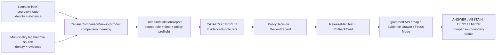

<!-- [KFM_META_BLOCK_V2]
doc_id: kfm://doc/contracts-domains-settlements-infrastructure-viewing-product-census-comparison
title: Census Comparison Viewing Product Contract — Settlements / Infrastructure
type: semantic-contract; viewing-product-profile
version: v0.2
status: draft; PROPOSED; schema-missing; canonical-working-lane; slug-CONFLICTED-with-singular-settlement; census-place-vs-municipality-boundary; NEEDS VERIFICATION before promotion
owners:
  - OWNER_TBD — Settlements/Infrastructure domain steward
  - OWNER_TBD — Settlements sublane steward
  - OWNER_TBD — Map/UI steward
  - OWNER_TBD — Census/source steward
  - OWNER_TBD — Evidence steward
  - OWNER_TBD — Policy steward
  - OWNER_TBD — Contracts steward
  - OWNER_TBD — Schema steward
  - OWNER_TBD — Release steward
  - OWNER_TBD — Docs steward
created: NEEDS VERIFICATION — scaffold existed before v0.2 expansion
updated: 2026-06-23
policy_label: public; contracts; settlements-infrastructure; viewing-product; census-comparison; CensusPlace; Municipality; settlement; map-ui; evidence-drawer; source-role-aware; temporal-scope-aware; evidence-bound; policy-aware; release-gated; rollback-aware; not-census-source-truth; not-legal-status-proof; not-boundary-authority; not-demographic-forecast; not-publication-authority
tags: [kfm, contracts, settlements-infrastructure, viewing-product-census-comparison, viewing-product, census-comparison, CensusPlace, Municipality, Settlement, PlaceIdentity, DomainFeatureIdentity, DomainObservation, DomainLayerDescriptor, DomainValidationReport, EvidenceDrawerPayload, MapContextEnvelope, FocusMode, SourceDescriptor, EvidenceRef, EvidenceBundle, PolicyDecision, ReviewRecord, ReleaseManifest, RollbackCard]
related:
  - ./README.md
  - ./place-identity.md
  - ./domain_feature_identity.md
  - ./domain_observation.md
  - ./domain_layer_descriptor.md
  - ./domain_validation_report.md
  - ./evidence-drawer-payload.md
  - ./people-land-crosswalk.md
  - ../settlement/README.md
  - ../../../docs/domains/settlements-infrastructure/README.md
  - ../../../docs/domains/settlements-infrastructure/MAP_UI_CONTRACTS.md
  - ../../../docs/domains/settlements-infrastructure/CANONICAL_PATHS.md
  - ../../../docs/domains/settlements-infrastructure/sublanes/settlements.md
  - ../../../schemas/contracts/v1/domains/settlements-infrastructure/viewing-product-census-comparison.schema.json
  - ../../../schemas/contracts/v1/ui/evidence_drawer_payload.schema.json
  - ../../../policy/domains/settlements-infrastructure/
  - ../../../fixtures/domains/settlements-infrastructure/viewing-product-census-comparison/
  - ../../../tests/domains/settlements-infrastructure/
  - ../../../release/candidates/settlements-infrastructure/
notes:
  - "Expanded from a PROPOSED scaffold at contracts/domains/settlements-infrastructure/viewing-product-census-comparison.md."
  - "A paired schema at schemas/contracts/v1/domains/settlements-infrastructure/viewing-product-census-comparison.schema.json was not found in this task. Field realization remains PROPOSED."
  - "Map/UI doctrine lists Census-place comparison as a proposed viewing product that compares CensusPlace and Municipality deltas with sensitivity-redacted surfaces where joins apply."
  - "This contract defines viewing-product meaning only. It does not author Census source truth, legal municipal status, boundary authority, demographic forecasts, policy decisions, map truth, graph truth, or publication approval."
  - "CensusPlace and Municipality must remain distinct identity families; Census enumeration is not legal municipal authority."
  - "The singular contracts/domains/settlement path remains a compatibility / variance surface, not a canonical replacement, unless an ADR resolves otherwise."
[/KFM_META_BLOCK_V2] -->

<a id="top"></a>

# Census Comparison Viewing Product Contract — Settlements / Infrastructure

> Semantic contract for `viewing-product-census-comparison`: the governed map/UI viewing product that compares `CensusPlace` and `Municipality` records as evidence-scoped place identities while preserving source role, census vintage, legal-status boundaries, time scope, policy state, release state, correction lineage, and rollback targets.

<p>
  
  
  
  
  
  
  
</p>

`contracts/domains/settlements-infrastructure/viewing-product-census-comparison.md`

## Quick jumps

[Status](#status) · [Meaning](#meaning) · [Repo fit](#repo-fit) · [Schema posture](#schema-posture) · [Accepted uses](#accepted-uses) · [Exclusions](#exclusions) · [Recommended fields](#recommended-fields) · [Viewing-product model](#viewing-product-model) · [Comparison families](#comparison-families) · [Source-role and time rules](#source-role-and-time-rules) · [Sensitivity and publication posture](#sensitivity-and-publication-posture) · [Invariants](#invariants) · [Lifecycle](#lifecycle) · [Validation](#validation) · [Rollback](#rollback) · [Evidence basis](#evidence-basis) · [Open questions](#open-questions)

---

## Status

> [!IMPORTANT]
> **Status:** `draft` / semantic contract / viewing-product profile  
> **Owner:** `OWNER_TBD`  
> **Contract path:** `contracts/domains/settlements-infrastructure/viewing-product-census-comparison.md`  
> **Schema path checked:** `schemas/contracts/v1/domains/settlements-infrastructure/viewing-product-census-comparison.schema.json` — **not found in this task**  
> **Truth posture:** target path, prior scaffold, Settlements/Infrastructure parent doctrine, Map/UI contract surface, place-identity contract, Evidence Drawer payload contract, and current repo search results are confirmed from current repo evidence. Field-level shape, validator behavior, fixture coverage, Census source registry behavior, TIGER/GNIS/source-ingest behavior, comparison runtime, layer registry entries, governed API routes, public API behavior, map rendering, graph behavior, release manifests, and emitted viewing products remain **NEEDS VERIFICATION**.

> [!CAUTION]
> This contract defines viewing-product meaning only. It does **not** create Census source truth, legal municipal status, boundary authority, demographic forecast, redistricting/administrative determination, public map approval, graph authority, or AI answer authority.

---

## Meaning

`viewing-product-census-comparison` defines the Settlements/Infrastructure UI profile for comparing Census-defined place identities with municipal/legal place identities.

It may compare or explain:

- `CensusPlace` against `Municipality`;
- `CensusPlace` against generic `Settlement` context;
- incorporated-place, CDP, or other census-vintage observations against municipal/legal records;
- name, alias, source-native ID, vintage, boundary/support geometry, and time-scope deltas;
- Evidence Drawer claims that explain why Census and legal/admin sources disagree or should not be collapsed;
- Focus Mode responses that answer with finite outcomes over released comparison evidence.

The viewing product answers:

- Which census source and vintage support the `CensusPlace` side?
- Which legal/admin source and valid time support the `Municipality` side?
- Are the place names, source-native IDs, geometries, and time scopes aligned, partially aligned, conflicting, stale, or unresolved?
- What can be displayed publicly, generalized, redacted, denied, or held for review?
- Which EvidenceBundle, PolicyDecision, ReviewRecord, ReleaseManifest, correction, and RollbackCard govern the comparison?

This file owns the **viewing-product contract meaning**. It does not own Census source ingestion, municipal legal status, boundary truth, source activation, map renderer behavior, comparison algorithm implementation, policy decisions, release approval, or AI answers.

---

## Repo fit

| Responsibility | Path or root | Relationship |
|---|---|---|
| Parent contract lane | `./README.md` | Defines this folder as semantic contracts only. |
| Place identity companion | `./place-identity.md` | Defines CensusPlace and Municipality as distinct place identity families. |
| Broad identity envelope | `./domain_feature_identity.md` | Comparison subjects must remain source-role/family/time/evidence aware. |
| Observation companion | `./domain_observation.md` | Source observations may support each side of comparison but do not become truth by themselves. |
| Layer descriptor companion | `./domain_layer_descriptor.md` | Viewing product may be represented by a layer descriptor after release gates. |
| Validation companion | `./domain_validation_report.md` | Validation can check comparison support; it is not approval. |
| Evidence Drawer profile | `./evidence-drawer-payload.md` | Drawer may show comparison support after evidence and policy filtering. |
| People/Land crosswalk | `./people-land-crosswalk.md` | Residence, parcel, ownership, and living-person joins remain excluded unless owning lane clears them. |
| Map/UI doctrine | `../../../docs/domains/settlements-infrastructure/MAP_UI_CONTRACTS.md` | Lists Census-place comparison as a proposed viewing product. |
| Parent domain doctrine | `../../../docs/domains/settlements-infrastructure/README.md` | Names CensusPlace and Municipality among the owned object families. |
| Settlements sublane doctrine | `../../../docs/domains/settlements-infrastructure/sublanes/settlements.md` | Defines settlement-side place/community families and non-ownership boundaries. |
| Paired schema | `../../../schemas/contracts/v1/domains/settlements-infrastructure/viewing-product-census-comparison.schema.json` | Not found in this task; do not infer field enforcement. |
| Policy | `../../../policy/domains/settlements-infrastructure/` | Allow/deny/restrict/abstain and release controls. |
| Release/rollback | `../../../release/candidates/settlements-infrastructure/` and release roots | Release, correction, rollback, and derivative invalidation. |

---

## Schema posture

A direct paired schema was checked at:

```text
schemas/contracts/v1/domains/settlements-infrastructure/viewing-product-census-comparison.schema.json
```

That file was **not found** in this task.

> [!WARNING]
> Because no paired schema was confirmed, every field below is **PROPOSED** semantic guidance. Do not treat it as machine-enforced until schema, fixtures, validators, policy tests, release checks, governed API behavior, and runtime behavior are verified.

---

## Accepted uses

| Use | Allowed? | Rule |
|---|---:|---|
| Comparing CensusPlace and Municipality identity support | Yes | Must preserve source role, source-native ID, vintage, valid time, geometry support, and EvidenceBundle refs. |
| Showing map/UI deltas between census and legal/admin place representations | Conditional | Requires released layers, policy state, public geometry rule, and rollback target. |
| Explaining disagreement or non-equivalence in Evidence Drawer | Conditional | Must show evidence and limitations; do not pick a winner by display name alone. |
| Supporting Focus Mode comparison answers | Conditional | AI must cite EvidenceBundle refs and finite outcomes; no unsupported synthesis. |
| Showing generalized comparison geometry | Conditional | Must be release-supported and policy-safe. |
| Flagging unresolved or stale comparison state | Yes | ABSTAIN, DENY, and ERROR are valid outcomes. |
| Certifying legal municipal status, Census source truth, boundary authority, demographic forecasts, residence/ownership joins, or public access | No | Use owning lanes and official evidence; return ABSTAIN/DENY/ERROR where unsupported. |

---

## Exclusions

`viewing-product-census-comparison` must not be used as:

| Misuse | Required outcome |
|---|---|
| Census source truth | Use source/EvidenceBundle records and source-role validation. |
| Municipal legal-status proof | Use legal/admin evidence and a separate status/event contract where available. |
| Boundary authority | Use source-scoped geometry and public geometry rules; do not assert boundary truth by viewer overlay. |
| Demographic forecast or trend proof | Out of scope unless a separately governed demographic contract exists. |
| Redistricting, taxation, zoning, or planning authority | Use official source evidence and policy-reviewed language, or abstain. |
| Residence, ownership, parcel, or living-person join | Use People/DNA/Land controls; this product must not infer those joins. |
| Full UI implementation | Use map/UI components, governed APIs, schemas, and release artifacts. |
| Publication approval | Use PolicyDecision, ReviewRecord, ReleaseManifest, correction path, and RollbackCard. |
| AI answer authority | Focus Mode remains evidence-subordinate and finite-outcome constrained. |

---

## Recommended fields

The following fields are **PROPOSED** until a paired schema is added and validated.

| Field | Meaning |
|---|---|
| `id` | Canonical census-comparison viewing product identifier. |
| `version` | Contract/object version. |
| `spec_hash` | Deterministic hash over normalized viewing-product content. |
| `domain` | Expected value: `settlements-infrastructure`. |
| `viewing_product_type` | Expected value: `census_place_comparison` unless schema chooses an enum. |
| `census_place_ref` | CensusPlace identity, feature, observation, or EvidenceBundle ref. |
| `municipality_ref` | Municipality identity, feature, observation, or EvidenceBundle ref. |
| `settlement_ref` | Optional broader Settlement context ref. |
| `comparison_basis` | Name, source-native ID, geometry, valid time, vintage, status, overlap, adjacency, supersession, or source-specific basis. |
| `census_source_ref` | Census/TIGER/source registry ref. |
| `municipal_source_ref` | Legal/admin/municipal/source registry ref. |
| `census_vintage` | Census source vintage or release year, if available. |
| `legal_valid_time` | Valid/effective interval for municipality/legal status, if available. |
| `source_role_summary` | Source-role posture for both sides. |
| `evidence_refs` | EvidenceRefs or EvidenceBundle refs supporting each side. |
| `comparison_outcome` | Match, partial-match, overlap, conflict, stale, candidate, unresolved, denied, or source-specific outcome. |
| `public_geometry_rule` | Exact, generalized, aggregate, hidden, denied, review-only, or source-specific posture. |
| `map_layer_refs` | Released layer/layer-descriptor refs used for rendering. |
| `drawer_payload_ref` | EvidenceDrawerPayload ref if a drawer view exists. |
| `focus_mode_trace_ref` | AIReceipt or Focus Mode response ref if used. |
| `policy_decision_ref` | PolicyDecision governing use/publication. |
| `review_ref` | ReviewRecord or steward review ref. |
| `release_manifest_ref` | ReleaseManifest or MapReleaseManifest ref. |
| `rollback_ref` | RollbackCard or rollback target. |
| `limitations` | Caveats: viewing product only; not legal status, not Census truth, not boundary authority. |

---

## Viewing-product model

A reviewed viewing product should bind both sides of the comparison to evidence, source role, time scope, public geometry rules, and finite outcomes.

```text
viewing_product_census_comparison = {
  domain,
  viewing_product_type,
  census_place_ref,
  municipality_ref,
  comparison_basis,
  census_source_ref,
  municipal_source_ref,
  census_vintage,
  legal_valid_time,
  source_role_summary,
  evidence_refs,
  comparison_outcome,
  public_geometry_rule,
  map_layer_refs,
  policy_decision_ref,
  review_ref,
  release_manifest_ref,
  rollback_ref
}
```

The exact serialized shape is **NEEDS VERIFICATION** until the schema and validators are field-complete.

---

## Comparison families

| Comparison family | Meaning | Guardrail |
|---|---|---|
| `name_alignment` | Census and municipal names or aliases align. | Name alignment is not identity merger. |
| `name_conflict` | Names differ, or alias support is incomplete. | Show conflict or abstain; do not silently normalize. |
| `geometry_overlap` | Source-scoped geometries overlap or differ. | Geometry overlap is not legal boundary proof. |
| `vintage_delta` | Census vintage and legal/admin valid time differ materially. | Time axes must remain visible. |
| `status_delta` | Census place type and municipal legal status differ. | Census enumeration is not legal authority. |
| `candidate_match` | Automated or weak-source matching suggests relation. | Review only until evidence and validation support it. |
| `released_comparison` | Released public-safe comparison exists. | Must cite release/rollback refs. |
| `denied_or_abstained_comparison` | Evidence/policy/source role blocks comparison. | Surface finite outcome; do not invent explanation. |

---

## Source-role and time rules

| Rule | Requirement |
|---|---|
| CensusPlace and Municipality remain distinct | Census enumeration, CDP/included-place status, and municipal legal status must not collapse. |
| Census vintage is part of meaning | The comparison must carry census vintage or source release time where material. |
| Legal/admin status is time-scoped | Municipal legal status must carry valid/effective time where available. |
| Source-native IDs matter | Display names alone are insufficient for comparison. |
| Geometry is support, not authority | Boundary/geometry overlays are source-scoped display support, not legal proof. |
| Candidate matches stay candidate | Spatial overlap, fuzzy name match, OCR, model, or connector suggestion does not create a public comparison. |
| Public claims require EvidenceBundle resolution | If evidence cannot resolve, return ABSTAIN, DENY, or ERROR; do not invent the comparison. |

---

## Sensitivity and publication posture

| Surface | Default posture | Reason |
|---|---|---|
| CensusPlace vs Municipality public comparison | Public-safe if released | Still needs source role, vintage, valid time, EvidenceBundle, and release state. |
| Boundary/geometry comparison | Public-safe only where source and policy allow | Geometry can be stale, source-scoped, or legally ambiguous. |
| Historic or superseded place comparison | Public-safe summary, review where sensitive | Historical labels and supersession need caveats. |
| ReservationCommunity-adjacent comparison | Review / summarized by default | Sovereignty, cultural context, and living-person adjacency may apply. |
| People/land joins | Deny/restrict by default | Residence, parcel, and ownership remain People/DNA/Land controlled. |
| Candidate/model comparison | Review only | Automated support does not close evidence. |

---

## Invariants

1. **Viewing product is not source truth.** It presents a governed comparison, not canonical Census or municipal authority.
2. **CensusPlace is not Municipality.** Census and legal/admin place identities remain separate unless evidence supports a scoped relation.
3. **Name is not identity.** Same or similar names do not merge records without source-native IDs, family, time, and evidence.
4. **Geometry is not boundary authority.** Map overlap does not certify legal boundaries or Census authority.
5. **Vintage and valid time stay visible.** Census vintage, source time, legal valid time, release time, and correction time must not collapse.
6. **Evidence outranks viewer.** A comparison view cannot strengthen weak or unresolved evidence.
7. **Public geometry is policy-filtered.** Sensitive or uncertain relations may require aggregation, generalization, review-only status, or denial.
8. **Release is separate.** A valid comparison does not publish anything without PolicyDecision, ReviewRecord, ReleaseManifest, and RollbackCard where required.
9. **AI is downstream.** Focus Mode may explain only released evidence and policy-permitted context.
10. **No direct internal-store reads.** Public clients use governed APIs and released artifacts only.
11. **Singular `settlement` remains conflicted.** Do not route canonical viewing products through the singular compatibility path without ADR.

---

## Lifecycle



Contracts describe meaning. They do not move data, validate schema shape, run comparison algorithms, decide policy, publish artifacts, render maps, or authorize AI answers.

---

## Validation

Before this contract is treated as mature, maintainers should verify:

- [ ] whether this viewing product needs a paired schema or should be represented through a generic viewing-product schema plus a domain profile;
- [ ] schema includes CensusPlace ref, Municipality ref, source refs, source-native IDs, census vintage, legal valid time, comparison basis, comparison outcome, public geometry rule, policy/review/release/rollback refs, and limitations;
- [ ] fixtures cover name alignment, name conflict, geometry overlap, geometry mismatch, vintage delta, legal-status delta, candidate match, stale data, denied comparison, and abstained comparison;
- [ ] tests prevent comparison views from becoming Census truth, legal municipal status, boundary authority, demographic forecast, residence/ownership join, release approval, or AI authority;
- [ ] tests preserve source-role and time-axis distinctions;
- [ ] tests enforce ABSTAIN/DENY/ERROR when evidence, source role, sensitivity, vintage, legal valid time, geometry posture, or release state is unresolved;
- [ ] public map, Evidence Drawer, Focus Mode, exports, and AI summaries use only released/governed comparison projections;
- [ ] rollback invalidates linked layers, drawer payloads, Focus Mode citations, exports, caches, graph projections, and AI summaries that cited a withdrawn comparison.

---

## Rollback

Rollback is required if this contract:

- claims schema, validator, fixture, test, policy, release, API, comparison algorithm, map, graph, or runtime behavior exists without proof;
- treats Census comparison as Census source truth, legal municipal status, boundary authority, demographic forecast, residence/ownership join, release approval, or AI authority;
- collapses CensusPlace and Municipality by display name alone;
- hides source-role conflict, candidate status, census vintage, legal valid-time limits, geometry caveats, supersession, or correction lineage;
- exposes sensitive or unsupported joins through examples, public wording, map layers, or drawer text;
- normalizes direct UI access to internal lifecycle stores or direct model output;
- treats the singular `settlement` path as canonical authority without ADR support.

Rollback target: revert `contracts/domains/settlements-infrastructure/viewing-product-census-comparison.md` to prior scaffold blob `7feface22a11738b3013c78f01da995d049e2e5c`, record drift if authority boundaries were affected, and invalidate downstream derivatives that relied on weakened census-comparison semantics.

---

## Evidence basis

| Evidence | Status | Supports | Limits |
|---|---|---|---|
| Prior `contracts/domains/settlements-infrastructure/viewing-product-census-comparison.md` | `CONFIRMED` | Target file existed as a PROPOSED scaffold sourced from the expansion backlog. | Scaffold did not define authoritative semantic contract content. |
| Paired schema lookup | `CONFIRMED not found in this task` | Justifies schema-missing posture. | Does not rule out alternate schema names or future ADR-selected homes. |
| `docs/domains/settlements-infrastructure/MAP_UI_CONTRACTS.md` | `CONFIRMED doctrine / PROPOSED implementation` | Names Census-place comparison as a viewing product and defines governed map/UI surfaces, finite outcomes, and Evidence Drawer behavior. | Does not prove schema, API, renderer, or released layer implementation. |
| `docs/domains/settlements-infrastructure/README.md` | `CONFIRMED doctrine / PROPOSED implementation` | Names `CensusPlace` and `Municipality` as object families and preserves source/temporal identity posture. | Does not prove comparison implementation. |
| `contracts/domains/settlements-infrastructure/place-identity.md` | `CONFIRMED sibling contract` | Defines CensusPlace and Municipality as distinct place identity families with source-role/time boundaries. | Does not define viewing-product machine shape. |
| `contracts/domains/settlements-infrastructure/evidence-drawer-payload.md` | `CONFIRMED sibling contract` | Defines drawer as governed projection, not EvidenceBundle or policy authority. | Does not prove UI schema maturity or route behavior. |
| Uploaded KFM authoring prompt v2 | `CONFIRMED user-supplied guidance` | Requires evidence-first, implementation-honest, visually polished Markdown with visible verification and rollback posture. | Authoring guidance, not implementation proof. |

---

## Open questions

| ID | Question | Status |
|---|---|---|
| OQ-SI-CEN-CMP-01 | Should this file remain a standalone viewing-product contract, or become a profile under a generic `viewing_product` schema? | OPEN / DOMAIN + SCHEMA REVIEW |
| OQ-SI-CEN-CMP-02 | Which Census source families, vintages, source-native IDs, and geometry refs are required for `CensusPlace` comparison? | OPEN / SOURCE REVIEW |
| OQ-SI-CEN-CMP-03 | Which legal/admin sources and valid-time fields are required for `Municipality` comparison? | OPEN / SOURCE REVIEW |
| OQ-SI-CEN-CMP-04 | Which comparison outcomes and reason codes are canonical? | OPEN / SCHEMA REVIEW |
| OQ-SI-CEN-CMP-05 | How should Evidence Drawer and Focus Mode present Census-vs-Municipality disagreement without implying legal status or boundary authority? | OPEN / MAP/UI REVIEW |
| OQ-SI-CEN-CMP-06 | How should rollback invalidate map labels, drawer payloads, Focus Mode claims, exports, caches, graph projections, and AI summaries after a comparison correction? | OPEN / RELEASE REVIEW |

<p align="right"><a href="#top">Back to top</a></p>
