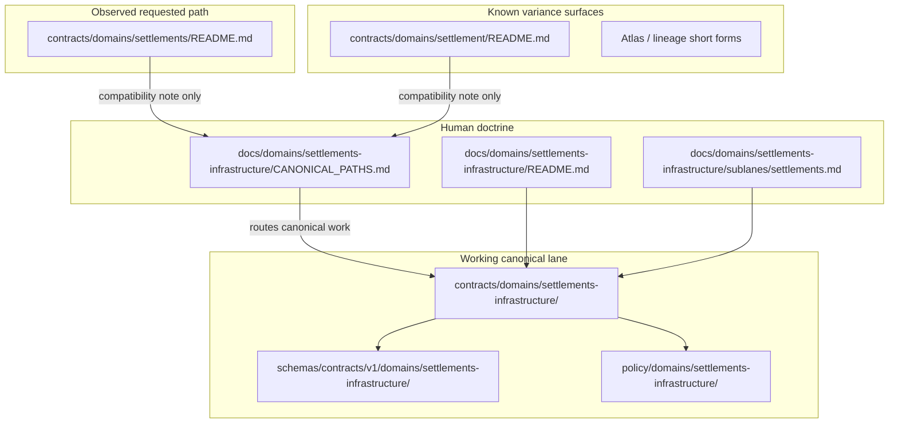

<!-- [KFM_META_BLOCK_V2]
doc_id: kfm://doc/contracts-domains-settlements-readme
title: Settlements Contract Lane README — Compatibility / Variance Surface
type: readme; contract-lane-readme; compatibility-note
version: v0.2
status: draft; CONFLICTED; compatibility-surface; plural-settlements-variant; canonical-working-lane-is-settlements-infrastructure; NEEDS VERIFICATION before promotion
owners:
  - OWNER_TBD — Settlements/Infrastructure domain steward
  - OWNER_TBD — Settlements sublane steward
  - OWNER_TBD — Contracts steward
  - OWNER_TBD — Schema steward
  - OWNER_TBD — Policy steward
  - OWNER_TBD — Docs steward
created: NEEDS VERIFICATION — empty file existed before v0.2 expansion
updated: 2026-06-23
policy_label: public; contracts; settlements; compatibility; conflicted-slug; settlements-infrastructure; no-parallel-authority; adr-needed; release-gated; rollback-aware
tags: [kfm, contracts, settlements, settlements-infrastructure, compatibility, variance, domain-placement, semantic-contracts, contracts-root, schemas, policy, ADR, EvidenceBundle, PolicyDecision, ReviewRecord, ReleaseManifest, RollbackCard]
related:
  - ../README.md
  - ../../README.md
  - ../settlements-infrastructure/README.md
  - ../settlement/README.md
  - ../../../docs/domains/settlements-infrastructure/README.md
  - ../../../docs/domains/settlements-infrastructure/CANONICAL_PATHS.md
  - ../../../docs/domains/settlements-infrastructure/sublanes/settlements.md
  - ../../../docs/domains/settlements-infrastructure/sublanes/infrastructure.md
  - ../../../docs/architecture/domain-placement-law.md
  - ../../../docs/doctrine/directory-rules.md
  - ../../../schemas/contracts/v1/domains/settlements-infrastructure/
  - ../../../policy/domains/settlements-infrastructure/
notes:
  - "Expanded from an empty README at contracts/domains/settlements/README.md."
  - "This plural path is treated as a compatibility / variance surface, not as the canonical Settlements/Infrastructure contract lane."
  - "Current inspected doctrine and contract-lane README point canonical contract work to contracts/domains/settlements-infrastructure/ unless an ADR resolves otherwise."
  - "The singular contracts/domains/settlement/ path is already treated as a compatibility / variance surface; this plural path follows the same no-parallel-authority posture."
  - "Do not add new canonical settlement object-family contracts here without ADR resolution."
[/KFM_META_BLOCK_V2] -->

# Settlements Contract Lane README — Compatibility / Variance Surface

> Orientation README for `contracts/domains/settlements/`: a **CONFLICTED compatibility surface** for plural `settlements` contract references while KFM resolves settlement-domain path variance. Canonical Settlements/Infrastructure contract work should use the ADR-approved domain lane, currently documented as `contracts/domains/settlements-infrastructure/` unless and until an ADR says otherwise.

  
  
  
  
  
  

**Status:** draft / compatibility surface  
**Owners:** `OWNER_TBD — Settlements/Infrastructure domain steward`, `OWNER_TBD — Contracts steward`, `OWNER_TBD — Docs steward`  
**Path:** `contracts/domains/settlements/README.md`  
**Canonical target lane:** `contracts/domains/settlements-infrastructure/` — **NEEDS VERIFICATION / ADR-sensitive**  
**Truth posture:** this README path exists in the repo as an empty file before this update; its canonical authority is **CONFLICTED** because settlement-related path forms differ across KFM doctrine and lineage materials.

## Quick jumps

[Purpose](#purpose) · [Status and authority](#status-and-authority) · [Repo fit](#repo-fit) · [Accepted inputs](#accepted-inputs) · [Exclusions](#exclusions) · [Placement map](#placement-map) · [Object-family boundary](#object-family-boundary) · [Maintainer rules](#maintainer-rules) · [Validation](#validation) · [Rollback](#rollback) · [Evidence basis](#evidence-basis) · [Open questions](#open-questions)

---

## Purpose

`contracts/domains/settlements/` is a **guarded compatibility lane**. It exists to prevent the plural `settlements` path from becoming a silent parallel authority beside the working canonical `settlements-infrastructure` lane.

This README does four things:

1. marks the current path as **CONFLICTED / NEEDS VERIFICATION**;
2. points maintainers toward the current working canonical lane, `contracts/domains/settlements-infrastructure/`;
3. distinguishes plural `settlements/` from the settlement sublane doctrine in `docs/domains/settlements-infrastructure/sublanes/settlements.md`;
4. states that semantic contracts, schemas, policy, fixtures, tests, release records, and lifecycle data must stay in their proper responsibility roots.

> [!IMPORTANT]
> This README does **not** promote `contracts/domains/settlements/` to the canonical contract home. It is a warning sign, redirect, and migration aid until an ADR resolves the naming/path conflict.

---

## Status and authority

| Question | Answer | Truth label |
|---|---|---|
| Does this README path exist? | Yes: `contracts/domains/settlements/README.md`. | **CONFIRMED** |
| Was there strong content here before this update? | No. The file existed as an empty file. | **CONFIRMED** |
| Is `contracts/` the semantic-contract responsibility root? | Yes. `contracts/` says contracts define object meaning and schemas define shape. | **CONFIRMED** |
| Is `contracts/domains/settlements-infrastructure/` the current working lane? | Yes in inspected contract-lane and canonical-path doctrine. | **CONFIRMED doctrine / NEEDS VERIFICATION in implementation** |
| Is plural `contracts/domains/settlements/` a clean canonical replacement? | No. It is a conflicted variance surface, not a resolved authority home. | **CONFLICTED** |
| Should new canonical settlement contracts be added here? | No, not without ADR resolution. | **DENY by default** |

---

## Repo fit

| Responsibility | Correct home | How this README relates |
|---|---|---|
| Human domain doctrine | `docs/domains/settlements-infrastructure/` | Explains combined settlement + infrastructure domain scope. |
| Settlement sublane doctrine | `docs/domains/settlements-infrastructure/sublanes/settlements.md` | Explains place/community identity subset. This plural compatibility path is not that sublane. |
| Canonical contract lane | `contracts/domains/settlements-infrastructure/` | Current working contract lane per inspected path doctrine; still needs maturity verification. |
| Singular compatibility path | `contracts/domains/settlement/README.md` | Existing singular warning surface; this plural path follows the same no-parallel-authority rule. |
| This compatibility path | `contracts/domains/settlements/README.md` | Conflict marker and navigation surface only. |
| Machine schemas | `schemas/contracts/v1/domains/settlements-infrastructure/` or ADR-selected equivalent | Do not create schema authority here. |
| Policy | `policy/domains/settlements-infrastructure/` or ADR-selected equivalent | Admissibility/release decisions stay out of contracts. |
| Data lifecycle | `data/raw|work|quarantine|processed|catalog|published/...` | Contract docs never contain lifecycle data. |
| Release decisions | `release/` / `release/candidates/...` | Publication is a governed state transition, not README text. |

---

## Accepted inputs

Only these belong in `contracts/domains/settlements/` while the path remains conflicted:

- this README as a compatibility / variance warning;
- a future ADR pointer if maintainers decide this path must stay for compatibility;
- temporary migration notes that explicitly route canonical work to the ADR-approved lane;
- deprecation notes or redirect stubs if a cleanup migration removes this path later.

Any such file must preserve the same posture: **this path is not a place to create new canonical object-family contracts until the conflict is resolved.**

---

## Exclusions

| Do not put this here | Use instead |
|---|---|
| `Settlement`, `Municipality`, `CensusPlace`, `Townsite`, `GhostTown`, `Fort`, `Mission`, or `ReservationCommunity` semantic contracts | `contracts/domains/settlements-infrastructure/` unless ADR selects another path |
| Infrastructure contracts such as `InfrastructureAsset`, `NetworkNode`, `Facility`, `ServiceArea`, `Operator`, `ConditionObservation`, `Dependency` | `contracts/domains/settlements-infrastructure/` unless ADR selects another path |
| Cross-domain contracts for Roads/Rail, Hydrology, Hazards, People/Land, or Archaeology relations | Existing crosswalk files under `contracts/domains/settlements-infrastructure/` or owning lanes unless ADR says otherwise |
| JSON Schemas | `schemas/contracts/v1/domains/settlements-infrastructure/` or ADR-selected schema home |
| Sensitivity, release, redaction, or admissibility rules | `policy/domains/settlements-infrastructure/` or ADR-selected policy home |
| Fixtures, validator examples, or tests | `fixtures/domains/settlements-infrastructure/`, `tests/domains/settlements-infrastructure/` |
| RAW / WORK / QUARANTINE / PROCESSED / CATALOG / PUBLISHED data | `data/<phase>/settlements-infrastructure/` or ADR-selected lifecycle lane |
| Release manifests, rollback cards, or correction notices | `release/` and release-candidate roots |
| Transport-route truth, depot as rail role, road/rail corridor truth | `roads-rail-trade` domain lanes |
| Living-person, parcel, title, ownership, or DNA truth | `people-dna-land` domain lanes |
| Archaeological/sacred/cultural-site truth | `archaeology` domain lanes and policy review |

> [!WARNING]
> Adding canonical contracts under both `contracts/domains/settlements/` and `contracts/domains/settlements-infrastructure/` would create parallel semantic authority. That is a governance risk and should be treated as ADR-class drift.

---

## Placement map

---

## Object-family boundary

`settlements` can sound like the place/community subset, but KFM currently treats Settlements/Infrastructure as a combined domain lane. Place/community identities are a **sublane** inside that domain, not a separate contract authority root.

| Settlement-side family | Canonical semantic home while conflict remains |
|---|---|
| `Settlement` | `contracts/domains/settlements-infrastructure/` |
| `Municipality` | `contracts/domains/settlements-infrastructure/` |
| `CensusPlace` | `contracts/domains/settlements-infrastructure/` |
| `Townsite` | `contracts/domains/settlements-infrastructure/` |
| `GhostTown` | `contracts/domains/settlements-infrastructure/` |
| `Fort` | `contracts/domains/settlements-infrastructure/` |
| `Mission` | `contracts/domains/settlements-infrastructure/` |
| `ReservationCommunity` | `contracts/domains/settlements-infrastructure/` |

This path may reference those families only to redirect or explain variance. It should not define them.

---

## Maintainer rules

1. **Do not add canonical object contracts here.** Use `contracts/domains/settlements-infrastructure/` unless an ADR changes the canonical lane.
2. **Do not add schemas here.** Machine shape belongs under `schemas/contracts/v1/...`.
3. **Do not add policy here.** Admissibility, redaction, deny/abstain, and release decisions belong under `policy/`.
4. **Do not split settlements from infrastructure by accident.** The current domain lane is combined; settlement-side files can exist inside it without creating a new domain root.
5. **Use this README as a warning marker.** It is a compatibility surface and drift-control aid.
6. **Escalate real path changes to ADR.** A canonical rename from `settlements-infrastructure` to `settlements` would affect contracts, schemas, policy, fixtures, tests, packages, data lifecycle paths, releases, docs, links, caches, and generated artifacts.

---

## Validation

Before promoting this path beyond compatibility status, maintainers should verify:

- [ ] whether any ADR explicitly selects `contracts/domains/settlements/` as canonical;
- [ ] whether any existing schemas, policies, fixtures, tests, packages, pipelines, data, release manifests, or docs already point to this plural path;
- [ ] whether `contracts/domains/settlements-infrastructure/` remains the canonical working lane;
- [ ] whether `contracts/domains/settlement/` and `contracts/domains/settlements/` should both remain as compatibility surfaces or be removed/migrated;
- [ ] whether repository link checkers and documentation indexes route contributors away from this path for new canonical work;
- [ ] whether rollback targets exist for any files that were accidentally promoted under this path.

---

## Rollback

Rollback is required if this README is used to justify canonical object-family contracts, schemas, policy, data lifecycle content, release records, map artifacts, or public API behavior under `contracts/domains/settlements/` without ADR support.

Rollback target: revert `contracts/domains/settlements/README.md` to prior empty blob `8b137891791fe96927ad78e64b0aad7bded08bdc`, then add or update a drift-register item that explains why this compatibility surface was removed or superseded.

---

## Evidence basis

| Evidence | Status | Supports | Limits |
|---|---|---|---|
| Prior `contracts/domains/settlements/README.md` | `CONFIRMED` | Target path existed as an empty file before this update. | Empty file did not define authority or intended use. |
| `contracts/README.md` | `CONFIRMED` | Contracts define semantic meaning; schemas define shape; validation, policy, source data stay elsewhere. | Root README is brief and marks status PROPOSED. |
| `contracts/domains/README.md` | `CONFIRMED` | Domain-specific contracts live under `contracts/domains/`. | Does not resolve domain slug variance. |
| `contracts/domains/settlements-infrastructure/README.md` | `CONFIRMED current working lane doc` | Defines `settlements-infrastructure` as the semantic contract lane and treats singular `settlement/` as compatibility/variance. | Some schema, validator, fixture, policy, release, API, graph, map, and runtime maturity remains NEEDS VERIFICATION. |
| `contracts/domains/settlement/README.md` | `CONFIRMED compatibility pattern` | Existing singular path is documented as compatibility/variance, not canonical authority. | Does not itself resolve plural `settlements/`. |
| `docs/domains/settlements-infrastructure/CANONICAL_PATHS.md` | `CONFIRMED doctrine / CONFLICTED lineage` | Pins working slug `settlements-infrastructure`, records slug variance and ADR-class conflict. | Some path presence remains NEEDS VERIFICATION. |
| `docs/architecture/domain-placement-law.md` | `CONFIRMED derived doctrine / PROPOSED path presence` | Domains are lane segments inside responsibility roots, not root folders; schema home convention and lifecycle invariant stay separate. | Derived from Directory Rules and authored without mounted-repo inspection. |
| Uploaded KFM authoring prompt v2 | `CONFIRMED user-supplied guidance` | Requires evidence-first, implementation-honest, visually polished Markdown with no hidden uncertainty and rollback posture. | Authoring guidance, not implementation proof. |

---

## Open questions

| ID | Question | Status |
|---|---|---|
| OQ-CONTRACTS-SETTLEMENTS-01 | Should plural `contracts/domains/settlements/` be removed, retained as compatibility, or elevated by ADR? | OPEN / ADR REVIEW |
| OQ-CONTRACTS-SETTLEMENTS-02 | Should singular `contracts/domains/settlement/` and plural `contracts/domains/settlements/` share one redirect policy? | OPEN / DOCS + ADR REVIEW |
| OQ-CONTRACTS-SETTLEMENTS-03 | Should docs indexes explicitly list this path as DENY-by-default for canonical object contracts? | OPEN / DOCS REVIEW |
| OQ-CONTRACTS-SETTLEMENTS-04 | Which link-check, schema-check, or docs-lint rule should prevent future parallel authority under this path? | OPEN / VALIDATION REVIEW |
| OQ-CONTRACTS-SETTLEMENTS-05 | How should rollback invalidate any docs, generated indexes, or AI summaries that cited this path as canonical? | OPEN / RELEASE REVIEW |

<a href="#top">Back to top</a>

