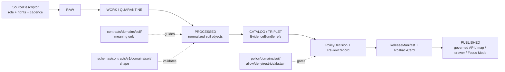

<!-- [KFM_META_BLOCK_V2]
doc_id: kfm://doc/contracts-domains-soil-readme
title: Soil Contract Lane README
type: readme; contract-lane-readme
version: v0.2
status: draft; experimental; canonical-working-lane; schema-home-variance-noted; NEEDS VERIFICATION before promotion
owners:
  - OWNER_TBD — Soil domain steward
  - OWNER_TBD — Contracts steward
  - OWNER_TBD — Schema steward
  - OWNER_TBD — Policy steward
  - OWNER_TBD — Source steward
  - OWNER_TBD — Docs steward
created: NEEDS VERIFICATION — greenfield scaffold existed before v0.2 expansion
updated: 2026-06-23
policy_label: public; contracts; soil; semantic-contracts; source-role-aware; support-type-separation; lifecycle-aware; policy-aware; release-gated; rollback-aware; no-parallel-authority
tags: [kfm, contracts, soil, semantic-contracts, SourceDescriptor, EvidenceRef, EvidenceBundle, PolicyDecision, ReviewRecord, ReleaseManifest, RollbackCard, SoilMapUnit, SoilComponent, Horizon, SoilProperty, HydrologicSoilGroup, SoilMoistureObservation, Pedon, SoilProfileView, ErosionRisk, SuitabilityRating, SoilTimeCaveat]
related:
  - ../README.md
  - ../../README.md
  - ../../../docs/domains/soil/README.md
  - ../../../docs/domains/soil/CANONICAL_PATHS.md
  - ../../../docs/domains/soil/ARCHITECTURE.md
  - ../../../docs/domains/soil/API_CONTRACTS.md
  - ../../../docs/domains/soil/DATA_LIFECYCLE.md
  - ../../../docs/sources/catalog/nrcs/ssurgo.md
  - ../../../docs/sources/catalog/nrcs/gssurgo.md
  - ../../../schemas/contracts/v1/domains/soil/README.md
  - ../../../policy/domains/soil/README.md
  - ../../../fixtures/domains/soil/
  - ../../../tests/domains/soil/
  - ../../../release/candidates/soil/
notes:
  - "Expanded from a greenfield scaffold at contracts/domains/soil/README.md."
  - "This file defines the contracts responsibility lane only: human-readable semantic meaning for Soil object families."
  - "Schemas, policy, tests, fixtures, packages, pipelines, source registry records, lifecycle data, release manifests, and source data remain in their own responsibility roots."
  - "Soil canonical-path doctrine records a naming variance between contracts/domains/soil and contracts/soil from Atlas lineage. This README treats contracts/domains/soil as the inspected working lane while preserving the variance as ADR/NEEDS VERIFICATION."
  - "Implementation maturity remains NEEDS VERIFICATION where object-level schemas, validators, fixtures, policy tests, released artifacts, public APIs, graph projections, map rendering, and runtime behavior were not inspected."
[/KFM_META_BLOCK_V2] -->

<a id="top"></a>

# Soil Contract Lane README

> Contract-lane README for `contracts/domains/soil/`: the human-readable semantic contract home for Soil object-family meaning. Contracts say **what soil objects mean**; schemas say **what they look like**; policy says **whether and how they may be used or released**.

<p>
  
  
  
  
  
  
</p>

**Status:** experimental / draft  
**Owners:** `OWNER_TBD — Soil domain steward`, `OWNER_TBD — Contracts steward`, `OWNER_TBD — Docs steward`  
**Path:** `contracts/domains/soil/README.md`  
**Authority class:** semantic-contract lane README  
**Truth posture:** this file path is **CONFIRMED**; object-level contract maturity, paired schemas, validators, fixtures, policy tests, released artifacts, public APIs, graph behavior, map behavior, and runtime behavior remain **NEEDS VERIFICATION** unless cited elsewhere.

## Quick jumps

[Scope](#scope) · [Status and authority](#status-and-authority) · [Repo fit](#repo-fit) · [Accepted inputs](#accepted-inputs) · [Exclusions](#exclusions) · [Directory map](#directory-map) · [Object-family lanes](#object-family-lanes) · [Contract authoring rules](#contract-authoring-rules) · [Support-type separation](#support-type-separation) · [Lifecycle boundary](#lifecycle-boundary) · [Validation](#validation) · [Rollback](#rollback) · [Evidence basis](#evidence-basis) · [Open questions](#open-questions)

---

## Scope

This folder is the **contracts responsibility-root lane** for the Soil domain.

It may host Markdown semantic contracts for Soil object families such as soil map units, components, horizons, soil properties, hydrologic soil groups, soil-moisture observations, pedons/profile views, erosion-risk interpretations, suitability ratings, component-horizon joins, and temporal caveats.

It must not host schemas, policy, fixtures, tests, packages, pipelines, source registry records, source data, lifecycle data, release decisions, or public artifacts. Those belong in their own responsibility roots.

> [!IMPORTANT]
> A contract is a meaning surface. It can define what `SoilMapUnit`, `SoilComponent`, `Horizon`, or `SuitabilityRating` means inside KFM, but it does not validate JSON, admit a source, release a public layer, publish a map, or authorize an AI answer.

---

## Status and authority

| Question | Answer | Truth label |
|---|---|---|
| Does this README path exist? | Yes: `contracts/domains/soil/README.md`. | **CONFIRMED** |
| Was the prior file complete? | No. It was a short greenfield scaffold and incorrectly implied non-contract materials belonged in this root. | **CONFIRMED / corrected** |
| Is `contracts/` the semantic meaning root? | Yes. The contracts root says contracts define object meaning and schemas define shape. | **CONFIRMED** |
| Is `contracts/domains/soil/` the inspected working lane? | Yes. The file exists and adjacent soil docs use the same lane pattern. | **CONFIRMED path presence / NEEDS VERIFICATION maturity** |
| Is there path variance for Soil contracts/schemas? | Yes. Soil canonical-path doctrine notes `contracts/domains/soil/` vs `contracts/soil/` and analogous schema-home variance from Atlas lineage. | **CONFLICTED / ADR-sensitive** |
| Are object-level contracts, schemas, validators, fixtures, policy tests, and released APIs mature? | Not proven in this task. | **NEEDS VERIFICATION** |

---

## Repo fit

| Responsibility | Path | Role |
|---|---|---|
| Contract lane | `contracts/domains/soil/` | Human-readable semantic meaning for Soil objects. |
| Domain contract index | `contracts/domains/README.md` | Explains that domain-specific contracts live under `contracts/domains/`. |
| Contracts root | `contracts/README.md` | Defines contract-root authority and separation from schemas/policy/data. |
| Soil doctrine | `docs/domains/soil/ARCHITECTURE.md` and `docs/domains/soil/CANONICAL_PATHS.md` | Human-facing domain architecture, path registry, object families, source-role rules, support-type separation, and lifecycle posture. |
| Soil API doctrine | `docs/domains/soil/API_CONTRACTS.md` | Proposed public API and finite-outcome posture for governed Soil surfaces. |
| Soil lifecycle inventory | `docs/domains/soil/DATA_LIFECYCLE.md` | Navigational register of expected Soil artifacts and lifecycle phases; not implementation proof. |
| Source catalog examples | `docs/sources/catalog/nrcs/ssurgo.md`, `docs/sources/catalog/nrcs/gssurgo.md` | Human-facing source/product pages; SourceDescriptor remains authoritative elsewhere. |
| Schema lane | `schemas/contracts/v1/domains/soil/` | JSON Schema / machine shape; not contract prose. |
| Policy lane | `policy/domains/soil/` | Allow/deny/restrict/abstain behavior, sensitivity, rights, and release controls. |
| Tests and fixtures | `tests/domains/soil/`, `fixtures/domains/soil/` | Behavior proof and validation samples. |
| Data lifecycle | `data/raw|work|quarantine|processed|catalog|published/.../soil/` | Lifecycle data and released products; never stored in contracts. |
| Release | `release/` and `release/candidates/soil/` | Promotion, release manifests, correction notices, rollback cards. |

---

## Accepted inputs

Files in this folder may be:

- directory-level README and maintainer guidance;
- object-family semantic contracts such as `soil_map_unit.md`, `soil_component.md`, `horizon.md`, `soil_property.md`, `hydrologic_soil_group.md`, `soil_moisture_observation.md`, `pedon.md`, `soil_profile_view.md`, `erosion_risk.md`, `suitability_rating.md`, `component_horizon_join.md`, or `soil_time_caveat.md` — **PROPOSED filenames until created and schema-aligned**;
- contract indexes, compatibility notes, or migration notes that preserve source-role, support-type, rights, sensitivity, release, correction, and rollback boundaries;
- ADR pointers that explain contract/schema/policy naming variance.

Every contract here should answer:

1. What does the Soil object mean in KFM?
2. What evidence and source-role posture can support it?
3. Which support type does it belong to: static survey, gridded derivative, station observation, satellite grid, pedon/profile, or interpretation?
4. What does it explicitly **not** prove?
5. Which schema, policy, fixture, test, release, and rollback surfaces must remain separate?

---

## Exclusions

| Do not put this here | Correct responsibility root |
|---|---|
| JSON Schema or JSON-LD shape | `schemas/contracts/v1/domains/soil/` or ADR-selected equivalent |
| Policy decisions, sensitivity tiers, redaction rules, allow/deny/abstain logic | `policy/domains/soil/` or cross-cutting policy roots |
| Fixtures and validation examples | `fixtures/domains/soil/` |
| Tests and validators | `tests/domains/soil/`, `tools/validators/` |
| Packages, domain code, adapters, generated SDKs | `packages/domains/soil/` or ADR-selected package lane |
| Pipelines and pipeline specs | `pipelines/domains/soil/`, `pipeline_specs/soil/` |
| Source registry records and SourceDescriptors | `data/registry/sources/soil/` or ADR-selected source registry lane |
| RAW / WORK / QUARANTINE / PROCESSED / CATALOG / PUBLISHED data | `data/<phase>/soil/` |
| Release manifests, rollback cards, correction notices | `release/` roots |
| Public map/API artifacts | released artifact roots and governed API surfaces |
| Crop/yield truth | Agriculture domain lanes |
| Streamflow, groundwater, flood context | Hydrology / Hazards domain lanes |
| Lithology, boreholes, stratigraphy | Geology domain lanes |
| Habitat, ecological system, species truth | Habitat / Flora / Fauna domain lanes |

> [!WARNING]
> This README intentionally corrects the prior scaffold wording that placed “docs, contracts, schemas, policies, fixtures, tests, packages, pipelines, registries, or data lifecycle artifacts” inside `contracts/`. In KFM, responsibility roots do not collapse into a domain folder.

---

## Directory map

The confirmed current file in this lane is this README. Object-level files below are **PROPOSED** until created, reviewed, and paired with schemas/policy/tests.

```text
contracts/domains/soil/
├── README.md                         # CONFIRMED — this contract-lane README
├── soil_map_unit.md                  # PROPOSED — survey map-unit meaning
├── soil_component.md                 # PROPOSED — component within map unit
├── horizon.md                        # PROPOSED — vertical layer meaning
├── component_horizon_join.md         # PROPOSED — MUKEY/COKEY/CHKEY lineage join semantics
├── soil_property.md                  # PROPOSED — measured/derived property semantics
├── hydrologic_soil_group.md          # PROPOSED — runoff-potential classification semantics
├── soil_moisture_observation.md      # PROPOSED — station/satellite observation meaning
├── pedon.md                          # PROPOSED — pedon evidence object meaning
├── soil_profile_view.md              # PROPOSED — profile projection / viewing surface meaning
├── erosion_risk.md                   # PROPOSED — interpretive erosion-risk product meaning
├── suitability_rating.md             # PROPOSED — interpretive suitability rating meaning
└── soil_time_caveat.md               # PROPOSED — temporal limitation / staleness caveat meaning
```

> [!NOTE]
> Filenames above are recommendations for reviewer orientation only. Final object names and file names must align with the schema home, fixtures, validators, and ADR decisions before promotion.

---

## Object-family lanes

| Object family | Contract role | Key boundary |
|---|---|---|
| `SoilMapUnit` | Defines survey map-unit identity and source-supported polygon/unit meaning. | Not a parcel, farm boundary, or current field condition. |
| `SoilComponent` | Defines named component meaning within a map unit, including percent/component posture. | Not interchangeable with map unit or horizon. |
| `Horizon` | Defines vertical soil layer meaning and depth/property context. | Not a stand-alone polygon layer. |
| `Component Horizon Join` | Defines lineage join semantics across map unit, component, and horizon identifiers. | Not a generic relational join free of provenance. |
| `SoilProperty` | Defines measured or derived soil attribute meaning. | Must preserve source role, units, method, depth, and support type. |
| `Hydrologic Soil Group` | Defines runoff-potential classification meaning. | Not a flood observation, forecast, or hydrology truth. |
| `Soil Moisture Observation` | Defines time-series soil moisture observation semantics. | Station, satellite, and survey support must not collapse. |
| `Pedon` / `SoilProfileView` | Defines profile-level evidence and profile display/projection semantics. | Profile view is not map-unit truth by itself. |
| `ErosionRisk` | Defines interpretive erosion-risk product meaning. | Not an authoritative hazard product or crop-management prescription. |
| `SuitabilityRating` | Defines interpretive suitability rating meaning. | Not a legal, economic, or operational recommendation. |
| `SoilTimeCaveat` | Defines product-vintage / temporal limitation semantics. | Must stay attached to stale or time-bounded products. |

---

## Contract authoring rules

Soil object contracts should follow these rules unless an ADR or stronger adjacent pattern supersedes them:

1. **Support type is part of meaning.** Static survey, gridded derivative, station observation, satellite grid, pedon/profile, and interpretation are not interchangeable.
2. **Source role is first-class.** NRCS static survey evidence, SDA/API access, gSSURGO derivative layers, Mesonet/SCAN/USCRN stations, SMAP grids, and pedon/profile records must keep distinct authority.
3. **Time and vintage stay visible.** Survey date, annual refresh, observation time, source publication time, retrieval time, release time, and correction time must not collapse.
4. **EvidenceRef must resolve.** Consequential Soil claims require EvidenceRef to resolve to EvidenceBundle before public display or AI explanation.
5. **Public clients stay governed.** Soil maps, drawer payloads, and Focus Mode answers use governed APIs and released artifacts, not RAW/WORK/QUARANTINE/CATALOG directly.
6. **Interpretations are caveated.** Suitability and erosion products must carry method, input, limitation, and release posture.
7. **Cross-lane claims stay contextual.** Agriculture, hydrology, geology, habitat, flora, fauna, and hazards retain their own truth authority.

---

## Support-type separation

Soil has one unusually important invariant: **support types must not collapse**.

| Support type | Typical source family | Contract risk if collapsed |
|---|---|---|
| Static survey | SSURGO / gNATSGO / SDA-backed survey attributes | Treating survey map units as live observations. |
| Gridded derivative | gSSURGO or rasterized soil products | Treating derivative grids as source-of-record polygons. |
| Station observation | Mesonet / SCAN / USCRN-style measurements | Treating point observations as countywide truth. |
| Satellite grid | SMAP-style gridded observations | Treating remote-sensing estimates as survey or station measurements. |
| Pedon / profile | Pedon records, profile descriptions, lab/profile data | Treating profile evidence as map-unit truth without support. |
| Interpretation | Erosion risk, suitability, hydrologic group, derived rating | Treating interpretive products as legal, hazard, crop, or engineering advice. |

> [!IMPORTANT]
> Any Soil contract that cannot state its support type, source role, time/vintage, units/method, EvidenceBundle posture, and public-use limitation should remain **ABSTAIN / NEEDS VERIFICATION**, not public truth.

---

## Lifecycle boundary



Contracts describe meaning. They do not move data, validate schema shape, execute source ingestion, decide policy, publish artifacts, render maps, or authorize AI answers.

---

## Validation

Before this contract lane is treated as mature, maintainers should verify:

- [ ] object-level Soil contract files exist or are intentionally deferred;
- [ ] each object contract has a paired schema or explicit schema-missing posture;
- [ ] schema-home variance between `schemas/contracts/v1/domains/soil/` and Atlas lineage forms is resolved or tracked by ADR;
- [ ] policy roots define public-safe, restricted, denied, and review-only Soil use cases;
- [ ] fixtures cover static survey, gridded derivative, station observation, satellite grid, pedon/profile, and interpretation support types;
- [ ] tests prevent support-type collapse;
- [ ] tests require EvidenceBundle resolution before public `ANSWER` outcomes;
- [ ] public map, Evidence Drawer, Focus Mode, exports, and AI summaries use only released/governed Soil projections;
- [ ] rollback invalidates maps, drawer payloads, exports, graph projections, and AI summaries that cited withdrawn Soil contracts or evidence.

---

## Rollback

Rollback is required if this README is used to justify schemas, policy, data lifecycle content, source registry records, release records, map artifacts, public APIs, or runtime behavior under `contracts/domains/soil/`.

Rollback target: revert `contracts/domains/soil/README.md` to prior scaffold blob `af0aa6bab9decfa139652a4faec220d90647a722`, then add or update a drift-register item if responsibility boundaries were weakened.

---

## Evidence basis

| Evidence | Status | Supports | Limits |
|---|---|---|---|
| Prior `contracts/domains/soil/README.md` | `CONFIRMED` | Target file existed as a greenfield scaffold. | Scaffold incorrectly collapsed non-contract materials into the contract root. |
| `contracts/README.md` | `CONFIRMED` | Contracts define semantic meaning; schemas define shape; validation, policy, and source data stay elsewhere. | Brief root README; status is PROPOSED. |
| `contracts/domains/README.md` | `CONFIRMED` | Domain-specific contracts live under `contracts/domains/`. | Does not define Soil-specific objects. |
| `docs/domains/soil/CANONICAL_PATHS.md` | `CONFIRMED doctrine / CONFLICTED schema-contract lineage` | Defines Soil as a lane segment, lists responsibility-root paths, and records contracts/schema home variance. | Some path presence and final ADR decision remain NEEDS VERIFICATION. |
| `docs/domains/soil/ARCHITECTURE.md` | `CONFIRMED doctrine / PROPOSED implementation` | Defines Soil scope, object families, source families, support-type separation, lifecycle, cross-lane relations, and governed-AI posture. | Does not prove implementation maturity. |
| `docs/domains/soil/API_CONTRACTS.md` | `CONFIRMED doctrine / PROPOSED implementation` | Defines governed Soil API posture, finite outcomes, public trust path, and support-type separation. | Route names, schemas, and runtime behavior remain UNKNOWN/NEEDS VERIFICATION. |
| `docs/domains/soil/DATA_LIFECYCLE.md` | `CONFIRMED navigational register / PROPOSED implementation` | Lists expected object families, source families, lifecycle posture, and sensitivity defaults. | It is a navigational register, not implementation proof. |
| `schemas/contracts/v1/domains/soil/README.md` | `CONFIRMED scaffold` | Confirms a schema-lane README exists. | Its scaffold also needs boundary correction; it does not prove schema maturity. |
| `policy/domains/soil/README.md` | `CONFIRMED scaffold` | Confirms a policy-lane README exists. | Its scaffold also needs boundary correction; it does not prove policy maturity. |
| `docs/sources/catalog/nrcs/ssurgo.md` | `CONFIRMED source-product page / PROPOSED descriptor linkage` | Defines SSURGO as canonical static vector soil-survey orientation and warns SourceDescriptor remains authoritative. | Rights/current source details still need descriptor/live-source verification. |
| Uploaded KFM authoring prompt v2 | `CONFIRMED user-supplied guidance` | Requires evidence-first, implementation-honest, visually polished Markdown with visible verification and rollback posture. | Authoring guidance, not implementation proof. |

---

## Open questions

| ID | Question | Status |
|---|---|---|
| OQ-SOIL-CONTRACTS-01 | Which object-level Soil contracts should be created first: map units/components/horizons, observations, or interpretations? | OPEN / DOMAIN REVIEW |
| OQ-SOIL-CONTRACTS-02 | Should final filenames use snake_case, kebab-case, or source-aligned object names? | OPEN / CONTRACT + SCHEMA REVIEW |
| OQ-SOIL-CONTRACTS-03 | How should the `contracts/domains/soil/` vs `contracts/soil/` lineage variance be resolved? | OPEN / ADR REVIEW |
| OQ-SOIL-CONTRACTS-04 | What validators prove support-type separation across static survey, gridded derivative, station observation, satellite grid, pedon/profile, and interpretation? | OPEN / VALIDATION REVIEW |
| OQ-SOIL-CONTRACTS-05 | Which Soil products are public-safe by default, and which require review due to farm-specific, owner-specific, operational, or sensor-detail context? | OPEN / POLICY REVIEW |
| OQ-SOIL-CONTRACTS-06 | How should rollback invalidate maps, drawer payloads, Focus Mode claims, exports, caches, graph projections, and AI summaries after a Soil contract or evidence correction? | OPEN / RELEASE REVIEW |

<p align="right"><a href="#top">Back to top</a></p>
