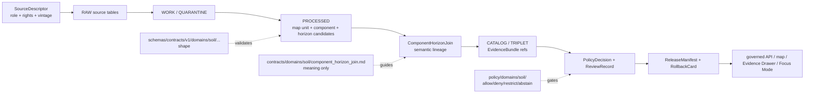

<!-- [KFM_META_BLOCK_V2]
doc_id: kfm://doc/contracts-domains-soil-component-horizon-join
title: Component Horizon Join Contract — Soil
type: semantic-contract
version: v0.2
status: draft; PROPOSED; schema-missing; canonical-working-lane; support-type-separation-required; NEEDS VERIFICATION before promotion
owners:
  - OWNER_TBD — Soil domain steward
  - OWNER_TBD — Contracts steward
  - OWNER_TBD — Schema steward
  - OWNER_TBD — Source steward
  - OWNER_TBD — Evidence steward
  - OWNER_TBD — Policy steward
  - OWNER_TBD — Release steward
  - OWNER_TBD — Docs steward
created: NEEDS VERIFICATION — scaffold existed before v0.2 expansion
updated: 2026-06-23
policy_label: public; contracts; soil; component-horizon-join; lineage-join; source-role-aware; support-type-separation; temporal-scope-aware; evidence-bound; schema-missing; release-gated; rollback-aware; not-etl-code; not-schema; not-source-truth; not-publication-authority
tags: [kfm, contracts, soil, component-horizon-join, ComponentHorizonJoin, SoilMapUnit, SoilComponent, Horizon, SoilProperty, MUKEY, COKEY, CHKEY, SSURGO, SDA, gSSURGO, authoritative_static_soil, SourceDescriptor, EvidenceRef, EvidenceBundle, PolicyDecision, ReviewRecord, ReleaseManifest, RollbackCard]
related:
  - ./README.md
  - ./soil_map_unit.md
  - ./soil_component.md
  - ./horizon.md
  - ./soil_property.md
  - ./soil_time_caveat.md
  - ../../../docs/domains/soil/README.md
  - ../../../docs/domains/soil/CANONICAL_PATHS.md
  - ../../../docs/domains/soil/ARCHITECTURE.md
  - ../../../docs/domains/soil/API_CONTRACTS.md
  - ../../../docs/domains/soil/DATA_LIFECYCLE.md
  - ../../../docs/sources/catalog/nrcs/ssurgo.md
  - ../../../pipelines/domains/soil/README.md
  - ../../../schemas/contracts/v1/domains/soil/component_horizon_join.schema.json
  - ../../../schemas/contracts/v1/domains/soil/README.md
  - ../../../policy/domains/soil/README.md
  - ../../../fixtures/domains/soil/component_horizon_join/
  - ../../../tests/domains/soil/
  - ../../../release/candidates/soil/
notes:
  - "Expanded from a PROPOSED scaffold at contracts/domains/soil/component_horizon_join.md."
  - "A paired schema at schemas/contracts/v1/domains/soil/component_horizon_join.schema.json was not found in this task. Field realization remains PROPOSED."
  - "Soil architecture identifies Component Horizon Join as a lineage join across MUKEY/COKEY/CHKEY. This contract defines semantic meaning only; it does not implement ETL joins or machine validation."
  - "Support-type separation remains mandatory: static survey, gridded derivative, station observation, satellite grid, pedon/profile evidence, and interpretation cannot be collapsed by this join."
  - "The Soil canonical-path registry notes contract/schema path variance from Atlas lineage. This file uses the inspected working lane under contracts/domains/soil while preserving schema-home questions as NEEDS VERIFICATION."
[/KFM_META_BLOCK_V2] -->

<a id="top"></a>

# Component Horizon Join Contract — Soil

> Semantic contract for `Component Horizon Join`: the Soil-domain lineage object that connects a soil survey map unit, a soil component, and a horizon-level record across source-supported identifiers such as `MUKEY`, `COKEY`, and `CHKEY` — without becoming ETL code, JSON Schema, source truth, map-unit truth, horizon truth, property truth, released-layer truth, or public API authority.

<p>
  
  
  
  
  
  
  
</p>

`contracts/domains/soil/component_horizon_join.md`

## Quick jumps

[Status](#status) · [Meaning](#meaning) · [Repo fit](#repo-fit) · [Schema posture](#schema-posture) · [Accepted uses](#accepted-uses) · [Exclusions](#exclusions) · [Recommended fields](#recommended-fields) · [Join model](#join-model) · [Source-role and support rules](#source-role-and-support-rules) · [Sensitivity and publication posture](#sensitivity-and-publication-posture) · [Invariants](#invariants) · [Lifecycle](#lifecycle) · [Validation](#validation) · [Rollback](#rollback) · [Evidence basis](#evidence-basis) · [Open questions](#open-questions)

---

## Status

> [!IMPORTANT]
> **Status:** `draft` / semantic contract  
> **Owner:** `OWNER_TBD`  
> **Contract path:** `contracts/domains/soil/component_horizon_join.md`  
> **Schema path checked:** `schemas/contracts/v1/domains/soil/component_horizon_join.schema.json` — **not found in this task**  
> **Truth posture:** target path, prior scaffold, Soil contract-lane README, Soil architecture, Soil lifecycle inventory, Soil API posture, Soil pipeline README, and SSURGO source-product orientation are confirmed from current repo evidence. Field-level shape, schema enforcement, validators, fixtures, policy tests, ETL behavior, source registry records, release manifests, governed API routes, public API behavior, map rendering, graph behavior, and runtime behavior remain **NEEDS VERIFICATION**.

> [!CAUTION]
> This contract defines join meaning only. It does **not** execute a relational join, validate a table, certify source freshness, publish a layer, prove a soil property, or authorize an AI answer.

---

## Meaning

`Component Horizon Join` records the governed lineage relationship that links:

1. a `SoilMapUnit` carrier, commonly represented by source-supported map-unit identity such as `MUKEY`;
2. a `SoilComponent` within that map unit, commonly represented by source-supported component identity such as `COKEY`;
3. a `Horizon` or horizon-level property record, commonly represented by source-supported horizon identity such as `CHKEY`.

This object answers:

- which map unit, component, and horizon records are being joined;
- which source and source role support the join;
- which support type the join belongs to;
- which source vintage, retrieval time, valid time, release time, and correction state apply;
- which EvidenceBundle supports the join;
- what the join does **not** prove.

The join is a **lineage and interpretation boundary object**. It can help explain why a horizon-level property appears under a component or map unit in a Soil view, but it does not turn horizon values into map-unit truth, component percentages into horizon truth, gridded derivatives into survey authority, or ETL success into publication approval.

---

## Repo fit

| Responsibility | Path | Role |
|---|---|---|
| Contract lane | `contracts/domains/soil/component_horizon_join.md` | This semantic contract. |
| Soil contract README | `contracts/domains/soil/README.md` | Defines `contracts/domains/soil/` as meaning-only and lists this file as an object-family contract candidate. |
| Soil architecture | `docs/domains/soil/ARCHITECTURE.md` | Defines Component Horizon Join as a confirmed term with proposed field realization and identifies it as a lineage join across `MUKEY` / `COKEY` / `CHKEY`. |
| Soil lifecycle inventory | `docs/domains/soil/DATA_LIFECYCLE.md` | Lists Component Horizon Join among owned Soil object families and preserves lifecycle posture. |
| Soil API posture | `docs/domains/soil/API_CONTRACTS.md` | Requires finite outcomes and public consumption through governed API surfaces. |
| Soil pipeline lane | `pipelines/domains/soil/README.md` | Describes executable pipeline scope for soil map units, components, horizons, and component-horizon joins; pipeline code owns the how, not contract meaning. |
| SSURGO source orientation | `docs/sources/catalog/nrcs/ssurgo.md` | Describes SSURGO as static vector soil survey orientation and warns that SourceDescriptor remains authoritative. |
| Paired schema | `schemas/contracts/v1/domains/soil/component_horizon_join.schema.json` | Not found in this task; do not infer machine shape. |
| Policy | `policy/domains/soil/` | Allow/deny/restrict/abstain, rights, sensitivity, and release gating. |
| Tests / fixtures | `tests/domains/soil/`, `fixtures/domains/soil/component_horizon_join/` | Expected proof surfaces; maturity not verified here. |
| Release / rollback | `release/candidates/soil/` and release roots | Publication, correction, and rollback authority. |

---

## Schema posture

A direct paired schema was checked at:

```text
schemas/contracts/v1/domains/soil/component_horizon_join.schema.json
```

That file was **not found** in this task.

> [!WARNING]
> Because no paired schema was confirmed, every field below is **PROPOSED** semantic guidance. Do not treat it as machine-enforced until a schema, fixtures, validators, policy tests, release checks, governed API behavior, and runtime behavior are verified.

---

## Accepted uses

| Use | Allowed? | Rule |
|---|---:|---|
| Describing a source-supported relationship between map unit, component, and horizon records | Yes | Must preserve source identifiers, source role, support type, evidence refs, and time scope. |
| Explaining horizon-level values in a map-unit or component view | Conditional | Must show lineage and limitations; horizon values do not become map-unit truth by display alone. |
| Supporting Evidence Drawer lineage | Conditional | Requires EvidenceBundle resolution and public-safe projection. |
| Supporting Focus Mode explanation | Conditional | AI may explain the released join only with evidence and finite outcomes. |
| Supporting pipeline candidate records | Conditional | Pipeline output remains candidate until validation, catalog/triplet, policy, review, and release closure. |
| Publishing an ETL join as public truth | No | Successful processing is not publication. |
| Replacing `SoilMapUnit`, `SoilComponent`, `Horizon`, or `SoilProperty` contracts | No | Each object family keeps its own contract and schema surface. |

---

## Exclusions

`Component Horizon Join` must not be used as:

| Misuse | Required outcome |
|---|---|
| ETL implementation | Use `pipelines/domains/soil/` or accepted pipeline root. |
| JSON Schema / machine validation | Use `schemas/contracts/v1/domains/soil/` or ADR-selected schema home. |
| SourceDescriptor or source registry record | Use source registry roots and SourceDescriptor contracts. |
| Map-unit truth by itself | Use `SoilMapUnit` evidence and contract. |
| Component truth by itself | Use `SoilComponent` evidence and contract. |
| Horizon truth by itself | Use `Horizon` evidence and contract. |
| Soil-property truth by itself | Use `SoilProperty` evidence and method/unit/depth posture. |
| Gridded derivative shortcut | Use gSSURGO/gNATSGO derivative semantics and support-type separation. |
| Public API payload authority | Use governed API schemas and released projections. |
| Release approval | Use PolicyDecision, ReviewRecord, ReleaseManifest, correction path, and RollbackCard. |
| AI answer authority | Focus Mode remains evidence-subordinate and finite-outcome constrained. |

---

## Recommended fields

The following fields are **PROPOSED** until a paired schema is added and validated.

| Field | Meaning |
|---|---|
| `id` | Canonical Component Horizon Join identifier. |
| `version` | Contract/object version. |
| `spec_hash` | Deterministic hash over normalized join content. |
| `domain` | Expected value: `soil`. |
| `support_type` | Expected support family, such as `authoritative_static_soil`; gridded or derived joins must say so explicitly. |
| `source_ref` | SourceDescriptor/source registry ref. |
| `source_role` | Source role for this join use, not merely the source family. |
| `map_unit_ref` | `SoilMapUnit` or MUKEY-scoped ref. |
| `component_ref` | `SoilComponent` or COKEY-scoped ref. |
| `horizon_ref` | `Horizon` or CHKEY-scoped ref. |
| `soil_property_refs` | Optional linked `SoilProperty` refs that use the joined lineage. |
| `source_native_keys` | Source-native key set, if available: `MUKEY`, `COKEY`, `CHKEY`, table/version identifiers. |
| `join_statement` | Human-readable scoped statement of the join. |
| `join_method` | Source-native relation, normalized table relation, derived candidate, review-only, or source-specific method. |
| `source_vintage` | Survey/source vintage or release identifier. |
| `retrieval_time` | KFM retrieval/freeze time. |
| `valid_time` | Interval the source says the joined records apply, if known. |
| `release_time` | KFM release time, if released. |
| `correction_time` | Correction/supersession time, if corrected. |
| `evidence_refs` | EvidenceRefs or EvidenceBundle refs. |
| `policy_decision_ref` | PolicyDecision governing use/publication. |
| `review_ref` | ReviewRecord or steward review ref. |
| `release_manifest_ref` | ReleaseManifest or MapReleaseManifest ref. |
| `rollback_ref` | RollbackCard or rollback target. |
| `limitations` | Caveats: join lineage only; not map-unit, component, horizon, property, ETL, or release authority. |

---

## Join model

A reviewed Component Horizon Join should bind the source-native lineage, the KFM object refs, and the evidence/release posture.

```text
component_horizon_join = {
  domain,
  support_type,
  source_ref,
  source_role,
  map_unit_ref,
  component_ref,
  horizon_ref,
  source_native_keys,
  join_method,
  source_vintage,
  retrieval_time,
  valid_time,
  evidence_refs,
  policy_decision_ref,
  review_ref,
  release_manifest_ref,
  rollback_ref
}
```

The exact serialized shape is **NEEDS VERIFICATION** until the schema and validators are field-complete.

---

## Source-role and support rules

| Rule | Requirement |
|---|---|
| Source role is per use | SSURGO/SDA-style evidence may be authoritative static soil for survey joins, but each use still needs source-role tagging. |
| Support type is mandatory | Static survey, gridded derivative, station observation, satellite grid, pedon/profile, and interpretation must not collapse. |
| Source-native keys are lineage, not proof alone | `MUKEY`, `COKEY`, and `CHKEY` help preserve lineage; they do not replace EvidenceBundle or schema validation. |
| Join direction is explicit | Map unit → component → horizon lineage must remain inspectable; derived reverse lookups are projections. |
| Join success is not release | ETL success or candidate creation does not publish anything. |
| Time axes remain separate | Source vintage, retrieval time, valid time, release time, and correction time must not collapse. |
| Public claims require EvidenceBundle resolution | If evidence cannot resolve, return ABSTAIN, DENY, or ERROR; do not invent the join. |

---

## Sensitivity and publication posture

| Surface | Default posture | Reason |
|---|---|---|
| Static survey map-unit/component/horizon lineage | Public-safe if source, rights, evidence, and release support it | Most survey products are intended as public soil context, but release still requires governance. |
| Farm-specific, owner-specific, operational, or private sensor joins | Review / restrict / deny by default | Soil doctrine marks these as not public-by-default. |
| Gridded derivative lineage | Public-safe if released and caveated | Must not masquerade as source survey truth. |
| Interpretation-linked lineage | Caveated and method-visible | Suitability/erosion interpretations require visible limitations. |
| Candidate/model/OCR join | Review only | Automated relation does not close evidence. |

---

## Invariants

1. **A join is not an object replacement.** `SoilMapUnit`, `SoilComponent`, `Horizon`, and `SoilProperty` remain separate object families.
2. **Support type is part of meaning.** Static survey lineage cannot be collapsed into gridded derivative, station, satellite, pedon, or interpretation support.
3. **Source-native keys are not enough.** Native IDs support lineage but do not replace EvidenceBundle, schema validation, policy, or release state.
4. **Lineage is directional and inspectable.** The relation from map unit to component to horizon must remain reviewable.
5. **Time is part of meaning.** Source vintage, retrieval time, valid time, release time, and correction time remain distinct where material.
6. **ETL is not publication.** A pipeline join can create candidates; it cannot publish a public truth claim by itself.
7. **Release is separate.** A valid join does not publish anything without PolicyDecision, ReviewRecord, ReleaseManifest, and RollbackCard where required.
8. **AI is downstream.** Focus Mode may explain only released evidence and policy-permitted join context.
9. **No direct internal-store reads.** Public clients use governed APIs and released artifacts only.
10. **Path variance remains ADR-sensitive.** Do not use this file to settle contract/schema path variance by tone.

---

## Lifecycle



---

## Validation

Before this contract is treated as mature, maintainers should verify:

- [ ] paired schema exists or an ADR declares this contract schema-less;
- [ ] schema includes source refs, source role, support type, map unit ref, component ref, horizon ref, source-native key set, time axes, evidence refs, policy/review/release/rollback refs, and limitations;
- [ ] fixtures cover valid SSURGO/SDA-style lineage, missing map-unit key, missing component key, missing horizon key, conflicting source vintage, gridded-derivative candidate, and interpretation-linked lineage;
- [ ] tests prevent support-type collapse;
- [ ] tests prevent join candidates from becoming map-unit truth, component truth, horizon truth, property truth, release approval, or AI authority;
- [ ] tests enforce ABSTAIN/DENY/ERROR when evidence, source role, source vintage, support type, policy, or release state is unresolved;
- [ ] public map, Evidence Drawer, Focus Mode, exports, and AI summaries use only released/governed Component Horizon Join projections;
- [ ] rollback invalidates linked processed records, catalog/triplet refs, layers, drawer payloads, exports, caches, graph projections, and AI summaries that cited a withdrawn join.

---

## Rollback

Rollback is required if this contract:

- claims schema, validator, fixture, test, policy, release, API, ETL, map, graph, or runtime behavior exists without proof;
- treats Component Horizon Join as ETL code, JSON Schema, source truth, map-unit truth, component truth, horizon truth, property truth, release approval, or AI authority;
- weakens support-type separation;
- hides source-role conflict, source-native key gaps, source vintage, valid-time limits, candidate status, supersession, or correction lineage;
- exposes farm-specific, owner-specific, operational, or private sensor detail without policy/release support;
- normalizes direct UI access to internal lifecycle stores or direct model output.

Rollback target: revert `contracts/domains/soil/component_horizon_join.md` to prior scaffold blob `5d5154e0c368b2ac65c518d66f6d4bb0b9900a24`, record drift if authority boundaries were affected, and invalidate downstream derivatives that relied on weakened Component Horizon Join semantics.

---

## Evidence basis

| Evidence | Status | Supports | Limits |
|---|---|---|---|
| Prior `contracts/domains/soil/component_horizon_join.md` | `CONFIRMED` | Target file existed as a PROPOSED scaffold sourced from Soil continuity/lifecycle docs. | Scaffold did not define authoritative semantic contract content. |
| Paired schema lookup | `CONFIRMED not found in this task` | Justifies schema-missing posture. | Does not rule out alternate schema names or future ADR-selected homes. |
| `contracts/domains/soil/README.md` | `CONFIRMED contract-lane rule` | Defines this folder as semantic meaning only and lists `component_horizon_join.md` as a proposed object-family contract. | Does not prove object schema, validator, or release maturity. |
| `docs/domains/soil/ARCHITECTURE.md` | `CONFIRMED doctrine / PROPOSED field realization` | Defines Component Horizon Join as a lineage join across MUKEY/COKEY/CHKEY and requires support-type separation. | Does not prove implementation. |
| `docs/domains/soil/DATA_LIFECYCLE.md` | `CONFIRMED navigational register / PROPOSED implementation` | Lists Component Horizon Join as an owned Soil object family and preserves lifecycle posture. | It is a navigational register, not implementation proof. |
| `docs/domains/soil/API_CONTRACTS.md` | `CONFIRMED doctrine / PROPOSED implementation` | Defines governed Soil API posture and finite outcomes. | Route names and runtime behavior remain UNKNOWN / NEEDS VERIFICATION. |
| `pipelines/domains/soil/README.md` | `CONFIRMED pipeline-lane doctrine / NEEDS VERIFICATION executable behavior` | Places component-horizon joins in pipeline scope while stating pipeline code owns the how, not object meaning or release approval. | Does not prove ETL behavior. |
| `docs/sources/catalog/nrcs/ssurgo.md` | `CONFIRMED source-product page / PROPOSED descriptor linkage` | Identifies SSURGO as static vector soil survey context and separates narrative docs from SourceDescriptor authority. | Rights/current source details still need descriptor/live-source verification. |
| Uploaded KFM authoring prompt v2 | `CONFIRMED user-supplied guidance` | Requires evidence-first, implementation-honest, visually polished Markdown with visible verification and rollback posture. | Authoring guidance, not implementation proof. |

---

## Open questions

| ID | Question | Status |
|---|---|---|
| OQ-SOIL-CHJ-01 | Should `component_horizon_join.md` have its own schema, or should it be modeled as a relation/triplet profile? | OPEN / DOMAIN + SCHEMA REVIEW |
| OQ-SOIL-CHJ-02 | Which source-native keys and table-version identifiers are mandatory for the join? | OPEN / SOURCE + SCHEMA REVIEW |
| OQ-SOIL-CHJ-03 | How should joins across gridded derivatives or generalized products cite their source survey lineage without claiming survey authority? | OPEN / SOURCE-ROLE REVIEW |
| OQ-SOIL-CHJ-04 | Which fixture matrix proves support-type separation for this join? | OPEN / VALIDATION REVIEW |
| OQ-SOIL-CHJ-05 | How should Evidence Drawer and Focus Mode display map-unit → component → horizon lineage without turning it into property truth or release approval? | OPEN / MAP/UI REVIEW |
| OQ-SOIL-CHJ-06 | How should rollback invalidate layers, drawer payloads, Focus Mode claims, exports, caches, graph projections, and AI summaries after a join correction? | OPEN / RELEASE REVIEW |

<p align="right"><a href="#top">Back to top</a></p>
