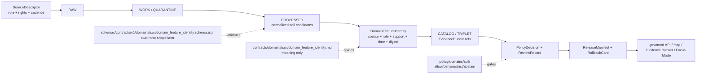

<!-- [KFM_META_BLOCK_V2]
doc_id: kfm://doc/contracts-domains-soil-domain-feature-identity
title: Domain Feature Identity Contract — Soil
type: semantic-contract
version: v0.2
status: draft; PROPOSED; schema-stub-confirmed; canonical-working-lane; support-type-separation-required; schema-home-variance-noted; NEEDS VERIFICATION before promotion
owners:
  - OWNER_TBD — Soil domain steward
  - OWNER_TBD — Contracts steward
  - OWNER_TBD — Schema steward
  - OWNER_TBD — Source steward
  - OWNER_TBD — Evidence steward
  - OWNER_TBD — Policy steward
  - OWNER_TBD — Release steward
  - OWNER_TBD — Docs steward
created: NEEDS VERIFICATION — scaffold existed before v0.2 expansion
updated: 2026-06-23
policy_label: public; contracts; soil; domain-feature-identity; identity-envelope; deterministic-identity; source-role-aware; support-type-separation; temporal-scope-aware; evidence-bound; schema-stub; release-gated; rollback-aware; not-source-truth; not-schema-authority; not-etl-code; not-publication-authority
tags: [kfm, contracts, soil, domain-feature-identity, SoilMapUnit, SoilComponent, Horizon, ComponentHorizonJoin, SoilProperty, HydrologicSoilGroup, SoilMoistureObservation, Pedon, SoilProfileView, ErosionRisk, SuitabilityRating, SoilTimeCaveat, SSURGO, SDA, gSSURGO, gNATSGO, Mesonet, SCAN, USCRN, SMAP, SourceDescriptor, EvidenceRef, EvidenceBundle, PolicyDecision, ReviewRecord, ReleaseManifest, RollbackCard]
related:
  - ./README.md
  - ./component_horizon_join.md
  - ./soil_map_unit.md
  - ./soil_component.md
  - ./horizon.md
  - ./soil_property.md
  - ./hydrologic_soil_group.md
  - ./soil_moisture_observation.md
  - ./pedon.md
  - ./soil_profile_view.md
  - ./erosion_risk.md
  - ./suitability_rating.md
  - ./soil_time_caveat.md
  - ../../../docs/domains/soil/README.md
  - ../../../docs/domains/soil/CANONICAL_PATHS.md
  - ../../../docs/domains/soil/ARCHITECTURE.md
  - ../../../docs/domains/soil/API_CONTRACTS.md
  - ../../../docs/domains/soil/DATA_LIFECYCLE.md
  - ../../../pipelines/domains/soil/README.md
  - ../../../schemas/contracts/v1/domains/soil/domain_feature_identity.schema.json
  - ../../../schemas/contracts/v1/domains/soil/README.md
  - ../../../policy/domains/soil/README.md
  - ../../../fixtures/domains/soil/domain_feature_identity/
  - ../../../tests/domains/soil/
  - ../../../release/candidates/soil/
notes:
  - "Expanded from a greenfield scaffold at contracts/domains/soil/domain_feature_identity.md."
  - "A paired schema exists at schemas/contracts/v1/domains/soil/domain_feature_identity.schema.json, but it is a permissive stub with id/version/spec_hash only and additionalProperties true. Field realization remains PROPOSED."
  - "Soil architecture proposes the identity rule `source id + object role + temporal scope + normalized digest` across Soil object families. This contract gives that rule semantic meaning for the Soil lane."
  - "Support-type separation remains mandatory: static survey, gridded derivative, station observation, satellite grid, pedon/profile evidence, and interpretation cannot be collapsed by identity logic."
  - "This contract defines identity-envelope meaning only; it does not implement schema validation, ETL joins, source activation, public API behavior, release approval, or map rendering."
[/KFM_META_BLOCK_V2] -->

<a id="top"></a>

# Domain Feature Identity Contract — Soil

> Semantic contract for `domain_feature_identity`: the broad Soil-domain identity envelope used to identify Soil objects across source family, object role, support type, time scope, evidence, policy, release state, and rollback lineage — without becoming JSON Schema, ETL code, source truth, public layer truth, API authority, or AI answer authority.

<p>
  
  
  
  
  
  
  
</p>

`contracts/domains/soil/domain_feature_identity.md`

## Quick jumps

[Status](#status) · [Meaning](#meaning) · [Repo fit](#repo-fit) · [Schema posture](#schema-posture) · [Accepted uses](#accepted-uses) · [Exclusions](#exclusions) · [Recommended fields](#recommended-fields) · [Identity model](#identity-model) · [Object-family coverage](#object-family-coverage) · [Source-role and support rules](#source-role-and-support-rules) · [Sensitivity and publication posture](#sensitivity-and-publication-posture) · [Invariants](#invariants) · [Lifecycle](#lifecycle) · [Validation](#validation) · [Rollback](#rollback) · [Evidence basis](#evidence-basis) · [Open questions](#open-questions)

---

## Status

> [!IMPORTANT]
> **Status:** `draft` / semantic contract  
> **Owner:** `OWNER_TBD`  
> **Contract path:** `contracts/domains/soil/domain_feature_identity.md`  
> **Schema path checked:** `schemas/contracts/v1/domains/soil/domain_feature_identity.schema.json` — **confirmed stub only**  
> **Truth posture:** target path, prior scaffold, paired schema stub, Soil contract-lane README, Soil architecture, Soil API posture, Soil lifecycle inventory, and Soil pipeline README are confirmed from current repo evidence. Field-level shape beyond `id`, `version`, and `spec_hash`, schema enforcement, validators, fixtures, policy tests, ETL behavior, source registry records, release manifests, governed API routes, public API behavior, map rendering, graph behavior, and runtime behavior remain **NEEDS VERIFICATION**.

> [!CAUTION]
> This contract defines identity meaning only. It does **not** validate JSON, execute source ingestion, decide source activation, publish a layer, prove a soil property, or authorize an AI answer.

---

## Meaning

`domain_feature_identity` is the Soil lane's broad identity envelope for matching, naming, deduplicating, citing, comparing, and explaining Soil objects without collapsing object families, source roles, support types, or time axes.

It applies to identity support for:

- `SoilMapUnit`
- `SoilComponent`
- `Horizon`
- `ComponentHorizonJoin`
- `SoilProperty`
- `HydrologicSoilGroup`
- `SoilMoistureObservation`
- `Pedon`
- `SoilProfileView`
- `ErosionRisk`
- `SuitabilityRating`
- `SoilTimeCaveat`

The architecture-level identity rule is:

```text
source id + object role + temporal scope + normalized digest
```

This contract makes that rule inspectable. It states what must be preserved when KFM claims that two Soil records refer to the same object, when a record is a candidate match, or when an object is safe to render as a public feature.

---

## Repo fit

| Responsibility | Path | Role |
|---|---|---|
| Contract lane | `contracts/domains/soil/domain_feature_identity.md` | This semantic identity contract. |
| Soil contract README | `contracts/domains/soil/README.md` | Defines `contracts/domains/soil/` as meaning-only and lists Soil object-family contract candidates. |
| Paired schema stub | `schemas/contracts/v1/domains/soil/domain_feature_identity.schema.json` | Confirms a stub exists, but only `id`, `version`, `spec_hash`, and `additionalProperties: true` are enforced. |
| Soil architecture | `docs/domains/soil/ARCHITECTURE.md` | Defines object families, identity rule, source families, support-type separation, lifecycle, and cross-lane boundaries. |
| Soil API posture | `docs/domains/soil/API_CONTRACTS.md` | Defines governed API posture, finite outcomes, public trust membrane, and support-type separation. |
| Soil lifecycle inventory | `docs/domains/soil/DATA_LIFECYCLE.md` | Lists owned Soil object families, source families, lifecycle posture, and sensitivity defaults. |
| Soil pipeline lane | `pipelines/domains/soil/README.md` | Describes executable pipeline scope and clarifies pipelines own the how, not object meaning or release approval. |
| Policy | `policy/domains/soil/` | Allow/deny/restrict/abstain, rights, sensitivity, and release gating. |
| Tests / fixtures | `tests/domains/soil/`, `fixtures/domains/soil/domain_feature_identity/` | Expected proof surfaces; maturity not verified here. |
| Release / rollback | `release/candidates/soil/` and release roots | Publication, correction, and rollback authority. |

---

## Schema posture

A paired schema exists at:

```text
schemas/contracts/v1/domains/soil/domain_feature_identity.schema.json
```

The confirmed schema is a **greenfield stub**. It defines:

- `id` as required;
- optional `version`;
- optional `spec_hash`;
- `additionalProperties: true`.

> [!WARNING]
> Because the paired schema is only a permissive stub, every field below beyond `id`, `version`, and `spec_hash` is **PROPOSED** semantic guidance. Do not treat it as machine-enforced until schema, fixtures, validators, policy tests, release checks, governed API behavior, and runtime behavior are verified.

---

## Accepted uses

| Use | Allowed? | Rule |
|---|---:|---|
| Defining Soil object identity semantics | Yes | Must preserve object family, source role, support type, source-native ID, time scope, evidence refs, and limitations. |
| Deterministic matching/deduplication guidance | Conditional | Must use stable inputs and expose candidate/confirmed/conflicted posture. |
| Supporting Evidence Drawer identity explanation | Conditional | Requires EvidenceBundle resolution and public-safe projection. |
| Supporting Focus Mode explanation | Conditional | AI may explain released identity only with finite outcomes and citations. |
| Supporting pipeline candidate identity records | Conditional | Pipeline candidates remain unpublished until validation, catalog/triplet, policy, review, and release closure. |
| Connecting identity to map layers or API details | Conditional | Public surfaces must use governed API and released artifacts. |
| Publishing source IDs as public truth by themselves | No | Source-native IDs support identity but do not replace evidence, source role, or release state. |
| Replacing object-family contracts | No | `SoilMapUnit`, `SoilComponent`, `Horizon`, etc. still need their own meaning contracts where material. |

---

## Exclusions

`domain_feature_identity` must not be used as:

| Misuse | Required outcome |
|---|---|
| JSON Schema / machine validation | Use `schemas/contracts/v1/domains/soil/` or ADR-selected schema home. |
| ETL implementation or fuzzy matcher | Use `pipelines/domains/soil/` and tests. |
| SourceDescriptor or source registry record | Use source registry roots and SourceDescriptor contracts. |
| Object-family payload replacement | Use specific object-family contracts/schemas. |
| Map-unit, component, horizon, property, observation, pedon, or interpretation truth by itself | Resolve owning object evidence. |
| Public API response shape | Use API schemas and governed API contracts. |
| Release approval | Use PolicyDecision, ReviewRecord, ReleaseManifest, correction path, and RollbackCard. |
| AI answer authority | Focus Mode remains evidence-subordinate and finite-outcome constrained. |

---

## Recommended fields

The following fields are **PROPOSED** until the paired schema is expanded and validated.

| Field | Meaning |
|---|---|
| `id` | Canonical identity record identifier. Confirmed required by schema stub. |
| `version` | Contract/object version. Confirmed optional by schema stub. |
| `spec_hash` | Deterministic hash over normalized identity content. Confirmed optional by schema stub. |
| `domain` | Expected value: `soil`. |
| `object_family` | SoilMapUnit, SoilComponent, Horizon, ComponentHorizonJoin, SoilProperty, HydrologicSoilGroup, SoilMoistureObservation, Pedon, SoilProfileView, ErosionRisk, SuitabilityRating, or SoilTimeCaveat. |
| `object_role` | Role in the soil lane: survey carrier, component, vertical layer, lineage join, property, classification, observation, profile, interpretation, temporal caveat, etc. |
| `support_type` | Static survey, gridded derivative, station observation, satellite grid, pedon/profile, or interpretation support tag. |
| `source_ref` | SourceDescriptor/source registry ref. |
| `source_role` | Source role for this identity use. |
| `source_native_id` | Source-native key or identifier, if available. |
| `source_native_key_family` | MUKEY, COKEY, CHKEY, station ID, grid cell ID, pedon ID, profile ID, source-specific key, etc. |
| `normalized_digest` | Deterministic digest over normalized identity inputs. |
| `match_status` | Candidate, confirmed, conflicted, superseded, denied, or unknown. |
| `observed_time` | Time the source observation was made, if applicable. |
| `source_time` | Source creation/publication/update time. |
| `valid_time` | Interval the identity applies to, if known. |
| `retrieval_time` | KFM retrieval/freeze time. |
| `release_time` | KFM release time, if released. |
| `correction_time` | Correction/supersession time, if corrected. |
| `evidence_refs` | EvidenceRefs or EvidenceBundle refs. |
| `policy_decision_ref` | PolicyDecision governing use/publication. |
| `review_ref` | ReviewRecord or steward review ref. |
| `release_manifest_ref` | ReleaseManifest or MapReleaseManifest ref. |
| `rollback_ref` | RollbackCard or rollback target. |
| `limitations` | Caveats: identity envelope only; not source truth, not object payload, not release approval. |

---

## Identity model

A reviewed Soil identity envelope should bind source identity, KFM object family, support type, time scope, digest, evidence, and release posture.

```text
domain_feature_identity = {
  domain,
  object_family,
  object_role,
  support_type,
  source_ref,
  source_role,
  source_native_id,
  source_native_key_family,
  temporal_scope,
  normalized_digest,
  match_status,
  evidence_refs,
  policy_decision_ref,
  review_ref,
  release_manifest_ref,
  rollback_ref
}
```

The exact serialized shape is **NEEDS VERIFICATION** until the schema and validators are field-complete.

---

## Object-family coverage

| Object family | Identity concern | Guardrail |
|---|---|---|
| `SoilMapUnit` | Survey map-unit identity and polygon/unit carrier. | MUKEY-like keys do not become parcel/farm truth. |
| `SoilComponent` | Component identity within a map unit. | Component identity does not replace map-unit or horizon identity. |
| `Horizon` | Vertical layer identity with depth/context. | Horizon identity is not a map polygon by itself. |
| `ComponentHorizonJoin` | Lineage identity linking map unit, component, and horizon. | Join identity does not execute ETL or prove properties. |
| `SoilProperty` | Property identity with method/unit/depth context. | Property values need method, unit, depth, support type, and evidence. |
| `HydrologicSoilGroup` | Runoff-potential classification identity. | Not a flood observation, forecast, or hydrology truth. |
| `SoilMoistureObservation` | Station or satellite observation identity. | Station, satellite, and survey support must not collapse. |
| `Pedon` / `SoilProfileView` | Profile-level identity. | Profile identity is evidence, not broad map-unit truth by itself. |
| `ErosionRisk` | Interpretive risk product identity. | Not an authoritative hazard product. |
| `SuitabilityRating` | Interpretive suitability identity. | Not legal, economic, or operational advice. |
| `SoilTimeCaveat` | Temporal limitation identity. | Caveat must remain attached to stale or time-bounded products. |

---

## Source-role and support rules

| Rule | Requirement |
|---|---|
| Object family is mandatory | A Soil identity without an object family is not reviewable. |
| Support type is mandatory | Static survey, gridded derivative, station observation, satellite grid, pedon/profile, and interpretation cannot masquerade as one surface. |
| Source role is per use | A source may be authority for one use and context for another; identity must record the use-specific role. |
| Source-native IDs are evidence inputs, not identity truth alone | MUKEY/COKEY/CHKEY/station/grid/pedon IDs support identity but must not replace evidence and source-role posture. |
| Normalized digest is deterministic but not sovereign | A digest aids matching; it does not publish or prove a claim. |
| Time axes remain separate | Source time, observed time, valid time, retrieval time, release time, and correction time must not collapse. |
| Public claims require EvidenceBundle resolution | If evidence cannot resolve, return ABSTAIN, DENY, or ERROR; do not invent identity. |

---

## Sensitivity and publication posture

| Surface | Default posture | Reason |
|---|---|---|
| Static survey identities | Public-safe if source, rights, evidence, and release support it | Survey context is typically public but still governed. |
| Gridded derivative identities | Public-safe if released and caveated | Derivatives must not masquerade as survey truth. |
| Station or satellite observation identities | Review / caveat by source family and scale | Point/grid observations can be misread as broader truth. |
| Pedon/profile identities | Review / caveat by source and locality | Profile-level evidence is not map-unit truth by itself. |
| Interpretive identities | Caveated and method-visible | Suitability/erosion interpretations need explicit limitations. |
| Farm-specific, owner-specific, operational, or private sensor identities | Review / restrict / deny by default | Soil doctrine marks these as not public-by-default. |
| Candidate/model/OCR identities | Review only | Automated identity support does not close evidence. |

---

## Invariants

1. **Identity is not object truth by itself.** It is the envelope that makes object identity inspectable.
2. **Support type is part of identity.** Static survey, gridded derivative, station, satellite, pedon/profile, and interpretation identities must not collapse.
3. **Source role is first-class.** Authority, observation, context, model, candidate, and derived roles remain distinct by use.
4. **Native keys are not enough.** Source-native IDs support identity; they do not replace EvidenceBundle or release state.
5. **Time is part of identity.** Source, observed, valid, retrieval, release, and correction times remain distinct where material.
6. **Digest is deterministic, not sovereign.** Matching hashes help review; they do not decide truth. 
7. **Release is separate.** A valid identity does not publish anything without PolicyDecision, ReviewRecord, ReleaseManifest, and RollbackCard where required.
8. **AI is downstream.** Focus Mode may explain only released evidence and policy-permitted identity context.
9. **No direct internal-store reads.** Public clients use governed APIs and released artifacts only.
10. **Path variance remains ADR-sensitive.** Do not use this file to settle contract/schema path variance by tone.

---

## Lifecycle



---

## Validation

Before this contract is treated as mature, maintainers should verify:

- [ ] paired schema expands beyond the current permissive stub or an ADR declares a different identity-shape home;
- [ ] schema includes object family, object role, support type, source ref, source role, native key family, temporal scope, normalized digest, match status, evidence refs, policy/review/release/rollback refs, and limitations;
- [ ] fixtures cover all Soil object families, support types, native key families, candidate/confirmed/conflicted/superseded identity, stale source vintage, and correction lineage;
- [ ] tests prevent support-type collapse;
- [ ] tests prevent identity from becoming object payload truth, source truth, release approval, or AI authority;
- [ ] tests enforce ABSTAIN/DENY/ERROR when evidence, source role, support type, time scope, policy, or release state is unresolved;
- [ ] public map, Evidence Drawer, Focus Mode, exports, and AI summaries use only released/governed identity projections;
- [ ] rollback invalidates linked processed records, catalog/triplet refs, layers, drawer payloads, exports, caches, graph projections, and AI summaries that cited a withdrawn identity.

---

## Rollback

Rollback is required if this contract:

- claims schema, validator, fixture, test, policy, release, API, ETL, map, graph, or runtime behavior exists without proof;
- treats DomainFeatureIdentity as JSON Schema, ETL code, source truth, object payload truth, released-layer truth, or AI authority;
- weakens support-type separation;
- hides source-role conflict, native-key gaps, source vintage, valid-time limits, candidate status, supersession, or correction lineage;
- exposes farm-specific, owner-specific, operational, or private sensor detail without policy/release support;
- normalizes direct UI access to internal lifecycle stores or direct model output.

Rollback target: revert `contracts/domains/soil/domain_feature_identity.md` to prior scaffold blob `84ed1e166084da6d300aa765ab41bc6fefe6c035`, record drift if authority boundaries were affected, and invalidate downstream derivatives that relied on weakened Soil identity semantics.

---

## Evidence basis

| Evidence | Status | Supports | Limits |
|---|---|---|---|
| Prior `contracts/domains/soil/domain_feature_identity.md` | `CONFIRMED` | Target file existed as a greenfield scaffold. | Scaffold did not define authoritative semantic contract content. |
| `schemas/contracts/v1/domains/soil/domain_feature_identity.schema.json` | `CONFIRMED schema stub` | Confirms schema path, required `id`, optional `version` and `spec_hash`, and permissive `additionalProperties`. | Does not enforce proposed identity fields. |
| `contracts/domains/soil/README.md` | `CONFIRMED contract-lane rule` | Defines this folder as semantic meaning only and lists Soil object-family contract candidates. | Does not prove object schema, validator, or release maturity. |
| `docs/domains/soil/ARCHITECTURE.md` | `CONFIRMED doctrine / PROPOSED field realization` | Defines Soil object families, identity rule, source families, support-type separation, cross-lane limits, and lifecycle posture. | Does not prove implementation. |
| `docs/domains/soil/API_CONTRACTS.md` | `CONFIRMED doctrine / PROPOSED implementation` | Defines governed Soil API posture, finite outcomes, trust membrane, and support-type separation. | Route names and runtime behavior remain UNKNOWN / NEEDS VERIFICATION. |
| `docs/domains/soil/DATA_LIFECYCLE.md` | `CONFIRMED navigational register / PROPOSED implementation` | Lists owned Soil object families, source families, sensitivity defaults, and lifecycle posture. | It is a navigational register, not implementation proof. |
| `pipelines/domains/soil/README.md` | `CONFIRMED pipeline-lane doctrine / NEEDS VERIFICATION executable behavior` | Places Soil identity candidates in executable pipeline flow while stating pipeline logic does not own object meaning or release decisions. | Does not prove ETL behavior. |
| Uploaded KFM authoring prompt v2 | `CONFIRMED user-supplied guidance` | Requires evidence-first, implementation-honest, visually polished Markdown with visible verification and rollback posture. | Authoring guidance, not implementation proof. |

---

## Open questions

| ID | Question | Status |
|---|---|---|
| OQ-SOIL-DFI-01 | Should Soil `domain_feature_identity` remain a domain-specific contract, or should it inherit from a cross-domain identity schema? | OPEN / DOMAIN + SCHEMA REVIEW |
| OQ-SOIL-DFI-02 | Which source-native key families are canonical across SSURGO/SDA, gSSURGO/gNATSGO, station observations, satellite grids, pedons, and interpretations? | OPEN / SOURCE + SCHEMA REVIEW |
| OQ-SOIL-DFI-03 | Which match-status enum is canonical for candidate, confirmed, conflicted, superseded, denied, and unknown identities? | OPEN / SCHEMA REVIEW |
| OQ-SOIL-DFI-04 | How should normalized digest inputs be pinned so identity remains deterministic but reversible through evidence? | OPEN / VALIDATION REVIEW |
| OQ-SOIL-DFI-05 | How should Evidence Drawer and Focus Mode display source-native ID, support type, and match status without elevating identity to source truth? | OPEN / MAP/UI REVIEW |
| OQ-SOIL-DFI-06 | How should rollback invalidate layers, drawer payloads, Focus Mode claims, exports, caches, graph projections, and AI summaries after an identity correction? | OPEN / RELEASE REVIEW |

<p align="right"><a href="#top">Back to top</a></p>
