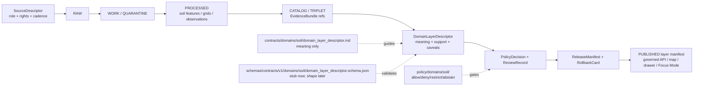

<!-- [KFM_META_BLOCK_V2]
doc_id: kfm://doc/contracts-domains-soil-domain-layer-descriptor
title: Domain Layer Descriptor Contract — Soil
type: semantic-contract; layer-descriptor-profile
version: v0.2
status: draft; PROPOSED; schema-stub-confirmed; canonical-working-lane; support-type-separation-required; release-gated; NEEDS VERIFICATION before promotion
owners:
  - OWNER_TBD — Soil domain steward
  - OWNER_TBD — Map/UI steward
  - OWNER_TBD — Contracts steward
  - OWNER_TBD — Schema steward
  - OWNER_TBD — Source steward
  - OWNER_TBD — Evidence steward
  - OWNER_TBD — Policy steward
  - OWNER_TBD — Release steward
  - OWNER_TBD — Docs steward
created: NEEDS VERIFICATION — scaffold existed before v0.2 expansion
updated: 2026-06-23
policy_label: public; contracts; soil; domain-layer-descriptor; layer-manifest; delivery-projection; source-role-aware; support-type-separation; temporal-scope-aware; evidence-bound; schema-stub; release-gated; rollback-aware; not-source-truth; not-schema-authority; not-etl-code; not-publication-authority; not-direct-data-access
tags: [kfm, contracts, soil, domain-layer-descriptor, LayerManifest, SoilMapUnit, SoilComponent, Horizon, ComponentHorizonJoin, SoilProperty, HydrologicSoilGroup, SoilMoistureObservation, Pedon, SoilProfileView, ErosionRisk, SuitabilityRating, SoilTimeCaveat, authoritative_static_soil, gridded_derivative_soil, station_soil_moisture, satellite_grid_soil_moisture, pedon_evidence, interpretation, SourceDescriptor, EvidenceRef, EvidenceBundle, PolicyDecision, ReviewRecord, ReleaseManifest, RollbackCard]
related:
  - ./README.md
  - ./domain_feature_identity.md
  - ./component_horizon_join.md
  - ./soil_map_unit.md
  - ./soil_component.md
  - ./horizon.md
  - ./soil_property.md
  - ./hydrologic_soil_group.md
  - ./soil_moisture_observation.md
  - ./pedon.md
  - ./soil_profile_view.md
  - ./erosion_risk.md
  - ./suitability_rating.md
  - ./soil_time_caveat.md
  - ../../../docs/domains/soil/README.md
  - ../../../docs/domains/soil/CANONICAL_PATHS.md
  - ../../../docs/domains/soil/ARCHITECTURE.md
  - ../../../docs/domains/soil/API_CONTRACTS.md
  - ../../../docs/domains/soil/DATA_LIFECYCLE.md
  - ../../../pipelines/domains/soil/README.md
  - ../../../schemas/contracts/v1/domains/soil/domain_layer_descriptor.schema.json
  - ../../../schemas/contracts/v1/domains/soil/README.md
  - ../../../policy/domains/soil/README.md
  - ../../../fixtures/domains/soil/domain_layer_descriptor/
  - ../../../tests/domains/soil/
  - ../../../release/candidates/soil/
notes:
  - "Expanded from a greenfield scaffold at contracts/domains/soil/domain_layer_descriptor.md."
  - "A paired schema exists at schemas/contracts/v1/domains/soil/domain_layer_descriptor.schema.json, but it is a permissive stub with id/version/spec_hash only and additionalProperties true. Field realization remains PROPOSED."
  - "Soil API posture identifies the Soil layer manifest resolver as a governed surface that returns a LayerManifest projection and must DENY layers without a ReleaseManifest."
  - "Support-type separation remains mandatory: static survey, gridded derivative, station observation, satellite grid, pedon/profile evidence, and interpretation cannot be collapsed into one public layer surface."
  - "This contract defines layer-descriptor meaning only; it does not implement schema validation, ETL, tile generation, source activation, public API behavior, release approval, or map rendering."
[/KFM_META_BLOCK_V2] -->

<a id="top"></a>

# Domain Layer Descriptor Contract — Soil

> Semantic contract for `domain_layer_descriptor`: the Soil-domain layer/manifest description that tells governed public surfaces what a released Soil layer means, what evidence and support type it depends on, what it may display, and when it must abstain, deny, error, rollback, or refuse to publish.

<p>
  
  
  
  
  
  
  
</p>

`contracts/domains/soil/domain_layer_descriptor.md`

## Quick jumps

[Status](#status) · [Meaning](#meaning) · [Repo fit](#repo-fit) · [Schema posture](#schema-posture) · [Accepted uses](#accepted-uses) · [Exclusions](#exclusions) · [Recommended fields](#recommended-fields) · [Layer model](#layer-model) · [Layer families](#layer-families) · [Source-role and support rules](#source-role-and-support-rules) · [Sensitivity and publication posture](#sensitivity-and-publication-posture) · [Invariants](#invariants) · [Lifecycle](#lifecycle) · [Validation](#validation) · [Rollback](#rollback) · [Evidence basis](#evidence-basis) · [Open questions](#open-questions)

---

## Status

> [!IMPORTANT]
> **Status:** `draft` / semantic contract / layer-descriptor profile  
> **Owner:** `OWNER_TBD`  
> **Contract path:** `contracts/domains/soil/domain_layer_descriptor.md`  
> **Schema path checked:** `schemas/contracts/v1/domains/soil/domain_layer_descriptor.schema.json` — **confirmed stub only**  
> **Truth posture:** target path, prior scaffold, paired schema stub, Soil contract-lane README, Soil architecture, Soil API posture, and Soil lifecycle inventory are confirmed from current repo evidence. Field-level shape beyond `id`, `version`, and `spec_hash`, schema enforcement, validators, fixtures, policy tests, tile/PMTiles/GeoParquet generation, release manifests, governed API routes, public API behavior, map rendering, graph behavior, and runtime behavior remain **NEEDS VERIFICATION**.

> [!CAUTION]
> This contract defines layer-descriptor meaning only. It does **not** validate JSON, generate tiles, read source data, publish a layer, bypass a ReleaseManifest, prove a soil property, or authorize an AI answer.

---

## Meaning

`domain_layer_descriptor` describes a Soil layer as a governed delivery projection, not as canonical truth.

It may describe layer/manifest meaning for public-safe or steward-reviewed projections of:

- `SoilMapUnit`
- `SoilComponent`
- `Horizon`
- `ComponentHorizonJoin`
- `SoilProperty`
- `HydrologicSoilGroup`
- `SoilMoistureObservation`
- `Pedon`
- `SoilProfileView`
- `ErosionRisk`
- `SuitabilityRating`
- `SoilTimeCaveat`

The descriptor answers:

- What Soil object family and support type does the layer represent?
- Which SourceDescriptor, EvidenceBundle, and release artifacts support the layer?
- Which public geometry, scale, resolution, stale-state, caveat, and sensitivity posture applies?
- Which governed API or manifest surface may serve it?
- What should the Evidence Drawer and Focus Mode cite when a user inspects a feature?
- What must happen when the layer is stale, unreleased, unsupported, or superseded?

A layer descriptor is a **delivery contract**. It can describe the meaning and governance of a public layer, but it cannot make a CATALOG-stage layer public, convert an interpretation into an observation, turn a gridded derivative into source survey truth, or replace EvidenceBundle resolution.

---

## Repo fit

| Responsibility | Path | Role |
|---|---|---|
| Contract lane | `contracts/domains/soil/domain_layer_descriptor.md` | This semantic layer descriptor contract. |
| Soil contract README | `contracts/domains/soil/README.md` | Defines this folder as meaning-only and excludes schemas, policy, data, release, and public artifacts. |
| Paired schema stub | `schemas/contracts/v1/domains/soil/domain_layer_descriptor.schema.json` | Confirms a stub exists, but only `id`, `version`, `spec_hash`, and `additionalProperties: true` are enforced. |
| Identity companion | `contracts/domains/soil/domain_feature_identity.md` | Layer feature refs should resolve through the Soil identity envelope. |
| Component-horizon companion | `contracts/domains/soil/component_horizon_join.md` | Layer descriptors may cite lineage joins where horizon/component projections are rendered. |
| Soil architecture | `docs/domains/soil/ARCHITECTURE.md` | Defines Soil object families, responsibility-root placement, support-type separation, lifecycle, and cross-lane boundaries. |
| Soil API posture | `docs/domains/soil/API_CONTRACTS.md` | Defines Soil layer manifest resolver, finite outcomes, governed API trust membrane, and support-type separation. |
| Soil lifecycle inventory | `docs/domains/soil/DATA_LIFECYCLE.md` | Lists expected Soil object families, source families, lifecycle posture, and sensitivity defaults. |
| Policy | `policy/domains/soil/` | Allow/deny/restrict/abstain, rights, sensitivity, stale-state, and release gating. |
| Tests / fixtures | `tests/domains/soil/`, `fixtures/domains/soil/domain_layer_descriptor/` | Expected proof surfaces; maturity not verified here. |
| Release / rollback | `release/candidates/soil/` and release roots | Publication, correction, and rollback authority. |

---

## Schema posture

A paired schema exists at:

```text
schemas/contracts/v1/domains/soil/domain_layer_descriptor.schema.json
```

The confirmed schema is a **greenfield stub**. It defines:

- `id` as required;
- optional `version`;
- optional `spec_hash`;
- `additionalProperties: true`.

> [!WARNING]
> Because the paired schema is only a permissive stub, every field below beyond `id`, `version`, and `spec_hash` is **PROPOSED** semantic guidance. Do not treat it as machine-enforced until schema, fixtures, validators, policy tests, release checks, governed API behavior, and runtime behavior are verified.

---

## Accepted uses

| Use | Allowed? | Rule |
|---|---:|---|
| Describing a released Soil layer manifest | Yes | Must cite object family, support type, source refs, EvidenceBundle refs, release state, and rollback target. |
| Describing a candidate layer for review | Conditional | Must remain `WORK`, `QUARANTINE`, `PROCESSED`, or `CATALOG` as appropriate; not public. |
| Supporting Evidence Drawer feature inspection | Conditional | Drawer text must be a governed projection of EvidenceBundle, policy, review, release, and correction state. |
| Supporting Focus Mode map-context answers | Conditional | AI may use only released layer context with citation closure and finite outcomes. |
| Documenting scale, resolution, stale-state, or fitness-for-use caveats | Yes | Caveats are required where they affect interpretation. |
| Publishing a layer without ReleaseManifest | No | Soil API posture says a layer without ReleaseManifest must DENY. |
| Collapsing support types into one surface | No | Support-type separation is mandatory. |
| Replacing Soil object contracts or EvidenceBundles | No | Layer descriptors are projections and delivery metadata, not canonical truth. |

---

## Exclusions

`domain_layer_descriptor` must not be used as:

| Misuse | Required outcome |
|---|---|
| Tile/PMTiles/GeoParquet generator | Use packages, pipelines, and release artifacts. |
| JSON Schema / machine validation | Use `schemas/contracts/v1/domains/soil/` or ADR-selected schema home. |
| SourceDescriptor or source registry record | Use source registry roots and SourceDescriptor contracts. |
| RAW/WORK/QUARANTINE/CATALOG data carrier | Use lifecycle data roots. |
| Release approval | Use PolicyDecision, ReviewRecord, ReleaseManifest, correction path, and RollbackCard. |
| Soil object truth by itself | Use object-family contracts and EvidenceBundles. |
| Support-type converter | Do not serve SSURGO, gSSURGO/gNATSGO, SMAP, Mesonet/SCAN/USCRN, pedon, and interpretation surfaces as interchangeable. |
| Public API route proof | Use governed API implementation evidence and route tests. |
| AI answer authority | Focus Mode remains evidence-subordinate and finite-outcome constrained. |

---

## Recommended fields

The following fields are **PROPOSED** until the paired schema is expanded and validated.

| Field | Meaning |
|---|---|
| `id` | Canonical layer descriptor identifier. Confirmed required by schema stub. |
| `version` | Contract/object version. Confirmed optional by schema stub. |
| `spec_hash` | Deterministic hash over normalized descriptor content. Confirmed optional by schema stub. |
| `domain` | Expected value: `soil`. |
| `layer_id` | Public/release-candidate layer identifier. |
| `layer_title` | Human-readable title for the layer. |
| `layer_family` | Survey, gridded derivative, observation, profile, interpretation, or caveat layer family. |
| `object_family` | Soil object family represented by the layer. |
| `support_type` | `authoritative_static_soil`, `gridded_derivative_soil`, `station_soil_moisture`, `satellite_grid_soil_moisture`, `pedon_evidence`, `interpretation`, or schema-selected equivalent. |
| `source_refs` | SourceDescriptor/source registry refs. |
| `source_role_summary` | Source-role posture for layer inputs. |
| `evidence_refs` | EvidenceRefs or EvidenceBundle refs that support the layer. |
| `feature_identity_contract_ref` | Link to `domain_feature_identity` or feature identity refs. |
| `data_lifecycle_stage` | RAW, WORK, QUARANTINE, PROCESSED, CATALOG/TRIPLET, or PUBLISHED. Public layers require PUBLISHED. |
| `artifact_refs` | Released tile, vector, raster, GeoParquet, manifest, or other public artifact refs. |
| `scale_or_resolution` | Scale, resolution, cell size, depth, observation support, or display caveat. |
| `temporal_scope` | Source time, observed time, valid time, retrieval time, release time, correction time. |
| `stale_state` | Fresh, stale, superseded, historical, unknown, or not applicable. |
| `public_geometry_rule` | Exact, generalized, aggregate, hidden, denied, or review-only posture. |
| `policy_decision_ref` | PolicyDecision governing use/publication. |
| `review_ref` | ReviewRecord or steward review ref. |
| `release_manifest_ref` | ReleaseManifest or MapReleaseManifest ref. |
| `rollback_ref` | RollbackCard or rollback target. |
| `limitations` | Caveats: layer descriptor only; not source truth, not object payload, not release approval. |

---

## Layer model

A reviewed Soil layer descriptor should bind object family, support type, evidence, lifecycle stage, public artifact refs, and release posture.

```text
domain_layer_descriptor = {
  domain,
  layer_id,
  layer_family,
  object_family,
  support_type,
  source_refs,
  source_role_summary,
  evidence_refs,
  feature_identity_contract_ref,
  data_lifecycle_stage,
  artifact_refs,
  scale_or_resolution,
  temporal_scope,
  stale_state,
  public_geometry_rule,
  policy_decision_ref,
  review_ref,
  release_manifest_ref,
  rollback_ref
}
```

The exact serialized shape is **NEEDS VERIFICATION** until the schema and validators are field-complete.

---

## Layer families

| Layer family | Meaning | Guardrail |
|---|---|---|
| `survey_polygon_layer` | Static survey polygons / map-unit projection. | Not current field condition; must preserve source/vintage/scale. |
| `component_summary_layer` | Component summaries attached to survey support. | Component percentages are survey interpretation, not observed field measurement. |
| `horizon_profile_layer` | Horizon/profile display or slice projection. | Profile/horizon evidence is not a continuous surface unless separately supported. |
| `gridded_derivative_layer` | gSSURGO/gNATSGO/other gridded derivative projection. | Must not masquerade as source survey polygon truth at unsupported scale. |
| `station_observation_layer` | Soil moisture or related station observation layer. | Point observations are not gridded surfaces. |
| `satellite_grid_layer` | SMAP or satellite-grid projection. | Resolution and retrieval caveats required. |
| `pedon_profile_layer` | Pedon/profile evidence display. | Profile evidence is local/profile evidence, not map-unit truth by itself. |
| `interpretation_layer` | Hydrologic group, erosion, suitability, or similar interpretation. | Method and fitness-for-use limitations required. |
| `time_caveat_layer` | Layer showing stale/superseded/vintage context. | Caveat must remain attached to the affected layer. |

---

## Source-role and support rules

| Rule | Requirement |
|---|---|
| Support type is mandatory | Layer descriptors must explicitly say whether the layer is static survey, gridded derivative, station observation, satellite grid, pedon/profile, or interpretation. |
| Source role is per layer | A source may be authoritative for one layer and contextual for another. |
| Scale/resolution is part of meaning | False precision and silent resampling are forbidden. |
| Layer lifecycle stage controls publication | Public clients may receive only released PUBLISHED projections. |
| ReleaseManifest is required for public layer manifests | The layer manifest resolver must DENY layers without release support. |
| Evidence is inspectable | Feature click/drawer context must resolve to EvidenceBundle or return ABSTAIN/DENY/ERROR. |
| Time axes remain separate | Source time, observed time, valid time, retrieval time, release time, and correction time must not collapse. |
| Public layer is not source truth | The renderer receives a governed projection, not canonical/internal stores. |

---

## Sensitivity and publication posture

| Surface | Default posture | Reason |
|---|---|---|
| Public static survey layer | Public-safe if source, rights, evidence, release, and scale support it | Most authoritative soil survey surfaces are public-safe at appropriate scale. |
| Gridded derivative layer | Public-safe if released and caveated | Resolution and derivation caveats prevent false precision. |
| Station or satellite observation layer | Public-safe only with cadence/resolution caveats | Point/grid observations can be misread as broader truth. |
| Pedon/profile layer | Review / caveat by locality and joins | Profile-level evidence is not continuous truth. |
| Interpretation layer | Caveated and method-visible | Suitability/erosion/hydrologic interpretations need explicit limitations. |
| Farm-specific, owner-specific, operational, or private sensor layer | Review / restrict / deny by default | Soil doctrine marks these as not public-by-default. |
| Candidate/model/generated layer | Review only | Generated or candidate layers do not become public truth. |

---

## Invariants

1. **A layer is a projection, not canonical truth.** Canonical evidence remains in EvidenceBundle-backed lifecycle records.
2. **Support type is part of layer identity.** Static survey, gridded derivative, station, satellite, pedon/profile, and interpretation layers must not collapse.
3. **Scale and resolution are semantic.** A layer descriptor without resolution/scale caveats is incomplete where scale affects interpretation.
4. **Lifecycle stage gates publication.** CATALOG-stage or candidate layers are not public layers.
5. **ReleaseManifest is mandatory for public layer manifests.** No release artifact means no public layer response.
6. **Evidence Drawer is downstream.** Drawer payloads project evidence and policy; they do not re-derive truth.
7. **AI is downstream.** Focus Mode may explain only released layer context with citation closure.
8. **Rollback must invalidate derivatives.** Layers, drawer payloads, caches, graph projections, exports, and AI summaries that depend on a withdrawn descriptor must be invalidated.
9. **Path variance remains ADR-sensitive.** Do not use this file to settle contract/schema path variance by tone.

---

## Lifecycle



---

## Validation

Before this contract is treated as mature, maintainers should verify:

- [ ] paired schema expands beyond the current permissive stub or an ADR declares a different layer descriptor shape home;
- [ ] schema includes layer family, object family, support type, source refs, evidence refs, lifecycle stage, artifact refs, scale/resolution, temporal scope, public geometry rule, policy/review/release/rollback refs, and limitations;
- [ ] fixtures cover static survey layer, component summary layer, horizon/profile layer, gridded derivative layer, station observation layer, satellite grid layer, pedon/profile layer, interpretation layer, stale layer, and denied candidate layer;
- [ ] tests prevent support-type collapse;
- [ ] tests prevent CATALOG/WORK/QUARANTINE layers from being returned to public clients;
- [ ] tests require ReleaseManifest before `ANSWER` for layer manifest responses;
- [ ] tests enforce ABSTAIN/DENY/ERROR when evidence, source role, support type, scale/resolution, sensitivity, policy, or release state is unresolved;
- [ ] public map, Evidence Drawer, Focus Mode, exports, and AI summaries use only released/governed layer projections;
- [ ] rollback invalidates tiles, manifests, drawer payloads, exports, caches, graph projections, and AI summaries that cited a withdrawn descriptor.

---

## Rollback

Rollback is required if this contract:

- claims schema, validator, fixture, test, policy, release, API, tile generation, map, graph, or runtime behavior exists without proof;
- treats DomainLayerDescriptor as source truth, object truth, tile generator, JSON Schema, release approval, public API proof, or AI authority;
- weakens support-type separation;
- hides scale/resolution caveats, source-role conflict, source vintage, lifecycle stage, stale state, supersession, or correction lineage;
- serves or normalizes direct access from RAW/WORK/QUARANTINE/CATALOG to public clients;
- exposes farm-specific, owner-specific, operational, or private sensor detail without policy/release support.

Rollback target: revert `contracts/domains/soil/domain_layer_descriptor.md` to prior scaffold blob `1ad91d1b2e976bfb335d142c5b7316105b43dc59`, record drift if authority boundaries were affected, and invalidate downstream derivatives that relied on weakened Soil layer-descriptor semantics.

---

## Evidence basis

| Evidence | Status | Supports | Limits |
|---|---|---|---|
| Prior `contracts/domains/soil/domain_layer_descriptor.md` | `CONFIRMED` | Target file existed as a greenfield scaffold. | Scaffold did not define authoritative semantic contract content. |
| `schemas/contracts/v1/domains/soil/domain_layer_descriptor.schema.json` | `CONFIRMED schema stub` | Confirms schema path, required `id`, optional `version` and `spec_hash`, and permissive `additionalProperties`. | Does not enforce proposed layer descriptor fields. |
| `contracts/domains/soil/README.md` | `CONFIRMED contract-lane rule` | Defines this folder as semantic meaning only and excludes schemas, policy, lifecycle data, release, and public artifacts. | Does not prove object schema, validator, or release maturity. |
| `contracts/domains/soil/domain_feature_identity.md` | `CONFIRMED sibling contract` | Defines the broad Soil identity envelope and support-type separation for feature refs. | Its schema is also a stub. |
| `docs/domains/soil/ARCHITECTURE.md` | `CONFIRMED doctrine / PROPOSED field realization` | Defines Soil object families, responsibility-root placement, support-type separation, and cross-lane limits. | Does not prove implementation. |
| `docs/domains/soil/API_CONTRACTS.md` | `CONFIRMED doctrine / PROPOSED implementation` | Defines Soil layer manifest resolver, finite outcomes, trust membrane, support-type separation, and release-manifest gate. | Route names and runtime behavior remain UNKNOWN / NEEDS VERIFICATION. |
| `docs/domains/soil/DATA_LIFECYCLE.md` | `CONFIRMED navigational register / PROPOSED implementation` | Lists owned Soil object families, source families, sensitivity defaults, and lifecycle posture. | It is a navigational register, not implementation proof. |
| Uploaded KFM authoring prompt v2 | `CONFIRMED user-supplied guidance` | Requires evidence-first, implementation-honest, visually polished Markdown with visible verification and rollback posture. | Authoring guidance, not implementation proof. |

---

## Open questions

| ID | Question | Status |
|---|---|---|
| OQ-SOIL-DLD-01 | Should Soil `domain_layer_descriptor` inherit from a cross-domain layer manifest schema, or remain domain-specific? | OPEN / DOMAIN + SCHEMA REVIEW |
| OQ-SOIL-DLD-02 | Which layer family enum is canonical across survey, derivative, observation, profile, interpretation, and time-caveat layers? | OPEN / SCHEMA REVIEW |
| OQ-SOIL-DLD-03 | Which artifact refs are canonical for PMTiles, GeoParquet, raster, vector tiles, and layer manifests? | OPEN / RELEASE + SCHEMA REVIEW |
| OQ-SOIL-DLD-04 | Which negative-state tests prove no WORK/CATALOG layer can be served publicly? | OPEN / VALIDATION REVIEW |
| OQ-SOIL-DLD-05 | How should Evidence Drawer and Focus Mode show support type, scale/resolution, stale state, and release state without turning the layer into source truth? | OPEN / MAP/UI REVIEW |
| OQ-SOIL-DLD-06 | How should rollback invalidate tiles, manifests, drawer payloads, Focus Mode claims, exports, caches, graph projections, and AI summaries after a layer descriptor correction? | OPEN / RELEASE REVIEW |

<p align="right"><a href="#top">Back to top</a></p>
