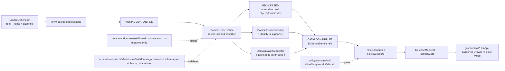

<!-- [KFM_META_BLOCK_V2]
doc_id: kfm://doc/contracts-domains-soil-domain-observation
title: Domain Observation Contract — Soil
type: semantic-contract; observation-profile
version: v0.2
status: draft; PROPOSED; schema-stub-confirmed; canonical-working-lane; support-type-separation-required; evidence-bound; NEEDS VERIFICATION before promotion
owners:
  - OWNER_TBD — Soil domain steward
  - OWNER_TBD — Contracts steward
  - OWNER_TBD — Schema steward
  - OWNER_TBD — Source steward
  - OWNER_TBD — Evidence steward
  - OWNER_TBD — Policy steward
  - OWNER_TBD — Release steward
  - OWNER_TBD — Docs steward
created: NEEDS VERIFICATION — scaffold existed before v0.2 expansion
updated: 2026-06-23
policy_label: public; contracts; soil; domain-observation; source-scoped-observation; source-role-aware; support-type-separation; temporal-scope-aware; evidence-bound; schema-stub; release-gated; rollback-aware; not-source-truth; not-schema-authority; not-etl-code; not-publication-authority; not-direct-data-access
tags: [kfm, contracts, soil, domain-observation, SoilMapUnit, SoilComponent, Horizon, ComponentHorizonJoin, SoilProperty, HydrologicSoilGroup, SoilMoistureObservation, Pedon, SoilProfileView, ErosionRisk, SuitabilityRating, SoilTimeCaveat, authoritative_static_soil, gridded_derivative_soil, station_soil_moisture, satellite_grid_soil_moisture, pedon_evidence, interpretation, SourceDescriptor, EvidenceRef, EvidenceBundle, PolicyDecision, ReviewRecord, ReleaseManifest, RollbackCard]
related:
  - ./README.md
  - ./domain_feature_identity.md
  - ./domain_layer_descriptor.md
  - ./component_horizon_join.md
  - ./soil_map_unit.md
  - ./soil_component.md
  - ./horizon.md
  - ./soil_property.md
  - ./hydrologic_soil_group.md
  - ./soil_moisture_observation.md
  - ./pedon.md
  - ./soil_profile_view.md
  - ./erosion_risk.md
  - ./suitability_rating.md
  - ./soil_time_caveat.md
  - ../../../docs/domains/soil/README.md
  - ../../../docs/domains/soil/CANONICAL_PATHS.md
  - ../../../docs/domains/soil/ARCHITECTURE.md
  - ../../../docs/domains/soil/API_CONTRACTS.md
  - ../../../docs/domains/soil/DATA_LIFECYCLE.md
  - ../../../pipelines/domains/soil/README.md
  - ../../../schemas/contracts/v1/domains/soil/domain_observation.schema.json
  - ../../../schemas/contracts/v1/domains/soil/README.md
  - ../../../policy/domains/soil/README.md
  - ../../../fixtures/domains/soil/domain_observation/
  - ../../../tests/domains/soil/
  - ../../../release/candidates/soil/
notes:
  - "Expanded from a greenfield scaffold at contracts/domains/soil/domain_observation.md."
  - "A paired schema exists at schemas/contracts/v1/domains/soil/domain_observation.schema.json, but it is a permissive stub with id/version/spec_hash only and additionalProperties true. Field realization remains PROPOSED."
  - "Soil architecture defines Soil terms and support-type tags with meaning constrained by source role, evidence, time, and release state. This contract gives source-scoped Soil observations their semantic boundary."
  - "Support-type separation remains mandatory: static survey, gridded derivative, station observation, satellite grid, pedon/profile evidence, and interpretation cannot be collapsed into one observation surface."
  - "This contract defines observation meaning only; it does not implement schema validation, ETL, source activation, public API behavior, release approval, map rendering, or AI answers."
[/KFM_META_BLOCK_V2] -->

<a id="top"></a>

# Domain Observation Contract — Soil

> Semantic contract for `domain_observation`: the Soil-domain source-scoped observation/assertion record that carries what a source says about a soil object, property, classification, profile, reading, interpretation, or temporal caveat — without becoming source truth, feature identity, schema enforcement, ETL code, layer truth, release approval, or AI authority.

<p>
  
  
  
  
  
  
  
</p>

`contracts/domains/soil/domain_observation.md`

## Quick jumps

[Status](#status) · [Meaning](#meaning) · [Repo fit](#repo-fit) · [Schema posture](#schema-posture) · [Accepted uses](#accepted-uses) · [Exclusions](#exclusions) · [Recommended fields](#recommended-fields) · [Observation model](#observation-model) · [Observation families](#observation-families) · [Source-role and support rules](#source-role-and-support-rules) · [Sensitivity and publication posture](#sensitivity-and-publication-posture) · [Invariants](#invariants) · [Lifecycle](#lifecycle) · [Validation](#validation) · [Rollback](#rollback) · [Evidence basis](#evidence-basis) · [Open questions](#open-questions)

---

## Status

> [!IMPORTANT]
> **Status:** `draft` / semantic contract / observation profile  
> **Owner:** `OWNER_TBD`  
> **Contract path:** `contracts/domains/soil/domain_observation.md`  
> **Schema path checked:** `schemas/contracts/v1/domains/soil/domain_observation.schema.json` — **confirmed stub only**  
> **Truth posture:** target path, prior scaffold, paired schema stub, Soil contract-lane README, Soil architecture, Soil API posture, and Soil lifecycle inventory are confirmed from current repo evidence. Field-level shape beyond `id`, `version`, and `spec_hash`, schema enforcement, validators, fixtures, policy tests, ETL behavior, source registry records, release manifests, governed API routes, public API behavior, map rendering, graph behavior, and runtime behavior remain **NEEDS VERIFICATION**.

> [!CAUTION]
> This contract defines observation meaning only. It does **not** validate JSON, activate a source, perform source ingestion, publish a layer, prove a soil feature, convert support types, or authorize an AI answer.

---

## Meaning

`domain_observation` records a source-scoped Soil assertion before it is promoted into a canonical/released object projection.

It may capture observations or assertions about:

- `SoilMapUnit`
- `SoilComponent`
- `Horizon`
- `ComponentHorizonJoin`
- `SoilProperty`
- `HydrologicSoilGroup`
- `SoilMoistureObservation`
- `Pedon`
- `SoilProfileView`
- `ErosionRisk`
- `SuitabilityRating`
- `SoilTimeCaveat`

The observation answers:

- Which source made or carried the assertion?
- What support type does the assertion belong to?
- What object family, property, classification, reading, profile, interpretation, or caveat is being observed?
- What time, depth, unit, method, scale, resolution, quality, or source-vintage context controls interpretation?
- Which EvidenceBundle, policy, review, release, and rollback surfaces govern downstream use?
- What does the observation **not** prove?

A Soil observation is a **source-scoped evidence-bearing claim**. It can support feature identity, layer descriptors, Evidence Drawer projections, validation reports, or Focus Mode answers after governance. It cannot by itself become source truth, public layer truth, derived interpretation truth, or release approval.

---

## Repo fit

| Responsibility | Path | Role |
|---|---|---|
| Contract lane | `contracts/domains/soil/domain_observation.md` | This semantic observation contract. |
| Soil contract README | `contracts/domains/soil/README.md` | Defines this folder as meaning-only and excludes schemas, policy, data, release, and public artifacts. |
| Paired schema stub | `schemas/contracts/v1/domains/soil/domain_observation.schema.json` | Confirms a stub exists, but only `id`, `version`, `spec_hash`, and `additionalProperties: true` are enforced. |
| Identity companion | `contracts/domains/soil/domain_feature_identity.md` | Observations may support identity but do not become identity by themselves. |
| Layer descriptor companion | `contracts/domains/soil/domain_layer_descriptor.md` | Layer descriptors may project released observations but remain delivery surfaces. |
| Component-horizon companion | `contracts/domains/soil/component_horizon_join.md` | Observations may support or cite MUKEY/COKEY/CHKEY lineage. |
| Soil architecture | `docs/domains/soil/ARCHITECTURE.md` | Defines Soil object families, source families, support-type tags, source-role rules, lifecycle, and cross-lane boundaries. |
| Soil API posture | `docs/domains/soil/API_CONTRACTS.md` | Defines finite outcomes, governed API trust membrane, support-type separation, and public Soil surfaces. |
| Soil lifecycle inventory | `docs/domains/soil/DATA_LIFECYCLE.md` | Lists owned Soil object families, source families, lifecycle posture, and sensitivity defaults. |
| Policy | `policy/domains/soil/` | Allow/deny/restrict/abstain, rights, sensitivity, stale-state, source-role, and release gating. |
| Tests / fixtures | `tests/domains/soil/`, `fixtures/domains/soil/domain_observation/` | Expected proof surfaces; maturity not verified here. |
| Release / rollback | `release/candidates/soil/` and release roots | Publication, correction, and rollback authority. |

---

## Schema posture

A paired schema exists at:

```text
schemas/contracts/v1/domains/soil/domain_observation.schema.json
```

The confirmed schema is a **greenfield stub**. It defines:

- `id` as required;
- optional `version`;
- optional `spec_hash`;
- `additionalProperties: true`.

> [!WARNING]
> Because the paired schema is only a permissive stub, every field below beyond `id`, `version`, and `spec_hash` is **PROPOSED** semantic guidance. Do not treat it as machine-enforced until schema, fixtures, validators, policy tests, release checks, governed API behavior, and runtime behavior are verified.

---

## Accepted uses

| Use | Allowed? | Rule |
|---|---:|---|
| Recording a source-scoped Soil assertion | Yes | Must preserve source ref, source role, support type, object family, time/depth/unit/method context, evidence refs, and limitations. |
| Supporting Soil feature identity | Conditional | Observation may support identity but does not become identity truth by itself. |
| Supporting Soil layer descriptors | Conditional | Observation must be validated, evidence-bound, policy-gated, and released before public layer use. |
| Supporting Evidence Drawer explanation | Conditional | Drawer must project EvidenceBundle, citations, policy, review, release, and correction state. |
| Supporting Focus Mode answer | Conditional | AI may use only released/cited observation context with finite outcomes. |
| Recording candidate or model-assisted observations | Conditional | Must remain candidate/review-only until validated and released. |
| Publishing an observation directly from RAW/WORK/CATALOG | No | Public clients use governed APIs and released artifacts only. |
| Collapsing support types into one observation family | No | Support-type separation is mandatory. |

---

## Exclusions

`domain_observation` must not be used as:

| Misuse | Required outcome |
|---|---|
| JSON Schema / machine validation | Use `schemas/contracts/v1/domains/soil/` or ADR-selected schema home. |
| SourceDescriptor or source registry record | Use source registry roots and SourceDescriptor contracts. |
| ETL implementation | Use `pipelines/domains/soil/` and tests. |
| Canonical feature identity | Use `domain_feature_identity` plus EvidenceBundle and validation. |
| Layer manifest / delivery projection | Use `domain_layer_descriptor`. |
| Release approval | Use PolicyDecision, ReviewRecord, ReleaseManifest, correction path, and RollbackCard. |
| SoilProperty, Horizon, SoilComponent, or SoilMapUnit truth by itself | Use owning object-family contracts and evidence closure. |
| Public API response shape | Use governed API schemas and route contracts. |
| AI answer authority | Focus Mode remains evidence-subordinate and finite-outcome constrained. |

---

## Recommended fields

The following fields are **PROPOSED** until the paired schema is expanded and validated.

| Field | Meaning |
|---|---|
| `id` | Canonical observation identifier. Confirmed required by schema stub. |
| `version` | Contract/object version. Confirmed optional by schema stub. |
| `spec_hash` | Deterministic hash over normalized observation content. Confirmed optional by schema stub. |
| `domain` | Expected value: `soil`. |
| `observation_family` | Survey assertion, component assertion, horizon assertion, property observation, classification assertion, moisture observation, pedon/profile observation, interpretation assertion, time caveat, or source-specific family. |
| `object_family` | SoilMapUnit, SoilComponent, Horizon, ComponentHorizonJoin, SoilProperty, HydrologicSoilGroup, SoilMoistureObservation, Pedon, SoilProfileView, ErosionRisk, SuitabilityRating, or SoilTimeCaveat. |
| `support_type` | Static survey, gridded derivative, station observation, satellite grid, pedon/profile, interpretation, or schema-selected equivalent. |
| `source_ref` | SourceDescriptor/source registry ref. |
| `source_role` | Source role for this observation use. |
| `source_native_id` | Source-native observation, row, station, grid, map unit, component, horizon, or profile identifier. |
| `observed_value` | Observed or asserted value; may be categorical, numeric, narrative, geometry-linked, profile-linked, or caveat-like. |
| `unit` | Unit for numeric values, where applicable. |
| `method_ref` | Method, model, survey, station, satellite, lab/profile, or interpretation method reference. |
| `depth_or_profile_scope` | Depth, horizon, profile, or sensor depth context where material. |
| `scale_or_resolution` | Survey scale, raster resolution, station support, satellite grid resolution, or profile locality. |
| `quality_flags` | QC, uncertainty, stale-state, candidate, model-assisted, review-only, superseded, or source-specific flags. |
| `observed_time` | Time the measurement/observation was made, if applicable. |
| `source_time` | Source creation/publication/update time. |
| `valid_time` | Interval the assertion applies to, if known. |
| `retrieval_time` | KFM retrieval/freeze time. |
| `release_time` | KFM release time, if released. |
| `correction_time` | Correction/supersession time, if corrected. |
| `evidence_refs` | EvidenceRefs or EvidenceBundle refs. |
| `feature_identity_ref` | Optional DomainFeatureIdentity ref supported by the observation. |
| `layer_descriptor_ref` | Optional DomainLayerDescriptor ref if used in a layer. |
| `policy_decision_ref` | PolicyDecision governing use/publication. |
| `review_ref` | ReviewRecord or steward review ref. |
| `release_manifest_ref` | ReleaseManifest or MapReleaseManifest ref. |
| `rollback_ref` | RollbackCard or rollback target. |
| `limitations` | Caveats: observation only; not source truth, not feature identity, not release approval. |

---

## Observation model

A reviewed Soil observation should bind a source-scoped assertion to support type, object family, method/unit/depth/scale context, time axes, evidence, and release posture.

```text
domain_observation = {
  domain,
  observation_family,
  object_family,
  support_type,
  source_ref,
  source_role,
  source_native_id,
  observed_value,
  unit,
  method_ref,
  depth_or_profile_scope,
  scale_or_resolution,
  quality_flags,
  temporal_scope,
  evidence_refs,
  feature_identity_ref,
  layer_descriptor_ref,
  policy_decision_ref,
  review_ref,
  release_manifest_ref,
  rollback_ref
}
```

The exact serialized shape is **NEEDS VERIFICATION** until the schema and validators are field-complete.

---

## Observation families

| Observation family | Meaning | Guardrail |
|---|---|---|
| `survey_assertion` | Source asserts map-unit, component, horizon, property, or classification context from static survey support. | Static survey is not a live observation. |
| `gridded_derivative_assertion` | Source/derivative asserts raster or gridded soil context. | Derivative grid is not source survey truth at unsupported scale. |
| `station_moisture_observation` | Station reading with unit, depth, time, cadence, and QC context. | Point station is not a gridded or countywide surface. |
| `satellite_grid_observation` | Satellite grid value with resolution, retrieval time, and product caveats. | Satellite grid is not a station reading or SSURGO polygon. |
| `pedon_profile_observation` | Pedon/profile/horizon evidence with locality and method context. | Profile evidence is not broad map-unit truth by itself. |
| `interpretation_assertion` | Hydrologic group, erosion risk, suitability, or other interpretive value. | Interpretation is not measurement, hazard authority, or operational advice. |
| `time_caveat_observation` | Product vintage, stale-state, supersession, or temporal limitation. | Caveat must travel with the affected observation/layer. |
| `candidate_observation` | Model/OCR/connector/provisional assertion. | Review only until validated and released. |
| `denied_or_abstained_observation` | Observation cannot be used under current evidence/policy. | Emit finite outcome and reason, not unsupported value. |

---

## Source-role and support rules

| Rule | Requirement |
|---|---|
| Source role is per observation | A source may be authority for one observation and context/model support for another. |
| Support type is mandatory | Static survey, gridded derivative, station observation, satellite grid, pedon/profile, and interpretation cannot masquerade as one surface. |
| Method/unit/depth are part of meaning | Numeric and profile observations need unit, depth, method, or scope where material. |
| Scale/resolution is part of meaning | False precision and silent resampling are forbidden. |
| Observation is not feature identity | Observations may support identity, but identity requires DomainFeatureIdentity and evidence closure. |
| Observation is not public release | Publication requires PolicyDecision, ReviewRecord, ReleaseManifest, and rollback target where required. |
| Time axes remain separate | Source time, observed time, valid time, retrieval time, release time, and correction time must not collapse. |
| Public claims require EvidenceBundle resolution | If evidence cannot resolve, return ABSTAIN, DENY, or ERROR; do not invent the observation. |

---

## Sensitivity and publication posture

| Surface | Default posture | Reason |
|---|---|---|
| Public static survey observation | Public-safe if source, rights, evidence, release, and scale support it | Survey context is usually public-safe at appropriate scale. |
| Gridded derivative observation | Public-safe if released and caveated | Resolution and derivative posture prevent false precision. |
| Station or satellite observation | Public-safe only with cadence/resolution/QC caveats | Point/grid observations can be misread as broader truth. |
| Pedon/profile observation | Review / caveat by locality and joins | Profile evidence is local/profile evidence, not continuous truth. |
| Interpretation assertion | Caveated and method-visible | Suitability/erosion/hydrologic interpretations need explicit limitations. |
| Farm-specific, owner-specific, operational, or private sensor observation | Review / restrict / deny by default | Soil doctrine marks these as not public-by-default. |
| Candidate/model/OCR observation | Review only | Generated or candidate observations do not become public truth. |

---

## Invariants

1. **Observation is not source truth.** It is a source-scoped assertion that must remain tied to source role and evidence.
2. **Observation is not identity.** It may support `domain_feature_identity`, but it does not become identity by itself.
3. **Observation is not a layer.** It may support a layer descriptor only after governance.
4. **Support type is part of observation meaning.** Static survey, gridded derivative, station, satellite, pedon/profile, and interpretation observations must not collapse.
5. **Method, unit, depth, scale, and QC matter.** Missing required context should force ABSTAIN, DENY, or ERROR depending on use.
6. **Time is part of meaning.** Source, observed, valid, retrieval, release, and correction times remain distinct where material.
7. **Release is separate.** A valid observation does not publish anything without PolicyDecision, ReviewRecord, ReleaseManifest, and RollbackCard where required.
8. **AI is downstream.** Focus Mode may explain only released evidence and policy-permitted observation context.
9. **No direct internal-store reads.** Public clients use governed APIs and released artifacts only.
10. **Path variance remains ADR-sensitive.** Do not use this file to settle contract/schema path variance by tone.

---

## Lifecycle



---

## Validation

Before this contract is treated as mature, maintainers should verify:

- [ ] paired schema expands beyond the current permissive stub or an ADR declares a different observation-shape home;
- [ ] schema includes observation family, object family, support type, source refs, source role, source-native ID, observed value, unit, method, depth/profile scope, scale/resolution, quality flags, time axes, evidence refs, policy/review/release/rollback refs, and limitations;
- [ ] fixtures cover survey assertion, gridded derivative assertion, station moisture observation, satellite grid observation, pedon/profile observation, interpretation assertion, time caveat, candidate observation, denied observation, stale observation, and conflicting observation;
- [ ] tests prevent support-type collapse;
- [ ] tests prevent observations from becoming source truth, feature identity, layer truth, release approval, or AI authority;
- [ ] tests enforce unit/depth/method/QC requirements where material;
- [ ] tests enforce ABSTAIN/DENY/ERROR when evidence, source role, support type, time scope, sensitivity, policy, or release state is unresolved;
- [ ] public map, Evidence Drawer, Focus Mode, exports, and AI summaries use only released/governed observation projections;
- [ ] rollback invalidates linked processed records, identities, layer descriptors, drawer payloads, exports, caches, graph projections, and AI summaries that cited a withdrawn observation.

---

## Rollback

Rollback is required if this contract:

- claims schema, validator, fixture, test, policy, release, API, ETL, map, graph, or runtime behavior exists without proof;
- treats DomainObservation as JSON Schema, ETL code, source truth, feature identity, layer truth, released-layer truth, or AI authority;
- weakens support-type separation;
- hides source-role conflict, native-key gaps, source vintage, valid-time limits, candidate status, unit/depth/method/QC gaps, supersession, or correction lineage;
- exposes farm-specific, owner-specific, operational, or private sensor detail without policy/release support;
- normalizes direct UI access to internal lifecycle stores or direct model output.

Rollback target: revert `contracts/domains/soil/domain_observation.md` to prior scaffold blob `c0002f8d50aa1832aa55788193996c75f017c86a`, record drift if authority boundaries were affected, and invalidate downstream derivatives that relied on weakened Soil observation semantics.

---

## Evidence basis

| Evidence | Status | Supports | Limits |
|---|---|---|---|
| Prior `contracts/domains/soil/domain_observation.md` | `CONFIRMED` | Target file existed as a greenfield scaffold. | Scaffold did not define authoritative semantic contract content. |
| `schemas/contracts/v1/domains/soil/domain_observation.schema.json` | `CONFIRMED schema stub` | Confirms schema path, required `id`, optional `version` and `spec_hash`, and permissive `additionalProperties`. | Does not enforce proposed observation fields. |
| `contracts/domains/soil/README.md` | `CONFIRMED contract-lane rule` | Defines this folder as semantic meaning only and excludes schemas, policy, lifecycle data, release, and public artifacts. | Does not prove object schema, validator, or release maturity. |
| `contracts/domains/soil/domain_feature_identity.md` | `CONFIRMED sibling contract` | Defines the broad Soil identity envelope and explains observations may support but not replace identity. | Its schema is also a stub. |
| `contracts/domains/soil/domain_layer_descriptor.md` | `CONFIRMED sibling contract` | Defines Soil layer descriptors as governed projections, not source or object truth. | Its schema is also a stub. |
| `docs/domains/soil/ARCHITECTURE.md` | `CONFIRMED doctrine / PROPOSED field realization` | Defines Soil object families, source families, support-type tags, source-role rule, and support-type separation. | Does not prove implementation. |
| `docs/domains/soil/API_CONTRACTS.md` | `CONFIRMED doctrine / PROPOSED implementation` | Defines finite outcomes, trust membrane, support-type separation, and governed public surfaces. | Route names and runtime behavior remain UNKNOWN / NEEDS VERIFICATION. |
| `docs/domains/soil/DATA_LIFECYCLE.md` | `CONFIRMED navigational register / PROPOSED implementation` | Lists Soil owned object families, source families, sensitivity defaults, and lifecycle posture. | It is a navigational register, not implementation proof. |
| Uploaded KFM authoring prompt v2 | `CONFIRMED user-supplied guidance` | Requires evidence-first, implementation-honest, visually polished Markdown with visible verification and rollback posture. | Authoring guidance, not implementation proof. |

---

## Open questions

| ID | Question | Status |
|---|---|---|
| OQ-SOIL-OBS-01 | Should Soil `domain_observation` inherit from a cross-domain observation schema, or remain domain-specific? | OPEN / DOMAIN + SCHEMA REVIEW |
| OQ-SOIL-OBS-02 | Which observation-family enum is canonical across survey, derivative, station, satellite, pedon/profile, interpretation, caveat, and candidate observations? | OPEN / SCHEMA REVIEW |
| OQ-SOIL-OBS-03 | Which units, depth/profile fields, method refs, and quality flags are mandatory by support type? | OPEN / VALIDATION REVIEW |
| OQ-SOIL-OBS-04 | How should observations cite source-native IDs without turning them into source truth? | OPEN / SOURCE + EVIDENCE REVIEW |
| OQ-SOIL-OBS-05 | How should Evidence Drawer and Focus Mode show observed value, method, support type, and quality posture without overclaiming? | OPEN / MAP/UI REVIEW |
| OQ-SOIL-OBS-06 | How should rollback invalidate identities, layer descriptors, drawer payloads, Focus Mode claims, exports, caches, graph projections, and AI summaries after an observation correction? | OPEN / RELEASE REVIEW |

<p align="right"><a href="#top">Back to top</a></p>
