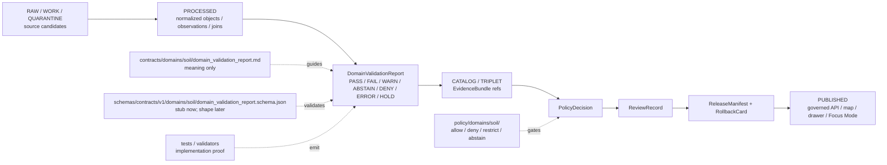

<!-- [KFM_META_BLOCK_V2]
doc_id: kfm://doc/contracts-domains-soil-domain-validation-report
title: Domain Validation Report Contract — Soil
type: semantic-contract; validation-report-profile
version: v0.2
status: draft; PROPOSED; schema-stub-confirmed; canonical-working-lane; support-type-separation-required; validation-not-release; NEEDS VERIFICATION before promotion
owners:
  - OWNER_TBD — Soil domain steward
  - OWNER_TBD — Validation steward
  - OWNER_TBD — Contracts steward
  - OWNER_TBD — Schema steward
  - OWNER_TBD — Source steward
  - OWNER_TBD — Evidence steward
  - OWNER_TBD — Policy steward
  - OWNER_TBD — Release steward
  - OWNER_TBD — Docs steward
created: NEEDS VERIFICATION — scaffold existed before v0.2 expansion
updated: 2026-06-23
policy_label: public; contracts; soil; domain-validation-report; validation-result; source-role-aware; support-type-separation; temporal-scope-aware; evidence-bound; schema-stub; release-gated; rollback-aware; not-source-truth; not-policy-decision; not-release-approval; not-etl-code; not-publication-authority; not-direct-data-access
tags: [kfm, contracts, soil, domain-validation-report, ValidationReport, SoilMapUnit, SoilComponent, Horizon, ComponentHorizonJoin, SoilProperty, HydrologicSoilGroup, SoilMoistureObservation, Pedon, SoilProfileView, ErosionRisk, SuitabilityRating, SoilTimeCaveat, support_type_collapse, MUKEY, COKEY, CHKEY, horizon_depth_sanity, soil_moisture_qc, EvidenceRef, EvidenceBundle, PolicyDecision, ReviewRecord, ReleaseManifest, RollbackCard]
related:
  - ./README.md
  - ./domain_feature_identity.md
  - ./domain_observation.md
  - ./domain_layer_descriptor.md
  - ./component_horizon_join.md
  - ./soil_map_unit.md
  - ./soil_component.md
  - ./horizon.md
  - ./soil_property.md
  - ./hydrologic_soil_group.md
  - ./soil_moisture_observation.md
  - ./pedon.md
  - ./soil_profile_view.md
  - ./erosion_risk.md
  - ./suitability_rating.md
  - ./soil_time_caveat.md
  - ../../../docs/domains/soil/README.md
  - ../../../docs/domains/soil/CANONICAL_PATHS.md
  - ../../../docs/domains/soil/ARCHITECTURE.md
  - ../../../docs/domains/soil/API_CONTRACTS.md
  - ../../../docs/domains/soil/DATA_LIFECYCLE.md
  - ../../../pipelines/domains/soil/README.md
  - ../../../schemas/contracts/v1/domains/soil/domain_validation_report.schema.json
  - ../../../schemas/contracts/v1/domains/soil/README.md
  - ../../../policy/domains/soil/README.md
  - ../../../fixtures/domains/soil/domain_validation_report/
  - ../../../tests/domains/soil/
  - ../../../release/candidates/soil/
notes:
  - "Expanded from a greenfield scaffold at contracts/domains/soil/domain_validation_report.md."
  - "A paired schema exists at schemas/contracts/v1/domains/soil/domain_validation_report.schema.json, but it is a permissive stub with id/version/spec_hash only and additionalProperties true. Field realization remains PROPOSED."
  - "Soil API posture names PASS/FAIL as internal validator outcomes and lists validator families for MUKEY/COKEY/CHKEY lineage, horizon depth sanity, soil-moisture unit/depth/QC, support-type separation denial, dual-hash stability, and EvidenceBundle/Evidence Drawer closure."
  - "This contract defines validation-report meaning only; validation is not policy permission, release approval, source truth, public API behavior, map rendering, or AI answer authority."
  - "Support-type separation remains mandatory: static survey, gridded derivative, station observation, satellite grid, pedon/profile evidence, and interpretation cannot be collapsed by a passing validation report."
[/KFM_META_BLOCK_V2] -->

<a id="top"></a>

# Domain Validation Report Contract — Soil

> Semantic contract for `domain_validation_report`: the Soil-domain validation-result surface that records whether a Soil object, observation, identity, layer descriptor, join, derivative, or release candidate satisfied declared checks — without becoming source truth, policy permission, release approval, ETL proof, public API authority, map truth, or AI answer authority.

<p>
  
  
  
  
  
  
  
</p>

`contracts/domains/soil/domain_validation_report.md`

## Quick jumps

[Status](#status) · [Meaning](#meaning) · [Repo fit](#repo-fit) · [Schema posture](#schema-posture) · [Accepted uses](#accepted-uses) · [Exclusions](#exclusions) · [Recommended fields](#recommended-fields) · [Report model](#report-model) · [Validator families](#validator-families) · [Source-role and support rules](#source-role-and-support-rules) · [Sensitivity and publication posture](#sensitivity-and-publication-posture) · [Invariants](#invariants) · [Lifecycle](#lifecycle) · [Validation](#validation) · [Rollback](#rollback) · [Evidence basis](#evidence-basis) · [Open questions](#open-questions)

---

## Status

> [!IMPORTANT]
> **Status:** `draft` / semantic contract / validation-report profile  
> **Owner:** `OWNER_TBD`  
> **Contract path:** `contracts/domains/soil/domain_validation_report.md`  
> **Schema path checked:** `schemas/contracts/v1/domains/soil/domain_validation_report.schema.json` — **confirmed stub only**  
> **Truth posture:** target path, prior scaffold, paired schema stub, Soil contract-lane README, Soil architecture, Soil API posture, Soil lifecycle inventory, and sibling Soil contracts are confirmed from current repo evidence. Field-level shape beyond `id`, `version`, and `spec_hash`, schema enforcement, validator implementation, fixtures, policy tests, ETL behavior, source registry records, release manifests, governed API routes, public API behavior, map rendering, graph behavior, and runtime behavior remain **NEEDS VERIFICATION**.

> [!CAUTION]
> A validation report is evidence about checks. It does **not** decide policy, publish a layer, certify source truth, authorize public display, or permit AI to answer without EvidenceBundle/release closure.

---

## Meaning

`domain_validation_report` records the result of one or more Soil validation checks against a specific candidate, object, observation, identity, layer descriptor, join, derivative, or release candidate.

It may validate or preflight:

- `SoilMapUnit`
- `SoilComponent`
- `Horizon`
- `ComponentHorizonJoin`
- `SoilProperty`
- `HydrologicSoilGroup`
- `SoilMoistureObservation`
- `Pedon`
- `SoilProfileView`
- `ErosionRisk`
- `SuitabilityRating`
- `SoilTimeCaveat`
- `domain_feature_identity`
- `domain_observation`
- `domain_layer_descriptor`

The report answers:

- What was checked?
- Which validator family/check version was used?
- Which source role, support type, time scope, method/unit/depth/scale, and evidence refs were evaluated?
- Did the check pass, fail, warn, abstain, deny, error, or hold?
- Which failures block promotion, release, map display, Evidence Drawer projection, Focus Mode answer, or downstream reuse?
- What correction or rollback target is required if a previously used record no longer passes?

A validation report is a **governance evidence object**. It can support promotion, review, release, rollback, and public-surface finite outcomes. It cannot itself become a policy decision, release manifest, EvidenceBundle, source descriptor, validator implementation, or authoritative Soil claim.

---

## Repo fit

| Responsibility | Path | Role |
|---|---|---|
| Contract lane | `contracts/domains/soil/domain_validation_report.md` | This semantic validation-report contract. |
| Soil contract README | `contracts/domains/soil/README.md` | Defines this folder as meaning-only and excludes schemas, policy, data, release, and public artifacts. |
| Paired schema stub | `schemas/contracts/v1/domains/soil/domain_validation_report.schema.json` | Confirms a stub exists, but only `id`, `version`, `spec_hash`, and `additionalProperties: true` are enforced. |
| Identity companion | `contracts/domains/soil/domain_feature_identity.md` | Validation can check identity support but does not become identity truth. |
| Observation companion | `contracts/domains/soil/domain_observation.md` | Validation can check observations but does not become observation/source truth. |
| Layer descriptor companion | `contracts/domains/soil/domain_layer_descriptor.md` | Validation can check layer descriptors, but layer release remains separate. |
| Component-horizon companion | `contracts/domains/soil/component_horizon_join.md` | Validation can check MUKEY/COKEY/CHKEY lineage, but does not execute the join. |
| Soil architecture | `docs/domains/soil/ARCHITECTURE.md` | Defines Soil object families, source families, support-type tags, source-role rules, lifecycle, and cross-lane boundaries. |
| Soil API posture | `docs/domains/soil/API_CONTRACTS.md` | Defines finite outcomes, validator class outcomes, forbidden public-surface behaviors, required gates, and validator families. |
| Soil lifecycle inventory | `docs/domains/soil/DATA_LIFECYCLE.md` | Lists object families, source families, sensitivity defaults, and promotion model. |
| Policy | `policy/domains/soil/` | Allow/deny/restrict/abstain, rights, sensitivity, stale-state, source-role, and release gating. |
| Tests / fixtures | `tests/domains/soil/`, `fixtures/domains/soil/domain_validation_report/` | Expected proof surfaces; maturity not verified here. |
| Release / rollback | `release/candidates/soil/` and release roots | Publication, correction, and rollback authority. |

---

## Schema posture

A paired schema exists at:

```text
schemas/contracts/v1/domains/soil/domain_validation_report.schema.json
```

The confirmed schema is a **greenfield stub**. It defines:

- `id` as required;
- optional `version`;
- optional `spec_hash`;
- `additionalProperties: true`.

> [!WARNING]
> Because the paired schema is only a permissive stub, every field below beyond `id`, `version`, and `spec_hash` is **PROPOSED** semantic guidance. Do not treat it as machine-enforced until schema, fixtures, validators, policy tests, release checks, governed API behavior, and runtime behavior are verified.

---

## Accepted uses

| Use | Allowed? | Rule |
|---|---:|---|
| Recording validator result semantics | Yes | Must include subject, validator family, check version, inputs/evidence, outcome, severity, and limitations. |
| Supporting promotion from processed records to catalog/triplet | Conditional | Validation supports promotion; it does not replace EvidenceBundle or policy. |
| Supporting release preflight | Conditional | Validation may be required before release, but release still requires PolicyDecision, ReviewRecord, ReleaseManifest, and rollback target. |
| Supporting Evidence Drawer quality explanation | Conditional | Drawer can cite validation state only as a governed projection. |
| Supporting Focus Mode finite outcome | Conditional | AI can cite validation only alongside EvidenceBundle/policy/release closure. |
| Recording negative-state checks | Yes | FAIL, ABSTAIN, DENY, ERROR, and HOLD are first-class report states. |
| Publishing a passing validation report as public truth | No | Passing validation is not an authoritative claim or release approval. |
| Treating a failed validation as silent absence | No | Failed/denied/errored checks must remain auditable where material. |

---

## Exclusions

`domain_validation_report` must not be used as:

| Misuse | Required outcome |
|---|---|
| JSON Schema / machine validation definition | Use `schemas/contracts/v1/domains/soil/` and validator code. |
| Validator implementation | Use tests/tools/pipelines. |
| SourceDescriptor or source registry record | Use source registry roots and SourceDescriptor contracts. |
| Policy decision | Use PolicyDecision and policy roots. |
| Release approval | Use ReviewRecord, ReleaseManifest, correction path, and RollbackCard. |
| EvidenceBundle replacement | Use EvidenceBundle; validation may cite or attach to it. |
| Feature identity, observation, layer, or object truth | Use the owning contract and evidence closure. |
| Public API response shape | Use governed API schemas and route contracts. |
| AI answer authority | Focus Mode remains evidence-subordinate and finite-outcome constrained. |

---

## Recommended fields

The following fields are **PROPOSED** until the paired schema is expanded and validated.

| Field | Meaning |
|---|---|
| `id` | Canonical validation report identifier. Confirmed required by schema stub. |
| `version` | Contract/object version. Confirmed optional by schema stub. |
| `spec_hash` | Deterministic hash over normalized validation report content. Confirmed optional by schema stub. |
| `domain` | Expected value: `soil`. |
| `validation_subject_ref` | Object, candidate, observation, identity, layer descriptor, join, release candidate, or artifact ref being checked. |
| `validation_subject_family` | Soil object family or contract family under validation. |
| `validator_family` | MUKEY/COKEY/CHKEY lineage, horizon depth sanity, soil-moisture unit/depth/QC, support-type separation denial, dual-hash stability, EvidenceBundle closure, release-manifest preflight, etc. |
| `validator_id` | Specific validator/check identifier. |
| `validator_version` | Validator implementation or rule version. |
| `validation_run_ref` | Run receipt, CI job, pipeline run, or validator execution ref where available. |
| `input_refs` | Candidate/source/artifact/input refs checked by the validator. |
| `evidence_refs` | EvidenceRefs or EvidenceBundle refs used or checked. |
| `source_role_summary` | Source-role posture checked by the report. |
| `support_type` | Soil support type under validation. |
| `temporal_scope` | Source time, observed time, valid time, retrieval time, validation time, release time, correction time. |
| `outcome` | PASS, FAIL, WARN, ABSTAIN, DENY, ERROR, HOLD, or schema-selected equivalent. |
| `severity` | Info, warning, blocking, release-blocking, policy-blocking, fatal, or source-specific severity. |
| `reason_codes` | Machine-readable reason codes. |
| `human_summary` | Public/steward-safe explanation of the result. |
| `blocking_state` | Whether this report blocks promotion, release, map display, Evidence Drawer, Focus Mode, or export. |
| `policy_decision_ref` | PolicyDecision consulted or required; validation does not replace it. |
| `review_ref` | ReviewRecord or steward review ref. |
| `release_manifest_ref` | ReleaseManifest ref if this report supports release. |
| `rollback_ref` | RollbackCard or rollback target. |
| `limitations` | Caveats: validation only; not source truth, not policy, not release approval. |

---

## Report model

A reviewed validation report should bind the check subject, validator family, outcome, evidence, support type, blocking state, and downstream governance refs.

```text
domain_validation_report = {
  domain,
  validation_subject_ref,
  validation_subject_family,
  validator_family,
  validator_id,
  validator_version,
  validation_run_ref,
  input_refs,
  evidence_refs,
  source_role_summary,
  support_type,
  temporal_scope,
  outcome,
  severity,
  reason_codes,
  blocking_state,
  policy_decision_ref,
  review_ref,
  release_manifest_ref,
  rollback_ref
}
```

The exact serialized shape is **NEEDS VERIFICATION** until the schema and validators are field-complete.

---

## Validator families

| Validator family | What it proves | Blocking posture |
|---|---|---|
| `mukey_cokey_chkey_lineage` | Map unit → component → horizon lineage can be traced across source-native keys. | Blocks lineage-dependent joins/layers on failure. |
| `horizon_depth_sanity` | Horizon depth ordering and overlap/gap posture are reviewable. | Blocks horizon/profile projections on fatal failure. |
| `soil_moisture_unit_depth_qc` | Soil-moisture readings carry unit, depth, QC, and cadence context. | Blocks station/satellite observation use where missing. |
| `support_type_separation_denial` | Static survey, gridded derivative, station, satellite, pedon/profile, and interpretation support are not collapsed. | Required blocking negative-state check before public Soil release. |
| `dual_hash_stability` | Stable `spec_hash`/content digest behavior for unchanged inputs. | Blocks reproducibility-dependent promotion on failure. |
| `evidence_bundle_closure` | EvidenceRef resolves to complete EvidenceBundle and drawer projection preserves citation/policy/review/release state. | Blocks public `ANSWER` outcomes when unresolved. |
| `release_manifest_preflight` | Layer/output has ReleaseManifest, rollback target, and correction path. | Blocks public layer/API release on failure. |
| `policy_preflight` | PolicyDecision exists or is required for sensitive/rights/stale/scope cases. | Blocks release or surfaces DENY/HOLD depending on policy. |
| `cross_lane_boundary_check` | Agriculture, Hydrology, Hazards, Geology, Habitat/Flora/Fauna, People/Land, or other cross-lane claims stay contextual. | Blocks claims that collapse domains. |

---

## Source-role and support rules

| Rule | Requirement |
|---|---|
| Validation has a subject | A report without a subject ref and subject family is not reviewable. |
| Validator family is explicit | Generic pass/fail without validator family is insufficient for promotion or release. |
| Support type is checked where material | Soil validation must preserve static survey, gridded derivative, station, satellite, pedon/profile, and interpretation separation. |
| PASS is not policy | A passing validator does not imply PolicyDecision = ALLOW. |
| PASS is not release | A passing validator does not imply ReleaseManifest exists. |
| FAIL is not deletion | Failure should be auditable and attached to correction/rollback where material. |
| Time axes remain separate | Source time, observed time, valid time, retrieval time, validation time, release time, and correction time must not collapse. |
| Public claims require EvidenceBundle resolution | If evidence cannot resolve, return ABSTAIN, DENY, or ERROR; do not invent a validated answer. |

---

## Sensitivity and publication posture

| Surface | Default posture | Reason |
|---|---|---|
| Internal validation of public static survey objects | Internal/pass-through to release preflight if all gates pass | Validation supports promotion but does not publish. |
| Validation involving farm-specific, owner-specific, operational, or private sensor context | Review/restrict/deny by default | Soil sensitivity posture requires review for such joins. |
| Support-type separation failure | Blocking FAIL/DENY class | A public-safe-looking collapsed surface is doctrinally invalid. |
| EvidenceBundle closure failure | ABSTAIN/ERROR/DENY depending on failure reason | No consequential answer without resolvable evidence. |
| Policy preflight failure | DENY/HOLD depending on policy | Validation cannot override policy. |
| Candidate/model-generated validation | Review only | Generated candidate checks do not close evidence. |
| Public-facing validation summary | Redacted/generalized as needed | Reports may include source/run details unsuitable for public display. |

---

## Invariants

1. **Validation is not truth.** It records check outcomes over evidence, objects, candidates, or artifacts.
2. **Validation is not policy.** PolicyDecision remains a separate authority surface.
3. **Validation is not release.** ReleaseManifest and RollbackCard remain required for publication.
4. **PASS is bounded.** A passing result applies only to the stated validator family, subject, inputs, version, support type, and time scope.
5. **FAIL remains auditable.** Failures, denials, holds, errors, and abstentions must be retained where they affect promotion, release, correction, or rollback.
6. **Support-type separation is non-negotiable.** A report that ignores support-type collapse cannot support public Soil release.
7. **Evidence closure is required.** EvidenceRefs must resolve to EvidenceBundles before consequential public answers or published layers.
8. **AI is downstream.** Focus Mode may cite validation status only as evidence context and cannot turn validation into truth.
9. **No direct internal-store reads.** Public clients use governed APIs and released artifacts only.
10. **Path variance remains ADR-sensitive.** Do not use this file to settle contract/schema path variance by tone.

---

## Lifecycle



---

## Validation

Before this contract is treated as mature, maintainers should verify:

- [ ] paired schema expands beyond the current permissive stub or an ADR declares a different validation-report shape home;
- [ ] schema includes subject ref, subject family, validator family, validator ID/version, run ref, input refs, evidence refs, support type, time axes, outcome, severity, reason codes, blocking state, policy/review/release/rollback refs, and limitations;
- [ ] validator implementation exists for the named validator families, or each family is explicitly deferred;
- [ ] fixtures cover PASS, FAIL, WARN, ABSTAIN, DENY, ERROR, HOLD, stale data, support-type collapse, missing EvidenceBundle, missing ReleaseManifest, policy hold, and rollback-triggering correction;
- [ ] tests prevent validation reports from becoming source truth, policy decisions, release approval, public API authority, layer truth, or AI authority;
- [ ] tests enforce ABSTAIN/DENY/ERROR/HOLD where evidence, source role, support type, policy, release, or runtime evaluation is unresolved;
- [ ] public map, Evidence Drawer, Focus Mode, exports, and AI summaries use only released/governed validation projections where allowed;
- [ ] rollback invalidates linked processed records, identities, observations, layer descriptors, drawer payloads, exports, caches, graph projections, and AI summaries that cited a withdrawn or failed validation.

---

## Rollback

Rollback is required if this contract:

- claims schema, validator, fixture, test, policy, release, API, ETL, map, graph, or runtime behavior exists without proof;
- treats DomainValidationReport as JSON Schema, validator code, source truth, policy decision, release approval, public API proof, layer truth, or AI authority;
- weakens support-type separation or makes support-type collapse non-blocking;
- hides PASS scope, failure reason, source-role conflict, native-key gaps, source vintage, valid-time limits, candidate status, supersession, or correction lineage;
- exposes farm-specific, owner-specific, operational, or private sensor detail without policy/release support;
- normalizes direct UI access to internal lifecycle stores or direct model output.

Rollback target: revert `contracts/domains/soil/domain_validation_report.md` to prior scaffold blob `2c36a0cb25b637daa3ca85497e8043053585171c`, record drift if authority boundaries were affected, and invalidate downstream derivatives that relied on weakened Soil validation-report semantics.

---

## Evidence basis

| Evidence | Status | Supports | Limits |
|---|---|---|---|
| Prior `contracts/domains/soil/domain_validation_report.md` | `CONFIRMED` | Target file existed as a greenfield scaffold. | Scaffold did not define authoritative semantic contract content. |
| `schemas/contracts/v1/domains/soil/domain_validation_report.schema.json` | `CONFIRMED schema stub` | Confirms schema path, required `id`, optional `version` and `spec_hash`, x-kfm pointers, and permissive `additionalProperties`. | Does not enforce proposed validation-report fields. |
| `contracts/domains/soil/README.md` | `CONFIRMED contract-lane rule` | Defines this folder as semantic meaning only and excludes schemas, policy, lifecycle data, release, and public artifacts. | Does not prove object schema, validator, or release maturity. |
| `contracts/domains/soil/domain_feature_identity.md` | `CONFIRMED sibling contract` | Defines the broad Soil identity envelope and support-type separation for feature refs. | Its schema is also a stub. |
| `contracts/domains/soil/domain_observation.md` | `CONFIRMED sibling contract` | Defines source-scoped observations and their non-truth/non-release posture. | Its schema is also a stub. |
| `contracts/domains/soil/domain_layer_descriptor.md` | `CONFIRMED sibling contract` | Defines layer descriptors as governed projections and requires ReleaseManifest for public layers. | Its schema is also a stub. |
| `docs/domains/soil/ARCHITECTURE.md` | `CONFIRMED doctrine / PROPOSED field realization` | Defines Soil object families, source families, support-type tags, source-role rule, and support-type separation. | Does not prove implementation. |
| `docs/domains/soil/API_CONTRACTS.md` | `CONFIRMED doctrine / PROPOSED implementation` | Defines validator-class PASS/FAIL, finite outcomes, forbidden public-surface behavior, support-type separation denial, and named validator families. | Route names, validator code, and runtime behavior remain UNKNOWN / NEEDS VERIFICATION. |
| `docs/domains/soil/DATA_LIFECYCLE.md` | `CONFIRMED navigational register / PROPOSED implementation` | Lists Soil owned object families, source families, sensitivity defaults, and promotion model. | It is a navigational register, not implementation proof. |
| Uploaded KFM authoring prompt v2 | `CONFIRMED user-supplied guidance` | Requires evidence-first, implementation-honest, visually polished Markdown with visible verification and rollback posture. | Authoring guidance, not implementation proof. |

---

## Open questions

| ID | Question | Status |
|---|---|---|
| OQ-SOIL-DVR-01 | Should Soil `domain_validation_report` inherit from a cross-domain validation-report schema, or remain domain-specific? | OPEN / DOMAIN + SCHEMA REVIEW |
| OQ-SOIL-DVR-02 | Which validator-family enum is canonical across lineage, depth, QC, support-type, hash, evidence, release, policy, and cross-lane checks? | OPEN / SCHEMA REVIEW |
| OQ-SOIL-DVR-03 | Which validator implementation path and CI workflow should emit these reports? | OPEN / VALIDATION REVIEW |
| OQ-SOIL-DVR-04 | Which failures block promotion, release, map display, Evidence Drawer, Focus Mode, exports, or graph projection? | OPEN / POLICY + RELEASE REVIEW |
| OQ-SOIL-DVR-05 | How should Evidence Drawer and Focus Mode display validation status without turning it into source truth or release approval? | OPEN / MAP/UI REVIEW |
| OQ-SOIL-DVR-06 | How should rollback invalidate identities, observations, layer descriptors, drawer payloads, Focus Mode claims, exports, caches, graph projections, and AI summaries after a validation correction? | OPEN / RELEASE REVIEW |

<p align="right"><a href="#top">Back to top</a></p>
