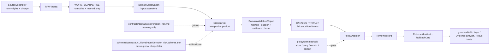

<!-- [KFM_META_BLOCK_V2]
doc_id: kfm://doc/contracts-domains-soil-erosion-risk
title: Erosion Risk Contract — Soil
type: semantic-contract; interpretive-product-profile
version: v0.2
status: draft; PROPOSED; schema-missing; canonical-working-lane; support-type-separation-required; interpretive-product; NEEDS VERIFICATION before promotion
owners:
  - OWNER_TBD — Soil domain steward
  - OWNER_TBD — Contracts steward
  - OWNER_TBD — Schema steward
  - OWNER_TBD — Source steward
  - OWNER_TBD — Evidence steward
  - OWNER_TBD — Policy steward
  - OWNER_TBD — Release steward
  - OWNER_TBD — Docs steward
created: NEEDS VERIFICATION — scaffold existed before v0.2 expansion
updated: 2026-06-23
policy_label: public; contracts; soil; erosion-risk; interpretive-product; source-role-aware; support-type-separation; temporal-scope-aware; evidence-bound; schema-missing; release-gated; rollback-aware; not-authoritative-hazard; not-farm-management-prescription; not-engineering-advice; not-policy-decision; not-release-approval; not-direct-data-access
tags: [kfm, contracts, soil, erosion-risk, ErosionRisk, interpretation, SoilMapUnit, SoilComponent, Horizon, SoilProperty, HydrologicSoilGroup, SoilMoistureObservation, Pedon, SoilProfileView, SuitabilityRating, SoilTimeCaveat, DomainFeatureIdentity, DomainObservation, DomainLayerDescriptor, DomainValidationReport, SourceDescriptor, EvidenceRef, EvidenceBundle, PolicyDecision, ReviewRecord, ReleaseManifest, RollbackCard]
related:
  - ./README.md
  - ./domain_feature_identity.md
  - ./domain_observation.md
  - ./domain_layer_descriptor.md
  - ./domain_validation_report.md
  - ./component_horizon_join.md
  - ./soil_map_unit.md
  - ./soil_component.md
  - ./horizon.md
  - ./soil_property.md
  - ./hydrologic_soil_group.md
  - ./soil_moisture_observation.md
  - ./pedon.md
  - ./soil_profile_view.md
  - ./suitability_rating.md
  - ./soil_time_caveat.md
  - ../../../docs/domains/soil/README.md
  - ../../../docs/domains/soil/CANONICAL_PATHS.md
  - ../../../docs/domains/soil/ARCHITECTURE.md
  - ../../../docs/domains/soil/API_CONTRACTS.md
  - ../../../docs/domains/soil/DATA_LIFECYCLE.md
  - ../../../pipelines/domains/soil/README.md
  - ../../../schemas/contracts/v1/domains/soil/erosion_risk.schema.json
  - ../../../schemas/contracts/v1/domains/soil/README.md
  - ../../../policy/domains/soil/README.md
  - ../../../fixtures/domains/soil/erosion_risk/
  - ../../../tests/domains/soil/
  - ../../../release/candidates/soil/
notes:
  - "Expanded from a PROPOSED scaffold at contracts/domains/soil/erosion_risk.md."
  - "A paired schema at schemas/contracts/v1/domains/soil/erosion_risk.schema.json was not found in this task. Field realization remains PROPOSED."
  - "Soil architecture defines ErosionRisk as an interpretive product, not an authoritative hazard. This contract preserves that boundary."
  - "Support-type separation remains mandatory: static survey, gridded derivative, station observation, satellite grid, pedon/profile evidence, and interpretation cannot be collapsed into one erosion-risk surface."
  - "This contract defines erosion-risk meaning only; it does not implement schema validation, ETL, hazard modeling, source activation, public API behavior, release approval, map rendering, or AI answers."
[/KFM_META_BLOCK_V2] -->

<a id="top"></a>

# Erosion Risk Contract — Soil

> Semantic contract for `ErosionRisk`: the Soil-domain interpretive product that describes evidence-scoped erosion-risk context from soil-side inputs while preserving method, support type, source role, scale, time, uncertainty, policy, release, and rollback boundaries.

<p>
  
  
  
  
  
  
  
</p>

`contracts/domains/soil/erosion_risk.md`

## Quick jumps

[Status](#status) · [Meaning](#meaning) · [Repo fit](#repo-fit) · [Schema posture](#schema-posture) · [Accepted uses](#accepted-uses) · [Exclusions](#exclusions) · [Recommended fields](#recommended-fields) · [Risk model](#risk-model) · [Risk families](#risk-families) · [Source-role and support rules](#source-role-and-support-rules) · [Sensitivity and publication posture](#sensitivity-and-publication-posture) · [Invariants](#invariants) · [Lifecycle](#lifecycle) · [Validation](#validation) · [Rollback](#rollback) · [Evidence basis](#evidence-basis) · [Open questions](#open-questions)

---

## Status

> [!IMPORTANT]
> **Status:** `draft` / semantic contract / interpretive-product profile  
> **Owner:** `OWNER_TBD`  
> **Contract path:** `contracts/domains/soil/erosion_risk.md`  
> **Schema path checked:** `schemas/contracts/v1/domains/soil/erosion_risk.schema.json` — **not found in this task**  
> **Truth posture:** target path, prior scaffold, Soil contract-lane README, Soil architecture, Soil lifecycle inventory, Soil API posture, and sibling Soil contracts are confirmed from current repo evidence. Field-level shape, schema enforcement, validators, fixtures, policy tests, erosion model implementation, source registry records, release manifests, governed API routes, public API behavior, map rendering, graph behavior, and runtime behavior remain **NEEDS VERIFICATION**.

> [!CAUTION]
> `ErosionRisk` is an **interpretive Soil product**, not authoritative hazard truth, engineering advice, crop-management prescription, land-use approval, insurance rating, emergency warning, or AI answer authority.

---

## Meaning

`ErosionRisk` records a governed, evidence-bound interpretation about erosion-related risk or susceptibility derived from Soil-side evidence and declared methods.

It may use or cite:

- `SoilMapUnit`
- `SoilComponent`
- `Horizon`
- `SoilProperty`
- `HydrologicSoilGroup`
- `SoilMoistureObservation`
- `Pedon` / `SoilProfileView`
- `ComponentHorizonJoin`
- `SoilTimeCaveat`
- released `DomainObservation`, `DomainFeatureIdentity`, `DomainLayerDescriptor`, and `DomainValidationReport` records

The object answers:

- What erosion-risk interpretation is being asserted?
- Which soil-side inputs, support types, methods, scale/resolution, and time/vintage controls support it?
- Is the risk value categorical, numeric, rank-like, narrative, candidate, stale, contested, or denied?
- Which EvidenceBundle, PolicyDecision, ReviewRecord, ReleaseManifest, and RollbackCard govern downstream use?
- What does the risk value **not** prove?

`ErosionRisk` is a **derived interpretation**. It may support public map context, Evidence Drawer explanation, Focus Mode caveated answers, or release-candidate review. It must not become a hazard lane replacement, operational prescription, current field condition, crop/yield claim, legal/economic recommendation, or uncited generated conclusion.

---

## Repo fit

| Responsibility | Path | Role |
|---|---|---|
| Contract lane | `contracts/domains/soil/erosion_risk.md` | This semantic erosion-risk contract. |
| Soil contract README | `contracts/domains/soil/README.md` | Defines this folder as meaning-only and lists `ErosionRisk` as an interpretive product that is not authoritative hazard or crop-management prescription. |
| Paired schema | `schemas/contracts/v1/domains/soil/erosion_risk.schema.json` | Not found in this task; do not infer machine shape. |
| Observation companion | `contracts/domains/soil/domain_observation.md` | Erosion risk may cite observations but does not become observation truth. |
| Identity companion | `contracts/domains/soil/domain_feature_identity.md` | Erosion risk subject identity must stay evidence/time/support-type scoped. |
| Layer companion | `contracts/domains/soil/domain_layer_descriptor.md` | Released erosion-risk layers are governed projections, not canonical truth. |
| Validation companion | `contracts/domains/soil/domain_validation_report.md` | Validation may check inputs/methods/support type; validation is not release. |
| Soil architecture | `docs/domains/soil/ARCHITECTURE.md` | Defines ErosionRisk as an in-scope interpretive product, not an authoritative hazard. |
| Soil API posture | `docs/domains/soil/API_CONTRACTS.md` | Defines finite outcomes, support-type separation, required gates, and forbidden public-surface behavior. |
| Soil lifecycle inventory | `docs/domains/soil/DATA_LIFECYCLE.md` | Lists `ErosionRisk` among owned Soil object families and preserves promotion model. |
| Policy | `policy/domains/soil/` | Allow/deny/restrict/abstain, rights, sensitivity, stale-state, source-role, and release gating. |
| Tests / fixtures | `tests/domains/soil/`, `fixtures/domains/soil/erosion_risk/` | Expected proof surfaces; maturity not verified here. |
| Release / rollback | `release/candidates/soil/` and release roots | Publication, correction, and rollback authority. |

---

## Schema posture

A direct paired schema was checked at:

```text
schemas/contracts/v1/domains/soil/erosion_risk.schema.json
```

That file was **not found** in this task.

> [!WARNING]
> Because no paired schema was confirmed, every field below is **PROPOSED** semantic guidance. Do not treat it as machine-enforced until schema, fixtures, validators, policy tests, release checks, governed API behavior, and runtime behavior are verified.

---

## Accepted uses

| Use | Allowed? | Rule |
|---|---:|---|
| Defining a Soil-side erosion-risk interpretation | Yes | Must cite method, inputs, support type, evidence, time/vintage, scale/resolution, and limitations. |
| Supporting a release-candidate erosion-risk layer | Conditional | Requires validation, policy, review, ReleaseManifest, and rollback target. |
| Supporting Evidence Drawer explanation | Conditional | Drawer must show evidence, method caveat, support type, release state, and correction path. |
| Supporting Focus Mode answer | Conditional | AI may explain only released/cited erosion-risk context with finite outcomes. |
| Comparing multiple erosion-risk interpretations | Conditional | Must preserve method/version/input differences and avoid implied ranking authority. |
| Recording a candidate/model-assisted risk | Conditional | Candidate stays review-only until evidence, validation, policy, and release gates pass. |
| Certifying hazard, crop/yield, engineering, land-use, insurance, emergency, or operational truth | No | Use owning lanes or official sources; return ABSTAIN/DENY/ERROR where unsupported. |
| Publishing from RAW/WORK/CATALOG directly | No | Public clients use governed APIs and released artifacts only. |

---

## Exclusions

`ErosionRisk` must not be used as:

| Misuse | Required outcome |
|---|---|
| Authoritative hazard product | Use Hazards owning lane and official evidence where available. |
| Crop-management prescription or yield forecast | Use Agriculture domain controls. |
| Engineering design, conservation practice prescription, legal advice, or operational recommendation | Out of scope; require qualified source/authority and policy review. |
| SourceDescriptor or source registry record | Use source registry roots and SourceDescriptor contracts. |
| ETL implementation or model code | Use pipelines/packages and tests. |
| JSON Schema / machine validation | Use schema roots after ADR/field design. |
| Layer manifest / public projection | Use `domain_layer_descriptor` and release artifacts. |
| Release approval | Use PolicyDecision, ReviewRecord, ReleaseManifest, correction path, and RollbackCard. |
| AI answer authority | Focus Mode remains evidence-subordinate and finite-outcome constrained. |

---

## Recommended fields

The following fields are **PROPOSED** until a paired schema is added and validated.

| Field | Meaning |
|---|---|
| `id` | Canonical ErosionRisk identifier. |
| `version` | Contract/object version. |
| `spec_hash` | Deterministic hash over normalized erosion-risk content. |
| `domain` | Expected value: `soil`. |
| `risk_subject_ref` | Soil feature, map unit, component, horizon/profile, grid cell, service area, layer feature, or aggregate subject ref. |
| `risk_subject_family` | SoilMapUnit, SoilComponent, Horizon, SoilProperty, HydrologicSoilGroup, SoilMoistureObservation, Pedon, SoilProfileView, or layer/aggregate. |
| `support_type` | Expected value includes `interpretation`, with explicit input support types retained. |
| `risk_type` | Sheet, rill, wind, water, slope-related, runoff-related, generalized erosion susceptibility, candidate, stale, denied, or source-specific type. |
| `risk_value` | Categorical, numeric, banded, narrative, Boolean, or source-specific value. |
| `risk_scale` | Qualitative scale, score range, class definitions, or method-defined scale. |
| `method_ref` | Model, interpretation method, rule set, source calculation, or review method reference. |
| `input_refs` | Soil object, observation, property, layer, source, or artifact refs used by the interpretation. |
| `evidence_refs` | EvidenceRefs or EvidenceBundle refs. |
| `source_role_summary` | Source-role posture for inputs and interpretation. |
| `scale_or_resolution` | Survey scale, grid resolution, polygon support, profile locality, or aggregation unit. |
| `temporal_scope` | Source time, observed time, valid time, input vintage, calculation time, release time, correction time. |
| `confidence_or_quality` | Candidate, reviewed, corroborated, stale, contested, denied, unknown, or source-specific quality state. |
| `limitations` | Caveats and prohibited interpretations. |
| `policy_decision_ref` | PolicyDecision governing use/publication. |
| `review_ref` | ReviewRecord or steward review ref. |
| `validation_report_ref` | DomainValidationReport ref supporting this risk object. |
| `layer_descriptor_ref` | DomainLayerDescriptor ref if rendered. |
| `release_manifest_ref` | ReleaseManifest or MapReleaseManifest ref. |
| `rollback_ref` | RollbackCard or rollback target. |

---

## Risk model

A reviewed ErosionRisk object should bind method, inputs, support type, evidence, limitations, validation, policy, release, and rollback.

```text
erosion_risk = {
  domain,
  risk_subject_ref,
  risk_subject_family,
  support_type,
  risk_type,
  risk_value,
  risk_scale,
  method_ref,
  input_refs,
  evidence_refs,
  source_role_summary,
  scale_or_resolution,
  temporal_scope,
  confidence_or_quality,
  limitations,
  validation_report_ref,
  policy_decision_ref,
  review_ref,
  release_manifest_ref,
  rollback_ref
}
```

The exact serialized shape is **NEEDS VERIFICATION** until the schema and validators are field-complete.

---

## Risk families

| Risk family | Meaning | Guardrail |
|---|---|---|
| `sheet_or_rill_context` | Soil-side interpretation of sheet/rill erosion susceptibility or risk context. | Not a field-specific prescription or hazard warning. |
| `wind_context` | Soil-side wind-erosion susceptibility or risk context. | Not a meteorological forecast or operational warning. |
| `water_context` | Soil-side water/runoff-related erosion context. | Hydrology/Hazards own streamflow/flood/hazard truth. |
| `slope_or_landform_context` | Risk interpretation involving slope/landform-like support. | Must cite input source and scale; not engineering advice. |
| `interpretive_rating` | Source/model/review-derived erosion-risk rating. | Method, input vintage, support type, and caveats required. |
| `candidate_risk` | Proposed/model-assisted/OCR/connector-derived risk. | Review-only until evidence, validation, policy, and release gates close. |
| `denied_or_abstained_risk` | Risk value cannot be published under current evidence/policy. | Emit finite outcome and reason, not unsupported value. |

---

## Source-role and support rules

| Rule | Requirement |
|---|---|
| Interpretation is the output support type | `ErosionRisk` must explicitly mark itself as interpretation and retain input support types. |
| Input support types remain visible | Static survey, gridded derivative, station, satellite, pedon/profile, and interpretation inputs cannot collapse. |
| Method is part of meaning | Risk values without method/version/source calculation are not publishable as authoritative. |
| Scale/resolution is part of meaning | False precision and silent resampling are forbidden. |
| Cross-lane relations stay contextual | Agriculture, Hydrology/Hazards, Geology, Habitat/Flora/Fauna retain their own truth authority. |
| Validation is not release | DomainValidationReport can support the interpretation; it cannot publish it. |
| Time axes remain separate | Source time, observed time, valid time, input vintage, calculation time, release time, and correction time must not collapse. |
| Public claims require EvidenceBundle resolution | If evidence cannot resolve, return ABSTAIN, DENY, or ERROR; do not invent the risk. |

---

## Sensitivity and publication posture

| Surface | Default posture | Reason |
|---|---|---|
| Public generalized erosion-risk layer | Public-safe if source, rights, evidence, method, scale, policy, review, and release support it | Soil interpretations can be public-safe when caveated and released. |
| Field/farm/owner-specific erosion risk | Review / restrict / deny by default | Farm-/owner-specific or operational context can create sensitive joins. |
| Operational sensor-derived risk | Review / caveat / restrict by source family | Private or operational sensor exposure may require denial or generalization. |
| Cross-lane hazard-like framing | Review / DENY as hazard authority | Soil does not own authoritative hazard warnings. |
| Candidate/model-generated risk | Review only | Generated or candidate interpretations do not become public truth. |
| Focus Mode summary | Released/cited only | AI must cite EvidenceBundle/release and preserve caveats. |

---

## Invariants

1. **ErosionRisk is interpretation, not observation.** It may use observations, but it is not a raw measurement.
2. **ErosionRisk is not hazard authority.** Hazards owns authoritative hazard/warning surfaces.
3. **Support type cannot collapse.** Input support types and interpretive output support type must remain visible.
4. **Method is mandatory.** A risk value without method/input/scale/time context is not publishable as KFM truth.
5. **Scale is semantic.** Risk classifications must not imply finer spatial precision than evidence supports.
6. **Evidence closure is required.** Consequential public claims require EvidenceRef to resolve to EvidenceBundle.
7. **Validation is bounded.** A passing validation report does not imply policy allow or release approval.
8. **Release is separate.** Public display requires PolicyDecision, ReviewRecord, ReleaseManifest, and RollbackCard where required.
9. **AI is downstream.** Focus Mode may explain released erosion-risk context only with citation closure and caveats.
10. **No direct internal-store reads.** Public clients use governed APIs and released artifacts only.

---

## Lifecycle



---

## Validation

Before this contract is treated as mature, maintainers should verify:

- [ ] paired schema exists or an ADR declares a different erosion-risk shape home;
- [ ] schema includes risk subject, subject family, support type, risk type/value/scale, method ref, input refs, evidence refs, source-role summary, scale/resolution, time axes, validation/policy/review/release/rollback refs, and limitations;
- [ ] fixtures cover public generalized risk, field/farm-specific risk denial, candidate/model risk, stale input risk, unsupported method, support-type collapse, cross-lane hazard overclaim, and release-ready risk;
- [ ] validators check method presence, input closure, EvidenceBundle resolution, support-type separation, scale/resolution caveats, stale-state, and release preflight;
- [ ] tests prevent ErosionRisk from becoming hazard authority, crop-management prescription, field-condition truth, engineering advice, release approval, or AI authority;
- [ ] tests enforce ABSTAIN/DENY/ERROR/HOLD when evidence, source role, support type, method, scale, policy, release, or runtime evaluation is unresolved;
- [ ] public map, Evidence Drawer, Focus Mode, exports, and AI summaries use only released/governed erosion-risk projections;
- [ ] rollback invalidates linked observations, identities, layer descriptors, drawer payloads, exports, caches, graph projections, and AI summaries that cited a withdrawn erosion-risk interpretation.

---

## Rollback

Rollback is required if this contract:

- claims schema, validator, fixture, test, policy, release, API, erosion model, ETL, map, graph, or runtime behavior exists without proof;
- treats ErosionRisk as hazard truth, crop/yield truth, field management prescription, engineering advice, source truth, release approval, public API proof, or AI authority;
- weakens support-type separation or lets interpretation masquerade as observation;
- hides method, input refs, scale/resolution caveats, source-role conflict, source vintage, candidate status, stale state, supersession, or correction lineage;
- exposes farm-specific, owner-specific, operational, or private sensor detail without policy/release support;
- normalizes direct UI access to internal lifecycle stores or direct model output.

Rollback target: revert `contracts/domains/soil/erosion_risk.md` to prior scaffold blob `bb10fe4cc42f5b3584594ae529c2a1db65082a2c`, record drift if authority boundaries were affected, and invalidate downstream derivatives that relied on weakened ErosionRisk semantics.

---

## Evidence basis

| Evidence | Status | Supports | Limits |
|---|---|---|---|
| Prior `contracts/domains/soil/erosion_risk.md` | `CONFIRMED` | Target file existed as a planned-path scaffold sourced from Soil continuity/lifecycle docs. | Scaffold did not define authoritative semantic contract content. |
| Paired schema lookup | `CONFIRMED not found in this task` | Justifies schema-missing posture. | Does not rule out alternate schema names or future ADR-selected homes. |
| `contracts/domains/soil/README.md` | `CONFIRMED contract-lane rule` | Defines `ErosionRisk` as interpretive product meaning and not authoritative hazard or crop-management prescription; requires interpretation caveats and support-type separation. | Does not prove object schema, validator, or release maturity. |
| `docs/domains/soil/ARCHITECTURE.md` | `CONFIRMED doctrine / PROPOSED field realization` | Defines ErosionRisk as in-scope Soil interpretation and says Soil does not own crop/yield, hydrology/hazard, geology, or habitat truth. | Does not prove implementation. |
| `docs/domains/soil/API_CONTRACTS.md` | `CONFIRMED doctrine / PROPOSED implementation` | Defines finite outcomes, forbidden public-surface behavior, support-type separation, sensitivity posture, validator families, and EvidenceBundle/release gates. | Route names, validator code, and runtime behavior remain UNKNOWN / NEEDS VERIFICATION. |
| `docs/domains/soil/DATA_LIFECYCLE.md` | `CONFIRMED navigational register / PROPOSED implementation` | Lists ErosionRisk among owned Soil object families and records sensitivity/promotion posture. | It is a navigational register, not implementation proof. |
| `contracts/domains/soil/domain_observation.md` | `CONFIRMED sibling contract` | Defines observations as source-scoped evidence-bearing claims that may support interpretations but are not source truth or release approval. | Its schema is a stub. |
| `contracts/domains/soil/domain_layer_descriptor.md` | `CONFIRMED sibling contract` | Defines layers as governed projections, not source or object truth. | Its schema is a stub. |
| `contracts/domains/soil/domain_validation_report.md` | `CONFIRMED sibling contract` | Defines validation as check evidence, not policy or release authority. | Its schema is a stub. |
| Uploaded KFM authoring prompt v2 | `CONFIRMED user-supplied guidance` | Requires evidence-first, implementation-honest, visually polished Markdown with visible verification and rollback posture. | Authoring guidance, not implementation proof. |

---

## Open questions

| ID | Question | Status |
|---|---|---|
| OQ-SOIL-ER-01 | Should `ErosionRisk` have its own schema, or inherit from a broader `interpretive_product` schema? | OPEN / DOMAIN + SCHEMA REVIEW |
| OQ-SOIL-ER-02 | Which risk type enum is canonical: sheet, rill, wind, water, slope, runoff, generalized, or source-specific? | OPEN / DOMAIN REVIEW |
| OQ-SOIL-ER-03 | Which methods, source families, units, scale/resolution fields, and confidence labels are mandatory? | OPEN / VALIDATION REVIEW |
| OQ-SOIL-ER-04 | Which erosion-risk values are public-safe by default, and which become restricted when joined to farm, owner, operational sensor, or parcel context? | OPEN / POLICY REVIEW |
| OQ-SOIL-ER-05 | How should Evidence Drawer and Focus Mode present erosion-risk context without turning it into hazard authority or field-management advice? | OPEN / MAP/UI REVIEW |
| OQ-SOIL-ER-06 | How should rollback invalidate layers, drawer payloads, Focus Mode claims, exports, caches, graph projections, and AI summaries after an erosion-risk correction? | OPEN / RELEASE REVIEW |

<p align="right"><a href="#top">Back to top</a></p>
