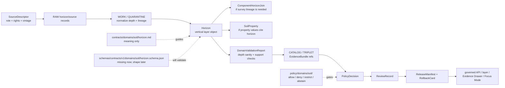

<!-- [KFM_META_BLOCK_V2]
doc_id: kfm://doc/contracts-domains-soil-horizon
title: Horizon Contract — Soil
type: semantic-contract
version: v0.2
status: draft; PROPOSED; schema-missing; canonical-working-lane; support-type-separation-required; vertical-layer-contract; NEEDS VERIFICATION before promotion
owners:
  - OWNER_TBD — Soil domain steward
  - OWNER_TBD — Contracts steward
  - OWNER_TBD — Schema steward
  - OWNER_TBD — Source steward
  - OWNER_TBD — Evidence steward
  - OWNER_TBD — Policy steward
  - OWNER_TBD — Release steward
  - OWNER_TBD — Docs steward
created: NEEDS VERIFICATION — scaffold existed before v0.2 expansion
updated: 2026-06-23
policy_label: public; contracts; soil; horizon; vertical-layer; source-role-aware; support-type-separation; depth-aware; temporal-scope-aware; evidence-bound; schema-missing; release-gated; rollback-aware; not-standalone-polygon-layer; not-map-unit-truth; not-property-truth; not-etl-code; not-release-approval; not-direct-data-access
tags: [kfm, contracts, soil, horizon, Horizon, SoilMapUnit, SoilComponent, ComponentHorizonJoin, SoilProperty, Pedon, SoilProfileView, SoilTimeCaveat, authoritative_static_soil, pedon_evidence, SourceDescriptor, EvidenceRef, EvidenceBundle, DomainFeatureIdentity, DomainObservation, DomainLayerDescriptor, DomainValidationReport, PolicyDecision, ReviewRecord, ReleaseManifest, RollbackCard]
related:
  - ./README.md
  - ./domain_feature_identity.md
  - ./domain_observation.md
  - ./domain_layer_descriptor.md
  - ./domain_validation_report.md
  - ./component_horizon_join.md
  - ./soil_map_unit.md
  - ./soil_component.md
  - ./soil_property.md
  - ./hydrologic_soil_group.md
  - ./soil_moisture_observation.md
  - ./pedon.md
  - ./soil_profile_view.md
  - ./erosion_risk.md
  - ./suitability_rating.md
  - ./soil_time_caveat.md
  - ../../../docs/domains/soil/README.md
  - ../../../docs/domains/soil/CANONICAL_PATHS.md
  - ../../../docs/domains/soil/ARCHITECTURE.md
  - ../../../docs/domains/soil/API_CONTRACTS.md
  - ../../../docs/domains/soil/DATA_LIFECYCLE.md
  - ../../../pipelines/domains/soil/README.md
  - ../../../schemas/contracts/v1/domains/soil/horizon.schema.json
  - ../../../schemas/contracts/v1/domains/soil/README.md
  - ../../../policy/domains/soil/README.md
  - ../../../fixtures/domains/soil/horizon/
  - ../../../tests/domains/soil/
  - ../../../release/candidates/soil/
notes:
  - "Expanded from a PROPOSED scaffold at contracts/domains/soil/horizon.md."
  - "A paired schema at schemas/contracts/v1/domains/soil/horizon.schema.json was not found in this task. Field realization remains PROPOSED."
  - "Soil architecture defines Horizon as a confirmed term for a vertical layer with depths and properties, with field shape still PROPOSED."
  - "The Soil contract README states Horizon defines vertical layer meaning and depth/property context, and is not a stand-alone polygon layer."
  - "Support-type separation remains mandatory: a survey horizon, pedon/profile horizon, gridded derivative, station observation, satellite grid, and interpretation must not collapse."
  - "This contract defines horizon meaning only; it does not implement schema validation, ETL, source activation, public API behavior, release approval, map rendering, or AI answers."
[/KFM_META_BLOCK_V2] -->

<a id="top"></a>

# Horizon Contract — Soil

> Semantic contract for `Horizon`: the Soil-domain vertical-layer object that represents a source-scoped soil layer with depth, profile/component context, properties, evidence, time/vintage, support type, validation state, release posture, and rollback lineage.

<p>
  
  
  
  
  
  
  
</p>

`contracts/domains/soil/horizon.md`

## Quick jumps

[Status](#status) · [Meaning](#meaning) · [Repo fit](#repo-fit) · [Schema posture](#schema-posture) · [Accepted uses](#accepted-uses) · [Exclusions](#exclusions) · [Recommended fields](#recommended-fields) · [Horizon model](#horizon-model) · [Horizon families](#horizon-families) · [Source-role and support rules](#source-role-and-support-rules) · [Sensitivity and publication posture](#sensitivity-and-publication-posture) · [Invariants](#invariants) · [Lifecycle](#lifecycle) · [Validation](#validation) · [Rollback](#rollback) · [Evidence basis](#evidence-basis) · [Open questions](#open-questions)

---

## Status

> [!IMPORTANT]
> **Status:** `draft` / semantic contract  
> **Owner:** `OWNER_TBD`  
> **Contract path:** `contracts/domains/soil/horizon.md`  
> **Schema path checked:** `schemas/contracts/v1/domains/soil/horizon.schema.json` — **not found in this task**  
> **Truth posture:** target path, prior scaffold, Soil contract-lane README, Soil architecture, Soil lifecycle inventory, Soil API posture, and sibling Soil contracts are confirmed from current repo evidence. Field-level shape, schema enforcement, validators, fixtures, policy tests, ETL behavior, source registry records, release manifests, governed API routes, public API behavior, map rendering, graph behavior, and runtime behavior remain **NEEDS VERIFICATION**.

> [!CAUTION]
> `Horizon` is a vertical soil layer with source/depth/profile context. It is **not** a stand-alone polygon layer, map-unit truth, property truth, gridded surface, current field condition, release approval, or AI authority.

---

## Meaning

`Horizon` records a source-scoped vertical layer within a soil component, pedon, or profile-supported soil description.

It may carry or support:

- top and bottom depth context;
- horizon designation/name where source-supported;
- source-native identifiers, such as horizon-level keys when available;
- source role, source vintage, retrieval time, valid time, and correction state;
- links to `SoilComponent`, `ComponentHorizonJoin`, `SoilProperty`, `Pedon`, `SoilProfileView`, and `SoilTimeCaveat` records;
- EvidenceBundle, validation, policy, review, release, and rollback refs.

The object answers:

- Which vertical layer is being described?
- Which component, map unit, pedon, or profile context supports it?
- What depth interval and source/method context controls interpretation?
- Which properties or interpretations may cite the horizon without absorbing it?
- What public display, if any, is allowed after validation, policy, review, release, and rollback closure?

A horizon is a **vertical-layer object**. It can support horizon-level properties, profile views, component-horizon joins, and public caveated explanations, but it cannot by itself certify the full soil map unit, become a polygon layer, publish soil properties, or substitute for source evidence.

---

## Repo fit

| Responsibility | Path | Role |
|---|---|---|
| Contract lane | `contracts/domains/soil/horizon.md` | This semantic Horizon contract. |
| Soil contract README | `contracts/domains/soil/README.md` | Defines Horizon as vertical layer meaning and explicitly not a stand-alone polygon layer. |
| Paired schema | `schemas/contracts/v1/domains/soil/horizon.schema.json` | Not found in this task; do not infer machine shape. |
| Identity companion | `contracts/domains/soil/domain_feature_identity.md` | Horizon identity should resolve through source role, object role, time scope, and digest posture. |
| Observation companion | `contracts/domains/soil/domain_observation.md` | Observations may assert horizon data; they do not become horizon truth by themselves. |
| Join companion | `contracts/domains/soil/component_horizon_join.md` | Defines map-unit/component/horizon lineage relation semantics. |
| Property companion | `contracts/domains/soil/soil_property.md` | Horizon properties need their own method/unit/depth semantics. |
| Layer companion | `contracts/domains/soil/domain_layer_descriptor.md` | Any horizon/profile layer is a governed projection, not horizon truth. |
| Validation companion | `contracts/domains/soil/domain_validation_report.md` | Validation may check depth sanity and lineage but is not release approval. |
| Soil architecture | `docs/domains/soil/ARCHITECTURE.md` | Defines Horizon as a confirmed term and object family with proposed field realization. |
| Soil API posture | `docs/domains/soil/API_CONTRACTS.md` | Defines finite outcomes and validator-family expectations such as horizon-depth sanity. |
| Soil lifecycle inventory | `docs/domains/soil/DATA_LIFECYCLE.md` | Lists Horizon among owned Soil object families and preserves promotion model. |
| Policy | `policy/domains/soil/` | Allow/deny/restrict/abstain, rights, sensitivity, stale-state, source-role, and release gating. |
| Tests / fixtures | `tests/domains/soil/`, `fixtures/domains/soil/horizon/` | Expected proof surfaces; maturity not verified here. |
| Release / rollback | `release/candidates/soil/` and release roots | Publication, correction, and rollback authority. |

---

## Schema posture

A direct paired schema was checked at:

```text
schemas/contracts/v1/domains/soil/horizon.schema.json
```

That file was **not found** in this task.

> [!WARNING]
> Because no paired schema was confirmed, every field below is **PROPOSED** semantic guidance. Do not treat it as machine-enforced until schema, fixtures, validators, policy tests, release checks, governed API behavior, and runtime behavior are verified.

---

## Accepted uses

| Use | Allowed? | Rule |
|---|---:|---|
| Defining horizon/vertical-layer semantics | Yes | Must preserve source, support type, depth interval, source-native ID, component/profile context, evidence, and time scope. |
| Supporting component-horizon lineage | Conditional | Must use or cite `ComponentHorizonJoin`; lineage must remain inspectable. |
| Supporting horizon-level soil properties | Conditional | Property values need separate method, unit, depth/profile, evidence, and validation posture. |
| Supporting pedon/profile views | Conditional | Profile evidence remains local/profile-scoped and caveated. |
| Supporting a released layer or Evidence Drawer view | Conditional | Requires validation, EvidenceBundle, policy, review, ReleaseManifest, and rollback target. |
| Supporting Focus Mode explanation | Conditional | AI may explain released horizon context only with citation closure and finite outcomes. |
| Publishing a horizon as a standalone polygon or map-unit truth | No | Use owning objects/layers and governed release surfaces. |
| Collapsing static survey, pedon/profile, gridded, station, satellite, or interpretation support | No | Support-type separation is mandatory. |

---

## Exclusions

`Horizon` must not be used as:

| Misuse | Required outcome |
|---|---|
| Stand-alone polygon layer | Use `SoilMapUnit` / `DomainLayerDescriptor` with release support. |
| Whole map-unit truth | Use `SoilMapUnit` and source/evidence closure. |
| Whole component truth | Use `SoilComponent` and source/evidence closure. |
| SoilProperty truth by itself | Use `SoilProperty` with method/unit/depth semantics. |
| ETL implementation or relational join | Use pipelines and `ComponentHorizonJoin`. |
| JSON Schema / machine validation | Use schema roots after schema creation. |
| SourceDescriptor or source registry record | Use source registry roots and SourceDescriptor contracts. |
| Release approval | Use PolicyDecision, ReviewRecord, ReleaseManifest, correction path, and RollbackCard. |
| AI answer authority | Focus Mode remains evidence-subordinate and finite-outcome constrained. |

---

## Recommended fields

The following fields are **PROPOSED** until a paired schema is added and validated.

| Field | Meaning |
|---|---|
| `id` | Canonical Horizon identifier. |
| `version` | Contract/object version. |
| `spec_hash` | Deterministic hash over normalized horizon content. |
| `domain` | Expected value: `soil`. |
| `support_type` | Static survey, pedon/profile, gridded derivative, or schema-selected equivalent; must not be omitted. |
| `source_ref` | SourceDescriptor/source registry ref. |
| `source_role` | Source role for this horizon use. |
| `source_native_id` | Horizon source-native key or ID, if available. |
| `source_native_key_family` | CHKEY, horizon ID, pedon/profile horizon key, source-specific key, etc. |
| `map_unit_ref` | Optional SoilMapUnit ref when horizon is attached to survey lineage. |
| `component_ref` | Optional SoilComponent ref. |
| `component_horizon_join_ref` | Optional ComponentHorizonJoin ref. |
| `pedon_ref` | Optional Pedon/Profile ref. |
| `horizon_designation` | Source-supported horizon designation/name/label. |
| `top_depth` | Horizon top depth; unit required. |
| `bottom_depth` | Horizon bottom depth; unit required. |
| `depth_unit` | Depth unit such as cm or source-specific unit. |
| `depth_datum` | Source-defined vertical reference or profile context where available. |
| `property_refs` | Linked SoilProperty refs. |
| `observed_time` | Observation/profile time where applicable. |
| `source_time` | Source creation/publication/update time. |
| `valid_time` | Interval the horizon description applies to, if known. |
| `retrieval_time` | KFM retrieval/freeze time. |
| `release_time` | KFM release time, if released. |
| `correction_time` | Correction/supersession time, if corrected. |
| `evidence_refs` | EvidenceRefs or EvidenceBundle refs. |
| `validation_report_ref` | DomainValidationReport ref, especially for depth sanity and lineage checks. |
| `policy_decision_ref` | PolicyDecision governing use/publication. |
| `review_ref` | ReviewRecord or steward review ref. |
| `release_manifest_ref` | ReleaseManifest or MapReleaseManifest ref. |
| `rollback_ref` | RollbackCard or rollback target. |
| `limitations` | Caveats: horizon only; not map-unit truth, not property truth, not polygon layer, not release approval. |

---

## Horizon model

A reviewed Horizon object should bind source identity, depth interval, support type, lineage/profile context, evidence, validation, policy, release, and rollback.

```text
horizon = {
  domain,
  support_type,
  source_ref,
  source_role,
  source_native_id,
  source_native_key_family,
  map_unit_ref,
  component_ref,
  component_horizon_join_ref,
  pedon_ref,
  horizon_designation,
  top_depth,
  bottom_depth,
  depth_unit,
  depth_datum,
  property_refs,
  temporal_scope,
  evidence_refs,
  validation_report_ref,
  policy_decision_ref,
  review_ref,
  release_manifest_ref,
  rollback_ref
}
```

The exact serialized shape is **NEEDS VERIFICATION** until the schema and validators are field-complete.

---

## Horizon families

| Horizon family | Meaning | Guardrail |
|---|---|---|
| `survey_horizon` | Horizon attached to static survey component/map-unit lineage. | Not a stand-alone polygon; lineage must cite component/join support. |
| `pedon_profile_horizon` | Horizon in a pedon/profile evidence object. | Profile locality must remain visible; not map-unit truth by itself. |
| `derived_horizon_projection` | Horizon-like projection or generalized display derived from source records. | Must cite method and not masquerade as source horizon. |
| `property_support_horizon` | Horizon used as depth context for a SoilProperty. | Property semantics live in `SoilProperty`. |
| `candidate_horizon` | Provisional/model/OCR/connector-derived horizon candidate. | Review only until validated and released. |
| `denied_or_abstained_horizon` | Horizon cannot be used under current evidence/policy. | Emit finite outcome and reason, not unsupported value. |

---

## Source-role and support rules

| Rule | Requirement |
|---|---|
| Depth interval is mandatory | Horizon needs top depth, bottom depth, unit, and profile/source context where material. |
| Depth sanity must validate | Top depth must be less than bottom depth; overlaps/gaps require explicit validation/reporting. |
| Support type is mandatory | Static survey, pedon/profile, gridded derivative, station, satellite, and interpretation must not collapse. |
| Source role is per use | A source may be authoritative for a survey horizon and contextual for another use. |
| Source-native IDs are lineage, not truth alone | CHKEY/source horizon IDs support lineage but do not replace EvidenceBundle. |
| Properties remain separate | A horizon can carry or link properties, but property values need their own method/unit/depth evidence. |
| Time axes remain separate | Source time, observed time, valid time, retrieval time, release time, and correction time must not collapse. |
| Public claims require EvidenceBundle resolution | If evidence cannot resolve, return ABSTAIN, DENY, or ERROR; do not invent the horizon. |

---

## Sensitivity and publication posture

| Surface | Default posture | Reason |
|---|---|---|
| Public static survey horizon | Public-safe if source, rights, evidence, validation, and release support it | Survey horizon context is often public, but still governed. |
| Pedon/profile horizon | Public-safe or review depending on locality/joins | Profile-level evidence can be misread as broad truth. |
| Horizon property view | Caveated and method-visible | Property units/depth/method must remain visible. |
| Farm-specific, owner-specific, operational, or private sensor horizon-like data | Review / restrict / deny by default | Soil doctrine requires review for such joins. |
| Candidate/model/OCR horizon | Review only | Candidate horizons do not become public truth. |
| Focus Mode explanation | Released/cited only | AI must cite EvidenceBundle/release and preserve caveats. |

---

## Invariants

1. **Horizon is vertical-layer meaning.** It is not a polygon, map unit, component, or property by itself.
2. **Depth is semantic.** Top/bottom depths, unit, and profile/source context are core identity and validation inputs.
3. **Support type cannot collapse.** Survey, pedon/profile, derivative, station, satellite, and interpretation contexts remain distinct.
4. **Lineage must be inspectable.** Survey horizons should be traceable through component/map-unit or ComponentHorizonJoin support where used.
5. **Property values remain separate.** Horizon provides depth/profile context; SoilProperty owns value/method/unit semantics.
6. **Validation is bounded.** Horizon-depth sanity and lineage checks support trust; they do not publish or approve release.
7. **Evidence closure is required.** Consequential public claims require EvidenceRef to resolve to EvidenceBundle.
8. **Release is separate.** Public display requires PolicyDecision, ReviewRecord, ReleaseManifest, and RollbackCard where required.
9. **AI is downstream.** Focus Mode may explain released horizon context only with citation closure and caveats.
10. **No direct internal-store reads.** Public clients use governed APIs and released artifacts only.

---

## Lifecycle



---

## Validation

Before this contract is treated as mature, maintainers should verify:

- [ ] paired schema exists or an ADR declares a different horizon shape home;
- [ ] schema includes source refs, source role, support type, native key family, component/map-unit/pedon refs, top depth, bottom depth, unit, depth datum, property refs, time axes, evidence refs, validation/policy/review/release/rollback refs, and limitations;
- [ ] fixtures cover survey horizon, pedon/profile horizon, missing depth, invalid depth order, overlapping horizons, gap posture, missing component lineage, missing EvidenceBundle, candidate horizon, stale horizon, denied horizon, and released horizon;
- [ ] validators check top_depth < bottom_depth, unit presence, depth/profile scope, lineage closure, support-type separation, EvidenceBundle resolution, and release preflight;
- [ ] tests prevent Horizon from becoming map-unit truth, component truth, property truth, polygon layer truth, release approval, or AI authority;
- [ ] tests enforce ABSTAIN/DENY/ERROR/HOLD when evidence, source role, support type, depth context, lineage, policy, release, or runtime evaluation is unresolved;
- [ ] public map, Evidence Drawer, Focus Mode, exports, and AI summaries use only released/governed horizon projections;
- [ ] rollback invalidates linked properties, component-horizon joins, observations, identities, layer descriptors, drawer payloads, exports, caches, graph projections, and AI summaries that cited a withdrawn horizon.

---

## Rollback

Rollback is required if this contract:

- claims schema, validator, fixture, test, policy, release, API, ETL, horizon model, map, graph, or runtime behavior exists without proof;
- treats Horizon as map-unit truth, component truth, property truth, stand-alone polygon layer, source truth, release approval, public API proof, or AI authority;
- weakens support-type separation;
- hides depth interval, unit, source-role conflict, source vintage, lineage gaps, candidate status, stale state, supersession, or correction lineage;
- exposes farm-specific, owner-specific, operational, or private sensor/profile detail without policy/release support;
- normalizes direct UI access to internal lifecycle stores or direct model output.

Rollback target: revert `contracts/domains/soil/horizon.md` to prior scaffold blob `ea6177c6f622d85ee51a160b5bb2fb399077f2ed`, record drift if authority boundaries were affected, and invalidate downstream derivatives that relied on weakened Horizon semantics.

---

## Evidence basis

| Evidence | Status | Supports | Limits |
|---|---|---|---|
| Prior `contracts/domains/soil/horizon.md` | `CONFIRMED` | Target file existed as a planned-path scaffold sourced from Soil continuity/lifecycle docs. | Scaffold did not define authoritative semantic contract content. |
| Paired schema lookup | `CONFIRMED not found in this task` | Justifies schema-missing posture. | Does not rule out alternate schema names or future ADR-selected homes. |
| `contracts/domains/soil/README.md` | `CONFIRMED contract-lane rule` | Defines Horizon as vertical layer meaning and depth/property context; says it is not a stand-alone polygon layer; requires support-type separation and caveats. | Does not prove object schema, validator, or release maturity. |
| `docs/domains/soil/ARCHITECTURE.md` | `CONFIRMED doctrine / PROPOSED field realization` | Defines Horizon as confirmed term, vertical layer with depths/properties, owned object family, and all-six-time-facet temporal handling. | Does not prove implementation. |
| `docs/domains/soil/API_CONTRACTS.md` | `CONFIRMED doctrine / PROPOSED implementation` | Defines finite outcomes, support-type separation, forbidden public-surface behavior, horizon-depth sanity validator family, and EvidenceBundle/release gates. | Route names, validator code, and runtime behavior remain UNKNOWN / NEEDS VERIFICATION. |
| `docs/domains/soil/DATA_LIFECYCLE.md` | `CONFIRMED navigational register / PROPOSED implementation` | Lists Horizon among owned Soil object families and records Soil promotion model. | It is a navigational register, not implementation proof. |
| `contracts/domains/soil/component_horizon_join.md` | `CONFIRMED sibling contract` | Defines map-unit/component/horizon lineage relation semantics and separates join meaning from ETL. | Its paired schema is missing. |
| `contracts/domains/soil/domain_observation.md` | `CONFIRMED sibling contract` | Defines observations as source-scoped evidence-bearing claims that may support horizons. | Its schema is a stub. |
| `contracts/domains/soil/domain_validation_report.md` | `CONFIRMED sibling contract` | Defines validation as check evidence, not policy or release authority. | Its schema is a stub. |
| Uploaded KFM authoring prompt v2 | `CONFIRMED user-supplied guidance` | Requires evidence-first, implementation-honest, visually polished Markdown with visible verification and rollback posture. | Authoring guidance, not implementation proof. |

---

## Open questions

| ID | Question | Status |
|---|---|---|
| OQ-SOIL-HOR-01 | Should `Horizon` have its own schema, or inherit from a profile/depth-layer schema shared with pedon/profile records? | OPEN / DOMAIN + SCHEMA REVIEW |
| OQ-SOIL-HOR-02 | Which source-native key families are canonical for survey horizons, pedon horizons, and profile horizons? | OPEN / SOURCE + SCHEMA REVIEW |
| OQ-SOIL-HOR-03 | Which depth units, depth datum fields, gap/overlap rules, and horizon designation fields are mandatory? | OPEN / VALIDATION REVIEW |
| OQ-SOIL-HOR-04 | How should horizon properties cite horizons without collapsing property truth into horizon identity? | OPEN / CONTRACT REVIEW |
| OQ-SOIL-HOR-05 | How should Evidence Drawer and Focus Mode show horizon depth/profile context without implying continuous surface or map-unit truth? | OPEN / MAP/UI REVIEW |
| OQ-SOIL-HOR-06 | How should rollback invalidate properties, joins, layers, drawer payloads, Focus Mode claims, exports, caches, graph projections, and AI summaries after a horizon correction? | OPEN / RELEASE REVIEW |

<p align="right"><a href="#top">Back to top</a></p>
