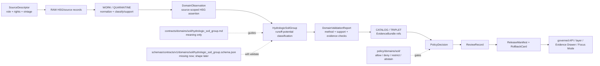

<!-- [KFM_META_BLOCK_V2]
doc_id: kfm://doc/contracts-domains-soil-hydrologic-soil-group
title: Hydrologic Soil Group Contract — Soil
type: semantic-contract; classification-profile
version: v0.2
status: draft; PROPOSED; schema-missing; canonical-working-lane; support-type-separation-required; runoff-potential-classification; NEEDS VERIFICATION before promotion
owners:
  - OWNER_TBD — Soil domain steward
  - OWNER_TBD — Contracts steward
  - OWNER_TBD — Schema steward
  - OWNER_TBD — Source steward
  - OWNER_TBD — Evidence steward
  - OWNER_TBD — Policy steward
  - OWNER_TBD — Release steward
  - OWNER_TBD — Docs steward
created: NEEDS VERIFICATION — scaffold existed before v0.2 expansion
updated: 2026-06-23
policy_label: public; contracts; soil; hydrologic-soil-group; runoff-potential-classification; source-role-aware; support-type-separation; temporal-scope-aware; evidence-bound; schema-missing; release-gated; rollback-aware; not-flood-observation; not-flood-forecast; not-hydrology-truth; not-engineering-design; not-policy-decision; not-release-approval; not-direct-data-access
tags: [kfm, contracts, soil, hydrologic-soil-group, HydrologicSoilGroup, HSG, runoff-potential, classification, interpretation, SoilMapUnit, SoilComponent, Horizon, SoilProperty, ComponentHorizonJoin, SoilMoistureObservation, ErosionRisk, SuitabilityRating, SoilTimeCaveat, authoritative_static_soil, gridded_derivative_soil, DomainFeatureIdentity, DomainObservation, DomainLayerDescriptor, DomainValidationReport, SourceDescriptor, EvidenceRef, EvidenceBundle, PolicyDecision, ReviewRecord, ReleaseManifest, RollbackCard]
related:
  - ./README.md
  - ./domain_feature_identity.md
  - ./domain_observation.md
  - ./domain_layer_descriptor.md
  - ./domain_validation_report.md
  - ./component_horizon_join.md
  - ./soil_map_unit.md
  - ./soil_component.md
  - ./horizon.md
  - ./soil_property.md
  - ./soil_moisture_observation.md
  - ./pedon.md
  - ./soil_profile_view.md
  - ./erosion_risk.md
  - ./suitability_rating.md
  - ./soil_time_caveat.md
  - ../../../docs/domains/soil/README.md
  - ../../../docs/domains/soil/CANONICAL_PATHS.md
  - ../../../docs/domains/soil/ARCHITECTURE.md
  - ../../../docs/domains/soil/API_CONTRACTS.md
  - ../../../docs/domains/soil/DATA_LIFECYCLE.md
  - ../../../pipelines/domains/soil/README.md
  - ../../../schemas/contracts/v1/domains/soil/hydrologic_soil_group.schema.json
  - ../../../schemas/contracts/v1/domains/soil/README.md
  - ../../../policy/domains/soil/README.md
  - ../../../fixtures/domains/soil/hydrologic_soil_group/
  - ../../../tests/domains/soil/
  - ../../../release/candidates/soil/
notes:
  - "Expanded from a PROPOSED scaffold at contracts/domains/soil/hydrologic_soil_group.md."
  - "A paired schema at schemas/contracts/v1/domains/soil/hydrologic_soil_group.schema.json was not found in this task. Field realization remains PROPOSED."
  - "Soil architecture defines Hydrologic Soil Group as a confirmed term for A/B/C/D runoff-potential classification, with field shape still PROPOSED."
  - "The Soil contract README states Hydrologic Soil Group defines runoff-potential classification meaning and is not a flood observation, forecast, or hydrology truth."
  - "Support-type separation remains mandatory: static survey, gridded derivative, station observation, satellite grid, pedon/profile evidence, and interpretation cannot be collapsed by HSG use."
  - "This contract defines HSG meaning only; it does not implement schema validation, ETL, hydrology modeling, hazard forecasting, source activation, public API behavior, release approval, map rendering, or AI answers."
[/KFM_META_BLOCK_V2] -->

<a id="top"></a>

# Hydrologic Soil Group Contract — Soil

> Semantic contract for `HydrologicSoilGroup`: the Soil-domain runoff-potential classification object that carries source-scoped HSG meaning, evidence, support type, time/vintage, validation posture, release state, and rollback lineage — without becoming flood observation, flood forecast, hydrology truth, engineering design, policy approval, released-layer authority, or AI answer authority.

<p>
  
  
  
  
  
  
  
</p>

`contracts/domains/soil/hydrologic_soil_group.md`

## Quick jumps

[Status](#status) · [Meaning](#meaning) · [Repo fit](#repo-fit) · [Schema posture](#schema-posture) · [Accepted uses](#accepted-uses) · [Exclusions](#exclusions) · [Recommended fields](#recommended-fields) · [Classification model](#classification-model) · [Classification families](#classification-families) · [Source-role and support rules](#source-role-and-support-rules) · [Sensitivity and publication posture](#sensitivity-and-publication-posture) · [Invariants](#invariants) · [Lifecycle](#lifecycle) · [Validation](#validation) · [Rollback](#rollback) · [Evidence basis](#evidence-basis) · [Open questions](#open-questions)

---

## Status

> [!IMPORTANT]
> **Status:** `draft` / semantic contract / classification profile  
> **Owner:** `OWNER_TBD`  
> **Contract path:** `contracts/domains/soil/hydrologic_soil_group.md`  
> **Schema path checked:** `schemas/contracts/v1/domains/soil/hydrologic_soil_group.schema.json` — **not found in this task**  
> **Truth posture:** target path, prior scaffold, Soil contract-lane README, Soil architecture, Soil lifecycle inventory, Soil API posture, and sibling Soil contracts are confirmed from current repo evidence. Field-level shape, schema enforcement, validators, fixtures, policy tests, HSG derivation implementation, source registry records, release manifests, governed API routes, public API behavior, map rendering, graph behavior, and runtime behavior remain **NEEDS VERIFICATION**.

> [!CAUTION]
> `HydrologicSoilGroup` is a Soil-side runoff-potential classification. It is **not** flood observation, flood forecast, watershed model output, hydrology truth, engineering design, emergency warning, current runoff condition, release approval, or AI authority.

---

## Meaning

`HydrologicSoilGroup` records a source-scoped classification describing runoff potential or hydrologic behavior as carried by Soil-side evidence and declared methods.

It may use or cite:

- `SoilMapUnit`
- `SoilComponent`
- `Horizon`
- `SoilProperty`
- `ComponentHorizonJoin`
- `SoilMoistureObservation`
- `SoilTimeCaveat`
- released `DomainObservation`, `DomainFeatureIdentity`, `DomainLayerDescriptor`, and `DomainValidationReport` records

The object answers:

- Which HSG class or class-like value is being asserted?
- Which source and support type provide the classification?
- Is the value map-unit-level, component-level, property-derived, generalized, stale, candidate, contested, or denied?
- Which time/vintage, scale/resolution, method, and caveats control public interpretation?
- Which EvidenceBundle, PolicyDecision, ReviewRecord, ReleaseManifest, and RollbackCard govern downstream use?
- What does the HSG value **not** prove?

A Hydrologic Soil Group object is a **Soil classification**. It may support public map context, runoff-potential explanations, Evidence Drawer entries, Focus Mode caveated answers, or release-candidate review. It must not become hydrology/hazards truth, a flood forecast, current runoff observation, engineering recommendation, or uncited generated conclusion.

---

## Repo fit

| Responsibility | Path | Role |
|---|---|---|
| Contract lane | `contracts/domains/soil/hydrologic_soil_group.md` | This semantic HSG contract. |
| Soil contract README | `contracts/domains/soil/README.md` | Defines Hydrologic Soil Group as runoff-potential classification meaning and not flood observation, forecast, or hydrology truth. |
| Paired schema | `schemas/contracts/v1/domains/soil/hydrologic_soil_group.schema.json` | Not found in this task; do not infer machine shape. |
| Observation companion | `contracts/domains/soil/domain_observation.md` | HSG may be carried as a source-scoped classification assertion. |
| Identity companion | `contracts/domains/soil/domain_feature_identity.md` | HSG subject identity must stay source/time/support-type scoped. |
| Layer companion | `contracts/domains/soil/domain_layer_descriptor.md` | Released HSG layers are governed projections, not hydrology truth. |
| Validation companion | `contracts/domains/soil/domain_validation_report.md` | Validation may check support type, method, source, evidence, and release gates; validation is not release. |
| Soil architecture | `docs/domains/soil/ARCHITECTURE.md` | Defines Hydrologic Soil Group as a confirmed term and object family with proposed field realization. |
| Soil API posture | `docs/domains/soil/API_CONTRACTS.md` | Defines finite outcomes, support-type separation, required gates, and forbidden public-surface behavior. |
| Soil lifecycle inventory | `docs/domains/soil/DATA_LIFECYCLE.md` | Lists Hydrologic Soil Group among owned Soil object families and preserves promotion model. |
| Policy | `policy/domains/soil/` | Allow/deny/restrict/abstain, rights, sensitivity, stale-state, source-role, and release gating. |
| Tests / fixtures | `tests/domains/soil/`, `fixtures/domains/soil/hydrologic_soil_group/` | Expected proof surfaces; maturity not verified here. |
| Release / rollback | `release/candidates/soil/` and release roots | Publication, correction, and rollback authority. |

---

## Schema posture

A direct paired schema was checked at:

```text
schemas/contracts/v1/domains/soil/hydrologic_soil_group.schema.json
```

That file was **not found** in this task.

> [!WARNING]
> Because no paired schema was confirmed, every field below is **PROPOSED** semantic guidance. Do not treat it as machine-enforced until schema, fixtures, validators, policy tests, release checks, governed API behavior, and runtime behavior are verified.

---

## Accepted uses

| Use | Allowed? | Rule |
|---|---:|---|
| Defining HSG/runoff-potential classification meaning | Yes | Must preserve source role, support type, source/vintage, method, evidence, scale, and limitations. |
| Supporting a release-candidate HSG layer | Conditional | Requires validation, policy, review, ReleaseManifest, and rollback target. |
| Supporting Evidence Drawer explanation | Conditional | Drawer must show evidence, support type, source/vintage, release state, and caveats. |
| Supporting Focus Mode answer | Conditional | AI may explain released/cited HSG context only with finite outcomes. |
| Supporting cross-lane hydrology context | Conditional | Soil keeps soil-side classification authority; Hydrology/Hazards own streamflow, flood, and hazard claims. |
| Recording a candidate/model-assisted HSG classification | Conditional | Candidate stays review-only until evidence, validation, policy, and release gates pass. |
| Certifying flood risk, flood forecast, drainage design, engineering suitability, emergency warning, or watershed model output | No | Use owning lanes or official sources; return ABSTAIN/DENY/ERROR where unsupported. |
| Publishing from RAW/WORK/CATALOG directly | No | Public clients use governed APIs and released artifacts only. |

---

## Exclusions

`HydrologicSoilGroup` must not be used as:

| Misuse | Required outcome |
|---|---|
| Flood observation or forecast | Use Hydrology/Hazards owning lanes and source evidence. |
| Hydrology model output | Use Hydrology domain controls. |
| Emergency warning or hazard product | Use Hazards domain and official warning sources. |
| Engineering design, drainage prescription, or legal/operational recommendation | Out of scope; require qualified source/authority and policy review. |
| SourceDescriptor or source registry record | Use source registry roots and SourceDescriptor contracts. |
| ETL implementation or classification code | Use pipelines/packages and tests. |
| JSON Schema / machine validation | Use schema roots after schema creation. |
| Layer manifest / public projection | Use `domain_layer_descriptor` and release artifacts. |
| Release approval | Use PolicyDecision, ReviewRecord, ReleaseManifest, correction path, and RollbackCard. |
| AI answer authority | Focus Mode remains evidence-subordinate and finite-outcome constrained. |

---

## Recommended fields

The following fields are **PROPOSED** until a paired schema is added and validated.

| Field | Meaning |
|---|---|
| `id` | Canonical HydrologicSoilGroup identifier. |
| `version` | Contract/object version. |
| `spec_hash` | Deterministic hash over normalized HSG content. |
| `domain` | Expected value: `soil`. |
| `classification_subject_ref` | Soil feature, map unit, component, horizon/profile, grid cell, layer feature, or aggregate subject ref. |
| `classification_subject_family` | SoilMapUnit, SoilComponent, Horizon, SoilProperty, ComponentHorizonJoin, or layer/aggregate. |
| `support_type` | Expected source/input support type; HSG may be `interpretation` or source-carried classification, but inputs must stay visible. |
| `hsg_value` | HSG class or source-carried value. |
| `hsg_value_scheme` | A/B/C/D, dual-group, source-specific enum, or classification scheme reference. |
| `classification_method_ref` | Source method, source table, derivation method, review method, or schema-selected method ref. |
| `input_refs` | Soil object, observation, property, layer, source, or artifact refs used by the classification. |
| `evidence_refs` | EvidenceRefs or EvidenceBundle refs. |
| `source_role_summary` | Source-role posture for inputs and classification. |
| `scale_or_resolution` | Survey scale, grid resolution, polygon support, profile locality, or aggregation unit. |
| `temporal_scope` | Source time, observed time, valid time, input vintage, calculation time, release time, correction time. |
| `confidence_or_quality` | Candidate, reviewed, source-carried, derived, stale, contested, denied, unknown, or source-specific quality state. |
| `limitations` | Caveats and prohibited interpretations. |
| `policy_decision_ref` | PolicyDecision governing use/publication. |
| `review_ref` | ReviewRecord or steward review ref. |
| `validation_report_ref` | DomainValidationReport ref supporting this HSG object. |
| `layer_descriptor_ref` | DomainLayerDescriptor ref if rendered. |
| `release_manifest_ref` | ReleaseManifest or MapReleaseManifest ref. |
| `rollback_ref` | RollbackCard or rollback target. |

---

## Classification model

A reviewed HydrologicSoilGroup object should bind classification subject, HSG value, method/scheme, source role, support type, evidence, limitations, validation, policy, release, and rollback.

```text
hydrologic_soil_group = {
  domain,
  classification_subject_ref,
  classification_subject_family,
  support_type,
  hsg_value,
  hsg_value_scheme,
  classification_method_ref,
  input_refs,
  evidence_refs,
  source_role_summary,
  scale_or_resolution,
  temporal_scope,
  confidence_or_quality,
  limitations,
  validation_report_ref,
  policy_decision_ref,
  review_ref,
  release_manifest_ref,
  rollback_ref
}
```

The exact serialized shape is **NEEDS VERIFICATION** until the schema and validators are field-complete.

---

## Classification families

| Classification family | Meaning | Guardrail |
|---|---|---|
| `source_carried_hsg` | HSG value carried by a soil source or survey-derived attribute. | Source role, source vintage, support type, and EvidenceBundle required. |
| `component_hsg` | HSG value associated with a soil component. | Component context must not collapse into whole map-unit truth unless method supports it. |
| `map_unit_hsg` | HSG value summarized or represented at map-unit support. | Must expose aggregation/selection method and limitations. |
| `dual_group_hsg` | Source provides dual or conditional HSG-like value. | Conditions and value scheme must remain visible. |
| `derived_hsg` | HSG value derived from other soil properties or rules. | Method/version/input refs required. |
| `candidate_hsg` | Proposed/model-assisted/OCR/connector-derived classification. | Review only until validated and released. |
| `denied_or_abstained_hsg` | HSG value cannot be published under current evidence/policy. | Emit finite outcome and reason, not unsupported value. |

---

## Source-role and support rules

| Rule | Requirement |
|---|---|
| HSG is runoff-potential classification | It is Soil-side classification context, not hydrology or hazards truth. |
| Source role is per use | A source may carry an authoritative classification for one surface and contextual support for another. |
| Support type is mandatory | Static survey, gridded derivative, station observation, satellite grid, pedon/profile, and interpretation cannot masquerade as one surface. |
| Value scheme is part of meaning | A/B/C/D, dual-group, and source-specific schemes must not be silently normalized. |
| Method is part of meaning | Derived or summarized HSG needs method/version/input refs. |
| Scale/resolution is part of meaning | Map-unit, component, gridded, profile, and aggregate supports must not imply false precision. |
| Cross-lane relations stay contextual | Hydrology/Hazards own streamflow, flood, and warning claims. Soil-side HSG may only provide contextual support. |
| Validation is not release | DomainValidationReport can support the classification; it cannot publish it. |
| Time axes remain separate | Source time, observed time, valid time, input vintage, calculation time, release time, and correction time must not collapse. |
| Public claims require EvidenceBundle resolution | If evidence cannot resolve, return ABSTAIN, DENY, or ERROR; do not invent the classification. |

---

## Sensitivity and publication posture

| Surface | Default posture | Reason |
|---|---|---|
| Public generalized HSG layer | Public-safe if source, rights, evidence, method, scale, policy, review, and release support it | HSG can be public-safe as caveated runoff-potential context. |
| Component-specific or detailed HSG view | Public-safe or review depending on scale and joins | Component-level details can be misread as precise field-level truth. |
| Farm/owner/parcel-specific HSG join | Review / restrict / deny by default | People/land and farm/owner joins are outside public-by-default Soil context. |
| Operational sensor or private field context | Review / restrict / deny by default | HSG should not launder private or operational inputs. |
| Hydrology/hazard-like framing | Review / DENY as hydrology or hazard authority | Soil does not own streamflow, flood, or warning truth. |
| Candidate/model-generated HSG | Review only | Generated or candidate classifications do not become public truth. |
| Focus Mode summary | Released/cited only | AI must cite EvidenceBundle/release and preserve caveats. |

---

## Invariants

1. **HSG is classification, not observation.** It may be carried by source records or derived, but it is not a live hydrology reading.
2. **HSG is not hydrology truth.** Hydrology/Hazards own streamflow, flood, and warning surfaces.
3. **Support type cannot collapse.** Input support types and classification support must remain visible.
4. **Value scheme is required.** HSG values must carry their scheme/conditions rather than silent normalization.
5. **Method is required when derived or summarized.** Aggregation and derivation must be inspectable.
6. **Scale is semantic.** Classification must not imply finer spatial precision than evidence supports.
7. **Evidence closure is required.** Consequential public claims require EvidenceRef to resolve to EvidenceBundle.
8. **Validation is bounded.** A passing validation report does not imply policy allow or release approval.
9. **Release is separate.** Public display requires PolicyDecision, ReviewRecord, ReleaseManifest, and RollbackCard where required.
10. **AI is downstream.** Focus Mode may explain released HSG context only with citation closure and caveats.
11. **No direct internal-store reads.** Public clients use governed APIs and released artifacts only.

---

## Lifecycle



---

## Validation

Before this contract is treated as mature, maintainers should verify:

- [ ] paired schema exists or an ADR declares a different HSG shape home;
- [ ] schema includes classification subject, subject family, support type, HSG value, value scheme, method ref, input refs, evidence refs, source-role summary, scale/resolution, time axes, validation/policy/review/release/rollback refs, and limitations;
- [ ] fixtures cover source-carried HSG, component-level HSG, map-unit summary HSG, dual-group HSG, derived HSG, candidate HSG, stale input HSG, unsupported value scheme, support-type collapse, hydrology/hazard overclaim, denied HSG, and release-ready HSG;
- [ ] validators check value scheme, method presence, input closure, EvidenceBundle resolution, support-type separation, scale/resolution caveats, stale-state, and release preflight;
- [ ] tests prevent HSG from becoming flood observation, flood forecast, hydrology truth, engineering advice, release approval, or AI authority;
- [ ] tests enforce ABSTAIN/DENY/ERROR/HOLD when evidence, source role, support type, method, value scheme, scale, policy, release, or runtime evaluation is unresolved;
- [ ] public map, Evidence Drawer, Focus Mode, exports, and AI summaries use only released/governed HSG projections;
- [ ] rollback invalidates linked observations, identities, layer descriptors, drawer payloads, exports, caches, graph projections, and AI summaries that cited a withdrawn HSG classification.

---

## Rollback

Rollback is required if this contract:

- claims schema, validator, fixture, test, policy, release, API, HSG derivation model, ETL, map, graph, or runtime behavior exists without proof;
- treats HSG as flood truth, hydrology truth, hazard warning, engineering advice, source truth, release approval, public API proof, or AI authority;
- weakens support-type separation or lets classification masquerade as observation;
- hides value scheme, method, input refs, scale/resolution caveats, source-role conflict, source vintage, candidate status, stale state, supersession, or correction lineage;
- exposes farm-specific, owner-specific, operational, or private sensor detail without policy/release support;
- normalizes direct UI access to internal lifecycle stores or direct model output.

Rollback target: revert `contracts/domains/soil/hydrologic_soil_group.md` to prior scaffold blob `a888f8d95e9698ae4eae9089a1a6c8bc7422d4d7`, record drift if authority boundaries were affected, and invalidate downstream derivatives that relied on weakened HydrologicSoilGroup semantics.

---

## Evidence basis

| Evidence | Status | Supports | Limits |
|---|---|---|---|
| Prior `contracts/domains/soil/hydrologic_soil_group.md` | `CONFIRMED` | Target file existed as a planned-path scaffold sourced from Soil continuity/lifecycle docs. | Scaffold did not define authoritative semantic contract content. |
| Paired schema lookup | `CONFIRMED not found in this task` | Justifies schema-missing posture. | Does not rule out alternate schema names or future ADR-selected homes. |
| `contracts/domains/soil/README.md` | `CONFIRMED contract-lane rule` | Defines Hydrologic Soil Group as runoff-potential classification meaning and not flood observation, forecast, or hydrology truth; requires support-type separation and EvidenceBundle closure. | Does not prove object schema, validator, or release maturity. |
| `docs/domains/soil/ARCHITECTURE.md` | `CONFIRMED doctrine / PROPOSED field realization` | Defines Hydrologic Soil Group as confirmed term, A/B/C/D classification for runoff potential, owned object family, and all-six-time-facet temporal handling. | Does not prove implementation. |
| `docs/domains/soil/API_CONTRACTS.md` | `CONFIRMED doctrine / PROPOSED implementation` | Defines finite outcomes, support-type separation, sensitivity posture, forbidden public behavior, and EvidenceBundle/release gates. | Route names, validator code, and runtime behavior remain UNKNOWN / NEEDS VERIFICATION. |
| `docs/domains/soil/DATA_LIFECYCLE.md` | `CONFIRMED navigational register / PROPOSED implementation` | Lists Hydrologic Soil Group among owned Soil object families and records Soil promotion model. | It is a navigational register, not implementation proof. |
| `contracts/domains/soil/domain_observation.md` | `CONFIRMED sibling contract` | Defines observations as source-scoped evidence-bearing claims that may support classifications. | Its schema is a stub. |
| `contracts/domains/soil/domain_layer_descriptor.md` | `CONFIRMED sibling contract` | Defines layers as governed projections, not source or object truth. | Its schema is a stub. |
| `contracts/domains/soil/domain_validation_report.md` | `CONFIRMED sibling contract` | Defines validation as check evidence, not policy or release authority. | Its schema is a stub. |
| Uploaded KFM authoring prompt v2 | `CONFIRMED user-supplied guidance` | Requires evidence-first, implementation-honest, visually polished Markdown with visible verification and rollback posture. | Authoring guidance, not implementation proof. |

---

## Open questions

| ID | Question | Status |
|---|---|---|
| OQ-SOIL-HSG-01 | Should `HydrologicSoilGroup` have its own schema, or inherit from a broader classification/interpretable-property schema? | OPEN / DOMAIN + SCHEMA REVIEW |
| OQ-SOIL-HSG-02 | Which HSG value schemes and conditional/dual-group forms are canonical? | OPEN / DOMAIN + SOURCE REVIEW |
| OQ-SOIL-HSG-03 | Which methods, source families, scale/resolution fields, and confidence labels are mandatory? | OPEN / VALIDATION REVIEW |
| OQ-SOIL-HSG-04 | Which HSG contexts are public-safe by default, and which become restricted when joined to farm, owner, operational sensor, parcel, or infrastructure context? | OPEN / POLICY REVIEW |
| OQ-SOIL-HSG-05 | How should Evidence Drawer and Focus Mode present HSG context without turning it into flood forecast, hydrology truth, or engineering advice? | OPEN / MAP/UI REVIEW |
| OQ-SOIL-HSG-06 | How should rollback invalidate layers, drawer payloads, Focus Mode claims, exports, caches, graph projections, and AI summaries after an HSG correction? | OPEN / RELEASE REVIEW |

<p align="right"><a href="#top">Back to top</a></p>
