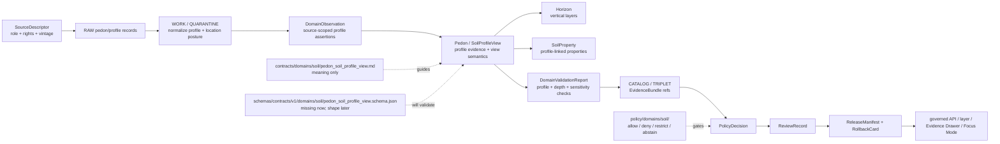

<!-- [KFM_META_BLOCK_V2]
doc_id: kfm://doc/contracts-domains-soil-pedon-soil-profile-view
title: Pedon / Soil Profile View Contract — Soil
type: semantic-contract; profile-evidence-profile
version: v0.2
status: draft; PROPOSED; schema-missing; canonical-working-lane; support-type-separation-required; pedon-profile-evidence; NEEDS VERIFICATION before promotion
owners:
  - OWNER_TBD — Soil domain steward
  - OWNER_TBD — Contracts steward
  - OWNER_TBD — Schema steward
  - OWNER_TBD — Source steward
  - OWNER_TBD — Evidence steward
  - OWNER_TBD — Policy steward
  - OWNER_TBD — Release steward
  - OWNER_TBD — Docs steward
created: NEEDS VERIFICATION — scaffold existed before v0.2 expansion
updated: 2026-06-23
policy_label: public; contracts; soil; pedon; soil-profile-view; profile-evidence; source-role-aware; support-type-separation; depth-aware; temporal-scope-aware; evidence-bound; schema-missing; release-gated; rollback-aware; not-map-unit-truth; not-continuous-surface; not-standalone-layer; no-owner-identifying-joins; not-etl-code; not-release-approval; not-direct-data-access
tags: [kfm, contracts, soil, pedon, soil-profile-view, Pedon, SoilProfileView, Horizon, SoilProperty, SoilMapUnit, SoilComponent, ComponentHorizonJoin, SoilTimeCaveat, pedon_evidence, authoritative_static_soil, DomainFeatureIdentity, DomainObservation, DomainLayerDescriptor, DomainValidationReport, SourceDescriptor, EvidenceRef, EvidenceBundle, PolicyDecision, ReviewRecord, ReleaseManifest, RollbackCard]
related:
  - ./README.md
  - ./domain_feature_identity.md
  - ./domain_observation.md
  - ./domain_layer_descriptor.md
  - ./domain_validation_report.md
  - ./component_horizon_join.md
  - ./soil_map_unit.md
  - ./soil_component.md
  - ./horizon.md
  - ./soil_property.md
  - ./hydrologic_soil_group.md
  - ./soil_moisture_observation.md
  - ./pedon.md
  - ./soil_profile_view.md
  - ./erosion_risk.md
  - ./suitability_rating.md
  - ./soil_time_caveat.md
  - ../../../docs/domains/soil/README.md
  - ../../../docs/domains/soil/CANONICAL_PATHS.md
  - ../../../docs/domains/soil/ARCHITECTURE.md
  - ../../../docs/domains/soil/API_CONTRACTS.md
  - ../../../docs/domains/soil/DATA_LIFECYCLE.md
  - ../../../pipelines/domains/soil/README.md
  - ../../../schemas/contracts/v1/domains/soil/pedon_soil_profile_view.schema.json
  - ../../../schemas/contracts/v1/domains/soil/README.md
  - ../../../policy/domains/soil/README.md
  - ../../../fixtures/domains/soil/pedon_soil_profile_view/
  - ../../../tests/domains/soil/
  - ../../../release/candidates/soil/
notes:
  - "Expanded from a PROPOSED scaffold at contracts/domains/soil/pedon_soil_profile_view.md."
  - "A paired schema at schemas/contracts/v1/domains/soil/pedon_soil_profile_view.schema.json was not found in this task. Field realization remains PROPOSED."
  - "Soil architecture defines Pedon / SoilProfileView as a confirmed term for profile-level evidence object, with field shape still PROPOSED."
  - "The Soil contract README states Pedon / SoilProfileView defines profile-level evidence and profile display/projection semantics, and profile view is not map-unit truth by itself."
  - "Soil API posture treats pedon/profile context as public horizon detail only when owner-identifying joins are denied and sensitivity gates pass."
  - "Support-type separation remains mandatory: pedon/profile evidence must not collapse into static survey, gridded derivative, station observation, satellite grid, or interpretation surfaces."
  - "This contract defines pedon/profile meaning only; it does not implement schema validation, ETL, source activation, public API behavior, release approval, map rendering, or AI answers."
[/KFM_META_BLOCK_V2] -->

<a id="top"></a>

# Pedon / Soil Profile View Contract — Soil

> Semantic contract for `Pedon` / `SoilProfileView`: the Soil-domain profile-level evidence object and governed profile-view projection used to describe a local/profile soil sequence with horizons, depth context, properties, evidence, time/vintage, sensitivity posture, release state, and rollback lineage — without becoming map-unit truth, continuous surface truth, public layer authority, or AI answer authority.

<p>
  
  
  
  
  
  
  
</p>

`contracts/domains/soil/pedon_soil_profile_view.md`

## Quick jumps

[Status](#status) · [Meaning](#meaning) · [Repo fit](#repo-fit) · [Schema posture](#schema-posture) · [Accepted uses](#accepted-uses) · [Exclusions](#exclusions) · [Recommended fields](#recommended-fields) · [Profile model](#profile-model) · [Profile families](#profile-families) · [Source-role and support rules](#source-role-and-support-rules) · [Sensitivity and publication posture](#sensitivity-and-publication-posture) · [Invariants](#invariants) · [Lifecycle](#lifecycle) · [Validation](#validation) · [Rollback](#rollback) · [Evidence basis](#evidence-basis) · [Open questions](#open-questions)

---

## Status

> [!IMPORTANT]
> **Status:** `draft` / semantic contract / profile-evidence profile  
> **Owner:** `OWNER_TBD`  
> **Contract path:** `contracts/domains/soil/pedon_soil_profile_view.md`  
> **Schema path checked:** `schemas/contracts/v1/domains/soil/pedon_soil_profile_view.schema.json` — **not found in this task**  
> **Truth posture:** target path, prior scaffold, Soil contract-lane README, Soil architecture, Soil lifecycle inventory, Soil API posture, and sibling Soil contracts are confirmed from current repo evidence. Field-level shape, schema enforcement, validators, fixtures, policy tests, ETL behavior, source registry records, release manifests, governed API routes, public API behavior, map rendering, graph behavior, and runtime behavior remain **NEEDS VERIFICATION**.

> [!CAUTION]
> `Pedon` / `SoilProfileView` is local/profile evidence and display context. It is **not** whole map-unit truth, continuous surface truth, farm/parcel truth, owner-identifying disclosure, released layer authority, or AI authority.

---

## Meaning

`Pedon` / `SoilProfileView` records and presents soil profile evidence. It may describe a single pedon, a source-backed profile, or a public-safe profile projection used by an Evidence Drawer, map feature detail, Focus Mode answer, or released layer context.

It may carry or support:

- profile or pedon source-native identifiers;
- horizon sequence and depth interval context;
- horizon designations where source-supported;
- profile-level or horizon-level `SoilProperty` refs;
- links to `Horizon`, `ComponentHorizonJoin`, `SoilMapUnit`, `SoilComponent`, and `SoilTimeCaveat` records;
- source role, source vintage, observed time, retrieval time, release time, and correction state;
- public location posture, generalization/redaction status, sensitivity state, and rollback target.

The object answers:

- Which pedon/profile evidence is being represented?
- Which source, source role, support type, time/vintage, and location posture apply?
- Which horizons and properties are included, and what are their depth contexts?
- Is the profile view exact, generalized, redacted, aggregate, review-only, or denied?
- Which EvidenceBundle, PolicyDecision, ReviewRecord, ReleaseManifest, and RollbackCard govern downstream use?
- What does the profile evidence **not** prove?

A profile view is a **governed projection of profile evidence**. It can help explain local/profile soil characteristics, horizon sequences, and property context. It must not be treated as a continuous surface, map-unit truth, farm-specific prescription, owner/parcel disclosure, or public layer approval.

---

## Repo fit

| Responsibility | Path | Role |
|---|---|---|
| Contract lane | `contracts/domains/soil/pedon_soil_profile_view.md` | This semantic Pedon / SoilProfileView contract. |
| Soil contract README | `contracts/domains/soil/README.md` | Defines Pedon / SoilProfileView as profile-level evidence and profile display/projection semantics, not map-unit truth by itself. |
| Paired schema | `schemas/contracts/v1/domains/soil/pedon_soil_profile_view.schema.json` | Not found in this task; do not infer machine shape. |
| Identity companion | `contracts/domains/soil/domain_feature_identity.md` | Pedon/profile identity should resolve through source role, object role, time scope, and digest posture. |
| Observation companion | `contracts/domains/soil/domain_observation.md` | Observations may assert profile/horizon/property data; they do not become profile truth by themselves. |
| Horizon companion | `contracts/domains/soil/horizon.md` | Horizon objects own vertical-layer semantics and depth context. |
| Property companion | `contracts/domains/soil/soil_property.md` | Soil properties own value/method/unit/depth semantics. |
| Layer companion | `contracts/domains/soil/domain_layer_descriptor.md` | Any profile layer or drawer projection is governed delivery, not canonical truth. |
| Validation companion | `contracts/domains/soil/domain_validation_report.md` | Validation may check profile completeness, depth sanity, support type, location posture, and EvidenceBundle closure. |
| Soil architecture | `docs/domains/soil/ARCHITECTURE.md` | Defines Pedon / SoilProfileView as a confirmed term and object family with proposed field realization. |
| Soil API posture | `docs/domains/soil/API_CONTRACTS.md` | Defines finite outcomes, support-type separation, sensitivity posture, and no-owner-identifying-join rule. |
| Soil lifecycle inventory | `docs/domains/soil/DATA_LIFECYCLE.md` | Lists Pedon / SoilProfileView among owned Soil object families and preserves promotion model. |
| Policy | `policy/domains/soil/` | Allow/deny/restrict/abstain, rights, sensitivity, location posture, stale-state, source-role, and release gating. |
| Tests / fixtures | `tests/domains/soil/`, `fixtures/domains/soil/pedon_soil_profile_view/` | Expected proof surfaces; maturity not verified here. |
| Release / rollback | `release/candidates/soil/` and release roots | Publication, correction, and rollback authority. |

---

## Schema posture

A direct paired schema was checked at:

```text
schemas/contracts/v1/domains/soil/pedon_soil_profile_view.schema.json
```

That file was **not found** in this task.

> [!WARNING]
> Because no paired schema was confirmed, every field below is **PROPOSED** semantic guidance. Do not treat it as machine-enforced until schema, fixtures, validators, policy tests, release checks, governed API behavior, and runtime behavior are verified.

---

## Accepted uses

| Use | Allowed? | Rule |
|---|---:|---|
| Defining Pedon/Profile evidence semantics | Yes | Must preserve source, support type, profile/horizon context, location posture, evidence, and time scope. |
| Supporting horizon/profile displays | Conditional | Horizon sequence and depth intervals must be visible and validated where material. |
| Supporting horizon-level or profile-level properties | Conditional | Property values need separate method, unit, depth/profile, evidence, and validation posture. |
| Supporting Evidence Drawer profile context | Conditional | Drawer must be a governed projection with citations, policy, release, caveats, and no owner-identifying joins. |
| Supporting Focus Mode explanation | Conditional | AI may explain released profile context only with citation closure and finite outcomes. |
| Supporting a profile-related layer or view | Conditional | Requires DomainLayerDescriptor, validation, policy, review, ReleaseManifest, and rollback target. |
| Treating profile evidence as map-unit truth or continuous surface truth | No | Use owning object families, released layers, and explicit caveats. |
| Publishing exact/local/sensitive profile joins without policy/release support | No | Generalize, redact, deny, or hold for review. |

---

## Exclusions

`Pedon` / `SoilProfileView` must not be used as:

| Misuse | Required outcome |
|---|---|
| Whole map-unit truth | Use `SoilMapUnit`, `SoilComponent`, and evidence closure. |
| Continuous soil surface | Use an appropriately governed layer descriptor and released artifact. |
| Whole horizon/property schema | Use `Horizon` and `SoilProperty` contracts/schemas. |
| Owner, farm, parcel, or private sensor disclosure | Use policy review; deny or generalize where joins identify owners/operations. |
| SourceDescriptor or source registry record | Use source registry roots and SourceDescriptor contracts. |
| ETL implementation or profile-parser code | Use pipelines/packages and tests. |
| JSON Schema / machine validation | Use schema roots after schema creation. |
| Release approval | Use PolicyDecision, ReviewRecord, ReleaseManifest, correction path, and RollbackCard. |
| AI answer authority | Focus Mode remains evidence-subordinate and finite-outcome constrained. |

---

## Recommended fields

The following fields are **PROPOSED** until a paired schema is added and validated.

| Field | Meaning |
|---|---|
| `id` | Canonical Pedon/ProfileView identifier. |
| `version` | Contract/object version. |
| `spec_hash` | Deterministic hash over normalized profile content. |
| `domain` | Expected value: `soil`. |
| `profile_subject_ref` | Pedon, profile, soil feature, layer feature, or aggregate subject ref. |
| `profile_subject_family` | Pedon, SoilProfileView, Horizon, SoilProperty, ComponentHorizonJoin, or related family. |
| `support_type` | Expected value includes `pedon_evidence`; any linked survey/derivative/observation support must remain explicit. |
| `source_ref` | SourceDescriptor/source registry ref. |
| `source_role` | Source role for this profile use. |
| `source_native_id` | Source-native pedon/profile ID, if available. |
| `location_ref` | Source-scoped location support, generalized location, hidden location, or denied location marker. |
| `public_geometry_rule` | Exact, generalized, aggregate, hidden, denied, or review-only posture. |
| `profile_description` | Source-backed profile description or display label. |
| `horizon_refs` | Horizon refs included in the profile view. |
| `property_refs` | SoilProperty refs included in the profile view. |
| `depth_or_profile_scope` | Profile depth interval, horizon range, or source-defined vertical scope. |
| `method_ref` | Field, lab, survey, profile, source, or display method ref where available. |
| `scale_or_resolution` | Local/profile support, generalized display scale, or source-specific locality caveat. |
| `quality_flags` | Candidate, reviewed, source-carried, stale, contested, denied, hidden-location, owner-join-denied, or source-specific flags. |
| `observed_time` | Observation/profile time where applicable. |
| `source_time` | Source creation/publication/update time. |
| `valid_time` | Interval the profile description applies to, if known. |
| `retrieval_time` | KFM retrieval/freeze time. |
| `release_time` | KFM release time, if released. |
| `correction_time` | Correction/supersession time, if corrected. |
| `evidence_refs` | EvidenceRefs or EvidenceBundle refs. |
| `validation_report_ref` | DomainValidationReport ref for profile completeness, horizon depth, sensitivity, and release checks. |
| `policy_decision_ref` | PolicyDecision governing use/publication. |
| `review_ref` | ReviewRecord or steward review ref. |
| `layer_descriptor_ref` | DomainLayerDescriptor ref if rendered. |
| `release_manifest_ref` | ReleaseManifest or MapReleaseManifest ref. |
| `rollback_ref` | RollbackCard or rollback target. |
| `limitations` | Caveats: profile evidence only; not map-unit truth, not continuous surface, not owner/farm disclosure, not release approval. |

---

## Profile model

A reviewed Pedon/ProfileView object should bind source identity, profile/horizon/property context, support type, location posture, evidence, validation, policy, release, and rollback.

```text
pedon_soil_profile_view = {
  domain,
  profile_subject_ref,
  profile_subject_family,
  support_type,
  source_ref,
  source_role,
  source_native_id,
  location_ref,
  public_geometry_rule,
  horizon_refs,
  property_refs,
  depth_or_profile_scope,
  method_ref,
  scale_or_resolution,
  quality_flags,
  temporal_scope,
  evidence_refs,
  validation_report_ref,
  policy_decision_ref,
  review_ref,
  layer_descriptor_ref,
  release_manifest_ref,
  rollback_ref
}
```

The exact serialized shape is **NEEDS VERIFICATION** until the schema and validators are field-complete.

---

## Profile families

| Profile family | Meaning | Guardrail |
|---|---|---|
| `source_pedon` | Source-backed pedon evidence object. | Local/profile evidence is not map-unit truth by itself. |
| `profile_view` | Governed public/steward profile projection. | View is a projection; it must not drop citations, caveats, or policy. |
| `horizon_sequence_view` | Ordered horizon sequence with depth intervals. | Depth sanity and horizon provenance must be visible. |
| `property_profile_view` | Profile view emphasizing linked properties. | Property method/unit/depth semantics remain with SoilProperty. |
| `generalized_profile_context` | Public-safe generalized profile context. | Exact/local/sensitive context may be hidden or generalized. |
| `candidate_profile` | Provisional/model/OCR/connector-derived profile candidate. | Review only until validated and released. |
| `denied_or_abstained_profile` | Profile cannot be used under current evidence/policy. | Emit finite outcome and reason, not unsupported value. |

---

## Source-role and support rules

| Rule | Requirement |
|---|---|
| Pedon/profile support type is explicit | Profile evidence must be tagged as `pedon_evidence` or schema-selected equivalent where applicable. |
| Profile context is local | Profile evidence must not be silently generalized to a survey polygon, component, or continuous surface. |
| Location posture is mandatory where displayed | Exact, generalized, hidden, denied, or review-only location posture must be explicit. |
| Owner-identifying joins are denied by default | If profile context joins to owner, farm, parcel, operational, or private sensor detail, deny or hold unless policy/release supports publication. |
| Horizons remain separate objects | Profile view may include horizons, but Horizon owns vertical-layer semantics. |
| Properties remain separate objects | Profile view may include properties, but SoilProperty owns value/method/unit semantics. |
| Time axes remain separate | Source time, observed time, valid time, retrieval time, release time, and correction time must not collapse. |
| Public claims require EvidenceBundle resolution | If evidence cannot resolve, return ABSTAIN, DENY, or ERROR; do not invent the profile. |

---

## Sensitivity and publication posture

| Surface | Default posture | Reason |
|---|---|---|
| Public generalized profile view | Public-safe if source, rights, evidence, validation, policy, and release support it | Profile context can be public-safe when caveated and non-identifying. |
| Exact/local pedon location | Review / generalize / hide where needed | Exact locality can invite false precision or sensitive joins. |
| Profile linked to owner/farm/parcel | DENY / restrict / hold by default | Owner-identifying joins are explicitly unsafe without policy/release support. |
| Profile property view | Caveated and method-visible | Property units/depth/method must remain visible. |
| Candidate/model/OCR profile | Review only | Candidate profiles do not become public truth. |
| Focus Mode explanation | Released/cited only | AI must cite EvidenceBundle/release and preserve caveats. |

---

## Invariants

1. **Pedon/ProfileView is profile evidence, not map-unit truth.** It can support interpretation but cannot replace survey map-unit or component evidence.
2. **Profile view is a projection.** It must preserve citations, policy, review, release, correction, and rollback state.
3. **Location posture is part of meaning.** Exact/local/sensitive profile context cannot be casually exposed.
4. **Owner-identifying joins fail closed.** Farm, parcel, owner, or private operational joins require deny/hold/review unless policy and release explicitly allow.
5. **Horizons and properties remain separate.** Profile views can include them but cannot absorb their contract responsibilities.
6. **Support type cannot collapse.** Pedon evidence must not become static survey, gridded derivative, station, satellite, or interpretation support by display convenience.
7. **Evidence closure is required.** Consequential public claims require EvidenceRef to resolve to EvidenceBundle.
8. **Release is separate.** Public display requires PolicyDecision, ReviewRecord, ReleaseManifest, and RollbackCard where required.
9. **AI is downstream.** Focus Mode may explain released profile context only with citation closure and caveats.
10. **No direct internal-store reads.** Public clients use governed APIs and released artifacts only.

---

## Lifecycle



---

## Validation

Before this contract is treated as mature, maintainers should verify:

- [ ] paired schema exists or an ADR declares a different pedon/profile shape home;
- [ ] schema includes profile subject, support type, source ref, source-native ID, location posture, public geometry rule, horizon refs, property refs, depth/profile scope, method refs, time axes, evidence refs, validation/policy/review/release/rollback refs, and limitations;
- [ ] fixtures cover source pedon, profile view, horizon sequence view, property profile view, generalized profile context, exact-location hold, owner-join denial, candidate profile, stale profile, denied profile, and release-ready profile;
- [ ] validators check horizon sequence/depth sanity, profile completeness, property refs, support-type separation, EvidenceBundle resolution, location posture, owner-identifying join denial, stale-state, and release preflight;
- [ ] tests prevent profile views from becoming map-unit truth, continuous surface truth, owner/farm/parcel disclosure, release approval, public API proof, or AI authority;
- [ ] tests enforce ABSTAIN/DENY/ERROR/HOLD when evidence, source role, support type, location posture, owner-join risk, policy, release, or runtime evaluation is unresolved;
- [ ] public map, Evidence Drawer, Focus Mode, exports, and AI summaries use only released/governed profile projections;
- [ ] rollback invalidates linked horizons, properties, observations, identities, layer descriptors, drawer payloads, exports, caches, graph projections, and AI summaries that cited a withdrawn profile.

---

## Rollback

Rollback is required if this contract:

- claims schema, validator, fixture, test, policy, release, API, ETL, profile parser, map, graph, or runtime behavior exists without proof;
- treats Pedon/ProfileView as map-unit truth, continuous surface truth, source truth, owner/farm/parcel disclosure, release approval, public API proof, or AI authority;
- weakens support-type separation;
- hides profile location posture, source-role conflict, source vintage, horizon/property gaps, candidate status, stale state, supersession, or correction lineage;
- exposes exact/local/profile, farm-specific, owner-specific, operational, or private sensor detail without policy/release support;
- normalizes direct UI access to internal lifecycle stores or direct model output.

Rollback target: revert `contracts/domains/soil/pedon_soil_profile_view.md` to prior scaffold blob `868e9975bece764d580e5b7c21dd097e9f4b9150`, record drift if authority boundaries were affected, and invalidate downstream derivatives that relied on weakened Pedon/ProfileView semantics.

---

## Evidence basis

| Evidence | Status | Supports | Limits |
|---|---|---|---|
| Prior `contracts/domains/soil/pedon_soil_profile_view.md` | `CONFIRMED` | Target file existed as a planned-path scaffold sourced from Soil continuity/lifecycle docs. | Scaffold did not define authoritative semantic contract content. |
| Paired schema lookup | `CONFIRMED not found in this task` | Justifies schema-missing posture. | Does not rule out alternate schema names or future ADR-selected homes. |
| `contracts/domains/soil/README.md` | `CONFIRMED contract-lane rule` | Defines Pedon / SoilProfileView as profile-level evidence and profile display/projection semantics; says profile view is not map-unit truth by itself; requires support-type separation and EvidenceBundle closure. | Does not prove object schema, validator, or release maturity. |
| `docs/domains/soil/ARCHITECTURE.md` | `CONFIRMED doctrine / PROPOSED field realization` | Defines Pedon / SoilProfileView as profile-level evidence object and owned object family with all-six-time-facet temporal handling. | Does not prove implementation. |
| `docs/domains/soil/API_CONTRACTS.md` | `CONFIRMED doctrine / PROPOSED implementation` | Defines support-type separation, pedon/profile public profile context, owner-identifying join denial, finite outcomes, and EvidenceBundle/release gates. | Route names, validator code, and runtime behavior remain UNKNOWN / NEEDS VERIFICATION. |
| `docs/domains/soil/DATA_LIFECYCLE.md` | `CONFIRMED navigational register / PROPOSED implementation` | Lists Pedon / SoilProfileView among owned Soil object families and records Soil promotion model. | It is a navigational register, not implementation proof. |
| `contracts/domains/soil/horizon.md` | `CONFIRMED sibling contract` | Defines vertical-layer semantics and separates Horizon from map-unit/property truth. | Its paired schema is missing. |
| `contracts/domains/soil/domain_observation.md` | `CONFIRMED sibling contract` | Defines observations as source-scoped evidence-bearing claims that may support profile context. | Its schema is a stub. |
| `contracts/domains/soil/domain_validation_report.md` | `CONFIRMED sibling contract` | Defines validation as check evidence, not policy or release authority. | Its schema is a stub. |
| Uploaded KFM authoring prompt v2 | `CONFIRMED user-supplied guidance` | Requires evidence-first, implementation-honest, visually polished Markdown with visible verification and rollback posture. | Authoring guidance, not implementation proof. |

---

## Open questions

| ID | Question | Status |
|---|---|---|
| OQ-SOIL-PEDON-01 | Should `Pedon` and `SoilProfileView` be split into separate contracts, or remain a combined profile-evidence/view contract? | OPEN / DOMAIN + SCHEMA REVIEW |
| OQ-SOIL-PEDON-02 | Which source-native key families are canonical for pedon/profile records and horizon sequences? | OPEN / SOURCE + SCHEMA REVIEW |
| OQ-SOIL-PEDON-03 | Which location posture, generalization, redaction, and owner-join-denial rules belong in schema vs policy? | OPEN / POLICY + SCHEMA REVIEW |
| OQ-SOIL-PEDON-04 | Which validators prove profile completeness, horizon sequence sanity, property refs, and public-safe profile projection? | OPEN / VALIDATION REVIEW |
| OQ-SOIL-PEDON-05 | How should Evidence Drawer and Focus Mode show pedon/profile context without implying map-unit truth or continuous surface truth? | OPEN / MAP/UI REVIEW |
| OQ-SOIL-PEDON-06 | How should rollback invalidate horizons, properties, layers, drawer payloads, Focus Mode claims, exports, caches, graph projections, and AI summaries after a profile correction? | OPEN / RELEASE REVIEW |

<p align="right"><a href="#top">Back to top</a></p>
