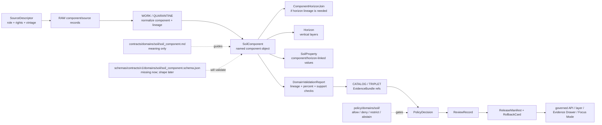

<!-- [KFM_META_BLOCK_V2]
doc_id: kfm://doc/contracts-domains-soil-soil-component
title: Soil Component Contract — Soil
type: semantic-contract
version: v0.2
status: draft; PROPOSED; schema-missing; canonical-working-lane; support-type-separation-required; component-within-map-unit; NEEDS VERIFICATION before promotion
owners:
  - OWNER_TBD — Soil domain steward
  - OWNER_TBD — Contracts steward
  - OWNER_TBD — Schema steward
  - OWNER_TBD — Source steward
  - OWNER_TBD — Evidence steward
  - OWNER_TBD — Policy steward
  - OWNER_TBD — Release steward
  - OWNER_TBD — Docs steward
created: NEEDS VERIFICATION — scaffold existed before v0.2 expansion
updated: 2026-06-23
policy_label: public; contracts; soil; soil-component; named-soil-component; map-unit-component; component-percent; source-role-aware; support-type-separation; temporal-scope-aware; evidence-bound; schema-missing; release-gated; rollback-aware; not-map-unit-truth; not-horizon-truth; not-property-truth; not-current-field-condition; not-etl-code; not-release-approval; not-direct-data-access
tags: [kfm, contracts, soil, soil-component, SoilComponent, SoilMapUnit, Horizon, ComponentHorizonJoin, SoilProperty, HydrologicSoilGroup, SoilMoistureObservation, Pedon, SoilProfileView, ErosionRisk, SuitabilityRating, SoilTimeCaveat, authoritative_static_soil, gridded_derivative_soil, DomainFeatureIdentity, DomainObservation, DomainLayerDescriptor, DomainValidationReport, SourceDescriptor, EvidenceRef, EvidenceBundle, PolicyDecision, ReviewRecord, ReleaseManifest, RollbackCard]
related:
  - ./README.md
  - ./domain_feature_identity.md
  - ./domain_observation.md
  - ./domain_layer_descriptor.md
  - ./domain_validation_report.md
  - ./component_horizon_join.md
  - ./soil_map_unit.md
  - ./horizon.md
  - ./soil_property.md
  - ./hydrologic_soil_group.md
  - ./soil_moisture_observation.md
  - ./pedon.md
  - ./soil_profile_view.md
  - ./pedon_soil_profile_view.md
  - ./erosion_risk.md
  - ./suitability_rating.md
  - ./soil_time_caveat.md
  - ../../../docs/domains/soil/README.md
  - ../../../docs/domains/soil/CANONICAL_PATHS.md
  - ../../../docs/domains/soil/ARCHITECTURE.md
  - ../../../docs/domains/soil/API_CONTRACTS.md
  - ../../../docs/domains/soil/DATA_LIFECYCLE.md
  - ../../../pipelines/domains/soil/README.md
  - ../../../schemas/contracts/v1/domains/soil/soil_component.schema.json
  - ../../../schemas/contracts/v1/domains/soil/README.md
  - ../../../policy/domains/soil/README.md
  - ../../../fixtures/domains/soil/soil_component/
  - ../../../tests/domains/soil/
  - ../../../release/candidates/soil/
notes:
  - "Expanded from a PROPOSED scaffold at contracts/domains/soil/soil_component.md."
  - "A paired schema at schemas/contracts/v1/domains/soil/soil_component.schema.json was not found in this task. Field realization remains PROPOSED."
  - "Soil architecture defines SoilComponent as a confirmed term for a named soil within a map unit, weighted by percent, with field shape still PROPOSED."
  - "The Soil contract README states SoilComponent defines named soil within a map unit, including percent/component posture, and is not interchangeable with map unit or horizon."
  - "Support-type separation remains mandatory: static survey, gridded derivative, station observation, satellite grid, pedon/profile evidence, and interpretation cannot be collapsed by component use."
  - "This contract defines component meaning only; it does not implement schema validation, ETL, source activation, public API behavior, release approval, map rendering, or AI answers."
[/KFM_META_BLOCK_V2] -->

<a id="top"></a>

# Soil Component Contract — Soil

> Semantic contract for `SoilComponent`: the Soil-domain named component within a soil map unit, carrying component identity, source role, component-percent posture, horizon/property lineage, evidence, time/vintage, validation state, release posture, and rollback lineage — without becoming map-unit truth, horizon truth, property truth, current field condition, public layer authority, or AI answer authority.

<p>
  
  
  
  
  
  
  
</p>

`contracts/domains/soil/soil_component.md`

## Quick jumps

[Status](#status) · [Meaning](#meaning) · [Repo fit](#repo-fit) · [Schema posture](#schema-posture) · [Accepted uses](#accepted-uses) · [Exclusions](#exclusions) · [Recommended fields](#recommended-fields) · [Component model](#component-model) · [Component families](#component-families) · [Source-role and support rules](#source-role-and-support-rules) · [Sensitivity and publication posture](#sensitivity-and-publication-posture) · [Invariants](#invariants) · [Lifecycle](#lifecycle) · [Validation](#validation) · [Rollback](#rollback) · [Evidence basis](#evidence-basis) · [Open questions](#open-questions)

---

## Status

> [!IMPORTANT]
> **Status:** `draft` / semantic contract  
> **Owner:** `OWNER_TBD`  
> **Contract path:** `contracts/domains/soil/soil_component.md`  
> **Schema path checked:** `schemas/contracts/v1/domains/soil/soil_component.schema.json` — **not found in this task**  
> **Truth posture:** target path, prior scaffold, Soil contract-lane README, Soil architecture, Soil lifecycle inventory, Soil API posture, and sibling Soil contracts are confirmed from current repo evidence. Field-level shape, schema enforcement, validators, fixtures, policy tests, ETL behavior, source registry records, release manifests, governed API routes, public API behavior, map rendering, graph behavior, and runtime behavior remain **NEEDS VERIFICATION**.

> [!CAUTION]
> `SoilComponent` is a named soil component inside a map unit. It is **not** the map unit itself, not a horizon, not a property value, not a current field condition, not a farm/parcel boundary, not release approval, and not AI authority.

---

## Meaning

`SoilComponent` records a source-scoped component within a `SoilMapUnit`. It is the named soil/component concept that can carry component percent, component-level attributes, horizon lineage, property context, source vintage, and evidence posture.

It may carry or support:

- source-native component identifiers, such as component-level keys when available;
- parent `SoilMapUnit` context;
- component name, component kind, and component percent posture where source-supported;
- links to `Horizon`, `ComponentHorizonJoin`, `SoilProperty`, `HydrologicSoilGroup`, `ErosionRisk`, `SuitabilityRating`, and `SoilTimeCaveat` records;
- source role, source vintage, retrieval time, valid time, release time, and correction state;
- EvidenceBundle, validation, policy, review, release, and rollback refs.

The object answers:

- Which component is being described?
- Which map unit and source-native lineage support the component?
- What component percent or component role is source-supported, candidate, reviewed, stale, contested, or denied?
- Which horizons and properties may cite this component without absorbing it?
- What public display, if any, is allowed after validation, policy, review, release, and rollback closure?
- What does the component **not** prove?

A soil component is a **component-level soil object**. It can support horizon lineage, component summaries, interpretation inputs, Evidence Drawer explanations, and Focus Mode caveated answers. It cannot by itself certify the whole map unit, become a horizon, publish soil property values, or substitute for source evidence.

---

## Repo fit

| Responsibility | Path | Role |
|---|---|---|
| Contract lane | `contracts/domains/soil/soil_component.md` | This semantic SoilComponent contract. |
| Soil contract README | `contracts/domains/soil/README.md` | Defines SoilComponent as named soil within a map unit, including percent/component posture; not interchangeable with map unit or horizon. |
| Paired schema | `schemas/contracts/v1/domains/soil/soil_component.schema.json` | Not found in this task; do not infer machine shape. |
| Identity companion | `contracts/domains/soil/domain_feature_identity.md` | Component identity should resolve through source role, object role, time scope, and digest posture. |
| Observation companion | `contracts/domains/soil/domain_observation.md` | Observations may assert component data; they do not become component truth by themselves. |
| Join companion | `contracts/domains/soil/component_horizon_join.md` | Defines map-unit/component/horizon lineage relation semantics. |
| Horizon companion | `contracts/domains/soil/horizon.md` | Horizon objects own vertical-layer semantics and depth context. |
| Property companion | `contracts/domains/soil/soil_property.md` | Component properties need their own method/unit/depth semantics. |
| Layer companion | `contracts/domains/soil/domain_layer_descriptor.md` | Any component-summary layer is a governed projection, not component truth. |
| Validation companion | `contracts/domains/soil/domain_validation_report.md` | Validation may check component lineage, percent posture, support type, and EvidenceBundle closure. |
| Soil architecture | `docs/domains/soil/ARCHITECTURE.md` | Defines SoilComponent as a confirmed term and object family with proposed field realization. |
| Soil API posture | `docs/domains/soil/API_CONTRACTS.md` | Defines finite outcomes, support-type separation, public-surface gates, and forbidden behavior. |
| Soil lifecycle inventory | `docs/domains/soil/DATA_LIFECYCLE.md` | Lists SoilComponent among owned Soil object families and preserves promotion model. |
| Policy | `policy/domains/soil/` | Allow/deny/restrict/abstain, rights, sensitivity, stale-state, source-role, and release gating. |
| Tests / fixtures | `tests/domains/soil/`, `fixtures/domains/soil/soil_component/` | Expected proof surfaces; maturity not verified here. |
| Release / rollback | `release/candidates/soil/` and release roots | Publication, correction, and rollback authority. |

---

## Schema posture

A direct paired schema was checked at:

```text
schemas/contracts/v1/domains/soil/soil_component.schema.json
```

That file was **not found** in this task.

> [!WARNING]
> Because no paired schema was confirmed, every field below is **PROPOSED** semantic guidance. Do not treat it as machine-enforced until schema, fixtures, validators, policy tests, release checks, governed API behavior, and runtime behavior are verified.

---

## Accepted uses

| Use | Allowed? | Rule |
|---|---:|---|
| Defining named component semantics | Yes | Must preserve source, source role, support type, parent map unit, component role/percent, evidence, and time scope. |
| Supporting component-horizon lineage | Conditional | Must use or cite `ComponentHorizonJoin`; lineage must remain inspectable. |
| Supporting component-level soil properties | Conditional | Property values need separate method, unit, depth/profile, evidence, and validation posture. |
| Supporting component summary layers | Conditional | Requires DomainLayerDescriptor, validation, EvidenceBundle, policy, review, ReleaseManifest, and rollback target. |
| Supporting Evidence Drawer / Focus Mode component explanation | Conditional | Must cite released evidence and preserve caveats and finite outcomes. |
| Treating component percent as current field measurement | No | Component percent is source/support-dependent and not current field condition by itself. |
| Treating a component as whole map-unit truth or horizon truth | No | Use owning object contracts and evidence closure. |
| Collapsing static survey, gridded derivative, station, satellite, pedon/profile, or interpretation support | No | Support-type separation is mandatory. |

---

## Exclusions

`SoilComponent` must not be used as:

| Misuse | Required outcome |
|---|---|
| Whole map-unit truth | Use `SoilMapUnit` and source/evidence closure. |
| Horizon truth | Use `Horizon` and `ComponentHorizonJoin`. |
| SoilProperty truth by itself | Use `SoilProperty` with method/unit/depth semantics. |
| Current field condition | Use current observations or appropriate domain/source evidence. |
| Parcel, farm, title, or ownership boundary | Use People/Land and governed cross-lane rules. |
| ETL implementation or relational join | Use pipelines and `ComponentHorizonJoin`. |
| JSON Schema / machine validation | Use schema roots after schema creation. |
| SourceDescriptor or source registry record | Use source registry roots and SourceDescriptor contracts. |
| Release approval | Use PolicyDecision, ReviewRecord, ReleaseManifest, correction path, and RollbackCard. |
| AI answer authority | Focus Mode remains evidence-subordinate and finite-outcome constrained. |

---

## Recommended fields

The following fields are **PROPOSED** until a paired schema is added and validated.

| Field | Meaning |
|---|---|
| `id` | Canonical SoilComponent identifier. |
| `version` | Contract/object version. |
| `spec_hash` | Deterministic hash over normalized component content. |
| `domain` | Expected value: `soil`. |
| `support_type` | Static survey, gridded derivative, or schema-selected equivalent; must not be omitted. |
| `source_ref` | SourceDescriptor/source registry ref. |
| `source_role` | Source role for this component use. |
| `source_native_id` | Component source-native key or ID, if available. |
| `source_native_key_family` | COKEY, component ID, source-specific key, etc. |
| `map_unit_ref` | Parent SoilMapUnit ref. |
| `map_unit_native_id` | Parent MUKEY or source-specific map-unit ID, if applicable. |
| `component_name` | Source-supported component name or label. |
| `component_kind` | Source-supported component category/kind, if applicable. |
| `component_percent` | Source-supported component percent or representative share, with method/context. |
| `percent_method_ref` | Source or derivation method for component percent. |
| `horizon_refs` | Linked Horizon refs. |
| `component_horizon_join_refs` | Linked ComponentHorizonJoin refs. |
| `property_refs` | Linked SoilProperty refs. |
| `classification_refs` | Linked HydrologicSoilGroup, ErosionRisk, SuitabilityRating, or other interpretation refs. |
| `source_time` | Source creation/publication/update time. |
| `valid_time` | Interval the component description applies to, if known. |
| `retrieval_time` | KFM retrieval/freeze time. |
| `release_time` | KFM release time, if released. |
| `correction_time` | Correction/supersession time, if corrected. |
| `evidence_refs` | EvidenceRefs or EvidenceBundle refs. |
| `validation_report_ref` | DomainValidationReport ref for lineage, percent, support type, and evidence checks. |
| `policy_decision_ref` | PolicyDecision governing use/publication. |
| `review_ref` | ReviewRecord or steward review ref. |
| `release_manifest_ref` | ReleaseManifest or MapReleaseManifest ref. |
| `rollback_ref` | RollbackCard or rollback target. |
| `limitations` | Caveats: component only; not map-unit truth, not horizon truth, not property truth, not field condition, not release approval. |

---

## Component model

A reviewed SoilComponent object should bind source identity, parent map unit, component role/percent posture, support type, horizon/property lineage, evidence, validation, policy, release, and rollback.

```text
soil_component = {
  domain,
  support_type,
  source_ref,
  source_role,
  source_native_id,
  source_native_key_family,
  map_unit_ref,
  map_unit_native_id,
  component_name,
  component_kind,
  component_percent,
  percent_method_ref,
  horizon_refs,
  component_horizon_join_refs,
  property_refs,
  classification_refs,
  temporal_scope,
  evidence_refs,
  validation_report_ref,
  policy_decision_ref,
  review_ref,
  release_manifest_ref,
  rollback_ref
}
```

The exact serialized shape is **NEEDS VERIFICATION** until the schema and validators are field-complete.

---

## Component families

| Component family | Meaning | Guardrail |
|---|---|---|
| `survey_component` | Named component within static survey map-unit lineage. | Parent map unit and source-native lineage must remain visible. |
| `component_summary` | Component-level summary suitable for review or released projection. | Summary is not full map-unit truth or current field condition. |
| `component_percent_assertion` | Component percent/share as carried or derived from source. | Percent is source/method scoped and not a measurement of a parcel/farm. |
| `component_horizon_context` | Component used to organize horizon/property context. | Horizon and property contracts remain separate. |
| `derived_component_projection` | Component-like projection from derivative or generalized products. | Must cite method and avoid masquerading as source component. |
| `candidate_component` | Provisional/model/OCR/connector-derived component candidate. | Review only until validated and released. |
| `denied_or_abstained_component` | Component cannot be used under current evidence/policy. | Emit finite outcome and reason, not unsupported value. |

---

## Source-role and support rules

| Rule | Requirement |
|---|---|
| Parent map unit is part of meaning | A component without parent map-unit/source lineage is not reviewable for survey use. |
| Component is not map unit | Component-level truth must not be silently promoted to whole map-unit truth. |
| Component is not horizon | Component may link horizons, but Horizon owns vertical-layer semantics. |
| Component percent is contextual | Component percent requires source/method/time support and cannot be read as a current field measurement. |
| Support type is mandatory | Static survey, gridded derivative, station, satellite, pedon/profile, and interpretation contexts must not collapse. |
| Source-native IDs are lineage, not truth alone | COKEY/source component IDs support lineage but do not replace EvidenceBundle. |
| Time axes remain separate | Source time, valid time, retrieval time, release time, and correction time must not collapse. |
| Public claims require EvidenceBundle resolution | If evidence cannot resolve, return ABSTAIN, DENY, or ERROR; do not invent the component. |

---

## Sensitivity and publication posture

| Surface | Default posture | Reason |
|---|---|---|
| Public static survey component | Public-safe if source, rights, evidence, validation, scale, and release support it | Survey component context is often public, but still governed. |
| Component percent summary | Public-safe if caveated and released | Percent/share can be misread as precise field condition. |
| Component linked to farm/owner/parcel | Review / restrict / deny by default | People/land joins are outside public-by-default Soil context. |
| Component linked to private/operational sensor or field context | Review / restrict / deny by default | Operational data may expose sensitive context. |
| Candidate/model/OCR component | Review only | Candidate components do not become public truth. |
| Focus Mode explanation | Released/cited only | AI must cite EvidenceBundle/release and preserve caveats. |

---

## Invariants

1. **SoilComponent is a named component within a map unit.** It is not the map unit itself.
2. **Parent lineage is mandatory where material.** Survey components require map-unit/source-native lineage support.
3. **Component percent is scoped.** Percent/share values need source/method/time posture and do not become field measurement.
4. **Horizon and property responsibilities stay separate.** Component can organize them, not absorb them.
5. **Support type cannot collapse.** Static survey, derivative, station, satellite, pedon/profile, and interpretation contexts remain distinct.
6. **Evidence closure is required.** Consequential public claims require EvidenceRef to resolve to EvidenceBundle.
7. **Validation is bounded.** Component lineage and percent checks support trust; they do not publish or approve release.
8. **Release is separate.** Public display requires PolicyDecision, ReviewRecord, ReleaseManifest, and RollbackCard where required.
9. **AI is downstream.** Focus Mode may explain released component context only with citation closure and caveats.
10. **No direct internal-store reads.** Public clients use governed APIs and released artifacts only.

---

## Lifecycle



---

## Validation

Before this contract is treated as mature, maintainers should verify:

- [ ] paired schema exists or an ADR declares a different component shape home;
- [ ] schema includes source refs, source role, support type, native key family, parent map-unit ref, component name/kind, component percent, percent method, horizon refs, property refs, classification refs, time axes, evidence refs, validation/policy/review/release/rollback refs, and limitations;
- [ ] fixtures cover survey component, component summary, missing parent map unit, missing component ID, invalid component percent, conflicting component percent, component with horizons, component with properties, candidate component, stale component, denied component, and released component;
- [ ] validators check parent lineage, source-native ID family, percent range/method, support-type separation, EvidenceBundle resolution, stale-state, and release preflight;
- [ ] tests prevent SoilComponent from becoming map-unit truth, horizon truth, property truth, current field condition, release approval, or AI authority;
- [ ] tests enforce ABSTAIN/DENY/ERROR/HOLD when evidence, source role, support type, parent lineage, component percent, policy, release, or runtime evaluation is unresolved;
- [ ] public map, Evidence Drawer, Focus Mode, exports, and AI summaries use only released/governed component projections;
- [ ] rollback invalidates linked horizons, properties, component-horizon joins, observations, identities, layer descriptors, drawer payloads, exports, caches, graph projections, and AI summaries that cited a withdrawn component.

---

## Rollback

Rollback is required if this contract:

- claims schema, validator, fixture, test, policy, release, API, ETL, component model, map, graph, or runtime behavior exists without proof;
- treats SoilComponent as map-unit truth, horizon truth, property truth, current field condition, farm/parcel boundary, source truth, release approval, public API proof, or AI authority;
- weakens support-type separation;
- hides parent map-unit lineage, source-native ID, component-percent method, source-role conflict, source vintage, candidate status, stale state, supersession, or correction lineage;
- exposes farm-specific, owner-specific, parcel-specific, operational, or private sensor/profile detail without policy/release support;
- normalizes direct UI access to internal lifecycle stores or direct model output.

Rollback target: revert `contracts/domains/soil/soil_component.md` to prior scaffold blob `4e59dd4a7666a38a7bbdedfd43d32ec97a80d8ef`, record drift if authority boundaries were affected, and invalidate downstream derivatives that relied on weakened SoilComponent semantics.

---

## Evidence basis

| Evidence | Status | Supports | Limits |
|---|---|---|---|
| Prior `contracts/domains/soil/soil_component.md` | `CONFIRMED` | Target file existed as a planned-path scaffold sourced from Soil continuity/lifecycle docs. | Scaffold did not define authoritative semantic contract content. |
| Paired schema lookup | `CONFIRMED not found in this task` | Justifies schema-missing posture. | Does not rule out alternate schema names or future ADR-selected homes. |
| `contracts/domains/soil/README.md` | `CONFIRMED contract-lane rule` | Defines SoilComponent as named soil within a map unit, including percent/component posture, and not interchangeable with map unit or horizon; requires support-type separation and EvidenceBundle closure. | Does not prove object schema, validator, or release maturity. |
| `docs/domains/soil/ARCHITECTURE.md` | `CONFIRMED doctrine / PROPOSED field realization` | Defines SoilComponent as a confirmed term, named soil within a map unit weighted by percent, owned object family, and all-six-time-facet temporal handling. | Does not prove implementation. |
| `docs/domains/soil/API_CONTRACTS.md` | `CONFIRMED doctrine / PROPOSED implementation` | Defines finite outcomes, support-type separation, forbidden public behavior, and EvidenceBundle/release gates. | Route names, validator code, and runtime behavior remain UNKNOWN / NEEDS VERIFICATION. |
| `docs/domains/soil/DATA_LIFECYCLE.md` | `CONFIRMED navigational register / PROPOSED implementation` | Lists SoilComponent among owned Soil object families and records Soil promotion model. | It is a navigational register, not implementation proof. |
| `contracts/domains/soil/component_horizon_join.md` | `CONFIRMED sibling contract` | Defines map-unit/component/horizon lineage relation semantics and separates join meaning from ETL. | Its paired schema is missing. |
| `contracts/domains/soil/horizon.md` | `CONFIRMED sibling contract` | Defines vertical-layer semantics and separates Horizon from component/map-unit/property truth. | Its paired schema is missing. |
| `contracts/domains/soil/domain_validation_report.md` | `CONFIRMED sibling contract` | Defines validation as check evidence, not policy or release authority. | Its schema is a stub. |
| Uploaded KFM authoring prompt v2 | `CONFIRMED user-supplied guidance` | Requires evidence-first, implementation-honest, visually polished Markdown with visible verification and rollback posture. | Authoring guidance, not implementation proof. |

---

## Open questions

| ID | Question | Status |
|---|---|---|
| OQ-SOIL-COMP-01 | Should `SoilComponent` have its own schema, or inherit from a generic source-scoped component schema shared with survey domains? | OPEN / DOMAIN + SCHEMA REVIEW |
| OQ-SOIL-COMP-02 | Which source-native key families are canonical for components across SSURGO/SDA/gSSURGO/gNATSGO and derivative projections? | OPEN / SOURCE + SCHEMA REVIEW |
| OQ-SOIL-COMP-03 | Which component-percent fields, methods, units, and range checks are mandatory? | OPEN / VALIDATION REVIEW |
| OQ-SOIL-COMP-04 | How should component summaries cite horizons/properties without collapsing component, horizon, and property truth? | OPEN / CONTRACT REVIEW |
| OQ-SOIL-COMP-05 | How should Evidence Drawer and Focus Mode show component percent/context without implying current field condition or map-unit truth? | OPEN / MAP/UI REVIEW |
| OQ-SOIL-COMP-06 | How should rollback invalidate horizons, joins, properties, layers, drawer payloads, Focus Mode claims, exports, caches, graph projections, and AI summaries after a component correction? | OPEN / RELEASE REVIEW |

<p align="right"><a href="#top">Back to top</a></p>
