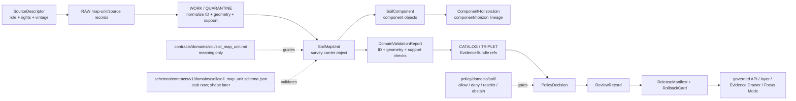

<!-- [KFM_META_BLOCK_V2]
doc_id: kfm://doc/contracts-domains-soil-soil-map-unit
title: Soil Map Unit Contract — Soil
type: semantic-contract
version: v0.2
status: draft; PROPOSED; schema-stub-confirmed; canonical-working-lane; support-type-separation-required; survey-polygon-carrier; NEEDS VERIFICATION before promotion
owners:
  - OWNER_TBD — Soil domain steward
  - OWNER_TBD — Contracts steward
  - OWNER_TBD — Schema steward
  - OWNER_TBD — Source steward
  - OWNER_TBD — Evidence steward
  - OWNER_TBD — Policy steward
  - OWNER_TBD — Release steward
  - OWNER_TBD — Docs steward
created: NEEDS VERIFICATION — scaffold existed before v0.2 expansion
updated: 2026-06-23
policy_label: public; contracts; soil; soil-map-unit; survey-map-unit; polygon-bearing-unit; source-role-aware; support-type-separation; temporal-scope-aware; evidence-bound; schema-stub; release-gated; rollback-aware; not-parcel; not-farm-boundary; not-current-field-condition; not-component-truth; not-horizon-truth; not-property-truth; not-etl-code; not-release-approval; not-direct-data-access
tags: [kfm, contracts, soil, soil-map-unit, SoilMapUnit, MUKEY, survey-polygon-carrier, authoritative_static_soil, gridded_derivative_soil, SoilComponent, Horizon, ComponentHorizonJoin, SoilProperty, HydrologicSoilGroup, SoilMoistureObservation, Pedon, SoilProfileView, ErosionRisk, SuitabilityRating, SoilTimeCaveat, DomainFeatureIdentity, DomainObservation, DomainLayerDescriptor, DomainValidationReport, SourceDescriptor, EvidenceRef, EvidenceBundle, PolicyDecision, ReviewRecord, ReleaseManifest, RollbackCard]
related:
  - ./README.md
  - ./domain_feature_identity.md
  - ./domain_observation.md
  - ./domain_layer_descriptor.md
  - ./domain_validation_report.md
  - ./component_horizon_join.md
  - ./soil_component.md
  - ./horizon.md
  - ./soil_property.md
  - ./hydrologic_soil_group.md
  - ./soil_moisture_observation.md
  - ./pedon.md
  - ./soil_profile_view.md
  - ./pedon_soil_profile_view.md
  - ./erosion_risk.md
  - ./suitability_rating.md
  - ./soil_time_caveat.md
  - ../../../docs/domains/soil/README.md
  - ../../../docs/domains/soil/CANONICAL_PATHS.md
  - ../../../docs/domains/soil/ARCHITECTURE.md
  - ../../../docs/domains/soil/API_CONTRACTS.md
  - ../../../docs/domains/soil/DATA_LIFECYCLE.md
  - ../../../docs/sources/catalog/nrcs/ssurgo.md
  - ../../../pipelines/domains/soil/README.md
  - ../../../schemas/contracts/v1/domains/soil/soil_map_unit.schema.json
  - ../../../schemas/contracts/v1/domains/soil/README.md
  - ../../../policy/domains/soil/README.md
  - ../../../fixtures/domains/soil/soil_map_unit/
  - ../../../tests/domains/soil/
  - ../../../release/candidates/soil/
notes:
  - "Expanded from a PROPOSED scaffold at contracts/domains/soil/soil_map_unit.md."
  - "A paired schema exists at schemas/contracts/v1/domains/soil/soil_map_unit.schema.json, but it is a permissive scaffold with no declared properties and additionalProperties true. Field realization remains PROPOSED."
  - "Soil architecture defines SoilMapUnit as a confirmed term for a polygon-bearing unit of soil survey, with field shape still PROPOSED."
  - "The Soil contract README states SoilMapUnit defines survey map-unit identity and source-supported polygon/unit meaning, and is not a parcel, farm boundary, or current field condition."
  - "Support-type separation remains mandatory: static survey, gridded derivative, station observation, satellite grid, pedon/profile evidence, and interpretation cannot be collapsed by map-unit use."
  - "This contract defines map-unit meaning only; it does not implement schema validation, ETL, source activation, public API behavior, release approval, map rendering, or AI answers."
[/KFM_META_BLOCK_V2] -->

<a id="top"></a>

# Soil Map Unit Contract — Soil

> Semantic contract for `SoilMapUnit`: the Soil-domain survey map-unit carrier that represents source-supported map-unit identity and polygon/unit meaning, with component lineage, evidence, source role, support type, time/vintage, validation state, release posture, and rollback lineage kept inspectable.

<p>
  
  
  
  
  
  
  
</p>

`contracts/domains/soil/soil_map_unit.md`

## Quick jumps

[Status](#status) · [Meaning](#meaning) · [Repo fit](#repo-fit) · [Schema posture](#schema-posture) · [Accepted uses](#accepted-uses) · [Exclusions](#exclusions) · [Recommended fields](#recommended-fields) · [Map-unit model](#map-unit-model) · [Map-unit families](#map-unit-families) · [Source-role and support rules](#source-role-and-support-rules) · [Sensitivity and publication posture](#sensitivity-and-publication-posture) · [Invariants](#invariants) · [Lifecycle](#lifecycle) · [Validation](#validation) · [Rollback](#rollback) · [Evidence basis](#evidence-basis) · [Open questions](#open-questions)

---

## Status

> [!IMPORTANT]
> **Status:** `draft` / semantic contract  
> **Owner:** `OWNER_TBD`  
> **Contract path:** `contracts/domains/soil/soil_map_unit.md`  
> **Schema path checked:** `schemas/contracts/v1/domains/soil/soil_map_unit.schema.json` — **confirmed permissive scaffold**  
> **Truth posture:** target path, prior scaffold, paired schema scaffold, Soil contract-lane README, Soil architecture, Soil lifecycle inventory, and Soil API posture are confirmed from current repo evidence. Field-level shape beyond permissive schema acceptance, schema enforcement, validators, fixtures, policy tests, ETL behavior, source registry records, release manifests, governed API routes, public API behavior, map rendering, graph behavior, and runtime behavior remain **NEEDS VERIFICATION**.

> [!CAUTION]
> `SoilMapUnit` is a source-supported survey map-unit carrier. It is **not** a parcel, farm boundary, ownership boundary, current field condition, component truth, horizon truth, property truth, release approval, or AI authority.

---

## Meaning

`SoilMapUnit` records a source-scoped soil-survey map-unit identity and its governed polygon/unit meaning. It is the carrier that supports map-unit-level evidence, component collections, lineage joins, and public-safe map context when release gates close.

It may carry or support:

- source-native map-unit identifiers such as `MUKEY` where available;
- source-supported polygon/unit identity and survey-vintage context;
- links to `SoilComponent`, `ComponentHorizonJoin`, `Horizon`, `SoilProperty`, `HydrologicSoilGroup`, `ErosionRisk`, `SuitabilityRating`, and `SoilTimeCaveat` records;
- source role, support type, source time, valid time, retrieval time, release time, and correction state;
- EvidenceBundle, validation, policy, review, release, and rollback refs.

The object answers:

- Which map unit is being described?
- Which source and source-native ID support the map-unit identity?
- Which polygon/unit carrier, scale, vintage, support type, and time scope govern interpretation?
- Which components, horizons, properties, and interpretations may cite the map unit without becoming it?
- What public display, if any, is allowed after validation, policy, review, release, and rollback closure?
- What does the map unit **not** prove?

A map unit is a **survey carrier and map-context object**. It can support public soil-map layers, Evidence Drawer explanations, component summaries, and Focus Mode caveated answers. It cannot by itself prove current field conditions, farm/parcel ownership, crop suitability, engineering decisions, hazard truth, or precise conditions at a point without further evidence and caveats.

---

## Repo fit

| Responsibility | Path | Role |
|---|---|---|
| Contract lane | `contracts/domains/soil/soil_map_unit.md` | This semantic SoilMapUnit contract. |
| Soil contract README | `contracts/domains/soil/README.md` | Defines SoilMapUnit as survey map-unit identity and source-supported polygon/unit meaning; not a parcel, farm boundary, or current field condition. |
| Paired schema scaffold | `schemas/contracts/v1/domains/soil/soil_map_unit.schema.json` | Exists but has no declared properties and allows additional properties; do not infer field enforcement. |
| Identity companion | `contracts/domains/soil/domain_feature_identity.md` | Map-unit identity should resolve through source role, object role, temporal scope, and digest posture. |
| Observation companion | `contracts/domains/soil/domain_observation.md` | Observations may assert map-unit context; they do not become map-unit truth by themselves. |
| Component companion | `contracts/domains/soil/soil_component.md` | Components live within map-unit context and are not interchangeable with the map unit. |
| Join companion | `contracts/domains/soil/component_horizon_join.md` | Defines map-unit/component/horizon lineage relation semantics. |
| Layer companion | `contracts/domains/soil/domain_layer_descriptor.md` | Any map-unit layer is a governed projection, not canonical/internal store access. |
| Validation companion | `contracts/domains/soil/domain_validation_report.md` | Validation may check source-native ID, component lineage, support type, geometry posture, and EvidenceBundle closure. |
| Soil architecture | `docs/domains/soil/ARCHITECTURE.md` | Defines SoilMapUnit as a confirmed term and object family with proposed field realization. |
| Soil API posture | `docs/domains/soil/API_CONTRACTS.md` | Defines finite outcomes, support-type separation, public trust membrane, and forbidden direct public reads. |
| Soil lifecycle inventory | `docs/domains/soil/DATA_LIFECYCLE.md` | Lists SoilMapUnit among owned Soil object families and preserves promotion model. |
| SSURGO source orientation | `docs/sources/catalog/nrcs/ssurgo.md` | Describes SSURGO as county-scale static vector soil-survey orientation. |
| Policy | `policy/domains/soil/` | Allow/deny/restrict/abstain, rights, sensitivity, stale-state, source-role, and release gating. |
| Tests / fixtures | `tests/domains/soil/`, `fixtures/domains/soil/soil_map_unit/` | Expected proof surfaces; maturity not verified here. |
| Release / rollback | `release/candidates/soil/` and release roots | Publication, correction, and rollback authority. |

---

## Schema posture

A paired schema exists at:

```text
schemas/contracts/v1/domains/soil/soil_map_unit.schema.json
```

The confirmed schema is a **permissive scaffold**. It defines:

- JSON Schema draft `2020-12`;
- `$id` for the soil map-unit schema path;
- `title: "Soil Map Unit"`;
- `type: object`;
- `properties: {}`;
- `additionalProperties: true`;
- `x-kfm` pointers back to this contract doc.

> [!WARNING]
> Because the paired schema has no declared fields, every field below is **PROPOSED** semantic guidance. Do not treat it as machine-enforced until schema, fixtures, validators, policy tests, release checks, governed API behavior, and runtime behavior are verified.

---

## Accepted uses

| Use | Allowed? | Rule |
|---|---:|---|
| Defining source-supported soil-survey map-unit meaning | Yes | Must preserve source, source role, support type, source-native ID, geometry/scale, evidence, and time scope. |
| Supporting component and horizon lineage | Conditional | Must use or cite SoilComponent and ComponentHorizonJoin; lineage remains inspectable. |
| Supporting public map-unit layer projection | Conditional | Requires DomainLayerDescriptor, validation, EvidenceBundle, policy, review, ReleaseManifest, and rollback target. |
| Supporting Evidence Drawer / Focus Mode map-unit explanation | Conditional | Must cite released evidence and preserve caveats and finite outcomes. |
| Comparing map units across vintages or products | Conditional | Must preserve source vintage, retrieval time, support type, and correction state. |
| Treating map unit as parcel/farm boundary or current field condition | No | Use owning lanes/sources; return ABSTAIN/DENY/ERROR where unsupported. |
| Collapsing static survey, gridded derivative, station, satellite, pedon/profile, or interpretation support | No | Support-type separation is mandatory. |
| Publishing RAW/WORK/CATALOG map-unit candidates directly | No | Public clients use governed APIs and released artifacts only. |

---

## Exclusions

`SoilMapUnit` must not be used as:

| Misuse | Required outcome |
|---|---|
| Parcel, farm, or ownership boundary | Use People/Land and governed cross-lane rules. |
| Current field condition | Use current observations or appropriate domain/source evidence. |
| Component truth | Use `SoilComponent` and component evidence. |
| Horizon truth | Use `Horizon` and `ComponentHorizonJoin`. |
| SoilProperty truth by itself | Use `SoilProperty` with method/unit/depth semantics. |
| Gridded derivative source truth | Use derivative support-type semantics and caveats. |
| ETL implementation or geometry processing code | Use pipelines/packages and tests. |
| JSON Schema / machine validation | Use schema roots after schema expansion. |
| SourceDescriptor or source registry record | Use source registry roots and SourceDescriptor contracts. |
| Release approval | Use PolicyDecision, ReviewRecord, ReleaseManifest, correction path, and RollbackCard. |
| AI answer authority | Focus Mode remains evidence-subordinate and finite-outcome constrained. |

---

## Recommended fields

The following fields are **PROPOSED** until the paired schema is expanded and validated.

| Field | Meaning |
|---|---|
| `id` | Canonical SoilMapUnit identifier. |
| `version` | Contract/object version. |
| `spec_hash` | Deterministic hash over normalized map-unit content. |
| `domain` | Expected value: `soil`. |
| `support_type` | Usually `authoritative_static_soil` for SSURGO-class survey or `gridded_derivative_soil` for derivative map-unit-like projections; must be explicit. |
| `source_ref` | SourceDescriptor/source registry ref. |
| `source_role` | Source role for this map-unit use. |
| `source_native_id` | Map-unit source-native key or ID, if available. |
| `source_native_key_family` | MUKEY, map-unit ID, grid/derivative key, source-specific key, etc. |
| `map_unit_symbol` | Source-supported map-unit symbol or display label. |
| `map_unit_name` | Source-supported map-unit name or description. |
| `geometry_ref` | Geometry, generalized geometry, tile feature, artifact, or hidden/restricted geometry ref. |
| `public_geometry_rule` | Exact, generalized, aggregate, hidden, denied, or review-only posture. |
| `scale_or_resolution` | Survey scale, polygon support, derivative grid resolution, or display resolution. |
| `component_refs` | Linked SoilComponent refs. |
| `component_horizon_join_refs` | Linked ComponentHorizonJoin refs. |
| `property_refs` | Linked SoilProperty refs used at map-unit support. |
| `classification_refs` | Linked HydrologicSoilGroup, ErosionRisk, SuitabilityRating, or other interpretation refs. |
| `source_time` | Source creation/publication/update time. |
| `valid_time` | Interval the map-unit description applies to, if known. |
| `retrieval_time` | KFM retrieval/freeze time. |
| `release_time` | KFM release time, if released. |
| `correction_time` | Correction/supersession time, if corrected. |
| `evidence_refs` | EvidenceRefs or EvidenceBundle refs. |
| `validation_report_ref` | DomainValidationReport ref for native ID, geometry, component lineage, support type, and evidence checks. |
| `policy_decision_ref` | PolicyDecision governing use/publication. |
| `review_ref` | ReviewRecord or steward review ref. |
| `release_manifest_ref` | ReleaseManifest or MapReleaseManifest ref. |
| `rollback_ref` | RollbackCard or rollback target. |
| `limitations` | Caveats: map-unit only; not parcel/farm boundary, not current condition, not component/horizon/property truth, not release approval. |

---

## Map-unit model

A reviewed SoilMapUnit object should bind source identity, geometry/scale posture, support type, component lineage, evidence, validation, policy, release, and rollback.

```text
soil_map_unit = {
  domain,
  support_type,
  source_ref,
  source_role,
  source_native_id,
  source_native_key_family,
  map_unit_symbol,
  map_unit_name,
  geometry_ref,
  public_geometry_rule,
  scale_or_resolution,
  component_refs,
  component_horizon_join_refs,
  property_refs,
  classification_refs,
  temporal_scope,
  evidence_refs,
  validation_report_ref,
  policy_decision_ref,
  review_ref,
  release_manifest_ref,
  rollback_ref
}
```

The exact serialized shape is **NEEDS VERIFICATION** until the schema and validators are field-complete.

---

## Map-unit families

| Map-unit family | Meaning | Guardrail |
|---|---|---|
| `survey_map_unit` | Source-supported soil-survey map unit, commonly polygon-bearing. | Not parcel/farm boundary or current field condition. |
| `map_unit_summary` | Released or reviewable map-unit summary. | Summary does not collapse components, horizons, properties, or support types. |
| `map_unit_component_context` | Map-unit view used to organize components and percentages. | Component semantics remain with SoilComponent. |
| `map_unit_horizon_context` | Map-unit view that reaches horizons through components/joins. | Horizon and join semantics remain separate. |
| `gridded_map_unit_projection` | Derivative/grid-like map-unit projection. | Must not masquerade as source survey polygon truth. |
| `candidate_map_unit` | Provisional/model/OCR/connector-derived map-unit candidate. | Review only until validated and released. |
| `denied_or_abstained_map_unit` | Map unit cannot be used under current evidence/policy. | Emit finite outcome and reason, not unsupported value. |

---

## Source-role and support rules

| Rule | Requirement |
|---|---|
| Source-native identity is required where material | MUKEY or source-specific key must be preserved when present; absence must be explicit. |
| Map unit is not parcel/farm boundary | Never use a soil survey map unit as ownership, parcel, or operational farm truth. |
| Map unit is not current field condition | Static survey context must not be interpreted as live observation. |
| Components remain separate | SoilComponent owns component name/percent posture. |
| Horizons remain separate | Horizon owns vertical-layer semantics. |
| Properties remain separate | SoilProperty owns value/method/unit/depth semantics. |
| Support type is mandatory | Static survey, gridded derivative, station, satellite, pedon/profile, and interpretation contexts must not collapse. |
| Scale and geometry posture are semantic | False precision and silent generalization are forbidden. |
| Time axes remain separate | Source time, valid time, retrieval time, release time, and correction time must not collapse. |
| Public claims require EvidenceBundle resolution | If evidence cannot resolve, return ABSTAIN, DENY, or ERROR; do not invent the map unit. |

---

## Sensitivity and publication posture

| Surface | Default posture | Reason |
|---|---|---|
| Public static survey map-unit layer | Public-safe if source, rights, evidence, validation, scale, and release support it | Soil survey map units are generally public at appropriate scale but still governed. |
| Map unit joined to owner/farm/parcel | Review / restrict / deny by default | People/land and ownership joins are outside public-by-default Soil context. |
| Map unit joined to private/operational field context | Review / restrict / deny by default | Operational data may expose sensitive context. |
| Gridded derivative projection | Public-safe if caveated and released | Derivative support must not masquerade as source survey truth. |
| Candidate/model/OCR map unit | Review only | Candidate map units do not become public truth. |
| Focus Mode explanation | Released/cited only | AI must cite EvidenceBundle/release and preserve caveats. |

---

## Invariants

1. **SoilMapUnit is survey map-unit meaning.** It is not a parcel, farm boundary, or ownership boundary.
2. **Map unit is not live condition.** Static survey support must not be presented as current field observation.
3. **Geometry is governed.** Exact/generalized/aggregate/hidden/denied geometry posture must remain explicit when public display is material.
4. **Components, horizons, and properties remain separate.** Map units can organize them, not absorb their truth responsibilities.
5. **Support type cannot collapse.** Static survey, derivative, station, satellite, pedon/profile, and interpretation contexts remain distinct.
6. **Evidence closure is required.** Consequential public claims require EvidenceRef to resolve to EvidenceBundle.
7. **Validation is bounded.** Native ID, geometry, and component-lineage checks support trust; they do not publish or approve release.
8. **Release is separate.** Public display requires PolicyDecision, ReviewRecord, ReleaseManifest, and RollbackCard where required.
9. **AI is downstream.** Focus Mode may explain released map-unit context only with citation closure and caveats.
10. **No direct internal-store reads.** Public clients use governed APIs and released artifacts only.

---

## Lifecycle



---

## Validation

Before this contract is treated as mature, maintainers should verify:

- [ ] paired schema expands beyond the current permissive scaffold or an ADR declares a different map-unit shape home;
- [ ] schema includes source refs, source role, support type, native key family, map-unit symbol/name, geometry ref, geometry posture, scale/resolution, component refs, join refs, property/classification refs, time axes, evidence refs, validation/policy/review/release/rollback refs, and limitations;
- [ ] fixtures cover survey map unit, missing MUKEY/native ID, invalid geometry ref, generalized geometry, denied owner/farm/parcel join, missing component lineage, gridded derivative projection, stale source vintage, candidate map unit, denied map unit, and released map unit;
- [ ] validators check source-native ID, geometry/public geometry posture, scale/resolution, component lineage, support-type separation, EvidenceBundle resolution, stale-state, and release preflight;
- [ ] tests prevent SoilMapUnit from becoming parcel/farm boundary, current field condition, component truth, horizon truth, property truth, release approval, or AI authority;
- [ ] tests enforce ABSTAIN/DENY/ERROR/HOLD when evidence, source role, support type, geometry posture, component lineage, policy, release, or runtime evaluation is unresolved;
- [ ] public map, Evidence Drawer, Focus Mode, exports, and AI summaries use only released/governed map-unit projections;
- [ ] rollback invalidates linked components, horizons, joins, properties, observations, identities, layer descriptors, drawer payloads, exports, caches, graph projections, and AI summaries that cited a withdrawn map unit.

---

## Rollback

Rollback is required if this contract:

- claims schema, validator, fixture, test, policy, release, API, ETL, map-unit model, map, graph, or runtime behavior exists without proof;
- treats SoilMapUnit as parcel/farm boundary, current field condition, component truth, horizon truth, property truth, source truth, release approval, public API proof, or AI authority;
- weakens support-type separation;
- hides source-native ID, geometry posture, scale/resolution caveats, source-role conflict, source vintage, component lineage gaps, candidate status, stale state, supersession, or correction lineage;
- exposes farm-specific, owner-specific, parcel-specific, operational, or private sensor/profile detail without policy/release support;
- normalizes direct UI access to internal lifecycle stores or direct model output.

Rollback target: revert `contracts/domains/soil/soil_map_unit.md` to prior scaffold blob `bcc9d12db6c4d9fce6302d3bd5022352e73d4cea`, record drift if authority boundaries were affected, and invalidate downstream derivatives that relied on weakened SoilMapUnit semantics.

---

## Evidence basis

| Evidence | Status | Supports | Limits |
|---|---|---|---|
| Prior `contracts/domains/soil/soil_map_unit.md` | `CONFIRMED` | Target file existed as a planned-path scaffold sourced from Soil continuity/lifecycle docs. | Scaffold did not define authoritative semantic contract content. |
| `schemas/contracts/v1/domains/soil/soil_map_unit.schema.json` | `CONFIRMED schema scaffold` | Confirms schema path and x-kfm contract pointer. | It has no declared properties and allows additional properties; it does not enforce proposed fields. |
| `contracts/domains/soil/README.md` | `CONFIRMED contract-lane rule` | Defines SoilMapUnit as survey map-unit identity and source-supported polygon/unit meaning; not parcel, farm boundary, or current field condition; requires support-type separation and EvidenceBundle closure. | Does not prove object validator or release maturity. |
| `docs/domains/soil/ARCHITECTURE.md` | `CONFIRMED doctrine / PROPOSED field realization` | Defines SoilMapUnit as polygon-bearing unit of soil survey and all-six-time-facet object family. | Does not prove implementation. |
| `docs/domains/soil/API_CONTRACTS.md` | `CONFIRMED doctrine / PROPOSED implementation` | Defines finite outcomes, support-type separation, public trust membrane, no direct public lifecycle-store reads, and release/evidence gates. | Route names, validator code, and runtime behavior remain UNKNOWN / NEEDS VERIFICATION. |
| `docs/domains/soil/DATA_LIFECYCLE.md` | `CONFIRMED navigational register / PROPOSED implementation` | Lists SoilMapUnit among owned Soil object families and records Soil promotion model. | It is a navigational register, not implementation proof. |
| `docs/sources/catalog/nrcs/ssurgo.md` | `CONFIRMED source-product orientation` | Describes SSURGO as static vector soil-survey context. | SourceDescriptor, rights/current terms, and activation remain separate checks. |
| `contracts/domains/soil/soil_component.md` | `CONFIRMED sibling contract` | Defines named component within a map unit and not interchangeable with map unit/horizon. | Its paired schema is missing. |
| `contracts/domains/soil/component_horizon_join.md` | `CONFIRMED sibling contract` | Defines map-unit/component/horizon lineage relation semantics and separates join meaning from ETL. | Its paired schema is missing. |
| `contracts/domains/soil/domain_validation_report.md` | `CONFIRMED sibling contract` | Defines validation as check evidence, not policy or release authority. | Its schema is a stub. |
| Uploaded KFM authoring prompt v2 | `CONFIRMED user-supplied guidance` | Requires evidence-first, implementation-honest, visually polished Markdown with visible verification and rollback posture. | Authoring guidance, not implementation proof. |

---

## Open questions

| ID | Question | Status |
|---|---|---|
| OQ-SOIL-MU-01 | Should `SoilMapUnit` schema remain at `schemas/contracts/v1/domains/soil/soil_map_unit.schema.json`, or migrate to an ADR-selected alternate soil schema home? | OPEN / SCHEMA + ADR REVIEW |
| OQ-SOIL-MU-02 | Which source-native key families are canonical for SSURGO/SDA/gSSURGO/gNATSGO and derivative map-unit-like projections? | OPEN / SOURCE + SCHEMA REVIEW |
| OQ-SOIL-MU-03 | Which geometry refs, generalization rules, and scale/resolution fields are mandatory for public map-unit display? | OPEN / MAP/UI + POLICY REVIEW |
| OQ-SOIL-MU-04 | How should map-unit summaries cite components, horizons, properties, and interpretations without collapsing their truth responsibilities? | OPEN / CONTRACT REVIEW |
| OQ-SOIL-MU-05 | How should Evidence Drawer and Focus Mode show map-unit context without implying parcel/farm ownership or current field condition? | OPEN / MAP/UI REVIEW |
| OQ-SOIL-MU-06 | How should rollback invalidate components, horizons, joins, properties, layers, drawer payloads, Focus Mode claims, exports, caches, graph projections, and AI summaries after a map-unit correction? | OPEN / RELEASE REVIEW |

<p align="right"><a href="#top">Back to top</a></p>
