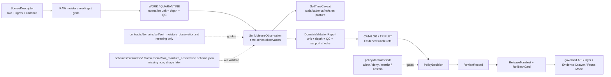

<!-- [KFM_META_BLOCK_V2]
doc_id: kfm://doc/contracts-domains-soil-soil-moisture-observation
title: Soil Moisture Observation Contract — Soil
type: semantic-contract; time-series-observation-profile
version: v0.2
status: draft; PROPOSED; schema-missing; canonical-working-lane; support-type-separation-required; depth-unit-qc-required; NEEDS VERIFICATION before promotion
owners:
  - OWNER_TBD — Soil domain steward
  - OWNER_TBD — Contracts steward
  - OWNER_TBD — Schema steward
  - OWNER_TBD — Source steward
  - OWNER_TBD — Evidence steward
  - OWNER_TBD — Policy steward
  - OWNER_TBD — Release steward
  - OWNER_TBD — Docs steward
created: NEEDS VERIFICATION — scaffold existed before v0.2 expansion
updated: 2026-06-23
policy_label: public; contracts; soil; soil-moisture-observation; time-series-observation; station-soil-moisture; satellite-grid-soil-moisture; source-role-aware; support-type-separation; depth-aware; unit-aware; qc-aware; cadence-aware; temporal-scope-aware; evidence-bound; schema-missing; release-gated; rollback-aware; not-survey-map-unit; not-gridded-derivative-by-default; not-current-countywide-truth; not-operational-private-sensor-default; not-etl-code; not-release-approval; not-direct-data-access
tags: [kfm, contracts, soil, soil-moisture-observation, SoilMoistureObservation, station_soil_moisture, satellite_grid_soil_moisture, Kansas Mesonet, SCAN, USCRN, SMAP, SoilMapUnit, SoilComponent, Horizon, SoilProperty, SoilTimeCaveat, DomainFeatureIdentity, DomainObservation, DomainLayerDescriptor, DomainValidationReport, SourceDescriptor, EvidenceRef, EvidenceBundle, PolicyDecision, ReviewRecord, ReleaseManifest, RollbackCard]
related:
  - ./README.md
  - ./domain_feature_identity.md
  - ./domain_observation.md
  - ./domain_layer_descriptor.md
  - ./domain_validation_report.md
  - ./soil_map_unit.md
  - ./soil_component.md
  - ./horizon.md
  - ./soil_property.md
  - ./hydrologic_soil_group.md
  - ./pedon.md
  - ./soil_profile_view.md
  - ./pedon_soil_profile_view.md
  - ./erosion_risk.md
  - ./suitability_rating.md
  - ./soil_time_caveat.md
  - ../../../docs/domains/soil/README.md
  - ../../../docs/domains/soil/CANONICAL_PATHS.md
  - ../../../docs/domains/soil/ARCHITECTURE.md
  - ../../../docs/domains/soil/API_CONTRACTS.md
  - ../../../docs/domains/soil/DATA_LIFECYCLE.md
  - ../../../pipelines/domains/soil/README.md
  - ../../../schemas/contracts/v1/domains/soil/soil_moisture_observation.schema.json
  - ../../../schemas/contracts/v1/domains/soil/README.md
  - ../../../policy/domains/soil/README.md
  - ../../../fixtures/domains/soil/soil_moisture_observation/
  - ../../../tests/domains/soil/
  - ../../../release/candidates/soil/
notes:
  - "Expanded from a PROPOSED scaffold at contracts/domains/soil/soil_moisture_observation.md."
  - "A paired schema at schemas/contracts/v1/domains/soil/soil_moisture_observation.schema.json was not found in this task. Field realization remains PROPOSED."
  - "Soil architecture defines Soil Moisture Observation as a confirmed term for a time-series observation that is depth- and unit-tagged, with field shape still PROPOSED."
  - "The Soil contract README states Soil Moisture Observation defines time-series soil moisture observation semantics and that station, satellite, and survey support must not collapse."
  - "Soil API posture names soil-moisture unit/depth/QC as a proposed validator family, and states Mesonet/SCAN/USCRN station readings and SMAP satellite grid support are not interchangeable."
  - "This contract defines soil-moisture-observation meaning only; it does not implement schema validation, ETL, source activation, public API behavior, release approval, map rendering, or AI answers."
[/KFM_META_BLOCK_V2] -->

<a id="top"></a>

# Soil Moisture Observation Contract — Soil

> Semantic contract for `SoilMoistureObservation`: the Soil-domain time-series moisture observation object that carries source-scoped readings with unit, depth, cadence, quality-control, spatial support, time scope, evidence, policy, release, and rollback posture kept inspectable.

<p>
  
  
  
  
  
  
  
</p>

`contracts/domains/soil/soil_moisture_observation.md`

## Quick jumps

[Status](#status) · [Meaning](#meaning) · [Repo fit](#repo-fit) · [Schema posture](#schema-posture) · [Accepted uses](#accepted-uses) · [Exclusions](#exclusions) · [Recommended fields](#recommended-fields) · [Observation model](#observation-model) · [Observation families](#observation-families) · [Source-role and support rules](#source-role-and-support-rules) · [Sensitivity and publication posture](#sensitivity-and-publication-posture) · [Invariants](#invariants) · [Lifecycle](#lifecycle) · [Validation](#validation) · [Rollback](#rollback) · [Evidence basis](#evidence-basis) · [Open questions](#open-questions)

---

## Status

> [!IMPORTANT]
> **Status:** `draft` / semantic contract / time-series observation profile  
> **Owner:** `OWNER_TBD`  
> **Contract path:** `contracts/domains/soil/soil_moisture_observation.md`  
> **Schema path checked:** `schemas/contracts/v1/domains/soil/soil_moisture_observation.schema.json` — **not found in this task**  
> **Truth posture:** target path, prior scaffold, Soil contract-lane README, Soil architecture, Soil lifecycle inventory, Soil API posture, and sibling Soil contracts are confirmed from current repo evidence. Field-level shape, schema enforcement, validators, fixtures, policy tests, ETL behavior, source registry records, release manifests, governed API routes, public API behavior, map rendering, graph behavior, and runtime behavior remain **NEEDS VERIFICATION**.

> [!CAUTION]
> `SoilMoistureObservation` is a source-scoped time-series observation. It is **not** a soil survey map unit, not a gridded derivative by default, not countywide truth, not private operational sensor truth, not release approval, and not AI authority.

---

## Meaning

`SoilMoistureObservation` records a source-scoped soil moisture reading or time-series value with enough context to prevent false precision and support-type collapse.

It may carry or support:

- station/source identifiers for Mesonet/SCAN/USCRN-style in-situ measurements;
- satellite/grid identifiers for SMAP-style gridded observations;
- observation time, cadence, revision time, retrieval time, valid time, release time, and correction time;
- unit and measurement type, such as volumetric water content or another source-defined moisture measure;
- depth or sensor/profile support where material;
- QC flags, stale-state, missing-value posture, sensor/source quality notes, and limitation text;
- links to `DomainObservation`, `DomainFeatureIdentity`, `DomainLayerDescriptor`, `DomainValidationReport`, and `SoilTimeCaveat` records;
- EvidenceBundle, policy, review, release, and rollback refs.

The object answers:

- Which source and support type produced the soil moisture value?
- Was this a station reading, satellite grid value, derived product, candidate reading, or denied/abstained value?
- What unit, depth, cadence, QC, time, scale/resolution, and source-vintage context controls use?
- Which public projection, if any, is allowed after validation, policy, review, release, and rollback closure?
- What does the observation **not** prove?

A soil moisture observation is a **time-aware evidence-bearing reading**. It can support trend displays, stale-state badges, Evidence Drawer explanations, and Focus Mode caveated answers after governance. It cannot silently become SSURGO survey truth, a gridded derivative, a station-independent surface, or public operational/private sensor disclosure.

---

## Repo fit

| Responsibility | Path | Role |
|---|---|---|
| Contract lane | `contracts/domains/soil/soil_moisture_observation.md` | This semantic SoilMoistureObservation contract. |
| Soil contract README | `contracts/domains/soil/README.md` | Defines Soil Moisture Observation as time-series moisture semantics and warns station, satellite, and survey support must not collapse. |
| Paired schema | `schemas/contracts/v1/domains/soil/soil_moisture_observation.schema.json` | Not found in this task; do not infer machine shape. |
| Observation companion | `contracts/domains/soil/domain_observation.md` | Source-scoped observation envelope; SoilMoistureObservation is a specialized moisture reading/profile. |
| Identity companion | `contracts/domains/soil/domain_feature_identity.md` | Observation identity should preserve source role, object role, time scope, and normalized digest posture. |
| Layer companion | `contracts/domains/soil/domain_layer_descriptor.md` | Any station/satellite layer is a governed projection, not canonical/internal store access. |
| Validation companion | `contracts/domains/soil/domain_validation_report.md` | Validation may check unit, depth, QC, cadence, support type, EvidenceBundle, and release gates. |
| SoilTimeCaveat companion | `contracts/domains/soil/soil_time_caveat.md` | Stale-state, cadence, revision, and temporal limitation markers must remain attached. |
| Soil architecture | `docs/domains/soil/ARCHITECTURE.md` | Defines Soil Moisture Observation as a confirmed term and object family with proposed field realization. |
| Soil API posture | `docs/domains/soil/API_CONTRACTS.md` | Defines finite outcomes, support-type separation, soil-moisture unit/depth/QC validator family, and sensitivity posture. |
| Soil lifecycle inventory | `docs/domains/soil/DATA_LIFECYCLE.md` | Lists Soil Moisture Observation among owned Soil object families and identifies station/satellite source families. |
| Policy | `policy/domains/soil/` | Allow/deny/restrict/abstain, rights, sensitivity, stale-state, source-role, and release gating. |
| Tests / fixtures | `tests/domains/soil/`, `fixtures/domains/soil/soil_moisture_observation/` | Expected proof surfaces; maturity not verified here. |
| Release / rollback | `release/candidates/soil/` and release roots | Publication, correction, and rollback authority. |

---

## Schema posture

A direct paired schema was checked at:

```text
schemas/contracts/v1/domains/soil/soil_moisture_observation.schema.json
```

That file was **not found** in this task.

> [!WARNING]
> Because no paired schema was confirmed, every field below is **PROPOSED** semantic guidance. Do not treat it as machine-enforced until schema, fixtures, validators, policy tests, release checks, governed API behavior, and runtime behavior are verified.

---

## Accepted uses

| Use | Allowed? | Rule |
|---|---:|---|
| Defining source-scoped soil moisture reading semantics | Yes | Must preserve source, support type, unit, depth, QC, cadence, time scope, evidence, and limitations. |
| Supporting station time-series displays | Conditional | Requires station support type, unit/depth/QC/cadence, evidence, policy, release, and stale-state handling. |
| Supporting satellite-grid moisture displays | Conditional | Requires grid support type, resolution, product/revision time, evidence, policy, release, and caveats. |
| Supporting Evidence Drawer / Focus Mode moisture explanation | Conditional | Must cite released evidence and preserve finite outcomes. |
| Supporting stale-state or revision notices | Yes | SoilTimeCaveat should remain attached where cadence, stale-state, or source revision matters. |
| Treating station observations as gridded surfaces or survey polygons | No | Must DENY or ABSTAIN where support type would collapse. |
| Treating SMAP grid cells as station readings or SSURGO map units | No | Must DENY support-type collapse. |
| Publishing operational/private sensor data by default | No | Review/restrict/deny depending on source, rights, and sensitivity. |

---

## Exclusions

`SoilMoistureObservation` must not be used as:

| Misuse | Required outcome |
|---|---|
| SSURGO / survey map-unit truth | Use SoilMapUnit and authoritative_static_soil support. |
| Gridded derivative by default | Use DomainLayerDescriptor and satellite/grid or derivative support semantics. |
| Countywide surface from one station | Use appropriate interpolation/derivative contract if ever created, with explicit method and release gates. |
| Private operational sensor disclosure | Use policy review; deny, restrict, aggregate, or redact where needed. |
| SoilProperty truth without method/unit/depth support | Use SoilProperty where property semantics are needed. |
| SourceDescriptor or source registry record | Use source registry roots and SourceDescriptor contracts. |
| ETL implementation or sensor parser | Use pipelines/packages and tests. |
| JSON Schema / machine validation | Use schema roots after schema creation. |
| Release approval | Use PolicyDecision, ReviewRecord, ReleaseManifest, correction path, and RollbackCard. |
| AI answer authority | Focus Mode remains evidence-subordinate and finite-outcome constrained. |

---

## Recommended fields

The following fields are **PROPOSED** until a paired schema is added and validated.

| Field | Meaning |
|---|---|
| `id` | Canonical SoilMoistureObservation identifier. |
| `version` | Contract/object version. |
| `spec_hash` | Deterministic hash over normalized observation content. |
| `domain` | Expected value: `soil`. |
| `support_type` | `station_soil_moisture`, `satellite_grid_soil_moisture`, or schema-selected equivalent; must not be omitted. |
| `source_ref` | SourceDescriptor/source registry ref. |
| `source_role` | Source role for this observation use. |
| `source_native_id` | Station ID, grid cell ID, product ID, row ID, or source-specific observation ID. |
| `source_native_key_family` | Station, satellite grid, product, depth sensor, source-specific key, etc. |
| `observation_subject_ref` | Station, grid cell, profile, feature, layer feature, or aggregate subject ref. |
| `observation_value` | Source-scoped moisture value. |
| `observation_unit` | Unit or measurement basis. |
| `measurement_type` | Volumetric, gravimetric, source-specific, modeled estimate, retrieval, or other schema-selected type. |
| `depth` | Sensor/profile/grid depth where applicable. |
| `depth_unit` | Depth unit. |
| `depth_context` | Sensor depth, profile depth, retrieval depth band, or source-specific context. |
| `qc_flags` | Quality-control, missing-value, stale-state, revision, sensor, source, or product flags. |
| `cadence` | Expected source update/observation cadence where known. |
| `observed_time` | Time the observation was made. |
| `source_time` | Source publication/update time. |
| `valid_time` | Interval the observation applies to, if known. |
| `retrieval_time` | KFM retrieval/freeze time. |
| `release_time` | KFM release time, if released. |
| `correction_time` | Correction/supersession time, if corrected. |
| `scale_or_resolution` | Station support, grid resolution, product resolution, or display resolution. |
| `location_ref` | Station/grid/profile location support, generalized location, hidden location, or denied location marker. |
| `public_geometry_rule` | Exact, generalized, aggregate, hidden, denied, or review-only posture. |
| `evidence_refs` | EvidenceRefs or EvidenceBundle refs. |
| `time_caveat_ref` | SoilTimeCaveat ref for stale or time-bounded observations. |
| `validation_report_ref` | DomainValidationReport ref for unit/depth/QC/cadence/support checks. |
| `policy_decision_ref` | PolicyDecision governing use/publication. |
| `review_ref` | ReviewRecord or steward review ref. |
| `layer_descriptor_ref` | DomainLayerDescriptor ref if rendered. |
| `release_manifest_ref` | ReleaseManifest or MapReleaseManifest ref. |
| `rollback_ref` | RollbackCard or rollback target. |
| `limitations` | Caveats: observation only; not survey map unit, not countywide truth, not operational private sensor publication, not release approval. |

---

## Observation model

A reviewed SoilMoistureObservation should bind source identity, support type, value, unit, depth, QC, cadence, temporal scope, spatial support, evidence, validation, policy, release, and rollback.

```text
soil_moisture_observation = {
  domain,
  support_type,
  source_ref,
  source_role,
  source_native_id,
  source_native_key_family,
  observation_subject_ref,
  observation_value,
  observation_unit,
  measurement_type,
  depth,
  depth_unit,
  depth_context,
  qc_flags,
  cadence,
  temporal_scope,
  scale_or_resolution,
  location_ref,
  public_geometry_rule,
  evidence_refs,
  time_caveat_ref,
  validation_report_ref,
  policy_decision_ref,
  review_ref,
  layer_descriptor_ref,
  release_manifest_ref,
  rollback_ref
}
```

The exact serialized shape is **NEEDS VERIFICATION** until the schema and validators are field-complete.

---

## Observation families

| Observation family | Meaning | Guardrail |
|---|---|---|
| `station_reading` | In-situ soil moisture station/sensor observation. | Not a gridded surface or survey polygon. |
| `station_time_series` | Ordered station observations over time. | Cadence, stale-state, unit/depth/QC must remain visible. |
| `satellite_grid_retrieval` | Satellite/grid product observation or retrieval. | Resolution and product/revision time required; not a station reading. |
| `satellite_grid_time_series` | Ordered grid-cell observations over time. | Grid support and resolution caveats required. |
| `profile_or_depth_reading` | Profile-linked or depth-band moisture observation. | Depth/profile context required; not continuous truth by itself. |
| `candidate_observation` | Provisional/model/OCR/connector-derived moisture observation. | Review only until validated and released. |
| `denied_or_abstained_observation` | Moisture observation cannot be used under current evidence/policy. | Emit finite outcome and reason, not unsupported value. |

---

## Source-role and support rules

| Rule | Requirement |
|---|---|
| Support type is mandatory | Station readings, satellite grid products, survey attributes, and derivatives are not interchangeable. |
| Unit is mandatory where value is numeric | Do not publish or compare moisture values without unit/measurement basis. |
| Depth is mandatory where source support is depth-specific | Station/profile/depth-band values must preserve depth and depth unit. |
| QC is part of meaning | QC, stale-state, missing-value, revision, and source flags must not be dropped. |
| Cadence is part of public interpretation | Observation age and source cadence must be visible where stale-state matters. |
| Station is not surface | One station reading cannot silently become countywide or polygon truth. |
| Satellite grid is not station | SMAP-like grid support cannot masquerade as a station or survey polygon. |
| Operational/private sensors fail closed | Owner/farm/parcel/operational joins require policy review and often DENY/RESTRICT. |
| Time axes remain separate | Observed time, source time, valid time, retrieval time, release time, and correction time must not collapse. |
| Public claims require EvidenceBundle resolution | If evidence cannot resolve, return ABSTAIN, DENY, or ERROR; do not invent the observation. |

---

## Sensitivity and publication posture

| Surface | Default posture | Reason |
|---|---|---|
| Public station observation | Public-safe if source, rights, unit/depth/QC, cadence, evidence, policy, and release support it | Public station readings can be safe when caveated. |
| Public satellite grid observation | Public-safe if source, rights, resolution, revision/cadence, evidence, policy, and release support it | Grid products need resolution and retrieval caveats. |
| Operational/private sensor data | Review / restrict / deny by default | Private field operations or owner-linked sensors are not public-by-default. |
| Station joined to owner/farm/parcel | DENY / restrict / hold by default | Owner-identifying joins are outside default public Soil context. |
| Candidate/model-generated moisture observation | Review only | Candidate observations do not become public truth. |
| Focus Mode explanation | Released/cited only | AI must cite EvidenceBundle/release and preserve unit/depth/QC/cadence caveats. |

---

## Invariants

1. **SoilMoistureObservation is an observation, not a survey unit.** It must not masquerade as SSURGO/SoilMapUnit truth.
2. **Station, satellite, survey, profile, and derivative support do not collapse.** Support type is part of meaning.
3. **Unit, depth, QC, and cadence are first-class.** Missing material context blocks public truth posture.
4. **Observation time is not source time.** Observed, source, valid, retrieval, release, and correction times remain distinct.
5. **Location posture matters.** Station/grid/profile location may need generalization, hiding, denial, or review.
6. **Operational/private sensors fail closed.** Public-safe default does not apply to owner/farm/private operational joins.
7. **Evidence closure is required.** Consequential public claims require EvidenceRef to resolve to EvidenceBundle.
8. **Validation is bounded.** Unit/depth/QC checks support trust; they do not publish or approve release.
9. **Release is separate.** Public display requires PolicyDecision, ReviewRecord, ReleaseManifest, and RollbackCard where required.
10. **AI is downstream.** Focus Mode may explain released moisture context only with citation closure and caveats.
11. **No direct internal-store reads.** Public clients use governed APIs and released artifacts only.

---

## Lifecycle



---

## Validation

Before this contract is treated as mature, maintainers should verify:

- [ ] paired schema exists or an ADR declares a different soil-moisture-observation shape home;
- [ ] schema includes source refs, source role, support type, native key family, subject ref, value, unit, measurement type, depth, depth unit, QC flags, cadence, time axes, scale/resolution, location posture, EvidenceBundle refs, time caveat, validation/policy/review/release/rollback refs, and limitations;
- [ ] fixtures cover station reading, station time series, satellite grid retrieval, satellite grid time series, profile/depth reading, missing unit, missing depth, invalid QC, stale observation, support-type collapse, operational/private sensor denial, candidate observation, denied observation, and released observation;
- [ ] validators check unit presence, measurement basis, depth context, QC flags, cadence/stale-state, support-type separation, EvidenceBundle resolution, sensitivity joins, and release preflight;
- [ ] tests prevent soil moisture observations from becoming SSURGO/SoilMapUnit truth, gridded derivative truth, countywide surface truth, operational/private sensor disclosure, release approval, or AI authority;
- [ ] tests enforce ABSTAIN/DENY/ERROR/HOLD when evidence, source role, support type, unit, depth, QC, cadence, location posture, policy, release, or runtime evaluation is unresolved;
- [ ] public map, Evidence Drawer, Focus Mode, exports, and AI summaries use only released/governed soil moisture projections;
- [ ] rollback invalidates linked time caveats, observations, identities, layer descriptors, drawer payloads, exports, caches, graph projections, and AI summaries that cited a withdrawn moisture observation.

---

## Rollback

Rollback is required if this contract:

- claims schema, validator, fixture, test, policy, release, API, ETL, station parser, satellite product handler, map, graph, or runtime behavior exists without proof;
- treats SoilMoistureObservation as survey truth, current countywide truth, gridded derivative by default, private operational sensor publication, release approval, public API proof, or AI authority;
- weakens support-type separation;
- hides unit, depth, QC, cadence, source-role conflict, source/revision time, stale-state, candidate status, location posture, supersession, or correction lineage;
- exposes farm-specific, owner-specific, parcel-specific, operational, or private sensor detail without policy/release support;
- normalizes direct UI access to internal lifecycle stores or direct model output.

Rollback target: revert `contracts/domains/soil/soil_moisture_observation.md` to prior scaffold blob `486a94e8a1fd8daee2bdab272aaa47160f8ba472`, record drift if authority boundaries were affected, and invalidate downstream derivatives that relied on weakened SoilMoistureObservation semantics.

---

## Evidence basis

| Evidence | Status | Supports | Limits |
|---|---|---|---|
| Prior `contracts/domains/soil/soil_moisture_observation.md` | `CONFIRMED` | Target file existed as a planned-path scaffold sourced from Soil continuity/lifecycle docs. | Scaffold did not define authoritative semantic contract content. |
| Paired schema lookup | `CONFIRMED not found in this task` | Justifies schema-missing posture. | Does not rule out alternate schema names or future ADR-selected homes. |
| `contracts/domains/soil/README.md` | `CONFIRMED contract-lane rule` | Defines Soil Moisture Observation as time-series semantics; states station, satellite, and survey support must not collapse; requires support-type separation and EvidenceBundle closure. | Does not prove object schema, validator, or release maturity. |
| `docs/domains/soil/ARCHITECTURE.md` | `CONFIRMED doctrine / PROPOSED field realization` | Defines Soil Moisture Observation as time-series observation, depth- and unit-tagged, and all-six-time-facet object family. | Does not prove implementation. |
| `docs/domains/soil/API_CONTRACTS.md` | `CONFIRMED doctrine / PROPOSED implementation` | Defines finite outcomes, support-type separation, station/satellite moisture support, soil-moisture unit/depth/QC validator family, sensitivity posture, and EvidenceBundle/release gates. | Route names, validator code, and runtime behavior remain UNKNOWN / NEEDS VERIFICATION. |
| `docs/domains/soil/DATA_LIFECYCLE.md` | `CONFIRMED navigational register / PROPOSED implementation` | Lists Soil Moisture Observation among owned Soil object families and lists Kansas Mesonet, NRCS SCAN, NOAA USCRN, and NASA SMAP among source families. | It is a navigational register, not implementation proof. |
| `contracts/domains/soil/domain_observation.md` | `CONFIRMED sibling contract` | Defines observations as source-scoped evidence-bearing claims and separates observation from release approval. | Its schema is a stub. |
| `contracts/domains/soil/domain_layer_descriptor.md` | `CONFIRMED sibling contract` | Defines layers as governed projections, not source or object truth. | Its schema is a stub. |
| `contracts/domains/soil/domain_validation_report.md` | `CONFIRMED sibling contract` | Defines validation as check evidence, not policy or release authority. | Its schema is a stub. |
| Uploaded KFM authoring prompt v2 | `CONFIRMED user-supplied guidance` | Requires evidence-first, implementation-honest, visually polished Markdown with visible verification and rollback posture. | Authoring guidance, not implementation proof. |

---

## Open questions

| ID | Question | Status |
|---|---|---|
| OQ-SOIL-SMO-01 | Should `SoilMoistureObservation` have its own schema, or inherit from a cross-domain time-series observation schema? | OPEN / DOMAIN + SCHEMA REVIEW |
| OQ-SOIL-SMO-02 | Which measurement types, units, depth fields, QC flags, and cadence fields are canonical across Mesonet, SCAN, USCRN, and SMAP-style products? | OPEN / SOURCE + SCHEMA REVIEW |
| OQ-SOIL-SMO-03 | Which station/grid/profile location posture fields are mandatory for public display? | OPEN / POLICY + MAP/UI REVIEW |
| OQ-SOIL-SMO-04 | Which validators prove station vs satellite vs survey support separation and stale-state correctness? | OPEN / VALIDATION REVIEW |
| OQ-SOIL-SMO-05 | How should Evidence Drawer and Focus Mode show moisture values without implying gridded, countywide, or current survey truth? | OPEN / MAP/UI REVIEW |
| OQ-SOIL-SMO-06 | How should rollback invalidate time caveats, layers, drawer payloads, Focus Mode claims, exports, caches, graph projections, and AI summaries after a moisture observation correction? | OPEN / RELEASE REVIEW |

<p align="right"><a href="#top">Back to top</a></p>
