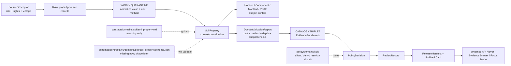

<!-- [KFM_META_BLOCK_V2]
doc_id: kfm://doc/contracts-domains-soil-soil-property
title: Soil Property Contract — Soil
type: semantic-contract; property-profile
version: v0.2
status: draft; PROPOSED; schema-missing; canonical-working-lane; support-type-separation-required; method-unit-depth-required; NEEDS VERIFICATION before promotion
owners:
  - OWNER_TBD — Soil domain steward
  - OWNER_TBD — Contracts steward
  - OWNER_TBD — Schema steward
  - OWNER_TBD — Source steward
  - OWNER_TBD — Evidence steward
  - OWNER_TBD — Policy steward
  - OWNER_TBD — Release steward
  - OWNER_TBD — Docs steward
created: NEEDS VERIFICATION — scaffold existed before v0.2 expansion
updated: 2026-06-23
policy_label: public; contracts; soil; soil-property; measured-attribute; derived-attribute; method-aware; unit-aware; depth-aware; source-role-aware; support-type-separation; temporal-scope-aware; evidence-bound; schema-missing; release-gated; rollback-aware; not-map-unit-truth; not-component-truth; not-horizon-truth; not-field-condition-by-default; not-etl-code; not-release-approval; not-direct-data-access
tags: [kfm, contracts, soil, soil-property, SoilProperty, measured, derived, method, unit, depth, SoilMapUnit, SoilComponent, Horizon, ComponentHorizonJoin, HydrologicSoilGroup, SoilMoistureObservation, Pedon, SoilProfileView, ErosionRisk, SuitabilityRating, SoilTimeCaveat, DomainFeatureIdentity, DomainObservation, DomainLayerDescriptor, DomainValidationReport, SourceDescriptor, EvidenceRef, EvidenceBundle, PolicyDecision, ReviewRecord, ReleaseManifest, RollbackCard]
related:
  - ./README.md
  - ./domain_feature_identity.md
  - ./domain_observation.md
  - ./domain_layer_descriptor.md
  - ./domain_validation_report.md
  - ./component_horizon_join.md
  - ./soil_map_unit.md
  - ./soil_component.md
  - ./horizon.md
  - ./hydrologic_soil_group.md
  - ./soil_moisture_observation.md
  - ./pedon.md
  - ./soil_profile_view.md
  - ./pedon_soil_profile_view.md
  - ./erosion_risk.md
  - ./suitability_rating.md
  - ./soil_time_caveat.md
  - ../../../docs/domains/soil/README.md
  - ../../../docs/domains/soil/CANONICAL_PATHS.md
  - ../../../docs/domains/soil/ARCHITECTURE.md
  - ../../../docs/domains/soil/API_CONTRACTS.md
  - ../../../docs/domains/soil/DATA_LIFECYCLE.md
  - ../../../pipelines/domains/soil/README.md
  - ../../../schemas/contracts/v1/domains/soil/soil_property.schema.json
  - ../../../schemas/contracts/v1/domains/soil/README.md
  - ../../../policy/domains/soil/README.md
  - ../../../fixtures/domains/soil/soil_property/
  - ../../../tests/domains/soil/
  - ../../../release/candidates/soil/
notes:
  - "Expanded from a PROPOSED scaffold at contracts/domains/soil/soil_property.md."
  - "A paired schema at schemas/contracts/v1/domains/soil/soil_property.schema.json was not found in this task. Field realization remains PROPOSED."
  - "Soil architecture defines SoilProperty as a confirmed term for a measured/derived attribute of a horizon or component, with field shape still PROPOSED."
  - "The Soil contract README states SoilProperty defines measured or derived soil attribute meaning and must preserve source role, units, method, depth, and support type."
  - "Support-type separation remains mandatory: static survey, gridded derivative, station observation, satellite grid, pedon/profile evidence, and interpretation cannot be collapsed by property use."
  - "This contract defines property meaning only; it does not implement schema validation, ETL, source activation, public API behavior, release approval, map rendering, or AI answers."
[/KFM_META_BLOCK_V2] -->

<a id="top"></a>

# Soil Property Contract — Soil

> Semantic contract for `SoilProperty`: the Soil-domain measured or derived attribute object that carries a soil value with source role, unit, method, depth/profile context, support type, time/vintage, evidence, validation, release posture, and rollback lineage kept inspectable.

<p>
  
  
  
  
  
  
  
</p>

`contracts/domains/soil/soil_property.md`

## Quick jumps

[Status](#status) · [Meaning](#meaning) · [Repo fit](#repo-fit) · [Schema posture](#schema-posture) · [Accepted uses](#accepted-uses) · [Exclusions](#exclusions) · [Recommended fields](#recommended-fields) · [Property model](#property-model) · [Property families](#property-families) · [Source-role and support rules](#source-role-and-support-rules) · [Sensitivity and publication posture](#sensitivity-and-publication-posture) · [Invariants](#invariants) · [Lifecycle](#lifecycle) · [Validation](#validation) · [Rollback](#rollback) · [Evidence basis](#evidence-basis) · [Open questions](#open-questions)

---

## Status

> [!IMPORTANT]
> **Status:** `draft` / semantic contract / property profile  
> **Owner:** `OWNER_TBD`  
> **Contract path:** `contracts/domains/soil/soil_property.md`  
> **Schema path checked:** `schemas/contracts/v1/domains/soil/soil_property.schema.json` — **not found in this task**  
> **Truth posture:** target path, prior scaffold, Soil contract-lane README, Soil architecture, Soil lifecycle inventory, Soil API posture, and sibling Soil contracts are confirmed from current repo evidence. Field-level shape, schema enforcement, validators, fixtures, policy tests, ETL behavior, source registry records, release manifests, governed API routes, public API behavior, map rendering, graph behavior, and runtime behavior remain **NEEDS VERIFICATION**.

> [!CAUTION]
> `SoilProperty` is a source-scoped measured or derived soil attribute. It is **not** the map unit, not the component, not the horizon, not current field condition by default, not release approval, and not AI authority.

---

## Meaning

`SoilProperty` records a source-scoped soil attribute value or estimate with enough context to make the value inspectable and safe to compare.

It may carry or support:

- measured, estimated, derived, classified, or source-carried soil attribute values;
- source-native property keys or row identifiers where available;
- property name, value, unit, method, depth/profile context, and scale/resolution;
- links to `SoilMapUnit`, `SoilComponent`, `Horizon`, `ComponentHorizonJoin`, `Pedon`, `SoilProfileView`, and `SoilTimeCaveat` records;
- source role, support type, source time, observed time, valid time, retrieval time, release time, and correction state;
- EvidenceBundle, validation, policy, review, release, and rollback refs.

The object answers:

- Which soil attribute is being asserted?
- Which source, method, unit, support type, depth/profile context, and time/vintage make the value meaningful?
- Is the value measured, derived, estimated, interpreted, candidate, stale, contested, or denied?
- Which feature or profile context may cite the property without absorbing it?
- What public display, if any, is allowed after validation, policy, review, release, and rollback closure?
- What does the property **not** prove?

A soil property is a **context-bound value**. It can support component summaries, horizon/profile explanations, interpretations, public-safe layer context, Evidence Drawer entries, and Focus Mode caveated answers. It cannot by itself certify a whole map unit, current field condition, farm suitability, hazard state, or operational recommendation.

---

## Repo fit

| Responsibility | Path | Role |
|---|---|---|
| Contract lane | `contracts/domains/soil/soil_property.md` | This semantic SoilProperty contract. |
| Soil contract README | `contracts/domains/soil/README.md` | Defines SoilProperty as measured or derived attribute meaning and requires source role, units, method, depth, and support type. |
| Paired schema | `schemas/contracts/v1/domains/soil/soil_property.schema.json` | Not found in this task; do not infer machine shape. |
| Identity companion | `contracts/domains/soil/domain_feature_identity.md` | Property identity should preserve source role, object role, time scope, and digest posture. |
| Observation companion | `contracts/domains/soil/domain_observation.md` | Observations may assert property data; they do not become property truth by themselves. |
| Map-unit companion | `contracts/domains/soil/soil_map_unit.md` | Property may cite map-unit context but does not become map-unit truth. |
| Component companion | `contracts/domains/soil/soil_component.md` | Property may cite component context but does not become component truth. |
| Horizon companion | `contracts/domains/soil/horizon.md` | Property may cite horizon/depth context but does not become horizon truth. |
| Layer companion | `contracts/domains/soil/domain_layer_descriptor.md` | Any property layer is a governed projection, not canonical/internal store access. |
| Validation companion | `contracts/domains/soil/domain_validation_report.md` | Validation may check method, unit, depth, support type, EvidenceBundle, and release gates. |
| Soil architecture | `docs/domains/soil/ARCHITECTURE.md` | Defines SoilProperty as a confirmed term and object family with proposed field realization. |
| Soil API posture | `docs/domains/soil/API_CONTRACTS.md` | Defines finite outcomes, support-type separation, public-surface gates, and forbidden behavior. |
| Soil lifecycle inventory | `docs/domains/soil/DATA_LIFECYCLE.md` | Lists SoilProperty among owned Soil object families and preserves promotion model. |
| Policy | `policy/domains/soil/` | Allow/deny/restrict/abstain, rights, sensitivity, stale-state, source-role, and release gating. |
| Tests / fixtures | `tests/domains/soil/`, `fixtures/domains/soil/soil_property/` | Expected proof surfaces; maturity not verified here. |
| Release / rollback | `release/candidates/soil/` and release roots | Publication, correction, and rollback authority. |

---

## Schema posture

A direct paired schema was checked at:

```text
schemas/contracts/v1/domains/soil/soil_property.schema.json
```

That file was **not found** in this task.

> [!WARNING]
> Because no paired schema was confirmed, every field below is **PROPOSED** semantic guidance. Do not treat it as machine-enforced until schema, fixtures, validators, policy tests, release checks, governed API behavior, and runtime behavior are verified.

---

## Accepted uses

| Use | Allowed? | Rule |
|---|---:|---|
| Defining measured or derived soil attribute meaning | Yes | Must preserve property name, value, unit, method, depth/profile context, source role, support type, evidence, and time scope. |
| Supporting component or horizon summaries | Conditional | Must cite component/horizon/profile context and not collapse object responsibilities. |
| Supporting interpretive products | Conditional | Interpretation objects must retain their own method, input, limitation, and release posture. |
| Supporting released property layer context | Conditional | Requires DomainLayerDescriptor, validation, EvidenceBundle, policy, review, ReleaseManifest, and rollback target. |
| Supporting Evidence Drawer / Focus Mode property explanation | Conditional | Must cite released evidence and preserve unit/method/depth caveats. |
| Comparing property values across sources or vintages | Conditional | Must preserve support type, unit conversion posture, method, source vintage, and time scope. |
| Treating a property as whole map-unit, component, horizon, field-condition, or operational truth by itself | No | Use owning objects and evidence closure. |
| Publishing property values without unit/method/depth where material | No | ABSTAIN, DENY, or ERROR depending on surface and reason. |

---

## Exclusions

`SoilProperty` must not be used as:

| Misuse | Required outcome |
|---|---|
| Whole map-unit truth | Use `SoilMapUnit` and source/evidence closure. |
| Whole component truth | Use `SoilComponent` and component evidence. |
| Horizon truth | Use `Horizon` and depth/profile context. |
| Current field condition by default | Use current observation sources and stale-state policy. |
| Legal, engineering, crop, hazard, or operational recommendation | Use owning lanes and policy/release controls. |
| SourceDescriptor or source registry record | Use source registry roots and SourceDescriptor contracts. |
| ETL implementation or property parser/converter | Use pipelines/packages and tests. |
| JSON Schema / machine validation | Use schema roots after schema creation. |
| Release approval | Use PolicyDecision, ReviewRecord, ReleaseManifest, correction path, and RollbackCard. |
| AI answer authority | Focus Mode remains evidence-subordinate and finite-outcome constrained. |

---

## Recommended fields

The following fields are **PROPOSED** until a paired schema is added and validated.

| Field | Meaning |
|---|---|
| `id` | Canonical SoilProperty identifier. |
| `version` | Contract/object version. |
| `spec_hash` | Deterministic hash over normalized property content. |
| `domain` | Expected value: `soil`. |
| `support_type` | Static survey, gridded derivative, station observation, satellite grid, pedon/profile, interpretation, or schema-selected equivalent. |
| `source_ref` | SourceDescriptor/source registry ref. |
| `source_role` | Source role for this property use. |
| `source_native_id` | Source-native row/property key or ID, if available. |
| `source_native_key_family` | Property key, CHKEY, COKEY, MUKEY, station/grid key, pedon/profile key, or source-specific key. |
| `property_subject_ref` | Map unit, component, horizon, pedon/profile, observation, layer feature, or aggregate subject ref. |
| `property_subject_family` | SoilMapUnit, SoilComponent, Horizon, Pedon, SoilProfileView, SoilMoistureObservation, or related family. |
| `property_name` | Source-supported attribute/property name. |
| `property_value` | Measured, estimated, derived, categorical, numeric, narrative, or source-specific value. |
| `property_unit` | Unit or value scheme; required where material. |
| `value_basis` | Measured, derived, estimated, classified, interpreted, candidate, source-carried, or source-specific basis. |
| `method_ref` | Measurement, lab, survey, model, derivation, interpretation, or source method ref. |
| `depth_or_profile_scope` | Depth interval, horizon ref, profile scope, sensor depth, or grid layer scope where material. |
| `scale_or_resolution` | Survey scale, raster/grid resolution, station support, profile locality, or aggregation unit. |
| `quality_flags` | QC, uncertainty, stale-state, candidate, model-assisted, reviewed, contested, denied, or source-specific flags. |
| `observed_time` | Measurement/observation time where applicable. |
| `source_time` | Source creation/publication/update time. |
| `valid_time` | Interval the property applies to, if known. |
| `retrieval_time` | KFM retrieval/freeze time. |
| `release_time` | KFM release time, if released. |
| `correction_time` | Correction/supersession time, if corrected. |
| `evidence_refs` | EvidenceRefs or EvidenceBundle refs. |
| `validation_report_ref` | DomainValidationReport ref for unit/method/depth/support/evidence checks. |
| `policy_decision_ref` | PolicyDecision governing use/publication. |
| `review_ref` | ReviewRecord or steward review ref. |
| `layer_descriptor_ref` | DomainLayerDescriptor ref if rendered. |
| `release_manifest_ref` | ReleaseManifest or MapReleaseManifest ref. |
| `rollback_ref` | RollbackCard or rollback target. |
| `limitations` | Caveats: property only; not map-unit/component/horizon truth, not field condition, not release approval. |

---

## Property model

A reviewed SoilProperty object should bind source identity, subject context, property value, unit, method, depth/profile scope, support type, evidence, validation, policy, release, and rollback.

```text
soil_property = {
  domain,
  support_type,
  source_ref,
  source_role,
  source_native_id,
  source_native_key_family,
  property_subject_ref,
  property_subject_family,
  property_name,
  property_value,
  property_unit,
  value_basis,
  method_ref,
  depth_or_profile_scope,
  scale_or_resolution,
  quality_flags,
  temporal_scope,
  evidence_refs,
  validation_report_ref,
  policy_decision_ref,
  review_ref,
  layer_descriptor_ref,
  release_manifest_ref,
  rollback_ref
}
```

The exact serialized shape is **NEEDS VERIFICATION** until the schema and validators are field-complete.

---

## Property families

| Property family | Meaning | Guardrail |
|---|---|---|
| `survey_property` | Static survey/source-carried property. | Not live observation or field-condition truth by itself. |
| `horizon_property` | Property tied to a horizon/depth interval. | Horizon/depth context required. |
| `component_property` | Property tied to a soil component. | Component context required; not whole map-unit truth by default. |
| `map_unit_property_summary` | Property summarized at map-unit support. | Aggregation/selection method and limitations required. |
| `pedon_profile_property` | Property tied to pedon/profile evidence. | Profile locality and method must stay visible. |
| `station_or_satellite_property` | Property-like moisture/sensor/grid value. | Unit/depth/QC/support type required; station/satellite support cannot collapse. |
| `derived_property` | Derived or modeled property. | Method/version/input refs required. |
| `candidate_property` | Provisional/model/OCR/connector-derived property candidate. | Review only until validated and released. |
| `denied_or_abstained_property` | Property cannot be used under current evidence/policy. | Emit finite outcome and reason, not unsupported value. |

---

## Source-role and support rules

| Rule | Requirement |
|---|---|
| Unit is part of meaning | Numeric values without units or value scheme are not reviewable for public truth. |
| Method is part of meaning | Measured, derived, estimated, and interpreted values require method/source context. |
| Depth/profile context is part of meaning | Horizon/profile/sensor/grid values must preserve depth or scope where material. |
| Subject context is mandatory | A property must say whether it describes a map unit, component, horizon, profile, observation, layer feature, or aggregate. |
| Support type is mandatory | Static survey, derivative, station, satellite, pedon/profile, and interpretation contexts must not collapse. |
| Source role is per use | A source may be authoritative for one property use and contextual for another. |
| Unit conversion is not silent | Converted values require method/conversion posture and original value support. |
| Time axes remain separate | Source time, observed time, valid time, retrieval time, release time, and correction time must not collapse. |
| Public claims require EvidenceBundle resolution | If evidence cannot resolve, return ABSTAIN, DENY, or ERROR; do not invent the property. |

---

## Sensitivity and publication posture

| Surface | Default posture | Reason |
|---|---|---|
| Public static survey property | Public-safe if source, rights, unit/method/depth, evidence, validation, scale, and release support it | Survey properties can be public-safe when context is visible. |
| Profile/pedon property | Public-safe or review depending on locality/joins | Profile properties can be misread as broad truth. |
| Station/satellite property-like values | Public-safe only with unit/depth/QC/cadence/resolution caveats | Point/grid values can be misread as survey or countywide truth. |
| Property joined to owner/farm/parcel/private sensor | Review / restrict / deny by default | People/land and operational joins are outside public-by-default Soil context. |
| Candidate/model/OCR property | Review only | Candidate properties do not become public truth. |
| Focus Mode explanation | Released/cited only | AI must cite EvidenceBundle/release and preserve unit/method/depth caveats. |

---

## Invariants

1. **SoilProperty is context-bound value meaning.** It is not map-unit, component, horizon, profile, or field truth by itself.
2. **Unit, method, and depth/scope are first-class.** Missing material context blocks public truth posture.
3. **Subject context is mandatory.** Property values must identify what they describe.
4. **Support type cannot collapse.** Survey, derivative, station, satellite, pedon/profile, and interpretation contexts remain distinct.
5. **Conversion is governed.** Unit conversion, aggregation, and derivation require method and original-input support.
6. **Evidence closure is required.** Consequential public claims require EvidenceRef to resolve to EvidenceBundle.
7. **Validation is bounded.** Method/unit/depth checks support trust; they do not publish or approve release.
8. **Release is separate.** Public display requires PolicyDecision, ReviewRecord, ReleaseManifest, and RollbackCard where required.
9. **AI is downstream.** Focus Mode may explain released property context only with citation closure and caveats.
10. **No direct internal-store reads.** Public clients use governed APIs and released artifacts only.

---

## Lifecycle



---

## Validation

Before this contract is treated as mature, maintainers should verify:

- [ ] paired schema exists or an ADR declares a different soil-property shape home;
- [ ] schema includes source refs, source role, support type, native key family, subject ref/family, property name/value/unit, value basis, method ref, depth/profile scope, scale/resolution, quality flags, time axes, evidence refs, validation/policy/review/release/rollback refs, and limitations;
- [ ] fixtures cover survey property, horizon property, component property, map-unit summary property, pedon/profile property, station/satellite property-like value, derived property, candidate property, missing unit, missing method, missing depth where required, stale property, denied property, and released property;
- [ ] validators check unit/value scheme, method presence, subject context, depth/profile scope, support-type separation, EvidenceBundle resolution, stale-state, unit conversion posture, and release preflight;
- [ ] tests prevent SoilProperty from becoming map-unit truth, component truth, horizon truth, current field condition, legal/engineering/crop/hazard recommendation, release approval, or AI authority;
- [ ] tests enforce ABSTAIN/DENY/ERROR/HOLD when evidence, source role, support type, unit, method, depth/scope, subject context, policy, release, or runtime evaluation is unresolved;
- [ ] public map, Evidence Drawer, Focus Mode, exports, and AI summaries use only released/governed property projections;
- [ ] rollback invalidates linked horizons, components, map units, observations, identities, layer descriptors, drawer payloads, exports, caches, graph projections, and AI summaries that cited a withdrawn property.

---

## Rollback

Rollback is required if this contract:

- claims schema, validator, fixture, test, policy, release, API, ETL, property parser/converter, map, graph, or runtime behavior exists without proof;
- treats SoilProperty as map-unit truth, component truth, horizon truth, field condition, engineering/crop/hazard/legal recommendation, release approval, public API proof, or AI authority;
- weakens support-type separation;
- hides unit, method, depth/scope, subject context, source-role conflict, source vintage, candidate status, stale state, supersession, conversion, aggregation, or correction lineage;
- exposes farm-specific, owner-specific, parcel-specific, operational, or private sensor/profile detail without policy/release support;
- normalizes direct UI access to internal lifecycle stores or direct model output.

Rollback target: revert `contracts/domains/soil/soil_property.md` to prior scaffold blob `345e42cf787149135e49ce38f7e57a1f0871cfd8`, record drift if authority boundaries were affected, and invalidate downstream derivatives that relied on weakened SoilProperty semantics.

---

## Evidence basis

| Evidence | Status | Supports | Limits |
|---|---|---|---|
| Prior `contracts/domains/soil/soil_property.md` | `CONFIRMED` | Target file existed as a planned-path scaffold sourced from Soil continuity/lifecycle docs. | Scaffold did not define authoritative semantic contract content. |
| Paired schema lookup | `CONFIRMED not found in this task` | Justifies schema-missing posture. | Does not rule out alternate schema names or future ADR-selected homes. |
| `contracts/domains/soil/README.md` | `CONFIRMED contract-lane rule` | Defines SoilProperty as measured or derived soil attribute meaning and requires source role, units, method, depth, and support type; requires support-type separation and EvidenceBundle closure. | Does not prove object schema, validator, or release maturity. |
| `docs/domains/soil/ARCHITECTURE.md` | `CONFIRMED doctrine / PROPOSED field realization` | Defines SoilProperty as measured/derived attribute of a horizon or component and all-six-time-facet object family. | Does not prove implementation. |
| `docs/domains/soil/API_CONTRACTS.md` | `CONFIRMED doctrine / PROPOSED implementation` | Defines finite outcomes, support-type separation, forbidden public behavior, and EvidenceBundle/release gates. | Route names, validator code, and runtime behavior remain UNKNOWN / NEEDS VERIFICATION. |
| `docs/domains/soil/DATA_LIFECYCLE.md` | `CONFIRMED navigational register / PROPOSED implementation` | Lists SoilProperty among owned Soil object families and records Soil promotion model. | It is a navigational register, not implementation proof. |
| `contracts/domains/soil/horizon.md` | `CONFIRMED sibling contract` | Defines vertical-layer semantics and separates Horizon from property truth. | Its paired schema is missing. |
| `contracts/domains/soil/soil_component.md` | `CONFIRMED sibling contract` | Defines component meaning and separates component from map-unit/horizon/property truth. | Its paired schema is missing. |
| `contracts/domains/soil/domain_validation_report.md` | `CONFIRMED sibling contract` | Defines validation as check evidence, not policy or release authority. | Its schema is a stub. |
| Uploaded KFM authoring prompt v2 | `CONFIRMED user-supplied guidance` | Requires evidence-first, implementation-honest, visually polished Markdown with visible verification and rollback posture. | Authoring guidance, not implementation proof. |

---

## Open questions

| ID | Question | Status |
|---|---|---|
| OQ-SOIL-PROP-01 | Should `SoilProperty` have its own schema, or inherit from a cross-domain property/measurement schema? | OPEN / DOMAIN + SCHEMA REVIEW |
| OQ-SOIL-PROP-02 | Which property-name/value/unit vocabulary is canonical across SSURGO/SDA, gSSURGO/gNATSGO, pedons/profiles, stations, satellite grids, and interpretations? | OPEN / SOURCE + SCHEMA REVIEW |
| OQ-SOIL-PROP-03 | Which properties require depth/profile scope, method refs, unit conversion receipts, or QC flags? | OPEN / VALIDATION REVIEW |
| OQ-SOIL-PROP-04 | How should property summaries cite horizons, components, and map units without collapsing their truth responsibilities? | OPEN / CONTRACT REVIEW |
| OQ-SOIL-PROP-05 | How should Evidence Drawer and Focus Mode show property values without implying current field condition or operational recommendation? | OPEN / MAP/UI REVIEW |
| OQ-SOIL-PROP-06 | How should rollback invalidate horizons, components, map units, layers, drawer payloads, Focus Mode claims, exports, caches, graph projections, and AI summaries after a property correction? | OPEN / RELEASE REVIEW |

<p align="right"><a href="#top">Back to top</a></p>
