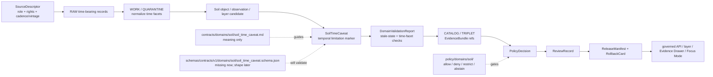

<!-- [KFM_META_BLOCK_V2]
doc_id: kfm://doc/contracts-domains-soil-soil-time-caveat
title: Soil Time Caveat Contract — Soil
type: semantic-contract; temporal-limitation-profile
version: v0.2
status: draft; PROPOSED; schema-missing; canonical-working-lane; temporal-caveat-required; stale-state-aware; NEEDS VERIFICATION before promotion
owners:
  - OWNER_TBD — Soil domain steward
  - OWNER_TBD — Contracts steward
  - OWNER_TBD — Schema steward
  - OWNER_TBD — Source steward
  - OWNER_TBD — Evidence steward
  - OWNER_TBD — Policy steward
  - OWNER_TBD — Release steward
  - OWNER_TBD — Docs steward
created: NEEDS VERIFICATION — scaffold existed before v0.2 expansion
updated: 2026-06-23
policy_label: public; contracts; soil; soil-time-caveat; temporal-limitation; product-vintage; stale-state; cadence; revision-time; correction-time; source-role-aware; support-type-separation; evidence-bound; schema-missing; release-gated; rollback-aware; not-source-truth; not-policy-decision; not-release-approval; not-direct-data-access
tags: [kfm, contracts, soil, soil-time-caveat, SoilTimeCaveat, temporal-scope, source-time, observed-time, valid-time, retrieval-time, release-time, correction-time, stale-state, cadence, product-vintage, SoilMapUnit, SoilComponent, Horizon, SoilProperty, HydrologicSoilGroup, SoilMoistureObservation, Pedon, SoilProfileView, ErosionRisk, SuitabilityRating, DomainObservation, DomainLayerDescriptor, DomainValidationReport, EvidenceRef, EvidenceBundle, PolicyDecision, ReviewRecord, ReleaseManifest, RollbackCard]
related:
  - ./README.md
  - ./domain_feature_identity.md
  - ./domain_observation.md
  - ./domain_layer_descriptor.md
  - ./domain_validation_report.md
  - ./soil_map_unit.md
  - ./soil_component.md
  - ./horizon.md
  - ./soil_property.md
  - ./hydrologic_soil_group.md
  - ./soil_moisture_observation.md
  - ./pedon.md
  - ./soil_profile_view.md
  - ./pedon_soil_profile_view.md
  - ./erosion_risk.md
  - ./suitability_rating.md
  - ../../../docs/domains/soil/README.md
  - ../../../docs/domains/soil/CANONICAL_PATHS.md
  - ../../../docs/domains/soil/ARCHITECTURE.md
  - ../../../docs/domains/soil/API_CONTRACTS.md
  - ../../../docs/domains/soil/DATA_LIFECYCLE.md
  - ../../../pipelines/domains/soil/README.md
  - ../../../schemas/contracts/v1/domains/soil/soil_time_caveat.schema.json
  - ../../../schemas/contracts/v1/domains/soil/README.md
  - ../../../policy/domains/soil/README.md
  - ../../../fixtures/domains/soil/soil_time_caveat/
  - ../../../tests/domains/soil/
  - ../../../release/candidates/soil/
notes:
  - "Expanded from a PROPOSED scaffold at contracts/domains/soil/soil_time_caveat.md."
  - "A paired schema at schemas/contracts/v1/domains/soil/soil_time_caveat.schema.json was not found in this task. Field realization remains PROPOSED."
  - "Soil architecture defines SoilTimeCaveat as a confirmed term for per-product temporal limitation marker, with field shape still PROPOSED."
  - "The Soil contract README states SoilTimeCaveat defines product-vintage / temporal limitation semantics and must stay attached to stale or time-bounded products."
  - "This contract keeps source time, observed time, valid time, retrieval time, release time, and correction time separate where material."
  - "This contract defines time-caveat meaning only; it does not implement schema validation, stale-state policy, ETL, source activation, public API behavior, release approval, map rendering, or AI answers."
[/KFM_META_BLOCK_V2] -->

<a id="top"></a>

# Soil Time Caveat Contract — Soil

> Semantic contract for `SoilTimeCaveat`: the Soil-domain temporal limitation object that keeps source vintage, observation time, valid time, retrieval time, release time, correction time, stale-state, cadence, evidence, policy, release, and rollback posture visible for time-bounded Soil claims and products.

<p>
  
  
  
  
  
  
  
</p>

`contracts/domains/soil/soil_time_caveat.md`

## Quick jumps

[Status](#status) · [Meaning](#meaning) · [Repo fit](#repo-fit) · [Schema posture](#schema-posture) · [Accepted uses](#accepted-uses) · [Exclusions](#exclusions) · [Recommended fields](#recommended-fields) · [Caveat model](#caveat-model) · [Caveat families](#caveat-families) · [Source-role and support rules](#source-role-and-support-rules) · [Sensitivity and publication posture](#sensitivity-and-publication-posture) · [Invariants](#invariants) · [Lifecycle](#lifecycle) · [Validation](#validation) · [Rollback](#rollback) · [Evidence basis](#evidence-basis) · [Open questions](#open-questions)

---

## Status

> [!IMPORTANT]
> **Status:** `draft` / semantic contract / temporal-limitation profile  
> **Owner:** `OWNER_TBD`  
> **Contract path:** `contracts/domains/soil/soil_time_caveat.md`  
> **Schema path checked:** `schemas/contracts/v1/domains/soil/soil_time_caveat.schema.json` — **not found in this task**  
> **Truth posture:** target path, prior scaffold, Soil contract-lane README, Soil architecture, Soil API posture, Soil lifecycle inventory, and sibling Soil contracts are confirmed from current repo evidence. Field-level shape, schema enforcement, validators, fixtures, stale-state policy implementation, ETL behavior, source registry records, release manifests, governed API routes, public API behavior, map rendering, graph behavior, and runtime behavior remain **NEEDS VERIFICATION**.

> [!CAUTION]
> `SoilTimeCaveat` is a temporal limitation marker. It is **not** source truth, observation truth, policy approval, release approval, public API authority, or AI authority. It must stay attached to stale or time-bounded products rather than being hidden in prose.

---

## Meaning

`SoilTimeCaveat` records why a Soil claim, object, observation, layer, interpretation, Evidence Drawer payload, or Focus Mode answer is time-bounded, stale, revision-sensitive, source-vintage-limited, valid-time-limited, release-time-limited, or correction-sensitive.

It may attach to:

- `SoilMapUnit`
- `SoilComponent`
- `Horizon`
- `SoilProperty`
- `HydrologicSoilGroup`
- `SoilMoistureObservation`
- `Pedon` / `SoilProfileView`
- `ErosionRisk`
- `SuitabilityRating`
- `DomainObservation`
- `DomainLayerDescriptor`
- `DomainValidationReport`
- `EvidenceBundle` or `EvidenceDrawerPayload` projections

The object answers:

- Which temporal limitation applies?
- Which time axis is affected: source time, observed time, valid time, retrieval time, release time, or correction time?
- Is the claim stale, historic, periodic, provisional, superseded, corrected, candidate, embargoed, or held for review?
- Which surfaces must show the caveat before answering, rendering, exporting, or publishing?
- Which EvidenceBundle, PolicyDecision, ReviewRecord, ReleaseManifest, and RollbackCard govern downstream use?
- What does the time caveat **not** prove?

A Soil time caveat is a **governance attachment**. It preserves temporal honesty. It can support finite outcomes, stale-state badges, release checks, Evidence Drawer explanation, and Focus Mode abstention/answer behavior. It cannot make weak evidence current, authorize release, or turn a stale/corrected/candidate claim into public truth.

---

## Repo fit

| Responsibility | Path | Role |
|---|---|---|
| Contract lane | `contracts/domains/soil/soil_time_caveat.md` | This semantic SoilTimeCaveat contract. |
| Soil contract README | `contracts/domains/soil/README.md` | Defines SoilTimeCaveat as product-vintage / temporal limitation semantics and says it must stay attached to stale or time-bounded products. |
| Paired schema | `schemas/contracts/v1/domains/soil/soil_time_caveat.schema.json` | Not found in this task; do not infer machine shape. |
| Observation companion | `contracts/domains/soil/domain_observation.md` | Time caveats may attach to source-scoped observations. |
| Moisture companion | `contracts/domains/soil/soil_moisture_observation.md` | Soil-moisture cadence, stale-state, revision time, and observation age should cite this caveat. |
| Property companion | `contracts/domains/soil/soil_property.md` | Soil properties may require source-vintage, valid-time, or correction caveats. |
| Layer companion | `contracts/domains/soil/domain_layer_descriptor.md` | Released layers may need visible temporal caveats and rollback/correction pointers. |
| Validation companion | `contracts/domains/soil/domain_validation_report.md` | Validation may check stale-state and time-facet completeness, but validation is not release. |
| Soil architecture | `docs/domains/soil/ARCHITECTURE.md` | Defines SoilTimeCaveat as a confirmed term and object family with proposed field realization. |
| Soil API posture | `docs/domains/soil/API_CONTRACTS.md` | Defines finite outcomes, release/evidence gates, public-surface behavior, and stale-state sensitivity posture. |
| Soil lifecycle inventory | `docs/domains/soil/DATA_LIFECYCLE.md` | Records Soil owned object families and lifecycle promotion posture. |
| Policy | `policy/domains/soil/` | Stale-state, rights, sensitivity, source-role, allow/deny/restrict/abstain, and release gating. |
| Tests / fixtures | `tests/domains/soil/`, `fixtures/domains/soil/soil_time_caveat/` | Expected proof surfaces; maturity not verified here. |
| Release / rollback | `release/candidates/soil/` and release roots | Publication, correction, and rollback authority. |

---

## Schema posture

A direct paired schema was checked at:

```text
schemas/contracts/v1/domains/soil/soil_time_caveat.schema.json
```

That file was **not found** in this task.

> [!WARNING]
> Because no paired schema was confirmed, every field below is **PROPOSED** semantic guidance. Do not treat it as machine-enforced until schema, fixtures, validators, policy tests, release checks, governed API behavior, and runtime behavior are verified.

---

## Accepted uses

| Use | Allowed? | Rule |
|---|---:|---|
| Defining temporal limitation meaning | Yes | Must identify affected time axis, subject, reason, scope, evidence, policy/release posture, and required surface behavior. |
| Supporting stale-state badges or caveated answers | Yes | Must remain attached to the affected object/layer/claim. |
| Supporting release preflight | Conditional | Release may require time-caveat closure, but caveat itself is not ReleaseManifest. |
| Supporting Evidence Drawer explanation | Conditional | Drawer must show the temporal caveat where material and preserve evidence/policy/release state. |
| Supporting Focus Mode answer/abstain behavior | Conditional | AI may answer only when caveat permits and citation/evidence gates close. |
| Marking candidate, superseded, corrected, provisional, embargoed, or review-held states | Yes | Must preserve finite outcome and reason code where needed. |
| Using caveat text to make stale evidence current | No | Stale evidence remains stale. |
| Hiding stale-state in prose while rendering public truth | No | Caveat must be inspectable. |

---

## Exclusions

`SoilTimeCaveat` must not be used as:

| Misuse | Required outcome |
|---|---|
| Source truth | Use SourceDescriptor and EvidenceBundle. |
| Observation truth | Use the owning observation/object contract. |
| Policy decision | Use policy roots and PolicyDecision. |
| Release approval | Use ReviewRecord, ReleaseManifest, correction path, and RollbackCard. |
| Replacement for stale-state validator | Use tests/validators and DomainValidationReport. |
| Generic prose disclaimer | Must be structured, attached, auditable, and cited where material. |
| Public API response shape | Use governed API schemas and route contracts. |
| AI answer authority | Focus Mode remains evidence-subordinate and finite-outcome constrained. |

---

## Recommended fields

The following fields are **PROPOSED** until a paired schema is added and validated.

| Field | Meaning |
|---|---|
| `id` | Canonical SoilTimeCaveat identifier. |
| `version` | Contract/object version. |
| `spec_hash` | Deterministic hash over normalized caveat content. |
| `domain` | Expected value: `soil`. |
| `caveat_subject_ref` | Object, observation, layer, EvidenceBundle, drawer payload, claim, export, or Focus Mode response affected by the caveat. |
| `caveat_subject_family` | SoilMapUnit, SoilComponent, Horizon, SoilProperty, SoilMoistureObservation, ErosionRisk, SuitabilityRating, etc. |
| `support_type` | Static survey, gridded derivative, station, satellite, pedon/profile, interpretation, or schema-selected equivalent. |
| `caveat_type` | Source vintage, observed-time, valid-time, retrieval-time, stale-state, release-time, correction-time, revision, cadence, candidate, embargo, or review-hold caveat. |
| `affected_time_axis` | Source time, observed time, valid time, retrieval time, release time, correction time, or multiple axes. |
| `source_time` | Source creation/publication/update time where applicable. |
| `observed_time` | Observation/measurement/profile time where applicable. |
| `valid_time` | Time interval the claim/object applies to, where known. |
| `retrieval_time` | KFM retrieval/freeze time. |
| `release_time` | KFM release/publication time, if released. |
| `correction_time` | Correction/supersession time, if corrected. |
| `cadence` | Expected source update/observation cadence where applicable. |
| `stale_state` | Fresh, stale, unknown, superseded, corrected, candidate, review-held, embargoed, or schema-selected equivalent. |
| `reason_codes` | Machine-readable temporal/caveat reason codes. |
| `human_summary` | Public/steward-safe text explaining the temporal limitation. |
| `surface_requirements` | Required display/behavior on map, drawer, Focus Mode, export, API, graph, or release surfaces. |
| `evidence_refs` | EvidenceRefs or EvidenceBundle refs supporting the caveat. |
| `validation_report_ref` | DomainValidationReport ref for stale-state/time-facet checks. |
| `policy_decision_ref` | PolicyDecision governing use/publication. |
| `review_ref` | ReviewRecord or steward review ref. |
| `release_manifest_ref` | ReleaseManifest or MapReleaseManifest ref. |
| `rollback_ref` | RollbackCard or rollback target. |
| `limitations` | Caveats: temporal marker only; not source truth, not policy, not release approval. |

---

## Caveat model

A reviewed SoilTimeCaveat object should bind subject, caveat type, affected time axis, stale/revision state, evidence, validation, policy, release, surface behavior, and rollback.

```text
soil_time_caveat = {
  domain,
  caveat_subject_ref,
  caveat_subject_family,
  support_type,
  caveat_type,
  affected_time_axis,
  source_time,
  observed_time,
  valid_time,
  retrieval_time,
  release_time,
  correction_time,
  cadence,
  stale_state,
  reason_codes,
  human_summary,
  surface_requirements,
  evidence_refs,
  validation_report_ref,
  policy_decision_ref,
  review_ref,
  release_manifest_ref,
  rollback_ref
}
```

The exact serialized shape is **NEEDS VERIFICATION** until the schema and validators are field-complete.

---

## Caveat families

| Caveat family | Meaning | Guardrail |
|---|---|---|
| `source_vintage_caveat` | Source product is tied to a survey/publication/update vintage. | Do not present old source as current measurement. |
| `observed_time_caveat` | Observation/profile value applies to a specific observation time. | Do not present it as timeless. |
| `valid_time_caveat` | Claim/object has a bounded validity interval. | Do not answer outside interval without caveat or abstention. |
| `retrieval_time_caveat` | KFM froze or retrieved the source at a specific time. | Do not imply source has been refreshed. |
| `release_time_caveat` | Public artifact reflects release-state timing. | Release time is not source time. |
| `correction_time_caveat` | Claim/object was corrected, superseded, or withdrawn. | Must trigger rollback/correction propagation where material. |
| `cadence_caveat` | Source has expected update/observation cadence. | Stale-state policy required for overdue sources. |
| `candidate_or_review_hold_caveat` | Candidate or review-held object cannot publish as truth. | Public surfaces must HOLD/DENY/ABSTAIN as appropriate. |
| `embargo_or_rights_caveat` | Time-limited access/release restriction applies. | PolicyDecision governs use. |

---

## Source-role and support rules

| Rule | Requirement |
|---|---|
| Time axis must be named | A generic “old data” caveat is insufficient for governance. |
| Caveat subject is mandatory | The caveat must attach to a concrete object, claim, layer, evidence, export, or answer. |
| Support type remains visible | Static survey, derivative, station, satellite, pedon/profile, and interpretation contexts have different time meanings. |
| Release time is not source time | A released layer may be new while source evidence is old. Both must be visible. |
| Retrieval time is not observed time | KFM fetch/freeze time must not replace actual observation/source time. |
| Correction time is operational | Corrections must identify rollback and invalidation targets where material. |
| AI cannot hide caveats | Focus Mode must cite or display time caveats where they affect answer truth. |
| Public claims require EvidenceBundle resolution | If caveat evidence cannot resolve, return ABSTAIN, DENY, or ERROR; do not invent time posture. |

---

## Sensitivity and publication posture

| Surface | Default posture | Reason |
|---|---|---|
| Public static survey vintage caveat | Public-safe and expected | Vintage/refresh context prevents false currency. |
| Public station/satellite stale-state caveat | Public-safe and expected | Time-series and grid observations need cadence/revision context. |
| Candidate/review-held caveat | HOLD/DENY/ABSTAIN depending on surface | Candidate state cannot publish as truth. |
| Correction/supersession caveat | Public-safe where it explains changed public claims; review if sensitive | Correction lineage supports trust and rollback. |
| Embargo/rights caveat | DENY/restrict until policy permits | Rights/time limits can block release. |
| Owner/farm/private sensor time caveat | Review/restrict/deny by default | Timing can expose operational patterns or sensitive joins. |
| Focus Mode summary | Released/cited only | AI must cite EvidenceBundle/release and preserve temporal caveats. |

---

## Invariants

1. **Time caveats stay attached.** Stale, corrected, candidate, cadence, or vintage caveats must not be dropped in layers, drawers, exports, graph projections, or AI summaries.
2. **Six time facets stay distinct.** Source time, observed time, valid time, retrieval time, release time, and correction time must not collapse.
3. **Caveat is not permission.** A caveat cannot authorize release or override policy.
4. **Caveat is not truth.** It constrains the truth posture of the subject; it does not create evidence.
5. **Support type changes temporal meaning.** Survey vintage, station cadence, satellite revision, profile time, and interpretation time differ.
6. **Correction implies rollback review.** Superseded/corrected caveats must identify invalidation targets where material.
7. **Evidence closure is required.** Consequential temporal claims require EvidenceRef to resolve to EvidenceBundle.
8. **Validation is bounded.** Stale-state/time-facet checks support trust; they do not publish or approve release.
9. **AI is downstream.** Focus Mode may answer only when temporal caveats permit an evidence-grounded finite outcome.
10. **No direct internal-store reads.** Public clients use governed APIs and released artifacts only.

---

## Lifecycle



---

## Validation

Before this contract is treated as mature, maintainers should verify:

- [ ] paired schema exists or an ADR declares a different temporal caveat shape home;
- [ ] schema includes caveat subject, subject family, support type, caveat type, affected time axis, six time facets, cadence, stale state, reason codes, surface requirements, evidence refs, validation/policy/review/release/rollback refs, and limitations;
- [ ] fixtures cover survey vintage, station stale-state, satellite revision, pedon/profile observation time, valid-time interval, retrieval-time freeze, release-time mismatch, correction/supersession, embargo/rights hold, candidate/review hold, denied caveat, and release-ready caveat;
- [ ] validators check named time axis, subject ref, support-type temporal semantics, EvidenceBundle resolution, stale-state/cadence, correction propagation, and release preflight;
- [ ] tests prevent SoilTimeCaveat from becoming source truth, policy permission, release approval, public API proof, or AI authority;
- [ ] tests enforce ABSTAIN/DENY/ERROR/HOLD when evidence, source role, support type, stale-state, correction, policy, release, or runtime evaluation is unresolved;
- [ ] public map, Evidence Drawer, Focus Mode, exports, and AI summaries preserve attached temporal caveats;
- [ ] rollback invalidates linked objects, observations, identities, layer descriptors, drawer payloads, exports, caches, graph projections, and AI summaries that cited a withdrawn or corrected time posture.

---

## Rollback

Rollback is required if this contract:

- claims schema, validator, fixture, test, stale-state policy, release, API, ETL, temporal model, map, graph, or runtime behavior exists without proof;
- treats SoilTimeCaveat as source truth, observation truth, policy permission, release approval, public API proof, or AI authority;
- collapses source time, observed time, valid time, retrieval time, release time, and correction time;
- hides source vintage, cadence, stale-state, correction/supersession, candidate status, embargo, review hold, or rollback lineage;
- exposes farm-specific, owner-specific, parcel-specific, operational, or private sensor timing detail without policy/release support;
- normalizes direct UI access to internal lifecycle stores or direct model output.

Rollback target: revert `contracts/domains/soil/soil_time_caveat.md` to prior scaffold blob `ae347198a68aae45b2ff26f4e0cc32fad5657c9f`, record drift if authority boundaries were affected, and invalidate downstream derivatives that relied on weakened SoilTimeCaveat semantics.

---

## Evidence basis

| Evidence | Status | Supports | Limits |
|---|---|---|---|
| Prior `contracts/domains/soil/soil_time_caveat.md` | `CONFIRMED` | Target file existed as a planned-path scaffold sourced from Soil continuity/lifecycle docs. | Scaffold did not define authoritative semantic contract content. |
| Paired schema lookup | `CONFIRMED not found in this task` | Justifies schema-missing posture. | Does not rule out alternate schema names or future ADR-selected homes. |
| `contracts/domains/soil/README.md` | `CONFIRMED contract-lane rule` | Defines SoilTimeCaveat as product-vintage / temporal limitation semantics and requires stale/time-bounded products to retain caveats; authoring rules require time/vintage visibility. | Does not prove object schema, validator, or release maturity. |
| `docs/domains/soil/ARCHITECTURE.md` | `CONFIRMED doctrine / PROPOSED field realization` | Defines SoilTimeCaveat as per-product temporal limitation marker and requires source time, observed time, valid time, retrieval time, release time, and correction time to stay distinct where material. | Does not prove implementation. |
| `docs/domains/soil/API_CONTRACTS.md` | `CONFIRMED doctrine / PROPOSED implementation` | Shows RAW → WORK/QUARANTINE → PROCESSED → CATALOG/TRIPLET → PUBLISHED lifecycle and finite public-surface gates. | Route names, validator code, stale-state policy, and runtime behavior remain UNKNOWN / NEEDS VERIFICATION. |
| `docs/domains/soil/DATA_LIFECYCLE.md` | `CONFIRMED navigational register / PROPOSED implementation` | Records Soil object families and lifecycle promotion posture. | It is a navigational register, not implementation proof. |
| `contracts/domains/soil/domain_observation.md` | `CONFIRMED sibling contract` | Defines observations as source-scoped evidence-bearing claims that may need caveats. | Its schema is a stub. |
| `contracts/domains/soil/domain_layer_descriptor.md` | `CONFIRMED sibling contract` | Defines layers as governed projections, not source or object truth. | Its schema is a stub. |
| `contracts/domains/soil/domain_validation_report.md` | `CONFIRMED sibling contract` | Defines validation as check evidence, not policy or release authority. | Its schema is a stub. |
| Uploaded KFM authoring prompt v2 | `CONFIRMED user-supplied guidance` | Requires evidence-first, implementation-honest, visually polished Markdown with visible verification and rollback posture. | Authoring guidance, not implementation proof. |

---

## Open questions

| ID | Question | Status |
|---|---|---|
| OQ-SOIL-TIME-01 | Should `SoilTimeCaveat` have its own schema, or inherit from a cross-domain temporal caveat/stale-state schema? | OPEN / DOMAIN + SCHEMA REVIEW |
| OQ-SOIL-TIME-02 | Which stale-state, cadence, correction, release, candidate, review-hold, and embargo enums are canonical? | OPEN / POLICY + SCHEMA REVIEW |
| OQ-SOIL-TIME-03 | Which surfaces must display caveats as badges versus drawer text versus API fields versus Focus Mode citations? | OPEN / MAP/UI + API REVIEW |
| OQ-SOIL-TIME-04 | Which time-caveat failures block release versus produce ABSTAIN, DENY, ERROR, or HOLD? | OPEN / POLICY + RELEASE REVIEW |
| OQ-SOIL-TIME-05 | How should rollback invalidate layers, drawer payloads, Focus Mode claims, exports, caches, graph projections, and AI summaries after a temporal correction? | OPEN / RELEASE REVIEW |
| OQ-SOIL-TIME-06 | How should private/operational sensor timing be generalized, redacted, denied, or staged for access? | OPEN / POLICY REVIEW |

<p align="right"><a href="#top">Back to top</a></p>
