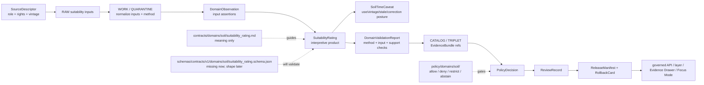

<!-- [KFM_META_BLOCK_V2]
doc_id: kfm://doc/contracts-domains-soil-suitability-rating
title: Suitability Rating Contract — Soil
type: semantic-contract; interpretive-product-profile
version: v0.2
status: draft; PROPOSED; schema-missing; canonical-working-lane; support-type-separation-required; interpretive-product; fitness-for-use-caveats-required; NEEDS VERIFICATION before promotion
owners:
  - OWNER_TBD — Soil domain steward
  - OWNER_TBD — Contracts steward
  - OWNER_TBD — Schema steward
  - OWNER_TBD — Source steward
  - OWNER_TBD — Evidence steward
  - OWNER_TBD — Policy steward
  - OWNER_TBD — Release steward
  - OWNER_TBD — Docs steward
created: NEEDS VERIFICATION — scaffold existed before v0.2 expansion
updated: 2026-06-23
policy_label: public; contracts; soil; suitability-rating; interpretive-product; fitness-for-use; source-role-aware; support-type-separation; temporal-scope-aware; evidence-bound; schema-missing; release-gated; rollback-aware; not-legal-advice; not-economic-advice; not-operational-recommendation; not-crop-prescription; not-engineering-design; not-policy-decision; not-release-approval; not-direct-data-access
tags: [kfm, contracts, soil, suitability-rating, SuitabilityRating, interpretation, fitness-for-use, SoilMapUnit, SoilComponent, Horizon, SoilProperty, HydrologicSoilGroup, SoilMoistureObservation, Pedon, SoilProfileView, ErosionRisk, SoilTimeCaveat, authoritative_static_soil, gridded_derivative_soil, pedon_evidence, DomainFeatureIdentity, DomainObservation, DomainLayerDescriptor, DomainValidationReport, SourceDescriptor, EvidenceRef, EvidenceBundle, PolicyDecision, ReviewRecord, ReleaseManifest, RollbackCard]
related:
  - ./README.md
  - ./domain_feature_identity.md
  - ./domain_observation.md
  - ./domain_layer_descriptor.md
  - ./domain_validation_report.md
  - ./component_horizon_join.md
  - ./soil_map_unit.md
  - ./soil_component.md
  - ./horizon.md
  - ./soil_property.md
  - ./hydrologic_soil_group.md
  - ./soil_moisture_observation.md
  - ./pedon.md
  - ./soil_profile_view.md
  - ./pedon_soil_profile_view.md
  - ./erosion_risk.md
  - ./soil_time_caveat.md
  - ../../../docs/domains/soil/README.md
  - ../../../docs/domains/soil/CANONICAL_PATHS.md
  - ../../../docs/domains/soil/ARCHITECTURE.md
  - ../../../docs/domains/soil/API_CONTRACTS.md
  - ../../../docs/domains/soil/DATA_LIFECYCLE.md
  - ../../../pipelines/domains/soil/README.md
  - ../../../schemas/contracts/v1/domains/soil/suitability_rating.schema.json
  - ../../../schemas/contracts/v1/domains/soil/README.md
  - ../../../policy/domains/soil/README.md
  - ../../../fixtures/domains/soil/suitability_rating/
  - ../../../tests/domains/soil/
  - ../../../release/candidates/soil/
notes:
  - "Expanded from a PROPOSED scaffold at contracts/domains/soil/suitability_rating.md."
  - "A paired schema at schemas/contracts/v1/domains/soil/suitability_rating.schema.json was not found in this task. Field realization remains PROPOSED."
  - "Soil architecture defines SuitabilityRating as a confirmed term for an interpretive product that carries fitness-for-use caveats, with field shape still PROPOSED."
  - "The Soil contract README states SuitabilityRating defines interpretive suitability rating meaning and is not a legal, economic, or operational recommendation."
  - "Suitability and erosion interpretations must carry method, input, limitation, and release posture."
  - "Support-type separation remains mandatory: static survey, gridded derivative, station observation, satellite grid, pedon/profile evidence, and interpretation cannot be collapsed by suitability use."
  - "This contract defines suitability-rating meaning only; it does not implement schema validation, ETL, source activation, suitability modeling, public API behavior, release approval, map rendering, or AI answers."
[/KFM_META_BLOCK_V2] -->

<a id="top"></a>

# Suitability Rating Contract — Soil

> Semantic contract for `SuitabilityRating`: the Soil-domain interpretive product that describes a bounded, evidence-backed fitness-for-use rating with method, inputs, support type, limitations, time/vintage, policy, review, release, and rollback posture kept inspectable.

<p>
  
  
  
  
  
  
  
</p>

`contracts/domains/soil/suitability_rating.md`

## Quick jumps

[Status](#status) · [Meaning](#meaning) · [Repo fit](#repo-fit) · [Schema posture](#schema-posture) · [Accepted uses](#accepted-uses) · [Exclusions](#exclusions) · [Recommended fields](#recommended-fields) · [Rating model](#rating-model) · [Rating families](#rating-families) · [Source-role and support rules](#source-role-and-support-rules) · [Sensitivity and publication posture](#sensitivity-and-publication-posture) · [Invariants](#invariants) · [Lifecycle](#lifecycle) · [Validation](#validation) · [Rollback](#rollback) · [Evidence basis](#evidence-basis) · [Open questions](#open-questions)

---

## Status

> [!IMPORTANT]
> **Status:** `draft` / semantic contract / interpretive-product profile  
> **Owner:** `OWNER_TBD`  
> **Contract path:** `contracts/domains/soil/suitability_rating.md`  
> **Schema path checked:** `schemas/contracts/v1/domains/soil/suitability_rating.schema.json` — **not found in this task**  
> **Truth posture:** target path, prior scaffold, Soil contract-lane README, Soil architecture, Soil lifecycle inventory, Soil API posture, and sibling Soil contracts are confirmed from current repo evidence. Field-level shape, schema enforcement, validators, fixtures, policy tests, suitability-model implementation, source registry records, release manifests, governed API routes, public API behavior, map rendering, graph behavior, and runtime behavior remain **NEEDS VERIFICATION**.

> [!CAUTION]
> `SuitabilityRating` is an interpretive Soil product. It is **not** legal advice, economic advice, crop-management prescription, engineering design, operational recommendation, land-use approval, release approval, or AI authority.

---

## Meaning

`SuitabilityRating` records a governed, evidence-bound interpretation about whether a soil-supported subject is more or less suitable for a declared use, scenario, or purpose.

It may use or cite:

- `SoilMapUnit`
- `SoilComponent`
- `Horizon`
- `SoilProperty`
- `HydrologicSoilGroup`
- `SoilMoistureObservation`
- `Pedon` / `SoilProfileView`
- `ErosionRisk`
- `SoilTimeCaveat`
- released `DomainObservation`, `DomainFeatureIdentity`, `DomainLayerDescriptor`, and `DomainValidationReport` records

The object answers:

- Which suitability question is being rated?
- Which use, scenario, fitness-for-use profile, or interpretive method controls the rating?
- Which soil-side inputs, support types, evidence, scale/resolution, time/vintage, and limitations support the rating?
- Is the rating categorical, numeric, ranked, narrative, candidate, stale, contested, denied, or review-held?
- Which EvidenceBundle, PolicyDecision, ReviewRecord, ReleaseManifest, and RollbackCard govern downstream use?
- What does the rating **not** prove?

A SuitabilityRating is a **bounded interpretation**. It may support map context, Evidence Drawer explanation, Focus Mode caveated answers, planning exploration, or release-candidate review. It must not become a legal/economic/operational directive, crop prescription, engineering suitability certification, hazard finding, parcel/farm approval, or uncited generated conclusion.

---

## Repo fit

| Responsibility | Path | Role |
|---|---|---|
| Contract lane | `contracts/domains/soil/suitability_rating.md` | This semantic SuitabilityRating contract. |
| Soil contract README | `contracts/domains/soil/README.md` | Defines SuitabilityRating as interpretive suitability meaning and not legal/economic/operational recommendation. |
| Paired schema | `schemas/contracts/v1/domains/soil/suitability_rating.schema.json` | Not found in this task; do not infer machine shape. |
| Observation companion | `contracts/domains/soil/domain_observation.md` | Ratings may cite observations but do not become observation truth. |
| Identity companion | `contracts/domains/soil/domain_feature_identity.md` | Rating subject identity must stay evidence/time/support-type scoped. |
| Layer companion | `contracts/domains/soil/domain_layer_descriptor.md` | Released suitability layers are governed projections, not canonical truth. |
| Validation companion | `contracts/domains/soil/domain_validation_report.md` | Validation may check inputs/methods/support type; validation is not release. |
| Property companion | `contracts/domains/soil/soil_property.md` | Property values used as rating inputs retain unit/method/depth context. |
| Time companion | `contracts/domains/soil/soil_time_caveat.md` | Stale/product-vintage caveats must remain attached to rating outputs. |
| Soil architecture | `docs/domains/soil/ARCHITECTURE.md` | Defines SuitabilityRating as a confirmed term and object family with proposed field realization. |
| Soil API posture | `docs/domains/soil/API_CONTRACTS.md` | Defines finite outcomes, support-type separation, sensitivity posture, and release/evidence gates. |
| Soil lifecycle inventory | `docs/domains/soil/DATA_LIFECYCLE.md` | Lists SuitabilityRating among owned Soil object families and preserves promotion model. |
| Policy | `policy/domains/soil/` | Allow/deny/restrict/abstain, rights, sensitivity, stale-state, source-role, and release gating. |
| Tests / fixtures | `tests/domains/soil/`, `fixtures/domains/soil/suitability_rating/` | Expected proof surfaces; maturity not verified here. |
| Release / rollback | `release/candidates/soil/` and release roots | Publication, correction, and rollback authority. |

---

## Schema posture

A direct paired schema was checked at:

```text
schemas/contracts/v1/domains/soil/suitability_rating.schema.json
```

That file was **not found** in this task.

> [!WARNING]
> Because no paired schema was confirmed, every field below is **PROPOSED** semantic guidance. Do not treat it as machine-enforced until schema, fixtures, validators, policy tests, release checks, governed API behavior, and runtime behavior are verified.

---

## Accepted uses

| Use | Allowed? | Rule |
|---|---:|---|
| Defining an interpretive soil suitability rating | Yes | Must cite method, intended use, inputs, support type, evidence, time/vintage, scale/resolution, and limitations. |
| Supporting a release-candidate suitability layer | Conditional | Requires validation, policy, review, ReleaseManifest, and rollback target. |
| Supporting Evidence Drawer explanation | Conditional | Drawer must show evidence, method caveat, support type, release state, and correction path. |
| Supporting Focus Mode answer | Conditional | AI may explain only released/cited suitability context with finite outcomes. |
| Comparing multiple ratings | Conditional | Must preserve method/version/input/use-case differences and avoid implied recommendation authority. |
| Recording a candidate/model-assisted suitability rating | Conditional | Candidate stays review-only until evidence, validation, policy, and release gates pass. |
| Certifying legal, economic, operational, engineering, crop, hazard, parcel, land-use, or management decisions | No | Use owning lanes or qualified sources; return ABSTAIN/DENY/ERROR where unsupported. |
| Publishing from RAW/WORK/CATALOG directly | No | Public clients use governed APIs and released artifacts only. |

---

## Exclusions

`SuitabilityRating` must not be used as:

| Misuse | Required outcome |
|---|---|
| Legal advice, permit approval, zoning decision, land-use decision, or title/parcel claim | Use owning legal/land/governance sources and policy review. |
| Economic recommendation, valuation, insurance rating, or investment advice | Out of scope; use qualified source/authority and policy review. |
| Crop-management prescription or yield forecast | Use Agriculture domain controls. |
| Engineering design or construction recommendation | Use qualified engineering authority and separate review. |
| Hazard/warning product | Use Hazards domain and official source controls. |
| SourceDescriptor or source registry record | Use source registry roots and SourceDescriptor contracts. |
| ETL implementation or suitability model code | Use pipelines/packages and tests. |
| JSON Schema / machine validation | Use schema roots after schema creation. |
| Layer manifest / public projection | Use `domain_layer_descriptor` and release artifacts. |
| Release approval | Use PolicyDecision, ReviewRecord, ReleaseManifest, correction path, and RollbackCard. |
| AI answer authority | Focus Mode remains evidence-subordinate and finite-outcome constrained. |

---

## Recommended fields

The following fields are **PROPOSED** until a paired schema is added and validated.

| Field | Meaning |
|---|---|
| `id` | Canonical SuitabilityRating identifier. |
| `version` | Contract/object version. |
| `spec_hash` | Deterministic hash over normalized rating content. |
| `domain` | Expected value: `soil`. |
| `rating_subject_ref` | Soil feature, map unit, component, horizon/profile, grid cell, layer feature, or aggregate subject ref. |
| `rating_subject_family` | SoilMapUnit, SoilComponent, Horizon, SoilProperty, Pedon, SoilProfileView, observation, layer, or aggregate. |
| `support_type` | Expected value includes `interpretation`, with input support types retained. |
| `suitability_use` | Declared use, scenario, fitness-for-use target, or source-specific interpretation. |
| `rating_value` | Categorical, numeric, banded, rank-like, narrative, Boolean, or source-specific value. |
| `rating_scale` | Rating scale, score range, class definitions, or method-defined scale. |
| `rating_basis` | Measured, derived, interpreted, source-carried, model-assisted, candidate, denied, or source-specific basis. |
| `method_ref` | Model, source table, rule set, interpretation method, or review method reference. |
| `input_refs` | Soil object, observation, property, layer, source, or artifact refs used by the rating. |
| `evidence_refs` | EvidenceRefs or EvidenceBundle refs. |
| `source_role_summary` | Source-role posture for inputs and rating. |
| `scale_or_resolution` | Survey scale, grid resolution, polygon support, profile locality, or aggregation unit. |
| `temporal_scope` | Source time, observed time, valid time, input vintage, calculation time, release time, correction time. |
| `confidence_or_quality` | Candidate, reviewed, source-carried, stale, contested, denied, unknown, or source-specific quality state. |
| `limitations` | Caveats and prohibited interpretations. |
| `time_caveat_ref` | SoilTimeCaveat ref for stale or time-bounded suitability products. |
| `validation_report_ref` | DomainValidationReport ref supporting this rating object. |
| `policy_decision_ref` | PolicyDecision governing use/publication. |
| `review_ref` | ReviewRecord or steward review ref. |
| `layer_descriptor_ref` | DomainLayerDescriptor ref if rendered. |
| `release_manifest_ref` | ReleaseManifest or MapReleaseManifest ref. |
| `rollback_ref` | RollbackCard or rollback target. |

---

## Rating model

A reviewed SuitabilityRating object should bind declared use, method, inputs, support type, evidence, limitations, validation, policy, release, and rollback.

```text
suitability_rating = {
  domain,
  rating_subject_ref,
  rating_subject_family,
  support_type,
  suitability_use,
  rating_value,
  rating_scale,
  rating_basis,
  method_ref,
  input_refs,
  evidence_refs,
  source_role_summary,
  scale_or_resolution,
  temporal_scope,
  confidence_or_quality,
  limitations,
  time_caveat_ref,
  validation_report_ref,
  policy_decision_ref,
  review_ref,
  layer_descriptor_ref,
  release_manifest_ref,
  rollback_ref
}
```

The exact serialized shape is **NEEDS VERIFICATION** until the schema and validators are field-complete.

---

## Rating families

| Rating family | Meaning | Guardrail |
|---|---|---|
| `source_carried_rating` | Suitability-like value carried by a source or source table. | Source role, method/table meaning, and caveats required. |
| `component_rating` | Rating associated with a soil component. | Component context must not collapse into whole map-unit truth unless method supports it. |
| `map_unit_rating` | Rating summarized or represented at map-unit support. | Aggregation/selection method and limitations required. |
| `profile_or_horizon_rating` | Rating based on horizon/profile/property evidence. | Depth/profile and property method/unit context required. |
| `derived_rating` | Rating derived from other soil properties, rules, or model. | Method/version/input refs required. |
| `candidate_rating` | Proposed/model-assisted/OCR/connector-derived suitability rating. | Review only until validated and released. |
| `denied_or_abstained_rating` | Rating cannot be published under current evidence/policy. | Emit finite outcome and reason, not unsupported value. |

---

## Source-role and support rules

| Rule | Requirement |
|---|---|
| Suitability use is mandatory | A rating without a declared use/scenario is not reviewable as public truth. |
| Method is part of meaning | Ratings require source table, rule, model, review method, or interpretation method. |
| Inputs must remain inspectable | Soil properties, components, horizons, map units, profile evidence, and observations cannot be hidden behind a rating. |
| Support type is mandatory | Static survey, derivative, station, satellite, pedon/profile, and interpretation contexts must not collapse. |
| Source role is per use | A source may be authoritative for one rating use and contextual for another. |
| Scale/resolution is part of meaning | Ratings must not imply finer spatial precision than input evidence supports. |
| Time caveats stay attached | Source vintage, input staleness, release time, and correction state must remain visible where material. |
| Cross-lane claims stay contextual | Agriculture, legal/land, hydrology, geology, habitat, flora, fauna, hazards, and engineering retain their own truth authority. |
| Validation is not release | DomainValidationReport can support the rating; it cannot publish it. |
| Public claims require EvidenceBundle resolution | If evidence cannot resolve, return ABSTAIN, DENY, or ERROR; do not invent the rating. |

---

## Sensitivity and publication posture

| Surface | Default posture | Reason |
|---|---|---|
| Public generalized suitability layer | Public-safe if source, rights, evidence, method, scale, policy, review, and release support it | Soil interpretations can be public-safe when caveated and released. |
| Parcel/farm/owner-specific suitability | Review / restrict / deny by default | Suitability plus ownership/operation joins can become sensitive or misleading. |
| Operational recommendation-like rating | DENY / restrict / hold by default | The contract is not operational advice or approval. |
| Engineering/legal/economic framing | DENY / abstain by default | Out-of-scope decision authority. |
| Candidate/model-generated rating | Review only | Generated or candidate ratings do not become public truth. |
| Focus Mode summary | Released/cited only | AI must cite EvidenceBundle/release and preserve method/use/limitation caveats. |

---

## Invariants

1. **SuitabilityRating is interpretation, not recommendation.** It must not be treated as legal, economic, operational, crop, engineering, hazard, or approval authority.
2. **Use/scenario is mandatory.** A rating has no meaning without its intended use or method-defined fitness question.
3. **Method, inputs, and limitations are first-class.** Missing method/input/limitation posture blocks public truth posture.
4. **Support type cannot collapse.** Survey, derivative, station, satellite, pedon/profile, and interpretation contexts remain distinct.
5. **Evidence closure is required.** Consequential public claims require EvidenceRef to resolve to EvidenceBundle.
6. **Time caveats stay attached.** Stale, vintage, release, and correction posture must not disappear in map or AI surfaces.
7. **Validation is bounded.** Method/input/support checks support trust; they do not publish or approve release.
8. **Release is separate.** Public display requires PolicyDecision, ReviewRecord, ReleaseManifest, and RollbackCard where required.
9. **AI is downstream.** Focus Mode may explain released suitability context only with citation closure and caveats.
10. **No direct internal-store reads.** Public clients use governed APIs and released artifacts only.

---

## Lifecycle



---

## Validation

Before this contract is treated as mature, maintainers should verify:

- [ ] paired schema exists or an ADR declares a different suitability-rating shape home;
- [ ] schema includes rating subject, subject family, support type, suitability use, rating value/scale/basis, method ref, input refs, evidence refs, source-role summary, scale/resolution, time axes, caveat refs, validation/policy/review/release/rollback refs, and limitations;
- [ ] fixtures cover source-carried rating, map-unit rating, component rating, horizon/profile rating, derived rating, missing use, missing method, missing input refs, stale input rating, support-type collapse, legal/economic/operational overclaim, candidate rating, denied rating, and release-ready rating;
- [ ] validators check declared use, method presence, input closure, EvidenceBundle resolution, support-type separation, time caveat presence, scale/resolution caveats, stale-state, and release preflight;
- [ ] tests prevent SuitabilityRating from becoming legal/economic/operational/crop/engineering/hazard recommendation, release approval, or AI authority;
- [ ] tests enforce ABSTAIN/DENY/ERROR/HOLD when evidence, source role, support type, method, input refs, declared use, policy, release, or runtime evaluation is unresolved;
- [ ] public map, Evidence Drawer, Focus Mode, exports, and AI summaries use only released/governed suitability projections;
- [ ] rollback invalidates linked observations, identities, time caveats, layer descriptors, drawer payloads, exports, caches, graph projections, and AI summaries that cited a withdrawn suitability rating.

---

## Rollback

Rollback is required if this contract:

- claims schema, validator, fixture, test, policy, release, API, suitability model, ETL, map, graph, or runtime behavior exists without proof;
- treats SuitabilityRating as legal/economic/operational/crop/engineering/hazard truth, source truth, release approval, public API proof, or AI authority;
- weakens support-type separation or lets interpretation masquerade as observation;
- hides declared use, method, input refs, scale/resolution caveats, source-role conflict, source vintage, time caveat, candidate status, stale state, supersession, or correction lineage;
- exposes farm-specific, owner-specific, parcel-specific, operational, or private sensor/profile detail without policy/release support;
- normalizes direct UI access to internal lifecycle stores or direct model output.

Rollback target: revert `contracts/domains/soil/suitability_rating.md` to prior scaffold blob `94503485514c9f5ca9f65606ba7d2ed07a530672`, record drift if authority boundaries were affected, and invalidate downstream derivatives that relied on weakened SuitabilityRating semantics.

---

## Evidence basis

| Evidence | Status | Supports | Limits |
|---|---|---|---|
| Prior `contracts/domains/soil/suitability_rating.md` | `CONFIRMED` | Target file existed as a planned-path scaffold sourced from Soil continuity/lifecycle docs. | Scaffold did not define authoritative semantic contract content. |
| Paired schema lookup | `CONFIRMED not found in this task` | Justifies schema-missing posture. | Does not rule out alternate schema names or future ADR-selected homes. |
| `contracts/domains/soil/README.md` | `CONFIRMED contract-lane rule` | Defines SuitabilityRating as interpretive suitability rating meaning, not legal/economic/operational recommendation; requires interpretations to carry method, input, limitation, and release posture. | Does not prove object schema, validator, or release maturity. |
| `docs/domains/soil/ARCHITECTURE.md` | `CONFIRMED doctrine / PROPOSED field realization` | Defines SuitabilityRating as interpretive product with fitness-for-use caveats and all-six-time-facet object family. | Does not prove implementation. |
| `docs/domains/soil/API_CONTRACTS.md` | `CONFIRMED doctrine / PROPOSED implementation` | Defines finite outcomes, support-type separation, sensitivity posture, forbidden public behavior, and EvidenceBundle/release gates. | Route names, validator code, and runtime behavior remain UNKNOWN / NEEDS VERIFICATION. |
| `docs/domains/soil/DATA_LIFECYCLE.md` | `CONFIRMED navigational register / PROPOSED implementation` | Lists SuitabilityRating among owned Soil object families and records Soil promotion model. | It is a navigational register, not implementation proof. |
| `contracts/domains/soil/soil_property.md` | `CONFIRMED sibling contract` | Defines property values as method/unit/depth/support-type scoped inputs. | Its paired schema is missing. |
| `contracts/domains/soil/soil_time_caveat.md` | `CONFIRMED sibling contract` | Defines temporal limitation semantics and stale/correction caveat attachment. | Its paired schema is missing. |
| `contracts/domains/soil/domain_validation_report.md` | `CONFIRMED sibling contract` | Defines validation as check evidence, not policy or release authority. | Its schema is a stub. |
| Uploaded KFM authoring prompt v2 | `CONFIRMED user-supplied guidance` | Requires evidence-first, implementation-honest, visually polished Markdown with visible verification and rollback posture. | Authoring guidance, not implementation proof. |

---

## Open questions

| ID | Question | Status |
|---|---|---|
| OQ-SOIL-SUIT-01 | Should `SuitabilityRating` have its own schema, or inherit from a broader interpretive-rating schema shared with ErosionRisk and HydrologicSoilGroup? | OPEN / DOMAIN + SCHEMA REVIEW |
| OQ-SOIL-SUIT-02 | Which suitability-use vocabulary is canonical, and which use-cases must be denied as legal/economic/operational/engineering recommendations? | OPEN / POLICY + DOMAIN REVIEW |
| OQ-SOIL-SUIT-03 | Which rating scales, value schemes, confidence labels, method refs, and input refs are mandatory? | OPEN / VALIDATION REVIEW |
| OQ-SOIL-SUIT-04 | Which suitability contexts are public-safe by default, and which become restricted when joined to farm, owner, parcel, operational sensor, infrastructure, or private profile context? | OPEN / POLICY REVIEW |
| OQ-SOIL-SUIT-05 | How should Evidence Drawer and Focus Mode present suitability context without turning it into a recommendation or approval? | OPEN / MAP/UI REVIEW |
| OQ-SOIL-SUIT-06 | How should rollback invalidate layers, drawer payloads, Focus Mode claims, exports, caches, graph projections, and AI summaries after a suitability-rating correction? | OPEN / RELEASE REVIEW |

<p align="right"><a href="#top">Back to top</a></p>
