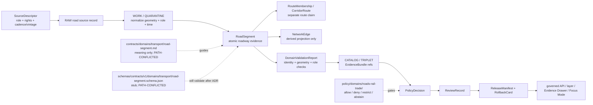

<!-- [KFM_META_BLOCK_V2]
doc_id: kfm://doc/contracts-domains-transport-road-segment
title: Road Segment Contract — Transport / Roads-Rail-Trade
type: semantic-contract
version: v0.2
status: draft; PROPOSED; schema-stub-confirmed; PATH-CONFLICTED; do-not-promote-until-ADR; support-type-separation-required; source-role-preserving; NEEDS VERIFICATION before promotion
owners:
  - OWNER_TBD — Roads / Rail / Trade domain steward
  - OWNER_TBD — Contracts steward
  - OWNER_TBD — Schema steward
  - OWNER_TBD — Source steward
  - OWNER_TBD — Evidence steward
  - OWNER_TBD — Policy steward
  - OWNER_TBD — Release steward
  - OWNER_TBD — Docs steward
created: NEEDS VERIFICATION — scaffold existed before v0.2 expansion
updated: 2026-06-24
policy_label: public; contracts; transport; roads-rail-trade; road-segment; path-conflicted; source-role-aware; temporal-scope-aware; evidence-bound; schema-stub; release-gated; rollback-aware; not-route-claim; not-network-edge-truth; not-current-restriction; not-legal-status; not-right-of-way; not-parcel; not-emergency-closure; not-direct-data-access
tags: [kfm, contracts, transport, roads-rail-trade, road-segment, RoadSegment, CorridorRoute, RouteMembership, NetworkNode, NetworkEdge, Crossing, Bridge, RestrictionEvent, StatusEvent, HistoricRouteClaim, TradeRouteCorridor, SourceDescriptor, EvidenceRef, EvidenceBundle, DomainFeatureIdentity, DomainObservation, DomainLayerDescriptor, DomainValidationReport, PolicyDecision, ReviewRecord, ReleaseManifest, RollbackCard]
related:
  - ../../../docs/domains/roads-rail-trade/CANONICAL_PATHS.md
  - ../../../docs/domains/roads-rail-trade/ARCHITECTURE.md
  - ../../../docs/domains/roads-rail-trade/API_CONTRACTS.md
  - ../../../docs/domains/roads-rail-trade/DATA_LIFECYCLE.md
  - ../../../schemas/contracts/v1/domains/transport/road-segment.schema.json
  - ../../../policy/domains/roads-rail-trade/
  - ../../../tests/domains/roads-rail-trade/
  - ../../../fixtures/domains/roads-rail-trade/
  - ../../../release/candidates/roads-rail-trade/
  - ../../transport/road-segment.md
  - ../roads-rail-trade/road-segment.md
notes:
  - "Expanded from a PROPOSED scaffold at contracts/domains/transport/road-segment.md."
  - "This exact path is CONFIRMED present in the repo, but the Roads/Rail/Trade canonical-path registry marks contracts/domains/transport/ as a fabricated hybrid that should not be promoted without ADR resolution."
  - "A paired schema exists at schemas/contracts/v1/domains/transport/road-segment.schema.json, but it is a permissive scaffold with no declared properties and additionalProperties true. Field realization remains PROPOSED."
  - "Road Segment is a confirmed term in the Roads/Rail/Trade architecture: atomic roadway evidence constrained by source role, evidence, time, and release state."
  - "Source-role collapse is forbidden: modern routing graph evidence, historic route claims, operational restrictions, and legal status must not masquerade as one another."
  - "This contract defines road-segment meaning only; it does not implement schema validation, ETL, routing, map rendering, graph truth, public API behavior, release approval, or AI answers."
[/KFM_META_BLOCK_V2] -->

<a id="top"></a>

# Road Segment Contract — Transport / Roads-Rail-Trade

> Semantic contract for `RoadSegment`: an atomic length of roadway evidence in the Roads / Rail / Trade lane, governed by source role, geometry support, temporal scope, EvidenceBundle closure, policy, release state, correction lineage, and rollback targets.

<p>
  
  
  
  
  
  
  
  
</p>

`contracts/domains/transport/road-segment.md`

## Quick jumps

[Status](#status) · [Path conflict](#path-conflict) · [Meaning](#meaning) · [Repo fit](#repo-fit) · [Schema posture](#schema-posture) · [Accepted uses](#accepted-uses) · [Exclusions](#exclusions) · [Recommended fields](#recommended-fields) · [Segment model](#segment-model) · [Segment families](#segment-families) · [Source-role and support rules](#source-role-and-support-rules) · [Sensitivity and publication posture](#sensitivity-and-publication-posture) · [Invariants](#invariants) · [Lifecycle](#lifecycle) · [Validation](#validation) · [Rollback](#rollback) · [Evidence basis](#evidence-basis) · [Open questions](#open-questions)

---

## Status

> [!IMPORTANT]
> **Status:** `draft` / semantic contract / path-conflicted scaffold expansion  
> **Owner:** `OWNER_TBD`  
> **Contract path checked:** `contracts/domains/transport/road-segment.md` — **confirmed present, but doctrine-conflicted**  
> **Schema path checked:** `schemas/contracts/v1/domains/transport/road-segment.schema.json` — **confirmed permissive scaffold**  
> **Truth posture:** target path, prior scaffold, paired schema scaffold, Roads/Rail/Trade canonical-path registry, architecture, API-contract doc, and data-lifecycle doc are confirmed from current repo evidence. Field-level schema enforcement, validators, fixtures, policy tests, ETL behavior, source registry records, release manifests, governed API routes, public API behavior, map rendering, routing behavior, graph behavior, and runtime behavior remain **NEEDS VERIFICATION**.

> [!CAUTION]
> This file is intentionally **not promoted as canonical authority** until the Roads/Rail/Trade contract/schema slug conflict is resolved by ADR. The requested path exists, but the lane registry warns that `contracts/domains/transport/` is a fabricated hybrid. This document therefore records bounded semantics and drift posture rather than pretending the path is settled.

---

## Path conflict

The current repository contains this file at:

```text
contracts/domains/transport/road-segment.md
```

The paired schema also exists at:

```text
schemas/contracts/v1/domains/transport/road-segment.schema.json
```

However, the Roads/Rail/Trade canonical-path registry identifies only two real doctrine-produced schema/contract homes and warns that the hybrid `contracts/domains/transport/` / `schemas/contracts/v1/domains/transport/` form should not be authored or promoted without ADR resolution.

| Candidate home | Status in current evidence | Meaning |
|---|---:|---|
| `contracts/domains/roads-rail-trade/` | `PROPOSED` Directory Rules-style form | Uses the human-facing lane slug and `domains/` segment. |
| `contracts/transport/` | `PROPOSED` Atlas §24.13-style form | Uses the engineering slug without `domains/`. |
| `contracts/domains/transport/` | `CONFIRMED present but CONFLICTED` | Current requested path exists, but the registry labels this combination fabricated/hybrid. |

> [!WARNING]
> Do not create additional road-segment authority in a second home. Until the ADR lands, this file should stay `draft / PATH-CONFLICTED / NEEDS VERIFICATION`, and any implementation must cite the chosen ADR-backed home.

---

## Meaning

`RoadSegment` records an atomic length of roadway evidence or a released public-safe derivative of roadway evidence.

It may carry or support:

- source-native segment identifiers;
- roadway geometry or geometry reference;
- endpoint, node, crossing, bridge, route-membership, and network-projection relations;
- road name, classification, ownership/authority context, and source role where supported;
- source time, observed time, valid time, retrieval time, release time, and correction time;
- EvidenceBundle, validation, policy, review, release, and rollback refs.

The object answers:

- Which road segment is being described?
- Which source and source role support the segment?
- Which geometry, temporal scope, source vintage, and release state govern public use?
- Which route memberships, network edges, crossings, bridges, restrictions, or status events may cite the segment without becoming the segment?
- Which EvidenceBundle, PolicyDecision, ReviewRecord, ReleaseManifest, and RollbackCard govern downstream display?
- What does the segment **not** prove?

A RoadSegment is a **roadway evidence carrier**. It can support released map layers, Evidence Drawer details, graph projections, route memberships, and Focus Mode explanations. It cannot by itself certify legal right-of-way, current access, emergency closure, historic route membership, hazard condition, parcel boundary, or derived graph truth.

---

## Repo fit

| Responsibility | Path | Role |
|---|---|---|
| Requested contract path | `contracts/domains/transport/road-segment.md` | Confirmed existing file; path is conflicted and must not be promoted without ADR resolution. |
| Paired schema scaffold | `schemas/contracts/v1/domains/transport/road-segment.schema.json` | Confirmed existing permissive scaffold; no declared properties. |
| Canonical path registry | `docs/domains/roads-rail-trade/CANONICAL_PATHS.md` | Records the transport/roads-rail-trade slug conflict and warns against this hybrid path. |
| Domain architecture | `docs/domains/roads-rail-trade/ARCHITECTURE.md` | Defines Road Segment meaning, source-role constraints, object family posture, and cross-lane boundaries. |
| API posture | `docs/domains/roads-rail-trade/API_CONTRACTS.md` | Defines governed surfaces, finite outcomes, trust membrane, forbidden public behavior, and route/DTO uncertainty. |
| Data lifecycle | `docs/domains/roads-rail-trade/DATA_LIFECYCLE.md` | Defines RAW→PUBLISHED handling, gates, receipts, source-role fixation, quarantine, release, and rollback posture. |
| Policy | `policy/domains/roads-rail-trade/` | Expected policy lane for allow/deny/restrict/abstain and sensitivity controls; implementation maturity not verified here. |
| Tests / fixtures | `tests/domains/roads-rail-trade/`, `fixtures/domains/roads-rail-trade/` | Expected proof surfaces; maturity not verified here. |
| Release / rollback | `release/candidates/roads-rail-trade/` | Expected release-candidate home; release/correction/rollback authority. |

---

## Schema posture

The paired schema exists at:

```text
schemas/contracts/v1/domains/transport/road-segment.schema.json
```

The confirmed schema is a **permissive scaffold**. It declares:

- JSON Schema draft `2020-12`;
- `$id: kfm://schemas/contracts/v1/domains/transport/road-segment.schema.json`;
- `title: "Road Segment"`;
- `type: object`;
- `properties: {}`;
- `additionalProperties: true`;
- `x-kfm.contract_doc: contracts/domains/transport/road-segment.md`.

> [!WARNING]
> Because the paired schema has no declared fields and the path is doctrine-conflicted, every field below is **PROPOSED** semantic guidance. Do not treat it as machine-enforced until the path ADR, schema, fixtures, validators, policy tests, release checks, governed API behavior, and runtime behavior are verified.

---

## Accepted uses

| Use | Allowed? | Rule |
|---|---:|---|
| Defining roadway segment semantics | Yes, bounded | Must preserve source role, evidence, geometry support, time scope, release state, and path-conflict warning. |
| Supporting released road layer projections | Conditional | Requires DomainLayerDescriptor/LayerManifest, EvidenceBundle, PolicyDecision, ReviewRecord, ReleaseManifest, and rollback target. |
| Supporting route membership | Conditional | Route designation and membership must remain separate from segment identity. |
| Supporting network graph projections | Conditional | Graph edge is derived and reversible to segment/node evidence; never canonical truth. |
| Supporting restrictions/status events | Conditional | Temporal restrictions/status events remain separate objects with their own time scope. |
| Supporting Focus Mode answer | Conditional | AI may explain only released/cited road-segment context with finite outcomes. |
| Treating road segment as legal right-of-way, parcel boundary, emergency closure, or current access state | No | Use owning legal/land/hazard/operational source authority; ABSTAIN/DENY/ERROR where unsupported. |
| Promoting this conflicted path as canonical | No | Requires ADR resolving `roads-rail-trade` vs `transport` and `domains/` vs no-`domains/`. |

---

## Exclusions

`RoadSegment` must not be used as:

| Misuse | Required outcome |
|---|---|
| CorridorRoute or route designation | Use `CorridorRoute` / `RouteMembership` semantics. |
| NetworkEdge truth | NetworkEdge is a derived graph projection, not canonical truth. |
| Current closure/restriction | Use `RestrictionEvent` or Hazards-owned evidence as appropriate. |
| Operational status | Use `StatusEvent` / Route Event semantics. |
| Legal right-of-way, title, parcel, or ownership boundary | Use People/Land or legal source authority; default to abstain/deny without support. |
| Historic route claim | Use `HistoricRouteClaim`; historic route evidence must not overprecision-upgrade modern segment geometry. |
| Bridge, crossing, or water-feature truth | Use Crossing/Bridge and Hydrology-owned water evidence where relevant. |
| SourceDescriptor or source registry record | Use source registry roots and SourceDescriptor contracts. |
| ETL, routing, snapping, conflation, or graph-build implementation | Use pipelines/packages/tests. |
| Release approval | Use PolicyDecision, ReviewRecord, ReleaseManifest, correction path, and RollbackCard. |
| AI answer authority | Focus Mode remains evidence-subordinate and finite-outcome constrained. |

---

## Recommended fields

The following fields are **PROPOSED** until path and schema authority are resolved and validated.

| Field | Meaning |
|---|---|
| `id` | Canonical RoadSegment identifier. |
| `version` | Contract/object version. |
| `spec_hash` | Deterministic hash over normalized road-segment content. |
| `domain_lane` | Roads / Rail / Trade lane marker. |
| `path_authority_status` | `PATH-CONFLICTED`, ADR reference, or canonical home after resolution. |
| `source_ref` | SourceDescriptor/source registry ref. |
| `source_role` | Authority, observation, context, model, historic claim, or schema-selected source role. |
| `source_native_id` | Source-native road/segment/edge identifier, if available. |
| `source_native_key_family` | TIGER/Line ID, KDOT ID, OSM way ID, HPMS key, source-specific ID, etc. |
| `geometry_ref` | Geometry, generalized geometry, tile feature, artifact, or hidden/restricted geometry ref. |
| `public_geometry_rule` | Exact, generalized, aggregate, hidden, denied, or review-only posture. |
| `endpoint_refs` | NetworkNode, crossing, bridge, route endpoint, or source endpoint refs. |
| `road_name` | Source-supported name or label. |
| `road_classification` | Source-supported road class/function/type. |
| `route_membership_refs` | RouteMembership refs; route identity remains separate. |
| `restriction_refs` | RestrictionEvent / Access Restriction refs. |
| `status_refs` | StatusEvent / Route Event refs. |
| `crossing_refs` | Crossing/Bridge/Ferry/RiverCrossing refs where relevant. |
| `source_time` | Source publication/update time. |
| `observed_time` | Observation/event time where applicable. |
| `valid_time` | Interval the segment claim applies to, if known. |
| `retrieval_time` | KFM retrieval/freeze time. |
| `release_time` | KFM release time, if released. |
| `correction_time` | Correction/supersession time, if corrected. |
| `evidence_refs` | EvidenceRefs or EvidenceBundle refs. |
| `validation_report_ref` | DomainValidationReport ref for geometry, source role, identity, sensitivity, and release checks. |
| `policy_decision_ref` | PolicyDecision governing use/publication. |
| `review_ref` | ReviewRecord or steward review ref. |
| `layer_descriptor_ref` | DomainLayerDescriptor or LayerManifest ref if rendered. |
| `release_manifest_ref` | ReleaseManifest or MapReleaseManifest ref. |
| `rollback_ref` | RollbackCard or rollback target. |
| `limitations` | Caveats: segment only; not route, graph truth, legal right-of-way, restriction, current access, or release approval. |

---

## Segment model

A reviewed RoadSegment object should bind source identity, source role, geometry support, public geometry posture, route/network relations, time facets, evidence, validation, policy, release, and rollback.

```text
road_segment = {
  domain_lane,
  path_authority_status,
  source_ref,
  source_role,
  source_native_id,
  source_native_key_family,
  geometry_ref,
  public_geometry_rule,
  endpoint_refs,
  road_name,
  road_classification,
  route_membership_refs,
  restriction_refs,
  status_refs,
  crossing_refs,
  temporal_scope,
  evidence_refs,
  validation_report_ref,
  policy_decision_ref,
  review_ref,
  layer_descriptor_ref,
  release_manifest_ref,
  rollback_ref
}
```

The exact serialized shape is **NEEDS VERIFICATION** until ADR, schema, fixtures, and validators are complete.

---

## Segment families

| Segment family | Meaning | Guardrail |
|---|---|---|
| `modern_authoritative_segment` | Source-supported modern roadway segment from an authority source. | Not legal right-of-way or current restriction by itself. |
| `observed_segment` | Roadway segment carried by observation/context source. | Source role remains observation/context, not upgraded by promotion. |
| `historic_context_segment` | Segment used as context for a historic route or mobility corridor. | Must not become precise historic route claim. |
| `released_segment_projection` | Public-safe released projection of a road segment. | Must cite release and rollback target. |
| `generalized_sensitive_segment` | Segment geometry generalized for sensitivity or source uncertainty. | Must retain generalization/redaction receipt where material. |
| `candidate_segment` | Provisional/conflated/model/OCR/import-derived road segment candidate. | Review only until validated and released. |
| `denied_or_abstained_segment` | Segment cannot be used under current evidence/policy. | Emit finite outcome and reason, not unsupported geometry. |

---

## Source-role and support rules

| Rule | Requirement |
|---|---|
| Source role is fixed at admission | Modern authority, observation, context, historic claim, and model/projection roles cannot silently upgrade. |
| Segment is not route | Route designation and segment membership change independently. |
| Segment is not graph edge truth | Network edges are derived projections over segment/node evidence. |
| Geometry support is explicit | Exact/generalized/hidden/denied geometry posture must be visible before public display. |
| Temporal scope is mandatory where material | Source, observed, valid, retrieval, release, and correction times stay distinct. |
| Cross-lane owners remain owners | Settlement, hydrology, hazards, archaeology/cultural, and people/land claims are cited, not redefined. |
| Public claims require EvidenceBundle resolution | If evidence cannot resolve, return ABSTAIN, DENY, or ERROR; do not invent geometry or status. |
| Path conflict blocks promotion | This file cannot be treated as canonical until the contract/schema home ADR resolves the path. |

---

## Sensitivity and publication posture

| Surface | Default posture | Reason |
|---|---|---|
| Public modern road segment | Public-safe if source, rights, geometry, evidence, validation, policy, and release support it | Modern roads are commonly public, but source role and release still govern. |
| Live work-zone / operational restriction relation | Review / source-gated / time-bounded | WZDx-style events are time-sensitive and source-cadence bound. |
| Critical facility or bridge/security-adjacent relation | Review / redact / generalize / deny where needed | Critical-asset and infrastructure exposure may require sensitivity controls. |
| Historic or Indigenous route alignment | Generalize / deny exact overprecision by default | Historic/cultural route precision can create cultural or archaeological sensitivity. |
| Owner/parcel/private access relation | DENY / restrict / hold by default | People/Land ownership and private access are outside default public road-segment meaning. |
| Candidate/conflated/model segment | Review only | Candidate segments do not become public truth. |
| Focus Mode explanation | Released/cited only | AI must cite EvidenceBundle/release and preserve path/source-role caveats. |

---

## Invariants

1. **RoadSegment is atomic roadway evidence.** It is not a route, corridor, graph edge, legal right-of-way, current restriction, or public release by itself.
2. **Source role cannot upgrade by promotion.** Authority, observation, context, model, and historic-claim roles remain visible.
3. **Route membership is separate.** Segment geometry and route designation change independently.
4. **Graph projections are derived.** Network edges and movement story nodes must remain reversible to EvidenceBundles.
5. **Geometry posture is governed.** Exact, generalized, hidden, denied, or review-only posture must be explicit where public display matters.
6. **Temporal facets stay distinct.** Source, observed, valid, retrieval, release, and correction times must not collapse.
7. **Evidence closure is required.** Consequential public claims require EvidenceRef to resolve to EvidenceBundle.
8. **Release is separate.** Public display requires PolicyDecision, ReviewRecord, ReleaseManifest, and RollbackCard where required.
9. **AI is downstream.** Focus Mode may explain released segment context only with citation closure and caveats.
10. **Path conflict is real.** This file remains draft/blocked from promotion until an ADR resolves the contract/schema home.
11. **No direct internal-store reads.** Public clients use governed APIs and released artifacts only.

---

## Lifecycle



---

## Validation

Before this contract is treated as mature, maintainers should verify:

- [ ] ADR resolves contract/schema home: `contracts/domains/roads-rail-trade/` vs `contracts/transport/` vs current conflicted hybrid;
- [ ] paired schema expands beyond current permissive scaffold or is migrated to the ADR-selected home;
- [ ] schema includes source refs, source role, native ID family, geometry ref, public geometry rule, endpoints, route memberships, restrictions, statuses, crossing refs, all six time facets, evidence refs, validation/policy/review/release/rollback refs, and limitations;
- [ ] fixtures cover modern authoritative segment, observation/context segment, historic-context segment, generalized sensitive segment, route membership separation, graph projection separation, missing source role, missing evidence, overprecise historic alignment, legal-status overclaim, candidate segment, denied segment, and released segment;
- [ ] validators check source-role preservation, geometry posture, route-vs-segment separation, graph projection reversibility, EvidenceBundle resolution, cross-lane ownership, sensitivity, stale/correction state, and release preflight;
- [ ] tests prevent RoadSegment from becoming route truth, graph truth, legal right-of-way, current restriction, hazard truth, parcel/ownership boundary, release approval, or AI authority;
- [ ] tests enforce ABSTAIN/DENY/ERROR/HOLD when evidence, source role, geometry posture, sensitivity, path authority, policy, release, or runtime evaluation is unresolved;
- [ ] public map, Evidence Drawer, Focus Mode, exports, and AI summaries use only released/governed road-segment projections;
- [ ] rollback invalidates linked route memberships, network edges, restrictions, statuses, crossings, layer descriptors, drawer payloads, exports, caches, graph projections, and AI summaries that cited a withdrawn segment.

---

## Rollback

Rollback is required if this contract:

- claims canonical path authority while the slug/home conflict remains unresolved;
- claims schema, validator, fixture, test, policy, release, API, ETL, routing, graph, map, or runtime behavior exists without proof;
- treats RoadSegment as route truth, graph truth, legal right-of-way, current restriction, hazard finding, parcel boundary, source truth, release approval, public API proof, or AI authority;
- hides source role, route membership separation, graph derivation, geometry posture, source vintage, candidate status, stale state, supersession, or correction lineage;
- exposes sensitive historic/cultural route precision, critical-facility detail, private access, owner/parcel relations, or operational restrictions without policy/release support;
- normalizes direct UI access to internal lifecycle stores or direct model output.

Rollback target: revert `contracts/domains/transport/road-segment.md` to prior scaffold blob `35ea721e3a583658e7918cc62accb3b594c2be5c`, record drift against the canonical-path registry, and invalidate downstream derivatives that relied on weakened RoadSegment semantics or this conflicted path as canonical.

---

## Evidence basis

| Evidence | Status | Supports | Limits |
|---|---|---|---|
| Prior `contracts/domains/transport/road-segment.md` | `CONFIRMED` | Target file existed as a planned-path scaffold sourced from `docs/domains/roads-rail-trade/CANONICAL_PATHS.md`. | Scaffold did not define authoritative semantic contract content. |
| `schemas/contracts/v1/domains/transport/road-segment.schema.json` | `CONFIRMED schema scaffold` | Confirms paired schema path and `x-kfm.contract_doc` pointer to this file. | It has no declared properties and allows additional properties; it does not enforce proposed fields. |
| `docs/domains/roads-rail-trade/CANONICAL_PATHS.md` | `CONFIRMED path conflict` | Identifies `contracts/domains/transport/` as a fabricated hybrid and requires ADR before promotion. | Does not resolve the conflict. |
| `docs/domains/roads-rail-trade/ARCHITECTURE.md` | `CONFIRMED doctrine / PROPOSED field realization` | Defines Road Segment as atomic roadway evidence; distinguishes route claim, segment, graph edge, source roles, cross-lane ownership, and lifecycle. | Does not prove implementation. |
| `docs/domains/roads-rail-trade/API_CONTRACTS.md` | `CONFIRMED doctrine / PROPOSED implementation` | Defines governed API surfaces, finite outcomes, trust membrane, route uncertainty, and forbidden public behavior. | Route names, DTO module paths, validators, and runtime behavior remain UNKNOWN / NEEDS VERIFICATION. |
| `docs/domains/roads-rail-trade/DATA_LIFECYCLE.md` | `CONFIRMED doctrine / PROPOSED implementation` | Defines RAW→PUBLISHED lifecycle, source-role fixation, quarantine, validation, catalog, release, and rollback posture. | It is not runtime proof. |
| Uploaded KFM authoring prompt v2 | `CONFIRMED user-supplied guidance` | Requires evidence-first, implementation-honest, visually polished Markdown with visible verification and rollback posture. | Authoring guidance, not implementation proof. |

---

## Open questions

| ID | Question | Status |
|---|---|---|
| OQ-RRT-ROADSEG-01 | Which contract/schema home wins: Directory Rules-style `domains/roads-rail-trade`, Atlas-style `transport`, or another ADR-selected form? | OPEN / ADR REQUIRED |
| OQ-RRT-ROADSEG-02 | Should existing `contracts/domains/transport/` scaffolds be migrated, redirected, deleted, or preserved as drift markers after ADR resolution? | OPEN / MIGRATION REVIEW |
| OQ-RRT-ROADSEG-03 | Which source-native ID families are canonical across TIGER/Line, KDOT, HPMS, OSM, WZDx, and county/state road sources? | OPEN / SOURCE + SCHEMA REVIEW |
| OQ-RRT-ROADSEG-04 | Which geometry posture fields are mandatory for exact, generalized, historic, sensitive, or denied segment displays? | OPEN / MAP/UI + POLICY REVIEW |
| OQ-RRT-ROADSEG-05 | How should route membership, graph edges, restrictions, and status events cite road segments without collapsing object responsibilities? | OPEN / CONTRACT REVIEW |
| OQ-RRT-ROADSEG-06 | How should rollback invalidate route memberships, graph projections, layer descriptors, drawer payloads, Focus Mode claims, exports, and caches after road-segment correction? | OPEN / RELEASE REVIEW |

<p align="right"><a href="#top">Back to top</a></p>
