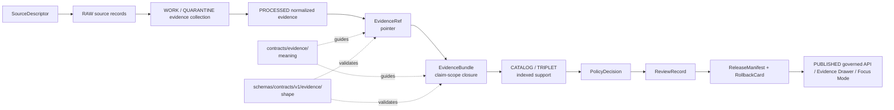

<!-- [KFM_META_BLOCK_V2]
doc_id: kfm://doc/contracts-evidence-readme
title: Evidence Contracts README
type: root-readme; governance-index; contract-family-guide
version: v0.2
status: draft; repo-facing; responsibility-root-index; implementation-bounded; NEEDS STEWARD REVIEW
owners:
  - OWNER_TBD — Evidence steward
  - OWNER_TBD — Contracts steward
  - OWNER_TBD — Schema steward
  - OWNER_TBD — Policy steward
  - OWNER_TBD — Catalog / proof steward
  - OWNER_TBD — Release steward
  - OWNER_TBD — Docs steward
created: NEEDS VERIFICATION — placeholder existed before v0.2 expansion
updated: 2026-06-24
policy_label: public; contracts; evidence; evidence-ref; evidence-bundle; evidence-drawer; citation-validation; semantic-contracts; proof-boundary; closure-artifact; claim-support; rights; sensitivity; transforms; checksums; release-gated; rollback-aware; not-schema; not-data-proofs; not-receipts; not-policy; not-release-manifest; not-runtime-proof
tags: [kfm, contracts, evidence, README, EvidenceRef, EvidenceBundle, EvidenceDrawerPayload, CitationValidationReport, SourceDescriptor, EvidenceRef, EvidenceBundle, PolicyDecision, ReviewRecord, ReleaseManifest, RollbackCard, AIReceipt, data-proofs, catalog, receipts, trust-membrane]
related:
  - ../README.md
  - ./evidence_ref.md
  - ./evidence_bundle.md
  - ./evidence_bundle/README.md
  - ./evidence_drawer_payload.md
  - ./citation_validation_report.md
  - ../../schemas/contracts/v1/evidence/evidence_ref.schema.json
  - ../../schemas/contracts/v1/evidence/evidence_bundle.schema.json
  - ../../fixtures/contracts/v1/evidence/
  - ../../tools/validators/validate_evidence_bundle.py
  - ../../tools/validators/validate_evidence_ref.py
  - ../../policy/evidence/
  - ../../data/proofs/README.md
  - ../../catalog/proof/README.md
  - ../../data/receipts/
  - ../../data/catalog/
  - ../../data/published/
  - ../../release/
  - ../../docs/doctrine/directory-rules.md
notes:
  - "Expanded from a minimal placeholder: '# Contracts: evidence'."
  - "This README governs the contracts/evidence/ contract family and does not store materialized EvidenceBundles, proof packs, receipts, release records, source records, or published artifacts."
  - "Contracts define evidence semantics. Schemas define machine shape. data/proofs/ is the proof-record home unless an ADR says otherwise. release/ decides publication."
  - "EvidenceBundle is the closure artifact; EvidenceRef is a governed pointer that does not by itself guarantee closure."
  - "This README is not an exhaustive live inventory of every evidence contract file. Use repo search or generated manifests for complete inventory."
[/KFM_META_BLOCK_V2] -->

<a id="top"></a>

# Evidence Contracts

> Evidence-family semantic contracts for KFM. These files define what evidence pointers, evidence closure artifacts, citation reports, and evidence-facing payloads **mean**. They do not define JSON shape, proof storage, source registry authority, receipts, policy permission, release approval, public API behavior, map rendering, graph truth, or AI answer truth.

<p>
  
  
  
  
  
</p>

`contracts/evidence/README.md`

## Quick jumps

[Purpose](#purpose) · [Authority boundary](#authority-boundary) · [Core objects](#core-objects) · [EvidenceRef versus EvidenceBundle](#evidenceref-versus-evidencebundle) · [Schema posture](#schema-posture) · [What belongs here](#what-belongs-here) · [What does not belong here](#what-does-not-belong-here) · [Lifecycle posture](#lifecycle-posture) · [Public and AI posture](#public-and-ai-posture) · [Review checklist](#review-checklist) · [Rollback](#rollback) · [Open questions](#open-questions)

---

## Purpose

`contracts/evidence/` is the contract-family home for evidence semantics.

It answers questions like:

- What is the difference between a pointer to evidence and a closed evidence bundle?
- What evidence is sufficient to support a governed claim scope?
- What citation, rights, sensitivity, transform, checksum, and spec-hash requirements must remain visible?
- How do evidence objects relate to policy decisions, release manifests, receipts, catalog records, and published surfaces?
- What must public APIs, Evidence Drawer payloads, and Focus Mode answers refuse when evidence is unresolved?

The root purpose is to make KFM cite-or-abstain behavior inspectable.

---

## Authority boundary

| Responsibility | Home | Rule |
|---|---|---|
| Evidence semantics | `contracts/evidence/` | This root. Defines meaning and boundaries. |
| Evidence pointer meaning | `contracts/evidence/evidence_ref.md` | Defines governed pointer semantics. |
| Evidence closure meaning | `contracts/evidence/evidence_bundle.md` | Defines claim-scope closure semantics. |
| EvidenceBundle folder guide | `contracts/evidence/evidence_bundle/README.md` | Supporting folder-form guidance only. |
| Machine shape | `schemas/contracts/v1/evidence/` | JSON Schema and machine-enforced fields. |
| Fixtures | `fixtures/contracts/v1/evidence/` | Valid/invalid/golden examples. |
| Validator implementation | `tools/validators/` | Executable validation, not semantic authority. |
| Policy/admissibility | `policy/evidence/` | Rights, sensitivity, allow/deny/restrict/abstain, release gating. |
| Materialized proof records | `data/proofs/` | EvidenceBundles/proof packs when stored as governed lifecycle data. |
| Receipts | `data/receipts/` | Validation, redaction, transform, review, and pipeline receipts. |
| Catalog records | `data/catalog/` | Catalog/provenance indexes and EvidenceBundle-linked records. |
| Published artifacts | `data/published/` | Public-safe released products after release. |
| Release/correction/rollback | `release/` | ReleaseManifest, correction path, RollbackCard, and release decisions. |
| Compatibility proof redirect | `catalog/proof/` | Drift fence only, not canonical proof authority. |

> [!IMPORTANT]
> **EvidenceBundle outranks generated language.** But `contracts/evidence/` is not the storage location for materialized proof. Contracts define meaning; schemas define shape; data/proofs holds proof records; release decides publication.

---

## Core objects

| Object / contract | Path | Meaning | Current posture |
|---|---|---|---|
| `EvidenceRef` | `contracts/evidence/evidence_ref.md` | Smallest governed pointer to supporting material used in claim assembly and runtime explanation. | PROPOSED; validator wiring needs verification. |
| `EvidenceBundle` | `contracts/evidence/evidence_bundle.md` | Closure artifact packaging all material needed to support a governed claim scope. | PROPOSED; paired schema confirmed. |
| `EvidenceBundle` folder guide | `contracts/evidence/evidence_bundle/README.md` | Folder-form governance guide that points to the flat contract and blocks proof storage in contracts. | Draft / supporting index. |
| `EvidenceDrawerPayload` | `contracts/evidence/evidence_drawer_payload.md` | Evidence-facing UI/API payload semantics, if present and reviewed. | Observed by repo search; details NEED VERIFICATION. |
| `CitationValidationReport` | `contracts/evidence/citation_validation_report.md` | Citation-checking report semantics, if present and reviewed. | Observed by repo search; details NEED VERIFICATION. |
| `KFM Geo Manifest` | `contracts/evidence/kfm_geo_manifest.md` | Geo artifact/evidence manifest semantics, if present and reviewed. | Referenced by sibling contracts; current details NEED VERIFICATION. |

This table is a root guide, not a complete manifest. Use generated inventory or repo search for full coverage.

---

## EvidenceRef versus EvidenceBundle

| Concern | EvidenceRef | EvidenceBundle |
|---|---|---|
| Meaning | Pointer to evidence material. | Claim-scope closure package. |
| Sufficiency | Not sufficient by itself for public ANSWER. | Can support downstream decisions if complete, valid, policy-cleared, and release-linked. |
| Closure | May be pre-closure. | Must include closed evidence refs, source records, citations, rights, sensitivity, transforms, checksums, and spec linkage. |
| Policy | Can inform policy, but does not prove clearance. | Can support policy evaluation, but is not a PolicyDecision. |
| Release | Not release. | Not release; ReleaseManifest remains separate. |
| Runtime | May be carried for traceability. | Must be resolvable for claim-grade public answers. |

KFM public and AI surfaces should not turn an unresolved `EvidenceRef` into an `ANSWER`. They should answer only when bundle closure and policy/release gates support the claim; otherwise they should return `ABSTAIN`, `DENY`, or `ERROR` as appropriate.

---

## Schema posture

Confirmed schema evidence exists for `EvidenceBundle` at:

```text
schemas/contracts/v1/evidence/evidence_bundle.schema.json
```

The confirmed `EvidenceBundle` schema requires:

- `bundle_id`
- `claim_scope`
- `evidence_refs`
- `source_records`
- `citations`
- `rights`
- `sensitivity`
- `transforms`
- `checksums`
- `spec_hash`

It also disallows undeclared top-level properties.

The `EvidenceRef` contract points to:

```text
schemas/contracts/v1/evidence/evidence_ref.schema.json
```

Its flat contract states that `EvidenceRef` requires `ref` and `kind`, and that `bundle_ref` remains optional/pre-closure until resolver integrity is enforced.

> [!CAUTION]
> Schema confirmation does not prove resolver behavior, fixture coverage, CI enforcement, policy enforcement, source rights, release state, or runtime behavior. Mark those `NEEDS VERIFICATION` unless checked in the current session.

---

## What belongs here

Allowed contents under `contracts/evidence/`:

| File type | Purpose |
|---|---|
| Object contract Markdown | Evidence object meaning and boundaries. |
| Family README | Root guidance, placement rules, review burden, open questions. |
| Folder README | Supporting documentation for a contract family. |
| Migration note | If flat-file versus folder-form authority changes. |
| Open questions | Review or ADR questions about evidence semantics. |

All content here should be human-readable semantic documentation.

---

## What does not belong here

| Do not place here | Correct home |
|---|---|
| Materialized EvidenceBundles or proof packs | `data/proofs/` |
| Evidence fixture JSON | `fixtures/contracts/v1/evidence/` |
| Validation receipts | `data/receipts/` |
| Catalog records | `data/catalog/` |
| Published artifacts | `data/published/` after release |
| ReleaseManifest, RollbackCard, CorrectionNotice | `release/` |
| SourceDescriptor records | `data/registry/sources/` or governed source registry home |
| Raw source records | `data/raw/` or source lifecycle homes |
| JSON Schema | `schemas/contracts/v1/evidence/` |
| Validator code | `tools/validators/` |
| Policy rules or policy decisions | `policy/evidence/` or governed policy-decision homes |
| API/runtime implementation | `apps/`, `packages/`, runtime/governed API roots |
| AI answers or generated summaries | governed AI/runtime surfaces with EvidenceBundle/AIReceipt support |

---

## Lifecycle posture

Evidence-family contracts participate in the KFM trust chain but do not replace the lifecycle.



Rules:

1. EvidenceRef is traceability, not closure by itself.
2. EvidenceBundle is closure, not policy permission.
3. PolicyDecision is permission, not release.
4. ReleaseManifest is publication authority, not evidence content.
5. RollbackCard must make dependent surfaces reversible.
6. AI answers remain downstream and must cite or abstain.

---

## Public and AI posture

| Surface | Evidence rule |
|---|---|
| Governed API `ANSWER` | Requires cited, bundle-closed support where claim-grade evidence is material. |
| Governed API `ABSTAIN` | Use when claim scope is unsupported or evidence cannot close. |
| Governed API `DENY` | Use when policy/sensitivity/rights block disclosure. |
| Governed API `ERROR` | Use when resolver/system failure prevents safe evaluation. |
| Evidence Drawer | Must show citations, source roles, rights/sensitivity posture, and relevant caveats. |
| Focus Mode / AI | Generated text is downstream. It must not outrank EvidenceBundle, policy, review, or release state. |
| Map / layer surfaces | Layer manifests and rendered features must cite released evidence and not expose internal proof stores. |
| Exports | Must preserve claim scope, EvidenceBundle refs, rights, sensitivity, release state, and rollback references where material. |

---

## Review checklist

Before promoting an evidence contract change:

- [ ] confirm correct root: `contracts/evidence/` for meaning, not proof storage;
- [ ] confirm schema path and schema posture;
- [ ] confirm fixture path and coverage if claiming validation maturity;
- [ ] confirm validator path and wiring if claiming executable validation;
- [ ] confirm policy path and rights/sensitivity behavior if claiming public use;
- [ ] confirm materialized proof home is `data/proofs/` unless ADR says otherwise;
- [ ] confirm receipts/catalog/release records remain in their own roots;
- [ ] confirm no public surface reads RAW/WORK/QUARANTINE/internal proof stores directly;
- [ ] confirm EvidenceBundle, PolicyDecision, ReviewRecord, ReleaseManifest, and RollbackCard boundaries are preserved;
- [ ] confirm AI surfaces cite or abstain and do not generate uncited ANSWER text.

---

## Rollback

Rollback this README if it:

- turns `contracts/evidence/` into materialized proof storage;
- treats EvidenceRef as claim closure;
- treats EvidenceBundle as policy permission or release approval;
- conflicts with the flat `evidence_bundle` or `evidence_ref` contracts without a migration note;
- claims schema, validator, fixture, CI, resolver, policy, release, or runtime maturity without current evidence;
- hides rights, sensitivity, citations, transforms, checksums, or spec-hash requirements;
- weakens the RAW → WORK/QUARANTINE → PROCESSED → CATALOG/TRIPLET → PUBLISHED trust path;
- lets AI-generated text outrank EvidenceBundle.

Rollback target: prior placeholder blob `52610d968389c4c5ab8902e6511712b81bd277d1`, followed by a drift note explaining why the richer evidence-family README was reverted.

---

## Open questions

| ID | Question | Status |
|---|---|---|
| OQ-EVIDENCE-README-01 | Should `contracts/evidence/` maintain a generated manifest of evidence contracts, schema posture, validator posture, and fixture coverage? | OPEN / TOOLING REVIEW |
| OQ-EVIDENCE-README-02 | Should EvidenceBundle remain a flat file plus folder README, or migrate fully to folder-form docs? | OPEN / CONTRACTS REVIEW |
| OQ-EVIDENCE-README-03 | What is the canonical resolver contract when `EvidenceRef.bundle_ref` is missing or unresolved? | OPEN / EVIDENCE + RUNTIME REVIEW |
| OQ-EVIDENCE-README-04 | Should proof storage be locked to `data/proofs/` by CI, with `catalog/proof/` kept only as a redirect fence? | OPEN / GOVERNANCE REVIEW |
| OQ-EVIDENCE-README-05 | Which public surfaces must hard-fail when citations, rights, sensitivity, checksums, transforms, or spec_hash are incomplete? | OPEN / POLICY + RELEASE REVIEW |

<p align="right"><a href="#top">Back to top</a></p>
