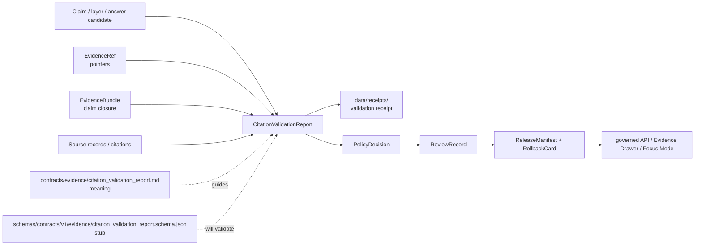

<!-- [KFM_META_BLOCK_V2]
doc_id: kfm://doc/contracts-evidence-citation-validation-report
title: Citation Validation Report Contract — Evidence
type: semantic-contract; validation-report-profile
version: v0.2
status: draft; PROPOSED; schema-stub-confirmed; evidence-family; citation-check-report; not-evidence-closure; NEEDS VERIFICATION before promotion
owners:
  - OWNER_TBD — Evidence steward
  - OWNER_TBD — Citation / source steward
  - OWNER_TBD — Contracts steward
  - OWNER_TBD — Schema steward
  - OWNER_TBD — Policy steward
  - OWNER_TBD — Release steward
  - OWNER_TBD — Docs steward
created: NEEDS VERIFICATION — scaffold existed before v0.2 expansion
updated: 2026-06-24
policy_label: public; contracts; evidence; citation-validation-report; citation-checking; source-record-checking; rights-checking; sensitivity-aware; evidence-bound; schema-stub; release-gated; rollback-aware; not-evidence-bundle; not-evidence-ref; not-policy-decision; not-release-manifest; not-proof-storage; not-runtime-proof
tags: [kfm, contracts, evidence, citation-validation-report, CitationValidationReport, citations, EvidenceRef, EvidenceBundle, EvidenceDrawerPayload, SourceDescriptor, rights, sensitivity, transforms, checksums, spec_hash, PolicyDecision, ReviewRecord, ReleaseManifest, RollbackCard, AIReceipt]
related:
  - ./README.md
  - ./evidence_ref.md
  - ./evidence_bundle.md
  - ./evidence_bundle/README.md
  - ./evidence_drawer_payload.md
  - ../../schemas/contracts/v1/evidence/citation_validation_report.schema.json
  - ../../schemas/contracts/v1/evidence/evidence_bundle.schema.json
  - ../../schemas/contracts/v1/evidence/evidence_ref.schema.json
  - ../../fixtures/contracts/v1/evidence/citation_validation_report/
  - ../../tools/validators/
  - ../../policy/evidence/
  - ../../data/proofs/README.md
  - ../../data/receipts/
  - ../../data/catalog/
  - ../../release/
  - ../../docs/doctrine/directory-rules.md
notes:
  - "Expanded from a PROPOSED scaffold at contracts/evidence/citation_validation_report.md."
  - "A paired schema exists at schemas/contracts/v1/evidence/citation_validation_report.schema.json, but it is a permissive scaffold with no declared properties and additionalProperties true. Field realization remains PROPOSED."
  - "CitationValidationReport is a validation/report object. It is not EvidenceBundle closure, not policy permission, not release approval, and not materialized proof storage."
  - "EvidenceBundle remains the claim-scope closure artifact; EvidenceRef remains a governed pointer."
  - "This contract defines report meaning only; it does not implement citation validation, resolver behavior, policy, release, public API behavior, or AI answers."
[/KFM_META_BLOCK_V2] -->

<a id="top"></a>

# Citation Validation Report Contract — Evidence

> Semantic contract for `CitationValidationReport`: the evidence-family report object that records citation/source/cross-reference validation findings for a governed claim, evidence bundle, evidence drawer payload, API answer, map layer, export, or AI summary candidate.

<p>
  
  
  
  
  
  
</p>

`contracts/evidence/citation_validation_report.md`

## Quick jumps

[Status](#status) · [Meaning](#meaning) · [Authority boundary](#authority-boundary) · [Schema posture](#schema-posture) · [Accepted uses](#accepted-uses) · [Exclusions](#exclusions) · [Recommended fields](#recommended-fields) · [Report model](#report-model) · [Finding families](#finding-families) · [Evidence and release rules](#evidence-and-release-rules) · [Lifecycle](#lifecycle) · [Validation expectations](#validation-expectations) · [Rollback](#rollback) · [Evidence basis](#evidence-basis) · [Open questions](#open-questions)

---

## Status

> [!IMPORTANT]
> **Status:** `draft` / semantic contract / validation-report profile  
> **Owner:** `OWNER_TBD`  
> **Contract path:** `contracts/evidence/citation_validation_report.md`  
> **Schema path checked:** `schemas/contracts/v1/evidence/citation_validation_report.schema.json` — **confirmed permissive scaffold**  
> **Truth posture:** target path, prior scaffold, paired schema scaffold, evidence-family README, EvidenceBundle contract, and EvidenceRef contract are confirmed from current repo evidence. Field-level shape beyond permissive schema acceptance, executable validator behavior, fixtures, CI wiring, policy enforcement, source-rights evaluation, release behavior, public API behavior, Evidence Drawer behavior, and runtime/AI behavior remain **NEEDS VERIFICATION**.

> [!CAUTION]
> `CitationValidationReport` is a report about citation/source-support checks. It is **not** an EvidenceBundle, not an EvidenceRef, not a PolicyDecision, not a ReleaseManifest, not a receipt by itself, not proof storage, and not AI answer authority.

---

## Meaning

`CitationValidationReport` records the results of checking whether cited evidence is present, resolvable, complete, scoped, rights-aware, sensitivity-aware, and suitable for the claim or public surface being reviewed.

It may be produced for:

- a claim candidate;
- an `EvidenceBundle` candidate;
- an `EvidenceDrawerPayload` candidate;
- a governed API answer candidate;
- a map/layer candidate;
- an export candidate;
- a Focus Mode / AI answer candidate;
- a release-candidate artifact.

The object answers:

- Which claim or artifact was checked?
- Which citations or source records were expected?
- Which citations were present, missing, unresolved, stale, rights-blocked, sensitivity-blocked, malformed, or out of scope?
- Which EvidenceRefs and EvidenceBundles were tested for closure?
- Which checks are PASS, FAIL, WARN, HOLD, DENY, ABSTAIN, ERROR, or NEEDS VERIFICATION?
- Which remediation, review, policy, release, or rollback action is required?

A citation validation report supports review and gating. It does **not** make an unsupported claim true, does not close an EvidenceBundle by itself, and does not authorize publication.

---

## Authority boundary

| Responsibility | Home | Rule |
|---|---|---|
| Report meaning | `contracts/evidence/citation_validation_report.md` | This contract defines semantics and boundaries. |
| Evidence pointer meaning | `contracts/evidence/evidence_ref.md` | EvidenceRef is a pointer, not closure. |
| Evidence closure meaning | `contracts/evidence/evidence_bundle.md` | EvidenceBundle is claim-scope closure, not report. |
| Evidence family README | `contracts/evidence/README.md` | Root guidance and evidence-family boundaries. |
| Machine shape | `schemas/contracts/v1/evidence/citation_validation_report.schema.json` | Current scaffold only; no field enforcement yet. |
| Fixtures | `fixtures/contracts/v1/evidence/citation_validation_report/` | Valid/invalid/golden examples. |
| Validator implementation | `tools/validators/` | Executable checking, not contract meaning. |
| Policy/admissibility | `policy/evidence/` | Rights, sensitivity, allow/deny/restrict/abstain, release gating. |
| Materialized proof records | `data/proofs/` | EvidenceBundles/proof packs when stored as governed lifecycle data. |
| Receipts | `data/receipts/` | Validation/redaction/transform/review receipts. |
| Catalog records | `data/catalog/` | Catalog/provenance indexes. |
| Release/correction/rollback | `release/` | ReleaseManifest, correction path, RollbackCard, and release decisions. |

---

## Schema posture

The paired schema exists at:

```text
schemas/contracts/v1/evidence/citation_validation_report.schema.json
```

The confirmed schema is a **permissive scaffold**. It declares:

- JSON Schema draft `2020-12`;
- `$id: kfm://schemas/contracts/v1/evidence/citation_validation_report.schema.json`;
- `title: "Citation Validation Report"`;
- `type: object`;
- `properties: {}`;
- `additionalProperties: true`;
- source-doc pointers in `x-kfm.source_docs`;
- `x-kfm.contract_doc: null`.

> [!WARNING]
> Because the schema has no declared fields and no contract-doc pointer, every field below is **PROPOSED** semantic guidance. Do not treat it as machine-enforced until the schema, fixtures, validators, policy tests, release checks, governed API behavior, and runtime behavior are verified.

---

## Accepted uses

| Use | Allowed? | Rule |
|---|---:|---|
| Reporting citation presence and resolvability | Yes | Must identify checked subject, checked citations, outcome, and reason. |
| Reporting EvidenceRef/EvidenceBundle closure issues | Yes | Must distinguish unresolved pointer from failed bundle closure. |
| Reporting rights or sensitivity citation blockers | Yes | Must cite policy/sensitivity/rights reason and required remediation. |
| Supporting release preflight | Conditional | Release may require this report, but report is not ReleaseManifest. |
| Supporting Evidence Drawer or Focus Mode gating | Conditional | Public/AI surfaces must use report outcomes to answer, abstain, deny, or error. |
| Recording validation receipts | Conditional | Receipts themselves belong in `data/receipts/`; this contract defines report semantics. |
| Treating PASS as publication approval | No | PolicyDecision, ReviewRecord, ReleaseManifest, and RollbackCard remain separate. |
| Treating a report as EvidenceBundle closure | No | EvidenceBundle contract/schema governs closure. |
| Storing proof material in this contract file/root | No | Materialized proof belongs under `data/proofs/`. |

---

## Exclusions

`CitationValidationReport` must not be used as:

| Misuse | Required outcome |
|---|---|
| EvidenceBundle closure | Use `EvidenceBundle`. |
| EvidenceRef pointer | Use `EvidenceRef`. |
| Policy decision | Use `PolicyDecision` / `policy/evidence/`. |
| Release manifest | Use `release/`. |
| SourceDescriptor or source registry record | Use source registry roots. |
| Materialized proof pack | Use `data/proofs/`. |
| Validation receipt storage | Use `data/receipts/`. |
| Public API response by itself | Use governed API response schemas and release gates. |
| AI answer authority | AI remains downstream and cite-or-abstain. |

---

## Recommended fields

The following fields are **PROPOSED** until the paired schema is expanded and validated.

| Field | Meaning |
|---|---|
| `report_id` | Stable report identifier. |
| `report_version` | Report contract/object version. |
| `checked_subject_ref` | Claim, artifact, layer, API answer, EvidenceDrawerPayload, EvidenceBundle, or AI summary candidate being checked. |
| `checked_subject_type` | Claim, bundle, drawer payload, layer, export, API answer, AI answer, release candidate, or schema-selected equivalent. |
| `claim_scope` | Claim scope being evaluated, if applicable. |
| `checked_at` | Time the report was generated. |
| `validator_ref` | Validator/tool/workflow/check profile used. |
| `validator_version` | Version or digest of validator profile. |
| `input_evidence_refs` | EvidenceRefs considered. |
| `input_bundle_refs` | EvidenceBundle refs considered. |
| `expected_citations` | Citation refs or citation requirements expected. |
| `observed_citations` | Citations observed in the subject. |
| `source_record_refs` | Source records used to validate citation support. |
| `citation_findings` | Per-citation findings and reasons. |
| `bundle_closure_findings` | Bundle/ref closure findings. |
| `rights_findings` | Rights/license/terms findings. |
| `sensitivity_findings` | Sensitivity/redaction/access findings. |
| `checksum_findings` | Checksum/digest findings where relevant. |
| `outcome` | PASS, FAIL, WARN, HOLD, DENY, ABSTAIN, ERROR, or NEEDS VERIFICATION. |
| `blocking` | Whether finding blocks promotion/release/public answer. |
| `remediation` | Required action before answer/release/export. |
| `policy_decision_ref` | PolicyDecision ref when policy evaluated. |
| `review_ref` | ReviewRecord or steward review ref. |
| `release_manifest_ref` | ReleaseManifest ref if this report supports release. |
| `receipt_refs` | Validation/receipt refs stored outside this contract root. |
| `rollback_ref` | RollbackCard or rollback target. |
| `limitations` | Report limits and non-authority caveats. |
| `spec_hash` | Deterministic spec/schema baseline hash. |

---

## Report model

A reviewed CitationValidationReport should bind checked subject, citation inputs, EvidenceRef/EvidenceBundle closure results, rights/sensitivity results, outcome, remediation, review/release refs, and rollback.

```text
citation_validation_report = {
  report_id,
  checked_subject_ref,
  checked_subject_type,
  claim_scope,
  checked_at,
  validator_ref,
  input_evidence_refs,
  input_bundle_refs,
  expected_citations,
  observed_citations,
  source_record_refs,
  citation_findings,
  bundle_closure_findings,
  rights_findings,
  sensitivity_findings,
  checksum_findings,
  outcome,
  blocking,
  remediation,
  policy_decision_ref,
  review_ref,
  release_manifest_ref,
  receipt_refs,
  rollback_ref,
  spec_hash
}
```

Exact serialized shape is **NEEDS VERIFICATION** until the schema and validators are field-complete.

---

## Finding families

| Finding family | Meaning | Blocking posture |
|---|---|---|
| `citation_present` | Citation exists and is visible in required surface. | Usually PASS. |
| `citation_missing` | Required citation is absent. | Usually FAIL or HOLD. |
| `citation_unresolved` | Citation cannot resolve to source/evidence. | FAIL / ABSTAIN / ERROR depending on cause. |
| `citation_out_of_scope` | Citation does not support the checked claim scope. | FAIL or WARN. |
| `evidence_ref_unclosed` | EvidenceRef is pre-closure or lacks bundle closure. | HOLD / ABSTAIN for public answer. |
| `bundle_missing` | Required EvidenceBundle is missing. | FAIL / ABSTAIN. |
| `bundle_incomplete` | EvidenceBundle exists but is missing required material. | FAIL / HOLD. |
| `rights_blocked` | Rights/license/terms prevent exposure. | DENY / HOLD. |
| `sensitivity_blocked` | Sensitivity policy prevents disclosure. | DENY / RESTRICT / HOLD. |
| `checksum_mismatch` | Digest/checksum mismatch or drift. | ERROR / HOLD. |
| `stale_or_superseded` | Citation/evidence is stale, superseded, or corrected. | WARN / HOLD / ABSTAIN depending on policy. |
| `validator_error` | Validator/resolver failure prevents safe evaluation. | ERROR. |

---

## Evidence and release rules

1. A citation validation report can support review; it cannot replace review.
2. PASS does not mean release.
3. FAIL/HOLD/DENY/ABSTAIN/ERROR must remain visible to public/AI answer gating.
4. EvidenceRef without bundle closure is insufficient for claim-grade public `ANSWER` unless a policy explicitly allows a lower support posture.
5. EvidenceBundle closure does not equal policy allow.
6. Policy allow does not equal release.
7. Release requires ReleaseManifest and rollback/correction path.
8. Citation validation receipts belong in `data/receipts/`, not in `contracts/`.
9. Materialized proof records belong in `data/proofs/`, not in `contracts/`.
10. AI summaries must cite supported evidence or abstain.

---

## Lifecycle



---

## Validation expectations

Before this contract is treated as mature, maintainers should verify:

- [ ] schema is expanded beyond the current permissive scaffold;
- [ ] schema points back to this contract doc in `x-kfm.contract_doc`;
- [ ] fixtures cover pass, missing citation, unresolved citation, out-of-scope citation, unclosed EvidenceRef, missing EvidenceBundle, incomplete EvidenceBundle, rights block, sensitivity block, checksum mismatch, stale/superseded citation, validator error, and release-ready report;
- [ ] validator exists and is wired into current tooling/CI before claiming enforcement;
- [ ] resolver behavior is defined for unresolved citations and unclosed EvidenceRefs;
- [ ] report outcomes map to governed API outcomes where appropriate;
- [ ] policy checks rights and sensitivity before release;
- [ ] release artifacts cite report IDs and rollback targets where material;
- [ ] Evidence Drawer and Focus Mode refuse unsupported/generated claims when citation validation blocks answer;
- [ ] correction and supersession preserve prior reports as auditable history.

---

## Rollback

Rollback is required if this contract:

- claims schema, validator, fixture, CI, resolver, policy, release, or runtime maturity without proof;
- treats CitationValidationReport as EvidenceBundle closure, EvidenceRef pointer, policy decision, release manifest, source registry record, receipt storage, materialized proof storage, or AI answer authority;
- hides missing/unresolved/out-of-scope citations;
- hides rights, sensitivity, checksum, stale/supersession, or closure blockers;
- allows public/AI `ANSWER` when citation validation outcome should be ABSTAIN, DENY, HOLD, or ERROR;
- weakens the RAW → WORK/QUARANTINE → PROCESSED → CATALOG/TRIPLET → PUBLISHED trust path.

Rollback target: revert `contracts/evidence/citation_validation_report.md` to prior scaffold blob `562c0108e240f10677616c6c794acb99455fae92`, then record why the richer contract was reverted.

---

## Evidence basis

| Evidence | Status | Supports | Limits |
|---|---|---|---|
| Prior `contracts/evidence/citation_validation_report.md` | CONFIRMED | Target existed as scaffold sourced from archaeology API docs. | Scaffold did not define full semantic contract. |
| `schemas/contracts/v1/evidence/citation_validation_report.schema.json` | CONFIRMED schema scaffold | Confirms schema path, source-doc inventory, and permissive stub posture. | No fields are declared; `contract_doc` is null. |
| `contracts/evidence/README.md` | CONFIRMED evidence-family guide | Lists CitationValidationReport and says details need verification; defines EvidenceRef/EvidenceBundle boundaries. | Root guide, not detailed contract. |
| `contracts/evidence/evidence_bundle.md` | CONFIRMED sibling contract | Defines EvidenceBundle as claim-scope closure artifact and not release/policy. | Resolver behavior still needs verification. |
| `contracts/evidence/evidence_ref.md` | CONFIRMED sibling contract | Defines EvidenceRef as governed pointer and not closure artifact. | Validator wiring needs verification. |
| Uploaded KFM authoring prompt v2 | CONFIRMED user-supplied guidance | Requires evidence-first, implementation-honest, visually polished Markdown with visible verification and rollback posture. | Authoring guidance, not implementation proof. |

---

## Open questions

| ID | Question | Status |
|---|---|---|
| OQ-CITATION-REPORT-01 | Should CitationValidationReport use a dedicated schema or a generic validation-report schema shared across domains? | OPEN / SCHEMA REVIEW |
| OQ-CITATION-REPORT-02 | Which report outcomes are canonical: PASS/FAIL/WARN/HOLD/DENY/ABSTAIN/ERROR/NEEDS VERIFICATION, or a smaller enum? | OPEN / POLICY + API REVIEW |
| OQ-CITATION-REPORT-03 | Should report receipts be generated automatically under `data/receipts/` for every release candidate? | OPEN / RELEASE + TOOLING REVIEW |
| OQ-CITATION-REPORT-04 | How should unresolved EvidenceRefs and missing EvidenceBundles map to governed API outcomes? | OPEN / RUNTIME REVIEW |
| OQ-CITATION-REPORT-05 | Which public surfaces must display citation-validation blockers versus silently deny/abstain? | OPEN / UI + POLICY REVIEW |

<p align="right"><a href="#top">Back to top</a></p>
