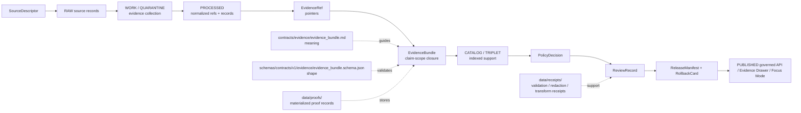

<!-- [KFM_META_BLOCK_V2]
doc_id: kfm://doc/contracts-evidence-evidence-bundle
title: EvidenceBundle Contract — Evidence
type: semantic-contract; closure-artifact-profile
version: v0.2
status: draft; PROPOSED; schema-confirmed; evidence-family; claim-scope-closure; resolver-needed; NEEDS VERIFICATION before promotion
owners:
  - OWNER_TBD — Evidence steward
  - OWNER_TBD — Contracts steward
  - OWNER_TBD — Schema steward
  - OWNER_TBD — Policy steward
  - OWNER_TBD — Catalog / proof steward
  - OWNER_TBD — Release steward
  - OWNER_TBD — Docs steward
created: NEEDS VERIFICATION — v0.1 flat contract existed before v0.2 expansion
updated: 2026-06-24
policy_label: public; contracts; evidence; evidence-bundle; closure-artifact; claim-scope; evidence-ref-closure; source-records; citations; rights; sensitivity; transforms; checksums; spec-hash; resolver-aware; release-gated; rollback-aware; not-policy-decision; not-release-manifest; not-proof-storage-by-itself; not-receipt; not-source-registry; not-runtime-proof; not-ai-answer
tags: [kfm, contracts, evidence, EvidenceBundle, evidence_bundle, EvidenceRef, claim_scope, source_records, citations, rights, sensitivity, transforms, checksums, spec_hash, SourceDescriptor, PolicyDecision, ReviewRecord, ReleaseManifest, RollbackCard, AIReceipt, data-proofs, data-receipts, data-catalog, trust-membrane]
related:
  - ./README.md
  - ./evidence_ref.md
  - ./evidence_bundle/README.md
  - ./citation_validation_report.md
  - ./evidence_drawer_payload.md
  - ../../schemas/contracts/v1/evidence/evidence_bundle.schema.json
  - ../../schemas/contracts/v1/evidence/evidence_ref.schema.json
  - ../../fixtures/contracts/v1/evidence/evidence_bundle/
  - ../../tools/validators/validate_evidence_bundle.py
  - ../../tools/validators/_common/run_all.py
  - ../../policy/evidence/
  - ../../data/proofs/README.md
  - ../../catalog/proof/README.md
  - ../../data/receipts/
  - ../../data/catalog/
  - ../../data/published/
  - ../../release/
  - ../../docs/doctrine/directory-rules.md
notes:
  - "Expanded from the prior flat evidence_bundle contract while preserving its core meaning and schema-aligned field list."
  - "The paired schema at schemas/contracts/v1/evidence/evidence_bundle.schema.json is confirmed and declares required fields plus additionalProperties false."
  - "The schema metadata points to validator tools/validators/validate_evidence_bundle.py and policy/evidence/, and the prior flat contract stated the validator is wired in tools/validators/_common/run_all.py; current runtime/CI behavior still needs verification before broad implementation claims."
  - "EvidenceBundle is the claim-scope closure artifact. It is not an EvidenceRef, not a PolicyDecision, not a ReleaseManifest, not a receipt by itself, not proof-storage placement guidance, and not AI answer authority."
  - "Materialized proof records belong under data/proofs/ unless a future ADR changes proof authority."
[/KFM_META_BLOCK_V2] -->

<a id="top"></a>

# EvidenceBundle Contract — Evidence

> Semantic contract for `EvidenceBundle`: the governed claim-scope closure artifact that packages evidence refs, source records, citations, rights, sensitivity, transforms, checksums, and spec linkage so downstream policy, review, release, runtime, Evidence Drawer, map, export, and AI surfaces can cite-or-abstain instead of guessing.

<p>
  
  
  
  
  
  
</p>

`contracts/evidence/evidence_bundle.md`

## Quick jumps

[Status](#status) · [Meaning](#meaning) · [Authority boundary](#authority-boundary) · [Schema posture](#schema-posture) · [Fields](#fields) · [Accepted uses](#accepted-uses) · [Exclusions](#exclusions) · [Bundle model](#bundle-model) · [Closure rules](#closure-rules) · [Lifecycle](#lifecycle) · [Validation expectations](#validation-expectations) · [Public and AI posture](#public-and-ai-posture) · [Rollback](#rollback) · [Evidence basis](#evidence-basis) · [Open questions](#open-questions)

---

## Status

> [!IMPORTANT]
> **Status:** `draft` / semantic contract / closure-artifact profile  
> **Owner:** `OWNER_TBD`  
> **Contract path:** `contracts/evidence/evidence_bundle.md`  
> **Schema path checked:** `schemas/contracts/v1/evidence/evidence_bundle.schema.json` — **confirmed fielded schema**  
> **Truth posture:** target path, prior flat contract, paired schema, evidence-family README, EvidenceBundle folder README, and EvidenceRef contract are confirmed from current repo evidence. Validator path metadata and prior contract validator-wiring claim are confirmed as text; actual validator behavior, current CI status, fixture coverage, resolver behavior, policy enforcement, release behavior, public API behavior, Evidence Drawer behavior, and runtime/AI behavior remain **NEEDS VERIFICATION** unless separately tested.

> [!CAUTION]
> `EvidenceBundle` is evidence closure for a claim scope. It is **not** an EvidenceRef, not a PolicyDecision, not a ReleaseManifest, not a receipt by itself, not source registry authority, not public API response by itself, not a map layer, and not AI answer authority.

---

## Meaning

`EvidenceBundle` is the KFM closure artifact that packages all material needed to support a governed claim scope.

It answers whether evidence has been sufficiently assembled for downstream decisions by tying together:

- the claim scope;
- governed evidence refs;
- reconstructable source records;
- publication-ready citations;
- rights/license posture;
- sensitivity posture;
- transforms from source evidence to derived artifacts;
- checksums for tamper/drift detection;
- spec/schema linkage.

EvidenceBundle supports public truth only when policy, review, release, and rollback gates also close. It is the evidence side of cite-or-abstain, not the whole publication decision.

---

## Authority boundary

| Responsibility | Home | Rule |
|---|---|---|
| EvidenceBundle meaning | `contracts/evidence/evidence_bundle.md` | This semantic contract. |
| EvidenceBundle folder guide | `contracts/evidence/evidence_bundle/README.md` | Supporting folder-form guide; not a second canonical contract. |
| EvidenceRef meaning | `contracts/evidence/evidence_ref.md` | EvidenceRef is a pointer and does not guarantee closure. |
| Citation checking | `contracts/evidence/citation_validation_report.md` | Citation reports can check support; they do not close bundles by themselves. |
| Machine shape | `schemas/contracts/v1/evidence/evidence_bundle.schema.json` | Confirmed JSON Schema for required fields and field constraints. |
| Fixtures | `fixtures/contracts/v1/evidence/evidence_bundle/` | Valid/invalid/golden examples. |
| Validator implementation | `tools/validators/validate_evidence_bundle.py` | Executable validation, not semantic authority. |
| Policy/admissibility | `policy/evidence/` | Rights, sensitivity, allow/deny/restrict/abstain, release gating. |
| Materialized proof records | `data/proofs/` | EvidenceBundles/proof packs when stored as governed lifecycle data. |
| Receipts | `data/receipts/` | Validation, redaction, transform, and review receipts. |
| Catalog records | `data/catalog/` | Catalog/provenance indexes and bundle-linked records. |
| Published artifacts | `data/published/` | Public-safe released products after release. |
| Release/correction/rollback | `release/` | ReleaseManifest, correction path, RollbackCard, and release decisions. |

---

## Schema posture

The paired schema is confirmed at:

```text
schemas/contracts/v1/evidence/evidence_bundle.schema.json
```

Confirmed schema posture:

- `$schema`: JSON Schema draft 2020-12;
- `$id`: `https://schemas.kfm.local/contracts/v1/evidence/evidence_bundle.schema.json`;
- `title`: `evidence_bundle`;
- `type`: `object`;
- `x-kfm.contract_doc`: `contracts/evidence/evidence_bundle.md`;
- `x-kfm.fixtures_root`: `fixtures/contracts/v1/evidence/evidence_bundle/`;
- `x-kfm.validator`: `tools/validators/validate_evidence_bundle.py`;
- `x-kfm.policy`: `policy/evidence/`;
- `x-kfm.status`: `PROPOSED`;
- root `additionalProperties: false`.

> [!WARNING]
> Schema confirmation does not prove current validator execution, fixture coverage, CI enforcement, resolver behavior, policy enforcement, source-rights evaluation, release state, public API behavior, Evidence Drawer behavior, or runtime/AI behavior. Those remain **NEEDS VERIFICATION** until checked.

---

## Fields

The schema confirms the following fields and required status.

| Field | Required | Meaning | Contract notes |
|---|---:|---|---|
| `bundle_id` | Yes | Stable identifier for the closure package. | Must match pattern `^[a-z][a-z0-9_:.-]*$`. |
| `claim_scope` | Yes | Human/machine scope statement describing what claims this bundle supports. | Scope limits what the bundle can be cited for. |
| `evidence_refs` | Yes | Constituent EvidenceRef members included in closure. | Array, minItems 1; items ref `evidence_ref.schema.json`. |
| `source_records` | Yes | Source-level record handles used to reconstruct provenance. | Array, minItems 1. |
| `citations` | Yes | Publication-ready citation strings backing the claim scope. | Array, minItems 1. |
| `rights` | Yes | Effective rights summary after bundle assembly. | Object requires `license` and disallows undeclared fields. |
| `sensitivity` | Yes | Sensitivity label for exposure constraints. | References policy sensitivity-label schema. |
| `transforms` | Yes | Ordered transformations applied from source evidence to derived artifacts. | Required array. |
| `checksums` | Yes | Hash map covering critical inputs/outputs in closure. | Object minProperties 1; values match `sha256:<64 hex>`. |
| `spec_hash` | Yes | Deterministic spec identity tying bundle to contract/schema baseline. | References common spec-hash schema. |

---

## Accepted uses

| Use | Allowed? | Rule |
|---|---:|---|
| Supporting a governed claim scope | Yes | Must be complete, valid, rights/sensitivity-aware, and scoped. |
| Supporting policy evaluation | Yes | Bundle supports policy checks, but is not itself PolicyDecision. |
| Supporting release preflight | Conditional | Release may require a bundle, but bundle is not ReleaseManifest. |
| Supporting Evidence Drawer display | Conditional | Drawer must expose citations/source/rights/sensitivity/transform/checksum posture where material. |
| Supporting Focus Mode / AI answer | Conditional | AI may answer only if bundle closure plus policy/release gates support the claim. |
| Storing materialized proof data in `contracts/` | No | Store governed proof records in `data/proofs/`. |
| Treating EvidenceBundle as policy clearance or publication approval | No | Use PolicyDecision, ReviewRecord, ReleaseManifest, and RollbackCard. |
| Treating an EvidenceRef as equivalent to EvidenceBundle | No | EvidenceRef is pointer; EvidenceBundle is closure. |

---

## Exclusions

`EvidenceBundle` must not be used as:

| Misuse | Required outcome |
|---|---|
| EvidenceRef pointer | Use `EvidenceRef`. |
| Policy decision | Use `PolicyDecision` / `policy/evidence/`. |
| ReleaseManifest | Use `release/`. |
| SourceDescriptor | Use source registry roots. |
| Validation receipt storage | Use `data/receipts/`. |
| Materialized proof storage location | Use `data/proofs/`. |
| Catalog record | Use `data/catalog/`. |
| Public API response by itself | Use governed API response schemas and release gates. |
| AI answer authority | AI remains downstream and cite-or-abstain. |

---

## Bundle model

A reviewed EvidenceBundle should bind claim scope, refs, source records, citations, rights, sensitivity, transforms, checksums, and spec identity.

```text
evidence_bundle = {
  bundle_id,
  claim_scope,
  evidence_refs,
  source_records,
  citations,
  rights,
  sensitivity,
  transforms,
  checksums,
  spec_hash
}
```

The schema currently enforces these fields and forbids undeclared top-level fields. Cross-record resolver integrity remains **NEEDS VERIFICATION**.

---

## Closure rules

1. `EvidenceRef` is not enough for public claim-grade `ANSWER` by itself.
2. `EvidenceBundle` closes a claim-scope evidence set; it does not decide policy.
3. `claim_scope` limits the claims the bundle can support.
4. `evidence_refs`, `source_records`, and `citations` must be non-empty.
5. `rights.license` must be present.
6. `sensitivity` must be present before exposure decisions.
7. `transforms` must preserve derivation reviewability.
8. `checksums` must protect critical inputs/outputs from drift or tampering.
9. `spec_hash` ties the bundle to the governing contract/schema baseline.
10. Policy, review, release, correction, and rollback remain separate authority surfaces.

---

## Lifecycle



---

## Validation expectations

Before this contract is treated as implementation-mature, maintainers should verify:

- [ ] schema and this contract agree on all required fields;
- [ ] `tools/validators/validate_evidence_bundle.py` exists and is wired in current CI/tooling;
- [ ] fixtures cover a valid bundle, missing required field, empty evidence_refs/source_records/citations, invalid `bundle_id`, missing `rights.license`, extra root property, invalid checksum, missing sensitivity, missing spec_hash, unresolved EvidenceRef, and source-rights block;
- [ ] resolver behavior is defined when an EvidenceRef cannot close into a bundle;
- [ ] policy checks rights and sensitivity before release;
- [ ] release artifacts reference bundle IDs and rollback targets;
- [ ] Evidence Drawer and Focus Mode refuse uncited/generated claims when bundle closure is missing;
- [ ] correction and supersession preserve prior bundles as auditable history.

---

## Public and AI posture

| Surface | EvidenceBundle rule |
|---|---|
| Governed API `ANSWER` | Claim-grade answers should reference bundle-closed evidence where material. |
| Governed API `ABSTAIN` | Use when evidence cannot close for the requested claim scope. |
| Governed API `DENY` | Use when rights/sensitivity/policy blocks disclosure. |
| Governed API `ERROR` | Use when resolver/system failure prevents safe evaluation. |
| Evidence Drawer | Must preserve citations, source records, rights, sensitivity, transform, checksum, and caveat posture. |
| Focus Mode / AI | Generated text is downstream. It must cite bundle-supported evidence or abstain. |
| Map/layer surfaces | Layer manifests and rendered features must cite released bundle support and not expose internal proof stores. |
| Exports | Preserve bundle id, claim scope, citations, rights, sensitivity, release state, and rollback references where material. |

---

## Rollback

Rollback is required if this contract:

- conflicts with the confirmed schema while claiming schema alignment;
- treats EvidenceBundle as EvidenceRef, PolicyDecision, ReleaseManifest, SourceDescriptor, receipt, catalog record, public API response, map layer, or AI answer authority;
- treats `contracts/evidence/` as materialized proof storage;
- removes rights, sensitivity, transforms, checksums, citations, source records, or spec_hash from the semantic requirements;
- claims validator, fixture, CI, resolver, policy, release, or runtime maturity without current evidence;
- weakens cite-or-abstain behavior or lets generated text outrank EvidenceBundle;
- weakens the RAW → WORK/QUARANTINE → PROCESSED → CATALOG/TRIPLET → PUBLISHED trust path.

Rollback target: revert `contracts/evidence/evidence_bundle.md` to prior blob `580f574c0b02d3e0516c2443b96fc50b8fbea32a`, then record why the richer contract was reverted.

---

## Evidence basis

| Evidence | Status | Supports | Limits |
|---|---|---|---|
| Prior `contracts/evidence/evidence_bundle.md` | CONFIRMED | Existing contract already defined EvidenceBundle as claim-scope closure and listed schema-aligned fields. | Needed stronger KFM Meta Block v2, boundary, lifecycle, and rollback posture. |
| `schemas/contracts/v1/evidence/evidence_bundle.schema.json` | CONFIRMED fielded schema | Confirms required fields, property constraints, validator path metadata, policy path metadata, and `additionalProperties: false`. | Does not prove validator execution, CI, resolver, policy, or runtime behavior. |
| `contracts/evidence/README.md` | CONFIRMED evidence-family guide | Confirms evidence semantics root, EvidenceRef/EvidenceBundle separation, proof-storage boundary, and cite-or-abstain posture. | Root guide, not detailed schema. |
| `contracts/evidence/evidence_bundle/README.md` | CONFIRMED folder guide | Confirms folder form is supporting guidance and not materialized proof storage. | Not a separate canonical contract. |
| `contracts/evidence/evidence_ref.md` | CONFIRMED sibling contract | Confirms EvidenceRef is a governed pointer and not closure. | Resolver integrity remains NEEDS VERIFICATION. |
| Uploaded KFM authoring prompt v2 | CONFIRMED user-supplied guidance | Requires evidence-first, implementation-honest, visually polished Markdown with visible verification and rollback posture. | Authoring guidance, not implementation proof. |

---

## Open questions

| ID | Question | Status |
|---|---|---|
| OQ-EB-01 | Should EvidenceBundle stay as a flat contract file, or migrate fully to folder-form docs with `FIELDS.md` and `EXAMPLES.md`? | OPEN / CONTRACTS REVIEW |
| OQ-EB-02 | What is the canonical resolver contract when an EvidenceRef is missing, unresolved, or points to a superseded bundle? | OPEN / EVIDENCE + RUNTIME REVIEW |
| OQ-EB-03 | Which fixtures and CI jobs prove EvidenceBundle closure across all supported domains? | OPEN / VALIDATION REVIEW |
| OQ-EB-04 | Which public surfaces must hard-fail when rights, sensitivity, citations, transforms, checksums, or spec_hash are incomplete? | OPEN / POLICY + RELEASE REVIEW |
| OQ-EB-05 | Should materialized EvidenceBundles be stored only under `data/proofs/`, or should an ADR create another canonical proof home? | OPEN / ADR REVIEW |

<p align="right"><a href="#top">Back to top</a></p>
