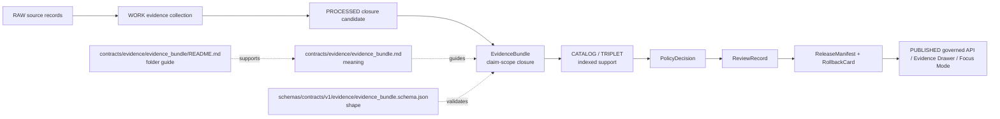

<!-- [KFM_META_BLOCK_V2]
doc_id: kfm://doc/contracts-evidence-evidence-bundle-readme
title: Evidence Bundle Contract Folder README
type: folder-readme; governance-index; contract-authoring-guide
version: v0.2
status: draft; folder-form; repo-facing; implementation-bounded; NEEDS STEWARD REVIEW
owners:
  - OWNER_TBD — Evidence steward
  - OWNER_TBD — Contracts steward
  - OWNER_TBD — Schema steward
  - OWNER_TBD — Policy steward
  - OWNER_TBD — Catalog / proof steward
  - OWNER_TBD — Release steward
  - OWNER_TBD — Docs steward
created: NEEDS VERIFICATION — placeholder existed before v0.2 expansion
updated: 2026-06-24
policy_label: public; contracts; evidence; evidence-bundle; folder-readme; semantic-contract-index; closure-artifact; claim-support; rights; sensitivity; transforms; checksums; spec-hash; resolver-aware; release-gated; rollback-aware; not-schema; not-proof-storage; not-policy; not-release-manifest; not-data-lifecycle-root; not-runtime-proof
tags: [kfm, contracts, evidence, evidence-bundle, EvidenceBundle, EvidenceRef, claim-scope, source-records, citations, rights, sensitivity, transforms, checksums, spec_hash, SourceDescriptor, EvidenceBundle, PolicyDecision, ReviewRecord, ReleaseManifest, RollbackCard, catalog, proof, data-proofs, trust-membrane]
related:
  - ../README.md
  - ../evidence_bundle.md
  - ../evidence_ref.md
  - ../../../schemas/contracts/v1/evidence/evidence_bundle.schema.json
  - ../../../schemas/contracts/v1/evidence/evidence_ref.schema.json
  - ../../../fixtures/contracts/v1/evidence/evidence_bundle/
  - ../../../tools/validators/validate_evidence_bundle.py
  - ../../../tools/validators/_common/run_all.py
  - ../../../policy/evidence/
  - ../../../data/proofs/README.md
  - ../../../catalog/proof/README.md
  - ../../../data/receipts/
  - ../../../data/catalog/
  - ../../../release/
  - ../../../docs/doctrine/directory-rules.md
notes:
  - "Expanded from a single-character placeholder."
  - "This README governs the folder form contracts/evidence/evidence_bundle/ and points to the flat semantic contract contracts/evidence/evidence_bundle.md."
  - "EvidenceBundle meaning is defined by contracts/evidence/evidence_bundle.md; machine shape is defined by schemas/contracts/v1/evidence/evidence_bundle.schema.json."
  - "Do not store canonical EvidenceBundles, proof packs, receipts, release records, source records, or published artifacts in this contracts folder."
  - "Canonical proof records belong under data/proofs/ unless a future ADR changes proof authority."
[/KFM_META_BLOCK_V2] -->

<a id="top"></a>

# Evidence Bundle Contract Folder

> Folder README for `contracts/evidence/evidence_bundle/`. This folder is a contract-documentation surface for EvidenceBundle meaning, examples, notes, and review guidance. It is **not** the canonical proof-storage home, not the JSON Schema, not the validator implementation, not a release record, and not runtime proof.

<p>
  
  
  
  
  
  
</p>

`contracts/evidence/evidence_bundle/README.md`

## Quick jumps

[Purpose](#purpose) · [Authority boundary](#authority-boundary) · [Flat contract and folder form](#flat-contract-and-folder-form) · [EvidenceBundle meaning](#evidencebundle-meaning) · [Schema posture](#schema-posture) · [What belongs here](#what-belongs-here) · [What does not belong here](#what-does-not-belong-here) · [Lifecycle posture](#lifecycle-posture) · [Validation posture](#validation-posture) · [Review checklist](#review-checklist) · [Rollback](#rollback) · [Open questions](#open-questions)

---

## Purpose

This folder README documents how to use the `evidence_bundle` contract family without turning a contract folder into a proof store.

`EvidenceBundle` is the governed closure artifact for a claim scope. It packages the evidence refs, source records, citations, rights, sensitivity, transforms, checksums, and spec linkage needed to support downstream decisions.

The primary semantic contract currently lives at:

```text
contracts/evidence/evidence_bundle.md
```

This folder may hold supporting contract documentation if the project later needs examples, migration notes, diagrams, or review notes for the EvidenceBundle contract family.

---

## Authority boundary

| Responsibility | Home | Rule |
|---|---|---|
| EvidenceBundle meaning | `contracts/evidence/evidence_bundle.md` and this folder README | Defines semantic meaning and authoring/review posture. |
| EvidenceRef meaning | `contracts/evidence/evidence_ref.md` | Defines pointer/ref semantics; not closure by itself. |
| Machine shape | `schemas/contracts/v1/evidence/evidence_bundle.schema.json` | JSON Schema for required fields and field constraints. |
| Fixtures | `fixtures/contracts/v1/evidence/evidence_bundle/` | Valid/invalid/golden examples. |
| Validator implementation | `tools/validators/validate_evidence_bundle.py` | Executable validation, not contract meaning. |
| Policy | `policy/evidence/` | Allow/deny/restrict/abstain, sensitivity, rights, and use policy. |
| Canonical proof records | `data/proofs/` | EvidenceBundles/proof records when materialized as governed data. |
| Receipts | `data/receipts/` | Validation, redaction, transform, and review receipts. |
| Catalog records | `data/catalog/` | Catalog/provenance indexes and EvidenceBundle-linked catalog records. |
| Release/correction/rollback | `release/` | ReleaseManifest, correction path, RollbackCard, and release decisions. |
| Compatibility proof redirect | `catalog/proof/` | Drift fence only; not canonical proof authority. |

> [!IMPORTANT]
> **EvidenceBundle outranks generated language, but this contracts folder is not the EvidenceBundle storage root.** Contracts define meaning. Schemas define shape. Data/proof roots hold materialized proof records. Release roots decide publication.

---

## Flat contract and folder form

Current repo evidence confirms both:

```text
contracts/evidence/evidence_bundle.md
contracts/evidence/evidence_bundle/README.md
```

To avoid parallel authority:

- the flat file `contracts/evidence/evidence_bundle.md` remains the primary object contract until an ADR or migration note says otherwise;
- this folder README is a supporting governance index for the contract family;
- do not duplicate the full contract in multiple places unless one is explicitly marked superseded or redirected;
- any future split into `FIELDS.md`, `EXAMPLES.md`, or `OPEN-QUESTIONS.md` must preserve one canonical meaning surface.

---

## EvidenceBundle meaning

An `EvidenceBundle` is the claim-scope closure package that supports governed claims and downstream decisions.

It is expected to answer:

- What claim scope is being supported?
- Which `EvidenceRef` entries are included?
- Which source records allow provenance reconstruction?
- Which citations are publication-ready?
- Which rights and sensitivity controls apply?
- Which transforms were applied from source to derived artifacts?
- Which checksums detect tampering or drift?
- Which spec/schema hash identifies the contract baseline?

It is **not**:

- a policy decision;
- a release manifest;
- a source descriptor;
- a raw source record;
- a receipt by itself;
- a public API response by itself;
- a map layer by itself;
- an AI answer by itself.

---

## Schema posture

The paired schema is confirmed at:

```text
schemas/contracts/v1/evidence/evidence_bundle.schema.json
```

The schema currently requires:

- `bundle_id`
- `claim_scope`
- `evidence_refs`
- `source_records`
- `citations`
- `rights`
- `sensitivity`
- `transforms`
- `checksums`
- `spec_hash`

It also confirms:

- `evidence_refs`, `source_records`, and `citations` must be non-empty arrays;
- `rights` must include `license` and disallow undeclared fields;
- `checksums` must contain at least one property and each checksum must match a SHA-256 pattern;
- `additionalProperties: false` at the bundle root.

> [!CAUTION]
> Schema confirmation does not prove runtime resolver behavior, current fixture coverage, release enforcement, policy enforcement, CI status, source rights, or materialized proof maturity. Those remain `NEEDS VERIFICATION` unless proven by tests, logs, release artifacts, or current repo evidence.

---

## What belongs here

Allowed contents under `contracts/evidence/evidence_bundle/`:

| File | Purpose | Status posture |
|---|---|---|
| `README.md` | Folder guide and governance boundary. | Allowed. |
| `FIELDS.md` | Optional expanded field semantics if the flat contract becomes too large. | PROPOSED; must not conflict with schema. |
| `EXAMPLES.md` | Human-readable explanation of example patterns. | PROPOSED; machine examples belong in fixtures. |
| `OPEN-QUESTIONS.md` | Review questions and ADR candidates. | PROPOSED; non-authoritative. |
| `MIGRATION.md` | Notes if the flat contract/folder form is consolidated. | PROPOSED; must include rollback. |

Anything here must be documentation. It must not be treated as materialized proof or release evidence.

---

## What does not belong here

| Do not place here | Correct home |
|---|---|
| Materialized EvidenceBundles or proof packs | `data/proofs/` |
| EvidenceRef fixture JSON | `fixtures/contracts/v1/evidence/evidence_ref/` or relevant fixture home |
| EvidenceBundle fixture JSON | `fixtures/contracts/v1/evidence/evidence_bundle/` |
| Validation receipts | `data/receipts/` |
| Catalog records | `data/catalog/` |
| ReleaseManifest, RollbackCard, CorrectionNotice | `release/` |
| Source records or raw captures | `data/raw/` or source lifecycle homes |
| SourceDescriptor records | `data/registry/sources/` or governed source registry home |
| JSON Schema | `schemas/contracts/v1/evidence/` |
| Validator code | `tools/validators/` |
| Policy rules or decisions | `policy/evidence/` or governed policy-decision homes |
| Public API payloads | governed API/runtime surfaces and released artifacts |
| AI answers or generated summaries | governed AI/runtime surfaces with EvidenceBundle/AIReceipt support |

---

## Lifecycle posture

EvidenceBundle belongs to the trust chain, but not every lifecycle phase means the same thing.



Rules:

1. Pre-closure evidence refs are not enough for public `ANSWER` claims.
2. Bundle closure does not equal policy allow.
3. Policy allow does not equal release.
4. Release must carry rollback and correction paths.
5. Public clients should see governed projections, not internal proof stores.
6. AI may cite or summarize bundle-supported evidence only within governed runtime envelopes and receipts.

---

## Validation posture

Current evidence confirms a validator path in the schema metadata and the flat contract says it is wired through the common validator runner. This README does not independently prove the validator's current behavior.

Before treating this family as mature, verify:

- [ ] schema and contract agree on all required fields;
- [ ] validator exists and is wired in current CI/tooling;
- [ ] fixtures cover valid bundle, missing required field, empty arrays, invalid checksum, missing rights license, invalid sensitivity ref, unresolved evidence ref, and extra-property denial;
- [ ] resolver behavior is defined when an EvidenceRef cannot close into an EvidenceBundle;
- [ ] policy checks rights and sensitivity before release;
- [ ] release artifacts reference bundle IDs and rollback targets;
- [ ] Evidence Drawer and Focus Mode refuse uncited/generated claims when bundle closure is missing;
- [ ] correction and supersession preserve prior bundles as auditable history.

---

## Review checklist

Before adding or changing EvidenceBundle contract-family docs:

- [ ] confirm whether the change belongs in `contracts/`, `schemas/`, `fixtures/`, `tools/validators/`, `policy/`, `data/proofs/`, `data/receipts/`, `data/catalog/`, or `release/`;
- [ ] keep flat contract and folder docs consistent;
- [ ] do not create a second canonical EvidenceBundle meaning surface;
- [ ] cite schema, validator, fixture, policy, release, and runtime proof only when verified;
- [ ] preserve required fields and closure semantics;
- [ ] preserve rights, sensitivity, transforms, checksums, and spec-hash requirements;
- [ ] preserve the rule that EvidenceBundle is not ReleaseManifest or PolicyDecision;
- [ ] include rollback and migration notes for structural changes.

---

## Rollback

Rollback this README if it:

- turns `contracts/evidence/evidence_bundle/` into materialized proof storage;
- conflicts with `contracts/evidence/evidence_bundle.md` without a migration note;
- conflicts with `schemas/contracts/v1/evidence/evidence_bundle.schema.json` while claiming schema alignment;
- treats EvidenceBundle as policy, release, source registry, receipt, public API response, map layer, or AI answer authority;
- hides rights, sensitivity, transform, checksum, citation, or spec-hash requirements;
- claims validator, fixture, CI, resolver, or runtime maturity without current evidence;
- weakens the RAW → WORK/QUARANTINE → PROCESSED → CATALOG/TRIPLET → PUBLISHED trust path.

Rollback target: prior placeholder blob `e25f1814e51579d5f55c0f1fe0135ddb28a47f4a`, followed by a drift note explaining why the richer folder README was reverted.

---

## Open questions

| ID | Question | Status |
|---|---|---|
| OQ-EVIDENCE-BUNDLE-README-01 | Should `contracts/evidence/evidence_bundle.md` remain the canonical flat contract, or should the family migrate fully into this folder? | OPEN / CONTRACTS REVIEW |
| OQ-EVIDENCE-BUNDLE-README-02 | Should this folder include `FIELDS.md`, `EXAMPLES.md`, and `OPEN-QUESTIONS.md`, or keep all meaning in the flat file? | OPEN / DOCS REVIEW |
| OQ-EVIDENCE-BUNDLE-README-03 | What is the canonical resolver contract when an `EvidenceRef` cannot close into an `EvidenceBundle`? | OPEN / EVIDENCE + RUNTIME REVIEW |
| OQ-EVIDENCE-BUNDLE-README-04 | Should materialized EvidenceBundles live only in `data/proofs/`, or should an ADR define another canonical proof home? | OPEN / ADR REVIEW |
| OQ-EVIDENCE-BUNDLE-README-05 | Which release surfaces must hard-fail when `evidence_refs`, citations, rights, sensitivity, transforms, checksums, or spec_hash are incomplete? | OPEN / POLICY + RELEASE REVIEW |

<p align="right"><a href="#top">Back to top</a></p>
