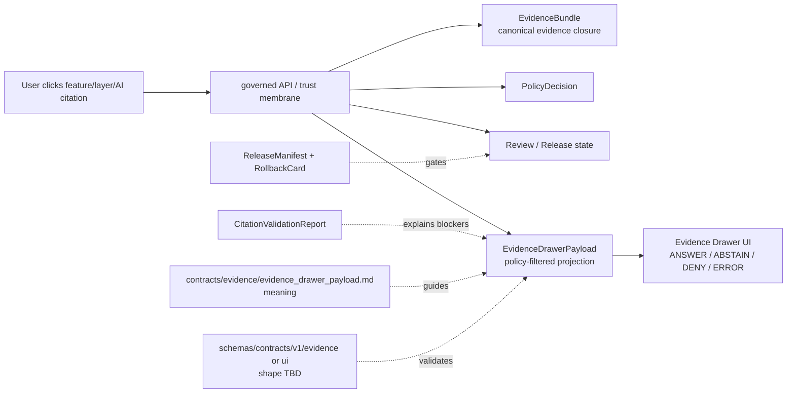

<!-- [KFM_META_BLOCK_V2]
doc_id: kfm://doc/contracts-evidence-evidence-drawer-payload
title: Evidence Drawer Payload Contract — Evidence / UI Projection
type: semantic-contract; projection-payload-profile
version: v0.2
status: draft; PROPOSED; schema-stub-confirmed; PATH-NEEDS-REVIEW; evidence-facing-ui-projection; not-evidence-closure; NEEDS VERIFICATION before promotion
owners:
  - OWNER_TBD — Evidence steward
  - OWNER_TBD — UI / AI surface steward
  - OWNER_TBD — Contracts steward
  - OWNER_TBD — Schema steward
  - OWNER_TBD — Policy steward
  - OWNER_TBD — Release steward
  - OWNER_TBD — Docs steward
created: NEEDS VERIFICATION — scaffold existed before v0.2 expansion
updated: 2026-06-24
policy_label: public; contracts; evidence; evidence-drawer-payload; ui-projection; EvidenceBundle-projection; trust-visible-state; finite-outcome; citations; source-summary; policy-state; sensitivity; review-state; release-state; limitations; accessibility; schema-stub; path-needs-review; release-gated; rollback-aware; not-evidence-bundle; not-policy-engine; not-release-manifest; not-proof-storage; not-runtime-proof; not-ai-answer
tags: [kfm, contracts, evidence, ui, evidence-drawer, EvidenceDrawerPayload, EvidenceBundle, EvidenceRef, CitationValidationReport, PolicyDecision, ReviewRecord, ReleaseManifest, RollbackCard, RuntimeResponseEnvelope, AIReceipt, MapContextEnvelope, governed-api, trust-membrane, EvidenceDrawer]
related:
  - ./README.md
  - ./evidence_bundle.md
  - ./evidence_bundle/README.md
  - ./evidence_ref.md
  - ./citation_validation_report.md
  - ../ui/evidence_drawer_payload.md
  - ../../schemas/contracts/v1/evidence/evidence_drawer_payload.schema.json
  - ../../schemas/contracts/v1/ui/evidence_drawer_payload.schema.json
  - ../../docs/architecture/evidence-drawer.md
  - ../../policy/evidence/
  - ../../policy/runtime/
  - ../../data/proofs/README.md
  - ../../data/receipts/
  - ../../data/catalog/
  - ../../release/
  - ../../docs/doctrine/directory-rules.md
notes:
  - "Expanded from a PROPOSED scaffold at contracts/evidence/evidence_drawer_payload.md."
  - "A paired evidence-family schema exists at schemas/contracts/v1/evidence/evidence_drawer_payload.schema.json, but it is a permissive scaffold with no declared properties and additionalProperties true. Field realization remains PROPOSED."
  - "Architecture doctrine describes Evidence Drawer as a UI projection of EvidenceBundle and proposes a UI-family contract/schema home; this requested evidence-family path therefore remains PATH-NEEDS-REVIEW until stewards resolve flat/family placement."
  - "EvidenceDrawerPayload is a governed projection envelope. It is not EvidenceBundle closure, not a policy engine, not a release manifest, not proof storage, and not AI answer authority."
  - "The drawer renders policy-filtered state from governed API surfaces. It must not read RAW, WORK, QUARANTINE, or internal proof stores directly."
[/KFM_META_BLOCK_V2] -->

<a id="top"></a>

# Evidence Drawer Payload Contract — Evidence / UI Projection

> Semantic contract for `EvidenceDrawerPayload`: the governed projection envelope that carries cited, policy-filtered EvidenceBundle context to the Evidence Drawer UI for a clicked feature, layer, popover, export, or AI answer reference.

<p>
  
  
  
  
  
  
</p>

`contracts/evidence/evidence_drawer_payload.md`

## Quick jumps

[Status](#status) · [Placement note](#placement-note) · [Meaning](#meaning) · [Authority boundary](#authority-boundary) · [Schema posture](#schema-posture) · [Accepted uses](#accepted-uses) · [Exclusions](#exclusions) · [Recommended fields](#recommended-fields) · [Payload model](#payload-model) · [Outcome and trust states](#outcome-and-trust-states) · [Projection rules](#projection-rules) · [Lifecycle](#lifecycle) · [Validation expectations](#validation-expectations) · [Rollback](#rollback) · [Evidence basis](#evidence-basis) · [Open questions](#open-questions)

---

## Status

> [!IMPORTANT]
> **Status:** `draft` / semantic contract / projection payload profile  
> **Owner:** `OWNER_TBD`  
> **Requested contract path:** `contracts/evidence/evidence_drawer_payload.md` — confirmed scaffold before this expansion  
> **Related UI contract path:** `contracts/ui/evidence_drawer_payload.md` — confirmed scaffold and architecture-proposed semantic home  
> **Evidence-family schema path checked:** `schemas/contracts/v1/evidence/evidence_drawer_payload.schema.json` — confirmed permissive scaffold  
> **Truth posture:** target scaffold, paired evidence-family schema scaffold, evidence-family README, EvidenceBundle contract, CitationValidationReport contract, UI-family scaffold, and Evidence Drawer architecture doctrine are confirmed from current repo evidence. Field-level shape, UI contract home, UI schema home, validator behavior, fixture coverage, governed API route behavior, UI rendering, accessibility implementation, policy filtering, release behavior, and runtime/AI behavior remain **NEEDS VERIFICATION**.

> [!CAUTION]
> `EvidenceDrawerPayload` is a **projection**. It is not EvidenceBundle, not EvidenceRef, not CitationValidationReport, not PolicyDecision, not ReleaseManifest, not proof storage, not source truth, not policy engine, and not AI answer authority.

---

## Placement note

Current repo evidence shows two related homes:

| Path | Status | Meaning |
|---|---|---|
| `contracts/evidence/evidence_drawer_payload.md` | Confirmed existing scaffold; this file | Evidence-family projection semantics requested here. |
| `contracts/ui/evidence_drawer_payload.md` | Confirmed existing scaffold | UI-family scaffold; architecture doctrine proposes UI contract placement. |
| `schemas/contracts/v1/evidence/evidence_drawer_payload.schema.json` | Confirmed permissive scaffold | Evidence-family shape stub with no fields. |
| `schemas/contracts/v1/ui/evidence_drawer_payload.schema.json` | Referenced by architecture doctrine; not verified in this task | Proposed UI-family schema home. |

> [!WARNING]
> This file should not be promoted as the sole canonical drawer-payload contract until the Evidence steward, UI steward, Schema steward, and Docs steward resolve whether the canonical semantic home is evidence-family, UI-family, or a documented split. Until then, keep this file `PATH-NEEDS-REVIEW`.

---

## Meaning

`EvidenceDrawerPayload` is the governed payload shape that makes evidence visible at the public trust surface.

It may carry or support:

- finite outcome state: `ANSWER`, `ABSTAIN`, `DENY`, or `ERROR`;
- feature/layer/claim/AI-answer context;
- EvidenceBundle refs and claim scope;
- citation list and source summary;
- policy state and sensitivity/redaction posture;
- review and release state;
- limitation and caveat text;
- stale, missing, failed-verification, denied, redacted, and no-data states;
- accessibility labels and trust-visible badges;
- rollback/correction references where material.

The payload answers:

- What is the user inspecting?
- Which bundle-supported evidence backs the visible claim?
- Which citations and source records may be shown?
- Which policy, sensitivity, review, and release state is safe to show?
- Is the result answerable, abstained, denied, or errored?
- What limitations and rollback/correction lineage must remain visible?

The payload is presentational and governed. It renders what the governed API has resolved. It does not compute new evidence, infer new policy, upgrade ABSTAIN into ANSWER, or generate claims.

---

## Authority boundary

| Responsibility | Home | Rule |
|---|---|---|
| Evidence-facing payload meaning | `contracts/evidence/evidence_drawer_payload.md` | This requested file; path needs steward review. |
| UI-facing payload meaning | `contracts/ui/evidence_drawer_payload.md` | Existing scaffold; architecture-proposed UI family home. |
| Evidence closure | `contracts/evidence/evidence_bundle.md` | EvidenceBundle is canonical evidence closure. |
| Evidence pointer | `contracts/evidence/evidence_ref.md` | EvidenceRef is a pointer, not closure. |
| Citation checking | `contracts/evidence/citation_validation_report.md` | CitationValidationReport checks support; it is not payload truth. |
| Machine shape | `schemas/contracts/v1/evidence/` or `schemas/contracts/v1/ui/` | Needs steward decision. Current evidence-family schema is a stub. |
| Governed API | governed API/runtime roots | Must resolve bundle, policy, release, and finite outcome before UI display. |
| UI rendering | app/UI roots | Drawer component code, accessibility, and state machine. |
| Policy filtering | `policy/evidence/`, `policy/runtime/` | Drawer renders policy-filtered state; it does not recompute policy. |
| Materialized proof records | `data/proofs/` | Proof storage, not contracts. |
| Receipts | `data/receipts/` | Validation/redaction/transform/review receipts. |
| Release/correction/rollback | `release/` | ReleaseManifest, correction path, RollbackCard, release decisions. |

---

## Schema posture

The evidence-family paired schema exists at:

```text
schemas/contracts/v1/evidence/evidence_drawer_payload.schema.json
```

The confirmed schema is a **permissive scaffold**. It declares:

- JSON Schema draft `2020-12`;
- `$id: kfm://schemas/contracts/v1/evidence/evidence_drawer_payload.schema.json`;
- `title: "Evidence Drawer Payload"`;
- `type: object`;
- `properties: {}`;
- `additionalProperties: true`;
- source-doc pointer to `docs/domains/hazards/API_CONTRACTS.md`;
- `x-kfm.contract_doc: null`.

> [!WARNING]
> Because the evidence-family schema has no declared fields and there is a confirmed UI-family scaffold, every field below is **PROPOSED** semantic guidance until a schema/home decision is made and validated.

---

## Accepted uses

| Use | Allowed? | Rule |
|---|---:|---|
| Rendering EvidenceBundle-supported evidence context | Yes | Must use governed, policy-filtered projection. |
| Showing finite outcome state | Yes | Use ANSWER / ABSTAIN / DENY / ERROR or steward-approved enum. |
| Showing citations and source summaries | Conditional | Only citations/source fields permitted by policy and release. |
| Showing sensitivity/redaction state | Conditional | Redacted/denied state may be shown; restricted fields must not leak. |
| Showing stale, no-data, failed-verification, or unresolved states | Yes | Trust-visible states must be perceptible and not hidden. |
| Supporting clicked feature, layer, popover, export, or AI answer references | Conditional | Must resolve through governed API/trust membrane. |
| Reading RAW/WORK/QUARANTINE/internal proof stores directly | No | Public UI must use governed API and released/projection surfaces. |
| Recomputing policy or evidence in UI | No | Policy and evidence resolution live upstream. |
| Generating new claim text | No | AI and runtime envelopes are separate and evidence-subordinate. |

---

## Exclusions

`EvidenceDrawerPayload` must not be used as:

| Misuse | Required outcome |
|---|---|
| EvidenceBundle closure | Use EvidenceBundle. |
| EvidenceRef pointer | Use EvidenceRef. |
| Citation validation report | Use CitationValidationReport. |
| Policy engine | Use policy roots and PolicyDecision. |
| Release approval | Use ReleaseManifest and release roots. |
| Materialized proof store | Use `data/proofs/`. |
| Raw source data exposure | Use governed API, policy filtering, and released projections. |
| AI answer envelope | Use RuntimeResponseEnvelope and AIReceipt surfaces. |
| Map popup replacement for full trust surface | Popup may tease; drawer proves or abstains. |

---

## Recommended fields

The following fields are **PROPOSED** until the canonical schema/home is resolved and validated.

| Field | Meaning |
|---|---|
| `payload_id` | Stable payload identifier. |
| `payload_version` | Payload contract/object version. |
| `surface_context` | Feature, layer, popover, export, API answer, AI answer, or other surface. |
| `request_context_ref` | MapContextEnvelope, runtime request, feature id, layer id, or answer id. |
| `outcome` | ANSWER, ABSTAIN, DENY, ERROR, or approved finite outcome. |
| `claim_scope` | Claim scope being displayed. |
| `evidence_bundle_ref` | EvidenceBundle ref supporting the displayed claim. |
| `evidence_refs` | Displayable EvidenceRefs, if permitted. |
| `citations` | Displayable citations permitted by policy/release. |
| `source_summary` | Policy-safe source summary. |
| `rights_summary` | Public-safe rights/license posture. |
| `sensitivity_summary` | Redaction/denial/sensitivity posture. |
| `policy_decision_ref` | PolicyDecision ref controlling display. |
| `review_ref` | ReviewRecord or stewardship review ref. |
| `release_manifest_ref` | ReleaseManifest ref controlling publication. |
| `citation_validation_report_ref` | CitationValidationReport ref, if validation was performed. |
| `limitations` | Caveats, stale state, no-data, failed-verification, denied, or redacted explanation. |
| `trust_badges` | Trust-visible labels/badges. |
| `accessibility_labels` | ARIA/keyboard-readable labels and state descriptions. |
| `rollback_ref` | RollbackCard or correction target. |
| `rendering_constraints` | UI-specific restrictions such as hidden fields or generalized geometry/text. |
| `spec_hash` | Deterministic contract/schema baseline hash. |

---

## Payload model

A reviewed EvidenceDrawerPayload should bind surface context, finite outcome, claim scope, evidence bundle support, citations, policy/sensitivity/review/release state, limitations, accessibility labels, and rollback.

```text
evidence_drawer_payload = {
  payload_id,
  surface_context,
  request_context_ref,
  outcome,
  claim_scope,
  evidence_bundle_ref,
  evidence_refs,
  citations,
  source_summary,
  rights_summary,
  sensitivity_summary,
  policy_decision_ref,
  review_ref,
  release_manifest_ref,
  citation_validation_report_ref,
  limitations,
  trust_badges,
  accessibility_labels,
  rollback_ref,
  rendering_constraints,
  spec_hash
}
```

Exact serialized shape is **NEEDS VERIFICATION** until the path/schema decision and validators are complete.

---

## Outcome and trust states

| State | Meaning | Drawer behavior |
|---|---|---|
| `ANSWER` | EvidenceBundle, policy, review, and release state allow display. | Show evidence, citations, source summary, caveats, and release state. |
| `ABSTAIN` | Evidence is missing, incomplete, stale, unresolved, or insufficient for claim. | Explain why no claim is shown and expose safe evidence/caveat context if allowed. |
| `DENY` | Policy, rights, sensitivity, sovereignty, privacy, or release state forbids display. | Show denial/redaction state without leaking restricted fields. |
| `ERROR` | Resolver/system failure prevents safe evaluation. | Show safe error state; do not degrade into unsupported answer. |
| `HOLD` / `REVIEW` | Internal or review-facing state, if used. | Do not expose as public truth unless UI policy explicitly permits. |

---

## Projection rules

1. Drawer payloads are projections of resolved evidence, not truth roots.
2. EvidenceBundle wins over generated language and UI text.
3. PolicyDecision governs what can be shown.
4. ReleaseManifest governs public publication posture.
5. CitationValidationReport can explain blockers; it cannot close evidence by itself.
6. Restricted fields must never reach the drawer.
7. ABSTAIN, DENY, and ERROR states must remain visible and must not become ANSWER in the UI.
8. The drawer must not read raw, work, quarantine, catalog/internal stores, or direct model outputs.
9. Accessibility labels must communicate trust state and blockers, not just visual styling.
10. Rollback/correction must invalidate stale payloads and dependent AI/map/export surfaces.

---

## Lifecycle



---

## Validation expectations

Before this contract is treated as mature, maintainers should verify:

- [ ] canonical contract home is resolved: evidence family, UI family, or documented split;
- [ ] schema is expanded beyond the evidence-family permissive scaffold;
- [ ] schema points back to the chosen contract doc in `x-kfm.contract_doc`;
- [ ] fixtures cover ANSWER, ABSTAIN, DENY, ERROR, missing bundle, denied sensitivity, redacted source summary, missing citation, failed citation validation, stale evidence, rollback/corrected payload, and accessibility labels;
- [ ] governed API route resolves EvidenceBundle and PolicyDecision before payload creation;
- [ ] public UI cannot request RAW/WORK/QUARANTINE/internal proof stores directly;
- [ ] drawer component never recomputes policy or evidence closure;
- [ ] AI answer surfaces cite the drawer/bundle support rather than using the drawer as answer truth;
- [ ] rollback invalidates stale drawer payloads, cached feature details, exports, graph projections, and AI summaries.

---

## Rollback

Rollback is required if this contract:

- claims canonical home while UI/evidence placement remains unresolved;
- claims schema, validator, fixture, CI, governed API, UI, policy, release, or runtime maturity without proof;
- treats EvidenceDrawerPayload as EvidenceBundle closure, EvidenceRef, CitationValidationReport, PolicyDecision, ReleaseManifest, proof storage, source truth, or AI answer authority;
- allows drawer payloads to read RAW/WORK/QUARANTINE/internal proof stores directly;
- allows ABSTAIN/DENY/ERROR to become ANSWER in UI;
- hides citation, rights, sensitivity, review, release, limitation, or rollback state;
- weakens accessibility/trust-visible requirements.

Rollback target: revert `contracts/evidence/evidence_drawer_payload.md` to prior scaffold blob `aa719bee7804f3d82b4405ba94bfe89a611a87f8`, then record why the richer contract was reverted.

---

## Evidence basis

| Evidence | Status | Supports | Limits |
|---|---|---|---|
| Prior `contracts/evidence/evidence_drawer_payload.md` | CONFIRMED | Target existed as scaffold sourced from Hazards API docs. | Scaffold did not define full semantic contract. |
| `schemas/contracts/v1/evidence/evidence_drawer_payload.schema.json` | CONFIRMED schema scaffold | Confirms evidence-family schema path and permissive stub posture. | No fields are declared; `contract_doc` is null. |
| `contracts/ui/evidence_drawer_payload.md` | CONFIRMED UI-family scaffold | Confirms a second proposed contract home exists. | It is also scaffold-level. |
| `docs/architecture/evidence-drawer.md` | CONFIRMED doctrine / PROPOSED implementation | Defines drawer as UI projection of EvidenceBundle, not truth source, AI answer surface, or policy engine; proposes UI placement and finite outcomes. | Route names, component paths, schema paths, and implementation are PROPOSED/NEEDS VERIFICATION. |
| `contracts/evidence/README.md` | CONFIRMED evidence-family guide | Lists EvidenceDrawerPayload and defines EvidenceRef/EvidenceBundle boundaries and proof-storage separation. | Root guide, not fielded payload schema. |
| `contracts/evidence/evidence_bundle.md` | CONFIRMED sibling contract | Defines EvidenceBundle as claim-scope evidence closure and not policy/release/UI/AI authority. | Resolver/runtime behavior remains NEEDS VERIFICATION. |
| `contracts/evidence/citation_validation_report.md` | CONFIRMED sibling contract | Defines citation report as checking/gating support, not bundle closure or release. | Schema remains scaffold. |
| Uploaded KFM authoring prompt v2 | CONFIRMED user-supplied guidance | Requires evidence-first, implementation-honest Markdown with visible verification and rollback posture. | Authoring guidance, not implementation proof. |

---

## Open questions

| ID | Question | Status |
|---|---|---|
| OQ-EDP-01 | Should EvidenceDrawerPayload canonical meaning live under `contracts/evidence/`, `contracts/ui/`, or a split evidence/UI model? | OPEN / CONTRACTS + UI REVIEW |
| OQ-EDP-02 | Should the canonical schema live under `schemas/contracts/v1/evidence/` or `schemas/contracts/v1/ui/`? | OPEN / SCHEMA REVIEW |
| OQ-EDP-03 | Which finite outcomes are allowed in public drawer payloads beyond ANSWER/ABSTAIN/DENY/ERROR, if any? | OPEN / POLICY + API REVIEW |
| OQ-EDP-04 | Which fields must be stripped before the payload reaches the public UI for restricted evidence? | OPEN / POLICY REVIEW |
| OQ-EDP-05 | Which accessibility labels and trust-visible states are mandatory for drawer payload validation? | OPEN / UI REVIEW |
| OQ-EDP-06 | How should rollback invalidate cached drawer payloads and linked AI/map/export surfaces? | OPEN / RELEASE REVIEW |

<p align="right"><a href="#top">Back to top</a></p>
