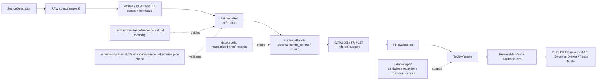

<!-- [KFM_META_BLOCK_V2]
doc_id: kfm://doc/contracts-evidence-evidence-ref
title: EvidenceRef Contract — Evidence
 type: semantic-contract; evidence-pointer-profile
version: v0.2
status: draft; PROPOSED; schema-confirmed; evidence-family; governed-pointer; pre-closure-unless-bundle-bound; NEEDS VERIFICATION before promotion
owners:
  - OWNER_TBD — Evidence steward
  - OWNER_TBD — Contracts steward
  - OWNER_TBD — Schema steward
  - OWNER_TBD — Policy steward
  - OWNER_TBD — Catalog / proof steward
  - OWNER_TBD — Release steward
  - OWNER_TBD — Docs steward
created: NEEDS VERIFICATION — v0.1 flat contract existed before v0.2 expansion
updated: 2026-06-24
policy_label: public; contracts; evidence; evidence-ref; governed-pointer; evidence-kind; bundle-ref; pre-closure; resolver-needed; release-gated; rollback-aware; not-evidence-bundle; not-proof-closure; not-policy-decision; not-release-manifest; not-proof-storage; not-source-registry; not-runtime-proof; not-ai-answer
tags: [kfm, contracts, evidence, EvidenceRef, evidence_ref, EvidenceBundle, ref, kind, bundle_ref, measurement, record, dataset, artifact, SourceDescriptor, CitationValidationReport, EvidenceDrawerPayload, PolicyDecision, ReviewRecord, ReleaseManifest, RollbackCard, AIReceipt, data-proofs, data-receipts, data-catalog, trust-membrane]
related:
  - ./README.md
  - ./evidence_bundle.md
  - ./evidence_bundle/README.md
  - ./citation_validation_report.md
  - ./evidence_drawer_payload.md
  - ../../schemas/contracts/v1/evidence/evidence_ref.schema.json
  - ../../schemas/contracts/v1/evidence/evidence_bundle.schema.json
  - ../../fixtures/contracts/v1/evidence/evidence_ref/
  - ../../tools/validators/validate_evidence_ref.py
  - ../../policy/evidence/
  - ../../data/proofs/README.md
  - ../../data/receipts/
  - ../../data/catalog/
  - ../../data/published/
  - ../../release/
  - ../../docs/doctrine/directory-rules.md
notes:
  - "Expanded from the prior flat evidence_ref contract while preserving its core meaning and schema-aligned field list."
  - "The paired schema at schemas/contracts/v1/evidence/evidence_ref.schema.json is confirmed and declares ref, kind, optional bundle_ref, required ref/kind, enum kind values, and additionalProperties false."
  - "The schema metadata points to validator tools/validators/validate_evidence_ref.py and policy/evidence/; the prior flat contract stated validator wiring is PROPOSED and not yet wired. Current runtime/CI behavior still needs verification before broad implementation claims."
  - "EvidenceRef is a governed pointer. It is not EvidenceBundle closure, not policy permission, not release approval, not proof storage, and not AI answer authority."
[/KFM_META_BLOCK_V2] -->

<a id="top"></a>

# EvidenceRef Contract — Evidence

> Semantic contract for `EvidenceRef`: the smallest governed pointer to supporting material used in claim assembly, evidence resolution, catalog/triplet linkage, Evidence Drawer projection, release review, and AI citation surfaces.

<p>
  
  
  
  
  
  
</p>

`contracts/evidence/evidence_ref.md`

## Quick jumps

[Status](#status) · [Meaning](#meaning) · [Authority boundary](#authority-boundary) · [Schema posture](#schema-posture) · [Fields](#fields) · [Accepted uses](#accepted-uses) · [Exclusions](#exclusions) · [Pointer model](#pointer-model) · [Evidence kinds](#evidence-kinds) · [Resolver and closure rules](#resolver-and-closure-rules) · [Lifecycle](#lifecycle) · [Validation expectations](#validation-expectations) · [Public and AI posture](#public-and-ai-posture) · [Rollback](#rollback) · [Evidence basis](#evidence-basis) · [Open questions](#open-questions)

---

## Status

> [!IMPORTANT]
> **Status:** `draft` / semantic contract / evidence-pointer profile  
> **Owner:** `OWNER_TBD`  
> **Contract path:** `contracts/evidence/evidence_ref.md`  
> **Schema path checked:** `schemas/contracts/v1/evidence/evidence_ref.schema.json` — **confirmed fielded schema**  
> **Truth posture:** target path, prior flat contract, paired schema, evidence-family README, and EvidenceBundle contract are confirmed from current repo evidence. Validator path metadata is confirmed in the schema, but the prior contract marks validator wiring as PROPOSED/not yet wired; actual validator behavior, current CI status, fixture coverage, resolver behavior, policy enforcement, release behavior, public API behavior, Evidence Drawer behavior, and runtime/AI behavior remain **NEEDS VERIFICATION** unless separately tested.

> [!CAUTION]
> `EvidenceRef` is a pointer. It is **not** an EvidenceBundle, not evidence closure, not citation completeness, not policy clearance, not release approval, not proof storage, not source registry authority, not public API response by itself, and not AI answer authority.

---

## Meaning

`EvidenceRef` is the smallest governed reference to supporting material used by KFM.

It answers:

- What evidence item is being referenced?
- What kind of evidence is it?
- Has the reference been bound to a closed EvidenceBundle, or is it still pre-closure?

EvidenceRef supports traceability. It can point to measurements, records, datasets, or artifacts, but it does not by itself prove a claim. Claim-grade public answers require the pointer to resolve through governed evidence handling and, where material, into an EvidenceBundle with policy/review/release support.

---

## Authority boundary

| Responsibility | Home | Rule |
|---|---|---|
| EvidenceRef meaning | `contracts/evidence/evidence_ref.md` | This semantic contract. |
| EvidenceBundle meaning | `contracts/evidence/evidence_bundle.md` | Claim-scope closure; not a pointer. |
| Citation checking | `contracts/evidence/citation_validation_report.md` | Checks support; does not make refs closed. |
| Evidence Drawer projection | `contracts/evidence/evidence_drawer_payload.md` and/or `contracts/ui/evidence_drawer_payload.md` | Public trust projection; does not create evidence. |
| Machine shape | `schemas/contracts/v1/evidence/evidence_ref.schema.json` | Confirmed JSON Schema for required fields and enum. |
| Fixtures | `fixtures/contracts/v1/evidence/evidence_ref/` | Valid/invalid/golden examples. |
| Validator implementation | `tools/validators/validate_evidence_ref.py` | Executable validation, not semantic authority. Wiring still needs verification. |
| Policy/admissibility | `policy/evidence/` | Rights, sensitivity, allow/deny/restrict/abstain, release gating. |
| Materialized proof records | `data/proofs/` | EvidenceBundles/proof packs when stored as governed lifecycle data. |
| Receipts | `data/receipts/` | Validation, redaction, transform, and review receipts. |
| Catalog records | `data/catalog/` | Catalog/provenance indexes and bundle-linked records. |
| Release/correction/rollback | `release/` | ReleaseManifest, correction path, RollbackCard, and release decisions. |

---

## Schema posture

The paired schema is confirmed at:

```text
schemas/contracts/v1/evidence/evidence_ref.schema.json
```

Confirmed schema posture:

- `$schema`: JSON Schema draft 2020-12;
- `$id`: `https://schemas.kfm.local/contracts/v1/evidence/evidence_ref.schema.json`;
- `title`: `evidence_ref`;
- `type`: `object`;
- `x-kfm.contract_doc`: `contracts/evidence/evidence_ref.md`;
- `x-kfm.fixtures_root`: `fixtures/contracts/v1/evidence/evidence_ref/`;
- `x-kfm.validator`: `tools/validators/validate_evidence_ref.py`;
- `x-kfm.policy`: `policy/evidence/`;
- `x-kfm.status`: `PROPOSED`;
- root `additionalProperties: false`.

> [!WARNING]
> Schema confirmation does not prove current validator execution, fixture coverage, CI enforcement, resolver behavior, policy enforcement, source-rights evaluation, release state, public API behavior, Evidence Drawer behavior, or runtime/AI behavior. Those remain **NEEDS VERIFICATION** until checked.

---

## Fields

The schema confirms the following fields and required status.

| Field | Required | Meaning | Contract notes |
|---|---:|---|---|
| `ref` | Yes | Canonical pointer/id for the evidence item. | Must resolve through governed resolver paths before publish-grade use. |
| `kind` | Yes | Declares evidence category for downstream policy and rendering behavior. | Enum: `measurement`, `record`, `dataset`, `artifact`. |
| `bundle_ref` | No | Identifier of the EvidenceBundle that closed this reference. | When absent, treat as pre-closure pointer and avoid claim-final ANSWER release unless a lower-support policy explicitly applies. |

---

## Accepted uses

| Use | Allowed? | Rule |
|---|---:|---|
| Pointing to a measurement, record, dataset, or artifact | Yes | Must use a valid `kind` and governed `ref`. |
| Carrying traceability inside WORK/PROCESSED/CATALOG/PUBLISHED-facing envelopes | Yes | Must preserve lifecycle state and closure posture. |
| Participating in EvidenceBundle assembly | Yes | Bundle closure binds refs into claim-scope support. |
| Supporting Evidence Drawer display | Conditional | Drawer should display only policy-filtered, release-allowed ref context. |
| Supporting Focus Mode / AI citation | Conditional | AI may cite only governed/released support and must not treat unresolved refs as proof. |
| Treating a ref as claim closure by itself | No | Use EvidenceBundle. |
| Treating `bundle_ref` as verified without resolver checks | No | Resolver integrity remains required. |
| Publishing unsupported claim text from an unclosed ref | No | Return ABSTAIN, DENY, or ERROR as appropriate. |

---

## Exclusions

`EvidenceRef` must not be used as:

| Misuse | Required outcome |
|---|---|
| EvidenceBundle closure | Use `EvidenceBundle`. |
| Policy decision | Use `PolicyDecision` / `policy/evidence/`. |
| Release manifest | Use `release/`. |
| SourceDescriptor or source registry record | Use source registry roots. |
| Validation receipt | Use `data/receipts/`. |
| Materialized proof storage | Use `data/proofs/`. |
| Catalog record by itself | Use `data/catalog/`. |
| Public API response by itself | Use governed API response schemas and release gates. |
| AI answer authority | AI remains downstream and cite-or-abstain. |

---

## Pointer model

A reviewed EvidenceRef object has the following confirmed shape:

```text
evidence_ref = {
  ref,
  kind,
  bundle_ref?
}
```

`bundle_ref` is optional because refs may exist before bundle closure. Once a claim or public surface depends on the ref, the resolver must make its closure state explicit.

---

## Evidence kinds

| Kind | Meaning | Guardrail |
|---|---|---|
| `measurement` | A measurement or observation-like evidence item. | Does not imply quality, rights, sensitivity, or release by itself. |
| `record` | A source record, table row, document record, registry entry, or similar. | Must remain source-role and rights aware. |
| `dataset` | Dataset-level evidence item. | Must not stand in for item-level support if claim requires finer support. |
| `artifact` | File, image, tile, manifest, generated artifact, derived output, or other artifact. | Generated/derived artifacts remain downstream of EvidenceBundle and receipts. |

---

## Resolver and closure rules

1. `ref` must resolve through governed resolver paths before publish-grade use.
2. `kind` controls policy/rendering behavior and must not be omitted.
3. `bundle_ref` means the ref claims membership in a closure package; it must resolve to an EvidenceBundle before claim-grade use.
4. Absence of `bundle_ref` means pre-closure by default.
5. EvidenceRef alone does not guarantee citation completeness.
6. EvidenceRef alone does not guarantee rights clearance.
7. EvidenceRef alone does not guarantee sensitivity clearance.
8. EvidenceRef alone does not authorize release.
9. Public/AI `ANSWER` must not depend on unresolved or unclosed refs where claim-grade evidence is material.
10. Superseded or corrected refs require dependent bundles, drawer payloads, releases, exports, and AI summaries to be invalidated or repointed.

---

## Lifecycle



---

## Validation expectations

Before this contract is treated as implementation-mature, maintainers should verify:

- [ ] schema and this contract agree on all fields and enum values;
- [ ] `tools/validators/validate_evidence_ref.py` exists and is wired in current CI/tooling before claiming validator enforcement;
- [ ] fixtures cover valid measurement, valid record, valid dataset, valid artifact, missing `ref`, missing `kind`, invalid `kind`, extra property, unresolved `ref`, invalid `bundle_ref`, superseded `bundle_ref`, and release-ready closed ref;
- [ ] resolver behavior is defined when `ref` cannot resolve;
- [ ] resolver behavior is defined when `bundle_ref` cannot resolve to an EvidenceBundle;
- [ ] policy checks rights and sensitivity before public display;
- [ ] release artifacts reference bundle-closed refs and rollback targets where material;
- [ ] Evidence Drawer and Focus Mode refuse unsupported/generated claims when evidence refs are unresolved or unclosed.

---

## Public and AI posture

| Surface | EvidenceRef rule |
|---|---|
| Governed API `ANSWER` | Should require closed bundle support where claim-grade evidence is material. |
| Governed API `ABSTAIN` | Use when ref is missing, unresolved, pre-closure, or insufficient. |
| Governed API `DENY` | Use when rights/sensitivity/policy blocks disclosure. |
| Governed API `ERROR` | Use when resolver/system failure prevents safe evaluation. |
| Evidence Drawer | May show safe ref metadata only after policy filtering. |
| Focus Mode / AI | Generated text is downstream. It must cite bundle-supported evidence or abstain. |
| Map/layer surfaces | Must not treat ref as layer truth without release and bundle support. |
| Exports | Preserve `ref`, `kind`, bundle closure state, rights/sensitivity/release posture, and rollback refs where material. |

---

## Rollback

Rollback is required if this contract:

- conflicts with the confirmed schema while claiming schema alignment;
- treats EvidenceRef as EvidenceBundle closure, policy permission, release approval, source registry authority, proof storage, catalog record, public API response, or AI answer authority;
- removes `ref`, `kind`, or the optional/pre-closure nature of `bundle_ref` from the semantic requirements;
- claims validator, fixture, CI, resolver, policy, release, or runtime maturity without current evidence;
- weakens cite-or-abstain behavior or lets generated text outrank EvidenceBundle;
- weakens the RAW → WORK/QUARANTINE → PROCESSED → CATALOG/TRIPLET → PUBLISHED trust path.

Rollback target: revert `contracts/evidence/evidence_ref.md` to prior blob `7f2b1ce1fc6a901942b4184835c98e91b29638a8`, then record why the richer contract was reverted.

---

## Evidence basis

| Evidence | Status | Supports | Limits |
|---|---|---|---|
| Prior `contracts/evidence/evidence_ref.md` | CONFIRMED | Existing contract already defined EvidenceRef as governed pointer and listed schema-aligned fields. | Needed stronger KFM Meta Block v2, boundary, lifecycle, validation, and rollback posture. |
| `schemas/contracts/v1/evidence/evidence_ref.schema.json` | CONFIRMED fielded schema | Confirms `ref`, `kind`, optional `bundle_ref`, required `ref`/`kind`, enum values, validator/policy metadata, and `additionalProperties: false`. | Does not prove validator execution, CI, resolver, policy, or runtime behavior. |
| `contracts/evidence/README.md` | CONFIRMED evidence-family guide | Confirms EvidenceRef/EvidenceBundle separation and public/AI cite-or-abstain posture. | Root guide, not fielded payload schema. |
| `contracts/evidence/evidence_bundle.md` | CONFIRMED sibling contract | Defines EvidenceBundle as claim-scope evidence closure and says EvidenceRef is a pointer that does not guarantee closure. | Resolver/runtime behavior remains NEEDS VERIFICATION. |
| Uploaded KFM authoring prompt v2 | CONFIRMED user-supplied guidance | Requires evidence-first, implementation-honest, visually polished Markdown with visible verification and rollback posture. | Authoring guidance, not implementation proof. |

---

## Open questions

| ID | Question | Status |
|---|---|---|
| OQ-ER-01 | What is the canonical resolver contract for `ref` and `bundle_ref` failures? | OPEN / EVIDENCE + RUNTIME REVIEW |
| OQ-ER-02 | Should `kind` stay limited to measurement/record/dataset/artifact, or should domain-specific evidence kinds be modeled elsewhere? | OPEN / SCHEMA REVIEW |
| OQ-ER-03 | Which public surfaces may expose pre-closure refs, and under what ABSTAIN/HOLD framing? | OPEN / POLICY + UI REVIEW |
| OQ-ER-04 | Which fixtures and CI jobs prove EvidenceRef referential integrity across all supported domains? | OPEN / VALIDATION REVIEW |
| OQ-ER-05 | How should rollback invalidate bundles, drawer payloads, exports, cached API responses, graph projections, and AI summaries after ref correction or withdrawal? | OPEN / RELEASE REVIEW |

<p align="right"><a href="#top">Back to top</a></p>
