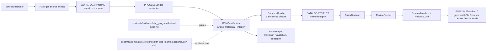

<!-- [KFM_META_BLOCK_V2]
doc_id: kfm://doc/contracts-evidence-kfm-geo-manifest
title: KFM Geo Manifest Contract — Evidence
type: semantic-contract; geospatial-artifact-manifest-profile
version: v0.2
status: draft; PROPOSED; schema-stub-confirmed; evidence-family; geospatial-manifest; artifact-metadata; release-gated; NEEDS VERIFICATION before promotion
owners:
  - OWNER_TBD — Evidence steward
  - OWNER_TBD — Geospatial / map steward
  - OWNER_TBD — Contracts steward
  - OWNER_TBD — Schema steward
  - OWNER_TBD — Policy steward
  - OWNER_TBD — Release steward
  - OWNER_TBD — Docs steward
created: NEEDS VERIFICATION — greenfield scaffold existed before v0.2 expansion
updated: 2026-06-24
policy_label: public; contracts; evidence; geo-manifest; geospatial-artifact; map-layer-manifest; tile-manifest; geometry-manifest; CRS; bbox; checksums; source-role-aware; evidence-bound; schema-stub; release-gated; rollback-aware; not-evidence-bundle; not-proof-storage; not-release-manifest; not-layer-data; not-tile-data; not-runtime-proof; not-ai-answer
tags: [kfm, contracts, evidence, kfm_geo_manifest, KFMGeoManifest, geo-manifest, geospatial-artifact, layer-manifest, tile-manifest, geometry, CRS, bbox, extent, FeatureCollection, MBTiles, PMTiles, GeoJSON, vector-tiles, raster-tiles, EvidenceRef, EvidenceBundle, SourceDescriptor, PolicyDecision, ReviewRecord, ReleaseManifest, RollbackCard, checksums, spec_hash]
related:
  - ./README.md
  - ./evidence_ref.md
  - ./evidence_bundle.md
  - ./evidence_bundle/README.md
  - ./citation_validation_report.md
  - ./evidence_drawer_payload.md
  - ../../schemas/contracts/v1/evidence/kfm_geo_manifest.schema.json
  - ../../schemas/contracts/v1/evidence/evidence_bundle.schema.json
  - ../../schemas/contracts/v1/evidence/evidence_ref.schema.json
  - ../../fixtures/evidence/kfm_geo_manifest/
  - ../../tools/validators/evidence/validate_kfm_geo_manifest.py
  - ../../policy/evidence/
  - ../../policy/runtime/
  - ../../data/proofs/README.md
  - ../../data/receipts/
  - ../../data/catalog/
  - ../../data/published/
  - ../../release/
  - ../../docs/doctrine/directory-rules.md
notes:
  - "Expanded from a greenfield scaffold at contracts/evidence/kfm_geo_manifest.md."
  - "A paired schema exists at schemas/contracts/v1/evidence/kfm_geo_manifest.schema.json, but it is a greenfield stub with required id, optional version/spec_hash, and additionalProperties true. Richer field realization remains PROPOSED."
  - "KFMGeoManifest is a geospatial artifact manifest. It is not EvidenceBundle closure, not the geospatial artifact itself, not proof storage, not release approval, and not AI answer authority."
  - "Materialized proof records belong under data/proofs/. Published geospatial artifacts belong under release/published artifact paths after review and ReleaseManifest gates."
  - "This contract defines geo-manifest meaning only; it does not implement schema validation, tiling, rendering, data publication, governed API behavior, or runtime behavior."
[/KFM_META_BLOCK_V2] -->

<a id="top"></a>

# KFM Geo Manifest Contract — Evidence

> Semantic contract for `KFMGeoManifest`: the evidence-family manifest that describes a geospatial artifact, layer, tile package, geometry export, or map-facing derived object well enough to tie it to evidence, source role, spatial reference, extent, checksums, policy, release state, correction lineage, and rollback targets.

<p>
  
  
  
  
  
  
</p>

`contracts/evidence/kfm_geo_manifest.md`

## Quick jumps

[Status](#status) · [Meaning](#meaning) · [Authority boundary](#authority-boundary) · [Schema posture](#schema-posture) · [Accepted uses](#accepted-uses) · [Exclusions](#exclusions) · [Recommended fields](#recommended-fields) · [Manifest model](#manifest-model) · [Manifest families](#manifest-families) · [Evidence and release rules](#evidence-and-release-rules) · [Lifecycle](#lifecycle) · [Validation expectations](#validation-expectations) · [Rollback](#rollback) · [Evidence basis](#evidence-basis) · [Open questions](#open-questions)

---

## Status

> [!IMPORTANT]
> **Status:** `draft` / semantic contract / geospatial-artifact-manifest profile  
> **Owner:** `OWNER_TBD`  
> **Contract path:** `contracts/evidence/kfm_geo_manifest.md`  
> **Schema path checked:** `schemas/contracts/v1/evidence/kfm_geo_manifest.schema.json` — **confirmed greenfield stub**  
> **Truth posture:** target scaffold, paired schema stub, evidence-family README, EvidenceRef contract, and EvidenceBundle contract are confirmed from current repo evidence. Field-level shape beyond `id`, optional `version`, and optional `spec_hash`; executable validator behavior; fixtures; CI wiring; policy enforcement; release behavior; public API behavior; map rendering; tile generation; artifact publication; and runtime/AI behavior remain **NEEDS VERIFICATION**.

> [!CAUTION]
> `KFMGeoManifest` is a manifest about a geospatial artifact. It is **not** the artifact itself, not raw data, not tile data, not an EvidenceBundle, not proof storage, not a PolicyDecision, not a ReleaseManifest, not a map renderer, and not AI answer authority.

---

## Meaning

`KFMGeoManifest` records the trust-relevant metadata for a geospatial artifact or map-facing derivative.

It may describe:

- a GeoJSON or FeatureCollection export;
- a vector tile package or tile endpoint artifact;
- a raster tile package or imagery derivative;
- a PMTiles/MBTiles artifact;
- a generalized geometry artifact;
- a layer-ready released projection;
- a review candidate for a geospatial release;
- a map-facing export that must remain evidence-bound.

The object answers:

- Which geospatial artifact is being described?
- Which source records, EvidenceRefs, and EvidenceBundles support it?
- Which coordinate reference system, extent, bounding box, geometry type, tiling profile, and scale/resolution apply?
- Which transforms, redactions, generalizations, joins, or derivations produced it?
- Which checksums verify the artifact or its critical inputs/outputs?
- Which rights, sensitivity, policy, review, release, correction, and rollback state governs display or export?
- What does the manifest **not** prove?

A KFMGeoManifest is an **evidence-and-publication manifest** for geospatial artifacts. It can support validation, release review, Evidence Drawer explanation, map layer projection, export traceability, and rollback. It cannot replace EvidenceBundle closure, source records, release manifests, or the artifact bytes themselves.

---

## Authority boundary

| Responsibility | Home | Rule |
|---|---|---|
| Geo-manifest meaning | `contracts/evidence/kfm_geo_manifest.md` | This semantic contract. |
| Machine shape | `schemas/contracts/v1/evidence/kfm_geo_manifest.schema.json` | Current schema is a greenfield stub; richer fields are proposed. |
| Evidence pointer | `contracts/evidence/evidence_ref.md` | EvidenceRef is a pointer, not closure. |
| Evidence closure | `contracts/evidence/evidence_bundle.md` | EvidenceBundle supports claims; manifest describes geospatial artifact metadata. |
| Citation checking | `contracts/evidence/citation_validation_report.md` | Can check citation/source support; not release. |
| Proof storage | `data/proofs/` | Materialized proof records and proof packs. |
| Receipts | `data/receipts/` | Validation, redaction, transform, generation, review, and release receipts. |
| Catalog records | `data/catalog/` | Catalog/provenance indexes and artifact discovery records. |
| Published artifacts | `data/published/` or release-governed artifact roots | Public-safe released artifacts after release gates. |
| Policy/admissibility | `policy/evidence/`, `policy/runtime/` | Rights, sensitivity, allow/deny/restrict/abstain, release gating. |
| Release/correction/rollback | `release/` | ReleaseManifest, correction path, RollbackCard, and release decisions. |
| Map/UI rendering | app/UI/map roots | Runtime rendering and interaction, not contract meaning. |
| Tiling/build implementation | pipelines/packages/tools roots | Generation code and build logic. |

---

## Schema posture

The paired schema is confirmed at:

```text
schemas/contracts/v1/evidence/kfm_geo_manifest.schema.json
```

Confirmed schema posture:

- `$schema`: JSON Schema draft 2020-12;
- `$id`: `https://schemas.kfm.local/contracts/v1/evidence/kfm_geo_manifest.schema.json`;
- `title`: `kfm_geo_manifest`;
- `type`: `object`;
- `description`: greenfield placeholder;
- `x-kfm.contract_doc`: `contracts/evidence/kfm_geo_manifest.md`;
- `x-kfm.fixtures_root`: `fixtures/evidence/kfm_geo_manifest/`;
- `x-kfm.validator`: `tools/validators/evidence/validate_kfm_geo_manifest.py`;
- `x-kfm.policy`: `policy/evidence/`;
- `x-kfm.status`: `PROPOSED`;
- properties currently declared: `id`, `version`, `spec_hash`;
- required field: `id`;
- root `additionalProperties: true`.

> [!WARNING]
> The schema is confirmed but still a stub. Everything beyond `id`, optional `version`, and optional `spec_hash` is **PROPOSED** semantic guidance until schema, fixtures, validators, policy tests, release checks, artifact builders, and runtime behavior are verified.

---

## Accepted uses

| Use | Allowed? | Rule |
|---|---:|---|
| Describing a geospatial artifact for review | Yes | Must preserve artifact identity, evidence refs, source records, transforms, CRS, extent, checksums, policy, and release posture. |
| Supporting a map/layer release candidate | Conditional | Requires EvidenceBundle, policy, review, ReleaseManifest, and rollback path before public display. |
| Supporting Evidence Drawer explanation | Conditional | Drawer may cite manifest metadata only as governed projection, not artifact truth by itself. |
| Supporting export traceability | Conditional | Export must preserve bundle/ref/release/rights/sensitivity/checksum posture. |
| Recording derived artifact checksums | Yes | Checksums support integrity; they do not replace evidence closure. |
| Recording redaction/generalization transform metadata | Yes | Must point to receipts where material. |
| Treating the manifest as geospatial artifact bytes | No | Store artifacts in governed data/published/release artifact roots. |
| Treating the manifest as release approval | No | Use ReleaseManifest and RollbackCard. |
| Treating the manifest as EvidenceBundle closure | No | Use EvidenceBundle. |

---

## Exclusions

`KFMGeoManifest` must not be used as:

| Misuse | Required outcome |
|---|---|
| Raw source data | Use `data/raw/` or source lifecycle homes. |
| GeoJSON/vector/raster/tile artifact bytes | Use governed artifact storage and published/release roots. |
| EvidenceBundle closure | Use `EvidenceBundle`. |
| EvidenceRef pointer | Use `EvidenceRef`. |
| Policy decision | Use PolicyDecision / policy roots. |
| Release manifest | Use release roots. |
| Validation/generation receipt | Use `data/receipts/`. |
| Catalog record | Use `data/catalog/`. |
| Public API response by itself | Use governed API response schemas and release gates. |
| AI answer authority | AI remains downstream and cite-or-abstain. |

---

## Recommended fields

The following fields are **PROPOSED** except for schema-confirmed `id`, `version`, and `spec_hash`.

| Field | Status | Meaning |
|---|---:|---|
| `id` | CONFIRMED required | Canonical manifest identifier. |
| `version` | CONFIRMED optional | Manifest contract/object version. |
| `spec_hash` | CONFIRMED optional | Deterministic content/spec hash in current stub; should become baseline linkage. |
| `artifact_ref` | PROPOSED | Pointer to the geospatial artifact, package, layer, tile set, or export. |
| `artifact_type` | PROPOSED | GeoJSON, FeatureCollection, PMTiles, MBTiles, vector tiles, raster tiles, imagery derivative, layer projection, etc. |
| `artifact_role` | PROPOSED | Source artifact, processed derivative, release candidate, published projection, rollback target, etc. |
| `claim_scope` | PROPOSED | Claim or map/layer scope this manifest supports. |
| `evidence_bundle_refs` | PROPOSED | EvidenceBundle refs supporting the artifact. |
| `evidence_refs` | PROPOSED | EvidenceRefs involved in artifact construction. |
| `source_record_refs` | PROPOSED | Source records used to reconstruct provenance. |
| `crs` | PROPOSED | Coordinate reference system. |
| `bbox` | PROPOSED | Bounding box / spatial extent. |
| `geometry_type` | PROPOSED | Geometry or tile geometry family. |
| `scale_or_resolution` | PROPOSED | Scale, resolution, zoom range, raster resolution, or tiling profile. |
| `tiling_profile` | PROPOSED | Tile matrix/profile/zoom/min-max metadata where applicable. |
| `transforms` | PROPOSED | Reprojection, clipping, simplification, aggregation, redaction, generalization, joining, tiling, rasterization, etc. |
| `checksum_map` | PROPOSED | Checksums for artifact and critical inputs/outputs. |
| `rights_summary` | PROPOSED | License/terms/publication constraints. |
| `sensitivity_summary` | PROPOSED | Sensitivity/redaction/generalization posture. |
| `policy_decision_ref` | PROPOSED | PolicyDecision governing display/export. |
| `review_ref` | PROPOSED | ReviewRecord or steward review. |
| `release_manifest_ref` | PROPOSED | ReleaseManifest or MapReleaseManifest ref. |
| `receipt_refs` | PROPOSED | Validation/generation/redaction/transform/review receipts. |
| `rollback_ref` | PROPOSED | RollbackCard or rollback target. |
| `limitations` | PROPOSED | Caveats and non-authority boundaries. |

---

## Manifest model

A reviewed KFMGeoManifest should bind artifact identity, geospatial support, evidence support, transforms, checksums, rights, sensitivity, policy, review, release, and rollback.

```text
kfm_geo_manifest = {
  id,
  version?,
  spec_hash?,
  artifact_ref,
  artifact_type,
  artifact_role,
  claim_scope,
  evidence_bundle_refs,
  evidence_refs,
  source_record_refs,
  crs,
  bbox,
  geometry_type,
  scale_or_resolution,
  tiling_profile,
  transforms,
  checksum_map,
  rights_summary,
  sensitivity_summary,
  policy_decision_ref,
  review_ref,
  release_manifest_ref,
  receipt_refs,
  rollback_ref,
  limitations
}
```

Exact serialized shape is **NEEDS VERIFICATION** until the schema and validators are field-complete.

---

## Manifest families

| Manifest family | Meaning | Guardrail |
|---|---|---|
| `source_geo_manifest` | Describes a source geospatial artifact admitted to KFM. | Not SourceDescriptor; source role and rights still required. |
| `processed_geo_manifest` | Describes processed derivative after normalization or transformation. | Transform receipts and checksums required. |
| `release_candidate_geo_manifest` | Describes artifact proposed for publication. | Not public until policy/review/release gates close. |
| `published_geo_manifest` | Describes released public-safe artifact. | Must reference ReleaseManifest and rollback target. |
| `redacted_or_generalized_geo_manifest` | Describes artifact with redaction/generalization. | Must preserve redaction/generalization reason and receipts. |
| `tile_package_manifest` | Describes vector/raster/PMTiles/MBTiles tile package. | Must carry tile profile, extent, checksums, and release posture. |
| `rollback_geo_manifest` | Describes artifact state used for rollback. | Must identify what is invalidated/repointed. |

---

## Evidence and release rules

1. A geo manifest is not enough for public truth by itself.
2. Public release requires EvidenceBundle closure where claims are evidence-bearing.
3. PolicyDecision governs rights, sensitivity, redaction, and display/export rules.
4. ReleaseManifest governs publication; RollbackCard governs reversibility.
5. Checksums support integrity but do not prove claim truth.
6. CRS, extent, scale, and resolution are part of meaning for any map-facing artifact.
7. Generalization, redaction, clipping, joining, and tiling transforms must remain auditable.
8. Public clients should consume governed APIs or released artifacts, not RAW/WORK/QUARANTINE or internal proof stores.
9. AI summaries may cite manifest metadata only as downstream support and must not treat it as evidence closure.
10. Corrections must invalidate dependent layers, tiles, exports, drawer payloads, caches, graph projections, and AI summaries where material.

---

## Lifecycle



---

## Validation expectations

Before this contract is treated as mature, maintainers should verify:

- [ ] schema expands beyond the current greenfield stub;
- [ ] schema includes artifact refs, artifact type/role, CRS, bbox, geometry/tile profile, evidence bundle refs, source records, transforms, checksums, rights, sensitivity, policy/review/release/rollback refs, and limitations;
- [ ] fixtures cover source GeoJSON, processed GeoJSON, vector tile package, raster tile package, redacted/generalized artifact, missing CRS, invalid bbox, missing checksum, missing evidence bundle, missing release, rights-denied artifact, sensitivity-redacted artifact, rollback artifact, and published artifact;
- [ ] validator exists and is wired in current tooling/CI before claiming enforcement;
- [ ] checksums are verified against artifact bytes and critical inputs/outputs;
- [ ] redaction/generalization transform receipts are present where material;
- [ ] policy checks rights and sensitivity before release;
- [ ] release artifacts reference manifest IDs and rollback targets;
- [ ] Evidence Drawer, governed API, map layers, exports, and AI summaries do not treat the manifest as proof closure by itself.

---

## Rollback

Rollback is required if this contract:

- claims schema, validator, fixture, CI, policy, release, artifact-builder, map renderer, governed API, or runtime maturity without proof;
- treats KFMGeoManifest as EvidenceBundle closure, SourceDescriptor, PolicyDecision, ReleaseManifest, receipt, catalog record, proof storage, geospatial artifact bytes, public API response, map layer truth, or AI answer authority;
- hides CRS, bbox, scale/resolution, transform, checksum, rights, sensitivity, release, or rollback requirements;
- allows public clients to read RAW/WORK/QUARANTINE/internal proof stores directly;
- weakens cite-or-abstain behavior or lets generated text outrank EvidenceBundle;
- weakens the RAW → WORK/QUARANTINE → PROCESSED → CATALOG/TRIPLET → PUBLISHED trust path.

Rollback target: revert `contracts/evidence/kfm_geo_manifest.md` to prior scaffold blob `f2bd9814c81f4eaafa677bd686e615411b5ac949`, then record why the richer contract was reverted.

---

## Evidence basis

| Evidence | Status | Supports | Limits |
|---|---|---|---|
| Prior `contracts/evidence/kfm_geo_manifest.md` | CONFIRMED | Existing greenfield scaffold identified family, schema path, status, and generic contract sections. | Did not define full semantic contract. |
| `schemas/contracts/v1/evidence/kfm_geo_manifest.schema.json` | CONFIRMED schema stub | Confirms schema path, contract_doc pointer, fixtures_root, validator path, policy path, `id` required, optional `version`/`spec_hash`, and `additionalProperties: true`. | Does not enforce proposed manifest fields or prove validator/runtime behavior. |
| `contracts/evidence/README.md` | CONFIRMED evidence-family guide | Lists KFM Geo Manifest as evidence contract family item needing verification and preserves evidence/proof boundary. | Root guide, not detailed manifest schema. |
| `contracts/evidence/evidence_bundle.md` | CONFIRMED sibling contract | Defines EvidenceBundle as claim-scope closure and not a map layer, release, policy, or AI authority. | Resolver/runtime behavior remains NEEDS VERIFICATION. |
| `contracts/evidence/evidence_ref.md` | CONFIRMED sibling contract | Defines EvidenceRef as governed pointer and not closure. | Resolver integrity remains NEEDS VERIFICATION. |
| Uploaded KFM authoring prompt v2 | CONFIRMED user-supplied guidance | Requires evidence-first, implementation-honest, visually polished Markdown with visible verification and rollback posture. | Authoring guidance, not implementation proof. |

---

## Open questions

| ID | Question | Status |
|---|---|---|
| OQ-GEO-MANIFEST-01 | Should KFMGeoManifest remain in `contracts/evidence/`, or should a map/release artifact manifest contract own parts of this meaning? | OPEN / CONTRACTS + RELEASE REVIEW |
| OQ-GEO-MANIFEST-02 | Which geospatial artifact types and tile profiles are canonical? | OPEN / MAP + SCHEMA REVIEW |
| OQ-GEO-MANIFEST-03 | Which CRS, bbox, scale, resolution, and tile matrix fields are mandatory for public release? | OPEN / VALIDATION REVIEW |
| OQ-GEO-MANIFEST-04 | How should redaction/generalization receipts be linked and exposed in public Evidence Drawer payloads? | OPEN / POLICY + UI REVIEW |
| OQ-GEO-MANIFEST-05 | Should checksums cover artifact bytes only, or every critical input/output plus manifest normalization? | OPEN / INTEGRITY REVIEW |
| OQ-GEO-MANIFEST-06 | How should rollback invalidate released tiles, layer descriptors, caches, exports, graph projections, and AI summaries? | OPEN / RELEASE REVIEW |

<p align="right"><a href="#top">Back to top</a></p>
