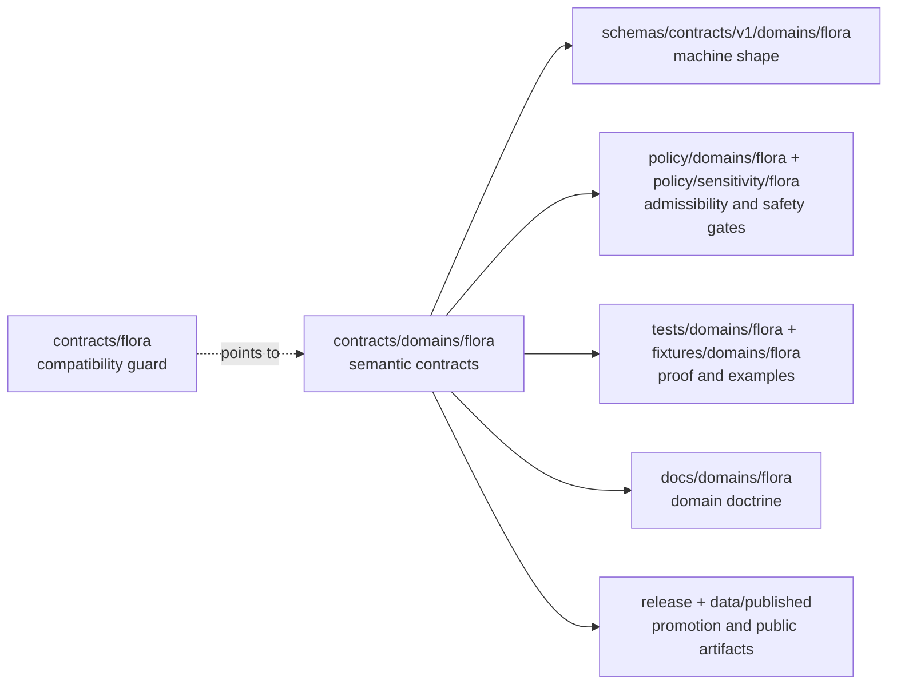

<!-- [KFM_META_BLOCK_V2]
doc_id: kfm://doc/contracts-flora-compat-readme
title: contracts/flora — Flora Contract Compatibility README
type: readme
version: v0.1
status: draft
owners: OWNER_TBD — Contract steward · Flora steward · Docs steward · Directory Rules reviewer
created: 2026-06-24
updated: 2026-06-24
policy_label: public; contracts; flora; compatibility; no-parallel-authority
related:
  - ../README.md
  - ../domains/flora/README.md
  - ../../docs/domains/flora/README.md
  - ../../schemas/contracts/v1/domains/flora/
  - ../../policy/domains/flora/
  - ../../policy/sensitivity/flora/
  - ../../tests/domains/flora/
  - ../../fixtures/domains/flora/
tags: [kfm, contracts, flora, compatibility, directory-rules, semantic-contracts, biodiversity, no-parallel-authority]
notes:
  - "Compatibility pointer for the legacy/requested `contracts/flora/` path."
  - "The canonical semantic contract lane is `contracts/domains/flora/` unless an accepted ADR changes Directory Rules."
  - "Do not place schemas, policy, fixtures, data, release records, runtime code, or UI code here."
  - "Previous file content was a placeholder; rollback target is blob SHA `e25f1814e51579d5f55c0f1fe0135ddb28a47f4a`."
[/KFM_META_BLOCK_V2] -->

# contracts/flora

> Compatibility guard for the legacy Flora contract path; use `contracts/domains/flora/` for canonical Flora semantic contracts.

**Status:** draft compatibility guard  
**Owners:** `OWNER_TBD` — Contract steward · Flora steward · Docs steward · Directory Rules reviewer  
**Path:** `contracts/flora/README.md`  
**Canonical semantic contract lane:** [`../domains/flora/`](../domains/flora/)  
**Truth posture:** CONFIRMED placeholder replaced · CONFIRMED canonical Flora domain contract lane exists · PROPOSED cleanup until maintainer review

## Quick jumps

[Scope](#scope) · [Repo fit](#repo-fit) · [Accepted inputs](#accepted-inputs) · [Exclusions](#exclusions) · [Compatibility flow](#compatibility-flow) · [Flora safety rule](#flora-safety-rule) · [Migration checklist](#migration-checklist) · [Rollback](#rollback)

---

## Scope

`contracts/flora/` is **not** the canonical Flora contract lane.

This README exists so a legacy, mistaken, or user-requested path does not silently become a second contract authority. New Flora semantic contract work belongs in [`contracts/domains/flora/`](../domains/flora/), where contract files define object meaning while remaining separate from schemas, policy, fixtures, lifecycle data, release records, runtime code, and UI code.

> [!IMPORTANT]
> **Do not add Flora object contracts here.** If a contract defines the meaning of plant taxonomy, occurrence evidence, specimen evidence, vegetation surfaces, restoration plantings, public-safe derivatives, or another Flora object family, place it under `contracts/domains/flora/` unless an accepted ADR changes the Directory Rules pattern.

---

## Repo fit

Directory placement is part of KFM governance. This file is a pointer at a drift-prone path, not a new authority root.

| Responsibility | Canonical or expected path | This file's role |
|---|---|---|
| Root contract purpose | [`../README.md`](../README.md) | Inherits the contract/schemas/policy split. |
| Flora semantic contracts | [`../domains/flora/`](../domains/flora/) | Points there; does not duplicate it. |
| Flora domain doctrine | [`../../docs/domains/flora/README.md`](../../docs/domains/flora/README.md) | Linked domain context only. |
| Machine schemas | `../../schemas/contracts/v1/domains/flora/` | Shape authority; not owned here. |
| Flora policy | `../../policy/domains/flora/` | Admissibility and release authority; not owned here. |
| Sensitivity policy | `../../policy/sensitivity/flora/` | Public-safety tiering; not owned here. |
| Tests and fixtures | `../../tests/domains/flora/`, `../../fixtures/domains/flora/` | Proof and examples; not owned here. |
| Source registry | `../../data/registry/sources/flora/` | Source identity, role, cadence, rights, and terms; not owned here. |
| Release and rollback | `../../release/candidates/flora/`, `../../release/manifests/` | Promotion and rollback authority; not owned here. |

The clean split is:

- `contracts/` defines **semantic meaning**.
- `schemas/contracts/v1/` defines **machine-checkable shape**.
- `policy/` decides **allow / deny / restrict / abstain**.
- `tests/` and `fixtures/` prove the rules are enforceable.
- `data/` stores lifecycle records and emitted evidence-bearing artifacts.
- `release/` records promotion, manifests, rollback, and publication decisions.

---

## Accepted inputs

Only these belong under `contracts/flora/` while this compatibility path exists:

| Accepted item | Purpose | Status |
|---|---|---|
| `README.md` | Compatibility guard and redirect to `contracts/domains/flora/`. | Accepted |
| Short migration note | Temporary note explaining how any misplaced file was moved. | Allowed only during cleanup |
| Backlink audit note | Temporary note listing inbound references to this legacy path. | Allowed only during cleanup |

No other durable content should be added here.

---

## Exclusions

| Do not put this here | Correct home | Reason |
|---|---|---|
| Flora object contract Markdown | `../domains/flora/` | Avoids parallel semantic authority. |
| `.schema.json` files | `../../schemas/contracts/v1/domains/flora/` | Schemas own machine shape. |
| Policy bundles | `../../policy/domains/flora/`, `../../policy/sensitivity/flora/` | Policy owns admissibility and release gates. |
| Source descriptors or source records | `../../data/registry/sources/flora/` | Source identity, role, cadence, rights, and terms belong in the registry. |
| RAW / WORK / QUARANTINE / PROCESSED records | `../../data/<phase>/flora/` | Lifecycle data is never contract meaning. |
| Published artifacts or layer bundles | `../../data/published/`, `../../release/` | Publication is a governed state transition. |
| Tests, fixtures, or validators | `../../tests/domains/flora/`, `../../fixtures/domains/flora/`, `../../tools/validators/` | Proof and execution do not live in contracts. |
| Evidence Drawer, Focus Mode, API, or UI code | `../../apps/`, `../../packages/` | Delivery surfaces are downstream carriers, not contract authority. |

> [!WARNING]
> A second Flora contract lane at `contracts/flora/` would make future review harder and could let stale semantic rules diverge from `contracts/domains/flora/`. Treat new content here as drift unless it is only a pointer, migration note, or cleanup note.

---

## Compatibility flow

---

## Flora safety rule

Flora contract meaning is not publication permission.

Sensitive botanical occurrence records and steward-reviewed location material fail closed unless the governed path supplies the required evidence, rights, source role, sensitivity policy, review state, public-safe transformation receipt, release manifest, correction path, and rollback target.

For Focus Mode or Evidence Drawer use, this means:

- show public-safe botanical claims only after evidence and policy resolution;
- surface `ABSTAIN`, `DENY`, and `ERROR` as valid governed outcomes;
- preserve visible precision status such as generalized, withheld, aggregate, or public-safe derivative;
- never treat generated text, rendered map properties, or an app payload as root truth.

---

## Migration checklist

When a file is found under `contracts/flora/`:

- [ ] Confirm whether it is only this compatibility README.
- [ ] If it is semantic Markdown, move it to `contracts/domains/flora/` after checking for an existing canonical sibling.
- [ ] If it is JSON Schema, move it to `schemas/contracts/v1/domains/flora/`.
- [ ] If it is policy, move it to `policy/domains/flora/` or `policy/sensitivity/flora/`.
- [ ] If it is a fixture or test, move it to the appropriate `fixtures/` or `tests/` lane.
- [ ] If it is data, identify the lifecycle phase before moving it under `data/<phase>/flora/`.
- [ ] If it is release-related, move it to `release/` or the appropriate published-artifact location.
- [ ] Add or update a drift-register entry when the move exposes a repeated placement pattern.
- [ ] Preserve history with `git mv` where possible.
- [ ] Keep rollback notes for any moved file.

---

## Verification checklist

- [ ] `contracts/flora/` contains no durable object contracts beyond this pointer README.
- [ ] `contracts/domains/flora/README.md` remains the canonical Flora contract-lane guide.
- [ ] No `.schema.json`, policy bundle, fixture, data artifact, release manifest, runtime code, or UI code is normalized here.
- [ ] Inbound links to `contracts/flora/` are either corrected or intentionally routed through this compatibility guard.
- [ ] Sensitivity and source-role language remains fail-closed and evidence-subordinate.
- [ ] Cleanup is reviewed by the Contract steward, Flora steward, Docs steward, and Directory Rules reviewer.

---

## Rollback

Rollback is required if this compatibility guard is used to justify keeping new contract authority under `contracts/flora/`, if it weakens the canonical `contracts/domains/flora/` lane, or if it obscures where schemas, policy, evidence, fixtures, release records, or public artifacts belong.

Rollback target for this replacement: previous placeholder blob SHA `e25f1814e51579d5f55c0f1fe0135ddb28a47f4a`.

<a href="#top">Back to top</a>

