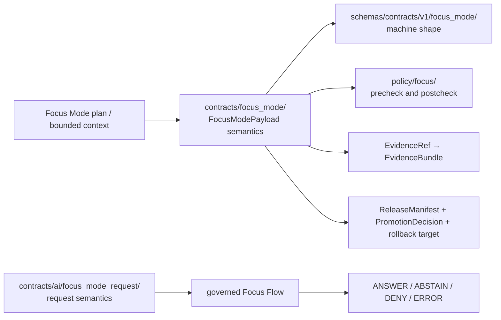

<!-- [KFM_META_BLOCK_V2]
doc_id: kfm://doc/contracts-focus-mode-readme
title: contracts/focus_mode — Focus Mode Semantic Contract Lane README
type: readme
version: v0.1
status: draft
owners: OWNER_TBD — Focus Mode steward · Governed AI steward · Contract steward · Schema steward · Policy steward · Evidence steward · Docs steward
created: 2026-06-24
updated: 2026-06-24
policy_label: public; contracts; focus-mode; semantic-contracts; governed-ai; evidence-bounded
related:
  - ../README.md
  - ./focus_mode_payload.md
  - ../ai/focus_mode_request/README.md
  - ../../docs/architecture/governed-ai/FOCUS_FLOW.md
  - ../../docs/architecture/governed-ai/ADAPTER_CONTRACT.md
  - ../../schemas/contracts/v1/focus_mode/
  - ../../schemas/contracts/v1/focus/
  - ../../policy/focus/
  - ../../data/receipts/ai/
  - ../../data/proofs/
  - ../../release/
tags: [kfm, contracts, focus-mode, governed-ai, evidence-bundle, policy-decision, citation-validation, finite-outcome, semantic-contracts]
notes:
  - "Directory README for `contracts/focus_mode/`, the payload-side Focus Mode semantic contract lane."
  - "Request intake semantics are handled by `contracts/ai/focus_mode_request/`; this lane documents Focus Mode payload/projection semantics."
  - "Contracts define meaning; schemas define machine shape; policy gates admissibility; receipts/proofs/release records remain separate object families."
  - "Previous file content was blank; rollback target is blob SHA `8b137891791fe96927ad78e64b0aad7bded08bdc`."
[/KFM_META_BLOCK_V2] -->

# contracts/focus_mode

> Semantic contract lane for Focus Mode payloads and trust-visible projections: how bounded plans, map context, evidence, policy, release state, and finite outcomes become public-safe Focus Mode carriers.

  
  
  
  
  
  

**Status:** draft  
**Owners:** `OWNER_TBD` — Focus Mode steward · Governed AI steward · Contract steward · Schema steward · Policy steward · Evidence steward · Docs steward  
**Path:** `contracts/focus_mode/README.md`  
**Primary contract in this lane:** [`focus_mode_payload.md`](./focus_mode_payload.md)  
**Request intake sibling:** [`../ai/focus_mode_request/README.md`](../ai/focus_mode_request/README.md)  
**Truth posture:** CONFIRMED lane files exist · PROPOSED implementation details · NEEDS VERIFICATION for schemas, validators, routes, CI, receipts, and release workflow behavior

## Quick jumps

[Scope](#scope) · [Repo fit](#repo-fit) · [Accepted inputs](#accepted-inputs) · [Exclusions](#exclusions) · [Lane map](#lane-map) · [Contract responsibilities](#contract-responsibilities) · [Finite outcomes](#finite-outcomes) · [Authoring checklist](#authoring-checklist) · [Validation](#validation) · [Rollback](#rollback)

---

## Scope

`contracts/focus_mode/` owns **semantic Markdown contracts** for Focus Mode payload and projection meaning.

A Focus Mode payload is a downstream governed carrier. It may help the public UI or Evidence Drawer present a bounded slice of released or review-authorized evidence, but it is not the evidence root, policy authority, release authority, source registry, model output, or public permission by itself.

This lane is for payload-side semantics such as:

- what a `FocusModePayload` means;
- how a plan, layer registry, map context, claims, evidence, policy decisions, release state, and rollback references are projected into a public-safe payload;
- which companion objects must exist before payload publication;
- what finite outcomes are allowed;
- what anti-patterns invalidate a Focus Mode payload.

> [!IMPORTANT]
> **A Focus Mode contract does not authorize an answer.** `EvidenceBundle`, `PolicyDecision`, review state, release state, citation validation, and rollback support outrank generated language, UI payloads, screenshots, tiles, graph projections, and summaries.

---

## Repo fit

The root `contracts/` README defines contracts as the home for semantic meaning: contracts say what objects mean, while schemas say what objects look like. This Focus Mode lane inherits that split.

| Responsibility | Path | Relationship to this README |
|---|---|---|
| Root contract rule | [`../README.md`](../README.md) | Defines contract vs. schema/policy/test split. |
| Payload semantic contract | [`./focus_mode_payload.md`](./focus_mode_payload.md) | Main object-family contract in this lane. |
| Request-side contract | [`../ai/focus_mode_request/README.md`](../ai/focus_mode_request/README.md) | Describes Focus Mode request intake; not payload projection. |
| Focus Flow doctrine | `../../docs/architecture/governed-ai/FOCUS_FLOW.md` | Defines governed request → policy → evidence → adapter → citation → policy → envelope flow. |
| Machine schemas | `../../schemas/contracts/v1/focus_mode/`, `../../schemas/contracts/v1/focus/` | Shape authority; linked only. |
| Focus policy | `../../policy/focus/` | Precheck/postcheck and release/sensitivity decisions; linked only. |
| Proof and receipts | `../../data/proofs/`, `../../data/receipts/ai/` | Evidence closure and run/AI receipts; linked only. |
| Release state | `../../release/` | Promotion, release manifest, correction, and rollback authority; linked only. |
| Public UI/API | `../../apps/`, `../../packages/` | Delivery/runtime surfaces; never contract authority. |

---

## Accepted inputs

Accepted durable content under `contracts/focus_mode/`:

| Content | Examples | Required posture |
|---|---|---|
| Payload semantic contracts | `focus_mode_payload.md` | Define meaning, not JSON shape. |
| Payload companion contracts | `layer_registry_entry.md`, `map_context_projection.md`, `trust_visible_state.md` if added later | PROPOSED until reviewed; avoid duplicating cross-domain object families. |
| Lane README | `README.md` | Explain ownership, boundaries, and drift prevention. |
| Migration notes | `MIGRATION.md` if needed | Only when consolidating `contracts/focus_mode/` with AI/request contract paths. |

Every contract in this lane should answer:

1. What does the Focus Mode object mean?
2. What claim, payload, or UI projection can it support?
3. What does it explicitly **not** authorize?
4. Which schema defines its machine shape?
5. Which policy gates admissibility and display?
6. Which evidence, citation, receipt, release, correction, and rollback references must resolve?

---

## Exclusions

| Does not belong here | Correct home | Reason |
|---|---|---|
| JSON Schema | `../../schemas/contracts/v1/focus_mode/` or accepted schema home | Schemas define machine shape. |
| Focus request intake semantics | `../ai/focus_mode_request/` | Request contract is separate from payload projection. |
| Prompt templates | accepted template registry/config home | Prompt text is runtime configuration, not object meaning. |
| Model adapter code | `../../apps/`, `../../packages/`, or accepted governed-AI implementation root | Runtime behavior is not a contract document. |
| Policy precheck/postcheck rules | `../../policy/focus/` | Policy owns allow/deny/restrict/abstain decisions. |
| EvidenceBundle contents | `../../data/proofs/` or accepted evidence/proof home | Evidence is not stored inside contracts. |
| AIReceipt / run receipts | `../../data/receipts/ai/` or accepted receipt home | Receipts are emitted audit artifacts. |
| Published payload JSON | `../../data/published/` after release gates | Publication is a governed state transition. |
| API route implementations | governed API roots under `../../apps/` | Routes are executable delivery surfaces. |
| Public UI components | explorer/UI roots under `../../apps/` or `../../packages/` | UI is a downstream carrier, not authority. |
| Direct browser-to-model access | nowhere | Forbidden by the governed-AI trust membrane. |

---

## Lane map

---

## Contract responsibilities

Focus Mode payload contracts must preserve these rules:

### 1. Payloads are downstream carriers

A `FocusModePayload` can carry released layer references, evidence-backed claims, source attributions, sensitivity labels, stale markers, and bounded AI context. It does not become root truth.

### 2. Evidence closure comes before display

Every consequential claim exposed by a Focus Mode payload must resolve `EvidenceRef → EvidenceBundle`. Missing, stale, conflicted, or unvalidated evidence yields `ABSTAIN`, not a best-effort claim.

### 3. Policy gates are visible

Layers, claims, and AI context must carry or reference policy posture. Missing or failed policy checks produce `DENY`, `ABSTAIN`, or `ERROR` rather than silent omission.

### 4. Public clients use governed surfaces

Public UI surfaces consume governed API payloads, released artifacts, catalog/layer records, tile services, and EvidenceBundle-backed envelopes. They must not read RAW, WORK, QUARANTINE, unpublished candidates, direct model output, canonical stores, private graph/vector stores, or credentials.

### 5. AI stays interpretive

Generated language may summarize or explain released evidence, but it must remain subordinate to evidence, policy, review state, release state, and citation validation.

---

## Finite outcomes

Focus Mode contracts use the closed public outcome set:

| Outcome | Payload-side meaning |
|---|---|
| `ANSWER` | Evidence resolves, policy allows, release/review state permits, citations validate, and display is allowed. |
| `ABSTAIN` | Evidence is missing, stale, conflicted, unsupported, or citation validation cannot support the requested claim. |
| `DENY` | Rights, sensitivity, source terms, release state, review state, audience posture, or policy forbids the requested exposure. |
| `ERROR` | Input, schema, resolver, adapter, citation, policy, or infrastructure failure prevents safe evaluation. |

Unknown outcomes fail closed.

---

## Authoring checklist

Before adding or revising a Focus Mode contract:

- [ ] Confirm the object belongs in `contracts/focus_mode/`, not `contracts/ai/focus_mode_request/` or a cross-domain root.
- [ ] Confirm the file is semantic Markdown, not JSON Schema, policy, fixture, test, data, release, or runtime code.
- [ ] Link the paired schema home when known.
- [ ] State which evidence, policy, citation, release, receipt, correction, and rollback objects must resolve.
- [ ] State failure behavior using `ANSWER`, `ABSTAIN`, `DENY`, or `ERROR`.
- [ ] Preserve the rule that public clients do not read RAW, WORK, QUARANTINE, unpublished candidates, canonical stores, or direct model output.
- [ ] Mark route names, package paths, schemas, validators, fixtures, policy bundles, receipts, CI behavior, and runtime behavior as `NEEDS VERIFICATION` unless directly proven.
- [ ] Avoid adding prompt text, model-provider assumptions, or implementation shortcuts to semantic contracts.

---

## Validation

This README is valid when:

- it keeps `contracts/focus_mode/` narrowed to semantic payload/projection contracts;
- request intake remains separate under `contracts/ai/focus_mode_request/` unless an ADR consolidates the paths;
- schemas, policy, fixtures, tests, receipts, data, release records, and runtime code remain in their owning responsibility roots;
- Focus Mode payload claims remain evidence-backed and cite-or-abstain;
- public clients remain behind governed API and released-artifact boundaries;
- unknown outcomes, missing evidence, missing policy, or direct model paths fail closed.

---

## Evidence basis

| Source | Status | Supports | Limits |
|---|---|---|---|
| `contracts/focus_mode/README.md` before this edit | CONFIRMED repo evidence | Target file existed but was blank. | No lane guidance before this edit. |
| `contracts/README.md` | CONFIRMED repo evidence | Contracts define semantic meaning; schemas define machine shape. | Does not define Focus Mode-specific pathing. |
| `contracts/focus_mode/focus_mode_payload.md` | CONFIRMED repo evidence | Existing Focus Mode payload semantic contract and finite outcome posture. | Some schema homes and implementation references are PROPOSED / NEEDS VERIFICATION. |
| `contracts/ai/focus_mode_request/README.md` | CONFIRMED repo evidence | Separates request intake semantics from payload projection; finite outcomes and governed flow. | Does not replace payload-side contract lane. |
| `docs/architecture/governed-ai/FOCUS_FLOW.md` | CONFIRMED repo evidence | Focus Mode flow is evidence-bounded and forbids browser-to-model shortcuts. | Route names, module paths, and runtime implementation remain PROPOSED. |

---

## Rollback

Rollback is required if this README is used to justify schema authority, policy authority, prompt authority, direct model access, public RAW/WORK/QUARANTINE access, released-payload publication without gates, or runtime behavior claims not supported by implementation evidence.

Rollback target: initial blank file blob SHA `8b137891791fe96927ad78e64b0aad7bded08bdc`.

<a href="#top">Back to top</a>

