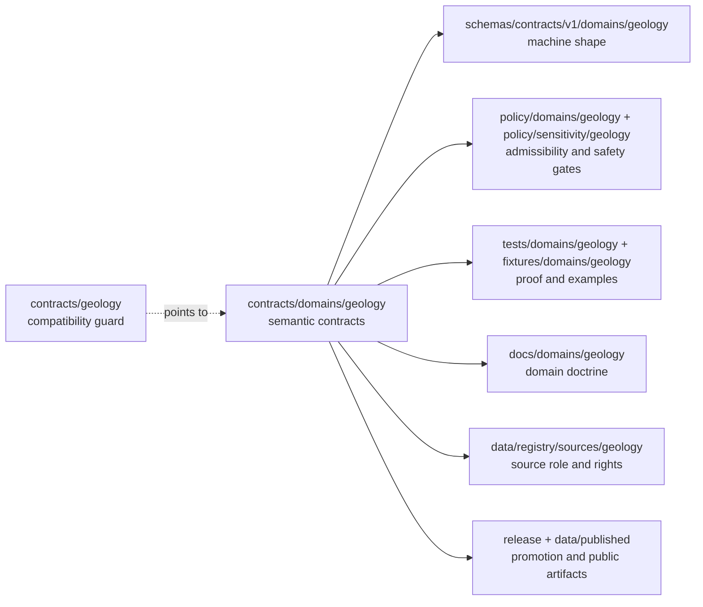

<!-- [KFM_META_BLOCK_V2]
doc_id: kfm://doc/contracts-geology-compat-readme
title: contracts/geology — Geology Contract Compatibility README
type: readme
version: v0.1
status: draft
owners: OWNER_TBD — Geology steward · Contract steward · Docs steward · Directory Rules reviewer
created: 2026-06-24
updated: 2026-06-24
policy_label: public; contracts; geology; compatibility; no-parallel-authority
related:
  - ../README.md
  - ../domains/geology/README.md
  - ../../docs/domains/geology/README.md
  - ../../docs/domains/geology/CANONICAL_PATHS.md
  - ../../docs/domains/geology/SOURCE_ROLE_MATRIX.md
  - ../../schemas/contracts/v1/domains/geology/
  - ../../policy/domains/geology/
  - ../../policy/sensitivity/geology/
  - ../../tests/domains/geology/
  - ../../fixtures/domains/geology/
  - ../../data/registry/sources/geology/
tags: [kfm, contracts, geology, compatibility, semantic-contracts, source-role, natural-resources, no-parallel-authority]
notes:
  - "Compatibility pointer for the legacy/requested `contracts/geology/` path."
  - "The canonical semantic contract lane is `contracts/domains/geology/` unless an accepted ADR changes Directory Rules."
  - "Do not place schemas, policy, fixtures, data, release records, runtime code, source registries, map tiles, API payloads, UI code, or AI output here."
  - "Previous file content was a placeholder; rollback target is blob SHA `e25f1814e51579d5f55c0f1fe0135ddb28a47f4a`."
[/KFM_META_BLOCK_V2] -->

# contracts/geology

> Compatibility guard for the legacy Geology contract path; use [`contracts/domains/geology/`](../domains/geology/) for canonical Geology semantic contracts.

  
  
  
  
  

**Status:** draft compatibility guard  
**Owners:** `OWNER_TBD` — Geology steward · Contract steward · Docs steward · Directory Rules reviewer  
**Path:** `contracts/geology/README.md`  
**Canonical semantic contract lane:** [`../domains/geology/`](../domains/geology/)  
**Truth posture:** CONFIRMED placeholder replaced · CONFIRMED canonical Geology domain contract lane exists · PROPOSED cleanup until maintainer review

## Quick jumps

[Scope](#scope) · [Repo fit](#repo-fit) · [Accepted inputs](#accepted-inputs) · [Exclusions](#exclusions) · [Compatibility flow](#compatibility-flow) · [Geology trust rules](#geology-trust-rules) · [Migration checklist](#migration-checklist) · [Rollback](#rollback)

---

## Scope

`contracts/geology/` is **not** the canonical Geology contract lane.

This README exists so a legacy, mistaken, or user-requested path does not silently become a second contract authority. New Geology semantic contract work belongs in [`contracts/domains/geology/`](../domains/geology/), where contract files define object-family meaning while remaining separate from schemas, policy, fixtures, lifecycle data, source registries, release records, runtime code, map/API/UI code, and AI output.

> [!IMPORTANT]
> **Do not add Geology object contracts here.** If a contract defines the meaning of a geologic unit, lithology, age, structure, borehole reference, core sample, geophysical observation, mineral occurrence, resource estimate, extraction site, boundary version, or another Geology object family, place it under `contracts/domains/geology/` unless an accepted ADR changes the Directory Rules pattern.

---

## Repo fit

Directory placement is part of KFM governance. This file is a pointer at a drift-prone path, not a new authority root.

| Responsibility | Canonical or expected path | This file's role |
|---|---|---|
| Root contract purpose | [`../README.md`](../README.md) | Inherits the contract/schemas/policy split. |
| Geology semantic contracts | [`../domains/geology/`](../domains/geology/) | Points there; does not duplicate it. |
| Geology domain doctrine | [`../../docs/domains/geology/`](../../docs/domains/geology/) | Linked domain context only. |
| Machine schemas | `../../schemas/contracts/v1/domains/geology/` | Shape authority; not owned here. |
| Geology policy | `../../policy/domains/geology/` | Admissibility and release authority; not owned here. |
| Sensitivity policy | `../../policy/sensitivity/geology/` | Public-safety tiering; not owned here. |
| Tests and fixtures | `../../tests/domains/geology/`, `../../fixtures/domains/geology/` | Proof and examples; not owned here. |
| Source registry | `../../data/registry/sources/geology/` | Source identity, role, cadence, rights, and authority limits; not owned here. |
| Lifecycle data | `../../data/<phase>/geology/` | RAW/WORK/QUARANTINE/PROCESSED/CATALOG/PUBLISHED records; not owned here. |
| Release and rollback | `../../release/candidates/geology/`, `../../release/manifests/geology/` | Promotion and rollback authority; not owned here. |

The clean split is:

- `contracts/` defines **semantic meaning**.
- `schemas/contracts/v1/` defines **machine-checkable shape**.
- `policy/` decides **allow / deny / restrict / abstain**.
- `tests/` and `fixtures/` prove the rules are enforceable.
- `data/` stores lifecycle records and emitted evidence-bearing artifacts.
- `release/` records promotion, manifests, correction, and rollback decisions.

---

## Accepted inputs

Only these belong under `contracts/geology/` while this compatibility path exists:

| Accepted item | Purpose | Status |
|---|---|---|
| `README.md` | Compatibility guard and redirect to `contracts/domains/geology/`. | Accepted |
| Short migration note | Temporary note explaining how any misplaced file was moved. | Allowed only during cleanup |
| Backlink audit note | Temporary note listing inbound references to this legacy path. | Allowed only during cleanup |

No other durable content should be added here.

---

## Exclusions

| Do not put this here | Correct home | Reason |
|---|---|---|
| Geology object contract Markdown | `../domains/geology/` | Avoids parallel semantic authority. |
| `.schema.json` files | `../../schemas/contracts/v1/domains/geology/` | Schemas own machine shape. |
| Policy bundles | `../../policy/domains/geology/`, `../../policy/sensitivity/geology/` | Policy owns admissibility and release gates. |
| Source descriptors or source records | `../../data/registry/sources/geology/` | Source identity, role, cadence, rights, and terms belong in the registry. |
| RAW / WORK / QUARANTINE / PROCESSED records | `../../data/<phase>/geology/` | Lifecycle data is never contract meaning. |
| Published artifacts, tiles, or layer bundles | `../../data/published/`, `../../release/` | Publication is a governed state transition. |
| Tests, fixtures, or validators | `../../tests/domains/geology/`, `../../fixtures/domains/geology/`, `../../tools/validators/` | Proof and execution do not live in contracts. |
| API, map, UI, or AI code | `../../apps/`, `../../packages/`, `../../pipelines/` | Delivery and runtime surfaces are downstream carriers, not contract authority. |

> [!WARNING]
> A second Geology contract lane at `contracts/geology/` would make future review harder and could let stale semantic rules diverge from `contracts/domains/geology/`. Treat new content here as drift unless it is only a pointer, migration note, or cleanup note.

---

## Compatibility flow

---

## Geology trust rules

Geology contract meaning is not publication permission.

A Geology semantic contract may define object meaning, anti-collapse boundaries, and expected evidence posture. It does not by itself prove a source, authorize map exposure, publish a resource claim, reveal restricted operational detail, or turn an interpretation into measured fact.

Minimum trust posture:

- source roles must stay visible: observed, interpreted, modeled, aggregate, derived, and context records must not collapse into one authority class;
- occurrence, deposit, estimate, extraction, reclamation, boundary, and subsurface-reference objects must remain semantically distinct unless an ADR/schema decision says otherwise;
- public map/API/UI surfaces must consume released or review-authorized artifacts through governed interfaces;
- AI summaries must remain downstream of EvidenceBundle, PolicyDecision, review state, release state, citation validation, correction, and rollback support;
- unknown authority, rights, sensitivity, or release state must fail closed with `ABSTAIN`, `DENY`, or `ERROR` rather than a polished unsupported claim.

---

## Migration checklist

When a file is found under `contracts/geology/`:

- [ ] Confirm whether it is only this compatibility README.
- [ ] If it is semantic Markdown, move it to `contracts/domains/geology/` after checking for an existing canonical sibling.
- [ ] If it is JSON Schema, move it to `schemas/contracts/v1/domains/geology/`.
- [ ] If it is policy, move it to `policy/domains/geology/` or `policy/sensitivity/geology/`.
- [ ] If it is a fixture or test, move it to the appropriate `fixtures/` or `tests/` lane.
- [ ] If it is source-registry content, move it to `data/registry/sources/geology/`.
- [ ] If it is data, identify the lifecycle phase before moving it under `data/<phase>/geology/`.
- [ ] If it is release-related, move it to `release/` or the appropriate published-artifact location.
- [ ] Record naming drift rather than creating duplicate object identities.
- [ ] Preserve history with `git mv` where possible.
- [ ] Keep rollback notes for any moved file.

---

## Verification checklist

- [ ] `contracts/geology/` contains no durable object contracts beyond this pointer README.
- [ ] `contracts/domains/geology/README.md` remains the canonical Geology contract-lane guide.
- [ ] No schema, policy, source registry, fixture, data artifact, release manifest, runtime code, API code, map UI code, or AI output is normalized here.
- [ ] Inbound links to `contracts/geology/` are either corrected or intentionally routed through this compatibility guard.
- [ ] Source-role and object-family anti-collapse language remains evidence-subordinate.
- [ ] Cleanup is reviewed by the Geology steward, Contract steward, Docs steward, and Directory Rules reviewer.

---

## Rollback

Rollback is required if this compatibility guard is used to justify keeping new contract authority under `contracts/geology/`, if it weakens the canonical `contracts/domains/geology/` lane, or if it obscures where schemas, policy, evidence, source registries, fixtures, release records, runtime code, public artifacts, or maps belong.

Rollback target for this replacement: previous placeholder blob SHA `e25f1814e51579d5f55c0f1fe0135ddb28a47f4a`.

<a href="#top">Back to top</a>

