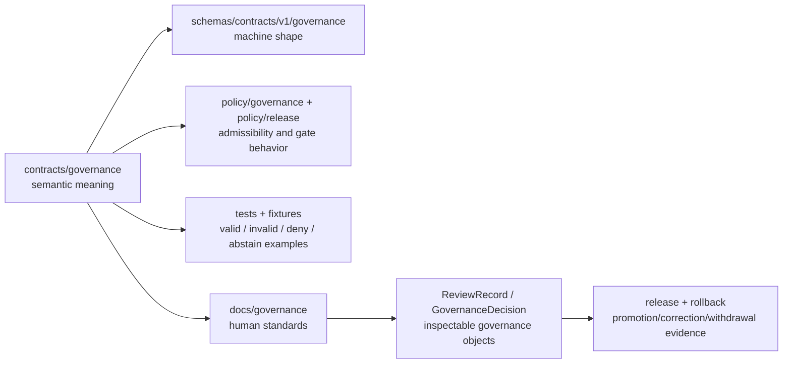

<!-- [KFM_META_BLOCK_V2]
doc_id: kfm://doc/contracts-governance-readme
title: contracts/governance — Governance Semantic Contract Lane README
type: readme
version: v0.1
status: draft
owners: OWNER_TBD — Governance steward · Contract steward · Policy steward · Release steward · Docs steward · Directory Rules reviewer
created: 2026-06-24
updated: 2026-06-24
policy_label: public; contracts; governance; semantic-contracts; review; stewardship; separation-of-duties
related:
  - ../README.md
  - ../release/README.md
  - ../../docs/governance/SEPARATION_OF_DUTIES.md
  - ../../docs/governance/ESCALATION.md
  - ../../docs/architecture/contract-schema-policy-split.md
  - ../../docs/architecture/release-model.md
  - ../../docs/architecture/publication/RELEASE_GATES.md
  - ../../docs/registers/DRIFT_REGISTER.md
  - ../../docs/registers/VERIFICATION_BACKLOG.md
  - ../../schemas/contracts/v1/governance/
  - ../../schemas/contracts/v1/release/
  - ../../policy/governance/
  - ../../policy/release/
  - ../../tests/contracts/
  - ../../fixtures/
tags: [kfm, contracts, governance, semantic-contracts, stewardship, review-record, policy-decision, separation-of-duties, escalation, release-gates, rollback, auditability]
notes:
  - "Directory README for the `contracts/governance/` semantic contract family."
  - "This file defines ownership boundaries for governance object meaning only; schemas, policy, tests, fixtures, release artifacts, CODEOWNERS, branch protections, workflows, and runtime enforcement remain outside this folder."
  - "Release object contracts live under `contracts/release/`; governance contracts may reference them but should not duplicate release semantics."
  - "Previous file content was a short stub; rollback target is blob SHA `9dad550add810a01d9ecc78748d356fff65a04a7`."
[/KFM_META_BLOCK_V2] -->

# contracts/governance

> Semantic contract lane for KFM governance object meaning: stewardship, review, escalation, separation-of-duties, drift handling, verification backlog, and governance decisions that support evidence-first release and correction.

  
  
  
  
  
  

**Status:** draft  
**Owners:** `OWNER_TBD` — Governance steward · Contract steward · Policy steward · Release steward · Docs steward · Directory Rules reviewer  
**Path:** `contracts/governance/README.md`  
**Adjacent release contract lane:** [`../release/`](../release/)  
**Truth posture:** CONFIRMED target path existed as a stub · CONFIRMED contract/schema/policy split · CONFIRMED governance docs exist · PROPOSED object roster until matching schemas, policies, tests, and fixtures are verified

## Quick jumps

[Scope](#scope) · [Repo fit](#repo-fit) · [Governance vs release](#governance-vs-release) · [Accepted inputs](#accepted-inputs) · [Exclusions](#exclusions) · [Proposed object families](#proposed-object-families) · [Trust path](#trust-path) · [Authoring checklist](#authoring-checklist) · [Validation](#validation) · [Rollback](#rollback)

---

## Scope

`contracts/governance/` owns **semantic Markdown contracts** for governance object meaning.

Governance contracts explain what a governance object means, what role it plays in the KFM trust spine, what companion evidence or receipts it must reference, and what it must not be confused with. They do not implement governance enforcement.

This lane is for object meanings such as:

- `ReviewRecord` — an inspectable review event and reviewer posture;
- `GovernanceDecision` — a decision about stewardship, escalation, exception, or rule interpretation;
- `EscalationRecord` — a documented handoff when normal review is insufficient;
- `StewardshipAssignment` — responsibility assignment for a domain, source, contract, schema, policy, or release surface;
- `DriftRecord` — a tracked divergence between doctrine, repo layout, schemas, policy, implementation, or artifacts;
- `VerificationBacklogItem` — a known checkable uncertainty that must not be treated as proof;
- `SeparationOfDutiesRecord` — evidence that author, reviewer, approver, release authority, or sensitivity reviewer roles were separated where required.

> [!IMPORTANT]
> Governance contracts do **not** replace `policy/`, release gates, branch protection, CODEOWNERS, CI, ADRs, review records, or actual approvals. They define object meaning so those mechanisms can be inspected and validated.

---

## Repo fit

The root `contracts/` README defines contracts as the semantic layer: contracts say what objects mean; schemas say what objects look like. Governance follows that split.

| Responsibility | Path | Relationship to this README |
|---|---|---|
| Root contract rule | [`../README.md`](../README.md) | Establishes Markdown object meaning and excludes schemas, policy code, validation, and source data. |
| Governance contract meaning | `contracts/governance/` | This lane; semantic Markdown only. |
| Governance documentation | `../../docs/governance/` | Human-facing standards such as separation of duties and escalation. |
| Architecture split | `../../docs/architecture/contract-schema-policy-split.md` | Explains meaning/shape/admissibility/proof separation. |
| Release semantics | [`../release/`](../release/) | Release decision, manifest, rollback, correction, withdrawal contract family. |
| Machine schemas | `../../schemas/contracts/v1/governance/` | Proposed shape authority; NEEDS VERIFICATION until files are confirmed. |
| Governance policy | `../../policy/governance/` | Proposed admissibility/enforcement rule home; NEEDS VERIFICATION. |
| Release policy | `../../policy/release/` | Release gate behavior; separate from semantic meaning. |
| Tests and fixtures | `../../tests/contracts/`, `../../fixtures/` | Proof and examples; not contract authority. |
| Registers | `../../docs/registers/` | Human-facing drift and verification tracking; may inform contracts but does not replace schemas/policy. |
| Workflows and enforcement | `.github/`, CI, branch protection, CODEOWNERS | Implementation/evidence layer; not owned by contracts. |

---

## Governance vs release

Governance and release are adjacent but not identical.

| Concern | Governance lane | Release lane |
|---|---|---|
| Main question | Who decided, reviewed, escalated, or accepted responsibility? | What was promoted, published, corrected, withdrawn, or rolled back? |
| Contract home | `contracts/governance/` | `contracts/release/` |
| Typical objects | `ReviewRecord`, `GovernanceDecision`, `EscalationRecord`, `DriftRecord`, `VerificationBacklogItem`, `StewardshipAssignment` | `release_manifest`, `promotion_decision`, `rollback_card`, `correction_notice`, `withdrawal_notice` |
| Failure posture | Missing or conflicted governance evidence blocks trust-bearing action or marks it NEEDS VERIFICATION. | Missing release evidence blocks publication or rollback confidence. |
| Anti-collapse rule | A governance review is not a release manifest. | A release manifest is not proof that SoD or governance review was sufficient. |

Release contracts may reference governance records, and governance contracts may require release objects, but neither lane should duplicate the other.

---

## Accepted inputs

Accepted durable content under `contracts/governance/`:

| Content | Examples | Required posture |
|---|---|---|
| Directory README | `README.md` | Defines lane boundaries and drift prevention. |
| Governance object contracts | `review_record.md`, `governance_decision.md`, `escalation_record.md` | Semantic Markdown only; pair with schemas later. |
| Contract-level field semantics | Meaning tables for actor, role, decision, reason, evidence, review scope, and timestamps | PROPOSED until machine schema enforces fields. |
| Anti-collapse notes | Review vs approval; governance decision vs policy decision; drift record vs issue; verification item vs evidence | Required for trust-bearing objects. |
| Validation backlog | What schemas, policies, fixtures, tests, and workflows must exist before relying on the object | Must not claim implementation without proof. |
| Migration notes | `MIGRATION.md` if governance objects move or split | Temporary or versioned; must preserve rollback. |

---

## Exclusions

| Does not belong here | Correct home | Reason |
|---|---|---|
| JSON Schema | `../../schemas/contracts/v1/governance/` | Schemas define machine-checkable shape. |
| Policy-as-code | `../../policy/governance/`, `../../policy/release/` | Policy decides allow/deny/restrict/abstain and gate behavior. |
| Release object contracts | `../release/` | Release has its own semantic lane. |
| ADR text | `../../docs/adr/` | ADRs record accepted decisions; contracts define object meaning. |
| Governance standards | `../../docs/governance/` | Standards explain rules and process to humans. |
| Registers | `../../docs/registers/` or accepted register home | Registers track live drift/backlog, not object-family meaning. |
| CODEOWNERS / branch protection / workflow config | `.github/` and platform settings | Enforcement is implementation/configuration, not semantic contract prose. |
| Tests, fixtures, validators | `../../tests/`, `../../fixtures/`, `../../tools/validators/` | Proof and execution do not live in contracts. |
| Release artifacts | `../../release/`, `../../data/published/` | Publication is a governed state transition, not a contract file. |
| Source data or lifecycle data | `../../data/<phase>/...` | Data lifecycle records are not governance semantics. |

---

## Proposed object families

The following roster is **PROPOSED** until matching schema, policy, fixture, and test evidence is verified.

| Object family | Semantic meaning | Must not collapse into |
|---|---|---|
| `ReviewRecord` | A review event with actor, role, scope, finding, evidence refs, requested changes, and disposition. | GitHub comment, informal approval, release manifest, policy decision. |
| `GovernanceDecision` | A documented decision about ownership, escalation, exception, interpretation, or governance posture. | ADR, policy decision, release promotion, generated explanation. |
| `EscalationRecord` | A record that normal review was insufficient and a higher/alternate review path was invoked. | Bug report, chat note, or silent reviewer request. |
| `StewardshipAssignment` | A responsibility assignment for source, domain, contract, schema, policy, release, sensitivity, or docs stewardship. | CODEOWNERS entry alone or a personal memory. |
| `DriftRecord` | A tracked divergence between doctrine, repo structure, schema, policy, implementation, or release artifacts. | TODO comment, issue title, or unreviewed generated note. |
| `VerificationBacklogItem` | A bounded checkable uncertainty that should block overclaiming until verified. | EvidenceBundle, proof, or accepted decision. |
| `SeparationOfDutiesRecord` | Evidence that required governance roles were separated for a trust-bearing action. | ReviewRecord alone or release manifest alone. |
| `ExceptionRecord` | A time-bounded, reviewed exception to a normal governance rule with reason, scope, expiry, and rollback. | Permanent policy change or undocumented shortcut. |

---

## Trust path

---

## Authoring checklist

Before adding or revising a governance contract:

- [ ] Confirm the object belongs in `contracts/governance/`, not `contracts/release/`, `docs/governance/`, `docs/adr/`, `policy/`, or `schemas/`.
- [ ] Define object meaning, not JSON shape or enforcement logic.
- [ ] State actor roles and review burden without claiming CODEOWNERS, branch protection, or CI enforcement unless verified.
- [ ] Link required evidence, policy, release, correction, rollback, and receipt objects where relevant.
- [ ] Define failure behavior for missing review, missing authority, unclear rights, missing rollback, unresolved drift, or unverified implementation.
- [ ] Preserve the rule that publication is a governed state transition, not a file move.
- [ ] Mark schemas, policies, validators, workflows, runtime behavior, and platform settings as NEEDS VERIFICATION until proven.
- [ ] Avoid turning governance prose into approval, release, policy, or proof by itself.

---

## Validation

This README is valid when:

- `contracts/governance/` contains semantic Markdown only;
- machine shape remains in `schemas/contracts/v1/governance/` or an accepted schema home;
- admissibility remains in `policy/`;
- proof remains in `tests/` and `fixtures/`;
- release objects remain in `contracts/release/` and release artifact roots;
- governance standards remain in `docs/governance/`;
- no README text is treated as proof of current implementation, CI enforcement, branch protection, CODEOWNERS coverage, release state, or actual approval.

---

## Evidence basis

| Source | Status | Supports | Limits |
|---|---|---|---|
| `contracts/governance/README.md` before this edit | CONFIRMED repo evidence | Target file existed as a short stub. | No boundary, object roster, or validation guidance before this edit. |
| `contracts/README.md` | CONFIRMED repo evidence | Contracts define semantic meaning and exclude executable validation, JSON Schema, policy code, and source data. | Root README does not define governance-specific object families. |
| `docs/architecture/contract-schema-policy-split.md` | CONFIRMED repo evidence | Meaning, shape, admissibility, and proof are separate layers. | Architecture doc is explanatory, not enforcement. |
| `docs/governance/SEPARATION_OF_DUTIES.md` | CONFIRMED repo evidence | Governance standards describe roles, review burden, lifecycle gates, and non-enforcement boundary. | Role matrix and enforcement depth remain PROPOSED / NEEDS VERIFICATION. |
| `contracts/release/README.md` | CONFIRMED repo evidence | Release semantic lane exists separately for release decisions, manifests, rollback, corrections, and withdrawals. | Release contracts do not replace governance review objects. |

---

## Rollback

Rollback is required if this README is used to justify policy enforcement, release approval, branch protection, CODEOWNERS coverage, CI behavior, public release, or approval state without separate evidence.

Rollback target: previous stub blob SHA `9dad550add810a01d9ecc78748d356fff65a04a7`.

<a href="#top">Back to top</a>

